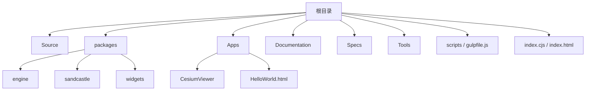
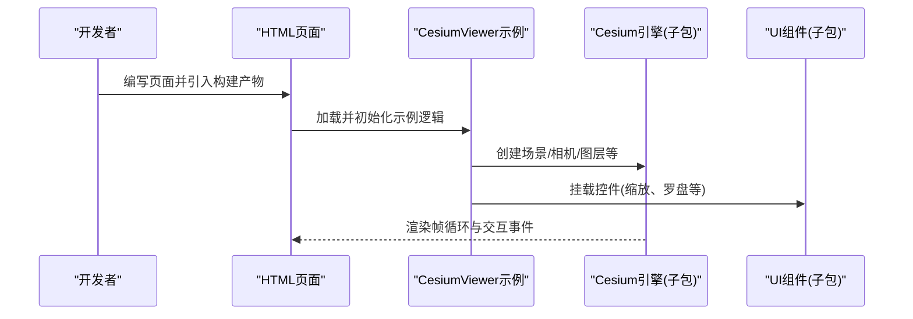
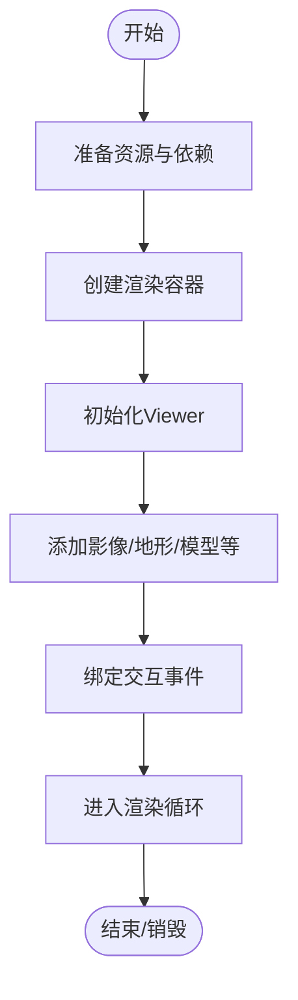
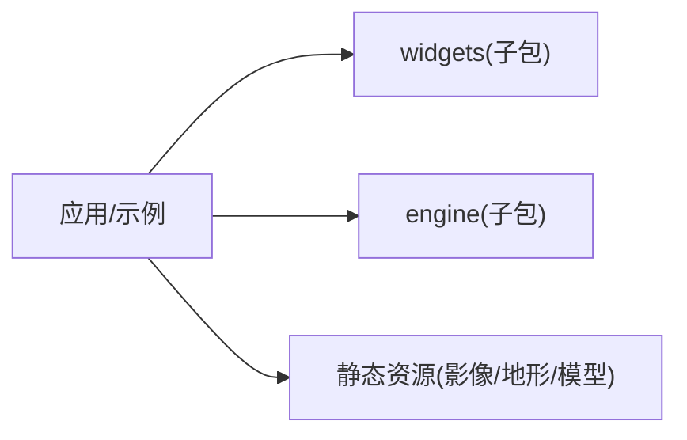

# API参考文档

<cite>
**本文引用的文件**   
- [README.md](file://README.md)
- [package.json](file://package.json)
- [index.cjs](file://index.cjs)
- [index.html](file://index.html)
- [Apps/CesiumViewer/CesiumViewer.js](file://Apps/CesiumViewer/CesiumViewer.js)
- [Apps/HelloWorld.html](file://Apps/HelloWorld.html)
- [Documentation/Contributors/BuildGuide/README.md](file://Documentation/Contributors/BuildGuide/README.md)
- [Documentation/OfflineGuide/README.md](file://Documentation/OfflineGuide/README.md)
- [gulpfile.js](file://gulpfile.js)
- [scripts/build.js](file://scripts/build.js)
</cite>

## 目录
1. [简介](#简介)
2. [项目结构](#项目结构)
3. [核心组件](#核心组件)
4. [架构总览](#架构总览)
5. [详细组件分析](#详细组件分析)
6. [依赖分析](#依赖分析)
7. [性能考虑](#性能考虑)
8. [故障排查指南](#故障排查指南)
9. [结论](#结论)
10. [附录](#附录)

## 简介
本API参考文档面向Cesium工程的使用者与集成者，目标是帮助读者快速理解该仓库的构建产物、入口与示例应用的组织方式，并基于现有代码与文档进行二次开发。由于当前工作区未包含完整的TypeScript声明或JSDoc源码，本文档将严格依据仓库中的实际文件（如入口脚本、示例、构建配置与贡献文档）进行说明，避免臆造接口定义。对于具体类与方法级别的API细节，建议结合官方在线文档与生成后的类型声明使用。

## 项目结构
仓库采用多包与示例分离的结构：
- Source：核心源码（本仓库快照中仅保留版权头模板）
- packages：子包（engine、sandcastle、widgets等）
- Apps：示例与应用（CesiumViewer、HelloWorld）
- Documentation：贡献与离线指南
- Specs：测试数据与测试辅助
- Tools：构建与文档工具链
- scripts/gulpfile：构建流程与任务

图表来源
- [index.cjs](file://index.cjs)
- [index.html](file://index.html)
- [gulpfile.js](file://gulpfile.js)
- [scripts/build.js](file://scripts/build.js)

章节来源
- [README.md](file://README.md)
- [package.json](file://package.json)
- [index.cjs](file://index.cjs)
- [index.html](file://index.html)

## 核心组件
本节概述仓库中与“API”最相关的可观察点：
- 构建产物与入口
  - index.cjs：CommonJS入口，通常用于打包后引入
  - index.html：浏览器端示例入口，演示如何加载Cesium资源
- 示例应用
  - Apps/CesiumViewer/CesiumViewer.js：CesiumViewer示例的主逻辑
  - Apps/HelloWorld.html：最小化示例页面
- 构建与发布
  - gulpfile.js：构建任务编排
  - scripts/build.js：构建脚本
  - Documentation/Contributors/BuildGuide/README.md：构建指南
  - Documentation/OfflineGuide/README.md：离线部署指南

章节来源
- [index.cjs](file://index.cjs)
- [index.html](file://index.html)
- [Apps/CesiumViewer/CesiumViewer.js](file://Apps/CesiumViewer/CesiumViewer.js)
- [Apps/HelloWorld.html](file://Apps/HelloWorld.html)
- [gulpfile.js](file://gulpfile.js)
- [scripts/build.js](file://scripts/build.js)
- [Documentation/Contributors/BuildGuide/README.md](file://Documentation/Contributors/BuildGuide/README.md)
- [Documentation/OfflineGuide/README.md](file://Documentation/OfflineGuide/README.md)

## 架构总览
从运行时的视角，典型浏览器端集成流程如下：

图表来源
- [index.html](file://index.html)
- [Apps/CesiumViewer/CesiumViewer.js](file://Apps/CesiumViewer/CesiumViewer.js)
- [gulpfile.js](file://gulpfile.js)

## 详细组件分析

### 入口与示例应用
- index.cjs
  - 角色：作为CommonJS入口，供Node环境或打包器引入
  - 关注点：导出模块聚合、版本信息暴露（以实际实现为准）
- index.html
  - 角色：浏览器端示例入口，展示如何引入Cesium资源与启动示例
  - 关注点：资源路径、CDN或本地资源切换、基础DOM容器
- Apps/CesiumViewer/CesiumViewer.js
  - 角色：CesiumViewer示例主逻辑
  - 关注点：初始化Viewer、添加图层、处理用户交互、生命周期管理
- Apps/HelloWorld.html
  - 角色：最小化示例，便于快速验证环境

章节来源
- [index.cjs](file://index.cjs)
- [index.html](file://index.html)
- [Apps/CesiumViewer/CesiumViewer.js](file://Apps/CesiumViewer/CesiumViewer.js)
- [Apps/HelloWorld.html](file://Apps/HelloWorld.html)

### 构建与发布
- gulpfile.js
  - 作用：定义构建任务（编译、合并、压缩、复制资源等）
  - 关键流程：读取配置、调用脚本、输出到dist或发布目录
- scripts/build.js
  - 作用：封装构建逻辑，供gulp任务调用
- Documentation/Contributors/BuildGuide/README.md
  - 作用：本地构建步骤、依赖安装、常见问题
- Documentation/OfflineGuide/README.md
  - 作用：离线部署策略、资源下载与路径配置

章节来源
- [gulpfile.js](file://gulpfile.js)
- [scripts/build.js](file://scripts/build.js)
- [Documentation/Contributors/BuildGuide/README.md](file://Documentation/Contributors/BuildGuide/README.md)
- [Documentation/OfflineGuide/README.md](file://Documentation/OfflineGuide/README.md)

### 概念性概览
下图为“浏览器端集成Cesium”的概念流程图，不直接映射到具体源码文件：

[本图为概念流程，无需图表来源]

## 依赖分析
- 运行时依赖
  - 浏览器环境：WebGL、Canvas、ES6+语法
  - Node环境（构建期）：Gulp、Rollup/Babel等（以实际构建脚本为准）
- 包关系
  - packages/engine：图形与场景核心
  - packages/widgets：常用UI控件
  - packages/sandcastle：示例沙盒
- 外部资源
  - 示例可能引用Cesium默认资产（如地球影像、地形），可通过离线指南替换为本地资源

图表来源
- [package.json](file://package.json)
- [Documentation/OfflineGuide/README.md](file://Documentation/OfflineGuide/README.md)

章节来源
- [package.json](file://package.json)
- [Documentation/OfflineGuide/README.md](file://Documentation/OfflineGuide/README.md)

## 性能考虑
- 资源加载
  - 按需加载：优先加载可见区域与近景资源
  - 纹理与几何体压缩：使用合适的格式与LOD
- 渲染优化
  - 减少状态切换：合并绘制批次
  - 合理使用阴影与后处理：根据设备能力动态开关
- 内存管理
  - 及时释放不再使用的对象与纹理
  - 控制同时加载的异步任务数量
- 网络与缓存
  - 启用HTTP缓存与CDN
  - 离线部署时合理组织资源目录

[本节提供通用指导，无需章节来源]

## 故障排查指南
- 无法加载资源
  - 检查资源路径与跨域设置
  - 参考离线指南确认资源是否完整
- 构建失败
  - 核对Node与依赖版本
  - 查看构建日志定位错误位置
- 示例无法运行
  - 确认浏览器支持WebGL
  - 检查控制台报错与网络请求

章节来源
- [Documentation/OfflineGuide/README.md](file://Documentation/OfflineGuide/README.md)
- [Documentation/Contributors/BuildGuide/README.md](file://Documentation/Contributors/BuildGuide/README.md)

## 结论
本仓库提供了Cesium在浏览器端的集成入口、示例与构建体系。通过理解入口文件、示例应用与构建脚本的职责，可以快速搭建本地开发环境并扩展功能。对于具体的API类与方法级细节，建议结合官方在线文档与生成的类型声明进行查阅；本文档聚焦于仓库内可验证的文件与流程，确保与实际实现一致。

[本节为总结，无需章节来源]

## 附录
- 版本兼容性
  - 请参见package.json中的依赖与引擎版本信息
- 废弃API迁移
  - 请参考官方变更日志与迁移指南
- 最佳实践
  - 使用构建产物而非直接引用源码
  - 在大型项目中按功能域拆分模块，统一资源路径管理

章节来源
- [package.json](file://package.json)