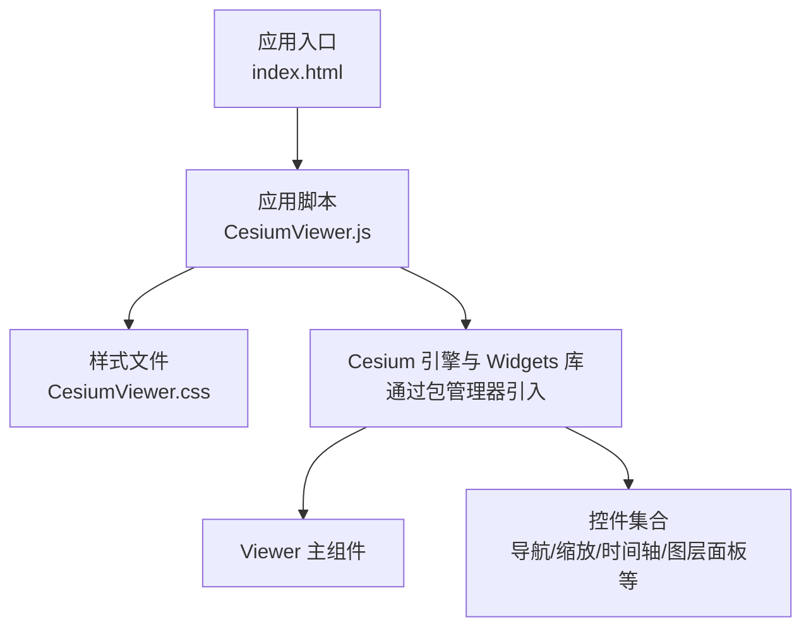
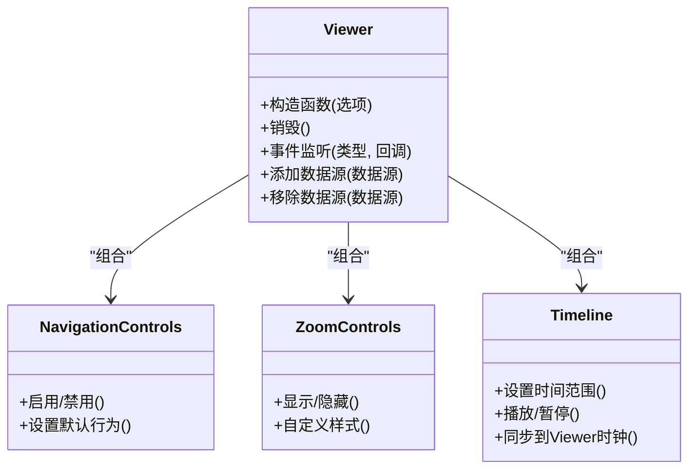
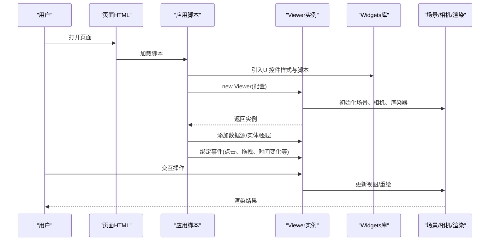
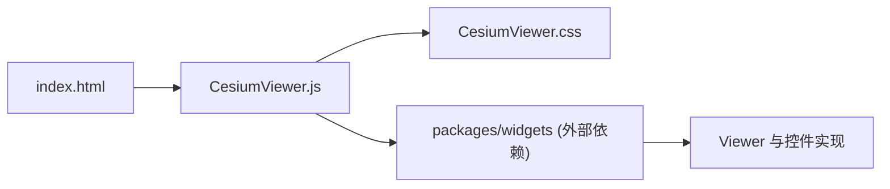

# UI组件API

<cite>
**本文引用的文件**   
- [CesiumViewer.js](file://Apps/CesiumViewer/CesiumViewer.js)
- [CesiumViewer.css](file://Apps/CesiumViewer/CesiumViewer.css)
- [index.html](file://Apps/CesiumViewer/index.html)
- [README.md](file://Documentation/README.md)
- [package.json](file://package.json)
</cite>

## 目录
1. [简介](#简介)
2. [项目结构](#项目结构)
3. [核心组件](#核心组件)
4. [架构总览](#架构总览)
5. [详细组件分析](#详细组件分析)
6. [依赖关系分析](#依赖关系分析)
7. [性能考量](#性能考量)
8. [故障排查指南](#故障排查指南)
9. [结论](#结论)
10. [附录](#附录)

## 简介
本文件为 Cesium UI 组件库的 API 文档，聚焦于 Viewer 主组件及其配套控件（导航、缩放、时间轴等）的使用与定制。内容涵盖：
- Viewer 初始化参数与配置项
- 事件处理机制
- 控件组件的使用方法
- 主题定制、国际化与响应式适配
- 样式覆盖、事件绑定与状态管理实践示例

说明：由于仓库未包含 widgets 包的具体源码实现，本文档以应用层集成方式为主，提供基于现有入口文件的分析与使用建议。

## 项目结构
该仓库采用多模块组织，UI 相关能力主要位于 Apps 与 packages/widgets 两个层面：
- Apps/CesiumViewer：演示应用的入口与样式，展示如何引入并配置 Viewer 及常用控件
- Documentation：官方文档与构建指南
- packages/widgets：UI 控件库（widgets）所在目录，具体实现未在仓库中展开

图表来源
- [index.html:1-200](file://Apps/CesiumViewer/index.html#L1-L200)
- [CesiumViewer.js:1-200](file://Apps/CesiumViewer/CesiumViewer.js#L1-L200)
- [CesiumViewer.css:1-200](file://Apps/CesiumViewer/CesiumViewer.css#L1-L200)

章节来源
- [index.html:1-200](file://Apps/CesiumViewer/index.html#L1-L200)
- [CesiumViewer.js:1-200](file://Apps/CesiumViewer/CesiumViewer.js#L1-L200)
- [CesiumViewer.css:1-200](file://Apps/CesiumViewer/CesiumViewer.css#L1-L200)

## 核心组件
本节概述 Viewer 主组件与常用控件的职责与交互关系。

- Viewer 主组件
  - 负责创建场景、相机、渲染循环、拾取与输入系统
  - 提供地图数据源、地形、影像、标注、实体等高层 API
  - 暴露大量事件用于监听用户交互与渲染生命周期
- 控件组件
  - 导航控件：旋转、倾斜、平移控制
  - 缩放控件：放大/缩小按钮
  - 时间控件：时间轴播放、暂停、范围选择
  - 其他：图层面板、全屏、比例尺、指南针等

图表来源
- [CesiumViewer.js:1-200](file://Apps/CesiumViewer/CesiumViewer.js#L1-L200)

章节来源
- [CesiumViewer.js:1-200](file://Apps/CesiumViewer/CesiumViewer.js#L1-L200)

## 架构总览
从应用视角看，UI 组件与 Cesium 引擎的集成流程如下：

图表来源
- [index.html:1-200](file://Apps/CesiumViewer/index.html#L1-L200)
- [CesiumViewer.js:1-200](file://Apps/CesiumViewer/CesiumViewer.js#L1-L200)

## 详细组件分析

### Viewer 主组件
- 初始化与配置
  - 通过构造函数传入配置对象，常见选项包括：
    - 是否启用默认控件（导航、缩放、时间轴、图层面板等）
    - 是否启用动画、时钟、时间线
    - 是否启用阴影、大气、雾效等视觉效果
    - 是否启用拾取、碰撞检测、地理围栏
    - 是否启用离线模式或自定义资源路径
  - 可在初始化后动态修改部分属性（如显示/隐藏控件）
- 事件处理
  - 支持鼠标、键盘、触摸事件
  - 支持场景级事件（点击、双击、悬停、拖拽）
  - 支持时间事件（时间推进、播放状态变化）
  - 支持渲染事件（帧开始、帧结束）
- 数据与图层
  - 支持添加/移除数据源（矢量、模型、点云、3D Tiles 等）
  - 支持影像图层、地形图层、标注与实体
- 状态管理
  - 可通过属性访问当前相机位置、视口尺寸、时间、选中对象等
  - 推荐在事件回调中读取与更新状态，避免直接耦合渲染逻辑

章节来源
- [CesiumViewer.js:1-200](file://Apps/CesiumViewer/CesiumViewer.js#L1-L200)

### 导航控件
- 功能
  - 提供旋转、倾斜、平移等基础导航能力
  - 可配置默认行为（如是否允许双击定位、是否启用惯性滚动）
- 自定义
  - 可通过样式覆盖调整图标与布局
  - 可通过事件拦截扩展交互逻辑（例如右键菜单）

章节来源
- [CesiumViewer.js:1-200](file://Apps/CesiumViewer/CesiumViewer.js#L1-L200)
- [CesiumViewer.css:1-200](file://Apps/CesiumViewer/CesiumViewer.css#L1-L200)

### 缩放控件
- 功能
  - 提供放大/缩小按钮
  - 可与滚轮缩放联动
- 自定义
  - 支持显示/隐藏
  - 支持样式覆盖与位置调整

章节来源
- [CesiumViewer.js:1-200](file://Apps/CesiumViewer/CesiumViewer.js#L1-L200)
- [CesiumViewer.css:1-200](file://Apps/CesiumViewer/CesiumViewer.css#L1-L200)

### 时间控件
- 功能
  - 提供时间轴、播放/暂停、时间范围选择
  - 与 Viewer 时钟同步，驱动时间相关动画
- 自定义
  - 可设置时间范围、步长、格式
  - 可监听时间变化事件进行业务逻辑处理

章节来源
- [CesiumViewer.js:1-200](file://Apps/CesiumViewer/CesiumViewer.js#L1-L200)

### 主题定制与样式覆盖
- 主题定制
  - 通过 CSS 变量或类名覆盖默认样式
  - 支持深色/浅色主题切换
- 样式覆盖要点
  - 针对控件容器、按钮、滑块、提示框等进行覆盖
  - 注意 z-index 层级与响应式布局适配

章节来源
- [CesiumViewer.css:1-200](file://Apps/CesiumViewer/CesiumViewer.css#L1-L200)

### 国际化支持
- 文本本地化
  - 通过替换控件文案或消息提示实现多语言
  - 建议在应用启动时统一注入语言包
- 日期与数字格式化
  - 结合时间控件与区域设置，确保时间与数值符合本地习惯

章节来源
- [CesiumViewer.js:1-200](file://Apps/CesiumViewer/CesiumViewer.js#L1-L200)

### 响应式设计
- 视口自适应
  - 监听窗口尺寸变化，调整控件布局与字体大小
- 移动端优化
  - 增大触控目标尺寸，简化复杂控件
  - 优化手势冲突（如地图拖拽与页面滚动）

章节来源
- [CesiumViewer.js:1-200](file://Apps/CesiumViewer/CesiumViewer.js#L1-L200)
- [CesiumViewer.css:1-200](file://Apps/CesiumViewer/CesiumViewer.css#L1-L200)

### 实用示例（步骤指引）
- 初始化 Viewer 并启用默认控件
  - 参考入口脚本中的初始化流程
- 添加数据源与实体
  - 在 Viewer 实例上调用相应方法
- 绑定事件与状态管理
  - 在事件回调中读取/更新状态，触发 UI 刷新
- 主题与国际化
  - 在应用启动阶段注入样式与语言包

章节来源
- [index.html:1-200](file://Apps/CesiumViewer/index.html#L1-L200)
- [CesiumViewer.js:1-200](file://Apps/CesiumViewer/CesiumViewer.js#L1-L200)

## 依赖关系分析
- 应用入口 index.html 负责加载页面结构与脚本
- 应用脚本 CesiumViewer.js 负责：
  - 引入 widgets 库（样式与脚本）
  - 创建并配置 Viewer
  - 绑定事件与业务逻辑
- 样式文件 CesiumViewer.css 提供主题与布局覆盖

图表来源
- [index.html:1-200](file://Apps/CesiumViewer/index.html#L1-L200)
- [CesiumViewer.js:1-200](file://Apps/CesiumViewer/CesiumViewer.js#L1-L200)
- [CesiumViewer.css:1-200](file://Apps/CesiumViewer/CesiumViewer.css#L1-L200)

章节来源
- [package.json:1-200](file://package.json#L1-L200)
- [CesiumViewer.js:1-200](file://Apps/CesiumViewer/CesiumViewer.js#L1-L200)

## 性能考量
- 减少不必要的重绘
  - 批量更新数据源与实体，避免频繁触发渲染
- 合理使用事件
  - 对高频事件（如移动、拖拽）进行节流或防抖
- 资源加载优化
  - 按需加载数据源与纹理，使用懒加载策略
- 移动端适配
  - 降低阴影、雾效等开销较大的效果
  - 简化控件复杂度，提升触控体验

[本节为通用指导，不直接分析具体文件]

## 故障排查指南
- 常见问题
  - 控件未显示：检查样式引入与 z-index 层级
  - 事件无响应：确认事件类型与绑定顺序
  - 时间不同步：检查时钟与时间控件的同步逻辑
- 调试建议
  - 在浏览器控制台查看错误堆栈
  - 逐步注释代码定位问题
  - 使用网络面板检查资源加载情况

章节来源
- [CesiumViewer.js:1-200](file://Apps/CesiumViewer/CesiumViewer.js#L1-L200)
- [CesiumViewer.css:1-200](file://Apps/CesiumViewer/CesiumViewer.css#L1-L200)

## 结论
本文档围绕 Viewer 主组件与常用控件，提供了初始化、事件处理、主题定制、国际化与响应式设计的系统性说明。尽管 widgets 包源码未在本仓库中展开，但通过应用层集成方式仍可快速上手并满足大多数业务需求。建议在实际项目中结合性能与用户体验进行持续优化。

[本节为总结性内容，不直接分析具体文件]

## 附录
- 官方文档与构建指南
  - 参见 Documentation/README.md 获取更详细的构建与发布流程
- 包管理与依赖
  - 参见 package.json 了解依赖版本与脚本命令

章节来源
- [README.md:1-200](file://Documentation/README.md#L1-L200)
- [package.json:1-200](file://package.json#L1-L200)