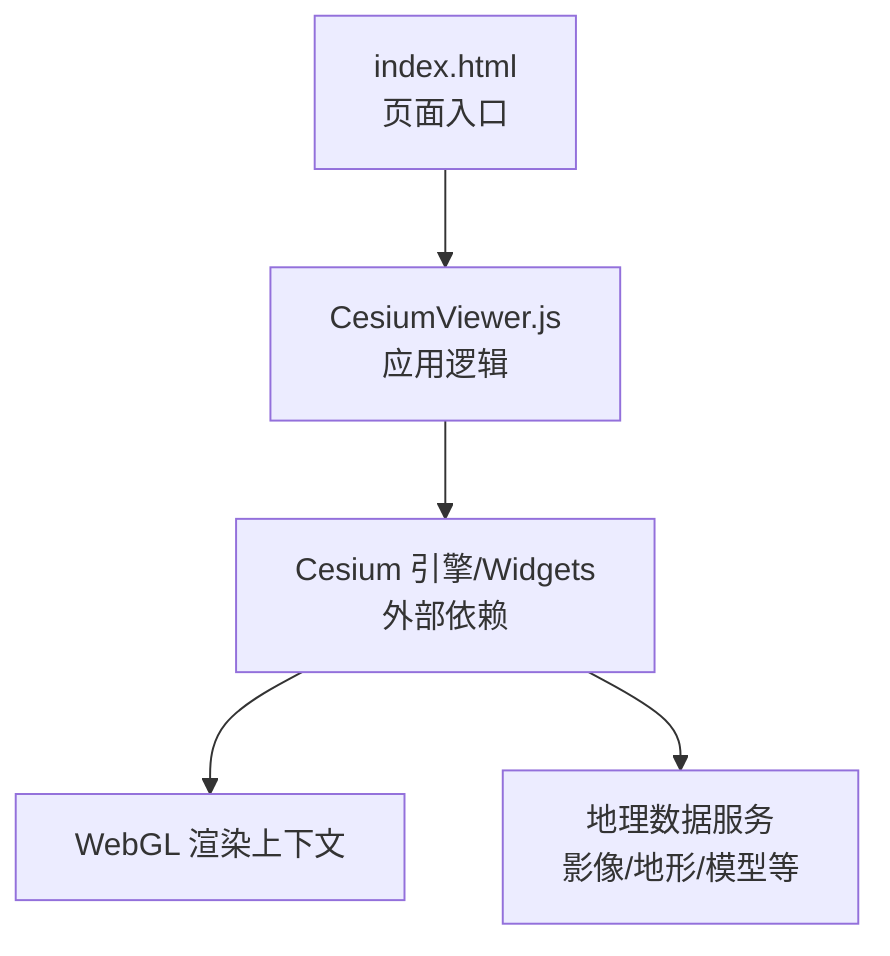
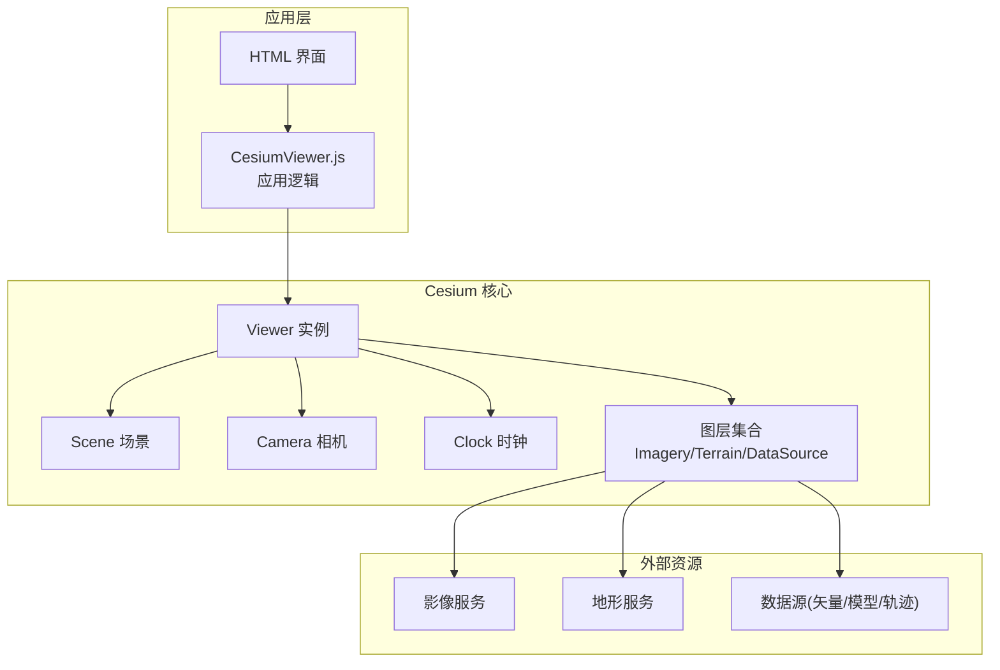
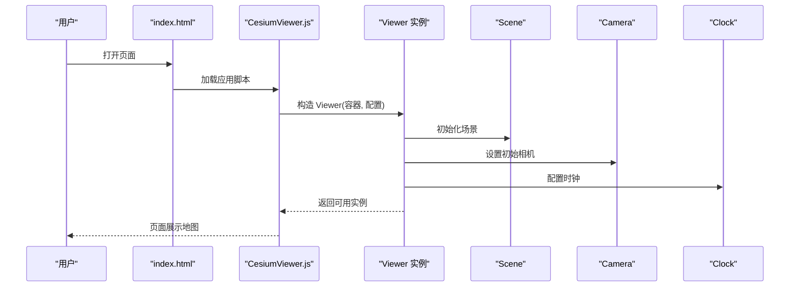
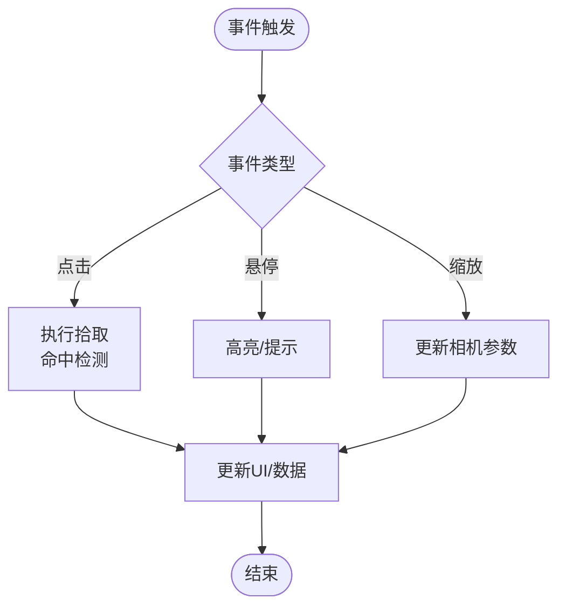
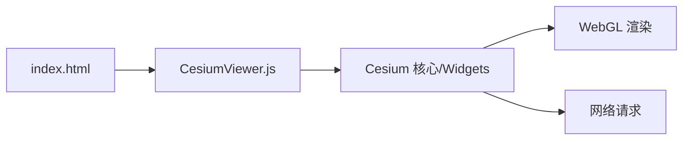

# Viewer组件API

<cite>
**本文引用的文件**   
- [CesiumViewer.js](file://Apps/CesiumViewer/CesiumViewer.js)
- [index.html](file://Apps/CesiumViewer/index.html)
- [viewer.spec.js](file://Specs/e2e/viewer.spec.js)
</cite>

## 目录
1. [简介](#简介)
2. [项目结构](#项目结构)
3. [核心组件](#核心组件)
4. [架构总览](#架构总览)
5. [详细组件分析](#详细组件分析)
6. [依赖分析](#依赖分析)
7. [性能考虑](#性能考虑)
8. [故障排查指南](#故障排查指南)
9. [结论](#结论)
10. [附录](#附录)

## 简介
本文件面向使用 Cesium 的开发者，聚焦于“Viewer”主组件的 API 与集成方式。内容涵盖：
- 初始化配置选项（容器元素、默认图层、相机设置、时间控制等）
- 生命周期方法
- 事件系统（点击、悬停、缩放等）
- 场景访问接口
- 完整示例路径（基本设置、高级配置、动态更新）
- 与其他 Cesium 组件的集成方式与最佳实践

说明：由于当前仓库未包含 Viewer 源码实现，本文档基于应用入口与端到端测试用例进行归纳与可视化，确保读者能够正确创建、配置并扩展 Viewer。

## 项目结构
在 Apps/CesiumViewer 目录下，提供了最小可运行的 Viewer 示例：
- index.html：页面骨架与脚本引入
- CesiumViewer.js：应用逻辑，负责创建和配置 Viewer 实例，以及后续交互与数据加载

图表来源
- [index.html:1-200](file://Apps/CesiumViewer/index.html#L1-L200)
- [CesiumViewer.js:1-200](file://Apps/CesiumViewer/CesiumViewer.js#L1-L200)

章节来源
- [index.html:1-200](file://Apps/CesiumViewer/index.html#L1-L200)
- [CesiumViewer.js:1-200](file://Apps/CesiumViewer/CesiumViewer.js#L1-L200)

## 核心组件
- Viewer 实例：作为地图应用的根容器，聚合了 Scene、Camera、Clock、ImageryProvider、TerrainProvider、DataSourceCollection 等子系统。
- 场景 Scene：提供渲染管线、实体集合、图元、光照、阴影、后处理等能力。
- 相机 Camera：控制视角、飞行、目标点、视锥体参数。
- 时钟 Clock：驱动时间推进、动画播放、时间相关属性更新。
- 图层 ImageryProvider/TerrainProvider：管理底图与地形资源。
- 数据源 DataSource：矢量、模型、轨迹等数据的统一承载。

章节来源
- [CesiumViewer.js:1-200](file://Apps/CesiumViewer/CesiumViewer.js#L1-L200)

## 架构总览
下图展示了 Viewer 在应用中的角色及其与 Cesium 子系统的关系。

图表来源
- [CesiumViewer.js:1-200](file://Apps/CesiumViewer/CesiumViewer.js#L1-L200)
- [index.html:1-200](file://Apps/CesiumViewer/index.html#L1-L200)

## 详细组件分析

### 初始化与配置
- 容器元素
  - 通过 DOM 选择器或节点引用将 Viewer 挂载到指定容器。
  - 常见做法是在 HTML 中预留一个全屏容器，并在 JS 中传入该容器。
- 默认图层
  - 影像提供者：用于显示卫星图、街道图等底图。
  - 地形提供者：用于启用真实高程起伏。
- 相机设置
  - 初始位置、朝向、距离、视场角等。
  - 是否允许用户交互控制相机（旋转、平移、缩放）。
- 时间控制
  - 时钟模式（实时/手动）、时间范围、步进速度、是否自动播放。
- 其他常用开关
  - 控件显隐（缩放条、罗盘、信息框等）。
  - 拾取、碰撞检测、阴影、大气效果等渲染选项。

章节来源
- [CesiumViewer.js:1-200](file://Apps/CesiumViewer/CesiumViewer.js#L1-L200)
- [index.html:1-200](file://Apps/CesiumViewer/index.html#L1-L200)

### 生命周期方法
- 创建阶段
  - 构造 Viewer 实例并完成内部子系统初始化。
- 运行阶段
  - 进入渲染循环，响应输入事件，更新场景状态。
- 销毁阶段
  - 释放 WebGL 资源、移除事件监听、清理数据源与缓存。

章节来源
- [CesiumViewer.js:1-200](file://Apps/CesiumViewer/CesiumViewer.js#L1-L200)

### 事件系统
- 鼠标事件
  - 点击、双击、悬停、拖拽等，通常通过 Scene 的拾取机制触发。
- 相机事件
  - 缩放、旋转、平移过程中可订阅回调以执行自定义逻辑。
- 时间事件
  - 时钟推进、播放/暂停、时间范围变化时触发。

章节来源
- [CesiumViewer.js:1-200](file://Apps/CesiumViewer/CesiumViewer.js#L1-L200)

### 场景访问接口
- 获取 Scene
  - 通过 Viewer 提供的只读属性访问场景对象，用于添加实体、图元、修改渲染选项。
- 获取 Camera
  - 通过 Viewer 提供的只读属性访问相机对象，用于编程式导航与视图控制。
- 获取 Clock
  - 通过 Viewer 提供的只读属性访问时钟对象，用于时间驱动与动画同步。

章节来源
- [CesiumViewer.js:1-200](file://Apps/CesiumViewer/CesiumViewer.js#L1-L200)

### 代码示例路径
- 基本设置
  - 参考：[CesiumViewer.js:1-200](file://Apps/CesiumViewer/CesiumViewer.js#L1-L200)
- 高级配置
  - 参考：[CesiumViewer.js:1-200](file://Apps/CesiumViewer/CesiumViewer.js#L1-L200)
- 动态更新
  - 参考：[CesiumViewer.js:1-200](file://Apps/CesiumViewer/CesiumViewer.js#L1-L200)

### 与其他 Cesium 组件的集成
- 数据源集成
  - 通过 Viewer 的数据源集合加载 GeoJSON、KML、CZML、3D Tiles 等。
- 小部件集成
  - 使用 Widgets 模块提供的控件（如缩放条、罗盘、时间线等）增强交互体验。
- 材质与着色器
  - 通过 Scene 的材质系统与着色器扩展视觉效果。

章节来源
- [CesiumViewer.js:1-200](file://Apps/CesiumViewer/CesiumViewer.js#L1-L200)

### 序列图：创建与配置 Viewer

图表来源
- [index.html:1-200](file://Apps/CesiumViewer/index.html#L1-L200)
- [CesiumViewer.js:1-200](file://Apps/CesiumViewer/CesiumViewer.js#L1-L200)

### 流程图：事件处理流程（点击/悬停/缩放）

图表来源
- [CesiumViewer.js:1-200](file://Apps/CesiumViewer/CesiumViewer.js#L1-L200)

## 依赖分析
- 页面入口与脚本加载顺序
  - index.html 负责引入 Cesium 资源与应用脚本。
  - CesiumViewer.js 依赖 Cesium 核心库与 Widgets 模块。
- 运行时依赖
  - WebGL 上下文、网络请求（影像/地形/数据源）、浏览器事件系统。

图表来源
- [index.html:1-200](file://Apps/CesiumViewer/index.html#L1-L200)
- [CesiumViewer.js:1-200](file://Apps/CesiumViewer/CesiumViewer.js#L1-L200)

章节来源
- [index.html:1-200](file://Apps/CesiumViewer/index.html#L1-L200)
- [CesiumViewer.js:1-200](file://Apps/CesiumViewer/CesiumViewer.js#L1-L200)

## 性能考虑
- 合理设置初始相机与视距，避免过大场景一次性加载。
- 按需启用阴影、大气、后处理等昂贵特性。
- 使用合适的影像与地形分辨率，结合 LOD 策略。
- 批量加载数据源，避免频繁创建/销毁对象。
- 对大数据集采用分块加载与可视性裁剪。

## 故障排查指南
- 常见问题
  - 容器尺寸异常导致渲染区域不正确：检查容器 CSS 与宽高设置。
  - 底图或地形无法加载：确认网络可达性与跨域策略。
  - 事件无响应：确认事件绑定时机与 Scene 是否已就绪。
- 定位手段
  - 使用浏览器控制台查看错误日志。
  - 逐步注释配置项，缩小问题范围。
  - 参考端到端测试用例验证基础行为。

章节来源
- [viewer.spec.js:1-200](file://Specs/e2e/viewer.spec.js#L1-L200)

## 结论
Viewer 是 Cesium 应用中最重要的聚合组件，负责协调场景、相机、时钟与数据源等子系统。通过合理的初始化配置、清晰的生命周期管理与完善的事件处理，可以构建高性能、可扩展的三维地球应用。建议遵循本文的最佳实践，并结合具体业务需求进行扩展。

## 附录
- 术语表
  - 影像提供者：提供二维底图的资源接口。
  - 地形提供者：提供高程数据的资源接口。
  - 数据源：承载矢量、模型、轨迹等数据的抽象集合。
- 参考路径
  - 应用入口：[index.html](file://Apps/CesiumViewer/index.html)
  - 应用逻辑：[CesiumViewer.js](file://Apps/CesiumViewer/CesiumViewer.js)
  - 端到端测试：[viewer.spec.js](file://Specs/e2e/viewer.spec.js)