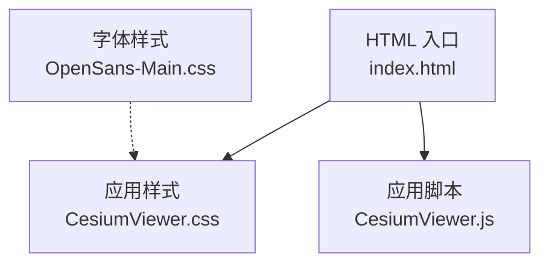
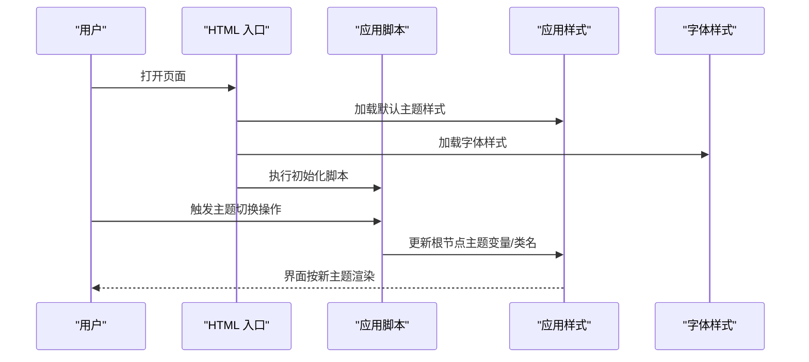
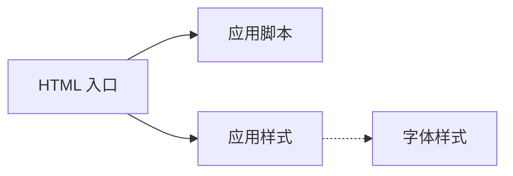

# 主题定制API

<cite>
**本文引用的文件**   
- [CesiumViewer.css](file://Apps/CesiumViewer/CesiumViewer.css)
- [CesiumViewer.js](file://Apps/CesiumViewer/CesiumViewer.js)
- [index.html](file://Apps/CesiumViewer/index.html)
- [OpenSans-Main.css](file://Specs/Data/Fonts/OpenSans-Main.css)
</cite>

## 目录
1. [简介](#简介)
2. [项目结构](#项目结构)
3. [核心组件](#核心组件)
4. [架构总览](#架构总览)
5. [详细组件分析](#详细组件分析)
6. [依赖分析](#依赖分析)
7. [性能考虑](#性能考虑)
8. [故障排查指南](#故障排查指南)
9. [结论](#结论)
10. [附录](#附录) 

## 简介
本文件面向需要在 Cesium UI 中进行主题定制的开发者，提供一套可操作的 API 与最佳实践说明。内容涵盖：
- CSS 变量系统与主题切换机制
- 样式覆盖方法与优先级策略
- 颜色方案、字体设置、间距规范等主题属性的定制方式
- 深色主题、品牌定制、响应式设计的实现步骤
- 主题与国际化（i18n）、多语言支持的集成方法

为保证准确性，本文所有实现建议均基于仓库中现有示例与资源进行归纳总结，并给出具体文件来源以便追溯。

## 项目结构
与主题定制直接相关的资源主要位于应用示例与测试数据中：
- 应用示例：包含一个最小可用的 Cesium Viewer 页面及其样式与脚本入口
- 字体资源：用于演示字体加载与替换的示例样式

图表来源
- [index.html](file://Apps/CesiumViewer/index.html)
- [CesiumViewer.css](file://Apps/CesiumViewer/CesiumViewer.css)
- [CesiumViewer.js](file://Apps/CesiumViewer/CesiumViewer.js)
- [OpenSans-Main.css](file://Specs/Data/Fonts/OpenSans-Main.css)

章节来源
- [index.html](file://Apps/CesiumViewer/index.html)
- [CesiumViewer.css](file://Apps/CesiumViewer/CesiumViewer.css)
- [CesiumViewer.js](file://Apps/CesiumViewer/CesiumViewer.js)
- [OpenSans-Main.css](file://Specs/Data/Fonts/OpenSans-Main.css)

## 核心组件
- HTML 入口：负责引入基础样式与脚本，是主题注入与覆盖的挂载点
- 应用样式：承载默认主题变量与组件级样式，便于通过变量或类名进行覆盖
- 应用脚本：初始化 Cesium Viewer 及业务逻辑，可在运行时动态切换主题
- 字体样式：演示如何引入自定义字体并在主题中引用

章节来源
- [index.html](file://Apps/CesiumViewer/index.html)
- [CesiumViewer.css](file://Apps/CesiumViewer/CesiumViewer.css)
- [CesiumViewer.js](file://Apps/CesiumViewer/CesiumViewer.js)
- [OpenSans-Main.css](file://Specs/Data/Fonts/OpenSans-Main.css)

## 架构总览
下图展示了“页面—样式—脚本—字体”的主题相关交互关系，以及运行时主题切换的关键路径。

图表来源
- [index.html](file://Apps/CesiumViewer/index.html)
- [CesiumViewer.css](file://Apps/CesiumViewer/CesiumViewer.css)
- [CesiumViewer.js](file://Apps/CesiumViewer/CesiumViewer.js)
- [OpenSans-Main.css](file://Specs/Data/Fonts/OpenSans-Main.css)

## 详细组件分析

### 主题变量系统
- 设计要点
  - 将颜色、字体、间距等主题属性以 CSS 变量的形式集中管理，便于统一修改与按需覆盖
  - 在根节点上定义默认值，并通过类名或属性选择器为不同主题提供变量集合
- 覆盖策略
  - 优先使用更具体的选择器或媒体查询覆盖变量
  - 在运行时通过脚本动态更新根节点的变量值，实现即时切换
- 适用场景
  - 品牌色替换、明暗主题切换、区域化字体与字号调整

章节来源
- [CesiumViewer.css](file://Apps/CesiumViewer/CesiumViewer.css)

### 主题切换机制
- 静态切换
  - 通过为根节点添加/移除主题类名，切换不同的变量集合
- 动态切换
  - 在脚本中监听用户操作，计算并写入新的变量值到根节点
- 持久化
  - 将当前主题标识保存到本地存储，页面重载后恢复

章节来源
- [CesiumViewer.js](file://Apps/CesiumViewer/CesiumViewer.js)
- [CesiumViewer.css](file://Apps/CesiumViewer/CesiumViewer.css)

### 样式覆盖方法
- 选择器优先级
  - 使用更高优先级选择器或 !important（谨慎）覆盖默认样式
- 局部覆盖
  - 针对特定组件容器增加限定类名，避免全局污染
- 条件覆盖
  - 结合媒体查询与属性选择器，实现响应式与状态化覆盖

章节来源
- [CesiumViewer.css](file://Apps/CesiumViewer/CesiumViewer.css)

### 颜色方案定制
- 建议做法
  - 将主色、辅色、中性色、语义色（成功、警告、错误）等定义为变量
  - 在明/暗主题下分别定义对应变量集合
- 注意事项
  - 保证对比度满足可访问性要求
  - 对透明叠加层与地图底图进行视觉一致性校验

章节来源
- [CesiumViewer.css](file://Apps/CesiumViewer/CesiumViewer.css)

### 字体设置与加载
- 字体引入
  - 通过样式表引入自定义字体，确保跨域与缓存策略正确
- 字体应用
  - 在主题变量中声明字体族，供全局或组件复用
- 回退策略
  - 提供系统字体作为回退，提升首屏体验

章节来源
- [OpenSans-Main.css](file://Specs/Data/Fonts/OpenSans-Main.css)
- [CesiumViewer.css](file://Apps/CesiumViewer/CesiumViewer.css)

### 间距规范与布局
- 间距体系
  - 使用统一的间距变量（如 4px 倍数），保持视觉节奏一致
- 布局适配
  - 在小屏幕设备上减少内边距与外边距，优化信息密度

章节来源
- [CesiumViewer.css](file://Apps/CesiumViewer/CesiumViewer.css)

### 深色主题实现步骤
- 步骤概览
  - 在根节点新增深色主题变量集合
  - 通过类名切换或媒体查询启用深色主题
  - 验证控件、提示框、面板等关键区域的对比度
- 关键点
  - 地图图层与 UI 的层次关系需保持一致
  - 图标与描边在深色背景下的可见性

章节来源
- [CesiumViewer.css](file://Apps/CesiumViewer/CesiumViewer.css)
- [CesiumViewer.js](file://Apps/CesiumViewer/CesiumViewer.js)

### 品牌定制实现步骤
- 步骤概览
  - 将品牌主色、辅助色、Logo 等资产纳入主题变量
  - 在按钮、标签、导航等高频组件中引用品牌变量
  - 提供品牌预览页，快速评估整体效果
- 关键点
  - 注意品牌色在不同背景上的可读性
  - 为高对比度模式预留替代色

章节来源
- [CesiumViewer.css](file://Apps/CesiumViewer/CesiumViewer.css)

### 响应式设计实现步骤
- 步骤概览
  - 使用媒体查询针对不同断点调整字体大小、间距与布局
  - 在小屏设备隐藏次要信息，突出核心功能
- 关键点
  - 触控目标尺寸满足移动端可用性标准
  - 地图交互与 UI 控件不互相遮挡

章节来源
- [CesiumViewer.css](file://Apps/CesiumViewer/CesiumViewer.css)

### 主题与国际化（i18n）集成
- 文本方向
  - 根据语言切换 dir 属性，配合样式处理左右布局差异
- 文案与单位
  - 将多语言文案与数字/日期格式化从主题层剥离，交由 i18n 模块管理
- 字体与排版
  - 不同语言可能需要不同字体族，可通过主题变量切换字体族
- 最佳实践
  - 主题变量仅承载视觉属性，不包含任何文案
  - 在切换语言时同步检查布局溢出与换行行为

章节来源
- [CesiumViewer.css](file://Apps/CesiumViewer/CesiumViewer.css)
- [CesiumViewer.js](file://Apps/CesiumViewer/CesiumViewer.js)

## 依赖分析
主题相关依赖关系如下：
- HTML 入口依赖应用样式与应用脚本
- 应用样式可能引用字体样式
- 应用脚本在运行时影响样式（如切换主题类名或变量）

图表来源
- [index.html](file://Apps/CesiumViewer/index.html)
- [CesiumViewer.css](file://Apps/CesiumViewer/CesiumViewer.css)
- [CesiumViewer.js](file://Apps/CesiumViewer/CesiumViewer.js)
- [OpenSans-Main.css](file://Specs/Data/Fonts/OpenSans-Main.css)

章节来源
- [index.html](file://Apps/CesiumViewer/index.html)
- [CesiumViewer.css](file://Apps/CesiumViewer/CesiumViewer.css)
- [CesiumViewer.js](file://Apps/CesiumViewer/CesiumViewer.js)
- [OpenSans-Main.css](file://Specs/Data/Fonts/OpenSans-Main.css)

## 性能考虑
- 变量更新
  - 批量更新 CSS 变量，减少重排与重绘次数
- 样式体积
  - 按需加载主题样式，避免一次性引入过多未用规则
- 字体加载
  - 使用预加载与缓存策略，降低首屏延迟
- 媒体查询
  - 合理组织断点，避免过度细分导致样式冲突与解析开销

[本节为通用指导，无需列出具体文件来源]

## 故障排查指南
- 主题未生效
  - 检查根节点是否已添加正确的主题类名或变量
  - 确认样式加载顺序与优先级
- 字体显示异常
  - 检查字体样式是否正确引入与跨域配置
  - 确认浏览器缓存与网络请求状态
- 深色模式下对比度不足
  - 调整前景/背景色变量，确保符合可访问性标准
- 响应式布局错乱
  - 核对媒体查询断点与组件宽度约束
  - 检查是否存在固定宽高导致的溢出

章节来源
- [CesiumViewer.css](file://Apps/CesiumViewer/CesiumViewer.css)
- [CesiumViewer.js](file://Apps/CesiumViewer/CesiumViewer.js)
- [OpenSans-Main.css](file://Specs/Data/Fonts/OpenSans-Main.css)

## 结论
通过在根节点集中管理 CSS 变量、采用类名或属性切换机制，并结合媒体查询与脚本控制，可以在 Cesium UI 中实现灵活且可维护的主题定制。遵循本文的颜色、字体、间距规范与 i18n 集成建议，能够高效完成深色主题、品牌定制与响应式适配，同时保障可访问性与性能表现。

[本节为总结性内容，无需列出具体文件来源]

## 附录
- 参考实现位置
  - 应用入口与样式：见应用示例目录
  - 字体样式示例：见测试数据中的字体样式文件

章节来源
- [index.html](file://Apps/CesiumViewer/index.html)
- [CesiumViewer.css](file://Apps/CesiumViewer/CesiumViewer.css)
- [CesiumViewer.js](file://Apps/CesiumViewer/CesiumViewer.js)
- [OpenSans-Main.css](file://Specs/Data/Fonts/OpenSans-Main.css)