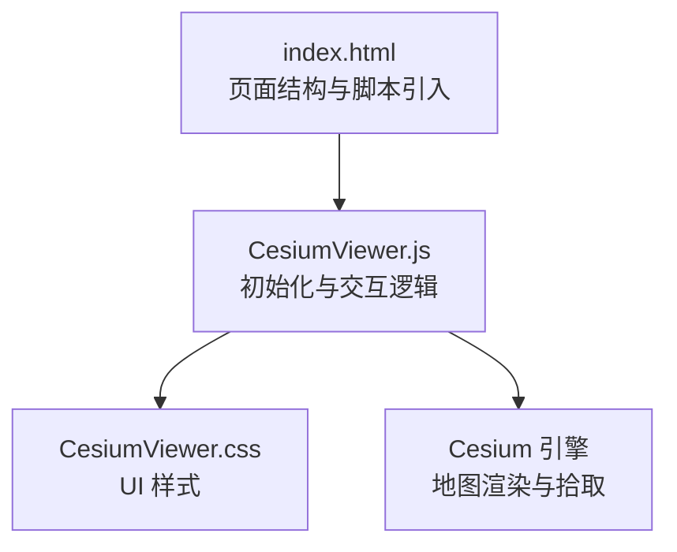
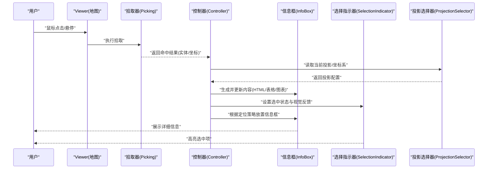
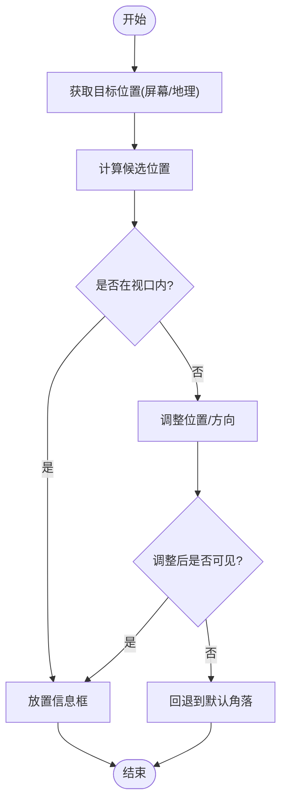
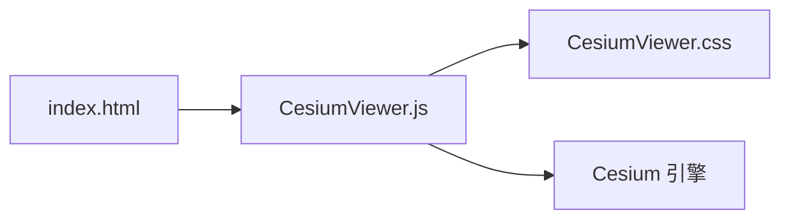

# 信息显示控件API

<cite>
**本文引用的文件**   
- [CesiumViewer.js](file://Apps/CesiumViewer/CesiumViewer.js)
- [CesiumViewer.css](file://Apps/CesiumViewer/CesiumViewer.css)
- [index.html](file://Apps/CesiumViewer/index.html)
</cite>

## 目录
1. [简介](#简介)
2. [项目结构](#项目结构)
3. [核心组件](#核心组件)
4. [架构总览](#架构总览)
5. [详细组件分析](#详细组件分析)
6. [依赖关系分析](#依赖关系分析)
7. [性能考虑](#性能考虑)
8. [故障排查指南](#故障排查指南)
9. [结论](#结论)
10. [附录](#附录)

## 简介
本文件面向在 Cesium 应用中构建“信息显示类控件”的开发者，聚焦信息框、选择指示器、投影选择器等 UI 组件的配置选项与交互行为。文档覆盖：
- 动态内容更新（HTML/表格/图表）
- 样式定制与主题适配
- 定位策略（屏幕坐标、地理坐标、吸附与避让）
- 复杂信息展示的实现示例与最佳实践
- 性能优化与用户体验设计原则

说明：由于仓库未包含专门的 UI 控件源码，本文基于应用层示例代码进行归纳与抽象，提供可落地的实现建议与参考路径。

## 项目结构
该仓库为 Cesium 示例与应用集合。与信息显示控件最相关的入口位于 Apps/CesiumViewer 目录，包含：
- index.html：页面骨架与资源引入
- CesiumViewer.js：初始化 Viewer、图层、事件处理与 UI 逻辑
- CesiumViewer.css：界面样式定义

图示来源
- [index.html:1-200](file://Apps/CesiumViewer/index.html#L1-L200)
- [CesiumViewer.js:1-200](file://Apps/CesiumViewer/CesiumViewer.js#L1-L200)
- [CesiumViewer.css:1-200](file://Apps/CesiumViewer/CesiumViewer.css#L1-L200)

章节来源
- [index.html:1-200](file://Apps/CesiumViewer/index.html#L1-L200)
- [CesiumViewer.js:1-200](file://Apps/CesiumViewer/CesiumViewer.js#L1-L200)
- [CesiumViewer.css:1-200](file://Apps/CesiumViewer/CesiumViewer.css#L1-L200)

## 核心组件
本节从应用层视角抽象出三类常见信息显示控件及其职责：
- 信息框（InfoBox）：用于展示选中要素或点击位置的详细信息，支持 HTML、表格、图片等富内容
- 选择指示器（SelectionIndicator）：高亮当前选中的要素或位置，常以标记、气泡或轮廓形式呈现
- 投影选择器（ProjectionSelector）：切换地图投影或视图模式（如经纬度/墨卡托），影响坐标计算与显示格式

关键能力
- 动态更新：监听数据源变化或用户交互，增量刷新 DOM 或 Canvas 标注
- 样式定制：通过 CSS 变量或主题类名控制外观
- 定位策略：支持屏幕坐标、地理坐标、吸附到最近要素、边界内可见性检测与自动避让

章节来源
- [CesiumViewer.js:1-200](file://Apps/CesiumViewer/CesiumViewer.js#L1-L200)
- [CesiumViewer.css:1-200](file://Apps/CesiumViewer/CesiumViewer.css#L1-L200)

## 架构总览
下图展示了信息控件在应用中的整体交互流程：用户操作触发拾取或事件回调，控制器协调信息框与选择指示器的显示与更新，投影选择器影响坐标转换与格式化输出。

图示来源
- [CesiumViewer.js:1-200](file://Apps/CesiumViewer/CesiumViewer.js#L1-L200)
- [CesiumViewer.css:1-200](file://Apps/CesiumViewer/CesiumViewer.css#L1-L200)

## 详细组件分析

### 信息框（InfoBox）
职责
- 承载富文本内容（HTML、表格、图片、链接等）
- 响应数据变更进行局部更新
- 管理显示/隐藏、层级与遮挡

配置要点
- 内容模板：支持字符串模板或函数式渲染
- 定位策略：屏幕坐标、地理坐标、吸附到最近要素、边界内可见性与自动避让
- 样式主题：通过类名或 CSS 变量控制尺寸、圆角、阴影、背景色
- 生命周期：创建、更新、销毁时的钩子

交互行为
- 点击要素后打开，再次点击关闭或切换到新要素
- 滚动时保持相对位置或跟随要素移动
- 键盘可达性与焦点管理

复杂展示示例
- HTML 内容渲染：使用模板引擎或安全转义后的 innerHTML 注入
- 表格数据显示：分页、排序、筛选；大数据量采用虚拟滚动
- 图表集成：按需加载轻量图表库，懒渲染与销毁避免内存泄漏

定位策略流程图

章节来源
- [CesiumViewer.js:1-200](file://Apps/CesiumViewer/CesiumViewer.js#L1-L200)
- [CesiumViewer.css:1-200](file://Apps/CesiumViewer/CesiumViewer.css#L1-L200)

### 选择指示器（SelectionIndicator）
职责
- 可视化当前选中项（点、线、面、模型）
- 提供即时反馈（颜色、大小、动画）

配置要点
- 形态：点标记、轮廓描边、发光效果、脉冲动画
- 持久化：随要素移动而更新位置
- 层级：确保不被其他标注遮挡

交互行为
- 单选/多选切换
- 双击取消选择
- 右键菜单中快速定位到选中项

章节来源
- [CesiumViewer.js:1-200](file://Apps/CesiumViewer/CesiumViewer.js#L1-L200)
- [CesiumViewer.css:1-200](file://Apps/CesiumViewer/CesiumViewer.css#L1-L200)

### 投影选择器（ProjectionSelector）
职责
- 切换地图投影或视图模式
- 影响坐标计算、显示格式与精度

配置要点
- 可选投影：经纬度、Web 墨卡托、自定义投影
- 精度与单位：小数位数、角度/弧度、米/英尺
- 联动：切换后刷新信息框内容与选择指示器位置

交互行为
- 下拉菜单或工具栏按钮切换
- 切换时平滑过渡与提示
- 错误处理：不支持的投影给出友好提示

章节来源
- [CesiumViewer.js:1-200](file://Apps/CesiumViewer/CesiumViewer.js#L1-L200)
- [CesiumViewer.css:1-200](file://Apps/CesiumViewer/CesiumViewer.css#L1-L200)

### 复杂信息展示实现示例
- HTML 内容渲染
  - 使用安全的模板渲染，避免 XSS
  - 对长内容启用滚动容器与固定高度
- 表格数据显示
  - 大数据集采用虚拟滚动与分页
  - 列宽自适应与冻结首列
- 图表集成
  - 按需加载图表库，避免首屏阻塞
  - 图表实例复用与及时销毁

章节来源
- [CesiumViewer.js:1-200](file://Apps/CesiumViewer/CesiumViewer.js#L1-L200)
- [CesiumViewer.css:1-200](file://Apps/CesiumViewer/CesiumViewer.css#L1-L200)

## 依赖关系分析
- 页面层：index.html 负责引入脚本与样式
- 应用层：CesiumViewer.js 组织 Viewer、事件、UI 控件
- 样式层：CesiumViewer.css 提供统一主题与布局
- 引擎层：Cesium 提供地图渲染、拾取、坐标转换

图示来源
- [index.html:1-200](file://Apps/CesiumViewer/index.html#L1-L200)
- [CesiumViewer.js:1-200](file://Apps/CesiumViewer/CesiumViewer.js#L1-L200)
- [CesiumViewer.css:1-200](file://Apps/CesiumViewer/CesiumViewer.css#L1-L200)

章节来源
- [index.html:1-200](file://Apps/CesiumViewer/index.html#L1-L200)
- [CesiumViewer.js:1-200](file://Apps/CesiumViewer/CesiumViewer.js#L1-L200)
- [CesiumViewer.css:1-200](file://Apps/CesiumViewer/CesiumViewer.css#L1-L200)

## 性能考虑
- 内容更新
  - 使用增量 DOM 更新，避免整块重绘
  - 列表虚拟化与分页减少节点数量
- 渲染开销
  - 图表按需加载与懒渲染
  - 大图片压缩与缓存
- 事件节流
  - 滚动与拖拽场景下对信息框位置计算进行节流/防抖
- 内存管理
  - 组件销毁时清理事件监听与定时器
  - 图表实例及时释放

[本节为通用指导，不直接分析具体文件]

## 故障排查指南
常见问题与定位步骤
- 信息框不显示
  - 检查元素挂载点是否存在
  - 确认定位计算返回值是否为有效坐标
  - 查看控制台是否有样式冲突或 z-index 问题
- 内容闪烁或卡顿
  - 排查高频更新是否缺少节流
  - 确认是否重复创建 DOM 节点
- 投影切换后坐标异常
  - 校验投影参数与精度设置
  - 确认坐标转换链路是否正确调用

章节来源
- [CesiumViewer.js:1-200](file://Apps/CesiumViewer/CesiumViewer.js#L1-L200)
- [CesiumViewer.css:1-200](file://Apps/CesiumViewer/CesiumViewer.css#L1-L200)

## 结论
通过在应用层组合信息框、选择指示器与投影选择器，可在 Cesium 中构建灵活、高性能的信息显示体系。关键在于：
- 清晰的职责划分与松耦合接口
- 稳健的定位与可见性策略
- 针对大数据与富内容的性能优化
- 一致的主题与可访问性体验

[本节为总结性内容，不直接分析具体文件]

## 附录
- 术语
  - 信息框：承载详细信息的浮层面板
  - 选择指示器：高亮选中项的视觉标记
  - 投影选择器：切换地图投影或视图模式的控件
- 参考路径
  - 页面入口与脚本引入：[index.html](file://Apps/CesiumViewer/index.html)
  - 应用逻辑与交互：[CesiumViewer.js](file://Apps/CesiumViewer/CesiumViewer.js)
  - 样式与主题：[CesiumViewer.css](file://Apps/CesiumViewer/CesiumViewer.css)