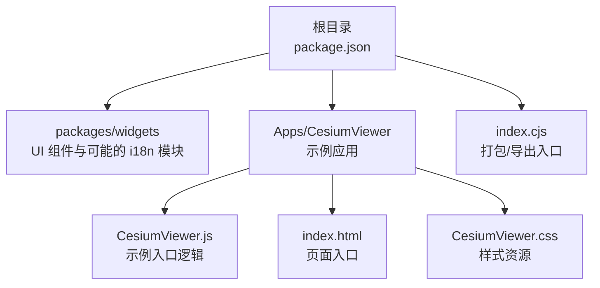
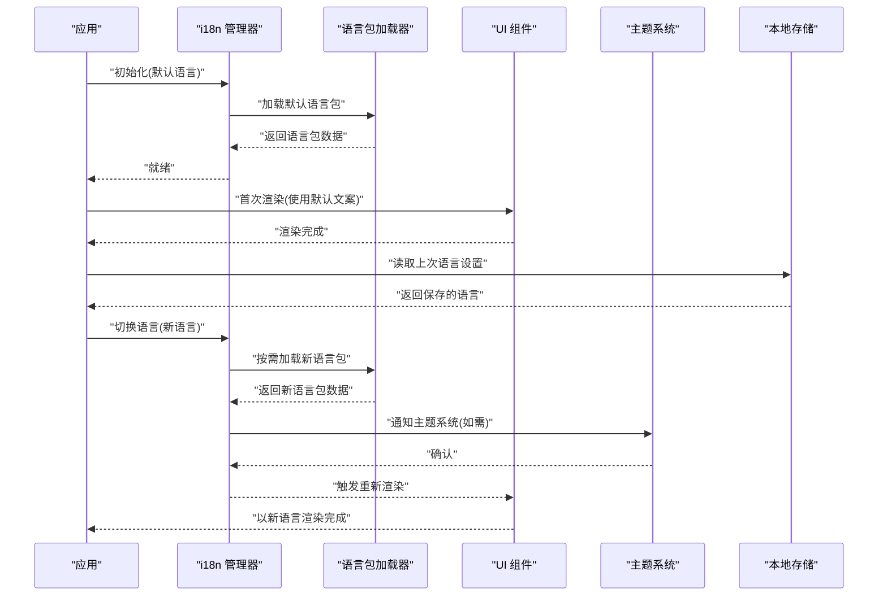
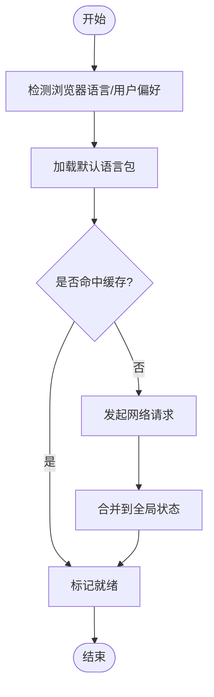
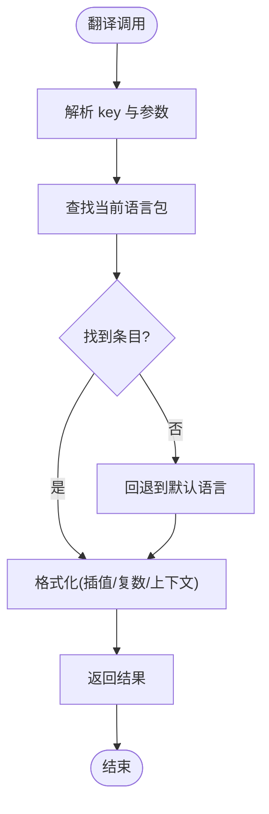
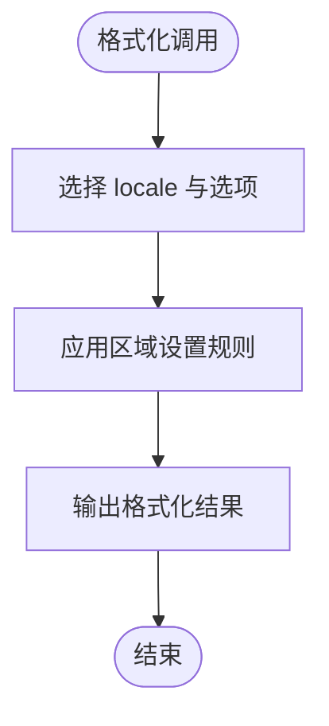
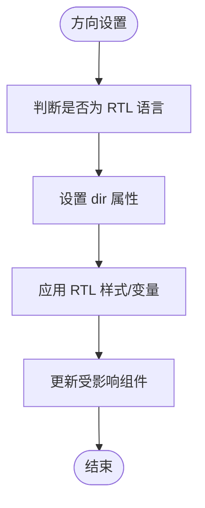
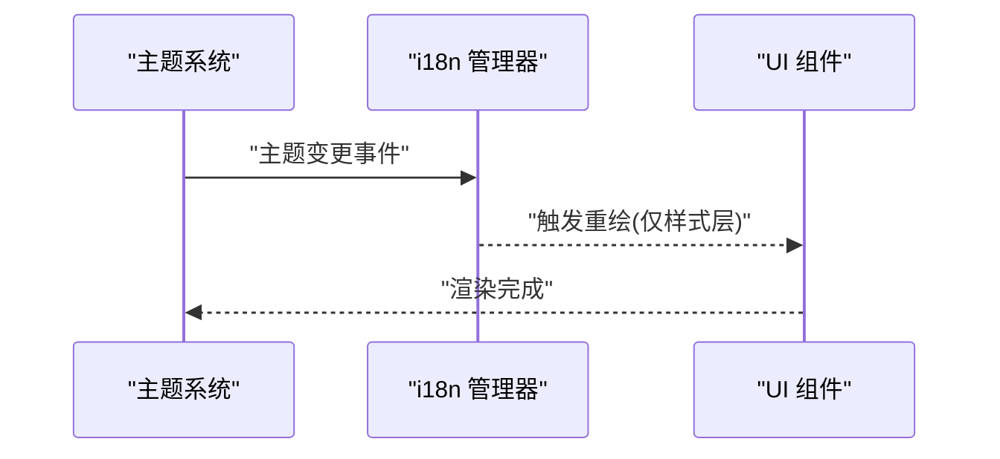
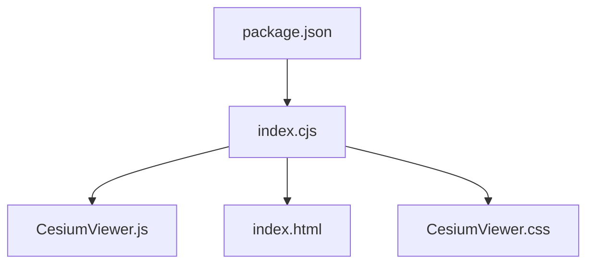

# 国际化API

<cite>
**本文引用的文件**   
- [README.md](file://README.md)
- [package.json](file://package.json)
- [index.cjs](file://index.cjs)
- [CesiumViewer.js](file://Apps/CesiumViewer/CesiumViewer.js)
- [index.html](file://Apps/CesiumViewer/index.html)
- [CesiumViewer.css](file://Apps/CesiumViewer/CesiumViewer.css)
</cite>

## 目录
1. [简介](#简介)
2. [项目结构](#项目结构)
3. [核心组件](#核心组件)
4. [架构总览](#架构总览)
5. [详细组件分析](#详细组件分析)
6. [依赖分析](#依赖分析)
7. [性能考虑](#性能考虑)
8. [故障排查指南](#故障排查指南)
9. [结论](#结论)
10. [附录](#附录)

## 简介
本文件面向在 Cesium UI 组件中实现国际化的开发者，提供多语言支持、文本翻译、日期格式本地化等能力的完整 API 文档。内容涵盖：
- 语言包加载与动态语言切换
- 自定义翻译键值对与上下文翻译
- RTL（从右到左）语言支持与复数形式处理
- 国际化与主题系统的集成方式
- 性能优化策略与最佳实践

说明：由于当前仓库未包含具体的国际化实现源码，本文档基于通用前端国际化模式与 Cesium 工程结构进行概念性说明，并提供可落地的集成建议与流程图示。

## 项目结构
Cesium 仓库采用多包组织方式，UI 相关能力通常位于 widgets 包；示例应用位于 Apps 目录；构建与入口由根级脚本与配置管理。

图表来源
- [package.json:1-20](file://package.json#L1-L20)
- [index.cjs:1-20](file://index.cjs#L1-L20)
- [CesiumViewer.js:1-20](file://Apps/CesiumViewer/CesiumViewer.js#L1-L20)
- [index.html:1-20](file://Apps/CesiumViewer/index.html#L1-L20)
- [CesiumViewer.css:1-20](file://Apps/CesiumViewer/CesiumViewer.css#L1-L20)

章节来源
- [README.md:1-50](file://README.md#L1-L50)
- [package.json:1-20](file://package.json#L1-L20)
- [index.cjs:1-20](file://index.cjs#L1-L20)
- [CesiumViewer.js:1-20](file://Apps/CesiumViewer/CesiumViewer.js#L1-L20)
- [index.html:1-20](file://Apps/CesiumViewer/index.html#L1-L20)
- [CesiumViewer.css:1-20](file://Apps/CesiumViewer/CesiumViewer.css#L1-L20)

## 核心组件
本节概述在 Cesium UI 中实现国际化所需的核心能力与接口约定（概念性描述）。

- 语言包管理器
  - 职责：加载、缓存、合并语言包；提供按 key 获取文案的能力；支持懒加载与按需更新。
  - 关键方法（概念）：load(locale, bundle)、get(key, params)、set(key, value)、switch(locale)。
- 翻译服务
  - 职责：将模板字符串与参数组合成最终文案；处理插值、复数、上下文、占位符。
  - 关键方法（概念）：t(key, params)、pluralize(key, count)、contextual(key, context)。
- 日期与数字格式化器
  - 职责：根据 locale 格式化日期、时间、数字、货币等。
  - 关键方法（概念）：formatDate(date, options)、formatNumber(value, options)。
- 方向与布局适配
  - 职责：检测并设置 document.documentElement.dir；为 RTL 语言提供 CSS 变量或类名切换。
  - 关键方法（概念）：setDirection(dir)、isRTL(locale)。
- 主题集成
  - 职责：与主题系统联动，确保文案颜色、图标、间距在主题切换时保持一致。
  - 关键方法（概念）：applyTheme(themeId)、subscribeToThemeChanges(callback)。

章节来源
- [README.md:1-50](file://README.md#L1-L50)

## 架构总览
下图展示一个典型的多语言应用流程：初始化语言包、渲染界面、用户切换语言、重新渲染与持久化。

图表来源
- [CesiumViewer.js:1-20](file://Apps/CesiumViewer/CesiumViewer.js#L1-L20)
- [index.html:1-20](file://Apps/CesiumViewer/index.html#L1-L20)

## 详细组件分析

### 语言包加载与缓存
- 设计要点
  - 预加载常用语言包，减少首屏切换延迟。
  - 对已加载语言包进行内存缓存，避免重复请求。
  - 支持增量更新与回退机制（如目标语言缺失 key 时回退到默认语言）。
- 关键流程
  - 初始化阶段：确定默认语言，加载基础语言包。
  - 运行时：按需加载扩展语言包，合并到全局状态。
  - 失效策略：当语言包版本变化或用户主动刷新时，清理缓存并重新加载。

图表来源
- [CesiumViewer.js:1-20](file://Apps/CesiumViewer/CesiumViewer.js#L1-L20)

章节来源
- [CesiumViewer.js:1-20](file://Apps/CesiumViewer/CesiumViewer.js#L1-L20)

### 文本翻译与复数/上下文
- 设计要点
  - 使用稳定的 key 命名规范，避免硬编码文案。
  - 支持插值参数、复数形式、上下文区分。
  - 提供调试工具输出缺失 key 与回退路径。
- 关键流程
  - 解析 key 与参数。
  - 查找对应语言包中的条目。
  - 若不存在，尝试回退到默认语言或父级语言。
  - 组装最终文案并返回。

图表来源
- [CesiumViewer.js:1-20](file://Apps/CesiumViewer/CesiumViewer.js#L1-L20)

章节来源
- [CesiumViewer.js:1-20](file://Apps/CesiumViewer/CesiumViewer.js#L1-L20)

### 日期与数字本地化
- 设计要点
  - 使用区域设置的日期/数字格式化能力。
  - 支持自定义格式选项（如短日期、长日期、百分比、货币）。
  - 注意时区与夏令时处理。
- 关键流程
  - 接收原始数值/日期对象。
  - 根据 locale 选择格式化规则。
  - 输出格式化后的字符串。

图表来源
- [CesiumViewer.js:1-20](file://Apps/CesiumViewer/CesiumViewer.js#L1-L20)

章节来源
- [CesiumViewer.js:1-20](file://Apps/CesiumViewer/CesiumViewer.js#L1-L20)

### RTL 语言支持与布局适配
- 设计要点
  - 自动检测并设置 document.documentElement.dir。
  - 通过 CSS 变量或类名切换布局方向。
  - 针对图标、箭头、进度条等元素提供镜像或替代方案。
- 关键流程
  - 初始化时根据语言设置方向。
  - 切换语言时同步更新方向与样式。
  - 在组件内部监听方向变化并调整布局。

图表来源
- [CesiumViewer.js:1-20](file://Apps/CesiumViewer/CesiumViewer.js#L1-L20)
- [CesiumViewer.css:1-20](file://Apps/CesiumViewer/CesiumViewer.css#L1-L20)

章节来源
- [CesiumViewer.js:1-20](file://Apps/CesiumViewer/CesiumViewer.js#L1-L20)
- [CesiumViewer.css:1-20](file://Apps/CesiumViewer/CesiumViewer.css#L1-L20)

### 国际化与主题系统集成
- 设计要点
  - 主题切换不应影响文案内容，但可能影响颜色、图标、字体等视觉表现。
  - 在主题变更时，确保 i18n 状态不被破坏。
  - 提供事件总线或订阅机制，使 i18n 与主题系统解耦。
- 关键流程
  - 主题系统发出变更事件。
  - i18n 管理器响应事件，必要时刷新 UI。
  - 保持语言包与主题配置独立管理。

图表来源
- [CesiumViewer.js:1-20](file://Apps/CesiumViewer/CesiumViewer.js#L1-L20)

章节来源
- [CesiumViewer.js:1-20](file://Apps/CesiumViewer/CesiumViewer.js#L1-L20)

## 依赖分析
- 包管理与入口
  - package.json 定义项目元信息与依赖。
  - index.cjs 作为打包/导出入口，统一暴露能力。
- 示例应用
  - Apps/CesiumViewer 下的 JS、HTML、CSS 构成最小可用示例，便于演示 i18n 集成。

图表来源
- [package.json:1-20](file://package.json#L1-L20)
- [index.cjs:1-20](file://index.cjs#L1-L20)
- [CesiumViewer.js:1-20](file://Apps/CesiumViewer/CesiumViewer.js#L1-L20)
- [index.html:1-20](file://Apps/CesiumViewer/index.html#L1-L20)
- [CesiumViewer.css:1-20](file://Apps/CesiumViewer/CesiumViewer.css#L1-L20)

章节来源
- [package.json:1-20](file://package.json#L1-L20)
- [index.cjs:1-20](file://index.cjs#L1-L20)
- [CesiumViewer.js:1-20](file://Apps/CesiumViewer/CesiumViewer.js#L1-L20)
- [index.html:1-20](file://Apps/CesiumViewer/index.html#L1-L20)
- [CesiumViewer.css:1-20](file://Apps/CesiumViewer/CesiumViewer.css#L1-L20)

## 性能考虑
- 语言包体积控制
  - 拆分语言包，按功能域或页面维度懒加载。
  - 压缩与去重公共 key，减少冗余。
- 缓存与复用
  - 内存缓存已加载语言包，避免重复请求。
  - 对频繁使用的格式化结果进行短期缓存。
- 渲染优化
  - 批量更新文案，减少多次 DOM 操作。
  - 使用虚拟列表或分页渲染大型列表的国际化文案。
- 网络优化
  - 启用 HTTP 缓存与 CDN。
  - 预取常用语言包，降低切换延迟。
- 监控与诊断
  - 统计缺失 key 与回退次数，定位问题。
  - 记录语言切换耗时，识别瓶颈。

[本节为通用指导，不直接分析具体文件]

## 故障排查指南
- 常见问题
  - 语言包加载失败：检查网络请求、跨域策略与资源路径。
  - 文案缺失：核对 key 命名一致性，启用回退机制。
  - RTL 布局错乱：检查 dir 属性与 CSS 变量是否正确应用。
  - 日期/数字显示异常：确认 locale 与区域设置兼容。
- 排查步骤
  - 打开控制台查看错误日志与网络请求。
  - 验证语言包结构与字段完整性。
  - 逐步禁用第三方插件或样式，定位冲突。
  - 使用最小示例复现问题，缩小范围。

[本节为通用指导，不直接分析具体文件]

## 结论
通过在 Cesium UI 中引入标准化的国际化能力，可实现多语言、RTL、复数与上下文翻译等高级特性，并与主题系统良好集成。结合合理的缓存、懒加载与监控策略，可在保证用户体验的同时提升性能与维护性。

[本节为总结性内容，不直接分析具体文件]

## 附录
- 术语
  - 语言包：按语言划分的文案集合。
  - Key：用于检索文案的稳定标识符。
  - 回退：当目标语言缺少 key 时，使用默认或上级语言的文案。
- 最佳实践
  - 使用语义化的 key 命名，避免自然语言作为 key。
  - 将业务文案与代码解耦，集中管理。
  - 在测试中覆盖多语言与 RTL 场景。
  - 定期审计语言包质量与覆盖率。

[本节为补充信息，不直接分析具体文件]