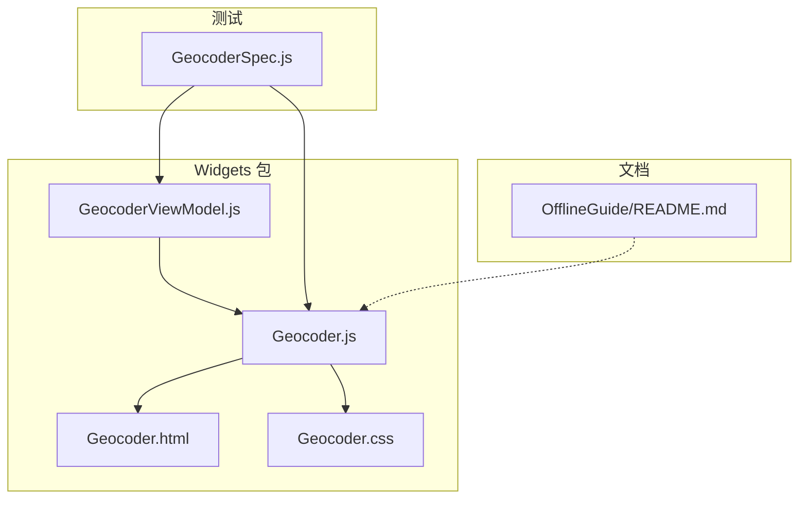
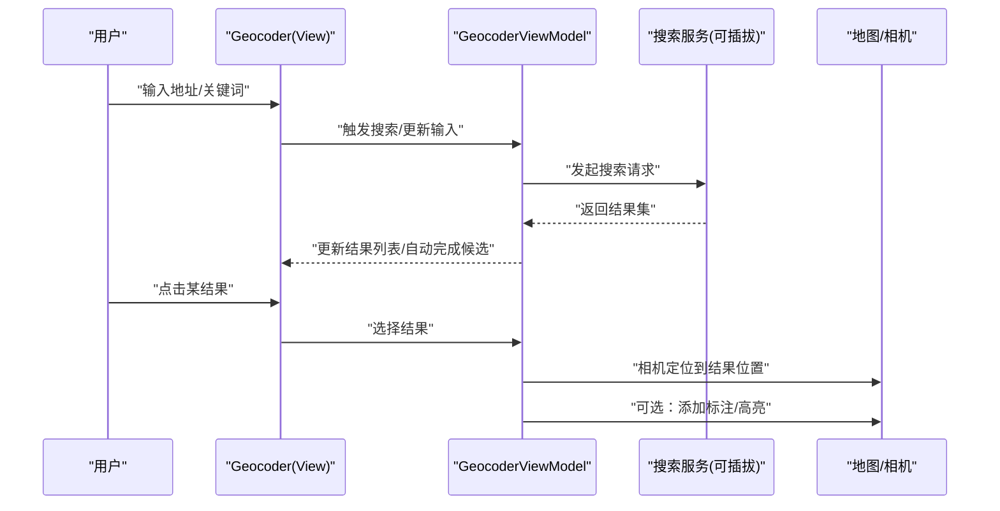
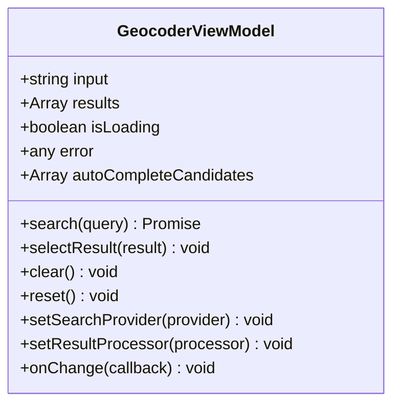
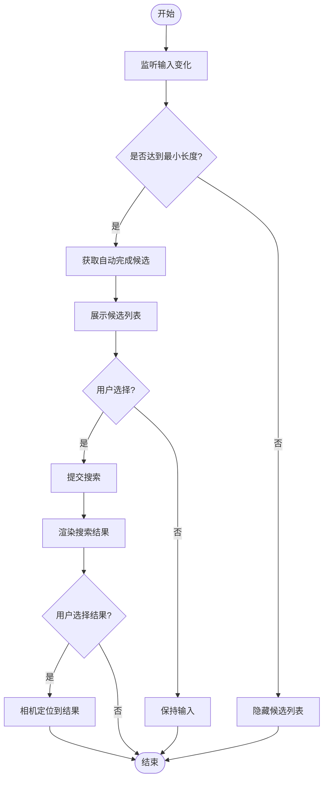
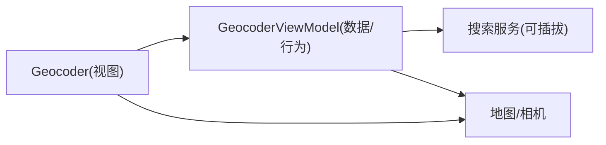

# 地理编码器API

<cite>
**本文引用的文件**   
- [Geocoder.js](file://packages/widgets/src/Geocoder.js)
- [GeocoderViewModel.js](file://packages/widgets/src/GeocoderViewModel.js)
- [Geocoder.css](file://packages/widgets/src/Geocoder.css)
- [Geocoder.html](file://packages/widgets/src/Geocoder.html)
- [GeocoderSpec.js](file://Specs/GeocoderSpec.js)
- [OfflineGuide/README.md](file://Documentation/OfflineGuide/README.md)
</cite>

## 目录
1. [简介](#简介)
2. [项目结构](#项目结构)
3. [核心组件](#核心组件)
4. [架构总览](#架构总览)
5. [详细组件分析](#详细组件分析)
6. [依赖分析](#依赖分析)
7. [性能考虑](#性能考虑)
8. [故障排查指南](#故障排查指南)
9. [结论](#结论)
10. [附录](#附录)

## 简介
本文件面向在 CesiumJS 中集成与扩展“地理编码器”（Geocoder）的开发者，系统性说明 Geocoder 控件的地址搜索、结果展示、自动完成等能力的使用方法；文档化搜索提供商的配置、自定义搜索逻辑、结果过滤与排序等高级特性；并提供搜索事件监听、搜索结果高亮显示以及相机定位跳转的实现示例。同时给出地理编码服务的集成方式与离线搜索的解决方案建议。

## 项目结构
CesiumJS 的 Geocoder 功能位于 widgets 包中，包含视图模型、UI 模板与样式，并在 Specs 中提供测试用例。离线指南提供了通用离线策略参考。

图表来源
- [GeocoderViewModel.js](file://packages/widgets/src/GeocoderViewModel.js)
- [Geocoder.js](file://packages/widgets/src/Geocoder.js)
- [Geocoder.html](file://packages/widgets/src/Geocoder.html)
- [Geocoder.css](file://packages/widgets/src/Geocoder.css)
- [GeocoderSpec.js](file://Specs/GeocoderSpec.js)
- [OfflineGuide/README.md](file://Documentation/OfflineGuide/README.md)

章节来源
- [Geocoder.js](file://packages/widgets/src/Geocoder.js)
- [GeocoderViewModel.js](file://packages/widgets/src/GeocoderViewModel.js)
- [Geocoder.html](file://packages/widgets/src/Geocoder.html)
- [Geocoder.css](file://packages/widgets/src/Geocoder.css)
- [GeocoderSpec.js](file://Specs/GeocoderSpec.js)
- [OfflineGuide/README.md](file://Documentation/OfflineGuide/README.md)

## 核心组件
- 视图模型（GeocoderViewModel）：封装搜索状态、输入、结果集合、加载态、错误信息、自动完成候选项、搜索回调与结果处理钩子。对外暴露属性与方法，供 UI 绑定与业务逻辑调用。
- 控件（Geocoder）：负责 DOM 渲染、事件绑定、键盘交互、下拉列表展示、选中项处理、相机定位与标记点绘制等。
- 模板与样式（Geocoder.html / Geocoder.css）：定义搜索框、下拉列表、结果项、加载指示器等结构与样式。
- 测试（GeocoderSpec.js）：覆盖搜索流程、自动完成、结果选择、相机定位等关键路径。

章节来源
- [GeocoderViewModel.js](file://packages/widgets/src/GeocoderViewModel.js)
- [Geocoder.js](file://packages/widgets/src/Geocoder.js)
- [Geocoder.html](file://packages/widgets/src/Geocoder.html)
- [Geocoder.css](file://packages/widgets/src/Geocoder.css)
- [GeocoderSpec.js](file://Specs/GeocoderSpec.js)

## 架构总览
Geocoder 采用 MVVM 风格：ViewModel 管理数据与行为，View（HTML/CSS）仅做展示与事件转发，控件负责将用户操作转化为对 ViewModel 的调用，并驱动地图相机与标注更新。

图表来源
- [Geocoder.js](file://packages/widgets/src/Geocoder.js)
- [GeocoderViewModel.js](file://packages/widgets/src/GeocoderViewModel.js)

## 详细组件分析

### 组件A：GeocoderViewModel（数据与行为）
职责
- 维护搜索输入、结果数组、加载状态、错误信息、自动完成候选项。
- 提供搜索执行、结果选择、清空、重置等方法。
- 暴露可配置的搜索回调与结果处理器，便于接入不同后端或本地索引。
- 支持结果过滤与排序的钩子，允许在返回前进行二次处理。

关键概念
- 搜索回调：用于替换默认搜索实现，支持异步返回结果。
- 结果处理器：在结果渲染前进行转换、格式化、去重、排序等。
- 自动完成：基于输入前缀生成候选项，支持节流与最小匹配长度配置。
- 事件通知：当结果变化、选择变更、加载状态变化时，通知视图层刷新。

图表来源
- [GeocoderViewModel.js](file://packages/widgets/src/GeocoderViewModel.js)

章节来源
- [GeocoderViewModel.js](file://packages/widgets/src/GeocoderViewModel.js)

### 组件B：Geocoder（视图与交互）
职责
- 渲染搜索框、下拉列表、结果项、加载指示器。
- 处理键盘导航（上下键、回车）、鼠标点击、失焦隐藏。
- 将用户操作委托给 ViewModel，并根据结果更新相机与标注。
- 通过 CSS 类名控制高亮、禁用、展开/收起等视觉状态。

交互流程
- 输入变化：触发自动完成候选更新。
- 提交搜索：调用 ViewModel 的搜索方法。
- 选择结果：触发相机定位与可选标注绘制。
- 错误处理：显示错误提示或空状态。

图表来源
- [Geocoder.js](file://packages/widgets/src/Geocoder.js)
- [Geocoder.html](file://packages/widgets/src/Geocoder.html)
- [Geocoder.css](file://packages/widgets/src/Geocoder.css)

章节来源
- [Geocoder.js](file://packages/widgets/src/Geocoder.js)
- [Geocoder.html](file://packages/widgets/src/Geocoder.html)
- [Geocoder.css](file://packages/widgets/src/Geocoder.css)

### 组件C：GeocoderSpec（测试与使用示例）
作用
- 验证搜索流程、自动完成、结果选择、相机定位等行为。
- 提供典型用法示例，帮助理解如何配置与扩展 Geocoder。

章节来源
- [GeocoderSpec.js](file://Specs/GeocoderSpec.js)

## 依赖分析
- 内部依赖
  - Geocoder 依赖 GeocoderViewModel 提供的数据与行为。
  - 视图层（HTML/CSS）由 Geocoder 动态注入与更新。
- 外部依赖
  - 地图/相机 API：用于定位与标注。
  - 搜索服务：可插拔，支持在线或离线实现。
- 耦合与内聚
  - 通过 ViewModel 解耦 UI 与业务逻辑，提升可测试性与可扩展性。
  - 搜索服务以回调形式注入，避免硬编码第三方接口。

图表来源
- [Geocoder.js](file://packages/widgets/src/Geocoder.js)
- [GeocoderViewModel.js](file://packages/widgets/src/GeocoderViewModel.js)

章节来源
- [Geocoder.js](file://packages/widgets/src/Geocoder.js)
- [GeocoderViewModel.js](file://packages/widgets/src/GeocoderViewModel.js)

## 性能考虑
- 自动完成节流：避免频繁请求，设置合理的最小匹配长度与延迟。
- 结果缓存：对相同查询结果进行缓存，减少重复网络请求。
- 分页与限流：限制单次返回数量，按需加载更多。
- 渲染优化：虚拟滚动或懒加载长列表，减少 DOM 节点数量。
- 防抖与取消：在快速输入时取消过期请求，避免竞态条件。

[本节为通用指导，不直接分析具体文件]

## 故障排查指南
常见问题与建议
- 无结果返回：检查搜索服务 URL、鉴权参数、跨域策略；确认输入是否符合服务端要求。
- 自动完成不触发：核对最小匹配长度与节流时间配置；确认输入事件是否正确绑定。
- 相机定位失败：检查结果坐标格式与坐标系；确保地图已初始化且可见区域有效。
- 样式异常：检查 CSS 是否加载成功；确认容器尺寸与 z-index 层级。
- 离线不可用：切换至本地搜索实现或预置索引；确保资源路径正确。

章节来源
- [GeocoderSpec.js](file://Specs/GeocoderSpec.js)
- [Geocoder.css](file://packages/widgets/src/Geocoder.css)

## 结论
Geocoder 通过清晰的 MVVM 分层与可插拔的搜索服务设计，既满足开箱即用的地址搜索体验，又为高级定制（自定义搜索、结果过滤与排序、离线方案）提供了良好扩展点。结合事件监听与相机定位，可以快速构建丰富的地理检索交互。

[本节为总结，不直接分析具体文件]

## 附录

### 使用方法概览
- 基本集成
  - 引入控件与样式，创建实例并添加到地图。
  - 默认使用内置搜索服务，可直接输入地址进行搜索。
- 配置搜索提供商
  - 通过设置搜索回调或提供商对象，替换默认实现。
  - 支持异步返回结果，适配 REST/GraphQL 等多种接口。
- 自定义搜索逻辑
  - 在结果处理器中进行去重、格式化、字段映射。
  - 根据业务需求增加权重评分与排序规则。
- 结果过滤与排序
  - 在结果渲染前应用过滤函数与比较器。
  - 支持按距离、名称相似度、类型优先级等多维度排序。
- 事件监听
  - 监听输入变化、结果更新、选择变更、加载状态等事件。
  - 在事件中执行埋点、日志记录或联动其他 UI 组件。
- 结果高亮与相机定位
  - 选择结果后，调用相机定位方法跳转到目标位置。
  - 可在地图上添加标注或临时高亮元素，增强反馈。

章节来源
- [Geocoder.js](file://packages/widgets/src/Geocoder.js)
- [GeocoderViewModel.js](file://packages/widgets/src/GeocoderViewModel.js)
- [GeocoderSpec.js](file://Specs/GeocoderSpec.js)

### 离线搜索解决方案
- 本地索引
  - 使用轻量级搜索引擎（如弹性搜索嵌入式、Lunr、FlexSearch）建立地名索引。
  - 将常用地名与坐标预置到前端资源，首屏加载后直接使用。
- 静态数据
  - 将行政区划、POI 数据打包为 JSON/GeoJSON，前端内存检索。
- 缓存策略
  - 利用浏览器缓存或 Service Worker 缓存搜索结果，提升二次访问速度。
- 降级策略
  - 在线不可用时自动切换到本地索引，保证基础可用性。

章节来源
- [OfflineGuide/README.md](file://Documentation/OfflineGuide/README.md)