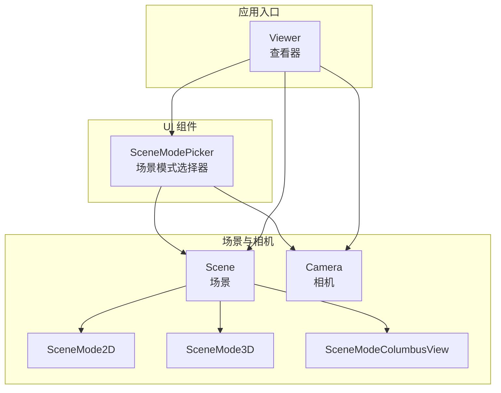
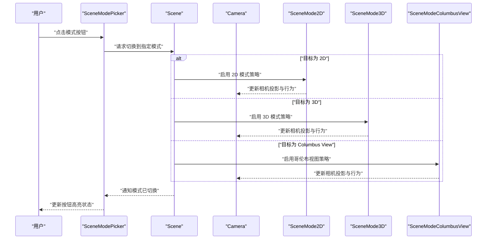
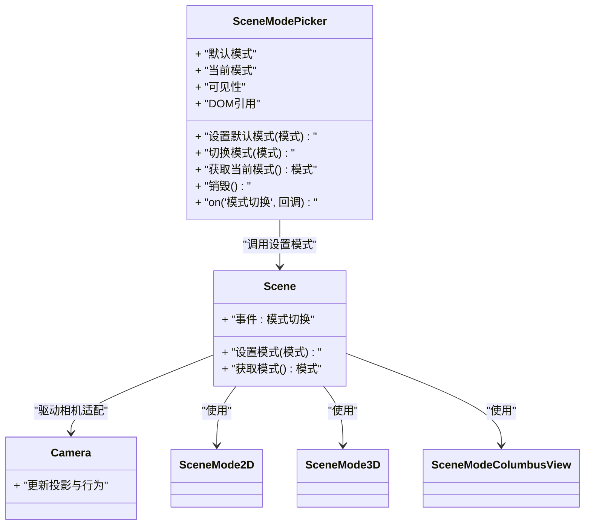
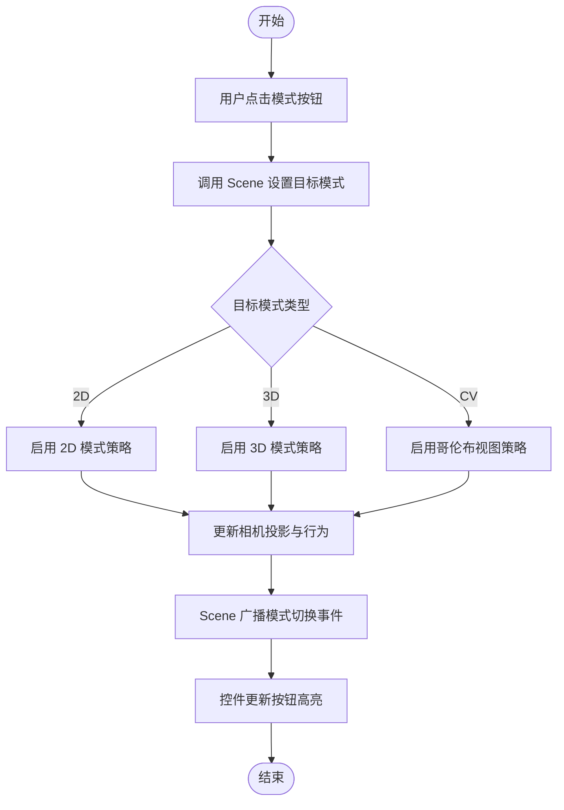
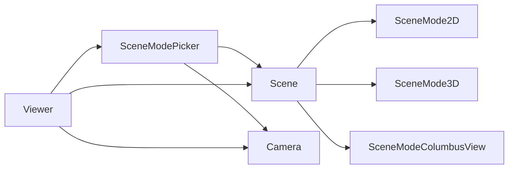

# 场景模式选择器API

<cite>
**本文引用的文件**   
- [SceneModePicker.js](file://Source/Widgets/SceneModePicker/SceneModePicker.js)
- [SceneMode2D.js](file://Source/Scene/SceneMode2D.js)
- [SceneMode3D.js](file://Source/Scene/SceneMode3D.js)
- [SceneModeColumbusView.js](file://Source/Scene/SceneModeColumbusView.js)
- [Camera.js](file://Source/Scene/Camera.js)
- [Viewer.js](file://Source/Widgets/Viewer/Viewer.js)
- [Scene.js](file://Source/Scene/Scene.js)
</cite>

## 目录
1. [简介](#简介)
2. [项目结构](#项目结构)
3. [核心组件](#核心组件)
4. [架构总览](#架构总览)
5. [详细组件分析](#详细组件分析)
6. [依赖关系分析](#依赖关系分析)
7. [性能考量](#性能考量)
8. [故障排查指南](#故障排查指南)
9. [结论](#结论)
10. [附录](#附录)

## 简介
本文件为 Cesium 场景模式选择器（SceneModePicker）的完整 API 文档，聚焦于 2D、3D、哥伦布视图（Columbus View）三种模式的切换能力。内容涵盖：
- 控件初始化与配置项（默认模式、可见性、DOM 容器等）
- 模式切换事件处理与回调
- 用户交互反馈与样式定制
- 与相机系统的集成关系
- 不同模式下的渲染与性能特点
- 动画过渡控制方法

## 项目结构
SceneModePicker 属于 Widgets 层 UI 组件，位于 Source/Widgets/SceneModePicker 目录下；其运行时依赖 Scene 与 Camera 子系统，并通过 Viewer 进行高层集成。

图表来源
- [SceneModePicker.js:1-200](file://Source/Widgets/SceneModePicker/SceneModePicker.js#L1-L200)
- [Scene.js:1-200](file://Source/Scene/Scene.js#L1-L200)
- [Camera.js:1-200](file://Source/Scene/Camera.js#L1-L200)
- [SceneMode2D.js:1-100](file://Source/Scene/SceneMode2D.js#L1-L100)
- [SceneMode3D.js:1-100](file://Source/Scene/SceneMode3D.js#L1-L100)
- [SceneModeColumbusView.js:1-100](file://Source/Scene/SceneModeColumbusView.js#L1-L100)
- [Viewer.js:1-200](file://Source/Widgets/Viewer/Viewer.js#L1-L200)

章节来源
- [SceneModePicker.js:1-200](file://Source/Widgets/SceneModePicker/SceneModePicker.js#L1-L200)
- [Viewer.js:1-200](file://Source/Widgets/Viewer/Viewer.js#L1-L200)

## 核心组件
- SceneModePicker：提供 2D/3D/Columbus View 模式切换按钮组，支持自定义 DOM 容器、默认模式、可见性与事件监听。
- Scene：维护当前场景模式、渲染管线与资源生命周期。
- Camera：负责视角与投影矩阵，随模式切换调整行为。
- 各模式实现（SceneMode2D、SceneMode3D、SceneModeColumbusView）：封装特定模式的相机与渲染策略。

章节来源
- [SceneModePicker.js:1-200](file://Source/Widgets/SceneModePicker/SceneModePicker.js#L1-L200)
- [Scene.js:1-200](file://Source/Scene/Scene.js#L1-L200)
- [Camera.js:1-200](file://Source/Scene/Camera.js#L1-L200)
- [SceneMode2D.js:1-100](file://Source/Scene/SceneMode2D.js#L1-L100)
- [SceneMode3D.js:1-100](file://Source/Scene/SceneMode3D.js#L1-L100)
- [SceneModeColumbusView.js:1-100](file://Source/Scene/SceneModeColumbusView.js#L1-L100)

## 架构总览
SceneModePicker 通过调用 Scene 的接口设置目标模式，并触发相机系统适配相应投影与交互策略。Viewer 作为高层入口，将 SceneModePicker 挂载到界面并提供便捷配置。

图表来源
- [SceneModePicker.js:1-200](file://Source/Widgets/SceneModePicker/SceneModePicker.js#L1-L200)
- [Scene.js:1-200](file://Source/Scene/Scene.js#L1-L200)
- [Camera.js:1-200](file://Source/Scene/Camera.js#L1-L200)
- [SceneMode2D.js:1-100](file://Source/Scene/SceneMode2D.js#L1-L100)
- [SceneMode3D.js:1-100](file://Source/Scene/SceneMode3D.js#L1-L100)
- [SceneModeColumbusView.js:1-100](file://Source/Scene/SceneModeColumbusView.js#L1-L100)

## 详细组件分析

### SceneModePicker 类与方法
- 构造函数与选项
  - 支持传入 DOM 容器、默认模式、是否显示等配置项。
  - 内部创建三个模式按钮，绑定点击事件以触发模式切换。
- 公共属性
  - 当前模式：反映当前选中的 2D/3D/Columbus View。
  - 可见性：控制控件在界面上的显隐。
  - DOM 引用：指向根节点，便于外部样式覆盖或移动位置。
- 关键方法
  - 设置默认模式：用于初始化时指定首选模式。
  - 切换模式：根据传入的目标模式执行切换流程。
  - 获取当前模式：返回当前激活的模式标识。
  - 销毁：释放事件监听与 DOM 引用。
- 事件
  - 模式切换事件：在模式变更前后触发，供上层业务监听与记录。

图表来源
- [SceneModePicker.js:1-200](file://Source/Widgets/SceneModePicker/SceneModePicker.js#L1-L200)
- [Scene.js:1-200](file://Source/Scene/Scene.js#L1-L200)
- [Camera.js:1-200](file://Source/Scene/Camera.js#L1-L200)
- [SceneMode2D.js:1-100](file://Source/Scene/SceneMode2D.js#L1-L100)
- [SceneMode3D.js:1-100](file://Source/Scene/SceneMode3D.js#L1-L100)
- [SceneModeColumbusView.js:1-100](file://Source/Scene/SceneModeColumbusView.js#L1-L100)

章节来源
- [SceneModePicker.js:1-200](file://Source/Widgets/SceneModePicker/SceneModePicker.js#L1-L200)

### 模式切换流程与事件处理
- 用户点击按钮后，控件向 Scene 发起模式切换请求。
- Scene 根据目标模式加载对应策略，并通知 Camera 更新投影与交互。
- 切换完成后，Scene 广播“模式切换”事件，控件更新按钮高亮状态。
- 上层可监听该事件，执行自定义逻辑（如保存历史、统计指标）。

图表来源
- [SceneModePicker.js:1-200](file://Source/Widgets/SceneModePicker/SceneModePicker.js#L1-L200)
- [Scene.js:1-200](file://Source/Scene/Scene.js#L1-L200)
- [Camera.js:1-200](file://Source/Scene/Camera.js#L1-L200)

章节来源
- [SceneModePicker.js:1-200](file://Source/Widgets/SceneModePicker/SceneModePicker.js#L1-L200)
- [Scene.js:1-200](file://Source/Scene/Scene.js#L1-L200)

### 与相机系统的集成关系
- 2D 模式：相机采用正交投影，适合平面浏览与标注。
- 3D 模式：相机采用透视投影，支持三维导航与深度感知。
- Columbus View：相机结合地形与地图贴图，呈现“展开地球”的视觉效果。
- 切换过程中，Camera 会重新计算视锥体与投影矩阵，确保视图连续。

章节来源
- [Camera.js:1-200](file://Source/Scene/Camera.js#L1-L200)
- [SceneMode2D.js:1-100](file://Source/Scene/SceneMode2D.js#L1-L100)
- [SceneMode3D.js:1-100](file://Source/Scene/SceneMode3D.js#L1-L100)
- [SceneModeColumbusView.js:1-100](file://Source/Scene/SceneModeColumbusView.js#L1-L100)

### 动画效果与过渡控制
- 模式切换通常伴随相机动画，以保证视觉连贯。
- 可通过 Scene 提供的动画控制接口，调整过渡时长与缓动函数。
- 若需禁用动画，可在切换前关闭相机动画或直接设置相机状态。

章节来源
- [Scene.js:1-200](file://Source/Scene/Scene.js#L1-L200)
- [Camera.js:1-200](file://Source/Scene/Camera.js#L1-L200)

### 自定义样式与用户交互反馈
- 通过 DOM 引用对按钮容器进行 CSS 覆盖，实现主题化。
- 监听模式切换事件，在切换前后添加/移除高亮类名，提供即时反馈。
- 可将控件移动到任意父容器，配合布局系统进行响应式适配。

章节来源
- [SceneModePicker.js:1-200](file://Source/Widgets/SceneModePicker/SceneModePicker.js#L1-L200)

### 默认模式设置与初始化
- 构造时可指定默认模式，控件将在首次渲染时选中对应按钮。
- 也可在运行期调用设置方法动态更改默认模式，随后刷新 UI 状态。

章节来源
- [SceneModePicker.js:1-200](file://Source/Widgets/SceneModePicker/SceneModePicker.js#L1-L200)

### 与 Viewer 的集成
- Viewer 提供便捷方式将 SceneModePicker 添加到界面，并自动关联 Scene 与 Camera。
- 通过 Viewer 的配置对象，可一次性完成控件可见性、默认模式等设置。

章节来源
- [Viewer.js:1-200](file://Source/Widgets/Viewer/Viewer.js#L1-L200)

## 依赖关系分析
- SceneModePicker 依赖 Scene 与 Camera 进行模式切换与视图更新。
- Scene 依赖具体模式实现（2D/3D/Columbus View）来管理渲染与交互策略。
- Viewer 作为高层聚合，协调 UI 组件与底层场景。

图表来源
- [SceneModePicker.js:1-200](file://Source/Widgets/SceneModePicker/SceneModePicker.js#L1-L200)
- [Scene.js:1-200](file://Source/Scene/Scene.js#L1-L200)
- [Camera.js:1-200](file://Source/Scene/Camera.js#L1-L200)
- [SceneMode2D.js:1-100](file://Source/Scene/SceneMode2D.js#L1-L100)
- [SceneMode3D.js:1-100](file://Source/Scene/SceneMode3D.js#L1-L100)
- [SceneModeColumbusView.js:1-100](file://Source/Scene/SceneModeColumbusView.js#L1-L100)
- [Viewer.js:1-200](file://Source/Widgets/Viewer/Viewer.js#L1-L200)

章节来源
- [SceneModePicker.js:1-200](file://Source/Widgets/SceneModePicker/SceneModePicker.js#L1-L200)
- [Scene.js:1-200](file://Source/Scene/Scene.js#L1-L200)
- [Camera.js:1-200](file://Source/Scene/Camera.js#L1-L200)
- [Viewer.js:1-200](file://Source/Widgets/Viewer/Viewer.js#L1-L200)

## 性能考量
- 2D 模式：投影简单、绘制开销较低，适合大规模标注与矢量数据展示。
- 3D 模式：透视投影与深度缓冲带来更高 GPU 压力，建议合理控制模型数量与材质复杂度。
- Columbus View：介于两者之间，兼顾地形与地图贴图的渲染成本。
- 切换动画会增加瞬时负载，建议在大数据量场景下缩短过渡时长或禁用动画以提升流畅度。

[本节为通用性能指导，不直接分析具体文件]

## 故障排查指南
- 问题：切换后视图异常或相机位置丢失
  - 检查是否在切换前禁用了必要的相机状态同步。
  - 确认未手动覆盖相机投影矩阵导致模式策略失效。
- 问题：模式切换事件未触发
  - 确认事件监听器绑定在正确的实例上，且未被重复销毁。
- 问题：样式未生效
  - 检查 DOM 引用是否正确，CSS 选择器优先级是否足够。
- 问题：动画卡顿
  - 降低过渡时长或禁用动画；减少同时加载的模型与纹理。

章节来源
- [SceneModePicker.js:1-200](file://Source/Widgets/SceneModePicker/SceneModePicker.js#L1-L200)
- [Scene.js:1-200](file://Source/Scene/Scene.js#L1-L200)
- [Camera.js:1-200](file://Source/Scene/Camera.js#L1-L200)

## 结论
SceneModePicker 提供了直观的场景模式切换能力，并与 Scene 和 Camera 紧密协作，确保在不同模式下获得一致的交互体验。通过合理的动画控制与样式定制，开发者可以打造符合产品风格的可视化界面。在大数据量场景中，应关注不同模式的性能差异，选择合适的模式与参数以获得最佳用户体验。

[本节为总结性内容，不直接分析具体文件]

## 附录
- 常用配置项速览
  - 默认模式：初始化时指定首选模式。
  - 可见性：控制控件显示与隐藏。
  - DOM 容器：指定控件挂载的父节点。
- 事件列表
  - 模式切换：在模式变更后触发，携带新/旧模式信息。
- 参考路径
  - 控件实现：[SceneModePicker.js](file://Source/Widgets/SceneModePicker/SceneModePicker.js)
  - 场景与相机：[Scene.js](file://Source/Scene/Scene.js)、[Camera.js](file://Source/Scene/Camera.js)
  - 模式实现：[SceneMode2D.js](file://Source/Scene/SceneMode2D.js)、[SceneMode3D.js](file://Source/Scene/SceneMode3D.js)、[SceneModeColumbusView.js](file://Source/Scene/SceneModeColumbusView.js)
  - 集成入口：[Viewer.js](file://Source/Widgets/Viewer/Viewer.js)