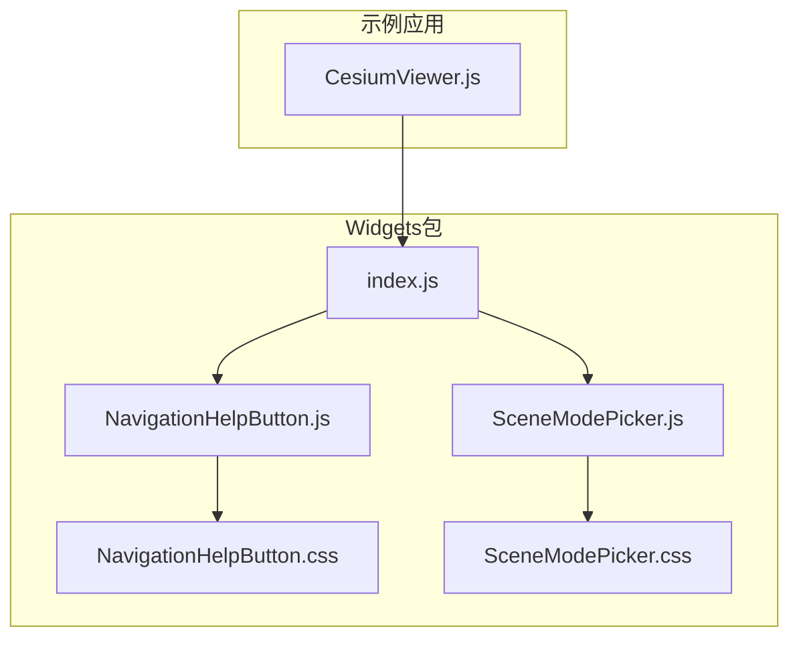
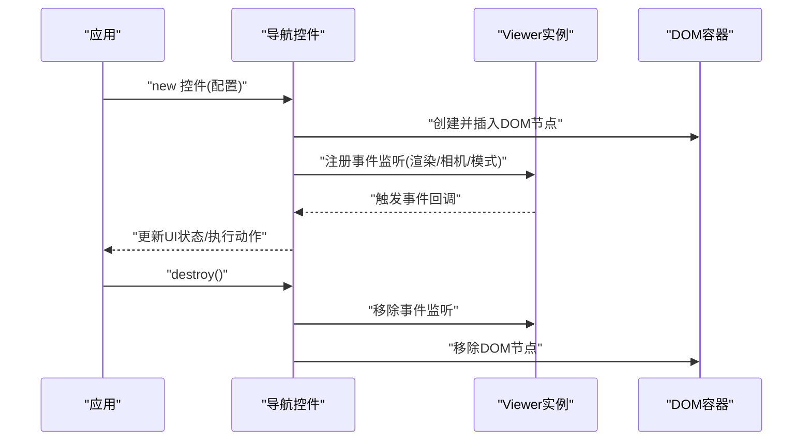
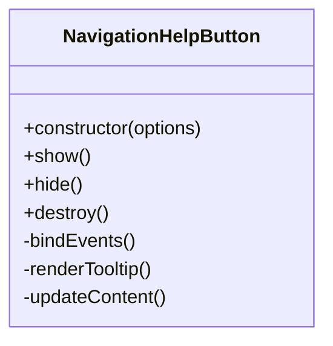
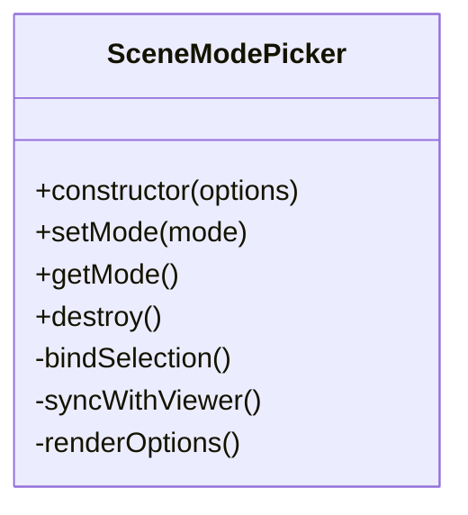
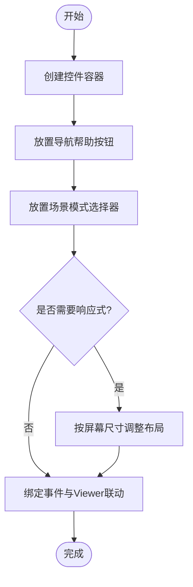
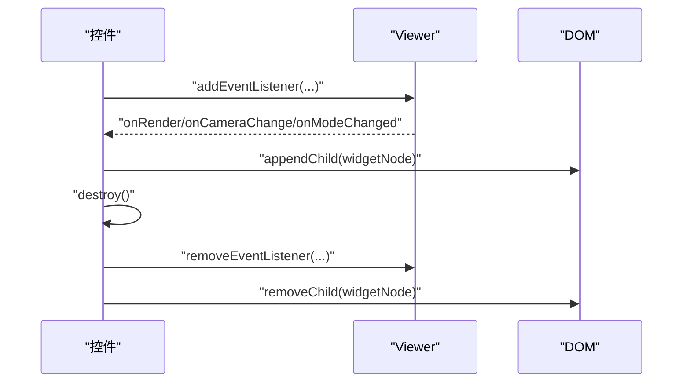
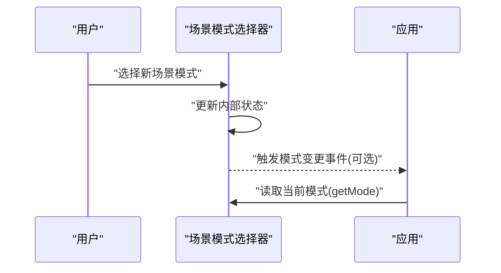
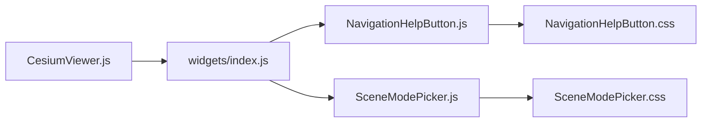

# 基础导航控件API

<cite>
**本文引用的文件**   
- [packages/widgets/src/NavigationHelpButton.js](file://packages/widgets/src/NavigationHelpButton.js)
- [packages/widgets/src/SceneModePicker.js](file://packages/widgets/src/SceneModePicker.js)
- [packages/widgets/src/NavigationHelpButton.css](file://packages/widgets/src/NavigationHelpButton.css)
- [packages/widgets/src/SceneModePicker.css](file://packages/widgets/src/SceneModePicker.css)
- [packages/widgets/index.js](file://packages/widgets/index.js)
- [Apps/CesiumViewer/CesiumViewer.js](file://Apps/CesiumViewer/CesiumViewer.js)
</cite>

## 目录
1. [简介](#简介)
2. [项目结构](#项目结构)
3. [核心组件](#核心组件)
4. [架构总览](#架构总览)
5. [详细组件分析](#详细组件分析)
6. [依赖关系分析](#依赖关系分析)
7. [性能考虑](#性能考虑)
8. [故障排查指南](#故障排查指南)
9. [结论](#结论)
10. [附录](#附录)

## 简介
本文件面向Cesium基础导航控件的通用API，聚焦于导航类UI控件的共同基类、继承关系与通用配置项；系统说明控件的生命周期管理、事件系统、样式主题与国际化支持；并提供控件组合使用的最佳实践（布局管理、响应式适配、性能优化），以及控件与Viewer实例的绑定关系与销毁机制。文档以仓库中widgets包下的导航相关实现为依据，结合示例应用的使用方式，给出可操作的指导。

## 项目结构
导航控件位于widgets包中，主要包含：
- 导航帮助按钮：用于提示用户如何操作场景
- 场景模式选择器：用于切换二维/三维/哥伦布视图等场景模式
- 对应CSS样式文件
- widgets包的统一导出入口
- 示例应用中集成这些控件的方式

图表来源
- [packages/widgets/src/NavigationHelpButton.js](file://packages/widgets/src/NavigationHelpButton.js)
- [packages/widgets/src/SceneModePicker.js](file://packages/widgets/src/SceneModePicker.js)
- [packages/widgets/src/NavigationHelpButton.css](file://packages/widgets/src/NavigationHelpButton.css)
- [packages/widgets/src/SceneModePicker.css](file://packages/widgets/src/SceneModePicker.css)
- [packages/widgets/index.js](file://packages/widgets/index.js)
- [Apps/CesiumViewer/CesiumViewer.js](file://Apps/CesiumViewer/CesiumViewer.js)

章节来源
- [packages/widgets/index.js](file://packages/widgets/index.js)
- [Apps/CesiumViewer/CesiumViewer.js](file://Apps/CesiumViewer/CesiumViewer.js)

## 核心组件
- 导航帮助按钮：提供交互提示面板，帮助用户了解鼠标/触摸操作方式
- 场景模式选择器：提供二维/三维/哥伦布视图等模式切换能力
- 样式主题：通过独立CSS文件定义外观，便于覆盖与定制
- 统一导出：widgets包对外暴露上述控件，供应用引入使用

章节来源
- [packages/widgets/src/NavigationHelpButton.js](file://packages/widgets/src/NavigationHelpButton.js)
- [packages/widgets/src/SceneModePicker.js](file://packages/widgets/src/SceneModePicker.js)
- [packages/widgets/src/NavigationHelpButton.css](file://packages/widgets/src/NavigationHelpButton.css)
- [packages/widgets/src/SceneModePicker.css](file://packages/widgets/src/SceneModePicker.css)
- [packages/widgets/index.js](file://packages/widgets/index.js)

## 架构总览
导航控件作为独立的UI组件，遵循“创建—挂载—监听—销毁”的标准生命周期。它们通常：
- 在构造时接收配置项（如容器、是否可见、默认模式等）
- 将DOM节点插入到指定容器或默认位置
- 订阅Viewer的事件（如渲染帧、相机变化、模式切换等）
- 在销毁时移除事件监听与DOM引用，避免内存泄漏

图表来源
- [packages/widgets/src/NavigationHelpButton.js](file://packages/widgets/src/NavigationHelpButton.js)
- [packages/widgets/src/SceneModePicker.js](file://packages/widgets/src/SceneModePicker.js)

## 详细组件分析

### 导航帮助按钮（NavigationHelpButton）
- 职责：展示操作提示面板，辅助用户理解交互方式
- 典型配置：容器元素、初始显示状态、文本内容（可能涉及国际化键）
- 生命周期：
  - 初始化：创建DOM、注入样式、绑定点击/键盘事件
  - 运行期：根据Viewer状态（如是否处于特定模式）动态调整提示内容
  - 销毁：解绑事件、清理DOM引用
- 事件系统：
  - 内部：点击展开/收起提示面板
  - 外部：可通过事件总线或回调通知应用层（若实现）
- 样式主题：通过独立CSS控制图标、面板布局与动画
- 国际化：若存在文案，建议通过键值映射进行本地化替换

图表来源
- [packages/widgets/src/NavigationHelpButton.js](file://packages/widgets/src/NavigationHelpButton.js)
- [packages/widgets/src/NavigationHelpButton.css](file://packages/widgets/src/NavigationHelpButton.css)

章节来源
- [packages/widgets/src/NavigationHelpButton.js](file://packages/widgets/src/NavigationHelpButton.js)
- [packages/widgets/src/NavigationHelpButton.css](file://packages/widgets/src/NavigationHelpButton.css)

### 场景模式选择器（SceneModePicker）
- 职责：提供二维/三维/哥伦布视图等模式切换
- 典型配置：容器元素、默认模式、是否允许切换至某模式
- 生命周期：
  - 初始化：创建选项列表、绑定选择事件、同步当前模式
  - 运行期：监听Viewer模式变化，保持UI一致
  - 销毁：移除事件监听、释放DOM
- 事件系统：
  - 内部：用户选择新模式后触发切换
  - 外部：可派发模式变更事件供应用监听
- 样式主题：通过独立CSS控制下拉/按钮样式与选中态
- 国际化：若存在模式名称文案，建议通过键值映射进行本地化替换

图表来源
- [packages/widgets/src/SceneModePicker.js](file://packages/widgets/src/SceneModePicker.js)
- [packages/widgets/src/SceneModePicker.css](file://packages/widgets/src/SceneModePicker.css)

章节来源
- [packages/widgets/src/SceneModePicker.js](file://packages/widgets/src/SceneModePicker.js)
- [packages/widgets/src/SceneModePicker.css](file://packages/widgets/src/SceneModePicker.css)

### 控件组合与布局
- 常见组合：导航帮助按钮 + 场景模式选择器，置于屏幕角落
- 布局策略：
  - 固定定位：使用绝对/固定定位将控件放置于视口四角
  - 容器包裹：将多个控件放入一个容器，使用flex/grid进行对齐
  - 响应式：在小屏设备上隐藏次要控件或折叠为工具栏
- 最佳实践：
  - 将控件容器与地图容器分离，避免z-index冲突
  - 为控件设置合理的margin/padding，防止遮挡地图内容
  - 在窗口resize时重新计算控件位置（必要时）

[此图为概念性流程，不直接映射具体源码文件]

### 与Viewer的绑定与销毁
- 绑定关系：
  - 控件在初始化时获取Viewer实例引用
  - 订阅Viewer的渲染循环、相机变化、模式切换等事件
  - 根据Viewer状态更新UI（如高亮当前模式）
- 销毁机制：
  - 调用destroy方法时，移除所有事件监听
  - 从DOM树中移除控件节点
  - 清空对Viewer的引用，避免循环引用导致内存泄漏

图表来源
- [packages/widgets/src/NavigationHelpButton.js](file://packages/widgets/src/NavigationHelpButton.js)
- [packages/widgets/src/SceneModePicker.js](file://packages/widgets/src/SceneModePicker.js)

章节来源
- [packages/widgets/src/NavigationHelpButton.js](file://packages/widgets/src/NavigationHelpButton.js)
- [packages/widgets/src/SceneModePicker.js](file://packages/widgets/src/SceneModePicker.js)

### 事件系统与回调
- 内部事件：
  - 导航帮助按钮：点击展开/收起提示面板
  - 场景模式选择器：模式切换完成事件
- 外部集成：
  - 应用可在控件初始化后监听其自定义事件（若实现）
  - 或通过查询控件状态（如getMode）主动获取信息

图表来源
- [packages/widgets/src/SceneModePicker.js](file://packages/widgets/src/SceneModePicker.js)

章节来源
- [packages/widgets/src/SceneModePicker.js](file://packages/widgets/src/SceneModePicker.js)

### 样式主题与国际化
- 样式主题：
  - 通过独立CSS文件定义控件外观
  - 应用可通过覆盖CSS变量或类名实现主题定制
- 国际化：
  - 若控件包含文案，建议使用键值映射表进行本地化
  - 在运行时根据语言环境加载对应文案资源

章节来源
- [packages/widgets/src/NavigationHelpButton.css](file://packages/widgets/src/NavigationHelpButton.css)
- [packages/widgets/src/SceneModePicker.css](file://packages/widgets/src/SceneModePicker.css)

## 依赖关系分析
- 模块导出：widgets包通过index.js统一导出导航控件，应用侧按需引入
- 示例集成：示例应用CesiumViewer.js中演示了如何引入并使用这些控件
- 样式依赖：各控件依赖对应的CSS文件，确保正确加载以避免样式缺失

图表来源
- [packages/widgets/index.js](file://packages/widgets/index.js)
- [packages/widgets/src/NavigationHelpButton.js](file://packages/widgets/src/NavigationHelpButton.js)
- [packages/widgets/src/SceneModePicker.js](file://packages/widgets/src/SceneModePicker.js)
- [packages/widgets/src/NavigationHelpButton.css](file://packages/widgets/src/NavigationHelpButton.css)
- [packages/widgets/src/SceneModePicker.css](file://packages/widgets/src/SceneModePicker.css)
- [Apps/CesiumViewer/CesiumViewer.js](file://Apps/CesiumViewer/CesiumViewer.js)

章节来源
- [packages/widgets/index.js](file://packages/widgets/index.js)
- [Apps/CesiumViewer/CesiumViewer.js](file://Apps/CesiumViewer/CesiumViewer.js)

## 性能考虑
- 事件节流：对高频事件（如渲染循环）进行节流或去抖处理，减少UI重绘开销
- DOM最小化：仅在必要时更新DOM节点，避免频繁插入/删除
- 样式合并：尽量复用CSS类，减少样式计算与重排
- 资源加载：按需加载控件及其样式，避免首屏阻塞
- 内存管理：确保在销毁时彻底清理事件监听与DOM引用，防止内存泄漏

[本节为通用性能建议，不直接分析具体源码文件]

## 故障排查指南
- 控件未显示：
  - 检查是否正确引入widgets包与对应CSS
  - 确认容器元素是否存在且可见
- 事件无响应：
  - 检查是否在正确的时机绑定事件
  - 确认未被其他事件拦截
- 样式错乱：
  - 检查CSS加载顺序与优先级
  - 确认是否有全局样式覆盖
- 内存泄漏：
  - 确保在页面卸载或组件销毁时调用destroy
  - 检查是否存在对Viewer或DOM的强引用未释放

章节来源
- [packages/widgets/src/NavigationHelpButton.js](file://packages/widgets/src/NavigationHelpButton.js)
- [packages/widgets/src/SceneModePicker.js](file://packages/widgets/src/SceneModePicker.js)

## 结论
基础导航控件提供了标准化的UI交互能力，具备清晰的生命周期、事件系统与样式主题机制。通过合理的布局管理与响应式适配，可以在不同设备上获得一致的体验。遵循本文的最佳实践与故障排查建议，可有效提升应用的稳定性与性能。

[本节为总结性内容，不直接分析具体源码文件]

## 附录
- 参考示例：查看示例应用中的控件使用方式，快速上手集成
- 扩展开发：基于现有控件基类与模式，可进一步扩展更多导航功能

章节来源
- [Apps/CesiumViewer/CesiumViewer.js](file://Apps/CesiumViewer/CesiumViewer.js)