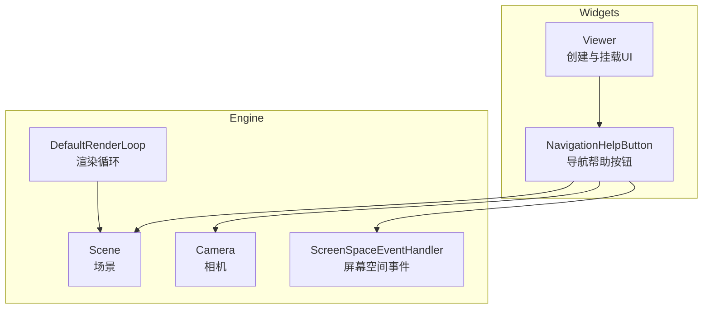
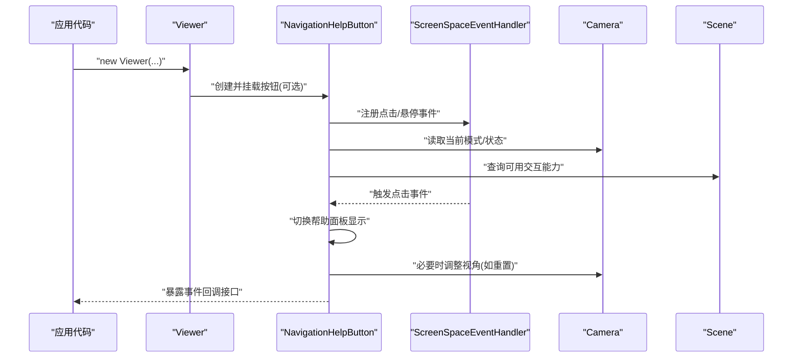
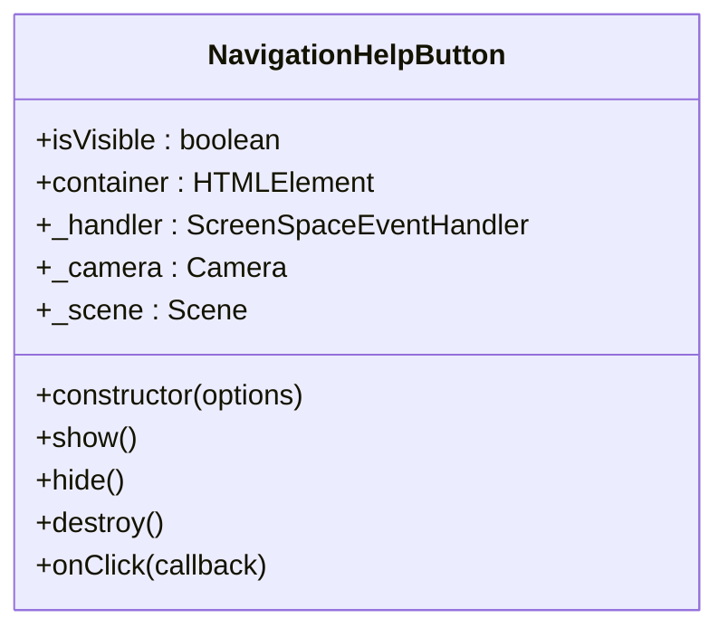
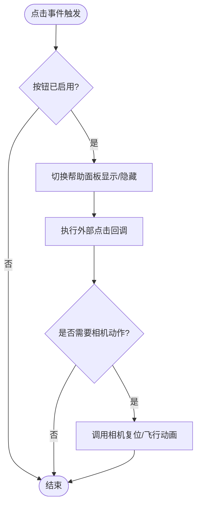
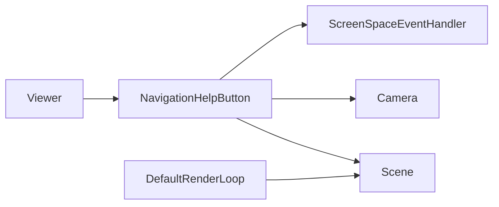

# 导航帮助按钮API

<cite>
**本文引用的文件**   
- [NavigationHelpButton.js](file://packages/widgets/src/NavigationHelpButton.js)
- [Viewer.js](file://packages/widgets/src/Viewer.js)
- [createDefaultRenderLoop.js](file://packages/engine/src/Core/createDefaultRenderLoop.js)
</cite>

## 目录
1. [简介](#简介)
2. [项目结构](#项目结构)
3. [核心组件](#核心组件)
4. [架构总览](#架构总览)
5. [详细组件分析](#详细组件分析)
6. [依赖分析](#依赖分析)
7. [性能考虑](#性能考虑)
8. [故障排查指南](#故障排查指南)
9. [结论](#结论)
10. [附录](#附录)

## 简介
本文件为 Cesium 的“导航帮助按钮”（NavigationHelpButton）控件提供详细的 API 文档，涵盖配置选项、事件处理机制、样式定制方法、显示位置控制、图标自定义、语言本地化支持等。同时给出点击事件的监听与相机控制集成示例，并说明在不同场景模式下的行为差异与性能优化建议。

## 项目结构
导航帮助按钮位于 widgets 包中，作为 UI 控件被 Viewer 默认加载或按需添加。其职责是：
- 在视口角落渲染一个可交互的帮助按钮
- 点击后展示键盘/鼠标操作提示
- 与 Viewer 的 Scene、Camera、ScreenSpaceEventHandler 协作完成交互

图表来源
- [NavigationHelpButton.js](file://packages/widgets/src/NavigationHelpButton.js)
- [Viewer.js](file://packages/widgets/src/Viewer.js)
- [createDefaultRenderLoop.js](file://packages/engine/src/Core/createDefaultRenderLoop.js)

章节来源
- [NavigationHelpButton.js](file://packages/widgets/src/NavigationHelpButton.js)
- [Viewer.js](file://packages/widgets/src/Viewer.js)
- [createDefaultRenderLoop.js](file://packages/engine/src/Core/createDefaultRenderLoop.js)

## 核心组件
- NavigationHelpButton：负责渲染帮助面板、管理键盘/鼠标提示、响应点击事件、与相机和场景交互。
- Viewer：提供 Scene、Camera、ScreenSpaceEventHandler 等运行时对象，并在初始化时可选择是否包含该按钮。
- Engine 渲染循环：驱动 Scene 更新与绘制，间接影响 UI 的可见性与刷新时机。

章节来源
- [NavigationHelpButton.js](file://packages/widgets/src/NavigationHelpButton.js)
- [Viewer.js](file://packages/widgets/src/Viewer.js)
- [createDefaultRenderLoop.js](file://packages/engine/src/Core/createDefaultRenderLoop.js)

## 架构总览
导航帮助按钮通过 ScreenSpaceEventHandler 订阅屏幕事件，结合 Camera 状态与 Scene 模式决定提示内容与交互行为。它通常以 DOM 元素形式附着到 Viewer 的容器上，并通过 CSS 控制外观与定位。

图表来源
- [NavigationHelpButton.js](file://packages/widgets/src/NavigationHelpButton.js)
- [Viewer.js](file://packages/widgets/src/Viewer.js)

## 详细组件分析

### 类与方法概览
- 构造函数
  - 接收配置对象，用于设置按钮文本、位置、是否启用、事件回调等。
- 显示/隐藏
  - 提供方法控制帮助面板的显隐状态。
- 销毁
  - 释放事件监听与 DOM 引用，避免内存泄漏。
- 事件
  - 对外暴露点击事件回调，便于应用层接入相机控制逻辑。

图表来源
- [NavigationHelpButton.js](file://packages/widgets/src/NavigationHelpButton.js)

章节来源
- [NavigationHelpButton.js](file://packages/widgets/src/NavigationHelpButton.js)

### 配置选项
以下属性用于定制按钮行为与外观（具体键名以源码为准）：
- 文本与提示
  - 按钮标题/提示文案：支持字符串或函数动态生成，便于国际化。
  - 帮助内容：支持 HTML 片段或模板，用于描述快捷键与操作说明。
- 位置与布局
  - 容器引用：将按钮挂载到指定 DOM 节点。
  - 对齐方式：左上/右上/左下/右下等。
  - 边距：距离容器边缘的像素偏移。
- 行为开关
  - 是否启用：控制按钮是否参与事件处理与渲染。
  - 自动隐藏：是否在用户交互后自动收起。
- 样式定制
  - 自定义 CSS 类名：覆盖默认样式。
  - 图标路径/资源：替换默认图标。
- 语言本地化
  - 语言键映射：提供多语言文案字典，按当前语言选择对应文案。
- 事件钩子
  - 点击回调：在按钮点击时执行，常用于联动相机复位或打开自定义帮助页。

章节来源
- [NavigationHelpButton.js](file://packages/widgets/src/NavigationHelpButton.js)

### 事件处理机制
- 事件源
  - 基于 ScreenSpaceEventHandler 捕获点击、悬停等屏幕事件。
- 事件生命周期
  - 注册：构造时绑定事件处理器。
  - 触发：用户点击按钮时触发内部逻辑与外部回调。
  - 清理：销毁时移除事件监听，防止重复绑定与内存泄漏。
- 与相机集成
  - 可在点击回调中调用相机 API 实现“回到初始视角”、“重置缩放/倾斜”等功能。

图表来源
- [NavigationHelpButton.js](file://packages/widgets/src/NavigationHelpButton.js)

章节来源
- [NavigationHelpButton.js](file://packages/widgets/src/NavigationHelpButton.js)

### 显示位置控制
- 容器挂载
  - 可通过传入容器元素将按钮放置于任意父节点。
- 对齐与边距
  - 支持四角对齐与像素级边距，适配不同 UI 布局。
- 层级与遮挡
  - 通过 z-index 与 pointer-events 控制交互优先级，避免被其他 UI 遮挡。

章节来源
- [NavigationHelpButton.js](file://packages/widgets/src/NavigationHelpButton.js)

### 图标自定义
- 替换图标资源
  - 通过配置项指定新的图标 URL 或内联 SVG。
- 尺寸与颜色
  - 使用 CSS 变量或自定义类名覆盖默认宽高与颜色。
- 主题适配
  - 根据深色/浅色主题动态切换图标资源。

章节来源
- [NavigationHelpButton.js](file://packages/widgets/src/NavigationHelpButton.js)

### 语言本地化支持
- 多语言字典
  - 提供语言键值对，按当前语言选择对应文案。
- 动态更新
  - 支持运行时切换语言并刷新按钮文案。
- 扩展点
  - 允许注入自定义翻译键，满足业务特定文案需求。

章节来源
- [NavigationHelpButton.js](file://packages/widgets/src/NavigationHelpButton.js)

### 与相机控制的集成示例
- 点击回调中复位相机
  - 在点击事件中调用相机 API 将视角恢复到默认位置与朝向。
- 联动其他控件
  - 与图层控制面板、全屏按钮等联动，统一交互体验。
- 条件行为
  - 根据当前场景模式（如 2D/3D/Columbus View）显示不同的帮助内容或执行不同相机动作。

章节来源
- [NavigationHelpButton.js](file://packages/widgets/src/NavigationHelpButton.js)
- [Viewer.js](file://packages/widgets/src/Viewer.js)

### 不同场景模式下的行为差异
- 2D 模式
  - 提示侧重平移、缩放、旋转等操作。
- 3D 模式
  - 提示包含倾斜、环绕、飞行等高级操作。
- Columbus View 模式
  - 提示强调剖面浏览与高度控制。
- 不可用交互
  - 当某些交互被禁用时，按钮应过滤相应提示，避免误导用户。

章节来源
- [NavigationHelpButton.js](file://packages/widgets/src/NavigationHelpButton.js)

## 依赖分析
- 直接依赖
  - ScreenSpaceEventHandler：屏幕事件注册与分发。
  - Camera：读取/修改相机状态，实现复位或飞行效果。
  - Scene：查询场景模式与可用交互能力。
- 间接依赖
  - DefaultRenderLoop：驱动渲染，确保 UI 与场景同步更新。
  - Viewer：提供上述对象的实例与生命周期管理。

图表来源
- [NavigationHelpButton.js](file://packages/widgets/src/NavigationHelpButton.js)
- [Viewer.js](file://packages/widgets/src/Viewer.js)
- [createDefaultRenderLoop.js](file://packages/engine/src/Core/createDefaultRenderLoop.js)

章节来源
- [NavigationHelpButton.js](file://packages/widgets/src/NavigationHelpButton.js)
- [Viewer.js](file://packages/widgets/src/Viewer.js)
- [createDefaultRenderLoop.js](file://packages/engine/src/Core/createDefaultRenderLoop.js)

## 性能考虑
- 事件节流
  - 高频交互场景下对点击/悬停事件进行节流，减少回调开销。
- DOM 操作最小化
  - 仅在必要时更新 DOM 文本与样式，避免频繁重排重绘。
- 资源复用
  - 图标与文案缓存，避免重复加载与解析。
- 按需启用
  - 在不需要的场景关闭按钮，降低事件监听与渲染成本。
- 与渲染循环协同
  - 避免在每帧更新中进行昂贵计算，利用事件驱动的更新策略。

[本节为通用指导，不直接分析具体文件]

## 故障排查指南
- 按钮不显示
  - 检查容器是否正确挂载，CSS 是否被覆盖导致隐藏。
  - 确认按钮是否被显式禁用。
- 点击无响应
  - 检查 ScreenSpaceEventHandler 是否被其他控件抢占事件。
  - 确认 pointer-events 与 z-index 未被上层元素拦截。
- 文案未本地化
  - 验证语言键是否存在，运行时是否调用了更新文案的方法。
- 相机复位无效
  - 确认相机 API 调用参数正确，且未被其他逻辑覆盖。

章节来源
- [NavigationHelpButton.js](file://packages/widgets/src/NavigationHelpButton.js)
- [Viewer.js](file://packages/widgets/src/Viewer.js)

## 结论
NavigationHelpButton 提供了开箱即用的导航帮助能力，具备灵活的配置项、完善的本地化支持与清晰的扩展点。通过与相机和场景模式的深度集成，能够在不同交互模式下为用户提供一致的引导体验。合理运用其事件与样式定制能力，可以显著提升应用的易用性与可维护性。

[本节为总结性内容，不直接分析具体文件]

## 附录
- 最佳实践
  - 在应用启动时集中配置按钮文案与图标，保持全局一致性。
  - 为不同语言环境准备完整的翻译键集，避免缺失导致的回退显示。
  - 在复杂 UI 场景中，明确事件优先级，避免冲突。
- 参考路径
  - 按钮实现：[NavigationHelpButton.js](file://packages/widgets/src/NavigationHelpButton.js)
  - 视图集成：[Viewer.js](file://packages/widgets/src/Viewer.js)
  - 渲染循环：[createDefaultRenderLoop.js](file://packages/engine/src/Core/createDefaultRenderLoop.js)