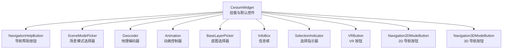
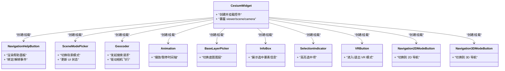
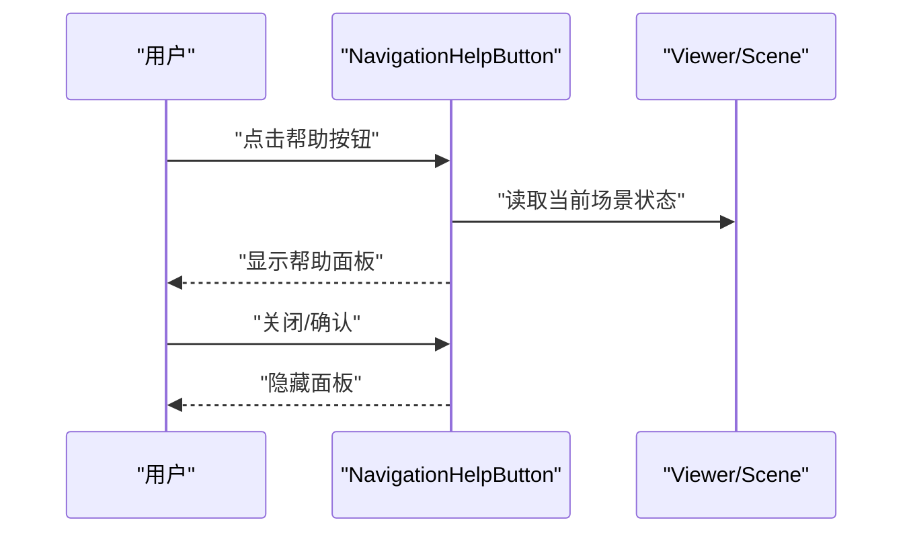
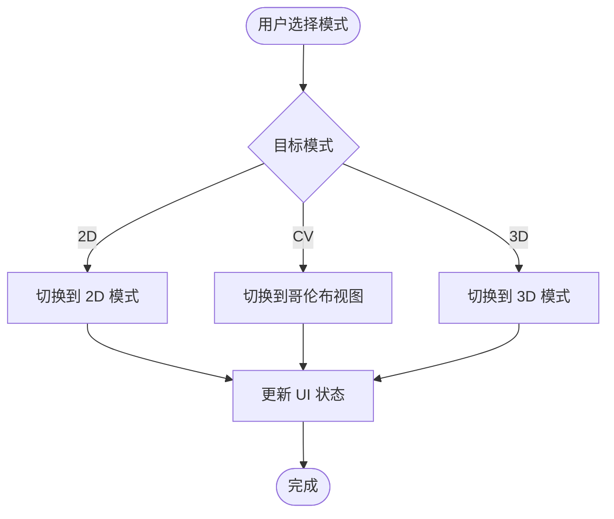
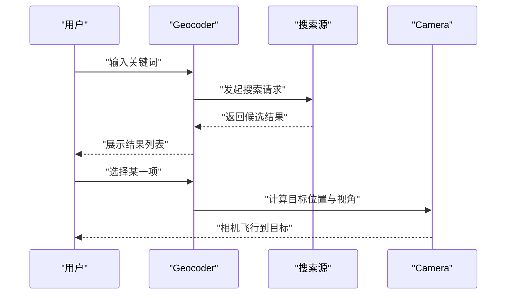
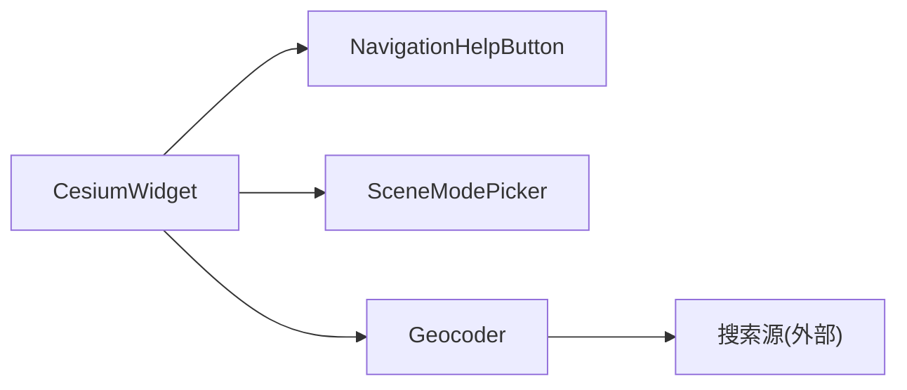

# 导航控件API

<cite>
**本文引用的文件**   
- [packages/widgets/src/NavigationHelpButton.js](file://packages/widgets/src/NavigationHelpButton.js)
- [packages/widgets/src/SceneModePicker.js](file://packages/widgets/src/SceneModePicker.js)
- [packages/widgets/src/Geocoder.js](file://packages/widgets/src/Geocoder.js)
- [packages/widgets/src/Animation.js](file://packages/widgets/src/Animation.js)
- [packages/widgets/src/BaseLayerPicker.js](file://packages/widgets/src/BaseLayerPicker.js)
- [packages/widgets/src/CesiumWidget.js](file://packages/widgets/src/CesiumWidget.js)
- [packages/widgets/src/InfoBox.js](file://packages/widgets/src/InfoBox.js)
- [packages/widgets/src/SelectionIndicator.js](file://packages/widgets/src/SelectionIndicator.js)
- [packages/widgets/src/VRButton.js](file://packages/widgets/src/VRButton.js)
- [packages/widgets/src/Navigation2DModeButton.js](file://packages/widgets/src/Navigation2DModeButton.js)
- [packages/widgets/src/Navigation3DModeButton.js](file://packages/widgets/src/Navigation3DModeButton.js)
- [packages/widgets/src/NavigationHelpButton.css](file://packages/widgets/src/NavigationHelpButton.css)
- [packages/widgets/src/SceneModePicker.css](file://packages/widgets/src/SceneModePicker.css)
- [packages/widgets/src/Geocoder.css](file://packages/widgets/src/Geocoder.css)
- [packages/widgets/src/Animation.css](file://packages/widgets/src/Animation.css)
- [packages/widgets/src/BaseLayerPicker.css](file://packages/widgets/src/BaseLayerPicker.css)
- [packages/widgets/src/InfoBox.css](file://packages/widgets/src/InfoBox.css)
- [packages/widgets/src/SelectionIndicator.css](file://packages/widgets/src/SelectionIndicator.css)
- [packages/widgets/src/VRButton.css](file://packages/widgets/src/VRButton.css)
- [packages/widgets/src/Navigation2DModeButton.css](file://packages/widgets/src/Navigation2DModeButton.css)
- [packages/widgets/src/Navigation3DModeButton.css](file://packages/widgets/src/Navigation3DModeButton.css)
</cite>

## 目录
1. [简介](#简介)
2. [项目结构](#项目结构)
3. [核心组件](#核心组件)
4. [架构总览](#架构总览)
5. [详细组件分析](#详细组件分析)
6. [依赖关系分析](#依赖关系分析)
7. [性能考虑](#性能考虑)
8. [故障排查指南](#故障排查指南)
9. [结论](#结论)
10. [附录](#附录)

## 简介
本文件为 Cesium 导航控件的完整 API 文档，聚焦以下控件：
- 导航帮助按钮（NavigationHelpButton）
- 场景模式选择器（SceneModePicker）
- 地理编码器（Geocoder）
并扩展说明与相机控制、样式定制、位置布局、事件处理、组合使用及性能优化等实践。

## 项目结构
导航控件位于 widgets 包中，每个控件包含对应的 JavaScript 实现与 CSS 样式文件。CesiumWidget 提供统一的挂载点与默认控件集合。

图表来源
- [packages/widgets/src/CesiumWidget.js](file://packages/widgets/src/CesiumWidget.js)
- [packages/widgets/src/NavigationHelpButton.js](file://packages/widgets/src/NavigationHelpButton.js)
- [packages/widgets/src/SceneModePicker.js](file://packages/widgets/src/SceneModePicker.js)
- [packages/widgets/src/Geocoder.js](file://packages/widgets/src/Geocoder.js)
- [packages/widgets/src/Animation.js](file://packages/widgets/src/Animation.js)
- [packages/widgets/src/BaseLayerPicker.js](file://packages/widgets/src/BaseLayerPicker.js)
- [packages/widgets/src/InfoBox.js](file://packages/widgets/src/InfoBox.js)
- [packages/widgets/src/SelectionIndicator.js](file://packages/widgets/src/SelectionIndicator.js)
- [packages/widgets/src/VRButton.js](file://packages/widgets/src/VRButton.js)
- [packages/widgets/src/Navigation2DModeButton.js](file://packages/widgets/src/Navigation2DModeButton.js)
- [packages/widgets/src/Navigation3DModeButton.js](file://packages/widgets/src/Navigation3DModeButton.js)

章节来源
- [packages/widgets/src/CesiumWidget.js](file://packages/widgets/src/CesiumWidget.js)

## 核心组件
本节概述各导航控件的职责与常用配置项类别（具体字段以源码为准）。

- 导航帮助按钮（NavigationHelpButton）
  - 作用：展示交互提示面板，帮助用户理解鼠标/触摸操作。
  - 常见配置类别：容器元素、定位方式、是否可见、文本内容、样式类名等。
  - 事件：打开/关闭提示时触发回调；可监听 DOM 事件进行自定义行为。
  - 样式：通过对应 CSS 文件覆盖外观与布局。

- 场景模式选择器（SceneModePicker）
  - 作用：在 2D、哥伦布视图（CV）、3D 之间切换场景模式。
  - 常见配置类别：容器元素、显示选项、图标资源、文案、是否启用特定模式等。
  - 事件：模式切换前后回调；可监听 DOM 事件。
  - 样式：通过对应 CSS 文件覆盖外观与布局。

- 地理编码器（Geocoder）
  - 作用：输入地名或坐标，驱动相机飞行到目标位置。
  - 常见配置类别：容器元素、占位符文本、搜索源列表、最大结果数、自动完成开关、定位策略、样式类等。
  - 事件：搜索结果变化、选中项变更、开始/结束搜索、错误回调等。
  - 样式：通过对应 CSS 文件覆盖外观与布局。

章节来源
- [packages/widgets/src/NavigationHelpButton.js](file://packages/widgets/src/NavigationHelpButton.js)
- [packages/widgets/src/SceneModePicker.js](file://packages/widgets/src/SceneModePicker.js)
- [packages/widgets/src/Geocoder.js](file://packages/widgets/src/Geocoder.js)

## 架构总览
导航控件与 CesiumWidget 的关系如下：CesiumWidget 负责创建和挂载控件实例，控件内部访问 Viewer/Scene/Camera 等核心对象以实现交互。

图表来源
- [packages/widgets/src/CesiumWidget.js](file://packages/widgets/src/CesiumWidget.js)
- [packages/widgets/src/NavigationHelpButton.js](file://packages/widgets/src/NavigationHelpButton.js)
- [packages/widgets/src/SceneModePicker.js](file://packages/widgets/src/SceneModePicker.js)
- [packages/widgets/src/Geocoder.js](file://packages/widgets/src/Geocoder.js)
- [packages/widgets/src/Animation.js](file://packages/widgets/src/Animation.js)
- [packages/widgets/src/BaseLayerPicker.js](file://packages/widgets/src/BaseLayerPicker.js)
- [packages/widgets/src/InfoBox.js](file://packages/widgets/src/InfoBox.js)
- [packages/widgets/src/SelectionIndicator.js](file://packages/widgets/src/SelectionIndicator.js)
- [packages/widgets/src/VRButton.js](file://packages/widgets/src/VRButton.js)
- [packages/widgets/src/Navigation2DModeButton.js](file://packages/widgets/src/Navigation2DModeButton.js)
- [packages/widgets/src/Navigation3DModeButton.js](file://packages/widgets/src/Navigation3DModeButton.js)

## 详细组件分析

### 导航帮助按钮（NavigationHelpButton）
- 职责
  - 渲染帮助面板，解释鼠标/触摸操作。
  - 支持打开/关闭、重置默认视图等辅助功能。
- 关键属性（类别）
  - 容器元素：指定挂载的 DOM 节点。
  - 可见性：控制初始显示状态。
  - 文案与图标：自定义提示内容与图标资源。
  - 样式类名：用于覆盖默认样式。
- 事件
  - 打开/关闭提示时的回调。
  - DOM 级点击/键盘事件，便于集成无障碍特性。
- 样式定制
  - 通过 NavigationHelpButton.css 覆盖背景、边框、字体、阴影等。
- 与相机控制的关系
  - 通常不直接改变相机，但“重置视图”等操作会调用相机复位逻辑。
- 示例要点
  - 将实例挂载到页面右上角，设置最小化状态，监听打开事件记录日志。

图表来源
- [packages/widgets/src/NavigationHelpButton.js](file://packages/widgets/src/NavigationHelpButton.js)
- [packages/widgets/src/NavigationHelpButton.css](file://packages/widgets/src/NavigationHelpButton.css)

章节来源
- [packages/widgets/src/NavigationHelpButton.js](file://packages/widgets/src/NavigationHelpButton.js)
- [packages/widgets/src/NavigationHelpButton.css](file://packages/widgets/src/NavigationHelpButton.css)

### 场景模式选择器（SceneModePicker）
- 职责
  - 在 2D、哥伦布视图（CV）、3D 三种模式间切换。
- 关键属性（类别）
  - 容器元素、显示选项（如是否显示 CV/3D）、图标与文案、禁用状态等。
- 事件
  - 模式切换前/后回调，便于同步业务状态。
  - DOM 事件，支持键盘导航与屏幕阅读器。
- 样式定制
  - 通过 SceneModePicker.css 调整下拉菜单、选中态、悬浮态等。
- 与相机控制的关系
  - 切换模式会触发场景重建与相机适配，可能引起短暂卡顿，建议避免频繁切换。
- 示例要点
  - 监听模式切换事件，根据模式加载不同数据源或调整 UI。

图表来源
- [packages/widgets/src/SceneModePicker.js](file://packages/widgets/src/SceneModePicker.js)
- [packages/widgets/src/SceneModePicker.css](file://packages/widgets/src/SceneModePicker.css)

章节来源
- [packages/widgets/src/SceneModePicker.js](file://packages/widgets/src/SceneModePicker.js)
- [packages/widgets/src/SceneModePicker.css](file://packages/widgets/src/SceneModePicker.css)

### 地理编码器（Geocoder）
- 职责
  - 接收用户输入，查询地理编码服务，返回候选结果，支持选择后驱动相机飞行。
- 关键属性（类别）
  - 容器元素、占位符文本、搜索源列表、最大结果数、自动完成开关、定位策略、样式类等。
- 事件
  - 搜索结果变化、选中项变更、开始/结束搜索、错误回调等。
- 样式定制
  - 通过 Geocoder.css 调整输入框、下拉列表、高亮项等。
- 与相机控制的关系
  - 选择结果后，计算目标位置与视角，驱动相机平滑飞行至目标。
- 示例要点
  - 自定义搜索源，限制结果数量，并在选择后执行额外业务逻辑（如弹出详情）。

图表来源
- [packages/widgets/src/Geocoder.js](file://packages/widgets/src/Geocoder.js)
- [packages/widgets/src/Geocoder.css](file://packages/widgets/src/Geocoder.css)

章节来源
- [packages/widgets/src/Geocoder.js](file://packages/widgets/src/Geocoder.js)
- [packages/widgets/src/Geocoder.css](file://packages/widgets/src/Geocoder.css)

### 其他相关导航控件（概览）
- 动画控制器（Animation）
  - 控制时间轴播放/暂停、速度调节，常用于演示与回放。
- 底图选择器（BaseLayerPicker）
  - 切换不同底图服务，影响整体视觉与性能。
- 信息框（InfoBox）与选择指示器（SelectionIndicator）
  - 展示选中要素信息与高亮反馈，提升交互体验。
- VR 按钮（VRButton）
  - 进入/退出 VR 模式，适用于沉浸式浏览。
- 2D/3D 导航按钮（Navigation2DModeButton / Navigation3DModeButton）
  - 快速切换导航模式，简化用户操作路径。

章节来源
- [packages/widgets/src/Animation.js](file://packages/widgets/src/Animation.js)
- [packages/widgets/src/BaseLayerPicker.js](file://packages/widgets/src/BaseLayerPicker.js)
- [packages/widgets/src/InfoBox.js](file://packages/widgets/src/InfoBox.js)
- [packages/widgets/src/SelectionIndicator.js](file://packages/widgets/src/SelectionIndicator.js)
- [packages/widgets/src/VRButton.js](file://packages/widgets/src/VRButton.js)
- [packages/widgets/src/Navigation2DModeButton.js](file://packages/widgets/src/Navigation2DModeButton.js)
- [packages/widgets/src/Navigation3DModeButton.js](file://packages/widgets/src/Navigation3DModeButton.js)

## 依赖关系分析
- 耦合关系
  - 所有控件均依赖 CesiumWidget 提供的 viewer/scene/camera 能力。
  - 控件之间一般无直接依赖，通过 CesiumWidget 协调。
- 外部依赖
  - 地理编码器依赖外部搜索源（可自定义），需确保网络可达与跨域正确。
- 潜在循环依赖
  - 控件与 CesiumWidget 为单向依赖，未发现循环引用。

图表来源
- [packages/widgets/src/CesiumWidget.js](file://packages/widgets/src/CesiumWidget.js)
- [packages/widgets/src/Geocoder.js](file://packages/widgets/src/Geocoder.js)

章节来源
- [packages/widgets/src/CesiumWidget.js](file://packages/widgets/src/CesiumWidget.js)
- [packages/widgets/src/Geocoder.js](file://packages/widgets/src/Geocoder.js)

## 性能考虑
- 避免频繁切换场景模式
  - 模式切换会触发场景重建与相机适配，建议在用户明确意图后再切换。
- 合理配置地理编码器
  - 限制最大结果数、开启防抖、缓存最近查询结果，减少网络与渲染压力。
- 按需加载控件
  - 仅在需要时创建与挂载控件，销毁不再使用的实例，释放 DOM 与事件监听。
- 样式与布局
  - 使用 CSS 变量或类名集中管理样式，避免运行时大量 DOM 操作。
- 相机动画
  - 长距离飞行应设置合适的时长与缓动函数，避免卡顿。

[本节为通用指导，无需源码引用]

## 故障排查指南
- 控件未显示
  - 检查容器元素是否存在且可见，CSS 是否被覆盖导致不可见。
- 地理编码无结果
  - 确认搜索源地址、密钥与跨域配置；查看控制台网络请求与错误回调。
- 模式切换无效
  - 检查是否禁用了相应模式；确认场景初始化完成后再切换。
- 事件未触发
  - 确认事件绑定时机与生命周期；必要时在挂载完成后重新绑定。
- 样式错乱
  - 对比默认 CSS 文件，检查自定义样式优先级与冲突。

章节来源
- [packages/widgets/src/NavigationHelpButton.css](file://packages/widgets/src/NavigationHelpButton.css)
- [packages/widgets/src/SceneModePicker.css](file://packages/widgets/src/SceneModePicker.css)
- [packages/widgets/src/Geocoder.css](file://packages/widgets/src/Geocoder.css)

## 结论
导航控件为 Cesium 应用提供了开箱即用的交互能力。通过合理的配置、事件处理与样式定制，可以构建一致且高性能的用户体验。建议结合业务需求选择性启用控件，并注意相机动画与模式切换的性能影响。

[本节为总结，无需源码引用]

## 附录
- 组合使用示例（步骤式）
  - 在页面顶部放置地理编码器，右侧放置场景模式选择器，左下角放置导航帮助按钮。
  - 监听地理编码器选择事件，在成功后根据当前模式加载不同数据源。
  - 监听模式切换事件，动态调整底部工具栏与侧边栏的可见性。
- 响应式布局适配
  - 在小屏设备上折叠部分控件，或将地理编码器置于顶部居中。
  - 使用媒体查询与 CSS Grid/Flexbox 自适应控件尺寸与间距。
- 自定义控件样式
  - 基于默认 CSS 文件扩展类名，避免直接修改源码。
  - 使用 CSS 变量统一管理主题色、字号与圆角。

[本节为概念性内容，无需源码引用]