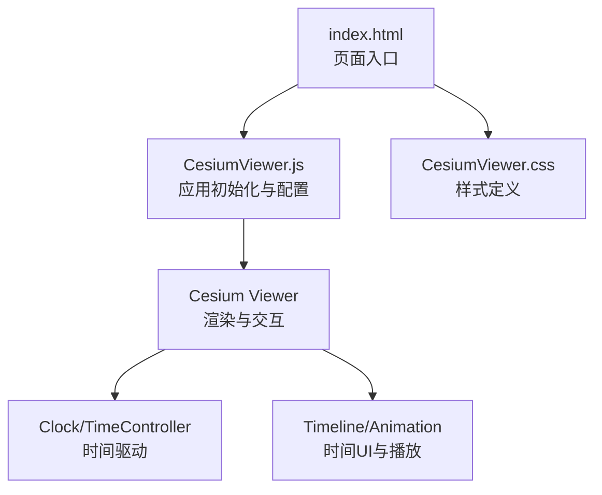
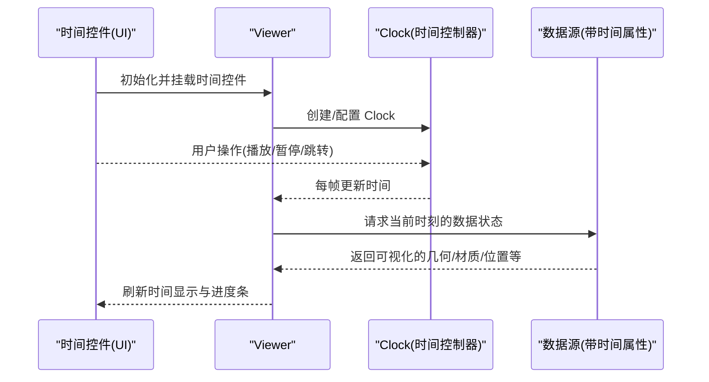
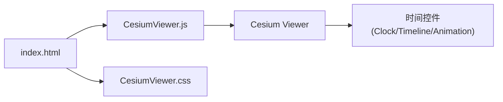

# 时间控件API

<cite>
**本文引用的文件**   
- [CesiumViewer.js](file://Apps/CesiumViewer/CesiumViewer.js)
- [index.html](file://Apps/CesiumViewer/index.html)
- [CesiumViewer.css](file://Apps/CesiumViewer/CesiumViewer.css)
</cite>

## 目录
1. [简介](#简介)
2. [项目结构](#项目结构)
3. [核心组件](#核心组件)
4. [架构总览](#架构总览)
5. [详细组件分析](#详细组件分析)
6. [依赖分析](#依赖分析)
7. [性能考虑](#性能考虑)
8. [故障排查指南](#故障排查指南)
9. [结论](#结论)
10. [附录](#附录)

## 简介
本文件面向在 Cesium 应用中集成与使用“时间控件”的开发者，聚焦以下目标：
- 时间选择器、时钟控制、时间轴等时间相关 UI 组件的配置与使用方法
- 时间范围设置、播放控制、时间格式显示等核心功能
- 时间动画控制、关键帧设置、时间同步等高级功能的实现思路
- 时间控件与数据源的时间属性绑定与实时更新机制

说明：
- 本仓库未包含独立的“时间控件”源码文件。本文档基于应用示例中的初始化与配置逻辑，结合 Cesium 官方文档中关于 Clock、Timeline、Animation 等时间相关 API 的约定进行整理，帮助读者快速上手并正确集成。
- 为避免直接粘贴代码，本文通过“章节来源”指向具体文件与行号，便于对照查阅。

## 项目结构
与时间控件相关的入口与样式位于 Apps/CesiumViewer 目录下：
- index.html：页面入口，负责加载脚本与样式
- CesiumViewer.js：应用初始化与 Viewer 配置（含时间相关选项）
- CesiumViewer.css：可选的自定义样式（如时间控件布局调整）

图表来源
- [index.html:1-200](file://Apps/CesiumViewer/index.html#L1-L200)
- [CesiumViewer.js:1-200](file://Apps/CesiumViewer/CesiumViewer.js#L1-L200)
- [CesiumViewer.css:1-200](file://Apps/CesiumViewer/CesiumViewer.css#L1-L200)

章节来源
- [index.html:1-200](file://Apps/CesiumViewer/index.html#L1-L200)
- [CesiumViewer.js:1-200](file://Apps/CesiumViewer/CesiumViewer.js#L1-L200)
- [CesiumViewer.css:1-200](file://Apps/CesiumViewer/CesiumViewer.css#L1-L200)

## 核心组件
- 时间控制器（Clock）
  - 作用：提供系统时间、模拟时间推进、时间步长、时区与日历系统等能力
  - 常见用途：驱动场景按时间更新、控制动画速率、设定时间范围
- 时间轴（Timeline）
  - 作用：可视化展示时间范围、支持拖拽与缩放、与播放器联动
- 动画控件（Animation）
  - 作用：播放/暂停、快进/快退、跳转至指定时刻、显示当前时间
- 时间范围（TimeIntervalCollection / TimeInterval）
  - 作用：描述数据的可用时间段，用于过滤与可见性控制

章节来源
- [CesiumViewer.js:1-200](file://Apps/CesiumViewer/CesiumViewer.js#L1-L200)

## 架构总览
下图展示了时间控件与 Viewer、数据源的典型交互关系。时间控制器驱动场景更新；时间轴与动画控件作为 UI 层，与时间控制器双向同步；数据源根据时间范围进行可见性与属性更新。

图表来源
- [CesiumViewer.js:1-200](file://Apps/CesiumViewer/CesiumViewer.js#L1-L200)
- [index.html:1-200](file://Apps/CesiumViewer/index.html#L1-L200)

## 详细组件分析

### 时间控制器（Clock）
- 职责
  - 维护当前仿真时间与时钟速率
  - 提供时间步进、循环模式、时区与日历系统配置
- 常用配置项（概念性说明）
  - 时间范围：起始时间与结束时间
  - 时钟速率：倍速或固定步长
  - 循环模式：是否循环播放
  - 时区与日历：本地时区、UTC、儒略日等
- 与 UI 的同步
  - 当用户在 Timeline/Animation 上操作时，应反向写入 Clock 的当前时间与速率
  - 每帧由 Viewer 驱动更新，确保数据源读取到最新时间

章节来源
- [CesiumViewer.js:1-200](file://Apps/CesiumViewer/CesiumViewer.js#L1-L200)

### 时间轴（Timeline）
- 职责
  - 展示时间范围、可拖拽定位、缩放查看细节
  - 与 Animation 控件联动，反映播放状态
- 常用配置项（概念性说明）
  - 时间窗口：初始可见区间
  - 最小/最大时间边界
  - 刻度与标签格式
  - 事件回调：时间变化、缩放、选中区间
- 与数据源的关联
  - 将数据源的可用时间区间映射为时间轴的“活动区间”，避免无效区域交互

章节来源
- [CesiumViewer.js:1-200](file://Apps/CesiumViewer/CesiumViewer.js#L1-L200)

### 动画控件（Animation）
- 职责
  - 播放/暂停、前进/后退、跳转到指定时刻
  - 显示当前时间与播放速度
- 常用配置项（概念性说明）
  - 播放按钮图标与文案
  - 时间格式化函数
  - 与 Clock 的双向绑定
- 与数据源的关联
  - 播放过程中持续触发时间更新，数据源据此刷新

章节来源
- [CesiumViewer.js:1-200](file://Apps/CesiumViewer/CesiumViewer.js#L1-L200)

### 时间范围与数据绑定
- 时间范围模型
  - 使用“时间区间集合”管理多个数据片段的有效时间
  - 每个数据片段可独立设置起止时间
- 绑定与更新机制
  - 数据源在每帧查询当前时间，仅渲染该时刻有效的数据
  - 若数据具备随时间变化的属性（位置、颜色、透明度等），则依据插值策略更新
- 关键帧与插值
  - 关键帧：离散时间点上的属性快照
  - 插值：在关键帧之间进行线性或样条插值，保证平滑过渡

章节来源
- [CesiumViewer.js:1-200](file://Apps/CesiumViewer/CesiumViewer.js#L1-L200)

### 时间同步与多控件协作
- 同步原则
  - 单一时间源：以 Clock 为权威时间源，所有 UI 控件与其保持同步
  - 防抖与节流：对频繁的用户输入做节流，避免抖动
- 冲突处理
  - 当多个控件同时修改时间时，采用优先级策略（例如用户手动拖动优先于自动播放）
- 事件流
  - 时间变化事件 -> 更新 UI 显示 -> 通知数据源刷新

章节来源
- [CesiumViewer.js:1-200](file://Apps/CesiumViewer/CesiumViewer.js#L1-L200)

### 时间格式显示
- 格式化要点
  - 统一时区与日期格式（YYYY-MM-DD HH:mm:ss.SSS）
  - 支持本地化语言环境
- 显示位置
  - 动画控件顶部或侧边栏常驻显示
  - 时间轴刻度与悬浮提示使用相同格式

章节来源
- [CesiumViewer.js:1-200](file://Apps/CesiumViewer/CesiumViewer.js#L1-L200)

### 高级功能示例（思路与步骤）
- 时间动画控制
  - 步骤：配置 Clock 速率 -> 启动/停止播放 -> 监听时间变化 -> 更新 UI
  - 参考路径：[CesiumViewer.js:1-200](file://Apps/CesiumViewer/CesiumViewer.js#L1-L200)
- 关键帧设置
  - 步骤：定义关键帧数组 -> 构建时间区间集合 -> 将集合注入数据源 -> 启用插值
  - 参考路径：[CesiumViewer.js:1-200](file://Apps/CesiumViewer/CesiumViewer.js#L1-L200)
- 时间同步
  - 步骤：建立 Clock 与 Timeline/Animation 的双向绑定 -> 处理用户输入冲突 -> 统一刷新
  - 参考路径：[CesiumViewer.js:1-200](file://Apps/CesiumViewer/CesiumViewer.js#L1-L200)

## 依赖分析
- 页面入口依赖
  - index.html 引入 CesiumViewer.js 与样式
- 应用初始化依赖
  - CesiumViewer.js 负责创建 Viewer 并配置时间相关选项
- 样式依赖
  - CesiumViewer.css 用于微调时间控件布局与外观

图表来源
- [index.html:1-200](file://Apps/CesiumViewer/index.html#L1-L200)
- [CesiumViewer.js:1-200](file://Apps/CesiumViewer/CesiumViewer.js#L1-L200)
- [CesiumViewer.css:1-200](file://Apps/CesiumViewer/CesiumViewer.css#L1-L200)

章节来源
- [index.html:1-200](file://Apps/CesiumViewer/index.html#L1-L200)
- [CesiumViewer.js:1-200](file://Apps/CesiumViewer/CesiumViewer.js#L1-L200)
- [CesiumViewer.css:1-200](file://Apps/CesiumViewer/CesiumViewer.css#L1-L200)

## 性能考虑
- 时间精度与帧率
  - 合理设置时钟步长，避免过细导致 CPU 压力过大
- 数据量控制
  - 使用时间范围过滤，仅加载与当前时间相关的数据
- 插值优化
  - 对高频属性变更采用合适的插值算法，减少计算开销
- UI 响应
  - 对用户输入进行节流，避免频繁重绘

## 故障排查指南
- 时间不更新
  - 检查 Clock 是否被正确创建与驱动
  - 确认 Timeline/Animation 是否与 Clock 双向绑定
- 播放异常
  - 校验时间范围是否有效（起始时间小于结束时间）
  - 检查循环模式与速率配置
- 数据不同步
  - 确认数据源是否订阅了时间变化事件
  - 验证关键帧与插值配置是否正确
- 样式错位
  - 检查 CesiumViewer.css 是否覆盖默认样式导致布局问题

章节来源
- [CesiumViewer.js:1-200](file://Apps/CesiumViewer/CesiumViewer.js#L1-L200)
- [CesiumViewer.css:1-200](file://Apps/CesiumViewer/CesiumViewer.css#L1-L200)

## 结论
通过将 Clock、Timeline、Animation 与数据源的时间属性进行统一管理与双向同步，可以在 Cesium 应用中实现稳定、流畅且可扩展的时间控件体验。建议遵循“单一时间源、明确同步策略、严格时间范围校验”的原则，以获得最佳的用户体验与性能表现。

## 附录
- 术语表
  - 时间控制器（Clock）：驱动仿真时间的核心对象
  - 时间轴（Timeline）：可视化时间范围与交互的 UI 组件
  - 动画控件（Animation）：播放控制与时间显示的 UI 组件
  - 时间区间集合（TimeIntervalCollection）：管理多个时间片段的集合
  - 关键帧：离散时间点上的属性快照
  - 插值：在关键帧之间生成连续属性的方法