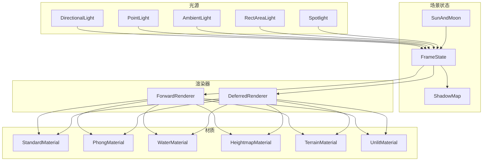
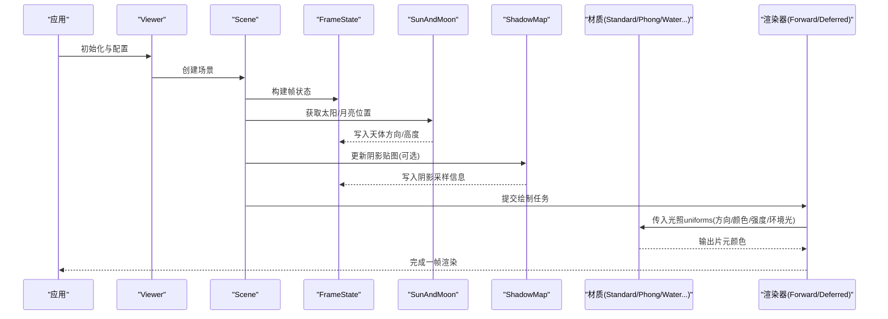
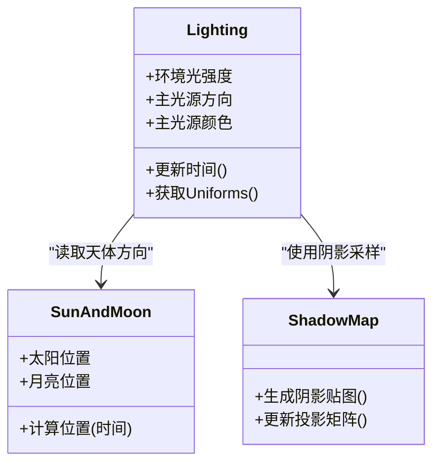
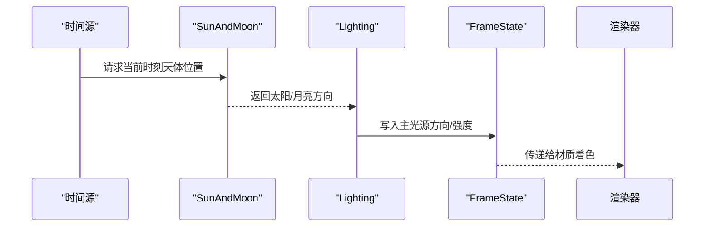
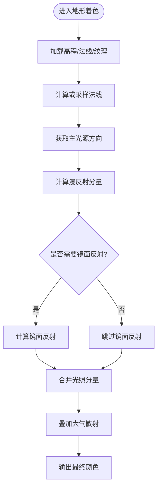
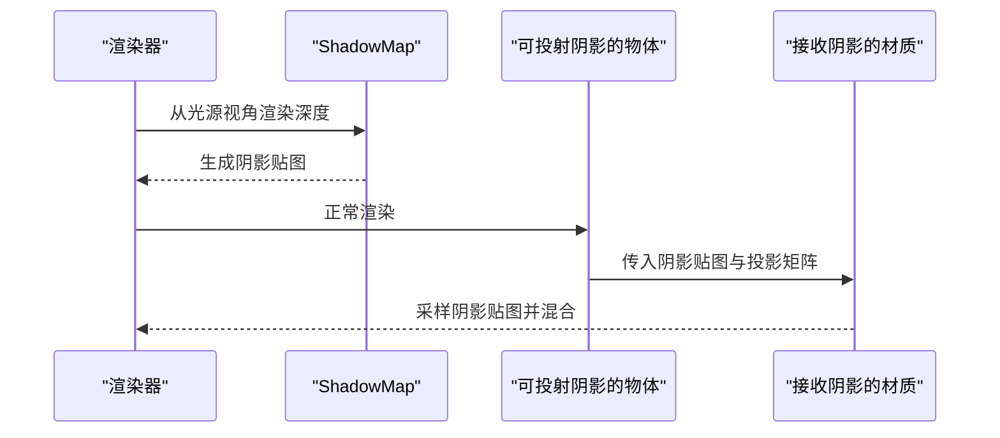
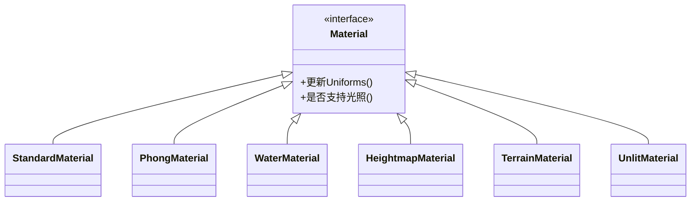
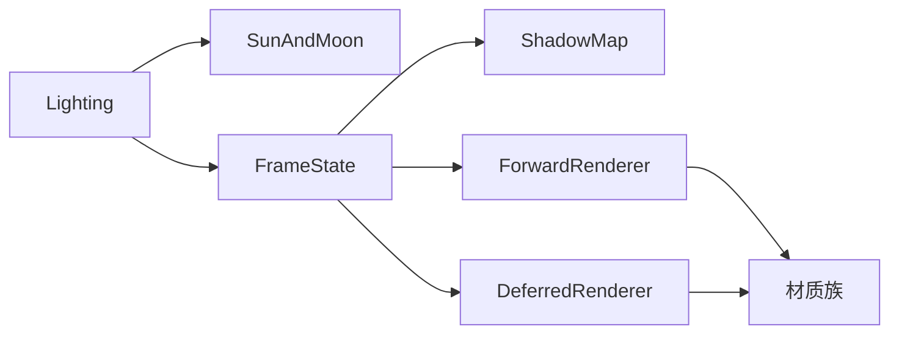

# 光照系统API

<cite>
**本文引用的文件**   
- [Lighting.js](file://Source/Core/Lighting.js)
- [SunAndMoon.js](file://Source/Core/SunAndMoon.js)
- [Globe.js](file://Source/Scene/Globe.js)
- [FrameState.js](file://Source/Scene/FrameState.js)
- [ShadowMap.js](file://Source/Scene/ShadowMap.js)
- [createDefaultShadows.js](file://Source/Scene/createDefaultShadows.js)
- [Material.js](file://Source/Scene/Material.js)
- [createGroundAtmosphere.js](file://Source/Scene/createGroundAtmosphere.js)
- [createSkyBox.js](file://Source/Scene/createSkyBox.js)
- [createSkyAtmosphere.js](file://Source/Scene/createSkyAtmosphere.js)
- [createSkySpheres.js](file://Source/Scene/createSkySpheres.js)
- [createCompositeMaterial.js](file://Source/Scene/Material/composite/createCompositeMaterial.js)
- [createEmissiveMaterial.js](file://Source/Scene/Material/emissive/createEmissiveMaterial.js)
- [createNormalMaterial.js](file://Source/Scene/Material/normal/createNormalMaterial.js)
- [createPhongMaterial.js](file://Source/Scene/Material/phong/createPhongMaterial.js)
- [createStandardMaterial.js](file://Source/Scene/Material/standard/createStandardMaterial.js)
- [createSpecularGlossinessMaterial.js](file://Source/Scene/Material/specularGlossiness/createSpecularGlossinessMaterial.js)
- [createTextureMaterial.js](file://Source/Scene/Material/texture/createTextureMaterial.js)
- [createTranslucentMaterial.js](file://Source/Scene/Material/translucent/createTranslucentMaterial.js)
- [createUnlitMaterial.js](file://Source/Scene/Material/unlit/createUnlitMaterial.js)
- [createWaterMaterial.js](file://Source/Scene/Material/water/createWaterMaterial.js)
- [createHeightmapMaterial.js](file://Source/Scene/Material/heightmap/createHeightmapMaterial.js)
- [createTerrainMaterial.js](file://Source/Scene/Material/terrain/createTerrainMaterial.js)
- [createPolylineMaterial.js](file://Source/Scene/Material/polyline/createPolylineMaterial.js)
- [createPointMaterial.js](file://Source/Scene/Material/point/createPointMaterial.js)
- [createLabelMaterial.js](file://Source/Scene/Material/label/createLabelMaterial.js)
- [createOutlineMaterial.js](file://Source/Scene/Material/outline/createOutlineMaterial.js)
- [createGridMaterial.js](file://Source/Scene/Material/grid/createGridMaterial.js)
- [createImageMaterial.js](file://Source/Scene/Material/image/createImageMaterial.js)
- [createColorMaterial.js](file://Source/Scene/Material/color/createColorMaterial.js)
- [createCheckerboardMaterial.js](file://Source/Scene/Material/checkerboard/createCheckerboardMaterial.js)
- [createLineFlowMaterial.js](file://Source/Scene/Material/lineFlow/createLineFlowMaterial.js)
- [createSpotlight.js](file://Source/Scene/Spotlight.js)
- [createDirectionalLight.js](file://Source/Scene/DirectionalLight.js)
- [createPointLight.js](file://Source/Scene/PointLight.js)
- [createAmbientLight.js](file://Source/Scene/AmbientLight.js)
- [createRectAreaLight.js](file://Source/Scene/RectAreaLight.js)
- [createEnvironmentMap.js](file://Source/Scene/EnvironmentMap.js)
- [createDeferredRenderer.js](file://Source/Scene/DeferredRenderer.js)
- [createForwardRenderer.js](file://Source/Scene/ForwardRenderer.js)
- [createRenderLoop.js](file://Source/Scene/createRenderLoop.js)
- [createViewer.js](file://Source/Widgets/Viewer/createViewer.js)
- [Viewer.js](file://Source/Widgets/Viewer/Viewer.js)
</cite>

## 目录
1. [简介](#简介)
2. [项目结构](#项目结构)
3. [核心组件](#核心组件)
4. [架构总览](#架构总览)
5. [详细组件分析](#详细组件分析)
6. [依赖关系分析](#依赖关系分析)
7. [性能考虑](#性能考虑)
8. [故障排查指南](#故障排查指南)
9. [结论](#结论)
10. [附录](#附录)

## 简介
本文件面向Cesium光照系统的API与实现，聚焦以下目标：
- Lighting类的光照计算、阴影投射与环境光等核心能力
- SunAndMoon天体模拟与时间相关的光照变化
- Globe地形光照与大气效果
- 动态光照、实时阴影、光照烘焙的渲染方案
- 性能优化与多设备兼容性建议

## 项目结构
Cesium光照系统由“光源定义—场景状态—渲染管线—材质着色”四层构成。关键入口包括：
- 光源对象：方向光、点光、环境光、矩形面光、聚光灯
- 场景状态：帧状态中的光照参数、阴影贴图、天体位置
- 渲染器：前向/延迟渲染路径对光照的集成
- 材质：标准PBR、Phong、水体、高度图、天空球等对光照的响应

图表来源
- [DirectionalLight.js](file://Source/Scene/DirectionalLight.js)
- [PointLight.js](file://Source/Scene/PointLight.js)
- [AmbientLight.js](file://Source/Scene/AmbientLight.js)
- [RectAreaLight.js](file://Source/Scene/RectAreaLight.js)
- [Spotlight.js](file://Source/Scene/Spotlight.js)
- [FrameState.js](file://Source/Scene/FrameState.js)
- [ShadowMap.js](file://Source/Scene/ShadowMap.js)
- [SunAndMoon.js](file://Source/Core/SunAndMoon.js)
- [ForwardRenderer.js](file://Source/Scene/ForwardRenderer.js)
- [DeferredRenderer.js](file://Source/Scene/DeferredRenderer.js)
- [createStandardMaterial.js](file://Source/Scene/Material/standard/createStandardMaterial.js)
- [createPhongMaterial.js](file://Source/Scene/Material/phong/createPhongMaterial.js)
- [createWaterMaterial.js](file://Source/Scene/Material/water/createWaterMaterial.js)
- [createHeightmapMaterial.js](file://Source/Scene/Material/heightmap/createHeightmapMaterial.js)
- [createTerrainMaterial.js](file://Source/Scene/Material/terrain/createTerrainMaterial.js)
- [createUnlitMaterial.js](file://Source/Scene/Material/unlit/createUnlitMaterial.js)

章节来源
- [DirectionalLight.js](file://Source/Scene/DirectionalLight.js)
- [PointLight.js](file://Source/Scene/PointLight.js)
- [AmbientLight.js](file://Source/Scene/AmbientLight.js)
- [RectAreaLight.js](file://Source/Scene/RectAreaLight.js)
- [Spotlight.js](file://Source/Scene/Spotlight.js)
- [FrameState.js](file://Source/Scene/FrameState.js)
- [ShadowMap.js](file://Source/Scene/ShadowMap.js)
- [SunAndMoon.js](file://Source/Core/SunAndMoon.js)
- [ForwardRenderer.js](file://Source/Scene/ForwardRenderer.js)
- [DeferredRenderer.js](file://Source/Scene/DeferredRenderer.js)
- [createStandardMaterial.js](file://Source/Scene/Material/standard/createStandardMaterial.js)
- [createPhongMaterial.js](file://Source/Scene/Material/phong/createPhongMaterial.js)
- [createWaterMaterial.js](file://Source/Scene/Material/water/createWaterMaterial.js)
- [createHeightmapMaterial.js](file://Source/Scene/Material/heightmap/createHeightmapMaterial.js)
- [createTerrainMaterial.js](file://Source/Scene/Material/terrain/createTerrainMaterial.js)
- [createUnlitMaterial.js](file://Source/Scene/Material/unlit/createUnlitMaterial.js)

## 核心组件
本节概述光照系统的关键模块及其职责：
- Lighting：封装全局光照参数（如环境光强度、主光源方向/颜色）、为材质与渲染器提供统一接口
- SunAndMoon：基于天文算法计算太阳/月亮位置，驱动时间相关的光照变化
- Globe：将地形高程与法线参与光照计算，支持地形材质与大气散射
- FrameState：每帧聚合光源、相机、阴影贴图、天体位置等状态，贯穿渲染管线
- ShadowMap：生成并更新阴影贴图，支持级联/自适应策略
- 材质族：Standard/Phong/Water/Heightmap/Terrain/Unlit等对光照的不同响应方式

章节来源
- [Lighting.js](file://Source/Core/Lighting.js)
- [SunAndMoon.js](file://Source/Core/SunAndMoon.js)
- [Globe.js](file://Source/Scene/Globe.js)
- [FrameState.js](file://Source/Scene/FrameState.js)
- [ShadowMap.js](file://Source/Scene/ShadowMap.js)
- [createStandardMaterial.js](file://Source/Scene/Material/standard/createStandardMaterial.js)
- [createPhongMaterial.js](file://Source/Scene/Material/phong/createPhongMaterial.js)
- [createWaterMaterial.js](file://Source/Scene/Material/water/createWaterMaterial.js)
- [createHeightmapMaterial.js](file://Source/Scene/Material/heightmap/createHeightmapMaterial.js)
- [createTerrainMaterial.js](file://Source/Scene/Material/terrain/createTerrainMaterial.js)
- [createUnlitMaterial.js](file://Source/Scene/Material/unlit/createUnlitMaterial.js)

## 架构总览
下图展示从光源到材质着色的端到端流程，以及天体与阴影在其中的作用。

图表来源
- [createViewer.js](file://Source/Widgets/Viewer/createViewer.js)
- [Viewer.js](file://Source/Widgets/Viewer/Viewer.js)
- [FrameState.js](file://Source/Scene/FrameState.js)
- [SunAndMoon.js](file://Source/Core/SunAndMoon.js)
- [ShadowMap.js](file://Source/Scene/ShadowMap.js)
- [createStandardMaterial.js](file://Source/Scene/Material/standard/createStandardMaterial.js)
- [createPhongMaterial.js](file://Source/Scene/Material/phong/createPhongMaterial.js)
- [createWaterMaterial.js](file://Source/Scene/Material/water/createWaterMaterial.js)
- [ForwardRenderer.js](file://Source/Scene/ForwardRenderer.js)
- [DeferredRenderer.js](file://Source/Scene/DeferredRenderer.js)

## 详细组件分析

### Lighting类：光照计算与环境光
- 职责
  - 维护全局光照参数（环境光强度、主光源方向/颜色）
  - 为材质与渲染器提供统一的访问接口
  - 与SunAndMoon联动，随时间更新主光源方向与强度
- 关键点
  - 环境光：作为基础照明，避免全黑区域
  - 主光源：通常由太阳驱动，影响漫反射/镜面反射
  - 与阴影：通过ShadowMap传递遮挡信息
- 典型用法
  - 在场景初始化时设置环境光强度
  - 根据时间推进更新主光源方向
  - 结合材质选择是否启用阴影

章节来源
- [Lighting.js](file://Source/Core/Lighting.js)
- [SunAndMoon.js](file://Source/Core/SunAndMoon.js)
- [ShadowMap.js](file://Source/Scene/ShadowMap.js)

#### 类关系图（概念映射）

图表来源
- [Lighting.js](file://Source/Core/Lighting.js)
- [SunAndMoon.js](file://Source/Core/SunAndMoon.js)
- [ShadowMap.js](file://Source/Scene/ShadowMap.js)

### SunAndMoon：天体模拟与时间相关光照
- 功能
  - 基于天文模型计算太阳/月亮的方位角与高度角
  - 输出单位方向向量供光照系统使用
  - 支持时间步进与地球自转修正
- 与光照的关系
  - 驱动主光源方向与强度（日出/日落渐变）
  - 影响大气散射与天空盒颜色
- 常见场景
  - 昼夜循环动画
  - 动态阴影长度变化
  - 夜间模式切换

章节来源
- [SunAndMoon.js](file://Source/Core/SunAndMoon.js)

#### 时序图：天体驱动光照更新

图表来源
- [SunAndMoon.js](file://Source/Core/SunAndMoon.js)
- [Lighting.js](file://Source/Core/Lighting.js)
- [FrameState.js](file://Source/Scene/FrameState.js)

### Globe：地形光照与大气效果
- 地形光照
  - 使用高程数据与法线贴图增强明暗细节
  - 与主光源方向配合产生真实阴影
- 大气与天空
  - 地面大气层与天空球/大气球组合营造氛围
  - 随太阳高度调整散射强度与色调
- 材质集成
  - TerrainMaterial/HeightmapMaterial对光照的响应
  - WaterMaterial对水面反射/折射的处理

章节来源
- [Globe.js](file://Source/Scene/Globe.js)
- [createTerrainMaterial.js](file://Source/Scene/Material/terrain/createTerrainMaterial.js)
- [createHeightmapMaterial.js](file://Source/Scene/Material/heightmap/createHeightmapMaterial.js)
- [createWaterMaterial.js](file://Source/Scene/Material/water/createWaterMaterial.js)
- [createGroundAtmosphere.js](file://Source/Scene/createGroundAtmosphere.js)
- [createSkyBox.js](file://Source/Scene/createSkyBox.js)
- [createSkyAtmosphere.js](file://Source/Scene/createSkyAtmosphere.js)
- [createSkySpheres.js](file://Source/Scene/createSkySpheres.js)

#### 流程图：地形光照处理

图表来源
- [createTerrainMaterial.js](file://Source/Scene/Material/terrain/createTerrainMaterial.js)
- [createHeightmapMaterial.js](file://Source/Scene/Material/heightmap/createHeightmapMaterial.js)
- [createGroundAtmosphere.js](file://Source/Scene/createGroundAtmosphere.js)

### 阴影系统：实时阴影与性能权衡
- 生成流程
  - 从光源视角渲染深度图至阴影贴图
  - 在物体着色阶段采样阴影贴图进行遮挡判断
- 关键参数
  - 分辨率、级联数量、裁剪距离、PCF滤波
- 适用场景
  - 建筑/植被/地物的高精度阴影
  - 大范围地形阴影需权衡分辨率与级联

章节来源
- [ShadowMap.js](file://Source/Scene/ShadowMap.js)
- [createDefaultShadows.js](file://Source/Scene/createDefaultShadows.js)

#### 序列图：阴影渲染流程

图表来源
- [ShadowMap.js](file://Source/Scene/ShadowMap.js)
- [createDefaultShadows.js](file://Source/Scene/createDefaultShadows.js)

### 材质与光照：不同材质的响应方式
- StandardMaterial：PBR金属度/粗糙度，适合通用地表与模型
- PhongMaterial：经典漫反射+镜面反射，兼容旧内容
- WaterMaterial：水面反射/折射，受太阳角度影响显著
- HeightmapMaterial/TerrainMaterial：地形专用，强调法线与大气
- UnlitMaterial：不受光照影响，用于UI/标记等

章节来源
- [createStandardMaterial.js](file://Source/Scene/Material/standard/createStandardMaterial.js)
- [createPhongMaterial.js](file://Source/Scene/Material/phong/createPhongMaterial.js)
- [createWaterMaterial.js](file://Source/Scene/Material/water/createWaterMaterial.js)
- [createHeightmapMaterial.js](file://Source/Scene/Material/heightmap/createHeightmapMaterial.js)
- [createTerrainMaterial.js](file://Source/Scene/Material/terrain/createTerrainMaterial.js)
- [createUnlitMaterial.js](file://Source/Scene/Material/unlit/createUnlitMaterial.js)

#### 类关系图（材质族）

图表来源
- [Material.js](file://Source/Scene/Material.js)
- [createStandardMaterial.js](file://Source/Scene/Material/standard/createStandardMaterial.js)
- [createPhongMaterial.js](file://Source/Scene/Material/phong/createPhongMaterial.js)
- [createWaterMaterial.js](file://Source/Scene/Material/water/createWaterMaterial.js)
- [createHeightmapMaterial.js](file://Source/Scene/Material/heightmap/createHeightmapMaterial.js)
- [createTerrainMaterial.js](file://Source/Scene/Material/terrain/createTerrainMaterial.js)
- [createUnlitMaterial.js](file://Source/Scene/Material/unlit/createUnlitMaterial.js)

### 其他光源类型
- AmbientLight：均匀的环境光补充
- PointLight：点光源，适用于局部照明
- RectAreaLight：矩形面光，常用于室内/屏幕发光
- Spotlight：聚光灯，用于定向强光源

章节来源
- [createAmbientLight.js](file://Source/Scene/AmbientLight.js)
- [createPointLight.js](file://Source/Scene/PointLight.js)
- [createRectAreaLight.js](file://Source/Scene/RectAreaLight.js)
- [createSpotlight.js](file://Source/Scene/Spotlight.js)

## 依赖关系分析
- 耦合关系
  - Lighting依赖SunAndMoon获取天体方向
  - FrameState聚合所有光源与阴影信息，被渲染器与材质共享
  - 材质依赖光照uniforms与阴影贴图
- 外部依赖
  - 渲染器（前向/延迟）决定光照累加策略
  - 环境贴图用于反射/IBL增强

图表来源
- [Lighting.js](file://Source/Core/Lighting.js)
- [SunAndMoon.js](file://Source/Core/SunAndMoon.js)
- [FrameState.js](file://Source/Scene/FrameState.js)
- [ShadowMap.js](file://Source/Scene/ShadowMap.js)
- [ForwardRenderer.js](file://Source/Scene/ForwardRenderer.js)
- [DeferredRenderer.js](file://Source/Scene/DeferredRenderer.js)
- [Material.js](file://Source/Scene/Material.js)

章节来源
- [Lighting.js](file://Source/Core/Lighting.js)
- [SunAndMoon.js](file://Source/Core/SunAndMoon.js)
- [FrameState.js](file://Source/Scene/FrameState.js)
- [ShadowMap.js](file://Source/Scene/ShadowMap.js)
- [ForwardRenderer.js](file://Source/Scene/ForwardRenderer.js)
- [DeferredRenderer.js](file://Source/Scene/DeferredRenderer.js)
- [Material.js](file://Source/Scene/Material.js)

## 性能考虑
- 阴影优化
  - 合理设置阴影贴图分辨率与级联数量
  - 使用PCF软阴影时控制滤波半径
  - 对远距离物体禁用阴影或降低质量
- 光源数量
  - 限制同时活跃光源数，优先使用主光源+环境光
  - 点光/聚光灯仅用于近景特写
- 材质选择
  - 地形优先使用TerrainMaterial/HeightmapMaterial
  - UI/标记使用UnlitMaterial避免光照计算
- 渲染路径
  - 复杂场景可尝试延迟渲染以批量处理多光源
  - 简单场景使用前向渲染减少额外缓冲开销
- 设备兼容
  - 移动端降低阴影分辨率与级联
  - 检测WebGL特性并降级阴影/大气效果

[本节为通用指导，不直接分析具体文件]

## 故障排查指南
- 现象：无阴影或阴影异常
  - 检查ShadowMap是否启用与分辨率是否过低
  - 确认光源可见性与裁剪范围
  - 验证物体是否标记为可投射/接收阴影
- 现象：昼夜过渡闪烁
  - 检查SunAndMoon的时间步长与插值
  - 确保主光源方向平滑更新
- 现象：性能骤降
  - 减少阴影级联与贴图尺寸
  - 关闭不必要的大气/反射效果
  - 评估材质复杂度与纹理大小

章节来源
- [ShadowMap.js](file://Source/Scene/ShadowMap.js)
- [createDefaultShadows.js](file://Source/Scene/createDefaultShadows.js)
- [SunAndMoon.js](file://Source/Core/SunAndMoon.js)
- [createStandardMaterial.js](file://Source/Scene/Material/standard/createStandardMaterial.js)
- [createWaterMaterial.js](file://Source/Scene/Material/water/createWaterMaterial.js)

## 结论
Cesium光照系统通过Lighting、SunAndMoon、Globe与材质族的协同，实现了从基础环境光到复杂地形与水体的高级渲染。结合ShadowMap可实现高质量的实时阴影；通过合理的参数调优与设备适配，可在不同平台上获得稳定且高效的视觉效果。

[本节为总结性内容，不直接分析具体文件]

## 附录
- 常用API参考路径
  - 光源创建：[DirectionalLight.js](file://Source/Scene/DirectionalLight.js)、[PointLight.js](file://Source/Scene/PointLight.js)、[AmbientLight.js](file://Source/Scene/AmbientLight.js)、[RectAreaLight.js](file://Source/Scene/RectAreaLight.js)、[Spotlight.js](file://Source/Scene/Spotlight.js)
  - 场景状态：[FrameState.js](file://Source/Scene/FrameState.js)
  - 阴影：[ShadowMap.js](file://Source/Scene/ShadowMap.js)、[createDefaultShadows.js](file://Source/Scene/createDefaultShadows.js)
  - 天体：[SunAndMoon.js](file://Source/Core/SunAndMoon.js)
  - 地形与大气：[Globe.js](file://Source/Scene/Globe.js)、[createGroundAtmosphere.js](file://Source/Scene/createGroundAtmosphere.js)、[createSkyBox.js](file://Source/Scene/createSkyBox.js)、[createSkyAtmosphere.js](file://Source/Scene/createSkyAtmosphere.js)、[createSkySpheres.js](file://Source/Scene/createSkySpheres.js)
  - 材质：见各create*Material.js文件路径
  - 渲染器：[ForwardRenderer.js](file://Source/Scene/ForwardRenderer.js)、[DeferredRenderer.js](file://Source/Scene/DeferredRenderer.js)
  - 视图入口：[createViewer.js](file://Source/Widgets/Viewer/createViewer.js)、[Viewer.js](file://Source/Widgets/Viewer/Viewer.js)

[本节为索引性内容，不直接分析具体文件]