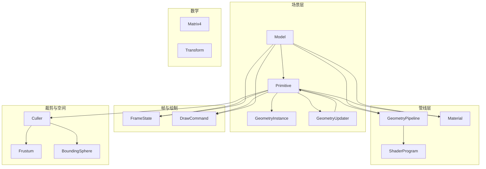
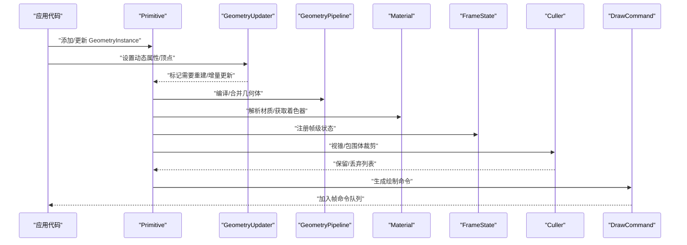
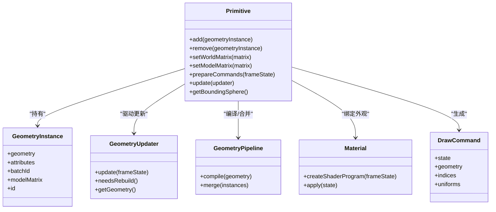
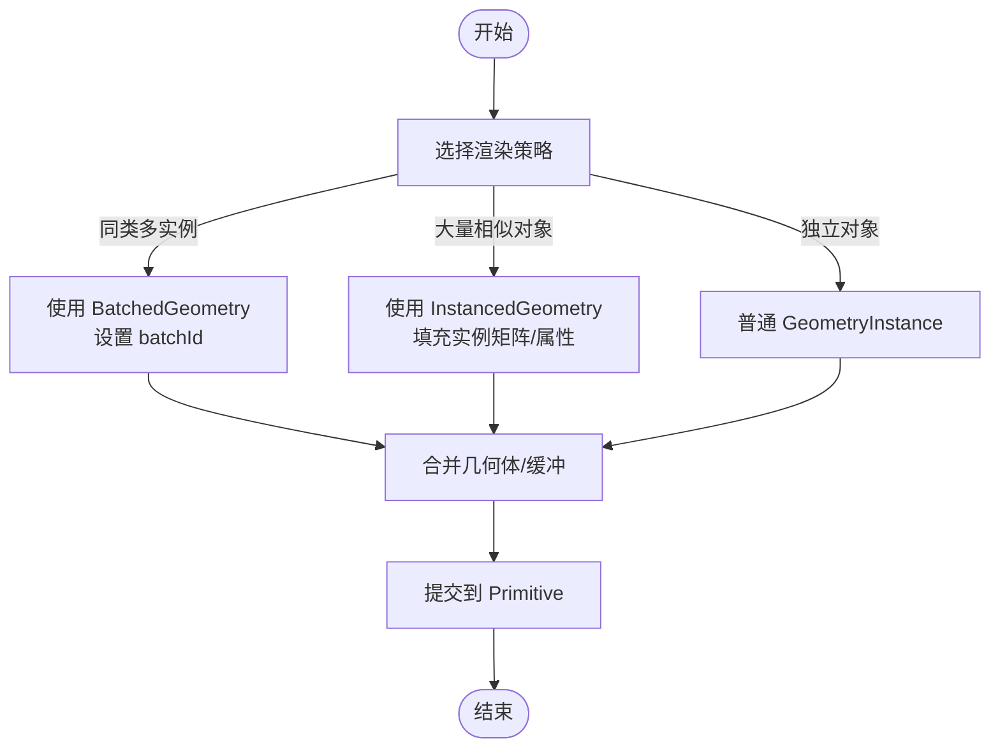
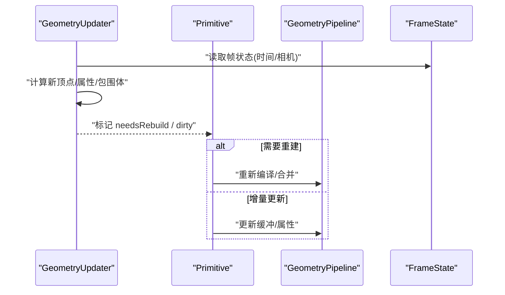
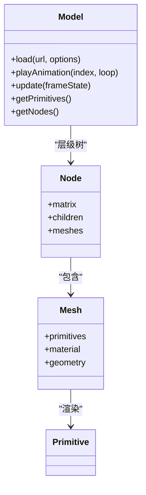
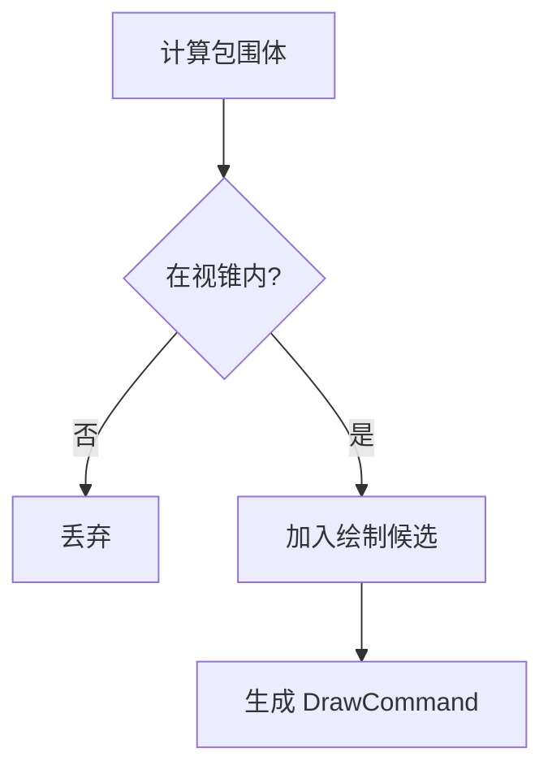
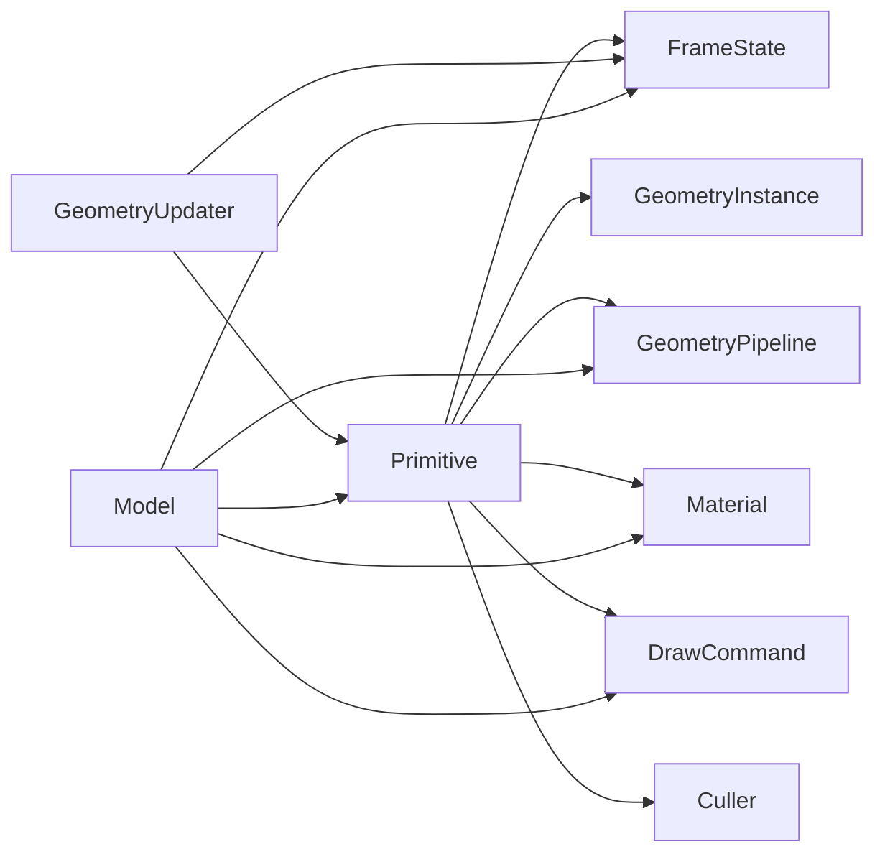

# 几何体渲染API

<cite>
**本文引用的文件**   
- [Primitive.js](file://Source/Scene/Primitive.js)
- [GeometryInstance.js](file://Source/Scene/GeometryInstance.js)
- [GeometryUpdater.js](file://Source/Scene/GeometryUpdater.js)
- [Model.js](file://Source/Scene/Model.js)
- [BatchedGeometry.js](file://Source/Scene/BatchedGeometry.js)
- [InstancedGeometry.js](file://Source/Scene/InstancedGeometry.js)
- [GeometryPipeline.js](file://Source/Scene/GeometryPipeline.js)
- [Material.js](file://Source/Scene/Material.js)
- [ShaderProgram.js](file://Source/Renderable/ShaderProgram.js)
- [FrameState.js](file://Source/Scene/FrameState.js)
- [DrawCommand.js](file://Source/Scene/DrawCommand.js)
- [Culler.js](file://Source/Scene/Culler.js)
- [Frustum.js](file://Source/Core/Frustum.js)
- [BoundingSphere.js](file://Source/Core/BoundingSphere.js)
- [Matrix4.js](file://Source/Core/Matrix4.js)
- [Transform.js](file://Source/Core/Transform.js)
</cite>

## 目录
1. [简介](#简介)
2. [项目结构](#项目结构)
3. [核心组件](#核心组件)
4. [架构总览](#架构总览)
5. [详细组件分析](#详细组件分析)
6. [依赖关系分析](#依赖关系分析)
7. [性能考虑](#性能考虑)
8. [故障排查指南](#故障排查指南)
9. [结论](#结论)
10. [附录](#附录)

## 简介
本文件面向使用 Cesium 进行几何体渲染的开发者，系统化梳理 Primitive、GeometryInstance、GeometryUpdater、Model 等核心 API 的职责与协作方式，覆盖几何体创建、材质应用、变换矩阵、实例化与批量渲染、动态更新、LOD 控制、着色器自定义、内存管理与批次优化等主题。文档以“从概念到实现”的方式组织，既提供高层架构图，也给出与源码映射的类图、时序图与流程图，帮助读者快速定位关键路径并落地最佳实践。

## 项目结构
围绕几何体渲染的关键模块主要分布在 Scene 与 Renderable 子系统中：
- 场景对象与命令生成：Primitive、GeometryInstance、GeometryUpdater、Model
- 管线与资源：GeometryPipeline、Material、ShaderProgram
- 帧级状态与绘制：FrameState、DrawCommand
- 裁剪与可见性：Culler、Frustum、BoundingSphere
- 数学基础：Matrix4、Transform

图表来源
- [Primitive.js](file://Source/Scene/Primitive.js)
- [GeometryInstance.js](file://Source/Scene/GeometryInstance.js)
- [GeometryUpdater.js](file://Source/Scene/GeometryUpdater.js)
- [Model.js](file://Source/Scene/Model.js)
- [GeometryPipeline.js](file://Source/Scene/GeometryPipeline.js)
- [Material.js](file://Source/Scene/Material.js)
- [ShaderProgram.js](file://Source/Renderable/ShaderProgram.js)
- [FrameState.js](file://Source/Scene/FrameState.js)
- [DrawCommand.js](file://Source/Scene/DrawCommand.js)
- [Culler.js](file://Source/Scene/Culler.js)
- [Frustum.js](file://Source/Core/Frustum.js)
- [BoundingSphere.js](file://Source/Core/BoundingSphere.js)
- [Matrix4.js](file://Source/Core/Matrix4.js)
- [Transform.js](file://Source/Core/Transform.js)

章节来源
- [Primitive.js](file://Source/Scene/Primitive.js)
- [GeometryInstance.js](file://Source/Scene/GeometryInstance.js)
- [GeometryUpdater.js](file://Source/Scene/GeometryUpdater.js)
- [Model.js](file://Source/Scene/Model.js)
- [GeometryPipeline.js](file://Source/Scene/GeometryPipeline.js)
- [Material.js](file://Source/Scene/Material.js)
- [ShaderProgram.js](file://Source/Renderable/ShaderProgram.js)
- [FrameState.js](file://Source/Scene/FrameState.js)
- [DrawCommand.js](file://Source/Scene/DrawCommand.js)
- [Culler.js](file://Source/Scene/Culler.js)
- [Frustum.js](file://Source/Core/Frustum.js)
- [BoundingSphere.js](file://Source/Core/BoundingSphere.js)
- [Matrix4.js](file://Source/Core/Matrix4.js)
- [Transform.js](file://Source/Core/Transform.js)

## 核心组件
- Primitive：场景中的可绘制几何体容器，负责将 GeometryInstance 集合与 Material、变换矩阵、深度状态等组合为 DrawCommand，参与帧循环的提交与执行。
- GeometryInstance：描述单个几何体的实例化参数（位置、缩放、旋转、属性、批处理ID等），用于合并与实例化渲染。
- GeometryUpdater：驱动几何体在每帧的动态更新（如顶点数据、索引、包围体、属性变化），通知 Primitive 重新构建或增量更新。
- Model：加载 glTF/glb 模型，内部维护节点树、动画、材质与几何体，最终通过 Primitive 进入渲染管线。
- GeometryPipeline：将原始几何体编译为 GPU 可执行的程序与缓冲，支持合并、剔除、属性打包等。
- Material：定义外观（颜色、纹理、光照模型、透明度等），与 ShaderProgram 绑定。
- FrameState：帧级上下文，包含相机、时间、状态缓存、命令队列等。
- DrawCommand：一次 GPU 绘制的最小单元，封装了状态、缓冲、索引、uniforms 等。
- Culler/Frustum/BoundingSphere：视锥裁剪与包围体测试，减少无效绘制。
- Matrix4/Transform：世界变换、局部变换与层级矩阵计算。

章节来源
- [Primitive.js](file://Source/Scene/Primitive.js)
- [GeometryInstance.js](file://Source/Scene/GeometryInstance.js)
- [GeometryUpdater.js](file://Source/Scene/GeometryUpdater.js)
- [Model.js](file://Source/Scene/Model.js)
- [GeometryPipeline.js](file://Source/Scene/GeometryPipeline.js)
- [Material.js](file://Source/Scene/Material.js)
- [FrameState.js](file://Source/Scene/FrameState.js)
- [DrawCommand.js](file://Source/Scene/DrawCommand.js)
- [Culler.js](file://Source/Scene/Culler.js)
- [Frustum.js](file://Source/Core/Frustum.js)
- [BoundingSphere.js](file://Source/Core/BoundingSphere.js)
- [Matrix4.js](file://Source/Core/Matrix4.js)
- [Transform.js](file://Source/Core/Transform.js)

## 架构总览
下图展示了从用户代码到 GPU 绘制的端到端流程：用户创建 Primitive 与 GeometryInstance，可选地附加 GeometryUpdater 驱动动态更新；每帧由场景收集命令，经裁剪与管线处理后生成 DrawCommand 并提交至 GPU。

图表来源
- [Primitive.js](file://Source/Scene/Primitive.js)
- [GeometryInstance.js](file://Source/Scene/GeometryInstance.js)
- [GeometryUpdater.js](file://Source/Scene/GeometryUpdater.js)
- [GeometryPipeline.js](file://Source/Scene/GeometryPipeline.js)
- [Material.js](file://Source/Scene/Material.js)
- [FrameState.js](file://Source/Scene/FrameState.js)
- [Culler.js](file://Source/Scene/Culler.js)
- [DrawCommand.js](file://Source/Scene/DrawCommand.js)

## 详细组件分析

### Primitive 组件分析
职责要点
- 管理一组 GeometryInstance，按材质、深度状态、渲染状态分组，生成 DrawCommand。
- 支持设置 worldMatrix、modelMatrix、show、clippingPlanes、depthFailState 等。
- 与 GeometryUpdater 协作，响应几何体变化并触发重建或增量更新。
- 参与帧循环的 prepareCommands 阶段，结合 Culler 完成可见性判断。

图表来源
- [Primitive.js](file://Source/Scene/Primitive.js)
- [GeometryInstance.js](file://Source/Scene/GeometryInstance.js)
- [GeometryUpdater.js](file://Source/Scene/GeometryUpdater.js)
- [GeometryPipeline.js](file://Source/Scene/GeometryPipeline.js)
- [Material.js](file://Source/Scene/Material.js)
- [DrawCommand.js](file://Source/Scene/DrawCommand.js)

章节来源
- [Primitive.js](file://Source/Scene/Primitive.js)
- [GeometryInstance.js](file://Source/Scene/GeometryInstance.js)
- [GeometryUpdater.js](file://Source/Scene/GeometryUpdater.js)
- [GeometryPipeline.js](file://Source/Scene/GeometryPipeline.js)
- [Material.js](file://Source/Scene/Material.js)
- [DrawCommand.js](file://Source/Scene/DrawCommand.js)

#### 变换矩阵与层级
- modelMatrix：本地到父节点的变换，常用于局部位移、旋转、缩放。
- worldMatrix：本地到世界的变换，通常由 Transform 或外部系统计算后传入。
- 建议：对静态几何体预计算 worldMatrix，避免每帧重复计算；对频繁变化的对象使用 GeometryUpdater 仅更新必要属性。

章节来源
- [Matrix4.js](file://Source/Core/Matrix4.js)
- [Transform.js](file://Source/Core/Transform.js)

#### 材质应用与着色器
- 通过 Material 指定外观，底层会创建或复用 ShaderProgram。
- 对于复杂效果，可自定义 ShaderProgram 并通过 Material 注入 uniforms。
- 注意透明与不透明的分离，合理设置 depthWrite、alphaTest 等状态。

章节来源
- [Material.js](file://Source/Scene/Material.js)
- [ShaderProgram.js](file://Source/Renderable/ShaderProgram.js)

### GeometryInstance 与批量/实例化渲染
- 批量渲染：多个相同几何体共享顶点/索引缓冲，通过 batchId 区分不同实体，适合大量同类对象。
- 实例化渲染：利用 InstancedGeometry 将多份 instance 数据（平移、缩放、旋转）一次性提交，极大降低 draw call 数量。
- 属性传递：通过 attributes 向顶点/片段着色器传递 per-instance 或 per-vertex 数据。

图表来源
- [BatchedGeometry.js](file://Source/Scene/BatchedGeometry.js)
- [InstancedGeometry.js](file://Source/Scene/InstancedGeometry.js)
- [GeometryInstance.js](file://Source/Scene/GeometryInstance.js)
- [Primitive.js](file://Source/Scene/Primitive.js)

章节来源
- [BatchedGeometry.js](file://Source/Scene/BatchedGeometry.js)
- [InstancedGeometry.js](file://Source/Scene/InstancedGeometry.js)
- [GeometryInstance.js](file://Source/Scene/GeometryInstance.js)
- [Primitive.js](file://Source/Scene/Primitive.js)

### GeometryUpdater 动态更新
- 适用场景：随时间变化的顶点、法线、颜色、索引或包围体。
- 更新模式：
  - 全量重建：当拓扑或布局变化时，调用 rebuild 流程。
  - 增量更新：仅更新缓冲区或属性，保持 GPU 侧缓冲有效。
- 与 Primitive 的交互：每帧 update 后，若 needsRebuild 为真，则触发重建；否则仅更新缓冲。

图表来源
- [GeometryUpdater.js](file://Source/Scene/GeometryUpdater.js)
- [Primitive.js](file://Source/Scene/Primitive.js)
- [GeometryPipeline.js](file://Source/Scene/GeometryPipeline.js)
- [FrameState.js](file://Source/Scene/FrameState.js)

章节来源
- [GeometryUpdater.js](file://Source/Scene/GeometryUpdater.js)
- [Primitive.js](file://Source/Scene/Primitive.js)
- [GeometryPipeline.js](file://Source/Scene/GeometryPipeline.js)
- [FrameState.js](file://Source/Scene/FrameState.js)

### Model 3D 模型加载
- 加载 glTF/glb，解析节点、网格、材质、动画、皮肤等信息。
- 内部为每个可绘制网格创建 Primitive，并按层级应用变换矩阵。
- 支持动画播放、材质替换、事件拾取、阴影与 LOD。

图表来源
- [Model.js](file://Source/Scene/Model.js)
- [Primitive.js](file://Source/Scene/Primitive.js)

章节来源
- [Model.js](file://Source/Scene/Model.js)
- [Primitive.js](file://Source/Scene/Primitive.js)

### 裁剪与可见性
- Frustum：基于相机视锥的裁剪。
- BoundingSphere：基于球体的快速剔除。
- Culler：综合视锥与包围体，输出保留/丢弃列表，减少无效绘制。

图表来源
- [Culler.js](file://Source/Scene/Culler.js)
- [Frustum.js](file://Source/Core/Frustum.js)
- [BoundingSphere.js](file://Source/Core/BoundingSphere.js)
- [DrawCommand.js](file://Source/Scene/DrawCommand.js)

章节来源
- [Culler.js](file://Source/Scene/Culler.js)
- [Frustum.js](file://Source/Core/Frustum.js)
- [BoundingSphere.js](file://Source/Core/BoundingSphere.js)
- [DrawCommand.js](file://Source/Scene/DrawCommand.js)

## 依赖关系分析
- Primitive 强依赖 GeometryInstance、GeometryPipeline、Material、FrameState、DrawCommand、Culler。
- GeometryUpdater 依赖 FrameState 与自身管理的几何体数据源。
- Model 依赖 Primitive 与管线子系统，同时管理节点与材质。
- 数学库 Matrix4/Transform 被广泛使用于变换计算。

图表来源
- [Primitive.js](file://Source/Scene/Primitive.js)
- [GeometryInstance.js](file://Source/Scene/GeometryInstance.js)
- [GeometryPipeline.js](file://Source/Scene/GeometryPipeline.js)
- [Material.js](file://Source/Scene/Material.js)
- [FrameState.js](file://Source/Scene/FrameState.js)
- [DrawCommand.js](file://Source/Scene/DrawCommand.js)
- [Culler.js](file://Source/Scene/Culler.js)
- [GeometryUpdater.js](file://Source/Scene/GeometryUpdater.js)
- [Model.js](file://Source/Scene/Model.js)

章节来源
- [Primitive.js](file://Source/Scene/Primitive.js)
- [GeometryInstance.js](file://Source/Scene/GeometryInstance.js)
- [GeometryPipeline.js](file://Source/Scene/GeometryPipeline.js)
- [Material.js](file://Source/Scene/Material.js)
- [FrameState.js](file://Source/Scene/FrameState.js)
- [DrawCommand.js](file://Source/Scene/DrawCommand.js)
- [Culler.js](file://Source/Scene/Culler.js)
- [GeometryUpdater.js](file://Source/Scene/GeometryUpdater.js)
- [Model.js](file://Source/Scene/Model.js)

## 性能考虑
- 批量与实例化
  - 优先使用 BatchedGeometry 与 InstancedGeometry 合并 draw call。
  - 合理分配 batchId，避免跨材质/状态的频繁切换。
- 几何体合并
  - 将同材质、同状态的几何体合并，减少状态切换与命令数量。
- 动态更新
  - 尽量采用增量更新而非全量重建；仅在必要时触发 rebuild。
- 裁剪与LOD
  - 使用合适的包围体与视锥裁剪；对大规模场景启用 LOD 策略，根据距离选择细节级别。
- 材质与着色器
  - 复用 ShaderProgram，避免每帧创建；统一材质以减少状态切换。
- 内存管理
  - 及时释放不再使用的 GeometryInstance、Primitive 与 Model。
  - 避免每帧分配大对象，复用缓冲与临时变量。
- 批次优化
  - 按材质、深度状态、透明度分组，减少状态切换。
  - 控制单次提交的命令规模，避免单帧过大导致卡顿。

[本节为通用指导，无需列出具体文件来源]

## 故障排查指南
- 现象：几何体不显示
  - 检查 show 标志、worldMatrix/modelMatrix 是否正确、是否被裁剪。
  - 确认 Material 与 ShaderProgram 已正确创建且未被销毁。
- 现象：性能抖动
  - 排查是否存在每帧重建几何体或频繁创建材质/着色器。
  - 检查是否缺少批量/实例化，draw call 过多。
- 现象：内存泄漏
  - 确保移除不再使用的 Primitive/Model/GeometryInstance。
  - 避免闭包引用导致对象无法回收。
- 现象：透明渲染顺序错误
  - 调整深度写入与排序策略，确保透明物体正确混合。

章节来源
- [Primitive.js](file://Source/Scene/Primitive.js)
- [Material.js](file://Source/Scene/Material.js)
- [ShaderProgram.js](file://Source/Renderable/ShaderProgram.js)
- [DrawCommand.js](file://Source/Scene/DrawCommand.js)
- [Culler.js](file://Source/Scene/Culler.js)

## 结论
通过 Primitive 作为渲染入口，配合 GeometryInstance 的实例化与批量能力、GeometryUpdater 的动态更新机制以及 Model 的模型加载与管理，Cesium 提供了高效、可扩展的几何体渲染体系。结合合理的裁剪、LOD、材质与着色器策略，可在保证视觉效果的同时获得优异的性能表现。

[本节为总结性内容，无需列出具体文件来源]

## 附录
- 术语
  - 几何体：GPU 可绘制的顶点/索引数据集合。
  - 实例化：同一几何体多次绘制，仅改变 instance 属性。
  - 批量：将多个几何体合并为一次绘制，提升吞吐。
  - 包围体：用于快速剔除的简单几何形状（如球体）。
- 参考路径
  - 几何体创建与实例化：参见 [GeometryInstance.js](file://Source/Scene/GeometryInstance.js)、[BatchedGeometry.js](file://Source/Scene/BatchedGeometry.js)、[InstancedGeometry.js](file://Source/Scene/InstancedGeometry.js)
  - 动态更新：参见 [GeometryUpdater.js](file://Source/Scene/GeometryUpdater.js)
  - 模型加载：参见 [Model.js](file://Source/Scene/Model.js)
  - 材质与着色器：参见 [Material.js](file://Source/Scene/Material.js)、[ShaderProgram.js](file://Source/Renderable/ShaderProgram.js)
  - 帧与命令：参见 [FrameState.js](file://Source/Scene/FrameState.js)、[DrawCommand.js](file://Source/Scene/DrawCommand.js)
  - 裁剪与空间：参见 [Culler.js](file://Source/Scene/Culler.js)、[Frustum.js](file://Source/Core/Frustum.js)、[BoundingSphere.js](file://Source/Core/BoundingSphere.js)
  - 数学基础：参见 [Matrix4.js](file://Source/Core/Matrix4.js)、[Transform.js](file://Source/Core/Transform.js)