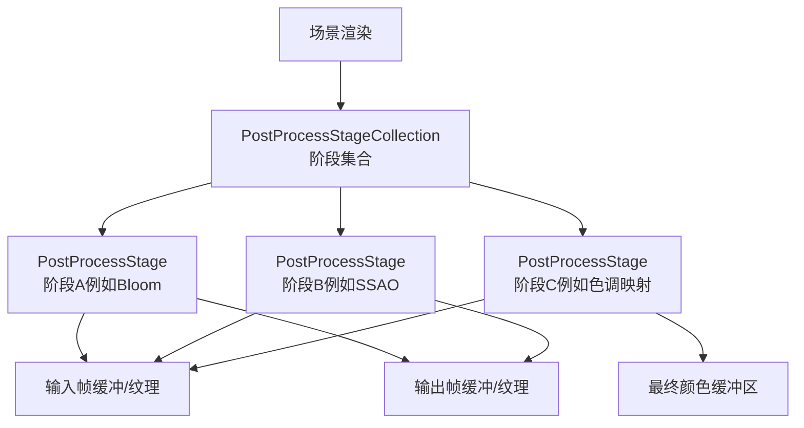
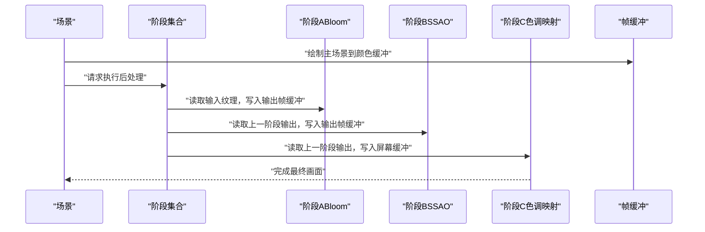
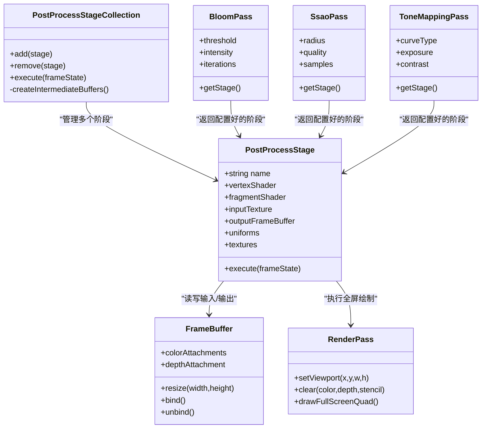
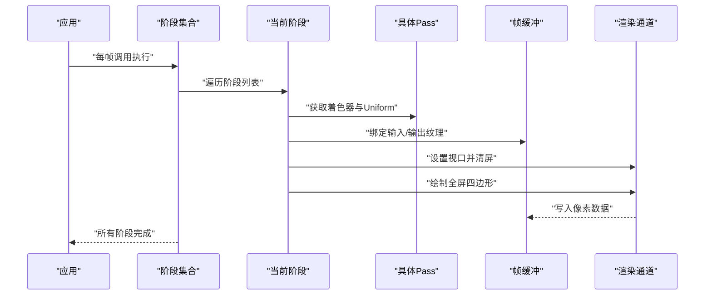
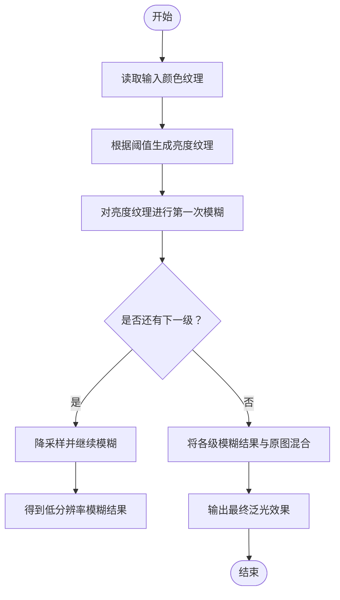
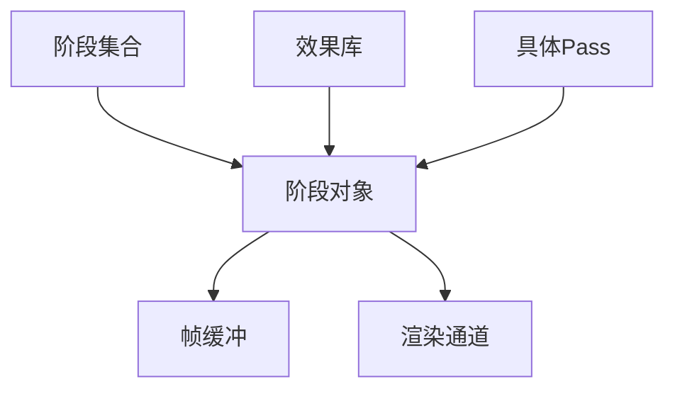

# 后处理效果API

<cite>
**本文引用的文件**   
- [PostProcessStage.js](file://packages/engine/Source/Scene/PostProcessStage.js)
- [PostProcessStageCollection.js](file://packages/engine/Source/Scene/PostProcessStageCollection.js)
- [PostProcessStageLibrary.js](file://packages/engine/Source/Scene/PostProcessStageLibrary.js)
- [BloomPass.js](file://packages/engine/Source/Scene/PostProcessStages/BloomPass.js)
- [SsaoPass.js](file://packages/engine/Source/Scene/PostProcessStages/SsaoPass.js)
- [ToneMappingPass.js](file://packages/engine/Source/Scene/PostProcessStages/ToneMappingPass.js)
- [Scene.js](file://packages/engine/Source/Scene/Scene.js)
- [FrameBuffer.js](file://packages/engine/Source/Scene/FrameBuffer.js)
- [RenderPass.js](file://packages/engine/Source/Scene/RenderPass.js)
</cite>

## 目录
1. [简介](#简介)
2. [项目结构](#项目结构)
3. [核心组件](#核心组件)
4. [架构总览](#架构总览)
5. [详细组件分析](#详细组件分析)
6. [依赖关系分析](#依赖关系分析)
7. [性能考虑](#性能考虑)
8. [故障排查指南](#故障排查指南)
9. [结论](#结论)
10. [附录](#附录) 

## 简介
本文件面向Cesium引擎的后处理效果系统，提供完整的API与实现指南。内容涵盖：
- 效果链构建：通过阶段集合组织多个后处理阶段，定义渲染顺序与依赖。
- 着色器编写：基于GLSL的片段着色器规范、内置变量与纹理访问约定。
- 参数传递：Uniform与纹理如何从JavaScript侧注入到GPU。
- 内置效果：Bloom（泛光）、SSAO（屏幕空间环境光遮蔽）、色调映射的使用方式。
- 自定义效果：开发流程、最佳实践与常见问题。
- 组合与调优：多效果叠加、分辨率控制、批处理策略与跨平台兼容性建议。
- GLSL编程指南：常用函数、精度选择、移动端优化技巧。

## 项目结构
后处理相关代码主要位于引擎包的Scene模块中，围绕“阶段”抽象进行组织：
- PostProcessStage：单个后处理阶段的封装，包含名称、顶点/片段着色器、输入输出帧缓冲、Uniform与纹理绑定等。
- PostProcessStageCollection：维护一个或多个阶段实例，负责执行顺序、资源管理与渲染调用。
- PostProcessStageLibrary：提供常用效果的工厂方法（如Bloom、SSAO、色调映射）。
- 具体Pass实现：BloomPass、SsaoPass、ToneMappingPass等，作为可复用的阶段模板。
- Scene集成：在渲染管线中按阶段集合的顺序执行后处理，并管理中间帧缓冲。

图表来源
- [PostProcessStageCollection.js](file://packages/engine/Source/Scene/PostProcessStageCollection.js)
- [PostProcessStage.js](file://packages/engine/Source/Scene/PostProcessStage.js)
- [Scene.js](file://packages/engine/Source/Scene/Scene.js)

章节来源
- [PostProcessStage.js](file://packages/engine/Source/Scene/PostProcessStage.js)
- [PostProcessStageCollection.js](file://packages/engine/Source/Scene/PostProcessStageCollection.js)
- [PostProcessStageLibrary.js](file://packages/engine/Source/Scene/PostProcessStageLibrary.js)
- [BloomPass.js](file://packages/engine/Source/Scene/PostProcessStages/BloomPass.js)
- [SsaoPass.js](file://packages/engine/Source/Scene/PostProcessStages/SsaoPass.js)
- [ToneMappingPass.js](file://packages/engine/Source/Scene/PostProcessStages/ToneMappingPass.js)
- [Scene.js](file://packages/engine/Source/Scene/Scene.js)

## 核心组件
- PostProcessStage
  - 职责：描述一次全屏后处理操作，包括着色器、输入/输出帧缓冲、Uniform与纹理绑定。
  - 关键能力：
    - 指定名称与着色器源（顶点/片段）。
    - 设置输入纹理（如前一级输出的颜色或深度/法线贴图）。
    - 设置输出帧缓冲（用于多级渲染或临时结果）。
    - 暴露Uniform接口供JS侧更新（标量、向量、矩阵、采样器等）。
- PostProcessStageCollection
  - 职责：管理一组PostProcessStage的执行顺序与生命周期。
  - 关键能力：
    - 添加/移除阶段。
    - 在每帧渲染时按序执行各阶段。
    - 自动创建/复用中间帧缓冲，避免重复分配。
- PostProcessStageLibrary
  - 职责：提供常用后处理效果的工厂方法，返回已配置好的阶段实例。
  - 典型方法：
    - 创建Bloom阶段（含阈值、强度、迭代次数等参数）。
    - 创建SSAO阶段（含半径、质量、采样数等参数）。
    - 创建色调映射阶段（含曲线类型、曝光、对比度等参数）。
- 具体Pass（BloomPass、SsaoPass、ToneMappingPass）
  - 职责：封装特定算法所需的着色器与默认Uniform值。
  - 特点：内部使用多级渲染（如Bloom的多级模糊），对外暴露简洁的参数接口。

章节来源
- [PostProcessStage.js](file://packages/engine/Source/Scene/PostProcessStage.js)
- [PostProcessStageCollection.js](file://packages/engine/Source/Scene/PostProcessStageCollection.js)
- [PostProcessStageLibrary.js](file://packages/engine/Source/Scene/PostProcessStageLibrary.js)
- [BloomPass.js](file://packages/engine/Source/Scene/PostProcessStages/BloomPass.js)
- [SsaoPass.js](file://packages/engine/Source/Scene/PostProcessStages/SsaoPass.js)
- [ToneMappingPass.js](file://packages/engine/Source/Scene/PostProcessStages/ToneMappingPass.js)

## 架构总览
后处理渲染的整体流程如下：
- 主渲染阶段完成后，将颜色（以及可选的深度/法线）写入帧缓冲。
- 阶段集合按顺序执行每个阶段，前一阶段的输出作为下一阶段的输入。
- 最后一个阶段通常输出到屏幕可见的颜色缓冲区。

图表来源
- [Scene.js](file://packages/engine/Source/Scene/Scene.js)
- [PostProcessStageCollection.js](file://packages/engine/Source/Scene/PostProcessStageCollection.js)
- [PostProcessStage.js](file://packages/engine/Source/Scene/PostProcessStage.js)
- [FrameBuffer.js](file://packages/engine/Source/Scene/FrameBuffer.js)

章节来源
- [Scene.js](file://packages/engine/Source/Scene/Scene.js)
- [PostProcessStageCollection.js](file://packages/engine/Source/Scene/PostProcessStageCollection.js)
- [PostProcessStage.js](file://packages/engine/Source/Scene/PostProcessStage.js)
- [FrameBuffer.js](file://packages/engine/Source/Scene/FrameBuffer.js)

## 详细组件分析

### 阶段对象模型（类图）

图表来源
- [PostProcessStage.js](file://packages/engine/Source/Scene/PostProcessStage.js)
- [PostProcessStageCollection.js](file://packages/engine/Source/Scene/PostProcessStageCollection.js)
- [BloomPass.js](file://packages/engine/Source/Scene/PostProcessStages/BloomPass.js)
- [SsaoPass.js](file://packages/engine/Source/Scene/PostProcessStages/SsaoPass.js)
- [ToneMappingPass.js](file://packages/engine/Source/Scene/PostProcessStages/ToneMappingPass.js)
- [FrameBuffer.js](file://packages/engine/Source/Scene/FrameBuffer.js)
- [RenderPass.js](file://packages/engine/Source/Scene/RenderPass.js)

章节来源
- [PostProcessStage.js](file://packages/engine/Source/Scene/PostProcessStage.js)
- [PostProcessStageCollection.js](file://packages/engine/Source/Scene/PostProcessStageCollection.js)
- [BloomPass.js](file://packages/engine/Source/Scene/PostProcessStages/BloomPass.js)
- [SsaoPass.js](file://packages/engine/Source/Scene/PostProcessStages/SsaoPass.js)
- [ToneMappingPass.js](file://packages/engine/Source/Scene/PostProcessStages/ToneMappingPass.js)
- [FrameBuffer.js](file://packages/engine/Source/Scene/FrameBuffer.js)
- [RenderPass.js](file://packages/engine/Source/Scene/RenderPass.js)

### 渲染序列（阶段执行时序）

图表来源
- [PostProcessStageCollection.js](file://packages/engine/Source/Scene/PostProcessStageCollection.js)
- [PostProcessStage.js](file://packages/engine/Source/Scene/PostProcessStage.js)
- [RenderPass.js](file://packages/engine/Source/Scene/RenderPass.js)
- [FrameBuffer.js](file://packages/engine/Source/Scene/FrameBuffer.js)

章节来源
- [PostProcessStageCollection.js](file://packages/engine/Source/Scene/PostProcessStageCollection.js)
- [PostProcessStage.js](file://packages/engine/Source/Scene/PostProcessStage.js)
- [RenderPass.js](file://packages/engine/Source/Scene/RenderPass.js)
- [FrameBuffer.js](file://packages/engine/Source/Scene/FrameBuffer.js)

### 复杂逻辑流程（以Bloom为例）
Bloom通常包含多级降采样与高斯模糊，再与原图混合。其内部流程如下：

图表来源
- [BloomPass.js](file://packages/engine/Source/Scene/PostProcessStages/BloomPass.js)
- [PostProcessStage.js](file://packages/engine/Source/Scene/PostProcessStage.js)
- [FrameBuffer.js](file://packages/engine/Source/Scene/FrameBuffer.js)

章节来源
- [BloomPass.js](file://packages/engine/Source/Scene/PostProcessStages/BloomPass.js)
- [PostProcessStage.js](file://packages/engine/Source/Scene/PostProcessStage.js)
- [FrameBuffer.js](file://packages/engine/Source/Scene/FrameBuffer.js)

### 内置效果使用要点
- Bloom（泛光）
  - 适用场景：发光物体、高光溢出、霓虹风格。
  - 关键参数：阈值、强度、迭代次数、模糊半径。
  - 注意：多级模糊会显著增加带宽与计算量，需权衡质量与性能。
- SSAO（屏幕空间环境光遮蔽）
  - 适用场景：增强体积感与细节层次。
  - 关键参数：半径、质量等级、采样数量、衰减系数。
  - 注意：需要深度/法线信息；移动端建议降低采样数与半径。
- 色调映射
  - 适用场景：HDR到LDR转换、统一视觉风格。
  - 关键参数：曲线类型、曝光、对比度、伽马校正。
  - 注意：与Bloom配合时，先做色调映射再做泛光或反之，取决于期望的视觉效果。

章节来源
- [PostProcessStageLibrary.js](file://packages/engine/Source/Scene/PostProcessStageLibrary.js)
- [BloomPass.js](file://packages/engine/Source/Scene/PostProcessStages/BloomPass.js)
- [SsaoPass.js](file://packages/engine/Source/Scene/PostProcessStages/SsaoPass.js)
- [ToneMappingPass.js](file://packages/engine/Source/Scene/PostProcessStages/ToneMappingPass.js)

### 自定义效果开发指南
- 步骤概览
  - 定义阶段：创建PostProcessStage实例，提供顶点与片段着色器。
  - 绑定输入：设置输入纹理（颜色、深度、法线等）。
  - 设置输出：指定输出帧缓冲或直接写回屏幕。
  - 注入Uniform：在每帧更新参数（标量、向量、矩阵、采样器）。
  - 加入集合：将阶段添加到PostProcessStageCollection并按需排序。
- 着色器约定
  - 顶点着色器：通常绘制全屏四边形，传递UV坐标。
  - 片段着色器：读取输入纹理，计算输出颜色；遵循精度与函数可用性。
- 参数传递
  - Uniform：通过阶段对象的Uniform接口设置数值或矩阵。
  - 纹理：通过纹理槽位绑定输入纹理，确保采样器索引一致。
- 调试建议
  - 分步验证：单独运行每个阶段，检查中间输出。
  - 可视化Uniform：将关键参数写入颜色通道以便观察。
  - 日志与断点：在关键分支打印状态，定位异常路径。

章节来源
- [PostProcessStage.js](file://packages/engine/Source/Scene/PostProcessStage.js)
- [PostProcessStageCollection.js](file://packages/engine/Source/Scene/PostProcessStageCollection.js)

## 依赖关系分析
- 组件耦合
  - 阶段集合强依赖阶段对象的生命周期与执行接口。
  - 阶段对象依赖帧缓冲与渲染通道进行实际绘制。
  - 具体Pass为阶段提供默认着色器与参数，降低使用者复杂度。
- 外部依赖
  - WebGL上下文与扩展：不同平台支持差异会影响可用函数与精度。
  - 纹理格式与尺寸：影响内存占用与带宽消耗。
- 潜在循环依赖
  - 阶段之间应避免相互引用同一帧缓冲导致未定义行为；应严格单向数据流。

图表来源
- [PostProcessStageCollection.js](file://packages/engine/Source/Scene/PostProcessStageCollection.js)
- [PostProcessStage.js](file://packages/engine/Source/Scene/PostProcessStage.js)
- [PostProcessStageLibrary.js](file://packages/engine/Source/Scene/PostProcessStageLibrary.js)
- [BloomPass.js](file://packages/engine/Source/Scene/PostProcessStages/BloomPass.js)
- [SsaoPass.js](file://packages/engine/Source/Scene/PostProcessStages/SsaoPass.js)
- [ToneMappingPass.js](file://packages/engine/Source/Scene/PostProcessStages/ToneMappingPass.js)
- [FrameBuffer.js](file://packages/engine/Source/Scene/FrameBuffer.js)
- [RenderPass.js](file://packages/engine/Source/Scene/RenderPass.js)

章节来源
- [PostProcessStageCollection.js](file://packages/engine/Source/Scene/PostProcessStageCollection.js)
- [PostProcessStage.js](file://packages/engine/Source/Scene/PostProcessStage.js)
- [PostProcessStageLibrary.js](file://packages/engine/Source/Scene/PostProcessStageLibrary.js)
- [BloomPass.js](file://packages/engine/Source/Scene/PostProcessStages/BloomPass.js)
- [SsaoPass.js](file://packages/engine/Source/Scene/PostProcessStages/SsaoPass.js)
- [ToneMappingPass.js](file://packages/engine/Source/Scene/PostProcessStages/ToneMappingPass.js)
- [FrameBuffer.js](file://packages/engine/Source/Scene/FrameBuffer.js)
- [RenderPass.js](file://packages/engine/Source/Scene/RenderPass.js)

## 性能考虑
- 分辨率与带宽
  - 多级渲染会成倍增加纹理读写开销；尽量使用较低分辨率的中间缓冲。
  - 合理设置Bloom的迭代次数与模糊半径，避免过度降采样。
- 采样与质量
  - SSAO的采样数与半径直接影响性能；移动端建议保守设置。
  - 色调映射计算相对轻量，但与其他效果叠加时需评估整体负载。
- 批处理与复用
  - 复用帧缓冲与纹理对象，减少分配与销毁成本。
  - 合并相近阶段以减少切换开销。
- 平台兼容
  - 关注WebGL版本与扩展支持；必要时提供降级方案。
  - 针对移动设备优化精度与分支复杂度。

[本节为通用指导，不直接分析具体文件]

## 故障排查指南
- 常见错误
  - 着色器编译失败：检查语法、精度声明与函数可用性。
  - 纹理未绑定或索引错误：确认Uniform采样器与纹理槽位一致。
  - 帧缓冲尺寸不匹配：确保输入/输出纹理尺寸与视口一致。
  - 渲染顺序错误：调整阶段集合中的顺序，避免依赖未就绪的数据。
- 调试手段
  - 单阶段隔离：逐个启用阶段，定位问题来源。
  - 中间结果可视化：将中间缓冲输出到屏幕，检查数据是否正确。
  - 参数扫描：逐步调整关键参数，观察变化趋势。

章节来源
- [PostProcessStage.js](file://packages/engine/Source/Scene/PostProcessStage.js)
- [PostProcessStageCollection.js](file://packages/engine/Source/Scene/PostProcessStageCollection.js)
- [FrameBuffer.js](file://packages/engine/Source/Scene/FrameBuffer.js)
- [RenderPass.js](file://packages/engine/Source/Scene/RenderPass.js)

## 结论
Cesium的后处理系统以“阶段”为核心抽象，提供了灵活而强大的效果链构建能力。通过PostProcessStageCollection统一管理执行顺序与资源，借助PostProcessStageLibrary快速接入常用效果，开发者可以高效地组合与定制后处理管线。在实际项目中，应重视性能与兼容性，结合调试手段持续优化效果质量与运行效率。

[本节为总结性内容，不直接分析具体文件]

## 附录
- GLSL着色器编程指南（要点）
  - 精度选择：在移动端优先使用mediump/lowp，仅在必要处使用highp。
  - 函数可用性：避免使用平台不支持的扩展函数；必要时提供替代实现。
  - UV与纹理：确保UV范围正确，避免边界采样导致的伪影。
  - 分支与循环：尽量减少复杂分支与深层循环，提升并行执行效率。
- 常见效果实现示例（思路）
  - 边缘检测：利用相邻像素差值计算梯度，输出边缘强度。
  - 反色与灰度：简单颜色变换，适合测试与过渡效果。
  - 景深模拟：基于距离或深度信息进行模糊，区分前景与背景。
  - 色彩分级：通过分段线性或曲线映射调整色调与饱和度。

[本节为概念性内容，不直接分析具体文件]