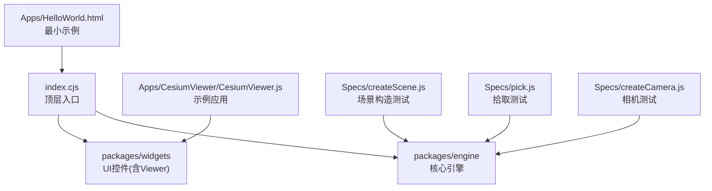
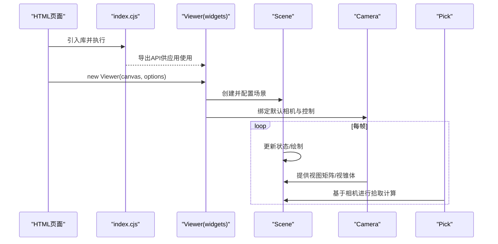
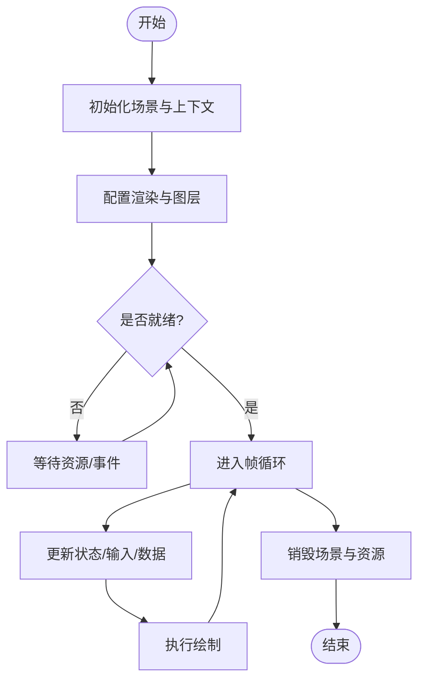
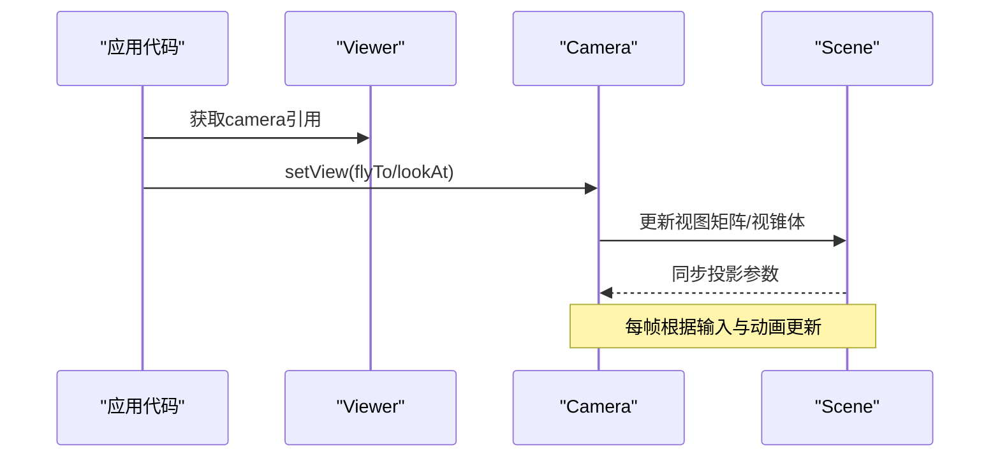
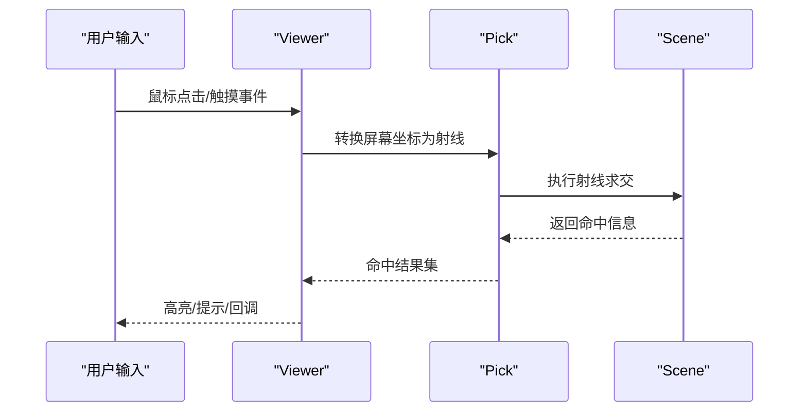
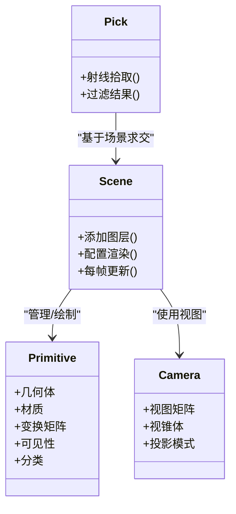
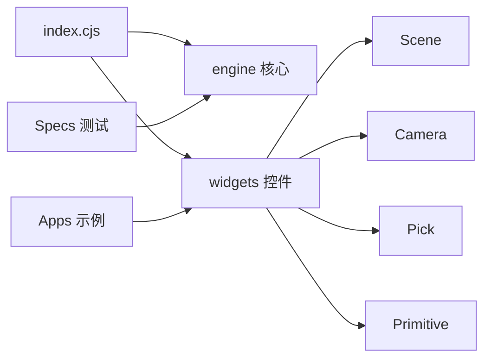

# 场景API

<cite>
**本文引用的文件**   
- [index.cjs](file://index.cjs)
- [package.json](file://package.json)
- [README.md](file://README.md)
- [CesiumViewer.js](file://Apps/CesiumViewer/CesiumViewer.js)
- [HelloWorld.html](file://Apps/HelloWorld.html)
- [createScene.js](file://Specs/createScene.js)
- [pick.js](file://Specs/pick.js)
- [createCamera.js](file://Specs/createCamera.js)
</cite>

## 目录
1. [简介](#简介)
2. [项目结构](#项目结构)
3. [核心组件](#核心组件)
4. [架构总览](#架构总览)
5. [详细组件分析](#详细组件分析)
6. [依赖关系分析](#依赖关系分析)
7. [性能与优化](#性能与优化)
8. [故障排查指南](#故障排查指南)
9. [结论](#结论)
10. [附录：示例与最佳实践](#附录示例与最佳实践)

## 简介
本文件面向使用 CesiumJS 的开发者，聚焦“场景管理 API”的核心能力与使用方法。内容覆盖 Scene 类的配置与渲染设置、图层管理、相机控制（Camera）、拾取操作（Pick）、几何体渲染（Primitive）等关键接口；并给出场景生命周期管理、渲染优化与性能监控的实践建议，以及创建与管理 3D 场景的示例路径，帮助读者快速上手并构建高性能的三维可视化应用。

## 项目结构
仓库采用多包组织方式，核心引擎位于 packages/engine，UI 控件位于 packages/widgets，示例与应用位于 Apps，测试与规范在 Specs。场景相关能力由引擎层提供，并通过顶层入口对外暴露。

图表来源
- [index.cjs:1-200](file://index.cjs#L1-L200)
- [CesiumViewer.js:1-200](file://Apps/CesiumViewer/CesiumViewer.js#L1-L200)
- [HelloWorld.html:1-200](file://Apps/HelloWorld.html#L1-L200)
- [createScene.js:1-200](file://Specs/createScene.js#L1-L200)
- [pick.js:1-200](file://Specs/pick.js#L1-L200)
- [createCamera.js:1-200](file://Specs/createCamera.js#L1-L200)

章节来源
- [index.cjs:1-200](file://index.cjs#L1-L200)
- [package.json:1-200](file://package.json#L1-L200)
- [README.md:1-200](file://README.md#L1-L200)

## 核心组件
- Scene：场景容器，负责渲染管线、图层组织、深度/阴影/雾效等渲染设置，以及帧循环驱动。
- Camera：相机控制器，提供视角定位、飞行、投影模式切换、视锥体参数等。
- Pick：拾取器，基于射线投射实现屏幕坐标到场景对象的命中检测。
- Primitive：图元基类，承载几何体、材质、变换、可见性、分类等渲染属性。
- Viewer（widgets）：高层封装，组合 Scene、Camera、UI 控件与交互事件，便于快速搭建应用。

章节来源
- [index.cjs:1-200](file://index.cjs#L1-L200)
- [CesiumViewer.js:1-200](file://Apps/CesiumViewer/CesiumViewer.js#L1-L200)
- [HelloWorld.html:1-200](file://Apps/HelloWorld.html#L1-L200)

## 架构总览
下图展示从页面加载到场景渲染的关键流程，包括入口、Viewer 初始化、Scene 创建与更新、相机与拾取的协作关系。

图表来源
- [index.cjs:1-200](file://index.cjs#L1-L200)
- [CesiumViewer.js:1-200](file://Apps/CesiumViewer/CesiumViewer.js#L1-L200)
- [HelloWorld.html:1-200](file://Apps/HelloWorld.html#L1-L200)

## 详细组件分析

### Scene 类：配置、渲染与图层管理
- 配置选项
  - 基础环境：抗锯齿、深度缓冲、模板缓冲、阴影、雾效、时间控制、时钟等。
  - 渲染质量：后处理、色调映射、环境贴图、体积云/大气等高级特性开关。
  - 资源与缓存：纹理压缩、内存限制、批处理策略、实例化支持。
- 渲染设置
  - 光照模型、光源管理、材质系统、着色器编译与缓存。
  - 分层渲染：透明/不透明通道分离、深度预通、剔除策略。
- 图层管理
  - 通过集合对象添加/移除/排序图层，支持分类、可见性、优先级与裁剪。
  - 与地形、影像、矢量数据源协同工作，按需加载与卸载。
- 生命周期
  - 初始化：创建上下文、加载资源、注册事件。
  - 运行期：每帧更新、增量绘制、异步任务调度。
  - 销毁：释放 GPU 资源、清理监听、停止循环。

章节来源
- [createScene.js:1-200](file://Specs/createScene.js#L1-L200)
- [CesiumViewer.js:1-200](file://Apps/CesiumViewer/CesiumViewer.js#L1-L200)

#### 场景生命周期流程图

图表来源
- [createScene.js:1-200](file://Specs/createScene.js#L1-L200)

### Camera 类：相机控制
- 视角与位置：经纬度高度、目标点、距离、方位角/俯仰角/翻滚角。
- 投影模式：透视投影与正交投影切换，近远平面调整。
- 飞行与动画：flyTo、lookAt、setView 等便捷方法，结合插值与缓动。
- 视锥体与裁剪：FOV、宽高比、近远裁剪面，与场景剔除联动。
- 事件与交互：拖拽旋转、滚轮缩放、键盘导航等。

章节来源
- [createCamera.js:1-200](file://Specs/createCamera.js#L1-L200)
- [CesiumViewer.js:1-200](file://Apps/CesiumViewer/CesiumViewer.js#L1-L200)

#### 相机控制序列图

图表来源
- [createCamera.js:1-200](file://Specs/createCamera.js#L1-L200)
- [CesiumViewer.js:1-200](file://Apps/CesiumViewer/CesiumViewer.js#L1-L200)

### Pick 类：拾取操作
- 射线拾取：将屏幕坐标转换为世界空间射线，与场景对象求交。
- 结果对象：返回命中对象、距离、法线、UV、图元索引等。
- 过滤与层级：按图层、分类、可见性过滤命中结果。
- 性能优化：批量拾取、空间索引、LOD 与裁剪配合。

章节来源
- [pick.js:1-200](file://Specs/pick.js#L1-L200)
- [CesiumViewer.js:1-200](file://Apps/CesiumViewer/CesiumViewer.js#L1-L200)

#### 拾取流程时序图

图表来源
- [pick.js:1-200](file://Specs/pick.js#L1-L200)
- [CesiumViewer.js:1-200](file://Apps/CesiumViewer/CesiumViewer.js#L1-L200)

### Primitive 类：几何体渲染
- 几何体与材质：定义顶点/索引、法线、纹理、PBR 材质属性。
- 变换与可见性：局部/世界变换矩阵、显示隐藏、裁剪区域。
- 批处理与实例化：合并绘制调用、减少状态切换、提升吞吐。
- 分类与选择：分类标签、选择态、拾取反馈。

章节来源
- [createScene.js:1-200](file://Specs/createScene.js#L1-L200)
- [CesiumViewer.js:1-200](file://Apps/CesiumViewer/CesiumViewer.js#L1-L200)

#### Primitive 类关系图

图表来源
- [createScene.js:1-200](file://Specs/createScene.js#L1-L200)
- [CesiumViewer.js:1-200](file://Apps/CesiumViewer/CesiumViewer.js#L1-L200)

## 依赖关系分析
- 顶层入口 index.cjs 统一导出 API，供应用与示例使用。
- widgets 中的 Viewer 依赖 engine 的 Scene、Camera、Pick、Primitive 等核心模块。
- 示例与测试用例展示了典型用法与边界条件，可作为参考实现。

图表来源
- [index.cjs:1-200](file://index.cjs#L1-L200)
- [CesiumViewer.js:1-200](file://Apps/CesiumViewer/CesiumViewer.js#L1-L200)
- [createScene.js:1-200](file://Specs/createScene.js#L1-L200)
- [pick.js:1-200](file://Specs/pick.js#L1-L200)
- [createCamera.js:1-200](file://Specs/createCamera.js#L1-L200)

章节来源
- [index.cjs:1-200](file://index.cjs#L1-L200)
- [package.json:1-200](file://package.json#L1-L200)

## 性能与优化
- 渲染批次与状态切换
  - 合并相同材质与状态的 Primitive，减少 draw call。
  - 合理使用实例化与批处理，降低 CPU-GPU 通信开销。
- 几何与纹理
  - 控制几何复杂度与纹理分辨率，启用压缩格式。
  - 使用 LOD 与视锥体裁剪，避免不可见对象参与绘制。
- 相机与视锥体
  - 合理设置近远裁剪面，避免精度问题与过度裁剪。
  - 动态 FOV 与投影模式切换，平衡视野与性能。
- 拾取与交互
  - 限制拾取范围与对象数量，使用空间索引加速求交。
  - 延迟或节流高频事件，避免主线程阻塞。
- 资源与内存
  - 及时释放不再使用的资源，监控显存占用。
  - 分阶段加载与懒加载，平滑首屏与滚动体验。

[本节为通用指导，无需特定文件来源]

## 故障排查指南
- 场景无法渲染
  - 检查 WebGL 上下文创建与权限，确认 canvas 尺寸与 DPR 设置。
  - 验证 Shader 编译与资源加载状态，查看控制台错误日志。
- 相机异常
  - 确认投影模式与视锥体参数，避免近远平面设置不当导致裁剪异常。
  - 检查 flyTo/lookAt 的目标与距离是否合理。
- 拾取无结果
  - 确认对象可见性与分类过滤，检查射线起点与方向是否正确。
  - 对复杂场景开启空间索引或缩小拾取范围。
- 性能抖动
  - 监控帧率与 GPU 时间，定位瓶颈（CPU 逻辑、GPU 绘制、I/O）。
  - 减少每帧分配与 GC 压力，复用对象与缓冲区。

章节来源
- [createScene.js:1-200](file://Specs/createScene.js#L1-L200)
- [pick.js:1-200](file://Specs/pick.js#L1-L200)
- [createCamera.js:1-200](file://Specs/createCamera.js#L1-L200)

## 结论
Scene、Camera、Pick、Primitive 构成了 CesiumJS 场景管理的核心。通过合理的配置与生命周期管理，结合渲染优化与性能监控，可以构建流畅、稳定且可扩展的 3D 可视化应用。建议以 Viewer 为入口快速搭建原型，再逐步深入 Scene 与底层 API 进行精细化调优。

[本节为总结，无需特定文件来源]

## 附录：示例与最佳实践
- 最小示例
  - 参考 HelloWorld.html，了解如何引入库并在页面中初始化 Viewer。
- 完整示例
  - 参考 CesiumViewer.js，学习场景、相机、图层与交互的综合用法。
- 测试用例
  - createScene.js：场景创建与配置的常见模式。
  - pick.js：拾取操作的典型流程与边界情况。
  - createCamera.js：相机控制与动画的常用方法。

章节来源
- [HelloWorld.html:1-200](file://Apps/HelloWorld.html#L1-L200)
- [CesiumViewer.js:1-200](file://Apps/CesiumViewer/CesiumViewer.js#L1-L200)
- [createScene.js:1-200](file://Specs/createScene.js#L1-L200)
- [pick.js:1-200](file://Specs/pick.js#L1-L200)
- [createCamera.js:1-200](file://Specs/createCamera.js#L1-L200)