# 场景核心API

<cite>
**本文引用的文件**   
- [index.js](file://packages/engine/Source/index.js)
- [Scene.js](file://packages/engine/Source/Scene.js)
- [createScene.js](file://Specs/createScene.js)
- [CesiumViewer.js](file://Apps/CesiumViewer/CesiumViewer.js)
</cite>

## 目录
1. [简介](#简介)
2. [项目结构](#项目结构)
3. [核心组件](#核心组件)
4. [架构总览](#架构总览)
5. [详细组件分析](#详细组件分析)
6. [依赖分析](#依赖分析)
7. [性能考虑](#性能考虑)
8. [故障排查指南](#故障排查指南)
9. [结论](#结论)
10. [附录](#附录)

## 简介
本文件面向需要深入理解 Cesium Scene 核心能力的开发者，聚焦 Scene 类的初始化配置、渲染设置、图层管理、事件系统、场景模式切换（2D/3D/Columbus）、渲染循环控制与性能监控等关键能力。文档同时提供生命周期管理与资源清理的最佳实践，并通过“代码片段路径”的方式给出实际使用示例的参考位置，帮助读者快速上手并构建稳定的 3D 场景实例。

## 项目结构
为便于定位 Scene 相关能力，本节给出与 Scene 核心 API 密切相关的仓库结构与入口关系：
- 引擎导出入口：聚合导出 Scene 等核心类，供上层应用或 Viewer 使用
- Scene 实现：封装场景初始化、渲染管线、图层组织、事件分发、模式切换等
- 测试辅助：创建最小可用 Scene 实例，用于验证与演示
- 示例应用：基于 Viewer 的场景搭建与运行流程

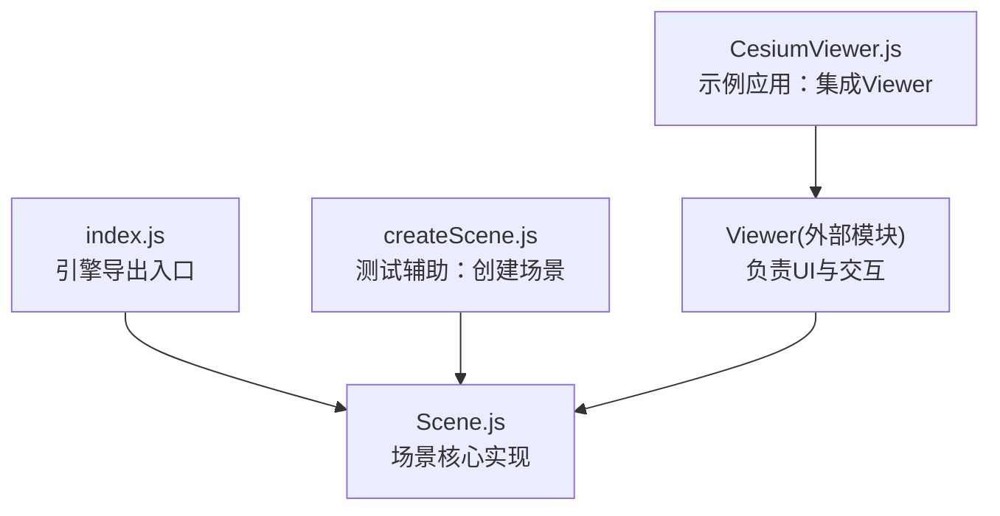

图表来源
- [index.js](file://packages/engine/Source/index.js)
- [Scene.js](file://packages/engine/Source/Scene.js)
- [createScene.js](file://Specs/createScene.js)
- [CesiumViewer.js](file://Apps/CesiumViewer/CesiumViewer.js)

章节来源
- [index.js](file://packages/engine/Source/index.js)
- [Scene.js](file://packages/engine/Source/Scene.js)
- [createScene.js](file://Specs/createScene.js)
- [CesiumViewer.js](file://Apps/CesiumViewer/CesiumViewer.js)

## 核心组件
- Scene 类
  - 职责：场景初始化、渲染上下文与管线、图层集合、相机与控制器、事件系统、模式切换（2D/3D/Columbus）、渲染循环协调、性能统计与调试信息输出。
  - 典型能力：
    - 初始化配置：接收 WebGL 上下文、画布尺寸、投影与深度、阴影、雾效、环境贴图、地形与影像提供者等
    - 渲染设置：开启/关闭抗锯齿、阴影、后处理、帧率限制、时间步长、最大采样数等
    - 图层管理：添加/移除/排序图层，支持分层渲染与可见性控制
    - 事件系统：注册/注销鼠标、键盘、触摸等事件，统一派发回调
    - 模式切换：在 2D、3D、Columbus 视图之间切换，更新相机与投影矩阵
    - 渲染循环：与请求动画帧机制协作，驱动 update/render 阶段
    - 性能监控：暴露帧率、绘制调用次数、内存占用等指标
- 测试辅助 createScene
  - 职责：构造最小化 Scene 实例，注入必要的 WebGL 上下文与默认配置，便于单测与演示
- 示例应用 CesiumViewer
  - 职责：通过 Viewer 组合 Scene、控件、数据源与 UI，展示完整工作流

章节来源
- [Scene.js](file://packages/engine/Source/Scene.js)
- [createScene.js](file://Specs/createScene.js)
- [CesiumViewer.js](file://Apps/CesiumViewer/CesiumViewer.js)

## 架构总览
下图展示了 Scene 在整体系统中的角色与交互关系：上层应用或 Viewer 负责创建与持有 Scene；Scene 内部维护渲染管线、图层树、事件总线与模式状态；渲染循环由浏览器驱动，Scene 在每帧执行更新与绘制。

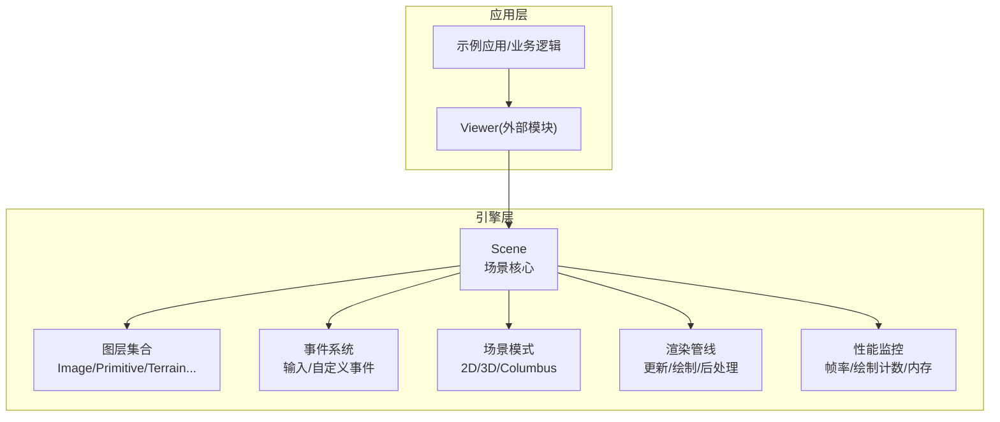

图表来源
- [Scene.js](file://packages/engine/Source/Scene.js)
- [CesiumViewer.js](file://Apps/CesiumViewer/CesiumViewer.js)

## 详细组件分析

### Scene 类概览与职责边界
- 初始化与配置
  - 接收 WebGL 上下文、画布、投影参数、阴影与雾效开关、环境贴图、地形与影像提供者等
  - 根据配置选择场景模式（2D/3D/Columbus）并初始化对应相机与投影矩阵
- 渲染循环控制
  - 与 requestAnimationFrame 协作，每帧执行 update 与 render 阶段
  - 支持帧率限制、时间步长控制、暂停/恢复渲染
- 图层管理
  - 提供统一的图层容器，支持增删改查、排序、可见性与层级控制
  - 不同图层类型按渲染顺序参与管线
- 事件系统
  - 统一注册/注销输入事件，支持冒泡与捕获策略
  - 对外暴露可订阅的事件类型与回调接口
- 模式切换
  - 提供 2D/3D/Columbus 三种模式的切换方法，内部更新相机、投影与渲染路径
- 性能监控
  - 暴露帧率、绘制调用次数、三角面片数量、内存占用等指标
  - 提供调试信息与统计数据的读取接口

章节来源
- [Scene.js](file://packages/engine/Source/Scene.js)

#### 类关系图（概念映射）
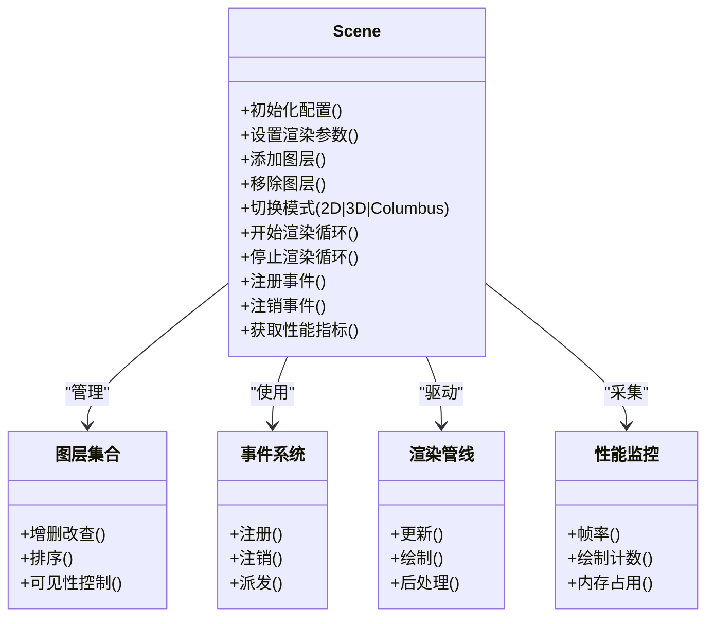

图表来源
- [Scene.js](file://packages/engine/Source/Scene.js)

### 场景初始化与配置
- 初始化流程要点
  - 创建或复用 WebGL 上下文
  - 配置画布尺寸与像素比
  - 初始化投影矩阵与相机
  - 加载地形与影像提供者
  - 初始化阴影、雾效、环境贴图
  - 注册默认事件监听器
- 常见配置项
  - 投影与相机：视场角、近/远裁剪面、初始位置与朝向
  - 渲染质量：抗锯齿、阴影、后处理开关
  - 时间与帧率：时间步长、帧率上限、是否启用时间同步
  - 资源与网络：超时、并发请求数、缓存策略

章节来源
- [Scene.js](file://packages/engine/Source/Scene.js)

#### 初始化序列图（从应用到 Scene）
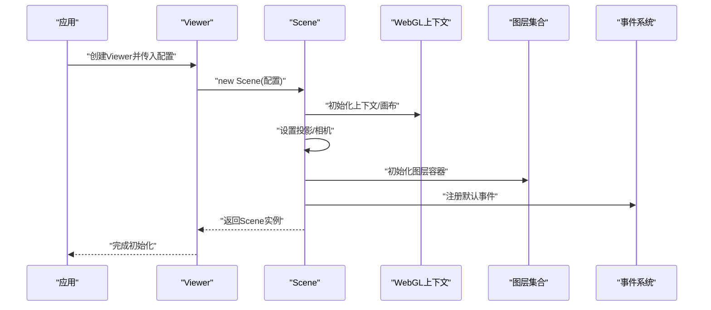

图表来源
- [Scene.js](file://packages/engine/Source/Scene.js)
- [CesiumViewer.js](file://Apps/CesiumViewer/CesiumViewer.js)

### 渲染循环控制
- 渲染阶段
  - 更新阶段：处理时间推进、相机更新、图层更新、事件派发
  - 绘制阶段：提交渲染命令、执行后处理、交换缓冲区
- 控制方式
  - 启动/停止渲染循环
  - 帧率限制与时间步长控制
  - 暂停/恢复以节省资源
- 与浏览器的协作
  - 使用 requestAnimationFrame 驱动主循环
  - 窗口大小变化时重设画布与投影

章节来源
- [Scene.js](file://packages/engine/Source/Scene.js)

#### 渲染循环流程图
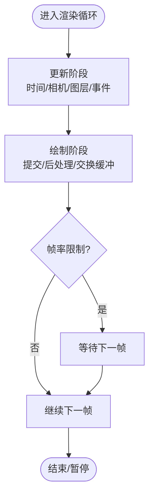

图表来源
- [Scene.js](file://packages/engine/Source/Scene.js)

### 图层管理
- 图层类型
  - 影像图层、地形图层、几何体/图元、点云、矢量要素等
- 管理能力
  - 添加/移除/查询图层
  - 调整图层顺序与可见性
  - 批量操作与条件过滤
- 渲染影响
  - 图层顺序决定绘制次序
  - 可见性控制减少无效绘制

章节来源
- [Scene.js](file://packages/engine/Source/Scene.js)

#### 图层管理时序图
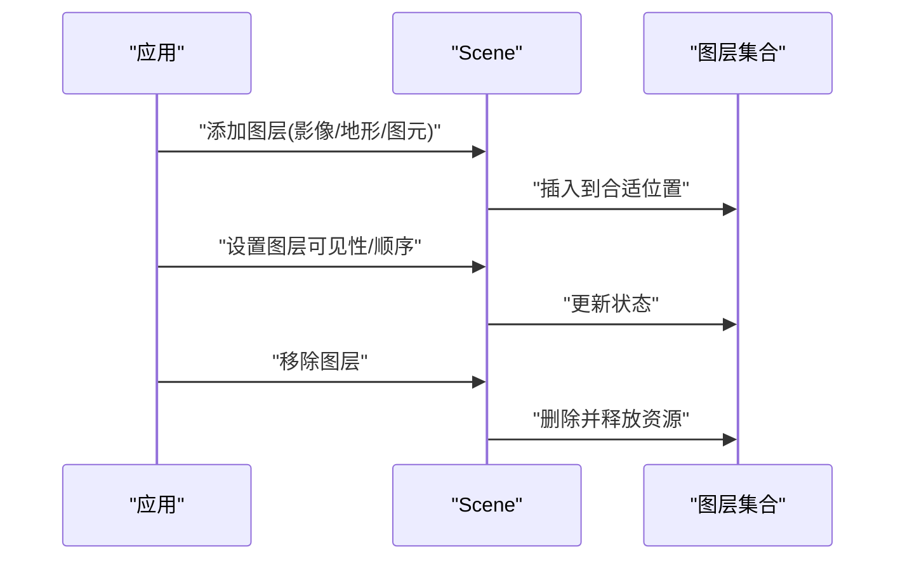

图表来源
- [Scene.js](file://packages/engine/Source/Scene.js)

### 事件系统
- 事件类型
  - 输入事件：鼠标、键盘、触摸、滚轮
  - 自定义事件：业务扩展
- 事件模型
  - 注册/注销监听器
  - 事件对象携带坐标、按钮、时间戳等信息
  - 支持阻止默认行为与冒泡控制
- 最佳实践
  - 及时注销不再使用的事件监听器，避免内存泄漏
  - 对高频事件进行节流或合并处理

章节来源
- [Scene.js](file://packages/engine/Source/Scene.js)

#### 事件处理序列图
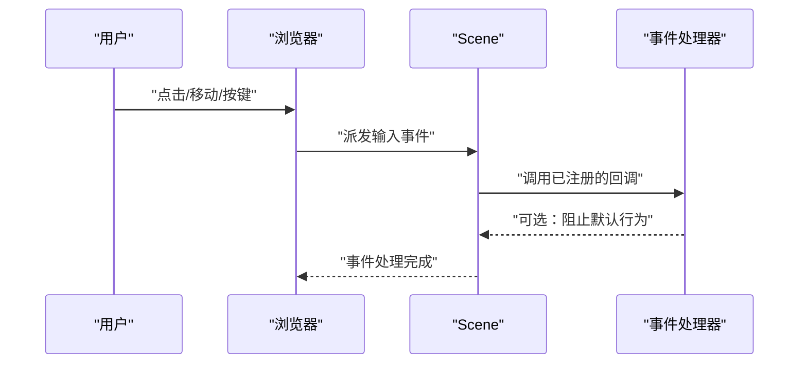

图表来源
- [Scene.js](file://packages/engine/Source/Scene.js)

### 场景模式切换（2D/3D/Columbus）
- 模式特性
  - 2D：平面投影，适合地图式交互
  - 3D：球体投影，适合三维可视化
  - Columbus：混合视角，兼顾全局与细节
- 切换流程
  - 更新相机与投影矩阵
  - 调整渲染路径与后处理
  - 重新计算可见性与裁剪
- 注意事项
  - 切换可能触发大量重绘，建议批量操作
  - 某些图层或材质在不同模式下表现差异较大

章节来源
- [Scene.js](file://packages/engine/Source/Scene.js)

#### 模式切换序列图
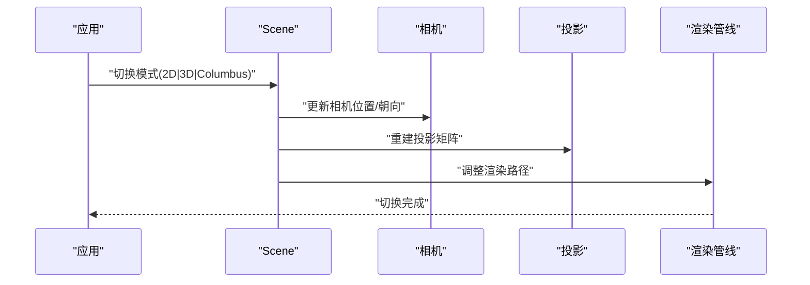

图表来源
- [Scene.js](file://packages/engine/Source/Scene.js)

### 性能监控与调试
- 监控指标
  - 帧率、绘制调用次数、三角面片数量、纹理/几何体数量
  - 内存占用、GPU 状态、网络请求耗时
- 调试工具
  - 打印统计信息、导出性能快照
  - 结合浏览器开发者工具分析瓶颈
- 优化建议
  - 合理设置阴影与后处理
  - 控制并发请求与资源加载速率
  - 使用 LOD 与视锥剔除

章节来源
- [Scene.js](file://packages/engine/Source/Scene.js)

#### 性能监控流程图
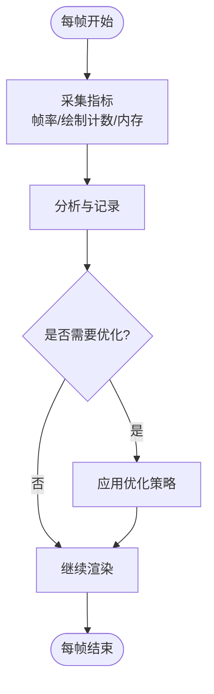

图表来源
- [Scene.js](file://packages/engine/Source/Scene.js)

### 生命周期管理与资源清理
- 生命周期阶段
  - 初始化：创建上下文、加载资源、注册事件
  - 运行期：渲染循环、事件处理、资源更新
  - 销毁：释放资源、注销事件、停止循环
- 清理要点
  - 显式释放纹理、几何体、着色器程序等资源
  - 注销所有事件监听器，避免悬挂引用
  - 停止渲染循环，防止后台持续消耗
- 错误处理
  - 捕获 WebGL 上下文丢失并尝试恢复
  - 对资源加载失败进行降级与提示

章节来源
- [Scene.js](file://packages/engine/Source/Scene.js)

#### 生命周期序列图
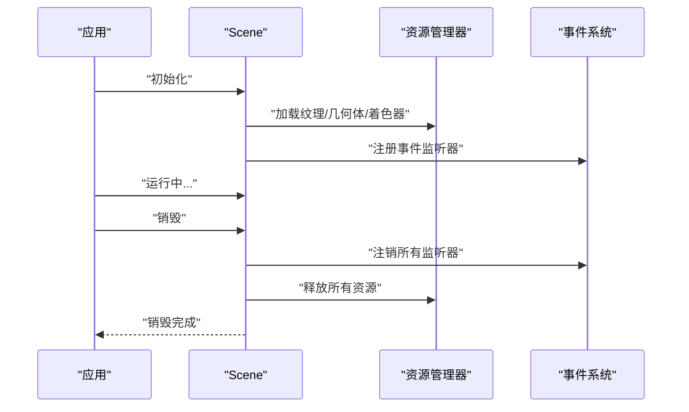

图表来源
- [Scene.js](file://packages/engine/Source/Scene.js)

### 实际代码示例（以“代码片段路径”形式）
- 创建最小可用 Scene 实例（测试辅助）
  - 参考路径：[createScene.js](file://Specs/createScene.js)
- 在示例应用中集成 Scene（通过 Viewer）
  - 参考路径：[CesiumViewer.js](file://Apps/CesiumViewer/CesiumViewer.js)
- 引擎导出入口（确认 Scene 可用性）
  - 参考路径：[index.js](file://packages/engine/Source/index.js)

说明：以上路径可直接跳转到对应文件查看具体用法与参数传递方式。为避免冗长代码，本文不直接粘贴源码内容。

章节来源
- [createScene.js](file://Specs/createScene.js)
- [CesiumViewer.js](file://Apps/CesiumViewer/CesiumViewer.js)
- [index.js](file://packages/engine/Source/index.js)

## 依赖分析
- 内部依赖
  - Scene 依赖 WebGL 上下文、投影与相机模块、图层集合、事件系统、渲染管线与性能监控
- 外部依赖
  - 浏览器 API：requestAnimationFrame、Canvas/WebGL
  - 网络与资源：影像/地形/模型资源的异步加载
- 耦合与内聚
  - Scene 作为中枢模块，保持高内聚的职责划分，通过接口与其他子系统交互
- 潜在循环依赖
  - 应避免 Scene 与资源管理器之间的双向强引用，采用事件或回调解耦

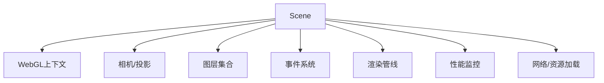

图表来源
- [Scene.js](file://packages/engine/Source/Scene.js)

章节来源
- [Scene.js](file://packages/engine/Source/Scene.js)

## 性能考虑
- 渲染质量与性能的平衡
  - 按需开启阴影、后处理与抗锯齿
  - 控制最大采样数与分辨率缩放
- 资源管理
  - 使用纹理压缩与 Draco 压缩模型
  - 实施 LOD 与视锥剔除
- 事件与更新
  - 对高频事件进行节流与合并
  - 将非关键更新延后至空闲时段
- 网络与缓存
  - 合理设置并发请求数与超时
  - 利用浏览器缓存与服务端缓存策略

[本节为通用指导，无需特定文件来源]

## 故障排查指南
- WebGL 上下文丢失
  - 现象：画面黑屏或报错
  - 处理：捕获上下文丢失事件，尝试重建上下文并恢复资源
- 资源加载失败
  - 现象：图层不可见或模型缺失
  - 处理：检查 URL 与跨域策略，增加重试与降级逻辑
- 事件未触发或内存泄漏
  - 现象：交互无响应或内存持续增长
  - 处理：确保注销事件监听器，避免闭包引用导致无法回收
- 渲染卡顿
  - 现象：帧率骤降
  - 处理：降低绘制复杂度、减少批次、启用批处理与合并几何体

章节来源
- [Scene.js](file://packages/engine/Source/Scene.js)

## 结论
Scene 是 Cesium 的核心中枢，承担初始化、渲染、图层、事件与模式切换等关键职责。通过合理的配置与生命周期管理，可以在保证视觉效果的同时获得稳定性能。建议在项目中遵循本文提供的最佳实践，结合性能监控与调试工具，持续优化用户体验。

[本节为总结性内容，无需特定文件来源]

## 附录
- 术语表
  - 场景模式：2D/3D/Columbus 三种视图模式
  - 图层：影像、地形、图元、点云等可视元素的抽象
  - 渲染管线：从更新到绘制再到后处理的完整流程
- 参考路径汇总
  - [index.js](file://packages/engine/Source/index.js)
  - [Scene.js](file://packages/engine/Source/Scene.js)
  - [createScene.js](file://Specs/createScene.js)
  - [CesiumViewer.js](file://Apps/CesiumViewer/CesiumViewer.js)

[本节为补充信息，无需特定文件来源]