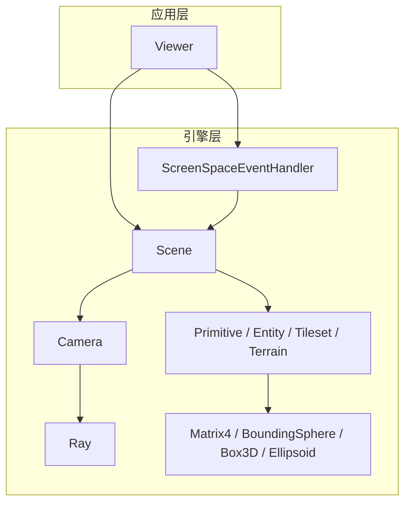
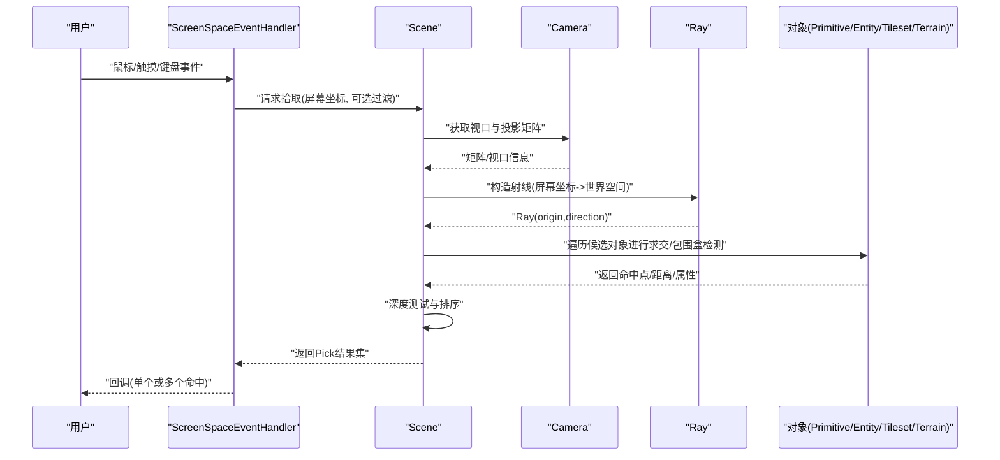
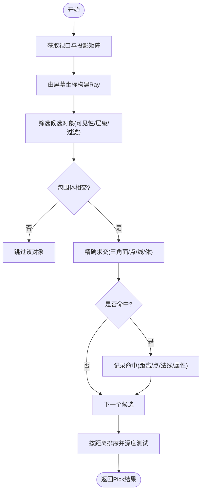
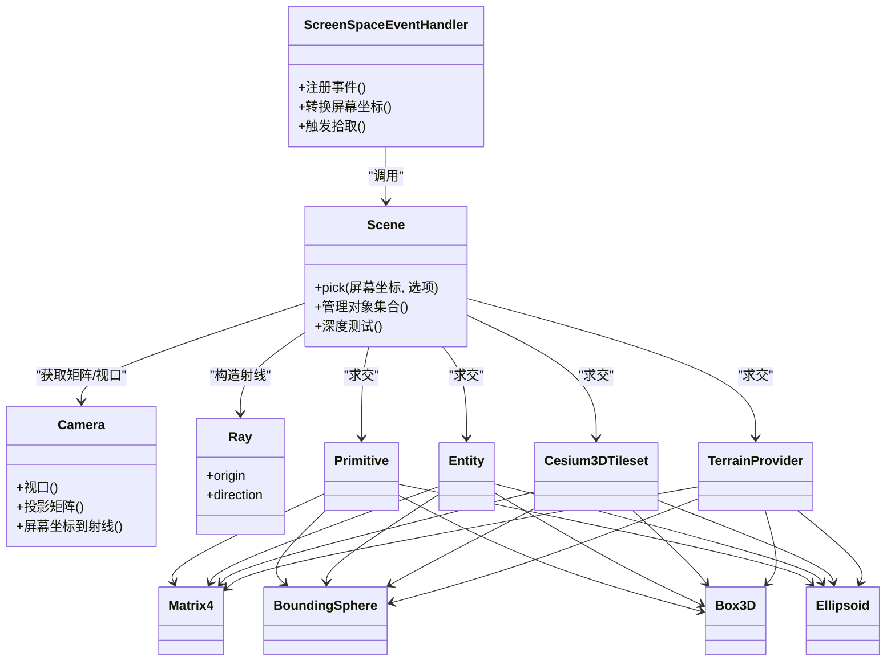

# 拾取系统API

<cite>
**本文引用的文件**   
- [pick.js](file://Specs/pick.js)
- [picking.spec.js](file://Specs/e2e/picking.spec.js)
- [createScene.js](file://Specs/createScene.js)
- [Viewer.js](file://packages/widgets/src/Viewer.js)
- [ScreenSpaceEventHandler.js](file://packages/engine/src/Scene/ScreenSpaceEventHandler.js)
- [Scene.js](file://packages/engine/src/Scene/Scene.js)
- [Camera.js](file://packages/engine/src/Camera/Camera.js)
- [Ray.js](file://packages/engine/src/Core/Ray.js)
- [Matrix4.js](file://packages/engine/src/Core/Matrix4.js)
- [BoundingSphere.js](file://packages/engine/src/Core/BoundingSphere.js)
- [Box3D.js](file://packages/engine/src/Core/Box3D.js)
- [Ellipsoid.js](file://packages/engine/src/Core/Ellipsoid.js)
- [Primitive.js](file://packages/engine/src/Scene/Primitive.js)
- [Entity.js](file://packages/engine/src/Scene/Entity.js)
- [Cesium3DTileset.js](file://packages/engine/src/Scene/Cesium3DTileset.js)
- [TerrainProvider.js](file://packages/engine/src/Terrain/TerrainProvider.js)
</cite>

## 目录
1. [简介](#简介)
2. [项目结构](#项目结构)
3. [核心组件](#核心组件)
4. [架构总览](#架构总览)
5. [详细组件分析](#详细组件分析)
6. [依赖关系分析](#依赖关系分析)
7. [性能考量](#性能考量)
8. [故障排查指南](#故障排查指南)
9. [结论](#结论)
10. [附录](#附录)

## 简介
本文件面向使用 Cesium 的开发者，系统化梳理“拾取系统”的 API 与实现要点，重点覆盖：
- Pick 类与射线拾取、深度测试、包围盒检测
- 拾取结果处理、多对象选择、拾取过滤
- 鼠标交互、触摸操作、键盘快捷键等用户输入处理方案
- 大规模场景下的拾取性能优化与常见问题解决方案

文档以源码为依据，结合端到端测试用例，提供从高层到代码级的完整说明。

## 项目结构
围绕拾取能力，仓库中与拾取相关的核心位置包括：
- 引擎层（packages/engine）：Scene、Camera、Ray、矩阵与几何体类型、Primitive、Entity、3D Tiles、地形等
- 小部件层（packages/widgets）：Viewer 封装了常用交互入口
- 测试与示例（Specs）：包含拾取相关 e2e 测试与辅助工具

图表来源
- [Viewer.js](file://packages/widgets/src/Viewer.js)
- [Scene.js](file://packages/engine/src/Scene/Scene.js)
- [ScreenSpaceEventHandler.js](file://packages/engine/src/Scene/ScreenSpaceEventHandler.js)
- [Camera.js](file://packages/engine/src/Camera/Camera.js)
- [Ray.js](file://packages/engine/src/Core/Ray.js)
- [Matrix4.js](file://packages/engine/src/Core/Matrix4.js)
- [BoundingSphere.js](file://packages/engine/src/Core/BoundingSphere.js)
- [Box3D.js](file://packages/engine/src/Core/Box3D.js)
- [Ellipsoid.js](file://packages/engine/src/Core/Ellipsoid.js)
- [Primitive.js](file://packages/engine/src/Scene/Primitive.js)
- [Entity.js](file://packages/engine/src/Scene/Entity.js)
- [Cesium3DTileset.js](file://packages/engine/src/Scene/Cesium3DTileset.js)
- [TerrainProvider.js](file://packages/engine/src/Terrain/TerrainProvider.js)

章节来源
- [Viewer.js](file://packages/widgets/src/Viewer.js)
- [Scene.js](file://packages/engine/src/Scene/Scene.js)
- [ScreenSpaceEventHandler.js](file://packages/engine/src/Scene/ScreenSpaceEventHandler.js)
- [Camera.js](file://packages/engine/src/Camera/Camera.js)
- [Ray.js](file://packages/engine/src/Core/Ray.js)
- [Matrix4.js](file://packages/engine/src/Core/Matrix4.js)
- [BoundingSphere.js](file://packages/engine/src/Core/BoundingSphere.js)
- [Box3D.js](file://packages/engine/src/Core/Box3D.js)
- [Ellipsoid.js](file://packages/engine/src/Core/Ellipsoid.js)
- [Primitive.js](file://packages/engine/src/Scene/Primitive.js)
- [Entity.js](file://packages/engine/src/Scene/Entity.js)
- [Cesium3DTileset.js](file://packages/engine/src/Scene/Cesium3DTileset.js)
- [TerrainProvider.js](file://packages/engine/src/Terrain/TerrainProvider.js)

## 核心组件
- ScreenSpaceEventHandler：统一接入鼠标、触摸、键盘事件，将屏幕坐标转换为世界空间射线，并触发 Scene 拾取流程
- Scene：提供 pick 接口，协调 Camera、Primitive/Entity/Tileset/Terrain 的命中计算与深度比较
- Camera：维护视口与投影矩阵，支持将屏幕坐标反投影为 Ray
- Ray：表示从相机出发的射线，用于与几何体求交
- Primitive/Entity/Tileset/Terrain：各自实现或参与命中检测，返回命中点、法线、距离、对象引用等
- 几何与矩阵类型（Matrix4、BoundingSphere、Box3D、Ellipsoid）：提供包围体与变换矩阵，加速早期剔除与精确求交

章节来源
- [ScreenSpaceEventHandler.js](file://packages/engine/src/Scene/ScreenSpaceEventHandler.js)
- [Scene.js](file://packages/engine/src/Scene/Scene.js)
- [Camera.js](file://packages/engine/src/Camera/Camera.js)
- [Ray.js](file://packages/engine/src/Core/Ray.js)
- [Primitive.js](file://packages/engine/src/Scene/Primitive.js)
- [Entity.js](file://packages/engine/src/Scene/Entity.js)
- [Cesium3DTileset.js](file://packages/engine/src/Scene/Cesium3DTileset.js)
- [TerrainProvider.js](file://packages/engine/src/Terrain/TerrainProvider.js)
- [Matrix4.js](file://packages/engine/src/Core/Matrix4.js)
- [BoundingSphere.js](file://packages/engine/src/Core/BoundingSphere.js)
- [Box3D.js](file://packages/engine/src/Core/Box3D.js)
- [Ellipsoid.js](file://packages/engine/src/Core/Ellipsoid.js)

## 架构总览
下图展示了从用户输入到最终拾取结果的典型调用链。

图表来源
- [ScreenSpaceEventHandler.js](file://packages/engine/src/Scene/ScreenSpaceEventHandler.js)
- [Scene.js](file://packages/engine/src/Scene/Scene.js)
- [Camera.js](file://packages/engine/src/Camera/Camera.js)
- [Ray.js](file://packages/engine/src/Core/Ray.js)
- [Primitive.js](file://packages/engine/src/Scene/Primitive.js)
- [Entity.js](file://packages/engine/src/Scene/Entity.js)
- [Cesium3DTileset.js](file://packages/engine/src/Scene/Cesium3DTileset.js)
- [TerrainProvider.js](file://packages/engine/src/Terrain/TerrainProvider.js)

## 详细组件分析

### 射线拾取与深度测试
- 屏幕坐标转射线：通过 Camera 的视口与投影矩阵，将像素坐标映射为世界空间 Ray
- 求交策略：优先使用对象的包围体（球体、轴对齐包围盒、旋转包围盒、椭球）做快速剔除；对候选对象执行精确求交
- 深度比较：同一像素可能命中多个对象，按距离相机远近排序，近者优先；可配置是否启用深度缓冲对比
- 命中数据结构：通常包含命中点、法线、纹理坐标、对象引用、图元索引、批号等

图表来源
- [Scene.js](file://packages/engine/src/Scene/Scene.js)
- [Camera.js](file://packages/engine/src/Camera/Camera.js)
- [Ray.js](file://packages/engine/src/Core/Ray.js)
- [BoundingSphere.js](file://packages/engine/src/Core/BoundingSphere.js)
- [Box3D.js](file://packages/engine/src/Core/Box3D.js)
- [Ellipsoid.js](file://packages/engine/src/Core/Ellipsoid.js)
- [Primitive.js](file://packages/engine/src/Scene/Primitive.js)
- [Entity.js](file://packages/engine/src/Scene/Entity.js)
- [Cesium3DTileset.js](file://packages/engine/src/Scene/Cesium3DTileset.js)
- [TerrainProvider.js](file://packages/engine/src/Terrain/TerrainProvider.js)

章节来源
- [Scene.js](file://packages/engine/src/Scene/Scene.js)
- [Camera.js](file://packages/engine/src/Camera/Camera.js)
- [Ray.js](file://packages/engine/src/Core/Ray.js)
- [BoundingSphere.js](file://packages/engine/src/Core/BoundingSphere.js)
- [Box3D.js](file://packages/engine/src/Core/Box3D.js)
- [Ellipsoid.js](file://packages/engine/src/Core/Ellipsoid.js)
- [Primitive.js](file://packages/engine/src/Scene/Primitive.js)
- [Entity.js](file://packages/engine/src/Scene/Entity.js)
- [Cesium3DTileset.js](file://packages/engine/src/Scene/Cesium3DTileset.js)
- [TerrainProvider.js](file://packages/engine/src/Terrain/TerrainProvider.js)

### 包围盒检测与加速
- 包围体层次：先对对象集合进行粗粒度包围体检测，再进入精细求交
- 常见包围体：球体、AABB、OBB、椭球；不同对象类型选择合适的包围体
- 变换矩阵：利用 Matrix4 将局部包围体变换到世界空间，再进行相交测试
- 批量与实例化：对于大量重复对象，优先使用批号/实例ID减少求交开销

章节来源
- [Matrix4.js](file://packages/engine/src/Core/Matrix4.js)
- [BoundingSphere.js](file://packages/engine/src/Core/BoundingSphere.js)
- [Box3D.js](file://packages/engine/src/Core/Box3D.js)
- [Ellipsoid.js](file://packages/engine/src/Core/Ellipsoid.js)
- [Primitive.js](file://packages/engine/src/Scene/Primitive.js)
- [Entity.js](file://packages/engine/src/Scene/Entity.js)
- [Cesium3DTileset.js](file://packages/engine/src/Scene/Cesium3DTileset.js)

### 拾取结果处理与多对象选择
- 单命中：默认返回最近命中对象及其命中信息
- 多命中：可配置返回所有命中或前N个命中，便于框选、多选
- 结果字段：命中点、法线、纹理坐标、对象引用、图元/顶点索引、批号、距离等
- 过滤条件：可按对象类型、图层、标签、自定义谓词过滤候选集合

章节来源
- [Scene.js](file://packages/engine/src/Scene/Scene.js)
- [Primitive.js](file://packages/engine/src/Scene/Primitive.js)
- [Entity.js](file://packages/engine/src/Scene/Entity.js)
- [Cesium3DTileset.js](file://packages/engine/src/Scene/Cesium3DTileset.js)

### 拾取过滤与优先级
- 可见性与层级：仅对可见且满足层级条件的对象进行拾取
- 类型过滤：限定只拾取特定类型（如仅实体、仅图元、仅地形）
- 自定义过滤：传入谓词函数，动态决定某对象是否参与本次拾取
- 优先级策略：当多个对象在同一像素命中时，依据距离、绘制顺序或自定义权重排序

章节来源
- [Scene.js](file://packages/engine/src/Scene/Scene.js)
- [Primitive.js](file://packages/engine/src/Scene/Primitive.js)
- [Entity.js](file://packages/engine/src/Scene/Entity.js)
- [Cesium3DTileset.js](file://packages/engine/src/Scene/Cesium3DTileset.js)

### 用户输入处理方案
- 鼠标交互：点击、双击、悬停、拖拽等事件绑定至 ScreenSpaceEventHandler，并在回调中调用 Scene.pick
- 触摸操作：多点触控、长按、滑动等事件同样通过 ScreenSpaceEventHandler 抽象，适配移动端
- 键盘快捷键：组合键控制拾取模式切换（单选/多选）、显示/隐藏命中高亮等
- 事件节流与防抖：在频繁移动/缩放时降低拾取频率，避免卡顿

章节来源
- [ScreenSpaceEventHandler.js](file://packages/engine/src/Scene/ScreenSpaceEventHandler.js)
- [Viewer.js](file://packages/widgets/src/Viewer.js)

### 端到端验证与测试
- e2e 测试覆盖了常见的拾取路径与边界情况，可用于理解 API 行为与回归保障
- 辅助工具 createScene 提供最小化的场景初始化，便于复现问题与编写新用例

章节来源
- [picking.spec.js](file://Specs/e2e/picking.spec.js)
- [createScene.js](file://Specs/createScene.js)

## 依赖关系分析
- ScreenSpaceEventHandler 依赖 Scene 提供的拾取接口
- Scene 依赖 Camera 生成 Ray，并调度 Primitive/Entity/Tileset/Terrain 的命中计算
- 各类对象依赖几何与矩阵类型进行包围体与精确求交
- Viewer 作为上层封装，简化事件注册与常用交互流程

图表来源
- [ScreenSpaceEventHandler.js](file://packages/engine/src/Scene/ScreenSpaceEventHandler.js)
- [Scene.js](file://packages/engine/src/Scene/Scene.js)
- [Camera.js](file://packages/engine/src/Camera/Camera.js)
- [Ray.js](file://packages/engine/src/Core/Ray.js)
- [Primitive.js](file://packages/engine/src/Scene/Primitive.js)
- [Entity.js](file://packages/engine/src/Scene/Entity.js)
- [Cesium3DTileset.js](file://packages/engine/src/Scene/Cesium3DTileset.js)
- [TerrainProvider.js](file://packages/engine/src/Terrain/TerrainProvider.js)
- [Matrix4.js](file://packages/engine/src/Core/Matrix4.js)
- [BoundingSphere.js](file://packages/engine/src/Core/BoundingSphere.js)
- [Box3D.js](file://packages/engine/src/Core/Box3D.js)
- [Ellipsoid.js](file://packages/engine/src/Core/Ellipsoid.js)

章节来源
- [ScreenSpaceEventHandler.js](file://packages/engine/src/Scene/ScreenSpaceEventHandler.js)
- [Scene.js](file://packages/engine/src/Scene/Scene.js)
- [Camera.js](file://packages/engine/src/Camera/Camera.js)
- [Ray.js](file://packages/engine/src/Core/Ray.js)
- [Primitive.js](file://packages/engine/src/Scene/Primitive.js)
- [Entity.js](file://packages/engine/src/Scene/Entity.js)
- [Cesium3DTileset.js](file://packages/engine/src/Scene/Cesium3DTileset.js)
- [TerrainProvider.js](file://packages/engine/src/Terrain/TerrainProvider.js)
- [Matrix4.js](file://packages/engine/src/Core/Matrix4.js)
- [BoundingSphere.js](file://packages/engine/src/Core/BoundingSphere.js)
- [Box3D.js](file://packages/engine/src/Core/Box3D.js)
- [Ellipsoid.js](file://packages/engine/src/Core/Ellipsoid.js)

## 性能考量
- 减少不必要的拾取：仅在必要事件（如点击）触发，移动/缩放时节流或禁用
- 缩小候选集：使用可见性、层级、类型过滤提前剔除无关对象
- 合理设置精度：对远距离目标放宽阈值，近距离提高精度
- 利用包围体：确保对象具备合理的包围体，避免过于松散的包围体导致误判
- 批量与实例化：对重复模型使用批号/实例ID，减少逐对象求交
- 分帧与异步：对复杂场景采用分帧处理，避免主线程阻塞
- 命中缓存：对静态对象可缓存命中结果，更新时再失效

[本节为通用指导，不直接分析具体文件]

## 故障排查指南
- 无命中结果：检查相机视口与投影矩阵是否正确；确认对象可见性与层级；验证屏幕坐标是否在有效范围内
- 命中错位：检查模型变换矩阵与坐标系一致性；确认是否启用了正确的深度测试
- 性能抖动：定位热点对象（过多三角面、松散包围体）；增加过滤条件；降低拾取频率
- 多对象冲突：调整命中排序策略；明确优先级规则；必要时限制返回数量
- 移动端异常：确认触摸事件坐标转换；注意多点触控与手势冲突

章节来源
- [picking.spec.js](file://Specs/e2e/picking.spec.js)
- [createScene.js](file://Specs/createScene.js)

## 结论
Cesium 的拾取系统以 ScreenSpaceEventHandler 为入口，Scene 为核心编排者，Camera 与 Ray 完成坐标与射线转换，再由各对象类型实现命中计算与深度比较。通过合理的过滤、包围体与性能策略，可在大规模场景中实现稳定高效的交互体验。建议结合端到端测试持续验证关键路径，并在实际项目中按需定制过滤与优先级策略。

[本节为总结性内容，不直接分析具体文件]

## 附录
- 参考测试用例与辅助工具：
  - 拾取端到端测试：[picking.spec.js](file://Specs/e2e/picking.spec.js)
  - 拾取辅助脚本：[pick.js](file://Specs/pick.js)
  - 场景创建辅助：[createScene.js](file://Specs/createScene.js)

章节来源
- [picking.spec.js](file://Specs/e2e/picking.spec.js)
- [pick.js](file://Specs/pick.js)
- [createScene.js](file://Specs/createScene.js)