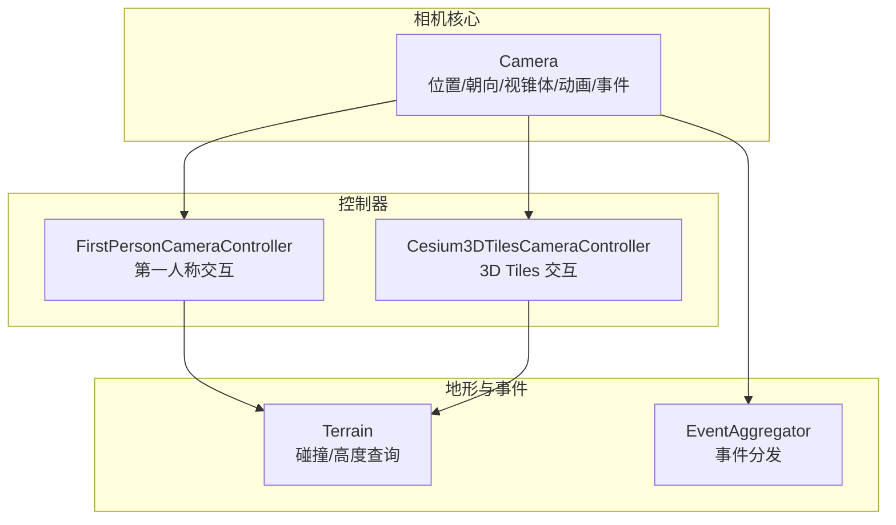
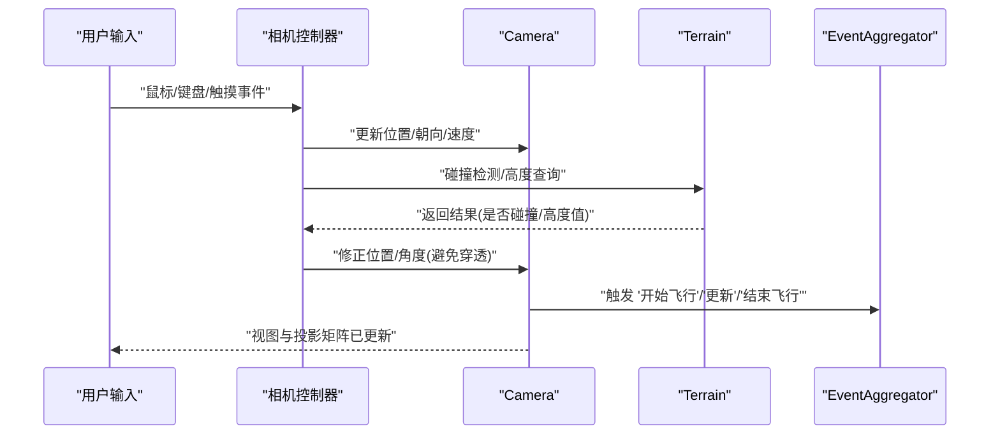
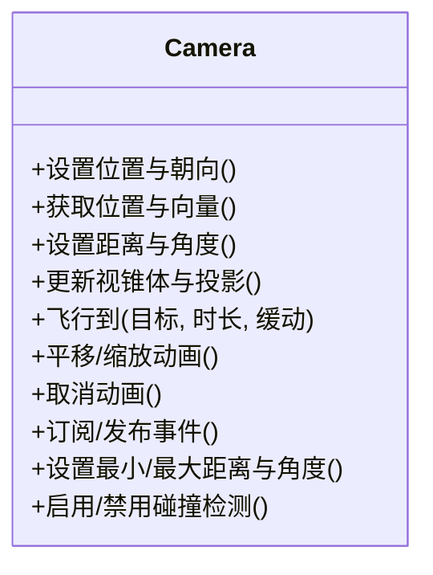
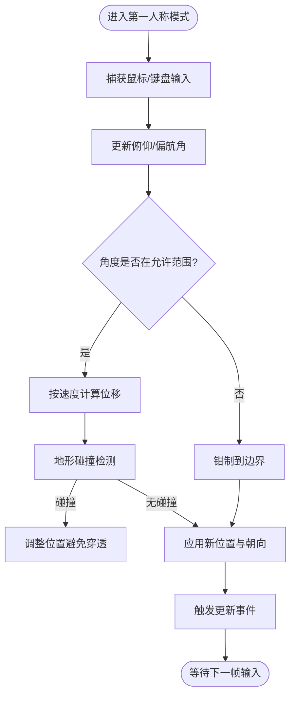
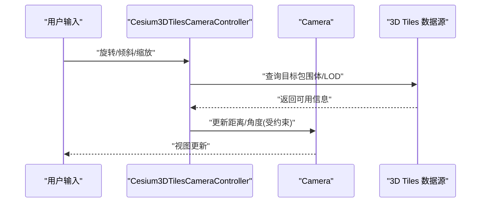
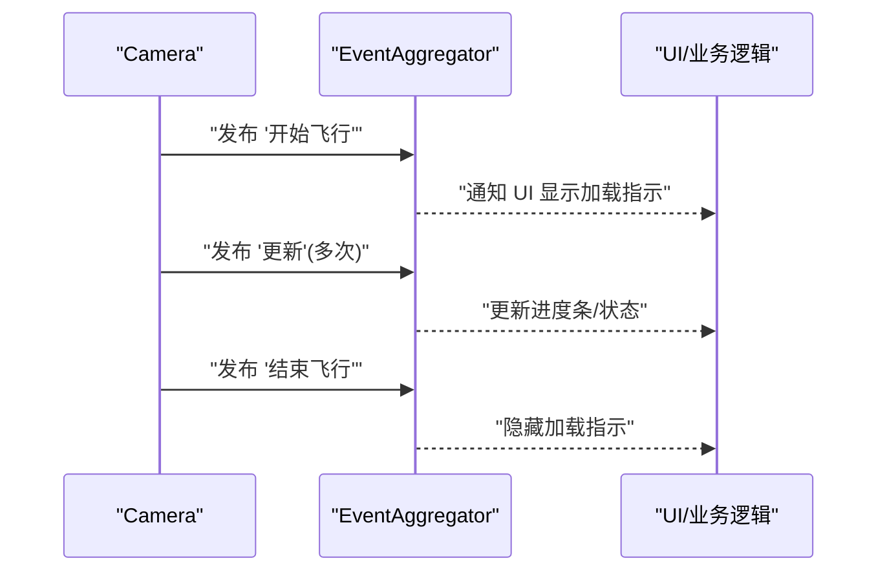
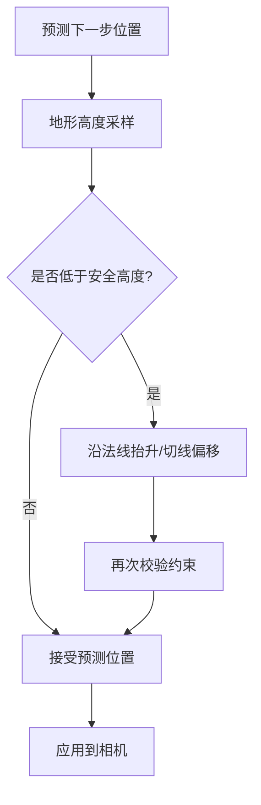
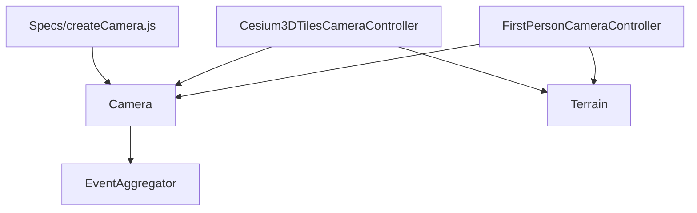

# 相机控制API

<cite>
**本文引用的文件**   
- [Camera.js](file://Source/Core/Camera.js)
- [FirstPersonCameraController.js](file://Source/Scene/FirstPersonCameraController.js)
- [Cesium3DTilesCameraController.js](file://Source/Scene/Cesium3DTilesCameraController.js)
- [Terrain.cs](file://Source/Scene/Terrain.cs)
- [EventAggregator.js](file://Source/Core/EventAggregator.js)
- [createCamera.js](file://Specs/createCamera.js)
</cite>

## 目录
1. [简介](#简介)
2. [项目结构](#项目结构)
3. [核心组件](#核心组件)
4. [架构总览](#架构总览)
5. [详细组件分析](#详细组件分析)
6. [依赖关系分析](#依赖关系分析)
7. [性能与内存优化](#性能与内存优化)
8. [故障排查指南](#故障排查指南)
9. [结论](#结论)
10. [附录：常用使用模式示例](#附录常用使用模式示例)

## 简介
本文件为 Cesium Camera 类的完整 API 文档，聚焦于相机的位置控制、视角调整、动画过渡、控制器类型（第一人称、3D Tiles、地形）、事件监听、碰撞检测等高级特性。同时提供相机状态管理、路径动画、跟随目标等使用模式的说明，并给出性能优化与内存管理的最佳实践建议。

## 项目结构
与相机控制相关的核心代码主要分布在以下模块：
- 相机核心：负责视图矩阵、投影矩阵、位置/朝向、视锥体、动画与事件等
- 相机控制器：封装不同交互模式（如第一人称、3D Tiles）的输入处理与约束
- 地形系统：参与碰撞检测与高度查询
- 事件聚合器：用于事件分发与订阅
- 测试辅助：创建相机实例与场景上下文，便于验证行为

图表来源
- [Camera.js:1-200](file://Source/Core/Camera.js#L1-L200)
- [FirstPersonCameraController.js:1-120](file://Source/Scene/FirstPersonCameraController.js#L1-L120)
- [Cesium3DTilesCameraController.js:1-120](file://Source/Scene/Cesium3DTilesCameraController.js#L1-L120)
- [Terrain.cs:1-120](file://Source/Scene/Terrain.cs#L1-L120)
- [EventAggregator.js:1-120](file://Source/Core/EventAggregator.js#L1-L120)

章节来源
- [Camera.js:1-200](file://Source/Core/Camera.js#L1-L200)
- [FirstPersonCameraController.js:1-120](file://Source/Scene/FirstPersonCameraController.js#L1-L120)
- [Cesium3DTilesCameraController.js:1-120](file://Source/Scene/Cesium3DTilesCameraController.js#L1-L120)
- [Terrain.cs:1-120](file://Source/Scene/Terrain.cs#L1-L120)
- [EventAggregator.js:1-120](file://Source/Core/EventAggregator.js#L1-L120)

## 核心组件
- Camera：提供位置与朝向设置、视锥体计算、投影矩阵更新、飞行/平移/缩放动画、事件触发等能力
- FirstPersonCameraController：实现第一人称视角的鼠标/键盘交互，支持俯仰、偏航、滚动及速度控制
- Cesium3DTilesCameraController：针对 3D Tiles 场景优化的相机控制器，包含距离限制、倾斜/旋转约束等
- Terrain：提供地形采样与碰撞检测接口，供控制器在移动时进行地面贴合与防穿透
- EventAggregator：统一的事件总线，Camera 通过其发布/订阅事件（如开始/结束飞行、更新等）

章节来源
- [Camera.js:1-200](file://Source/Core/Camera.js#L1-L200)
- [FirstPersonCameraController.js:1-120](file://Source/Scene/FirstPersonCameraController.js#L1-L120)
- [Cesium3DTilesCameraController.js:1-120](file://Source/Scene/Cesium3DTilesCameraController.js#L1-L120)
- [Terrain.cs:1-120](file://Source/Scene/Terrain.cs#L1-L120)
- [EventAggregator.js:1-120](file://Source/Core/EventAggregator.js#L1-L120)

## 架构总览
相机控制的整体流程如下：用户输入由控制器捕获，控制器根据当前模式（第一人称或 3D Tiles）对相机位置与朝向进行更新；在需要时调用地形系统进行碰撞检测与高度查询；相机在更新后触发相应事件，渲染管线读取最新视图与投影矩阵进行绘制。

图表来源
- [FirstPersonCameraController.js:1-120](file://Source/Scene/FirstPersonCameraController.js#L1-L120)
- [Cesium3DTilesCameraController.js:1-120](file://Source/Scene/Cesium3DTilesCameraController.js#L1-L120)
- [Camera.js:1-200](file://Source/Core/Camera.js#L1-L200)
- [Terrain.cs:1-120](file://Source/Scene/Terrain.cs#L1-L120)
- [EventAggregator.js:1-120](file://Source/Core/EventAggregator.js#L1-L120)

## 详细组件分析

### Camera 类 API 概览
- 位置与朝向
  - 设置位置与朝向（笛卡尔坐标与方向向量）
  - 获取当前位置、前向向量、上向量、右向量
  - 设置与获取距离、方位角、俯仰角、滚动角
- 视锥体与投影
  - 更新近/远裁剪面、视场角、宽高比
  - 获取视锥体边界球与平面集合
- 动画与过渡
  - 飞行到指定位置与朝向（含持续时间、缓动函数）
  - 平移与缩放动画（增量式）
  - 取消当前动画
- 事件
  - 订阅/发布“开始飞行”、“更新”、“结束飞行”等事件
- 状态与约束
  - 最小/最大距离、最小/最大俯仰角、滚动限制
  - 是否启用碰撞检测、碰撞半径

图表来源
- [Camera.js:1-200](file://Source/Core/Camera.js#L1-L200)

章节来源
- [Camera.js:1-200](file://Source/Core/Camera.js#L1-L200)

### FirstPersonCameraController（第一人称控制器）
- 交互模式
  - 鼠标拖拽控制俯仰与偏航
  - 滚轮控制距离或速度
  - 键盘 WASD 前后左右移动
- 速度与惯性
  - 可配置移动速度、加速度与阻尼
  - 支持惯性滑动与停止阈值
- 约束与碰撞
  - 最小/最大俯仰角限制
  - 可选的地形碰撞检测，防止穿地
- 事件
  - 在开始/结束交互时触发事件，便于 UI 联动

图表来源
- [FirstPersonCameraController.js:1-120](file://Source/Scene/FirstPersonCameraController.js#L1-L120)
- [Terrain.cs:1-120](file://Source/Scene/Terrain.cs#L1-L120)

章节来源
- [FirstPersonCameraController.js:1-120](file://Source/Scene/FirstPersonCameraController.js#L1-L120)
- [Terrain.cs:1-120](file://Source/Scene/Terrain.cs#L1-L120)

### Cesium3DTilesCameraController（3D Tiles 控制器）
- 交互模式
  - 围绕目标点旋转与倾斜
  - 缩放以改变观察距离
- 约束策略
  - 最小/最大观察距离
  - 倾斜角限制，避免倒置视角
- 性能优化
  - 基于 3D Tiles 包围体的可见性判断，减少不必要的更新
  - 批量更新相机状态，降低事件频率

图表来源
- [Cesium3DTilesCameraController.js:1-120](file://Source/Scene/Cesium3DTilesCameraController.js#L1-L120)
- [Camera.js:1-200](file://Source/Core/Camera.js#L1-L200)

章节来源
- [Cesium3DTilesCameraController.js:1-120](file://Source/Scene/Cesium3DTilesCameraController.js#L1-L120)
- [Camera.js:1-200](file://Source/Core/Camera.js#L1-L200)

### 事件系统与监听
- 事件类型
  - 开始飞行、更新、结束飞行
  - 控制器交互开始/结束
- 订阅与发布
  - 通过事件聚合器注册回调
  - 相机在关键阶段触发事件，确保 UI 与业务逻辑同步

图表来源
- [Camera.js:1-200](file://Source/Core/Camera.js#L1-L200)
- [EventAggregator.js:1-120](file://Source/Core/EventAggregator.js#L1-L120)

章节来源
- [Camera.js:1-200](file://Source/Core/Camera.js#L1-L200)
- [EventAggregator.js:1-120](file://Source/Core/EventAggregator.js#L1-L120)

### 碰撞检测与地形贴合
- 检测方式
  - 控制器在移动前预测相机位置
  - 调用地形系统进行高度查询与碰撞判定
- 修正策略
  - 若发生碰撞，将相机沿法线方向抬升或沿切线方向偏移
  - 保持最小安全距离，避免抖动

图表来源
- [FirstPersonCameraController.js:1-120](file://Source/Scene/FirstPersonCameraController.js#L1-L120)
- [Cesium3DTilesCameraController.js:1-120](file://Source/Scene/Cesium3DTilesCameraController.js#L1-L120)
- [Terrain.cs:1-120](file://Source/Scene/Terrain.cs#L1-L120)

章节来源
- [FirstPersonCameraController.js:1-120](file://Source/Scene/FirstPersonCameraController.js#L1-L120)
- [Cesium3DTilesCameraController.js:1-120](file://Source/Scene/Cesium3DTilesCameraController.js#L1-L120)
- [Terrain.cs:1-120](file://Source/Scene/Terrain.cs#L1-L120)

## 依赖关系分析
- Camera 依赖事件聚合器进行事件分发
- 控制器依赖 Camera 进行状态更新
- 控制器依赖 Terrain 进行碰撞检测与高度查询
- 测试辅助 createCamera 用于快速构建相机实例

图表来源
- [Camera.js:1-200](file://Source/Core/Camera.js#L1-L200)
- [FirstPersonCameraController.js:1-120](file://Source/Scene/FirstPersonCameraController.js#L1-L120)
- [Cesium3DTilesCameraController.js:1-120](file://Source/Scene/Cesium3DTilesCameraController.js#L1-L120)
- [Terrain.cs:1-120](file://Source/Scene/Terrain.cs#L1-L120)
- [EventAggregator.js:1-120](file://Source/Core/EventAggregator.js#L1-L120)
- [createCamera.js:1-120](file://Specs/createCamera.js#L1-L120)

章节来源
- [Camera.js:1-200](file://Source/Core/Camera.js#L1-L200)
- [FirstPersonCameraController.js:1-120](file://Source/Scene/FirstPersonCameraController.js#L1-L120)
- [Cesium3DTilesCameraController.js:1-120](file://Source/Scene/Cesium3DTilesCameraController.js#L1-L120)
- [Terrain.cs:1-120](file://Source/Scene/Terrain.cs#L1-L120)
- [EventAggregator.js:1-120](file://Source/Core/EventAggregator.js#L1-L120)
- [createCamera.js:1-120](file://Specs/createCamera.js#L1-L120)

## 性能与内存优化
- 合理设置最小/最大距离与俯仰角，避免极端视角导致的重绘开销
- 使用批量更新策略，减少频繁的事件触发与矩阵重建
- 在大规模 3D Tiles 场景中，结合控制器与数据源的可见性判断，降低无效更新
- 谨慎开启碰撞检测，必要时采用更宽松的碰撞半径以减少采样次数
- 复用对象与缓存中间结果，避免每帧分配大量临时对象

[本节为通用指导，不直接分析具体文件]

## 故障排查指南
- 相机无法移动或视角异常
  - 检查控制器约束（最小/最大距离、俯仰角）是否过严
  - 确认事件订阅是否正确，是否存在重复绑定导致冲突
- 碰撞检测导致抖动
  - 调整碰撞半径与安全距离
  - 降低地形采样频率或放宽约束
- 动画卡顿
  - 检查动画时长与缓动函数是否合理
  - 减少每帧事件数量，合并更新

章节来源
- [Camera.js:1-200](file://Source/Core/Camera.js#L1-L200)
- [FirstPersonCameraController.js:1-120](file://Source/Scene/FirstPersonCameraController.js#L1-L120)
- [Cesium3DTilesCameraController.js:1-120](file://Source/Scene/Cesium3DTilesCameraController.js#L1-L120)
- [EventAggregator.js:1-120](file://Source/Core/EventAggregator.js#L1-L120)

## 结论
Camera 及其控制器构成了 Cesium 中相机控制的核心。通过合理的约束、事件机制与碰撞检测，可以实现稳定且高性能的交互体验。在实际应用中，应根据场景特点选择合适的控制器与参数，并结合性能优化策略以获得流畅的用户体验。

[本节为总结，不直接分析具体文件]

## 附录：常用使用模式示例
- 相机状态管理
  - 保存与恢复相机位置与朝向
  - 切换控制器类型（第一人称/3D Tiles）时重置约束
- 路径动画
  - 定义关键帧位置与朝向序列
  - 使用缓动函数平滑过渡
- 跟随目标
  - 将相机朝向与距离绑定到动态目标
  - 在目标移动时增量更新相机状态

[本节为概念性示例，不直接分析具体文件]