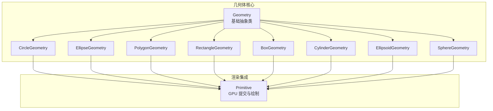
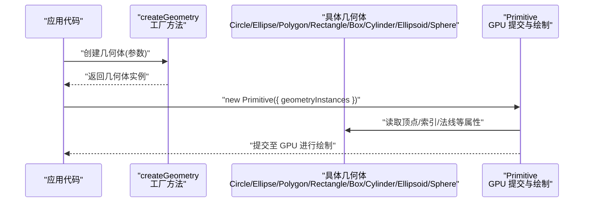
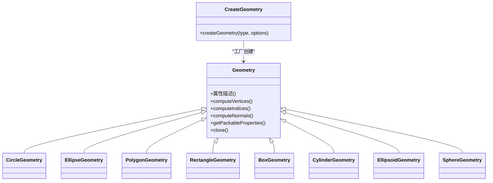
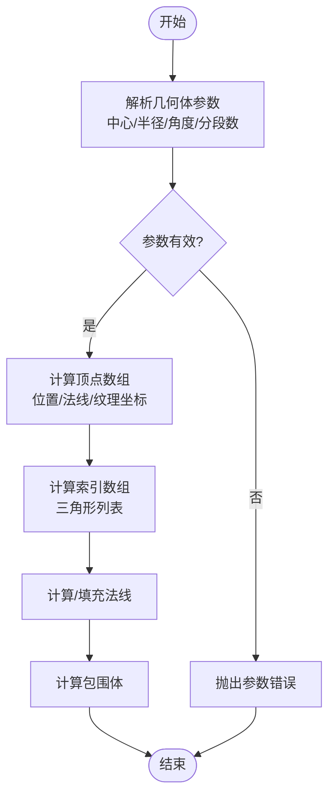
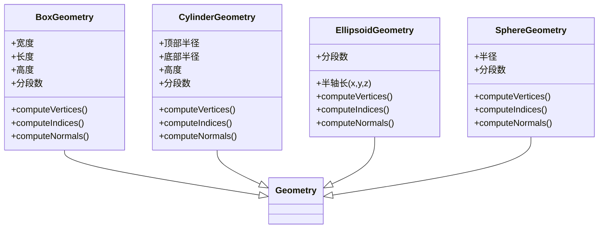
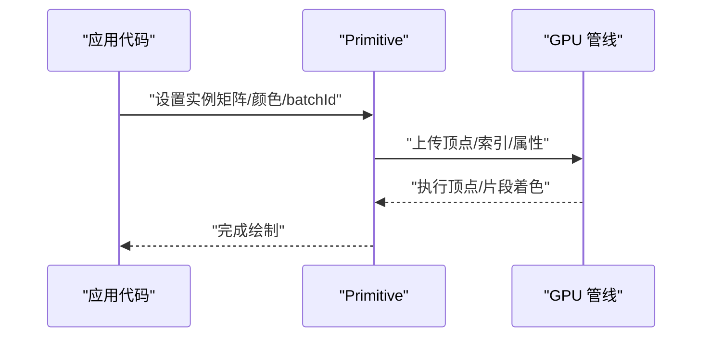
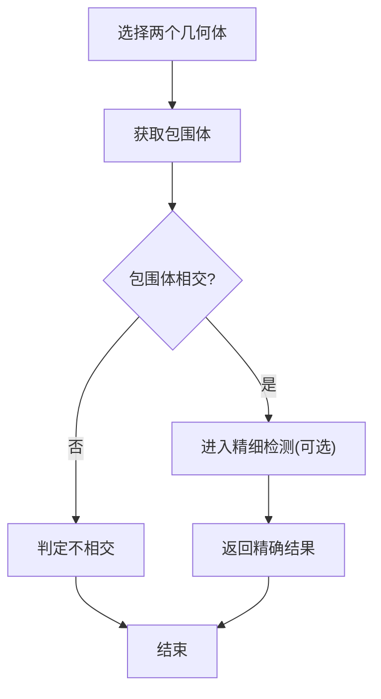
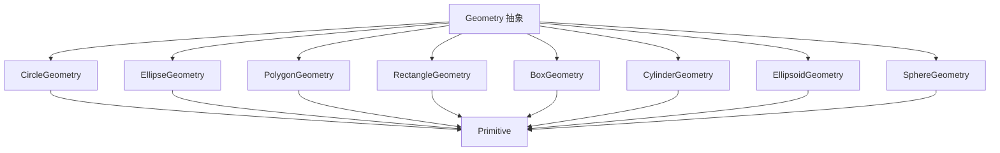

# 几何体类型API

<cite>
**本文引用的文件**   
- [Geometry.js](file://Source/Core/Geometry.js)
- [CircleGeometry.js](file://Source/Core/CircleGeometry.js)
- [EllipseGeometry.js](file://Source/Core/EllipseGeometry.js)
- [PolygonGeometry.js](file://Source/Core/PolygonGeometry.js)
- [RectangleGeometry.js](file://Source/Core/RectangleGeometry.js)
- [BoxGeometry.js](file://Source/Core/BoxGeometry.js)
- [CylinderGeometry.js](file://Source/Core/CylinderGeometry.js)
- [EllipsoidGeometry.js](file://Source/Core/EllipsoidGeometry.js)
- [SphereGeometry.js](file://Source/Core/SphereGeometry.js)
- [createGeometry.js](file://Source/Core/createGeometry.js)
- [Primitive.js](file://Source/Core/Primitive.js)
</cite>

## 目录
1. [简介](#简介)
2. [项目结构](#项目结构)
3. [核心组件](#核心组件)
4. [架构总览](#架构总览)
5. [详细组件分析](#详细组件分析)
6. [依赖分析](#依赖分析)
7. [性能考虑](#性能考虑)
8. [故障排查指南](#故障排查指南)
9. [结论](#结论)
10. [附录](#附录)

## 简介
本文件面向使用 Cesium 的开发者，系统化梳理 Cesium 几何体（Geometry）体系的设计模式、扩展方式与 API 用法。内容覆盖：
- 基础几何体类 Geometry 的设计模式与扩展点
- 2D 几何体：圆形 Circle、椭圆 Ellipse、多边形 Polygon、矩形 Rectangle 的创建参数与渲染选项
- 3D 几何体：立方体 Box、圆柱 Cylinder、椭球 Ellipsoid、球体 Sphere 等创建参数与渲染选项
- 底层实现细节：顶点数据、索引数据、法向量计算
- 复杂几何体组合、几何体变换、碰撞检测的实际应用示例

## 项目结构
Cesium 的几何体位于 Source/Core 目录中，采用“按功能模块组织”的方式，每个几何体类型一个独立文件，便于维护与扩展。核心入口包括：
- 基础抽象类：定义几何体的通用接口与生命周期
- 具体几何体实现：分别实现各自的顶点/索引/法线生成逻辑
- 工厂方法：统一创建几何体实例并支持克隆与打包/解包
- 渲染集成：通过 Primitive 将几何体提交到 GPU 进行绘制

图表来源
- [Geometry.js:1-200](file://Source/Core/Geometry.js#L1-L200)
- [CircleGeometry.js:1-200](file://Source/Core/CircleGeometry.js#L1-L200)
- [EllipseGeometry.js:1-200](file://Source/Core/EllipseGeometry.js#L1-L200)
- [PolygonGeometry.js:1-200](file://Source/Core/PolygonGeometry.js#L1-L200)
- [RectangleGeometry.js:1-200](file://Source/Core/RectangleGeometry.js#L1-L200)
- [BoxGeometry.js:1-200](file://Source/Core/BoxGeometry.js#L1-L200)
- [CylinderGeometry.js:1-200](file://Source/Core/CylinderGeometry.js#L1-L200)
- [EllipsoidGeometry.js:1-200](file://Source/Core/EllipsoidGeometry.js#L1-L200)
- [SphereGeometry.js:1-200](file://Source/Core/SphereGeometry.js#L1-L200)
- [Primitive.js:1-200](file://Source/Core/Primitive.js#L1-L200)

章节来源
- [Geometry.js:1-200](file://Source/Core/Geometry.js#L1-L200)
- [Primitive.js:1-200](file://Source/Core/Primitive.js#L1-L200)

## 核心组件
本节聚焦基础几何体类 Geometry 的设计模式与扩展方式，以及各几何体类型的公共能力。

- 设计模式
  - 抽象基类：Geometry 定义了所有几何体必须实现的接口，如属性描述、顶点/索引/法线数据的生成、包围体计算、克隆与打包/解包等。
  - 工厂方法：提供统一的创建入口，内部根据类型分发到具体几何体实现，简化调用方复杂度。
  - 不可变性与克隆：几何体通常以不可变对象形式存在，修改需通过克隆或更新器；这有利于缓存与批量渲染优化。
  - 打包/解包：为网络传输与持久化提供高效序列化机制。

- 扩展方式
  - 自定义几何体：继承 Geometry 抽象类，实现必要的接口（例如 computeVertices、computeIndices、computeNormals、getPackableProperties 等），并在工厂注册新类型。
  - 动态更新：结合几何体更新器（GeometryUpdater）在每帧按需更新顶点/索引，避免重建开销。
  - 材质与渲染：几何体本身不包含着色逻辑，材质与渲染由上层 Primitive 与 ShaderProgram 负责，几何体仅输出顶点属性（位置、法线、纹理坐标、切线等）。

- 关键数据结构
  - 顶点属性：位置（vec3）、法线（vec3）、纹理坐标（vec2）、切线（vec3）、位切线（vec3）、颜色（rgba）等
  - 索引数据：Uint16Array 或 Uint32Array，用于三角形列表
  - 包围体：BoundingSphere/BoundingBox，用于视锥剔除与碰撞预检

章节来源
- [Geometry.js:1-200](file://Source/Core/Geometry.js#L1-L200)
- [createGeometry.js:1-200](file://Source/Core/createGeometry.js#L1-L200)

## 架构总览
下图展示从几何体创建到渲染的关键流程，体现 Geometry 与 Primitive 的协作关系。

图表来源
- [createGeometry.js:1-200](file://Source/Core/createGeometry.js#L1-L200)
- [CircleGeometry.js:1-200](file://Source/Core/CircleGeometry.js#L1-L200)
- [EllipseGeometry.js:1-200](file://Source/Core/EllipseGeometry.js#L1-L200)
- [PolygonGeometry.js:1-200](file://Source/Core/PolygonGeometry.js#L1-L200)
- [RectangleGeometry.js:1-200](file://Source/Core/RectangleGeometry.js#L1-L200)
- [BoxGeometry.js:1-200](file://Source/Core/BoxGeometry.js#L1-L200)
- [CylinderGeometry.js:1-200](file://Source/Core/CylinderGeometry.js#L1-L200)
- [EllipsoidGeometry.js:1-200](file://Source/Core/EllipsoidGeometry.js#L1-L200)
- [SphereGeometry.js:1-200](file://Source/Core/SphereGeometry.js#L1-L200)
- [Primitive.js:1-200](file://Source/Core/Primitive.js#L1-L200)

## 详细组件分析

### 基础几何体类 Geometry 与工厂 createGeometry
- 职责
  - 定义几何体通用接口与生命周期
  - 提供工厂方法 createGeometry，按类型创建具体几何体实例
- 扩展点
  - 新增几何体类型时，实现对应 compute* 方法与属性描述，并在工厂注册
- 典型流程
  - 构造阶段：解析参数、验证输入、初始化属性
  - 计算阶段：生成顶点、索引、法线、纹理坐标、包围体
  - 运行阶段：供 Primitive 读取并提交 GPU

图表来源
- [Geometry.js:1-200](file://Source/Core/Geometry.js#L1-L200)
- [createGeometry.js:1-200](file://Source/Core/createGeometry.js#L1-L200)

章节来源
- [Geometry.js:1-200](file://Source/Core/Geometry.js#L1-L200)
- [createGeometry.js:1-200](file://Source/Core/createGeometry.js#L1-L200)

### 2D 几何体：Circle、Ellipse、Polygon、Rectangle
- 共同特性
  - 基于二维平面或地理投影构建
  - 支持分段数控制曲面精度
  - 可生成法线（通常为固定方向）
- 创建参数要点
  - 中心点/边界框/半径/角度范围/分段数等
  - 是否启用深度测试、是否翻转法线、是否生成纹理坐标
- 渲染选项
  - 与材质配合，支持透明/不透明混合
  - 可通过 Primitive 的 instance 属性设置矩阵变换、颜色、批处理 ID

图表来源
- [CircleGeometry.js:1-200](file://Source/Core/CircleGeometry.js#L1-L200)
- [EllipseGeometry.js:1-200](file://Source/Core/EllipseGeometry.js#L1-L200)
- [PolygonGeometry.js:1-200](file://Source/Core/PolygonGeometry.js#L1-L200)
- [RectangleGeometry.js:1-200](file://Source/Core/RectangleGeometry.js#L1-L200)

章节来源
- [CircleGeometry.js:1-200](file://Source/Core/CircleGeometry.js#L1-L200)
- [EllipseGeometry.js:1-200](file://Source/Core/EllipseGeometry.js#L1-L200)
- [PolygonGeometry.js:1-200](file://Source/Core/PolygonGeometry.js#L1-L200)
- [RectangleGeometry.js:1-200](file://Source/Core/RectangleGeometry.js#L1-L200)

### 3D 几何体：Box、Cylinder、Ellipsoid、Sphere
- 共同特性
  - 三维空间中的标准几何体
  - 支持分段数控制曲率精度
  - 自动生成法线与纹理坐标
- 创建参数要点
  - 尺寸/半径/高度/分段数/起始角/终止角等
  - 是否双面渲染、是否生成切线/位切线
- 渲染选项
  - 与材质系统无缝集成，支持 PBR、透明度、描边等
  - 通过实例矩阵实现批量变换与动画

图表来源
- [BoxGeometry.js:1-200](file://Source/Core/BoxGeometry.js#L1-L200)
- [CylinderGeometry.js:1-200](file://Source/Core/CylinderGeometry.js#L1-L200)
- [EllipsoidGeometry.js:1-200](file://Source/Core/EllipsoidGeometry.js#L1-L200)
- [SphereGeometry.js:1-200](file://Source/Core/SphereGeometry.js#L1-L200)

章节来源
- [BoxGeometry.js:1-200](file://Source/Core/BoxGeometry.js#L1-L200)
- [CylinderGeometry.js:1-200](file://Source/Core/CylinderGeometry.js#L1-L200)
- [EllipsoidGeometry.js:1-200](file://Source/Core/EllipsoidGeometry.js#L1-L200)
- [SphereGeometry.js:1-200](file://Source/Core/SphereGeometry.js#L1-L200)

### 几何体变换与组合
- 变换
  - 通过实例矩阵对几何体进行平移、旋转、缩放
  - 支持局部坐标系与世界坐标系的转换
- 组合
  - 多个几何体实例合并为单个 Primitive，减少 draw call
  - 使用 batchId 区分不同几何体实例，便于着色器内差异化处理

图表来源
- [Primitive.js:1-200](file://Source/Core/Primitive.js#L1-L200)

章节来源
- [Primitive.js:1-200](file://Source/Core/Primitive.js#L1-L200)

### 碰撞检测与包围体
- 包围体
  - 每个几何体提供包围球/包围盒，用于快速剔除与碰撞预检
- 碰撞流程
  - 先进行粗略包围体相交测试
  - 再进入精细网格级碰撞（可选）

图表来源
- [BoxGeometry.js:1-200](file://Source/Core/BoxGeometry.js#L1-L200)
- [CylinderGeometry.js:1-200](file://Source/Core/CylinderGeometry.js#L1-L200)
- [EllipsoidGeometry.js:1-200](file://Source/Core/EllipsoidGeometry.js#L1-L200)
- [SphereGeometry.js:1-200](file://Source/Core/SphereGeometry.js#L1-L200)

章节来源
- [BoxGeometry.js:1-200](file://Source/Core/BoxGeometry.js#L1-L200)
- [CylinderGeometry.js:1-200](file://Source/Core/CylinderGeometry.js#L1-L200)
- [EllipsoidGeometry.js:1-200](file://Source/Core/EllipsoidGeometry.js#L1-L200)
- [SphereGeometry.js:1-200](file://Source/Core/SphereGeometry.js#L1-L200)

## 依赖分析
- 组件耦合
  - 几何体之间无直接依赖，均依赖 Geometry 抽象接口
  - 渲染层依赖 Primitive，几何体作为数据提供者
- 外部依赖
  - 数学库（向量/矩阵运算）
  - WebGL/GPU 管线（通过 Primitive 封装）

图表来源
- [Geometry.js:1-200](file://Source/Core/Geometry.js#L1-L200)
- [CircleGeometry.js:1-200](file://Source/Core/CircleGeometry.js#L1-L200)
- [EllipseGeometry.js:1-200](file://Source/Core/EllipseGeometry.js#L1-L200)
- [PolygonGeometry.js:1-200](file://Source/Core/PolygonGeometry.js#L1-L200)
- [RectangleGeometry.js:1-200](file://Source/Core/RectangleGeometry.js#L1-L200)
- [BoxGeometry.js:1-200](file://Source/Core/BoxGeometry.js#L1-L200)
- [CylinderGeometry.js:1-200](file://Source/Core/CylinderGeometry.js#L1-L200)
- [EllipsoidGeometry.js:1-200](file://Source/Core/EllipsoidGeometry.js#L1-L200)
- [SphereGeometry.js:1-200](file://Source/Core/SphereGeometry.js#L1-L200)
- [Primitive.js:1-200](file://Source/Core/Primitive.js#L1-L200)

章节来源
- [Geometry.js:1-200](file://Source/Core/Geometry.js#L1-L200)
- [Primitive.js:1-200](file://Source/Core/Primitive.js#L1-L200)

## 性能考虑
- 分段数控制
  - 合理设置分段数，平衡视觉质量与顶点数量
- 实例化与批处理
  - 将相同材质的几何体合并为单个 Primitive，减少 draw call
- 内存与带宽
  - 使用合适的索引类型（Uint16/Uint32）
  - 避免频繁重建几何体，优先使用更新器
- 剔除与LOD
  - 利用包围体进行视锥剔除与距离 LOD

[本节为通用指导，无需特定文件引用]

## 故障排查指南
- 常见错误
  - 参数无效：检查半径、尺寸、分段数是否为正数且符合范围
  - 法线异常：确认是否启用了正确的法线生成与双面渲染
  - 渲染异常：检查材质配置与 Primitive 的实例属性
- 调试建议
  - 打印几何体属性描述与顶点/索引数量
  - 逐步关闭材质特性定位问题
  - 使用包围体可视化辅助判断可见性

章节来源
- [CircleGeometry.js:1-200](file://Source/Core/CircleGeometry.js#L1-L200)
- [EllipseGeometry.js:1-200](file://Source/Core/EllipseGeometry.js#L1-L200)
- [PolygonGeometry.js:1-200](file://Source/Core/PolygonGeometry.js#L1-L200)
- [RectangleGeometry.js:1-200](file://Source/Core/RectangleGeometry.js#L1-L200)
- [BoxGeometry.js:1-200](file://Source/Core/BoxGeometry.js#L1-L200)
- [CylinderGeometry.js:1-200](file://Source/Core/CylinderGeometry.js#L1-L200)
- [EllipsoidGeometry.js:1-200](file://Source/Core/EllipsoidGeometry.js#L1-L200)
- [SphereGeometry.js:1-200](file://Source/Core/SphereGeometry.js#L1-L200)

## 结论
Cesium 的几何体体系以 Geometry 抽象为核心，通过工厂方法统一创建，并由 Primitive 提交至 GPU 渲染。该设计具备良好的可扩展性与高性能表现。开发者可按需扩展自定义几何体，并通过实例矩阵与批处理实现复杂场景的高效渲染。

[本节为总结性内容，无需特定文件引用]

## 附录
- 实践示例路径
  - 2D 几何体创建与渲染：参考各几何体文件的注释与示例
  - 3D 几何体创建与材质：参考各几何体文件的注释与示例
  - 几何体变换与组合：参考 Primitive 的使用方式
  - 碰撞检测：参考包围体与几何体属性的使用方法

[本节为指引性内容，无需特定文件引用]