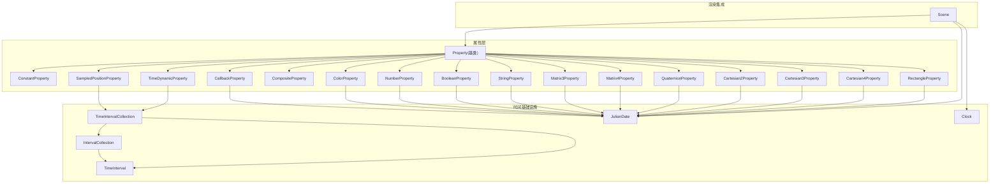
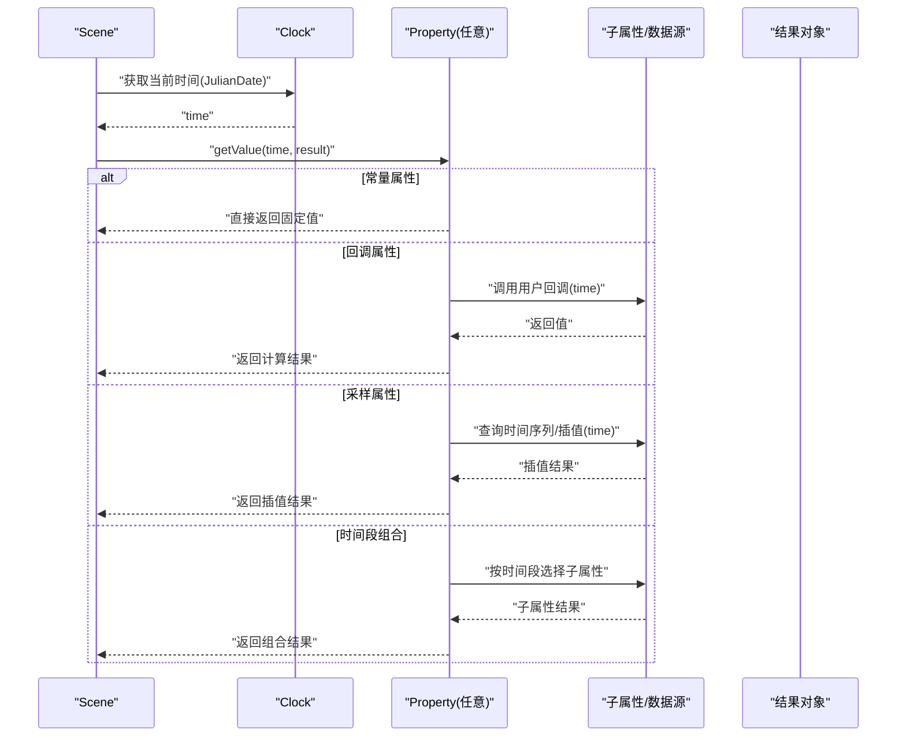
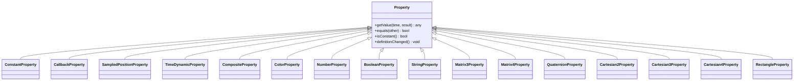
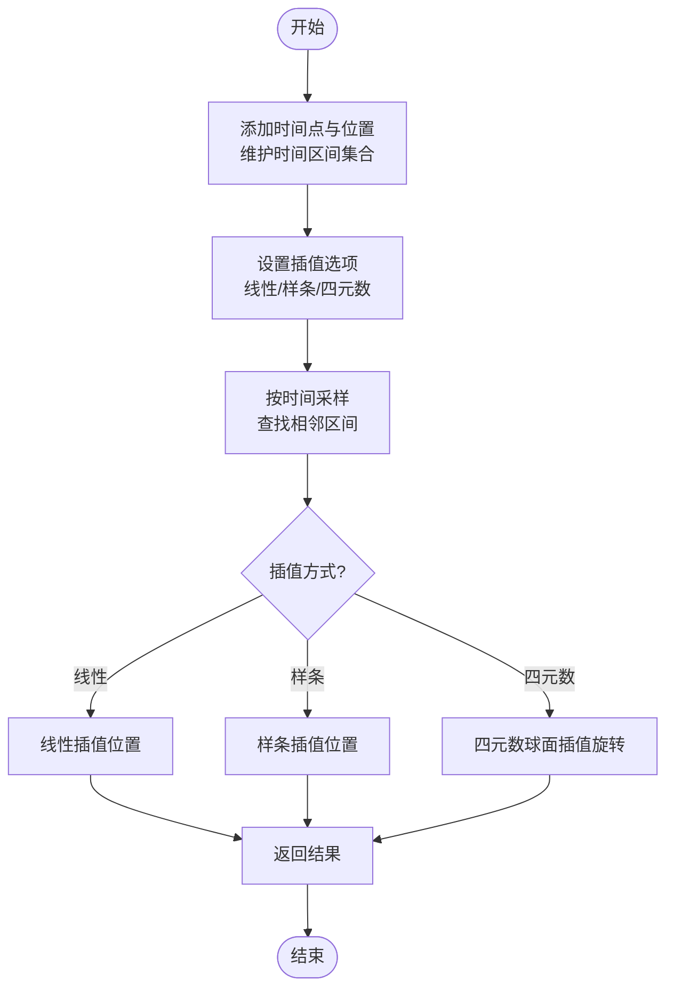
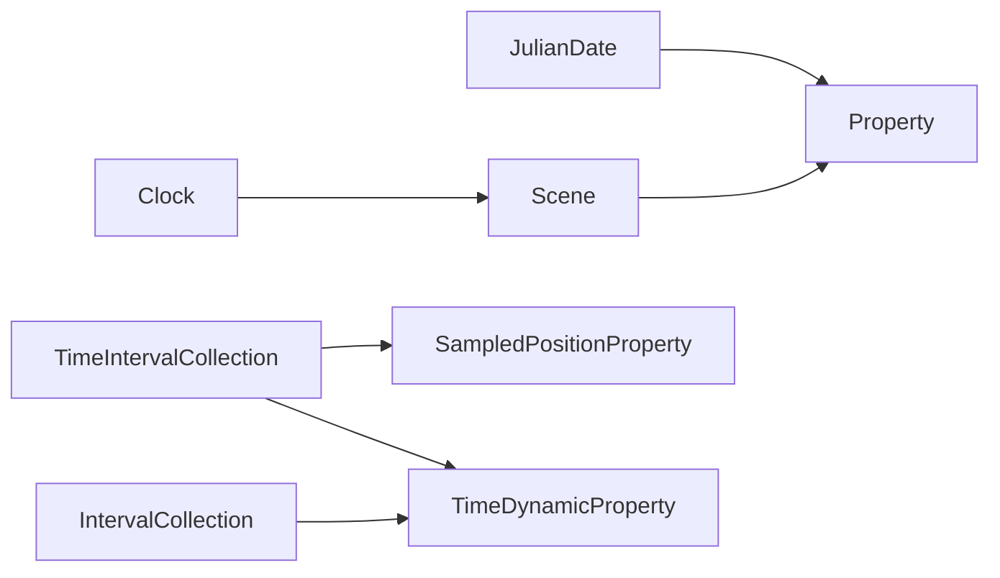

# 动画属性API

<cite>
**本文引用的文件**   
- [Property.js](file://Source/Core/Property.js)
- [ConstantProperty.js](file://Source/Core/ConstantProperty.js)
- [CallbackProperty.js](file://Source/Core/CallbackProperty.js)
- [SampledPositionProperty.js](file://Source/Core/SampledPositionProperty.js)
- [TimeDynamicProperty.js](file://Source/Core/TimeDynamicProperty.js)
- [CompositeProperty.js](file://Source/Core/CompositeProperty.js)
- [ColorProperty.js](file://Source/Core/ColorProperty.js)
- [NumberProperty.js](file://Source/Core/NumberProperty.js)
- [BooleanProperty.js](file://Source/Core/BooleanProperty.js)
- [StringProperty.js](file://Source/Core/StringProperty.js)
- [Matrix3Property.js](file://Source/Core/Matrix3Property.js)
- [Matrix4Property.js](file://Source/Core/Matrix4Property.js)
- [QuaternionProperty.js](file://Source/Core/QuaternionProperty.js)
- [Cartesian2Property.js](file://Source/Core/Cartesian2Property.js)
- [Cartesian3Property.js](file://Source/Core/Cartesian3Property.js)
- [Cartesian4Property.js](file://Source/Core/Cartesian4Property.js)
- [RectangleProperty.js](file://Source/Core/RectangleProperty.js)
- [IntervalCollection.js](file://Source/Core/IntervalCollection.js)
- [TimeInterval.js](file://Source/Core/TimeInterval.js)
- [TimeIntervalCollection.js](file://Source/Core/TimeIntervalCollection.js)
- [JulianDate.js](file://Source/Core/JulianDate.js)
- [Clock.js](file://Source/Core/Clock.js)
- [Scene.js](file://Source/Core/Scene.js)
</cite>

## 目录
1. [简介](#简介)
2. [项目结构](#项目结构)
3. [核心组件](#核心组件)
4. [架构总览](#架构总览)
5. [详细组件分析](#详细组件分析)
6. [依赖关系分析](#依赖关系分析)
7. [性能考虑](#性能考虑)
8. [故障排查指南](#故障排查指南)
9. [结论](#结论)
10. [附录](#附录)

## 简介
本文件面向Cesium的动画属性系统，系统性阐述 Property 基类及其派生类型在时间动态与属性绑定方面的机制。内容覆盖：
- 属性绑定与时间采样模型（基于 JulianDate）
- 常用属性类型的使用场景与配置要点（如 ConstantProperty、CallbackProperty、SampledPositionProperty 等）
- 插值算法与采样策略（线性、样条、四元数球面插值等）
- 性能优化建议（缓存、批量更新、区间裁剪）
- 常见动画效果实现路径（位置动画、颜色渐变、数值变化）

## 项目结构
动画属性系统位于 Source/Core 下，围绕 Property 抽象基类构建，提供多种具体属性类型以支持不同数据维度与时变行为。时间相关基础设施由 IntervalCollection、TimeInterval、JulianDate、Clock 等模块支撑；渲染管线通过 Scene 将属性结果应用到几何体、材质或实体。

图表来源
- [Property.js:1-200](file://Source/Core/Property.js#L1-L200)
- [ConstantProperty.js:1-200](file://Source/Core/ConstantProperty.js#L1-L200)
- [CallbackProperty.js:1-200](file://Source/Core/CallbackProperty.js#L1-L200)
- [SampledPositionProperty.js:1-200](file://Source/Core/SampledPositionProperty.js#L1-L200)
- [TimeDynamicProperty.js:1-200](file://Source/Core/TimeDynamicProperty.js#L1-L200)
- [CompositeProperty.js:1-200](file://Source/Core/CompositeProperty.js#L1-L200)
- [ColorProperty.js:1-200](file://Source/Core/ColorProperty.js#L1-L200)
- [NumberProperty.js:1-200](file://Source/Core/NumberProperty.js#L1-L200)
- [BooleanProperty.js:1-200](file://Source/Core/BooleanProperty.js#L1-L200)
- [StringProperty.js:1-200](file://Source/Core/StringProperty.js#L1-L200)
- [Matrix3Property.js:1-200](file://Source/Core/Matrix3Property.js#L1-L200)
- [Matrix4Property.js:1-200](file://Source/Core/Matrix4Property.js#L1-L200)
- [QuaternionProperty.js:1-200](file://Source/Core/QuaternionProperty.js#L1-L200)
- [Cartesian2Property.js:1-200](file://Source/Core/Cartesian2Property.js#L1-L200)
- [Cartesian3Property.js:1-200](file://Source/Core/Cartesian3Property.js#L1-L200)
- [Cartesian4Property.js:1-200](file://Source/Core/Cartesian4Property.js#L1-L200)
- [RectangleProperty.js:1-200](file://Source/Core/RectangleProperty.js#L1-L200)
- [IntervalCollection.js:1-200](file://Source/Core/IntervalCollection.js#L1-L200)
- [TimeInterval.js:1-200](file://Source/Core/TimeInterval.js#L1-L200)
- [TimeIntervalCollection.js:1-200](file://Source/Core/TimeIntervalCollection.js#L1-L200)
- [JulianDate.js:1-200](file://Source/Core/JulianDate.js#L1-L200)
- [Clock.js:1-200](file://Source/Core/Clock.js#L1-L200)
- [Scene.js:1-200](file://Source/Core/Scene.js#L1-L200)

章节来源
- [Property.js:1-200](file://Source/Core/Property.js#L1-L200)
- [JulianDate.js:1-200](file://Source/Core/JulianDate.js#L1-L200)
- [Clock.js:1-200](file://Source/Core/Clock.js#L1-L200)
- [Scene.js:1-200](file://Source/Core/Scene.js#L1-L200)

## 核心组件
- Property 基类
  - 定义属性的统一接口：getValue(time, result)、equals(other)、isConstant()、definitionChanged() 等
  - 时间语义：所有取值均基于 JulianDate；isConstant 为 true 时可在任意时间返回相同结果
  - 变更通知：definitionChanged 用于标记属性定义是否改变，驱动上层重算
- 常量与回调
  - ConstantProperty：固定值，isConstant 为 true，适合静态外观或参数
  - CallbackProperty：每次采样调用用户函数，适合复杂逻辑或外部状态驱动
- 采样与时间序列
  - SampledPositionProperty：基于 TimeIntervalCollection 的时间序列位置，支持线性、样条插值及四元数旋转插值
  - TimeDynamicProperty：按时间段切换不同子属性，适合分段动画
- 复合与组合
  - CompositeProperty：组合多个同类型属性，按时间选择生效的子属性
- 数据类型属性
  - ColorProperty、NumberProperty、BooleanProperty、StringProperty、Matrix3/4Property、QuaternionProperty、Cartesian2/3/4Property、RectangleProperty 等，分别对应不同维度的值类型

章节来源
- [Property.js:1-200](file://Source/Core/Property.js#L1-L200)
- [ConstantProperty.js:1-200](file://Source/Core/ConstantProperty.js#L1-L200)
- [CallbackProperty.js:1-200](file://Source/Core/CallbackProperty.js#L1-L200)
- [SampledPositionProperty.js:1-200](file://Source/Core/SampledPositionProperty.js#L1-L200)
- [TimeDynamicProperty.js:1-200](file://Source/Core/TimeDynamicProperty.js#L1-L200)
- [CompositeProperty.js:1-200](file://Source/Core/CompositeProperty.js#L1-L200)
- [ColorProperty.js:1-200](file://Source/Core/ColorProperty.js#L1-L200)
- [NumberProperty.js:1-200](file://Source/Core/NumberProperty.js#L1-L200)
- [BooleanProperty.js:1-200](file://Source/Core/BooleanProperty.js#L1-L200)
- [StringProperty.js:1-200](file://Source/Core/StringProperty.js#L1-L200)
- [Matrix3Property.js:1-200](file://Source/Core/Matrix3Property.js#L1-L200)
- [Matrix4Property.js:1-200](file://Source/Core/Matrix4Property.js#L1-L200)
- [QuaternionProperty.js:1-200](file://Source/Core/QuaternionProperty.js#L1-L200)
- [Cartesian2Property.js:1-200](file://Source/Core/Cartesian2Property.js#L1-L200)
- [Cartesian3Property.js:1-200](file://Source/Core/Cartesian3Property.js#L1-L200)
- [Cartesian4Property.js:1-200](file://Source/Core/Cartesian4Property.js#L1-L200)
- [RectangleProperty.js:1-200](file://Source/Core/RectangleProperty.js#L1-L200)

## 架构总览
属性系统采用“时间驱动的取值模型”：Scene 每帧根据当前 Clock 时间向各属性请求值，属性内部依据自身策略（常量、回调、采样表、时间段组合）计算并返回结果。时间轴使用 JulianDate，区间集合使用 TimeIntervalCollection 管理。

图表来源
- [Scene.js:1-200](file://Source/Core/Scene.js#L1-L200)
- [Clock.js:1-200](file://Source/Core/Clock.js#L1-L200)
- [Property.js:1-200](file://Source/Core/Property.js#L1-L200)
- [CallbackProperty.js:1-200](file://Source/Core/CallbackProperty.js#L1-L200)
- [SampledPositionProperty.js:1-200](file://Source/Core/SampledPositionProperty.js#L1-L200)
- [TimeDynamicProperty.js:1-200](file://Source/Core/TimeDynamicProperty.js#L1-L200)

## 详细组件分析

### Property 基类与时间模型
- 关键职责
  - 定义统一的 getValue(time, result) 接口，result 可复用对象以减少分配
  - isConstant() 标识是否不随时间变化，便于上层缓存与优化
  - definitionChanged() 通知定义变更，触发重新订阅或重算
- 时间模型
  - 所有时间类型为 JulianDate，支持高精度与跨时区运算
  - 与 Clock 配合，Scene 每帧推进时间并驱动属性更新

图表来源
- [Property.js:1-200](file://Source/Core/Property.js#L1-L200)
- [ConstantProperty.js:1-200](file://Source/Core/ConstantProperty.js#L1-L200)
- [CallbackProperty.js:1-200](file://Source/Core/CallbackProperty.js#L1-L200)
- [SampledPositionProperty.js:1-200](file://Source/Core/SampledPositionProperty.js#L1-L200)
- [TimeDynamicProperty.js:1-200](file://Source/Core/TimeDynamicProperty.js#L1-L200)
- [CompositeProperty.js:1-200](file://Source/Core/CompositeProperty.js#L1-L200)
- [ColorProperty.js:1-200](file://Source/Core/ColorProperty.js#L1-L200)
- [NumberProperty.js:1-200](file://Source/Core/NumberProperty.js#L1-L200)
- [BooleanProperty.js:1-200](file://Source/Core/BooleanProperty.js#L1-L200)
- [StringProperty.js:1-200](file://Source/Core/StringProperty.js#L1-L200)
- [Matrix3Property.js:1-200](file://Source/Core/Matrix3Property.js#L1-L200)
- [Matrix4Property.js:1-200](file://Source/Core/Matrix4Property.js#L1-L200)
- [QuaternionProperty.js:1-200](file://Source/Core/QuaternionProperty.js#L1-L200)
- [Cartesian2Property.js:1-200](file://Source/Core/Cartesian2Property.js#L1-L200)
- [Cartesian3Property.js:1-200](file://Source/Core/Cartesian3Property.js#L1-L200)
- [Cartesian4Property.js:1-200](file://Source/Core/Cartesian4Property.js#L1-L200)
- [RectangleProperty.js:1-200](file://Source/Core/RectangleProperty.js#L1-L200)

章节来源
- [Property.js:1-200](file://Source/Core/Property.js#L1-L200)
- [JulianDate.js:1-200](file://Source/Core/JulianDate.js#L1-L200)

### ConstantProperty（常量属性）
- 适用场景
  - 静态颜色、尺寸、矩阵等不随时间变化的属性
- 特性
  - isConstant 为 true，可被上层缓存
  - 无额外开销，适合大量实例共享同一值

章节来源
- [ConstantProperty.js:1-200](file://Source/Core/ConstantProperty.js#L1-L200)

### CallbackProperty（回调属性）
- 适用场景
  - 需要外部状态或复杂逻辑决定值的场景（如传感器数据、物理模拟）
- 注意
  - 回调函数应避免昂贵计算；必要时结合缓存或节流
  - 返回值需与目标属性类型一致

章节来源
- [CallbackProperty.js:1-200](file://Source/Core/CallbackProperty.js#L1-L200)

### SampledPositionProperty（采样位置属性）
- 数据结构
  - 基于 TimeIntervalCollection 存储时间点与对应位置（及可选方向/速度）
- 插值与采样
  - 支持线性插值与样条插值；旋转部分通常使用四元数球面插值以保证平滑
  - 可通过设置插值选项控制精度与性能
- 典型用法
  - 轨迹动画、飞行器路径回放、卫星轨道可视化

图表来源
- [SampledPositionProperty.js:1-200](file://Source/Core/SampledPositionProperty.js#L1-L200)
- [TimeIntervalCollection.js:1-200](file://Source/Core/TimeIntervalCollection.js#L1-L200)
- [TimeInterval.js:1-200](file://Source/Core/TimeInterval.js#L1-L200)

章节来源
- [SampledPositionProperty.js:1-200](file://Source/Core/SampledPositionProperty.js#L1-L200)
- [TimeIntervalCollection.js:1-200](file://Source/Core/TimeIntervalCollection.js#L1-L200)
- [TimeInterval.js:1-200](file://Source/Core/TimeInterval.js#L1-L200)

### TimeDynamicProperty（时间段动态属性）
- 适用场景
  - 在不同时间段切换不同子属性（如白天/夜间材质、阶段化动画）
- 工作机制
  - 内部维护时间段映射，按当前时间选择对应的子属性进行取值

章节来源
- [TimeDynamicProperty.js:1-200](file://Source/Core/TimeDynamicProperty.js#L1-L200)
- [IntervalCollection.js:1-200](file://Source/Core/IntervalCollection.js#L1-L200)

### CompositeProperty（复合属性）
- 适用场景
  - 组合多个同类型属性，按时间选择生效项（例如多段颜色渐变拼接）
- 工作机制
  - 内部维护子属性列表与时间区间，按时间路由到相应子属性

章节来源
- [CompositeProperty.js:1-200](file://Source/Core/CompositeProperty.js#L1-L200)

### 数值与布尔/字符串属性
- NumberProperty、BooleanProperty、StringProperty
  - 分别对数字、布尔、字符串进行时间驱动赋值
  - 常用于UI联动、统计指标展示、标签文本动态更新

章节来源
- [NumberProperty.js:1-200](file://Source/Core/NumberProperty.js#L1-L200)
- [BooleanProperty.js:1-200](file://Source/Core/BooleanProperty.js#L1-L200)
- [StringProperty.js:1-200](file://Source/Core/StringProperty.js#L1-L200)

### 颜色属性
- ColorProperty
  - 支持 RGBA 颜色随时间变化，常用于高亮、闪烁、昼夜过渡
  - 可与 Material 系统集成，驱动材质颜色均匀量

章节来源
- [ColorProperty.js:1-200](file://Source/Core/ColorProperty.js#L1-L200)

### 矩阵与四元数属性
- Matrix3Property、Matrix4Property、QuaternionProperty
  - 矩阵用于局部变换（缩放、旋转、剪切），四元数用于平滑旋转
  - 常用于模型姿态、相机朝向、部件关节动画

章节来源
- [Matrix3Property.js:1-200](file://Source/Core/Matrix3Property.js#L1-L200)
- [Matrix4Property.js:1-200](file://Source/Core/Matrix4Property.js#L1-L200)
- [QuaternionProperty.js:1-200](file://Source/Core/QuaternionProperty.js#L1-L200)

### 向量与矩形属性
- Cartesian2Property、Cartesian3Property、Cartesian4Property、RectangleProperty
  - 二维/三维/四维向量与地理矩形区域随时间变化
  - 适用于视口范围动画、区域高亮、边界框移动

章节来源
- [Cartesian2Property.js:1-200](file://Source/Core/Cartesian2Property.js#L1-L200)
- [Cartesian3Property.js:1-200](file://Source/Core/Cartesian3Property.js#L1-L200)
- [Cartesian4Property.js:1-200](file://Source/Core/Cartesian4Property.js#L1-L200)
- [RectangleProperty.js:1-200](file://Source/Core/RectangleProperty.js#L1-L200)

## 依赖关系分析
- 时间依赖
  - 所有属性依赖 JulianDate 表示时间；Clock 负责推进时间
  - 采样与时间段属性依赖 TimeIntervalCollection 与 TimeInterval 管理时间区间
- 渲染集成
  - Scene 每帧读取属性值并应用到几何体、材质或实体
- 耦合与内聚
  - Property 基类保持高内聚，具体属性类型低耦合，易于扩展新类型

图表来源
- [JulianDate.js:1-200](file://Source/Core/JulianDate.js#L1-L200)
- [Clock.js:1-200](file://Source/Core/Clock.js#L1-L200)
- [Scene.js:1-200](file://Source/Core/Scene.js#L1-L200)
- [Property.js:1-200](file://Source/Core/Property.js#L1-L200)
- [SampledPositionProperty.js:1-200](file://Source/Core/SampledPositionProperty.js#L1-L200)
- [TimeDynamicProperty.js:1-200](file://Source/Core/TimeDynamicProperty.js#L1-L200)
- [TimeIntervalCollection.js:1-200](file://Source/Core/TimeIntervalCollection.js#L1-L200)
- [IntervalCollection.js:1-200](file://Source/Core/IntervalCollection.js#L1-L200)

章节来源
- [JulianDate.js:1-200](file://Source/Core/JulianDate.js#L1-L200)
- [Clock.js:1-200](file://Source/Core/Clock.js#L1-L200)
- [Scene.js:1-200](file://Source/Core/Scene.js#L1-L200)
- [Property.js:1-200](file://Source/Core/Property.js#L1-L200)
- [SampledPositionProperty.js:1-200](file://Source/Core/SampledPositionProperty.js#L1-L200)
- [TimeDynamicProperty.js:1-200](file://Source/Core/TimeDynamicProperty.js#L1-L200)
- [TimeIntervalCollection.js:1-200](file://Source/Core/TimeIntervalCollection.js#L1-L200)
- [IntervalCollection.js:1-200](file://Source/Core/IntervalCollection.js#L1-L200)

## 性能考虑
- 利用常量属性缓存
  - 尽量使用 ConstantProperty 或标记 isConstant 的属性，避免每帧重复计算
- 减少回调复杂度
  - CallbackProperty 中避免昂贵操作；必要时引入缓存或节流
- 合理设置采样密度
  - SampledPositionProperty 的采样点数量影响内存与插值成本；在保证视觉质量的前提下降低点数
- 选择合适的插值方式
  - 线性插值成本低但可能不够平滑；样条插值更平滑但计算开销更高
- 复用结果对象
  - 遵循 getValue(time, result) 的 result 复用约定，减少垃圾回收压力
- 时间段与复合属性
  - 使用 TimeDynamicProperty 与 CompositeProperty 组织分段动画，避免频繁创建销毁属性

[本节为通用指导，无需特定文件引用]

## 故障排查指南
- 常见问题
  - 时间越界：确保采样点或时间段覆盖所需时间范围
  - 插值不平滑：检查插值选项与采样密度；必要时改用样条或增加关键点
  - 回调性能瓶颈：定位回调中的耗时操作，引入缓存或异步预计算
  - 定义未更新：修改属性定义后调用 definitionChanged 通知上层
- 调试建议
  - 打印关键时间点与返回值，确认时间轴与区间集合正确
  - 使用最小复现案例隔离问题

章节来源
- [Property.js:1-200](file://Source/Core/Property.js#L1-L200)
- [CallbackProperty.js:1-200](file://Source/Core/CallbackProperty.js#L1-L200)
- [SampledPositionProperty.js:1-200](file://Source/Core/SampledPositionProperty.js#L1-L200)
- [TimeDynamicProperty.js:1-200](file://Source/Core/TimeDynamicProperty.js#L1-L200)

## 结论
Cesium 的动画属性系统以 Property 为核心，结合时间基础设施与丰富的属性类型，提供了灵活且高性能的时变数据绑定能力。通过合理使用常量属性、回调属性、采样属性与时间段组合，并结合插值与采样策略，可实现从简单数值变化到复杂位置轨迹等多种动画效果。在实际工程中，应关注性能优化与错误排查，确保动画流畅稳定。

[本节为总结性内容，无需特定文件引用]

## 附录
- 常见动画效果实现路径
  - 位置动画：使用 SampledPositionProperty 添加关键点，设置插值选项，绑定至实体的 position 属性
  - 颜色渐变：使用 ColorProperty 或 CompositeProperty 组合多段颜色，驱动材质 color 均匀量
  - 数值变化：使用 NumberProperty 或 CallbackProperty 驱动 UI 或统计面板显示
- 参考文件路径
  - 属性基类与类型：见“本文引用的文件”列表
  - 时间与区间：TimeIntervalCollection、TimeInterval、JulianDate、Clock
  - 渲染集成：Scene

[本节为补充说明，无需特定文件引用]