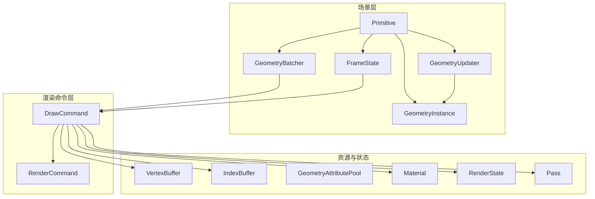
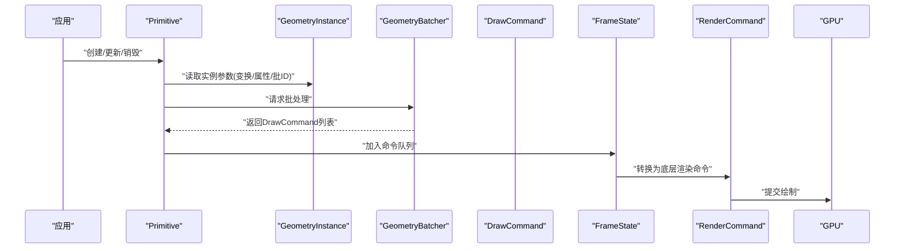
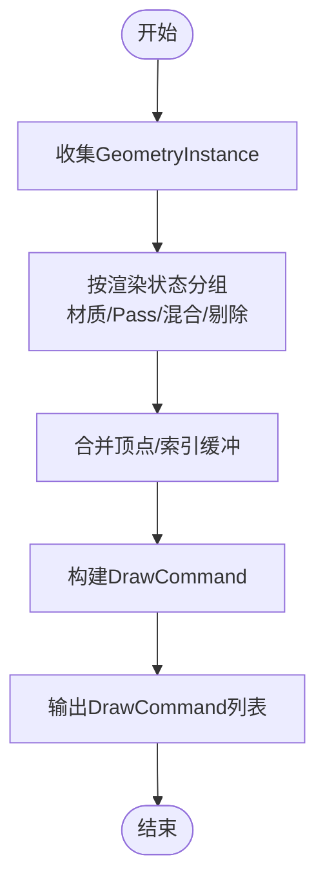
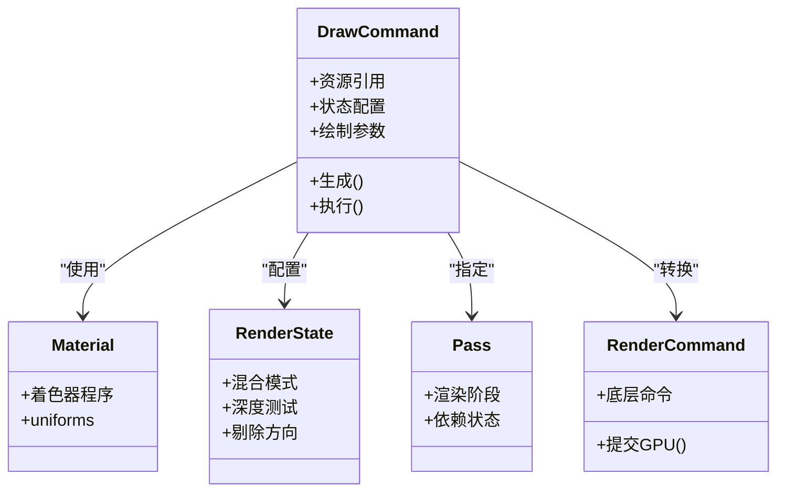
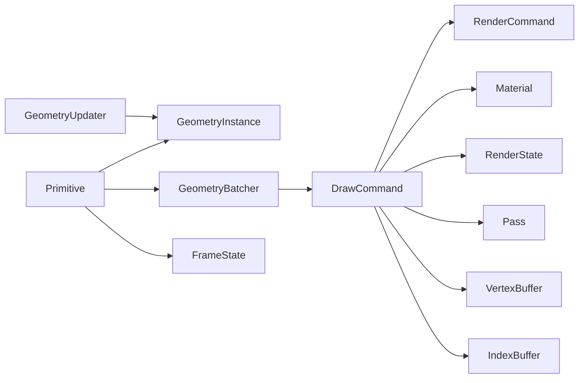

# 图元渲染API

<cite>
**本文引用的文件**   
- [Primitive.js](file://Source/Scene/Primitive.js)
- [GeometryInstance.js](file://Source/Scene/GeometryInstance.js)
- [DrawCommand.js](file://Source/Scene/DrawCommand.js)
- [GeometryBatcher.js](file://Source/Scene/GeometryBatcher.js)
- [GeometryUpdater.js](file://Source/Scene/GeometryUpdater.js)
- [FrameState.js](file://Source/Scene/FrameState.js)
- [RenderCommand.js](file://Source/Scene/RenderCommand.js)
- [GeometryAttributePool.js](file://Source/Scene/GeometryAttributePool.js)
- [IndexBuffer.js](file://Source/Scene/IndexBuffer.js)
- [VertexBuffer.js](file://Source/Scene/VertexBuffer.js)
- [Material.js](file://Source/Scene/Material.js)
- [Pass.js](file://Source/Scene/Pass.js)
- [RenderState.js](file://Source/Scene/RenderState.js)
</cite>

## 目录
1. [简介](#简介)
2. [项目结构](#项目结构)
3. [核心组件](#核心组件)
4. [架构总览](#架构总览)
5. [详细组件分析](#详细组件分析)
6. [依赖关系分析](#依赖关系分析)
7. [性能考量](#性能考量)
8. [故障排查指南](#故障排查指南)
9. [结论](#结论)
10. [附录](#附录)

## 简介
本文件面向Cesium图元渲染系统的开发者，系统性阐述Primitive基础图元的渲染管线与生命周期管理，深入解析GeometryInstance的实例化机制与批处理优化策略，说明DrawCommand的生成与执行流程，并重点介绍GeometryBatcher在状态合并、绘制调用减少等方面的优化技术。文末提供自定义图元与高性能渲染的实践建议与示例路径，帮助读者快速构建可扩展、高性能的渲染方案。

## 项目结构
围绕图元渲染的核心代码主要分布在Scene模块中，关键文件包括：
- Primitive：基础图元抽象，负责几何体与材质绑定、更新与渲染命令生成
- GeometryInstance：描述单个几何体的实例化参数（变换、属性、批处理ID等）
- DrawCommand：封装一次GPU绘制的完整上下文（状态、资源、索引等）
- GeometryBatcher：将多个可批处理的实例合并为更少的绘制调用
- GeometryUpdater：驱动几何体属性的动态更新
- FrameState：每帧渲染上下文，承载命令队列、状态缓存等
- RenderCommand：底层渲染命令对象，用于最终提交到GPU
- 缓冲池与缓冲区：GeometryAttributePool、VertexBuffer、IndexBuffer
- 材质与渲染状态：Material、RenderState、Pass

图表来源
- [Primitive.js](file://Source/Scene/Primitive.js)
- [GeometryInstance.js](file://Source/Scene/GeometryInstance.js)
- [GeometryBatcher.js](file://Source/Scene/GeometryBatcher.js)
- [DrawCommand.js](file://Source/Scene/DrawCommand.js)
- [RenderCommand.js](file://Source/Scene/RenderCommand.js)
- [GeometryAttributePool.js](file://Source/Scene/GeometryAttributePool.js)
- [VertexBuffer.js](file://Source/Scene/VertexBuffer.js)
- [IndexBuffer.js](file://Source/Scene/IndexBuffer.js)
- [Material.js](file://Source/Scene/Material.js)
- [RenderState.js](file://Source/Scene/RenderState.js)
- [Pass.js](file://Source/Scene/Pass.js)
- [FrameState.js](file://Source/Scene/FrameState.js)

章节来源
- [Primitive.js](file://Source/Scene/Primitive.js)
- [GeometryInstance.js](file://Source/Scene/GeometryInstance.js)
- [GeometryBatcher.js](file://Source/Scene/GeometryBatcher.js)
- [DrawCommand.js](file://Source/Scene/DrawCommand.js)
- [RenderCommand.js](file://Source/Scene/RenderCommand.js)
- [GeometryAttributePool.js](file://Source/Scene/GeometryAttributePool.js)
- [VertexBuffer.js](file://Source/Scene/VertexBuffer.js)
- [IndexBuffer.js](file://Source/Scene/IndexBuffer.js)
- [Material.js](file://Source/Scene/Material.js)
- [RenderState.js](file://Source/Scene/RenderState.js)
- [Pass.js](file://Source/Scene/Pass.js)
- [FrameState.js](file://Source/Scene/FrameState.js)

## 核心组件
- Primitive：定义基础图元的生命周期（创建、更新、销毁），协调几何体实例、材质与渲染命令生成；负责将自身加入FrameState的命令队列。
- GeometryInstance：描述一个几何体实例的变换矩阵、属性映射、批处理ID、可见性等信息，是批处理的基础单元。
- GeometryBatcher：根据实例间的兼容性（如相同几何类型、材质、渲染状态）进行分组与合并，输出DrawCommand列表以减少draw call。
- DrawCommand：封装一次绘制的全部上下文，包含顶点/索引缓冲、材质、渲染状态、Pass、深度测试、混合模式等。
- GeometryUpdater：周期性或事件驱动地更新GeometryInstance的属性（位置、颜色、纹理坐标等）。
- FrameState：每帧渲染上下文，维护命令队列、状态缓存、Pass调度等。
- RenderCommand：底层渲染命令对象，由DrawCommand转换而来，最终提交给GPU驱动。
- 资源与状态：GeometryAttributePool、VertexBuffer、IndexBuffer、Material、RenderState、Pass共同构成渲染所需的资源与状态集合。

章节来源
- [Primitive.js](file://Source/Scene/Primitive.js)
- [GeometryInstance.js](file://Source/Scene/GeometryInstance.js)
- [GeometryBatcher.js](file://Source/Scene/GeometryBatcher.js)
- [DrawCommand.js](file://Source/Scene/DrawCommand.js)
- [GeometryUpdater.js](file://Source/Scene/GeometryUpdater.js)
- [FrameState.js](file://Source/Scene/FrameState.js)
- [RenderCommand.js](file://Source/Scene/RenderCommand.js)
- [GeometryAttributePool.js](file://Source/Scene/GeometryAttributePool.js)
- [VertexBuffer.js](file://Source/Scene/VertexBuffer.js)
- [IndexBuffer.js](file://Source/Scene/IndexBuffer.js)
- [Material.js](file://Source/Scene/Material.js)
- [RenderState.js](file://Source/Scene/RenderState.js)
- [Pass.js](file://Source/Scene/Pass.js)

## 架构总览
下图展示了从Primitive到GPU绘制的整体数据流与控制流：

图表来源
- [Primitive.js](file://Source/Scene/Primitive.js)
- [GeometryInstance.js](file://Source/Scene/GeometryInstance.js)
- [GeometryBatcher.js](file://Source/Scene/GeometryBatcher.js)
- [DrawCommand.js](file://Source/Scene/DrawCommand.js)
- [FrameState.js](file://Source/Scene/FrameState.js)
- [RenderCommand.js](file://Source/Scene/RenderCommand.js)

## 详细组件分析

### Primitive：基础图元与生命周期
- 职责
  - 管理几何体与材质的绑定关系
  - 协调GeometryInstance的增删改
  - 在每帧更新时触发批处理与命令生成
  - 将DrawCommand加入FrameState的命令队列
- 生命周期
  - 创建：初始化几何体、材质、实例集合与批处理器
  - 更新：检测变化，重新计算批处理，生成新的DrawCommand
  - 销毁：释放缓冲与状态资源，清理命令引用
- 关键点
  - 与GeometryUpdater协作以支持动态属性更新
  - 与FrameState交互以控制渲染顺序与Pass选择

章节来源
- [Primitive.js](file://Source/Scene/Primitive.js)
- [GeometryUpdater.js](file://Source/Scene/GeometryUpdater.js)
- [FrameState.js](file://Source/Scene/FrameState.js)

### GeometryInstance：实例化机制
- 作用
  - 描述单个几何体实例的变换矩阵、属性映射、批处理ID、可见性等
  - 作为批处理的最小单位，参与状态合并与绘制合并
- 关键属性
  - 变换矩阵：决定实例在世界空间中的位置、旋转、缩放
  - 属性映射：将实例级属性注入到着色器（如颜色、纹理偏移）
  - 批处理ID：标识同一批次内的不同实体，便于后处理或拾取
  - 可见性与剔除：控制是否参与当前帧的渲染
- 使用建议
  - 尽量复用实例对象，避免频繁分配
  - 合理设置批处理ID，确保同批内状态一致

章节来源
- [GeometryInstance.js](file://Source/Scene/GeometryInstance.js)

### GeometryBatcher：批量渲染优化
- 目标
  - 将多个可兼容的GeometryInstance合并为更少DrawCommand，降低CPU-GPU通信开销
- 优化手段
  - 状态合并：按材质、渲染状态、Pass、纹理集等进行分组
  - 绘制调用减少：通过索引缓冲重组与顶点缓冲拼接，实现单次draw多实例
  - 属性打包：将实例属性压缩到统一缓冲，减少uniform切换
- 输出
  - 一组DrawCommand，每个对应一个最小化的绘制调用
- 注意事项
  - 合并条件需严格校验（如深度写入、混合模式、剔除方向）
  - 动态更新时需增量重批，避免全量重建

图表来源
- [GeometryBatcher.js](file://Source/Scene/GeometryBatcher.js)
- [DrawCommand.js](file://Source/Scene/DrawCommand.js)
- [VertexBuffer.js](file://Source/Scene/VertexBuffer.js)
- [IndexBuffer.js](file://Source/Scene/IndexBuffer.js)
- [Material.js](file://Source/Scene/Material.js)
- [RenderState.js](file://Source/Scene/RenderState.js)
- [Pass.js](file://Source/Scene/Pass.js)

章节来源
- [GeometryBatcher.js](file://Source/Scene/GeometryBatcher.js)
- [DrawCommand.js](file://Source/Scene/DrawCommand.js)
- [VertexBuffer.js](file://Source/Scene/VertexBuffer.js)
- [IndexBuffer.js](file://Source/Scene/IndexBuffer.js)
- [Material.js](file://Source/Scene/Material.js)
- [RenderState.js](file://Source/Scene/RenderState.js)
- [Pass.js](file://Source/Scene/Pass.js)

### DrawCommand：渲染命令生成与执行
- 组成
  - 资源引用：顶点缓冲、索引缓冲、纹理、常量缓冲
  - 状态配置：渲染状态、Pass、深度测试、混合模式、剔除方向
  - 绘制参数：索引范围、实例数量、属性布局
- 生成流程
  - 从GeometryBatcher接收分组结果
  - 结合Material与RenderState生成具体绘制上下文
  - 注册到FrameState的命令队列
- 执行流程
  - FrameState遍历命令队列，转换为RenderCommand
  - 提交至GPU驱动完成绘制

图表来源
- [DrawCommand.js](file://Source/Scene/DrawCommand.js)
- [RenderCommand.js](file://Source/Scene/RenderCommand.js)
- [Material.js](file://Source/Scene/Material.js)
- [RenderState.js](file://Source/Scene/RenderState.js)
- [Pass.js](file://Source/Scene/Pass.js)

章节来源
- [DrawCommand.js](file://Source/Scene/DrawCommand.js)
- [RenderCommand.js](file://Source/Scene/RenderCommand.js)
- [Material.js](file://Source/Scene/Material.js)
- [RenderState.js](file://Source/Scene/RenderState.js)
- [Pass.js](file://Source/Scene/Pass.js)

### GeometryUpdater：动态更新
- 职责
  - 监听属性变化或时间推进，更新GeometryInstance的变换与属性
  - 标记需要重批的实例，触发增量批处理
- 最佳实践
  - 使用对象池减少GC压力
  - 批量更新后一次性触发批处理

章节来源
- [GeometryUpdater.js](file://Source/Scene/GeometryUpdater.js)
- [GeometryInstance.js](file://Source/Scene/GeometryInstance.js)
- [GeometryBatcher.js](file://Source/Scene/GeometryBatcher.js)

### FrameState：每帧上下文
- 职责
  - 维护命令队列、状态缓存、Pass调度
  - 协调Primitive的命令生成与执行
- 关键点
  - 命令排序与去重
  - 状态切换最小化

章节来源
- [FrameState.js](file://Source/Scene/FrameState.js)
- [DrawCommand.js](file://Source/Scene/DrawCommand.js)

### 资源与状态：缓冲池与渲染状态
- GeometryAttributePool：属性缓冲池，减少重复分配
- VertexBuffer/IndexBuffer：顶点与索引缓冲，存储几何数据
- Material/RenderState/Pass：材质程序、渲染状态与渲染阶段

章节来源
- [GeometryAttributePool.js](file://Source/Scene/GeometryAttributePool.js)
- [VertexBuffer.js](file://Source/Scene/VertexBuffer.js)
- [IndexBuffer.js](file://Source/Scene/IndexBuffer.js)
- [Material.js](file://Source/Scene/Material.js)
- [RenderState.js](file://Source/Scene/RenderState.js)
- [Pass.js](file://Source/Scene/Pass.js)

## 依赖关系分析
下图展示核心组件之间的依赖关系与耦合度：

图表来源
- [Primitive.js](file://Source/Scene/Primitive.js)
- [GeometryInstance.js](file://Source/Scene/GeometryInstance.js)
- [GeometryBatcher.js](file://Source/Scene/GeometryBatcher.js)
- [DrawCommand.js](file://Source/Scene/DrawCommand.js)
- [RenderCommand.js](file://Source/Scene/RenderCommand.js)
- [Material.js](file://Source/Scene/Material.js)
- [RenderState.js](file://Source/Scene/RenderState.js)
- [Pass.js](file://Source/Scene/Pass.js)
- [VertexBuffer.js](file://Source/Scene/VertexBuffer.js)
- [IndexBuffer.js](file://Source/Scene/IndexBuffer.js)
- [GeometryUpdater.js](file://Source/Scene/GeometryUpdater.js)
- [FrameState.js](file://Source/Scene/FrameState.js)

章节来源
- [Primitive.js](file://Source/Scene/Primitive.js)
- [GeometryInstance.js](file://Source/Scene/GeometryInstance.js)
- [GeometryBatcher.js](file://Source/Scene/GeometryBatcher.js)
- [DrawCommand.js](file://Source/Scene/DrawCommand.js)
- [RenderCommand.js](file://Source/Scene/RenderCommand.js)
- [Material.js](file://Source/Scene/Material.js)
- [RenderState.js](file://Source/Scene/RenderState.js)
- [Pass.js](file://Source/Scene/Pass.js)
- [VertexBuffer.js](file://Source/Scene/VertexBuffer.js)
- [IndexBuffer.js](file://Source/Scene/IndexBuffer.js)
- [GeometryUpdater.js](file://Source/Scene/GeometryUpdater.js)
- [FrameState.js](file://Source/Scene/FrameState.js)

## 性能考量
- 批处理优先
  - 尽可能将相同材质与渲染状态的实例合并，减少状态切换
  - 使用合理的批处理ID，避免不必要的拆分
- 缓冲管理
  - 复用顶点与索引缓冲，避免频繁分配与拷贝
  - 使用属性池减少内存碎片
- 更新策略
  - 增量更新GeometryInstance，仅对变化的实例触发重批
  - 批量更新后集中批处理，降低CPU开销
- 状态最小化
  - 合并相近的渲染状态，减少Pass切换
  - 合理使用剔除与深度测试，避免过度绘制

[本节为通用指导，不直接分析具体文件]

## 故障排查指南
- 常见问题
  - 绘制缺失：检查GeometryInstance的可见性与剔除设置
  - 颜色异常：确认材质uniform与属性映射是否正确
  - 性能下降：查看批处理分组是否合理，是否存在过多状态切换
- 定位方法
  - 打印DrawCommand数量与状态差异，识别未合并的批次
  - 检查FrameState命令队列长度与排序
  - 验证Vertex/Index缓冲的数据布局与步长

章节来源
- [GeometryInstance.js](file://Source/Scene/GeometryInstance.js)
- [DrawCommand.js](file://Source/Scene/DrawCommand.js)
- [FrameState.js](file://Source/Scene/FrameState.js)
- [Material.js](file://Source/Scene/Material.js)
- [VertexBuffer.js](file://Source/Scene/VertexBuffer.js)
- [IndexBuffer.js](file://Source/Scene/IndexBuffer.js)

## 结论
通过Primitive、GeometryInstance、GeometryBatcher与DrawCommand的协同工作，Cesium实现了高效的图元渲染管线。合理利用批处理与状态合并，可以显著降低绘制调用与CPU开销。开发者应关注实例化参数的正确设置、动态更新的增量策略以及资源与状态的最小化切换，以获得稳定且高性能的渲染效果。

[本节为总结，不直接分析具体文件]

## 附录
- 自定义图元开发要点
  - 继承Primitive，实现几何体与材质绑定逻辑
  - 使用GeometryInstance描述实例参数，合理设置批处理ID
  - 在更新周期中调用批处理器生成DrawCommand并加入FrameState
- 高性能渲染实践
  - 批量更新与增量批处理
  - 复用缓冲与属性池
  - 合并相近材质与渲染状态
  - 监控DrawCommand数量与状态切换频率

[本节为概念性内容，不直接分析具体文件]