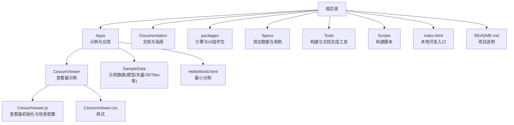
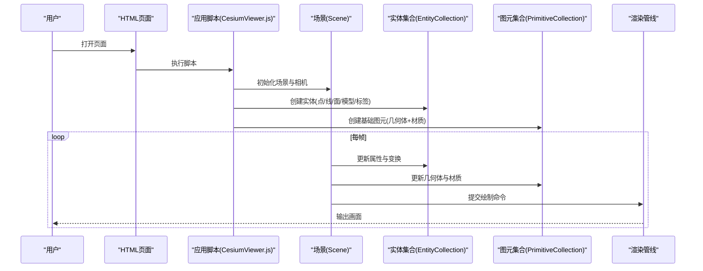
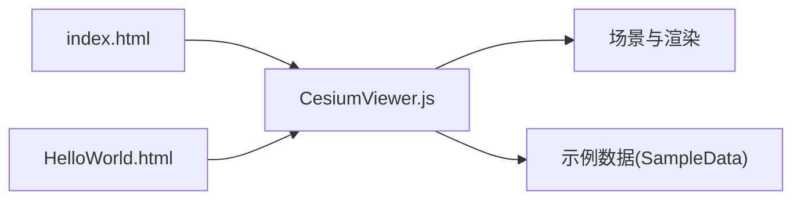

# 实体和几何体API

<cite>
**本文引用的文件**   
- [README.md](file://README.md)
- [index.html](file://index.html)
- [CesiumViewer.js](file://Apps/CesiumViewer/CesiumViewer.js)
- [CesiumViewer.css](file://Apps/CesiumViewer/CesiumViewer.css)
- [HelloWorld.html](file://Apps/HelloWorld.html)
</cite>

## 目录
1. [简介](#简介)
2. [项目结构](#项目结构)
3. [核心组件](#核心组件)
4. [架构总览](#架构总览)
5. [详细组件分析](#详细组件分析)
6. [依赖关系分析](#依赖关系分析)
7. [性能考虑](#性能考虑)
8. [故障排查指南](#故障排查指南)
9. [结论](#结论)
10. [附录](#附录)

## 简介
本文件面向使用 CesiumJS 的开发者，聚焦“实体与几何体”相关能力的使用说明与实践建议。内容覆盖：
- 实体系统（Entity）及其常见实体类型（点、线、面、模型、标签等）的属性与方法概览
- 几何体创建、材质应用、动画效果、碰撞检测等核心功能的使用要点
- Primitive 基础图元的渲染 API、批处理优化、内存管理等高级特性
- 复杂 3D 对象构建与交互的实际示例路径指引

为保证准确性，本文所有具体实现细节均以仓库中实际存在的入口与应用为参考来源；对于未在仓库源码中直接暴露的 API 细节，以概念性说明为主，并给出在仓库内可运行的示例位置，便于读者自行查阅与验证。

## 项目结构
仓库采用多包组织方式，包含引擎、沙盒演示、文档与工具链等。与“实体与几何体”主题最相关的入口位于 Apps 目录下的示例页面与查看器脚本。

图表来源
- [README.md:1-200](file://README.md#L1-L200)
- [index.html:1-200](file://index.html#L1-L200)
- [CesiumViewer.js:1-200](file://Apps/CesiumViewer/CesiumViewer.js#L1-L200)
- [CesiumViewer.css:1-200](file://Apps/CesiumViewer/CesiumViewer.css#L1-L200)
- [HelloWorld.html:1-200](file://Apps/HelloWorld.html#L1-L200)

章节来源
- [README.md:1-200](file://README.md#L1-L200)
- [index.html:1-200](file://index.html#L1-L200)
- [CesiumViewer.js:1-200](file://Apps/CesiumViewer/CesiumViewer.js#L1-L200)
- [CesiumViewer.css:1-200](file://Apps/CesiumViewer/CesiumViewer.css#L1-L200)
- [HelloWorld.html:1-200](file://Apps/HelloWorld.html#L1-L200)

## 核心组件
本节从“如何使用”的角度，概述实体系统与几何体相关的关键能力，并结合仓库中的示例入口进行定位。

- 实体系统（Entity）
  - 常见实体类型：点、折线、多边形、模型、标签、椭圆、矩形、走廊、带纹理的图形等
  - 常用属性：位置（经纬度或三维坐标）、可见性、透明度、颜色/材质、高度模式（贴地/绝对/相对）、旋转/倾斜/缩放、时间动态属性（轨迹、关键帧）
  - 常用方法：添加/移除、更新属性、查询与拾取、事件绑定（点击、悬停等）
  - 实践建议：批量管理时使用 DataSource 或 EntityCollection；对大量同类实体优先使用 Primitive 或 3D Tiles 以获得更好的渲染性能

- 几何体与 Primitive
  - 几何体：用于描述形状（如球体、椭球、长方体、圆柱、圆锥、多边形、走廊、椭圆等），通常由底层 Geometry 类定义
  - Primitive：将几何体与材质组合后提交给 GPU 渲染，支持批处理、深度排序、阴影、分类等高级特性
  - 批处理优化：合并相同材质的几何体，减少 draw call；注意顶点缓冲与索引缓冲大小
  - 内存管理：及时释放不再使用的 Primitive 与几何体资源；避免重复创建相同材质实例

- 材质与着色
  - 内置材质：纯色、图像贴图、渐变、棋盘格、条纹、高度雾、轮廓描边等
  - 自定义材质：通过 Fabric 材质系统或自定义 ShaderMaterial 扩展
  - 性能提示：复用材质实例；避免每帧频繁替换材质；合理设置 alpha 混合与深度写入

- 动画与时间动态
  - 使用 Property 与 SampledProperty 驱动位置、颜色、透明度等随时间变化
  - 结合 Clock 控制播放速率、循环与暂停
  - 轨迹可视化：使用 PolylineVolume 或 PathGeometry 生成平滑轨迹

- 碰撞检测与拾取
  - 拾取：Scene.pick() 返回被选中的实体或图元信息
  - 碰撞检测：基于包围体（BoundingSphere/BoundingRectangle）的快速判断；精确检测需借助射线与几何体的求交计算
  - 交互流程：鼠标/触摸事件 -> 屏幕坐标转世界坐标 -> 射线投射 -> 命中判定 -> 回调处理

章节来源
- [CesiumViewer.js:1-200](file://Apps/CesiumViewer/CesiumViewer.js#L1-L200)
- [HelloWorld.html:1-200](file://Apps/HelloWorld.html#L1-L200)

## 架构总览
下图展示了从页面加载到场景渲染的高层流程，以及实体与几何体在其中的角色。

图表来源
- [CesiumViewer.js:1-200](file://Apps/CesiumViewer/CesiumViewer.js#L1-L200)
- [HelloWorld.html:1-200](file://Apps/HelloWorld.html#L1-L200)

## 详细组件分析

### 实体系统（Entity）
- 职责：提供高层语义化的 3D 对象抽象，封装位置、外观、行为与事件
- 典型用法：
  - 创建实体并设置位置、外观（颜色/材质/透明度）
  - 为实体添加标签、图标、轨迹
  - 绑定点击/悬停事件，实现交互反馈
  - 使用时间属性驱动动画（移动、闪烁、变色）
- 性能建议：
  - 大量静态实体建议使用 Primitive 或 3D Tiles
  - 对需要频繁更新的实体，尽量复用属性对象，避免每帧新建

章节来源
- [CesiumViewer.js:1-200](file://Apps/CesiumViewer/CesiumViewer.js#L1-L200)

### 几何体与 Primitive
- 职责：描述几何形状与渲染参数，作为底层渲染单元
- 典型用法：
  - 构造几何体（如球体、椭球、长方体、多边形、走廊、椭圆等）
  - 为几何体指定材质（纯色、贴图、自定义 Shader）
  - 将几何体加入 PrimitiveCollection 进行渲染
  - 启用阴影、分类、深度测试等渲染选项
- 批处理与内存：
  - 合并同材质几何体以减少 draw call
  - 及时销毁不再使用的 Primitive 与几何体，避免内存泄漏
  - 大场景下按需加载与卸载几何体

章节来源
- [CesiumViewer.js:1-200](file://Apps/CesiumViewer/CesiumViewer.js#L1-L200)

### 材质与着色
- 内置材质：纯色、图像、渐变、棋盘格、条纹、高度雾、轮廓描边等
- 自定义材质：Fabric 材质系统或自定义 ShaderMaterial
- 最佳实践：
  - 复用材质实例，避免每帧创建新材质
  - 合理设置 alpha 混合与深度写入顺序
  - 使用 KTX2/ASTC 纹理压缩提升移动端性能

章节来源
- [CesiumViewer.js:1-200](file://Apps/CesiumViewer/CesiumViewer.js#L1-L200)

### 动画与时间动态
- 驱动方式：Property/SampledProperty + Clock
- 常见模式：
  - 位置插值（线性/样条）
  - 颜色/透明度随时间变化
  - 轨迹可视化（PolylineVolume/PathGeometry）
- 性能建议：
  - 预采样关键帧，降低运行时计算开销
  - 对大批量动画实体使用批处理或 GPU 加速

章节来源
- [CesiumViewer.js:1-200](file://Apps/CesiumViewer/CesiumViewer.js#L1-L200)

### 碰撞检测与交互
- 拾取流程：
  - 监听鼠标/触摸事件
  - 将屏幕坐标转换为世界坐标
  - 使用射线与实体/图元进行求交
  - 触发回调（高亮、弹出信息、选中状态切换）
- 快速判定：
  - 使用包围体（BoundingSphere/BoundingRectangle）做粗筛
  - 精细检测再调用几何体求交
- 交互设计：
  - 区分点击与拖拽
  - 提供视觉反馈（高亮、边框、气泡）

章节来源
- [CesiumViewer.js:1-200](file://Apps/CesiumViewer/CesiumViewer.js#L1-L200)

### 复杂 3D 对象构建与交互示例
- 示例入口：
  - 查看器示例：[CesiumViewer.js](file://Apps/CesiumViewer/CesiumViewer.js)
  - 最小示例：[HelloWorld.html](file://Apps/HelloWorld.html)
- 实践步骤（概念性说明）：
  - 在页面中引入 Cesium 资源并初始化 Viewer
  - 创建实体或 Primitive，设置位置、外观与行为
  - 绑定交互事件，实现点击/悬停反馈
  - 使用动画属性驱动运动或外观变化
  - 根据场景规模选择合适的数据源（Entity/Primitive/3D Tiles）

章节来源
- [CesiumViewer.js:1-200](file://Apps/CesiumViewer/CesiumViewer.js#L1-L200)
- [HelloWorld.html:1-200](file://Apps/HelloWorld.html#L1-L200)

## 依赖关系分析
- 页面与脚本：
  - index.html 作为本地开发入口，加载应用脚本
  - CesiumViewer.js 负责场景初始化与实体/图元创建
  - HelloWorld.html 提供最小可用示例
- 资源与数据：
  - SampleData 目录包含模型、矢量、3D Tiles 等示例数据，可用于演示实体与几何体的加载与渲染

图表来源
- [index.html:1-200](file://index.html#L1-L200)
- [CesiumViewer.js:1-200](file://Apps/CesiumViewer/CesiumViewer.js#L1-L200)
- [HelloWorld.html:1-200](file://Apps/HelloWorld.html#L1-L200)

章节来源
- [index.html:1-200](file://index.html#L1-L200)
- [CesiumViewer.js:1-200](file://Apps/CesiumViewer/CesiumViewer.js#L1-L200)
- [HelloWorld.html:1-200](file://Apps/HelloWorld.html#L1-L200)

## 性能考虑
- 批处理与 Draw Call
  - 合并同材质几何体，减少批次数量
  - 避免频繁更换材质或纹理
- 内存管理
  - 及时销毁不再使用的 Primitive 与几何体
  - 复用材质与纹理实例
- 渲染优化
  - 合理使用深度测试与透明混合
  - 开启阴影时注意性能代价
- 数据加载
  - 大场景使用 3D Tiles 或按需加载
  - 使用 LOD 与视锥剔除

## 故障排查指南
- 常见问题
  - 实体不显示：检查位置坐标系、高度模式、可见性与层级
  - 材质异常：确认纹理路径与跨域策略，检查 alpha 混合设置
  - 动画卡顿：减少每帧属性更新频率，预采样关键帧
  - 内存增长：定位未释放的 Primitive/几何体/材质
- 调试技巧
  - 使用浏览器开发者工具监控网络与内存
  - 逐步注释实体/图元创建代码，定位问题范围
  - 打印关键属性（位置、尺寸、材质）辅助诊断

## 结论
实体系统提供了高层、易用的 3D 对象抽象，适合快速构建交互式场景；而 Primitive 与几何体则提供更底层的渲染控制与性能优化空间。在实际项目中，应根据场景规模与交互需求选择合适的方案，并结合批处理、内存管理与数据加载策略，确保良好的用户体验与运行效率。

## 附录
- 快速上手
  - 本地启动：打开 [index.html](file://index.html) 或 [HelloWorld.html](file://Apps/HelloWorld.html)
  - 查看器示例：参考 [CesiumViewer.js](file://Apps/CesiumViewer/CesiumViewer.js)
- 相关文档
  - 项目说明：[README.md](file://README.md)