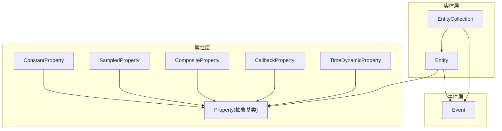
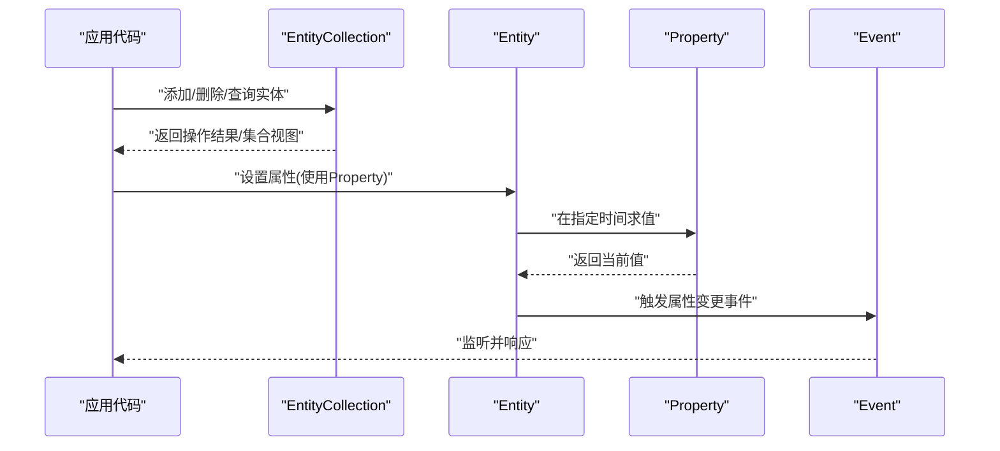
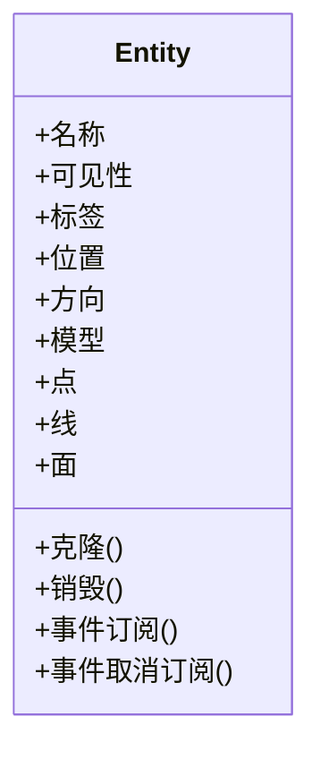
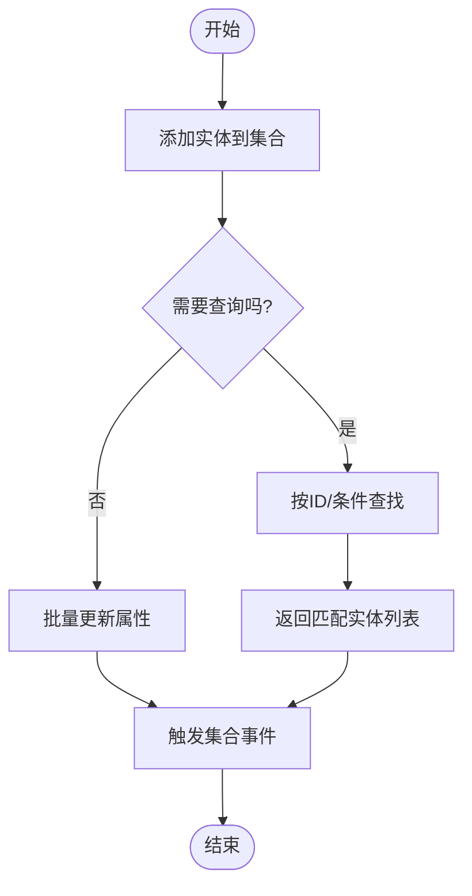
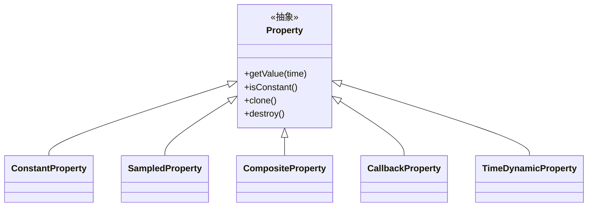
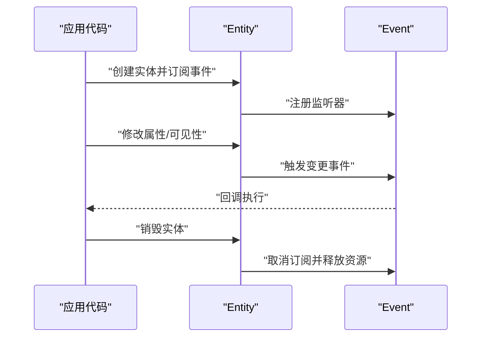
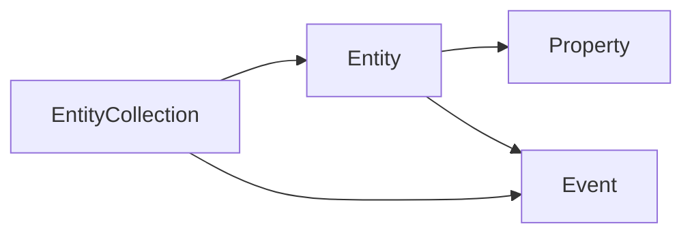

# 实体系统API

<cite>
**本文引用的文件**   
- [Entity.js](file://Source/Core/Entity.js)
- [EntityCollection.js](file://Source/Core/EntityCollection.js)
- [Property.js](file://Source/Core/Property.js)
- [ConstantProperty.js](file://Source/Core/ConstantProperty.js)
- [SampledProperty.js](file://Source/Core/SampledProperty.js)
- [CompositeProperty.js](file://Source/Core/CompositeProperty.js)
- [CallbackProperty.js](file://Source/Core/CallbackProperty.js)
- [TimeDynamicProperty.js](file://Source/Core/TimeDynamicProperty.js)
- [Event.js](file://Source/Core/Event.js)
</cite>

## 目录
1. [简介](#简介)
2. [项目结构](#项目结构)
3. [核心组件](#核心组件)
4. [架构总览](#架构总览)
5. [详细组件分析](#详细组件分析)
6. [依赖关系分析](#依赖关系分析)
7. [性能考虑](#性能考虑)
8. [故障排查指南](#故障排查指南)
9. [结论](#结论)
10. [附录](#附录)

## 简介
本文件面向Cesium的实体系统，提供一份系统化、可操作的API文档。内容覆盖：
- Entity类的基础属性与方法（位置、可见性、名称等）
- EntityCollection集合管理（添加、删除、查询、批量操作）
- Property属性系统的动态绑定机制（时间动态属性、表达式求值、继承与组合）
- 实体生命周期管理、事件处理与性能优化实践

本说明以源码为依据，通过“章节来源”和“图示来源”进行严格溯源，便于读者对照实现细节。

## 项目结构
实体系统位于Core模块中，围绕“实体-集合-属性-事件”四个维度组织：
- 实体：Entity
- 集合：EntityCollection
- 属性：Property及其具体实现（ConstantProperty、SampledProperty、CompositeProperty、CallbackProperty、TimeDynamicProperty）
- 事件：Event

图示来源
- [Entity.js:1-200](file://Source/Core/Entity.js#L1-L200)
- [EntityCollection.js:1-200](file://Source/Core/EntityCollection.js#L1-L200)
- [Property.js:1-200](file://Source/Core/Property.js#L1-L200)
- [ConstantProperty.js:1-200](file://Source/Core/ConstantProperty.js#L1-L200)
- [SampledProperty.js:1-200](file://Source/Core/SampledProperty.js#L1-L200)
- [CompositeProperty.js:1-200](file://Source/Core/CompositeProperty.js#L1-L200)
- [CallbackProperty.js:1-200](file://Source/Core/CallbackProperty.js#L1-L200)
- [TimeDynamicProperty.js:1-200](file://Source/Core/TimeDynamicProperty.js#L1-L200)
- [Event.js:1-200](file://Source/Core/Event.js#L1-L200)

章节来源
- [Entity.js:1-200](file://Source/Core/Entity.js#L1-L200)
- [EntityCollection.js:1-200](file://Source/Core/EntityCollection.js#L1-L200)
- [Property.js:1-200](file://Source/Core/Property.js#L1-L200)

## 核心组件
本节概述实体系统的三大支柱：Entity、EntityCollection、Property。

- Entity
  - 负责描述一个可视化对象的基本信息（如名称、显示标签、可见性、位置、方向、模型、点、线、面等几何相关属性）。
  - 每个属性通常由Property驱动，支持静态常量或随时间变化。
  - 暴露事件用于通知状态变更（例如属性更新、可见性变化等）。

- EntityCollection
  - 管理一组Entity实例，提供增删改查、遍历、按条件筛选、批量更新等方法。
  - 内部维护索引与缓存，以提升查找与渲染效率。
  - 在集合级别也暴露事件，便于监听整体变化。

- Property
  - 所有实体属性的统一抽象接口，定义取值、时间有效性、克隆、销毁等通用行为。
  - 具体实现包括常量、采样、回调、组合、时间动态等类型，支持表达式求值与继承链式组合。

章节来源
- [Entity.js:1-200](file://Source/Core/Entity.js#L1-L200)
- [EntityCollection.js:1-200](file://Source/Core/EntityCollection.js#L1-L200)
- [Property.js:1-200](file://Source/Core/Property.js#L1-L200)

## 架构总览
下图展示实体系统在运行期的交互方式：实体持有属性，属性在给定时间返回计算结果；集合统一管理实体并触发集合级事件；事件贯穿实体与集合，形成松耦合的通知机制。

图示来源
- [Entity.js:1-200](file://Source/Core/Entity.js#L1-L200)
- [EntityCollection.js:1-200](file://Source/Core/EntityCollection.js#L1-L200)
- [Property.js:1-200](file://Source/Core/Property.js#L1-L200)
- [Event.js:1-200](file://Source/Core/Event.js#L1-L200)

## 详细组件分析

### Entity类详解
- 基础属性
  - 名称、可见性、标签、位置、方向、模型、点、线、面等。这些属性大多由Property驱动，可在不同时间返回不同值。
- 常用方法
  - 获取/设置属性值、克隆实体、销毁实体、订阅/取消订阅事件。
- 事件
  - 属性变更、可见性变化、层级变化等事件，供上层逻辑响应。

图示来源
- [Entity.js:1-200](file://Source/Core/Entity.js#L1-L200)

章节来源
- [Entity.js:1-200](file://Source/Core/Entity.js#L1-L200)

### EntityCollection集合管理
- 功能要点
  - 添加/移除实体、根据ID或条件查询、遍历集合、批量更新、排序与过滤。
  - 内部维护索引与缓存，提高查询与渲染性能。
  - 集合级事件：添加、移除、顺序变化等。
- 典型用法
  - 构建场景时批量加载实体；运行时动态增删；基于属性筛选高亮目标。

图示来源
- [EntityCollection.js:1-200](file://Source/Core/EntityCollection.js#L1-L200)

章节来源
- [EntityCollection.js:1-200](file://Source/Core/EntityCollection.js#L1-L200)

### Property属性系统与动态绑定
- 抽象接口
  - 定义取值接口、时间有效性判断、克隆与销毁等通用能力。
- 具体实现
  - ConstantProperty：固定值，不随时间变化。
  - SampledProperty：基于时间序列采样，支持插值与范围外推策略。
  - CompositeProperty：组合多个属性，按时间选择或混合。
  - CallbackProperty：通过回调函数动态计算值。
  - TimeDynamicProperty：面向高性能的时间动态属性，适合大规模数据。
- 表达式求值与继承
  - 通过组合与回调，可实现复杂表达式求值；属性链式组合体现“继承”语义（子属性优先于父属性）。

图示来源
- [Property.js:1-200](file://Source/Core/Property.js#L1-L200)
- [ConstantProperty.js:1-200](file://Source/Core/ConstantProperty.js#L1-L200)
- [SampledProperty.js:1-200](file://Source/Core/SampledProperty.js#L1-L200)
- [CompositeProperty.js:1-200](file://Source/Core/CompositeProperty.js#L1-L200)
- [CallbackProperty.js:1-200](file://Source/Core/CallbackProperty.js#L1-L200)
- [TimeDynamicProperty.js:1-200](file://Source/Core/TimeDynamicProperty.js#L1-L200)

章节来源
- [Property.js:1-200](file://Source/Core/Property.js#L1-L200)
- [ConstantProperty.js:1-200](file://Source/Core/ConstantProperty.js#L1-L200)
- [SampledProperty.js:1-200](file://Source/Core/SampledProperty.js#L1-L200)
- [CompositeProperty.js:1-200](file://Source/Core/CompositeProperty.js#L1-L200)
- [CallbackProperty.js:1-200](file://Source/Core/CallbackProperty.js#L1-L200)
- [TimeDynamicProperty.js:1-200](file://Source/Core/TimeDynamicProperty.js#L1-L200)

### 事件处理与生命周期
- 事件机制
  - Event作为通用事件总线，实体与集合均可发布与订阅事件。
  - 常见事件：属性变更、可见性变化、集合增删、顺序调整等。
- 生命周期
  - 创建：初始化属性与事件订阅。
  - 运行期：属性按需求值，事件驱动UI与业务逻辑更新。
  - 销毁：释放资源、取消订阅、清理缓存。

图示来源
- [Event.js:1-200](file://Source/Core/Event.js#L1-L200)
- [Entity.js:1-200](file://Source/Core/Entity.js#L1-L200)

章节来源
- [Event.js:1-200](file://Source/Core/Event.js#L1-L200)
- [Entity.js:1-200](file://Source/Core/Entity.js#L1-L200)

## 依赖关系分析
- 组件耦合
  - Entity依赖Property进行属性求值，依赖Event进行状态通知。
  - EntityCollection聚合多个Entity，并在集合层面复用Event。
- 外部集成点
  - 渲染管线通过Entity的属性输出（位置、颜色、模型等）驱动绘制。
  - 数据源可通过Property将外部数据流接入实体属性。

图示来源
- [EntityCollection.js:1-200](file://Source/Core/EntityCollection.js#L1-L200)
- [Entity.js:1-200](file://Source/Core/Entity.js#L1-L200)
- [Property.js:1-200](file://Source/Core/Property.js#L1-L200)
- [Event.js:1-200](file://Source/Core/Event.js#L1-L200)

章节来源
- [EntityCollection.js:1-200](file://Source/Core/EntityCollection.js#L1-L200)
- [Entity.js:1-200](file://Source/Core/Entity.js#L1-L200)
- [Property.js:1-200](file://Source/Core/Property.js#L1-L200)
- [Event.js:1-200](file://Source/Core/Event.js#L1-L200)

## 性能考虑
- 属性求值
  - 优先使用ConstantProperty减少重复计算；对高频变化的属性使用SampledProperty或TimeDynamicProperty以获得更好的插值与缓存效果。
- 集合管理
  - 批量操作优于逐条操作；避免频繁增删导致索引重建。
- 事件处理
  - 合理拆分事件粒度，避免在高频事件中执行重计算；必要时合并或节流。
- 内存管理
  - 及时销毁不再使用的实体与属性，取消事件订阅，防止内存泄漏。

[本节为通用指导，无需列出章节来源]

## 故障排查指南
- 常见问题
  - 属性未更新：检查Property是否在指定时间范围内有效；确认时间参数传递正确。
  - 事件未触发：确认已正确订阅且未提前销毁；检查事件命名与参数是否一致。
  - 集合查询慢：评估是否使用了合适的索引或条件；避免全量遍历。
- 定位建议
  - 在关键路径打印事件日志；使用最小复现用例隔离问题；逐步替换Property实现验证求值逻辑。

章节来源
- [Event.js:1-200](file://Source/Core/Event.js#L1-L200)
- [Entity.js:1-200](file://Source/Core/Entity.js#L1-L200)
- [EntityCollection.js:1-200](file://Source/Core/EntityCollection.js#L1-L200)

## 结论
Cesium实体系统以Entity为核心，结合EntityCollection的高效管理与Property的动态绑定机制，提供了灵活而强大的可视化建模能力。通过合理使用事件与生命周期管理，并结合性能优化策略，可以在大规模场景中保持流畅体验。

[本节为总结性内容，无需列出章节来源]

## 附录
- 术语
  - 实体：场景中的可视化对象。
  - 属性：驱动实体外观与行为的动态值。
  - 集合：实体的容器与管理器。
  - 事件：对象间通信与解耦的机制。

[本节为概念性内容，无需列出章节来源]