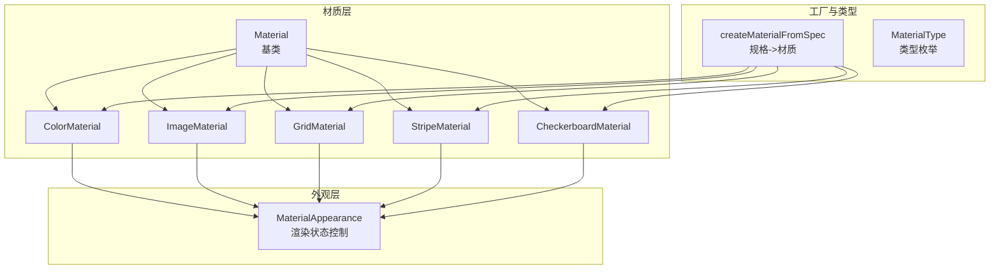
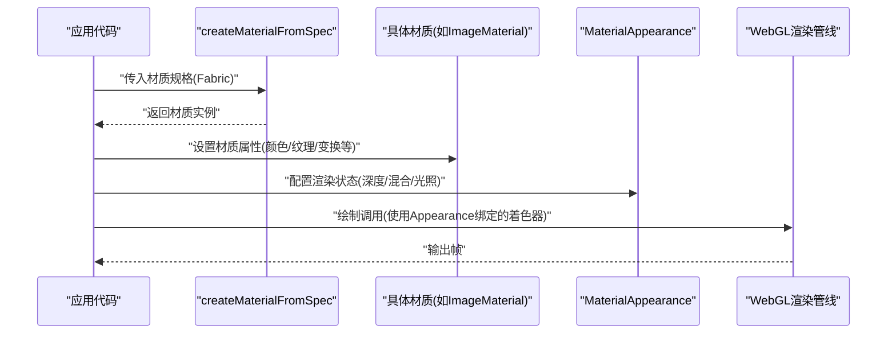
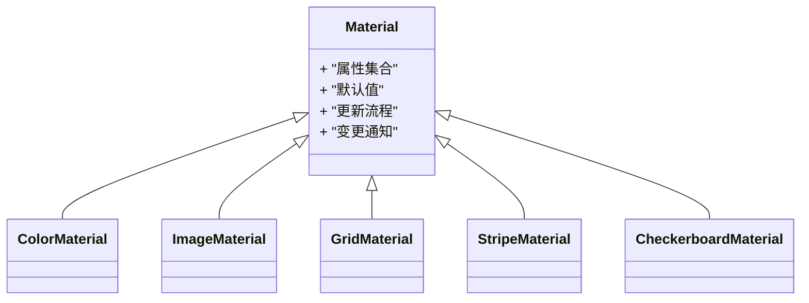
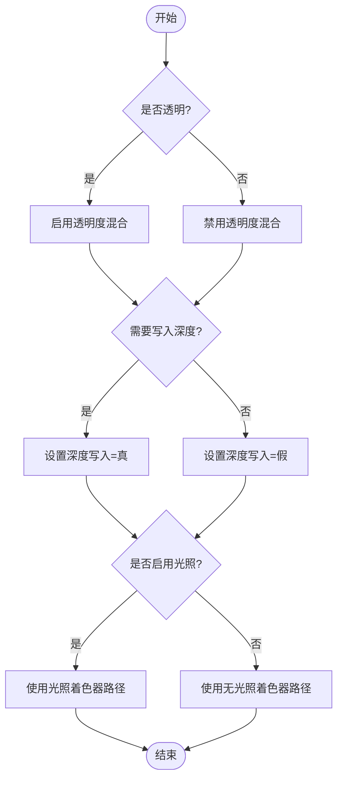
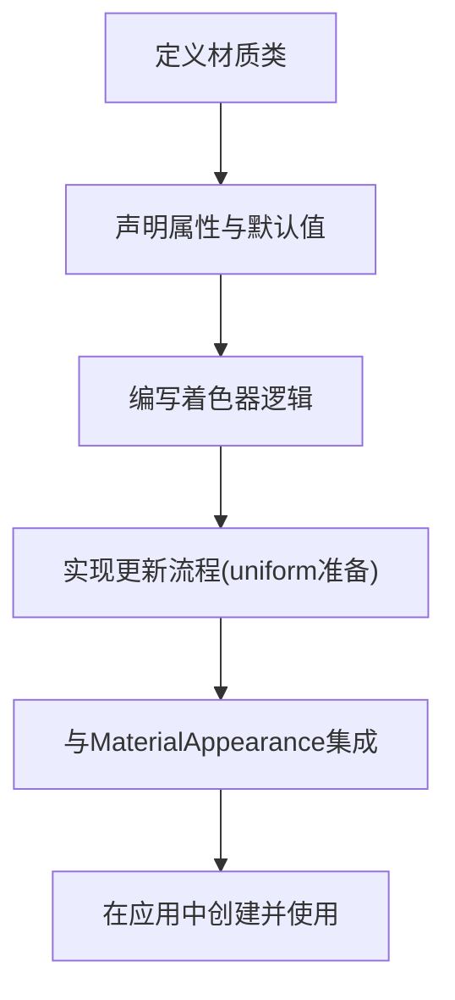
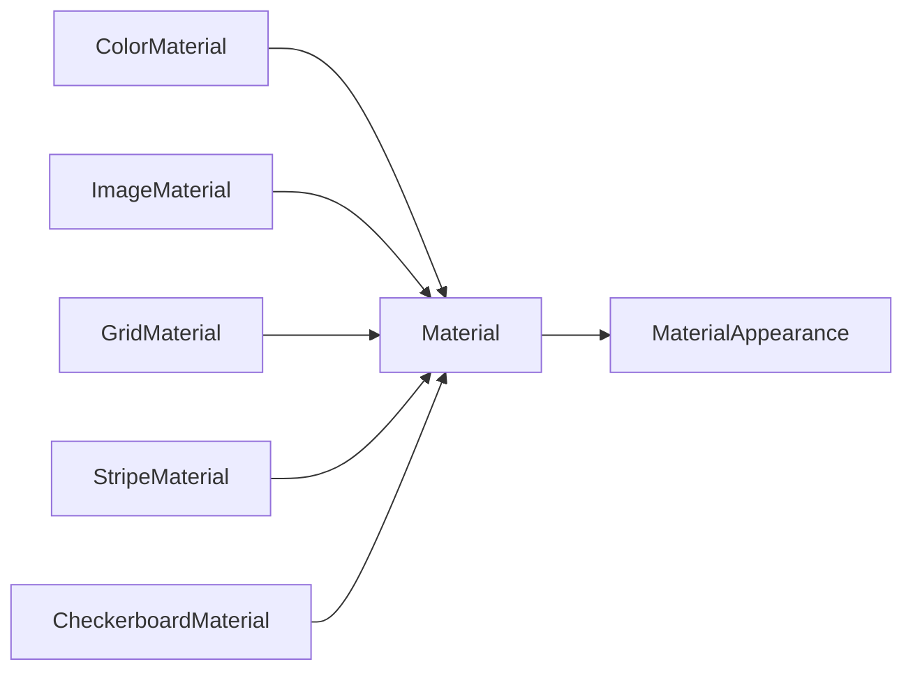

# 材质系统API

<cite>
**本文引用的文件**   
- [Material.js](file://Source/Scene/Material.js)
- [MaterialAppearance.js](file://Source/Scene/MaterialAppearance.js)
- [ColorMaterial.js](file://Source/Scene/Materials/ColorMaterial.js)
- [ImageMaterial.js](file://Source/Scene/Materials/ImageMaterial.js)
- [GridMaterial.js](file://Source/Scene/Materials/GridMaterial.js)
- [StripeMaterial.js](file://Source/Scene/Materials/StripeMaterial.js)
- [CheckerboardMaterial.js](file://Source/Scene/Materials/CheckerboardMaterial.js)
- [createMaterialFromSpec.js](file://Source/Scene/createMaterialFromSpec.js)
- [MaterialType.js](file://Source/Scene/MaterialType.js)
</cite>

## 目录
1. [简介](#简介)
2. [项目结构](#项目结构)
3. [核心组件](#核心组件)
4. [架构总览](#架构总览)
5. [详细组件分析](#详细组件分析)
6. [依赖关系分析](#依赖关系分析)
7. [性能考虑](#性能考虑)
8. [故障排查指南](#故障排查指南)
9. [结论](#结论)
10. [附录](#附录)

## 简介
本文件面向Cesium材质系统的API与扩展实践，聚焦以下目标：
- 解释Material基类的设计与职责边界
- 说明如何开发自定义材质（属性、着色器、渲染行为）
- 梳理内置材质类型（Color、Image、Grid、Stripe、Checkerboard等）的配置项与效果参数
- 阐述MaterialAppearance对深度测试、透明度混合、光照模型等渲染设置的控制方式
- 提供材质动画、纹理变换与性能优化的实战建议

## 项目结构
材质系统位于Scene模块中，围绕“材质定义 + 外观控制 + 渲染管线”三层组织。核心入口包括：
- Material基类：统一材质接口与生命周期
- 具体材质实现：Color、Image、Grid、Stripe、Checkerboard等
- MaterialAppearance：将材质与渲染状态（深度、混合、光照等）绑定
- createMaterialFromSpec：从Fabric规格创建材质实例的工厂方法
- MaterialType：材质类型枚举与注册表

图表来源
- [Material.js:1-200](file://Source/Scene/Material.js#L1-L200)
- [MaterialAppearance.js:1-200](file://Source/Scene/MaterialAppearance.js#L1-L200)
- [ColorMaterial.js:1-200](file://Source/Scene/Materials/ColorMaterial.js#L1-L200)
- [ImageMaterial.js:1-200](file://Source/Scene/Materials/ImageMaterial.js#L1-L200)
- [GridMaterial.js:1-200](file://Source/Scene/Materials/GridMaterial.js#L1-L200)
- [StripeMaterial.js:1-200](file://Source/Scene/Materials/StripeMaterial.js#L1-L200)
- [CheckerboardMaterial.js:1-200](file://Source/Scene/Materials/CheckerboardMaterial.js#L1-L200)
- [createMaterialFromSpec.js:1-200](file://Source/Scene/createMaterialFromSpec.js#L1-L200)
- [MaterialType.js:1-200](file://Source/Scene/MaterialType.js#L1-L200)

章节来源
- [Material.js:1-200](file://Source/Scene/Material.js#L1-L200)
- [MaterialAppearance.js:1-200](file://Source/Scene/MaterialAppearance.js#L1-L200)
- [createMaterialFromSpec.js:1-200](file://Source/Scene/createMaterialFromSpec.js#L1-L200)
- [MaterialType.js:1-200](file://Source/Scene/MaterialType.js#L1-L200)

## 核心组件
- Material基类
  - 职责：定义材质的通用属性、更新周期、uniform管理、变更通知机制；为具体材质提供统一的扩展点。
  - 关键能力：属性声明、默认值、变更检测、与MaterialAppearance协作生成渲染所需数据。
- MaterialAppearance
  - 职责：封装渲染状态（深度测试、深度写入、背面剔除、透明度混合、光照模型、法线计算等），并驱动着色器编译与uniform注入。
  - 关键能力：根据材质特性动态选择渲染路径（如是否启用光照、是否需要透明混合）。
- 具体材质
  - ColorMaterial：纯色材质，支持颜色与不透明度。
  - ImageMaterial：贴图材质，支持图像资源、重复模式、偏移、缩放、旋转等纹理变换。
  - GridMaterial：网格材质，支持网格线宽、颜色、间距、偏移等。
  - StripeMaterial：条纹材质，支持条纹宽度、交替色、方向与偏移。
  - CheckerboardMaterial：棋盘格材质，支持方格尺寸、交替色、偏移。
- 工厂与类型
  - createMaterialFromSpec：解析Fabric材质规格，返回对应材质实例。
  - MaterialType：材质类型标识，用于注册与分发。

章节来源
- [Material.js:1-200](file://Source/Scene/Material.js#L1-L200)
- [MaterialAppearance.js:1-200](file://Source/Scene/MaterialAppearance.js#L1-L200)
- [ColorMaterial.js:1-200](file://Source/Scene/Materials/ColorMaterial.js#L1-L200)
- [ImageMaterial.js:1-200](file://Source/Scene/Materials/ImageMaterial.js#L1-L200)
- [GridMaterial.js:1-200](file://Source/Scene/Materials/GridMaterial.js#L1-L200)
- [StripeMaterial.js:1-200](file://Source/Scene/Materials/StripeMaterial.js#L1-L200)
- [CheckerboardMaterial.js:1-200](file://Source/Scene/Materials/CheckerboardMaterial.js#L1-L200)
- [createMaterialFromSpec.js:1-200](file://Source/Scene/createMaterialFromSpec.js#L1-L200)
- [MaterialType.js:1-200](file://Source/Scene/MaterialType.js#L1-L200)

## 架构总览
材质系统通过“材质定义 + 外观控制 + 渲染管线”协同工作。材质负责计算最终像素颜色或采样结果，MaterialAppearance负责将这些结果以正确的渲染状态提交给GPU。

图表来源
- [createMaterialFromSpec.js:1-200](file://Source/Scene/createMaterialFromSpec.js#L1-L200)
- [Material.js:1-200](file://Source/Scene/Material.js#L1-L200)
- [MaterialAppearance.js:1-200](file://Source/Scene/MaterialAppearance.js#L1-L200)

## 详细组件分析

### Material基类设计
- 设计要点
  - 统一属性模型：所有材质属性集中声明，便于序列化、比较与增量更新。
  - 变更检测：属性变化时触发更新标志，避免不必要的着色器重编或uniform上传。
  - 与外观解耦：材质仅关注颜色/纹理计算，渲染状态由MaterialAppearance决定。
- 扩展点
  - 新增属性：在材质类中声明属性及默认值。
  - 自定义着色器：在材质中提供顶点/片段着色器逻辑，或通过外部着色器注入。
  - 生命周期钩子：在更新阶段准备uniform或中间数据。

图表来源
- [Material.js:1-200](file://Source/Scene/Material.js#L1-L200)
- [ColorMaterial.js:1-200](file://Source/Scene/Materials/ColorMaterial.js#L1-L200)
- [ImageMaterial.js:1-200](file://Source/Scene/Materials/ImageMaterial.js#L1-L200)
- [GridMaterial.js:1-200](file://Source/Scene/Materials/GridMaterial.js#L1-L200)
- [StripeMaterial.js:1-200](file://Source/Scene/Materials/StripeMaterial.js#L1-L200)
- [CheckerboardMaterial.js:1-200](file://Source/Scene/Materials/CheckerboardMaterial.js#L1-L200)

章节来源
- [Material.js:1-200](file://Source/Scene/Material.js#L1-L200)

### MaterialAppearance外观控制
- 渲染状态
  - 深度测试与深度写入：控制是否参与深度缓冲以及是否写入深度。
  - 透明度混合：开启后按alpha混合，需配合合适的混合函数与排序策略。
  - 背面剔除：决定是否剔除背向面，影响双面/单面渲染。
  - 光照模型：是否启用光照计算、法线来源、高光/漫反射参数。
- 着色器装配
  - 根据材质需求动态组合顶点/片段着色器。
  - 注入uniform（时间、矩阵、纹理采样器等）。
- 与材质协作
  - 材质提供颜色/纹理计算结果，Appearance将其映射到渲染状态。

图表来源
- [MaterialAppearance.js:1-200](file://Source/Scene/MaterialAppearance.js#L1-L200)

章节来源
- [MaterialAppearance.js:1-200](file://Source/Scene/MaterialAppearance.js#L1-L200)

### 内置材质类型与配置选项

#### ColorMaterial（纯色材质）
- 主要配置
  - 颜色：RGBA或Color对象
  - 不透明度：全局alpha控制
- 适用场景
  - 简单高亮、遮罩、调试可视化
- 注意事项
  - 若需透明显示，确保MaterialAppearance已启用透明度混合

章节来源
- [ColorMaterial.js:1-200](file://Source/Scene/Materials/ColorMaterial.js#L1-L200)

#### ImageMaterial（贴图材质）
- 主要配置
  - 图像源：URL或Canvas/Texture
  - 重复模式：wrapS/wrapT（repeat、clamp等）
  - 纹理变换：偏移(offset)、缩放(scale)、旋转(rotation)
  - 滤镜与插值：min/magFilter、mipmap
  - 不透明度：可结合alpha通道或全局alpha
- 适用场景
  - 地表贴图、UI覆盖、动态纹理
- 注意事项
  - 大纹理注意内存占用与mipmap生成
  - 频繁更新纹理建议使用离屏Canvas或Texture缓存

章节来源
- [ImageMaterial.js:1-200](file://Source/Scene/Materials/ImageMaterial.js#L1-L200)

#### GridMaterial（网格材质）
- 主要配置
  - 网格线宽：线条粗细
  - 网格颜色：主色与次色
  - 网格间距：单位长度上的格子数
  - 偏移：整体平移
- 适用场景
  - 地面网格辅助、坐标参考、调试平面
- 注意事项
  - 高密度网格可能带来大量片段计算，需权衡精度与性能

章节来源
- [GridMaterial.js:1-200](file://Source/Scene/Materials/GridMaterial.js#L1-L200)

#### StripeMaterial（条纹材质）
- 主要配置
  - 条纹宽度：条纹占比
  - 交替颜色：两种颜色交替
  - 方向：水平/垂直/任意角度
  - 偏移：沿方向的位移
- 适用场景
  - 警示标记、区域划分、动态指示
- 注意事项
  - 角度与偏移变化时需及时更新uniform

章节来源
- [StripeMaterial.js:1-200](file://Source/Scene/Materials/StripeMaterial.js#L1-L200)

#### CheckerboardMaterial（棋盘格材质）
- 主要配置
  - 方格尺寸：每个方格的边长
  - 交替颜色：黑白或自定义双色
  - 偏移：整体平移
- 适用场景
  - 对齐参考、透视校验、调试平面
- 注意事项
  - 小方格在高倍缩放下可能出现锯齿，可调整抗锯齿或降低密度

章节来源
- [CheckerboardMaterial.js:1-200](file://Source/Scene/Materials/CheckerboardMaterial.js#L1-L200)

### 自定义材质开发指南
- 步骤概览
  - 继承Material基类，声明属性与默认值
  - 实现着色器逻辑（顶点/片段），或复用现有着色器片段
  - 在更新阶段准备uniform（时间、矩阵、纹理采样器等）
  - 与MaterialAppearance协作，按需启用混合/光照等状态
- 最佳实践
  - 属性变更最小化：批量更新，减少频繁uniform上传
  - 纹理复用：共享Texture实例，避免重复加载
  - 条件分支优化：在着色器中使用常量折叠与分支裁剪
  - 性能监控：统计draw call与纹理带宽

图表来源
- [Material.js:1-200](file://Source/Scene/Material.js#L1-L200)
- [MaterialAppearance.js:1-200](file://Source/Scene/MaterialAppearance.js#L1-L200)

章节来源
- [Material.js:1-200](file://Source/Scene/Material.js#L1-L200)
- [MaterialAppearance.js:1-200](file://Source/Scene/MaterialAppearance.js#L1-L200)

### 材质动画与纹理变换
- 材质动画
  - 基于时间的uniform：在更新阶段传入时间变量，实现渐变、闪烁、脉冲等效果
  - 属性驱动：通过修改材质属性（如颜色、偏移、条纹宽度）驱动动画
- 纹理变换
  - 偏移/缩放/旋转：在ImageMaterial中通过纹理坐标变换实现
  - 动态纹理：使用Canvas或Video作为纹理源，逐帧更新
- 示例思路
  - 条纹流动：周期性更新StripeMaterial的偏移
  - 棋盘格呼吸：周期性调整CheckerboardMaterial的方格尺寸
  - 贴图滚动：周期性更新ImageMaterial的纹理偏移

章节来源
- [ImageMaterial.js:1-200](file://Source/Scene/Materials/ImageMaterial.js#L1-L200)
- [StripeMaterial.js:1-200](file://Source/Scene/Materials/StripeMaterial.js#L1-L200)
- [CheckerboardMaterial.js:1-200](file://Source/Scene/Materials/CheckerboardMaterial.js#L1-L200)

## 依赖关系分析
- 组件耦合
  - 具体材质依赖Material基类提供的属性与更新框架
  - 所有材质均与MaterialAppearance协作，后者决定渲染状态与着色器装配
- 外部依赖
  - WebGL上下文与着色器编译器
  - 纹理资源管理与缓存
- 潜在循环依赖
  - 材质与外观之间通过接口解耦，避免直接循环引用

图表来源
- [Material.js:1-200](file://Source/Scene/Material.js#L1-L200)
- [MaterialAppearance.js:1-200](file://Source/Scene/MaterialAppearance.js#L1-L200)
- [ColorMaterial.js:1-200](file://Source/Scene/Materials/ColorMaterial.js#L1-L200)
- [ImageMaterial.js:1-200](file://Source/Scene/Materials/ImageMaterial.js#L1-L200)
- [GridMaterial.js:1-200](file://Source/Scene/Materials/GridMaterial.js#L1-L200)
- [StripeMaterial.js:1-200](file://Source/Scene/Materials/StripeMaterial.js#L1-L200)
- [CheckerboardMaterial.js:1-200](file://Source/Scene/Materials/CheckerboardMaterial.js#L1-L200)

章节来源
- [Material.js:1-200](file://Source/Scene/Material.js#L1-L200)
- [MaterialAppearance.js:1-200](file://Source/Scene/MaterialAppearance.js#L1-L200)

## 性能考虑
- 纹理管理
  - 复用Texture实例，避免重复加载
  - 合理设置mipmap与过滤模式，平衡清晰度与带宽
- 更新频率
  - 将高频更新的uniform合并批次，减少draw call切换
  - 使用离屏Canvas预合成复杂纹理
- 渲染状态
  - 尽量保持相同的MaterialAppearance分组绘制，减少状态切换
  - 透明物体按距离排序，避免错误的混合顺序
- 着色器优化
  - 减少分支与复杂数学运算
  - 利用常量折叠与预计算

[本节为通用指导，无需特定文件来源]

## 故障排查指南
- 常见问题
  - 纹理未加载或跨域问题：检查图像URL与CORS配置
  - 透明渲染异常：确认MaterialAppearance已启用透明度混合且排序正确
  - 性能抖动：定位频繁的属性更新与纹理上传
- 诊断手段
  - 启用调试日志，观察材质更新与uniform上传
  - 使用浏览器开发者工具的性能面板分析GPU/CPU耗时
  - 逐步简化材质配置，定位问题来源

章节来源
- [Material.js:1-200](file://Source/Scene/Material.js#L1-L200)
- [MaterialAppearance.js:1-200](file://Source/Scene/MaterialAppearance.js#L1-L200)

## 结论
Cesium材质系统通过Material基类与MaterialAppearance的清晰分工，提供了灵活而高效的渲染抽象。内置材质覆盖了常见视觉需求，同时为自定义材质提供了完善的扩展点。在实际项目中，应重视纹理与更新批次的优化，并结合MaterialAppearance的渲染状态控制，达到稳定流畅的视觉效果。

[本节为总结性内容，无需特定文件来源]

## 附录
- 相关入口与类型
  - createMaterialFromSpec：从Fabric规格创建材质实例
  - MaterialType：材质类型枚举，用于注册与分发

章节来源
- [createMaterialFromSpec.js:1-200](file://Source/Scene/createMaterialFromSpec.js#L1-L200)
- [MaterialType.js:1-200](file://Source/Scene/MaterialType.js#L1-L200)