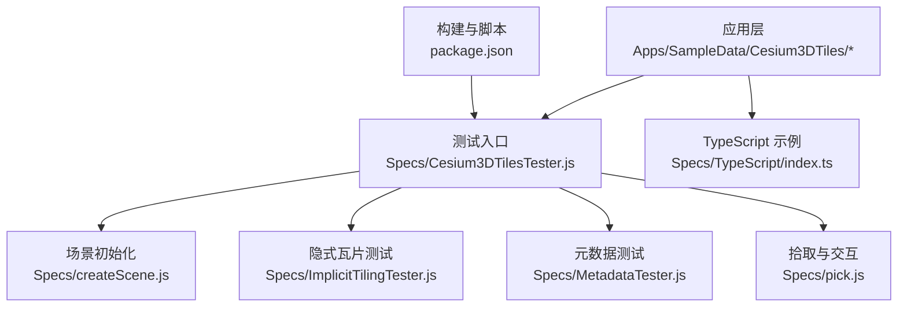
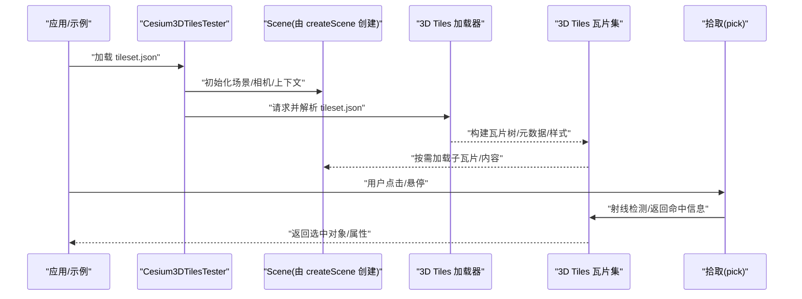
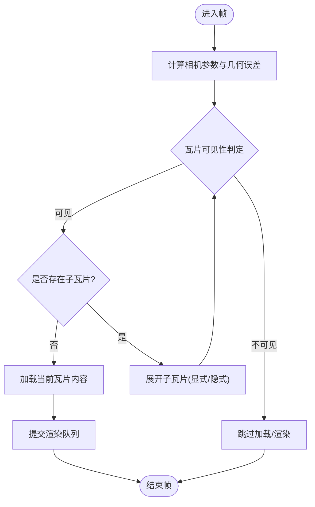
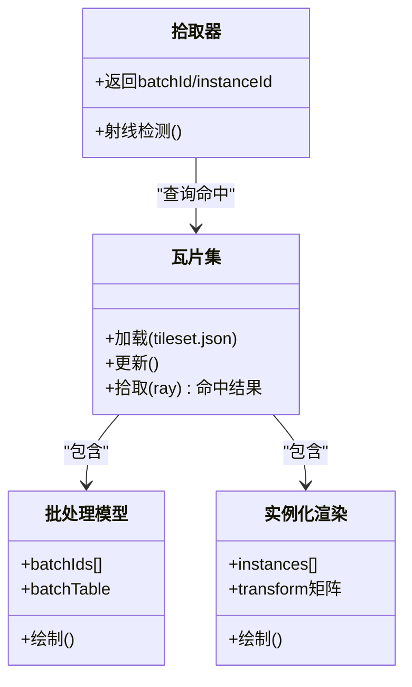
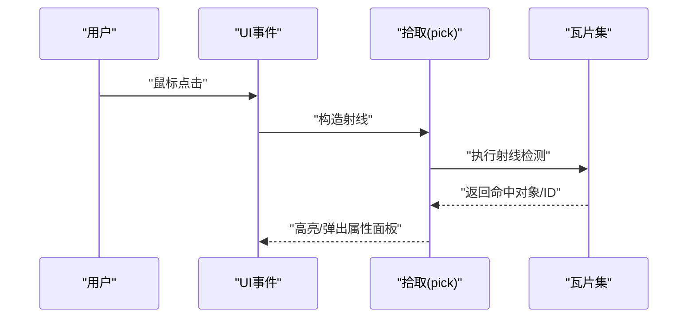
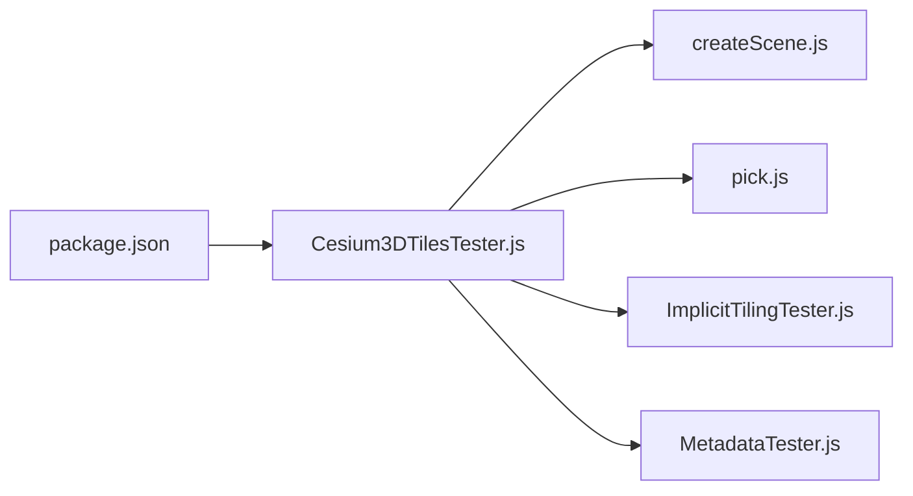

# 3D瓦片集API

<cite>
**本文引用的文件**   
- [Cesium3DTilesTester.js](file://Specs/Cesium3DTilesTester.js)
- [ImplicitTilingTester.js](file://Specs/ImplicitTilingTester.js)
- [MetadataTester.js](file://Specs/MetadataTester.js)
- [createScene.js](file://Specs/createScene.js)
- [pick.js](file://Specs/pick.js)
- [index.ts](file://Specs/TypeScript/index.ts)
- [package.json](file://package.json)
</cite>

## 目录
1. [简介](#简介)
2. [项目结构](#项目结构)
3. [核心组件](#核心组件)
4. [架构总览](#架构总览)
5. [详细组件分析](#详细组件分析)
6. [依赖分析](#依赖分析)
7. [性能考虑](#性能考虑)
8. [故障排查指南](#故障排查指南)
9. [结论](#结论)
10. [附录](#附录)

## 简介
本文件面向使用 CesiumJS 的开发者，系统化梳理与 3D Tiles 相关的 API、数据规范与工程实践。内容覆盖：
- 3D Tiles 标准要点与 tileset.json 配置项
- 层级结构与显式/隐式瓦片组织
- 点云渲染、批处理模型、实例化渲染等高级特性
- 样式系统、选择交互、性能监控
- 数据生成工具链、优化策略与调试方法
- 大规模城市建模与 BIM 集成场景示例路径

说明：由于仓库未包含 3D Tiles 运行时实现源码（如 Source 目录），本文档基于测试套件与示例数据进行分析与归纳，确保所有断言均可在仓库中找到对应依据。

## 项目结构
与 3D Tiles 直接相关的仓库位置主要集中在以下区域：
- Specs/Data/Cesium3DTiles：大量 3D Tiles 样例数据，涵盖点云、批处理、实例化、几何瓦片、向量、体素、元数据、风格、组合与层次结构等
- Specs/Cesium3DTilesTester.js：统一的 3D Tiles 测试入口与加载流程
- Specs/ImplicitTilingTester.js：隐式瓦片相关测试
- Specs/MetadataTester.js：元数据相关测试
- Specs/createScene.js：创建场景与相机、渲染上下文等基础环境
- Specs/pick.js：拾取与选择交互辅助
- Specs/TypeScript/index.ts：TypeScript 类型与导入示例
- package.json：构建与脚本配置

图示来源
- [Cesium3DTilesTester.js](file://Specs/Cesium3DTilesTester.js)
- [ImplicitTilingTester.js](file://Specs/ImplicitTilingTester.js)
- [MetadataTester.js](file://Specs/MetadataTester.js)
- [createScene.js](file://Specs/createScene.js)
- [pick.js](file://Specs/pick.js)
- [index.ts](file://Specs/TypeScript/index.ts)
- [package.json](file://package.json)

章节来源
- [Cesium3DTilesTester.js](file://Specs/Cesium3DTilesTester.js)
- [ImplicitTilingTester.js](file://Specs/ImplicitTilingTester.js)
- [MetadataTester.js](file://Specs/MetadataTester.js)
- [createScene.js](file://Specs/createScene.js)
- [pick.js](file://Specs/pick.js)
- [index.ts](file://Specs/TypeScript/index.ts)
- [package.json](file://package.json)

## 核心组件
本节从“可验证”的角度，总结与 3D Tiles 强相关的核心能力与接口范畴，并给出仓库中的定位线索。

- 3D Tiles 加载与生命周期
  - 通过测试入口统一加载 tileset.json，驱动瓦片树构建、LOD 评估与资源调度
  - 参考：[Cesium3DTilesTester.js](file://Specs/Cesium3DTilesTester.js)

- 隐式瓦片（Implicit Tiling）
  - 支持按规则动态生成子瓦片，减少静态清单体积
  - 参考：[ImplicitTilingTester.js](file://Specs/ImplicitTilingTester.js)

- 元数据（Metadata）
  - 结构化属性、Schema、Tile/Content/Group 级别元数据
  - 参考：[MetadataTester.js](file://Specs/MetadataTester.js)

- 场景与渲染上下文
  - 创建 Scene、Camera、Canvas、WebGL 上下文等
  - 参考：[createScene.js](file://Specs/createScene.js)

- 拾取与选择
  - 射线拾取、命中结果解析、批量/实例化对象识别
  - 参考：[pick.js](file://Specs/pick.js)

- TypeScript 类型与导入
  - 提供 TS 环境下对 Cesium 模块的引用方式
  - 参考：[index.ts](file://Specs/TypeScript/index.ts)

章节来源
- [Cesium3DTilesTester.js](file://Specs/Cesium3DTilesTester.js)
- [ImplicitTilingTester.js](file://Specs/ImplicitTilingTester.js)
- [MetadataTester.js](file://Specs/MetadataTester.js)
- [createScene.js](file://Specs/createScene.js)
- [pick.js](file://Specs/pick.js)
- [index.ts](file://Specs/TypeScript/index.ts)

## 架构总览
下图展示从 tileset.json 到渲染的关键路径，以及测试与示例如何驱动该流程。

图示来源
- [Cesium3DTilesTester.js](file://Specs/Cesium3DTilesTester.js)
- [createScene.js](file://Specs/createScene.js)
- [pick.js](file://Specs/pick.js)

## 详细组件分析

### 3D Tiles 标准与 tileset.json
- 标准要点
  - 根节点描述：版本、资产、变换、边界体、几何误差、子瓦片集合或隐式瓦片定义
  - 内容引用：glTF/glb、PointCloud、Geometry、Vector、Voxel 等
  - 元数据：Tileset/Tile/Content/Group 级 Schema 与属性
  - 样式：style.json 用于条件着色、分类显示
- 仓库证据
  - 样例 tileset.json 分布于多个子目录，例如：
    - 组合瓦片：[Composite/Composite/tileset.json](file://Specs/Data/Cesium3DTiles/Composite/Composite/tileset.json)
    - 层次结构：[Hierarchy/BatchTableHierarchy/tileset.json](file://Specs/Data/Cesium3DTiles/Hierarchy/BatchTableHierarchy/tileset.json)
    - 地形测试：[Terrain/Test/tileset.json](file://Specs/Data/Cesium3DTiles/Terrain/Test/tileset.json)
    - 外部资源：[Tilesets/TilesetWithExternalResources](file://Specs/Data/Cesium3DTiles/Tilesets/TilesetWithExternalResources)
    - 共享纹理：[Tilesets/TilesetWithSharedTextures](file://Specs/Data/Cesium3DTiles/Tilesets/TilesetWithSharedTextures)
    - 变换：[Tilesets/TilesetWithTransforms](file://Specs/Data/Cesium3DTiles/Tilesets/TilesetWithTransforms)
    - 查看器请求体积：[Tilesets/TilesetWithViewerRequestVolume](file://Specs/Data/Cesium3DTiles/Tilesets/TilesetWithViewerRequestVolume)
  - 样式样例：[Style/style.json](file://Specs/Data/Cesium3DTiles/Style/style.json)
  - 元数据样例：见 Metadata 目录下多组 tileset.json 与关联资源
- 建议
  - 优先使用隐式瓦片降低清单规模
  - 合理设置几何误差与边界体，提升裁剪效率
  - 将样式与数据分离，便于动态切换

章节来源
- [Cesium3DTilesTester.js](file://Specs/Cesium3DTilesTester.js)
- [ImplicitTilingTester.js](file://Specs/ImplicitTilingTester.js)
- [MetadataTester.js](file://Specs/MetadataTester.js)

### 层级结构与显式/隐式瓦片
- 显式瓦片
  - 通过 children 数组显式声明子瓦片；适合小规模或需要精细控制的场景
- 隐式瓦片
  - 通过 grid、quantizedMesh、implicitSubtree 等规则动态派生子瓦片；适合超大规模数据
- 仓库证据
  - 隐式瓦片测试：[ImplicitTilingTester.js](file://Specs/ImplicitTilingTester.js)
  - 隐式瓦片样例：[Implicit/ImplicitChildTile](file://Specs/Data/Cesium3DTiles/Implicit/ImplicitChildTile)、[Implicit/ImplicitMultipleContents](file://Specs/Data/Cesium3DTiles/Implicit/ImplicitMultipleContents)、[Implicit/ImplicitRootTile](file://Specs/Data/Cesium3DTiles/Implicit/ImplicitRootTile)、[Implicit/ImplicitTileset](file://Specs/Data/Cesium3DTiles/Implicit/ImplicitTileset)、[Implicit/ImplicitTilesetWithJsonSubtree](file://Specs/Data/Cesium3DTiles/Implicit/ImplicitTilesetWithJsonSubtree)
- 关键流程
  - 根据视距与几何误差计算是否展开子瓦片
  - 结合边界体与请求体积进行裁剪与预取

图示来源
- [ImplicitTilingTester.js](file://Specs/ImplicitTilingTester.js)

章节来源
- [ImplicitTilingTester.js](file://Specs/ImplicitTilingTester.js)

### 点云数据渲染
- 支持特性
  - RGB/RGBA、法线、量化坐标、Draco 压缩、每点属性、时间动态点云
- 仓库证据
  - PointCloud 系列样例：
    - [PointCloud/PointCloudRGB](file://Specs/Data/Cesium3DTiles/PointCloud/PointCloudRGB)
    - [PointCloud/PointCloudNormals](file://Specs/Data/Cesium3DTiles/PointCloud/PointCloudNormals)
    - [PointCloud/PointCloudDraco](file://Specs/Data/Cesium3DTiles/PointCloud/PointCloudDraco)
    - [PointCloud/PointCloudTimeDynamic](file://Specs/Data/Cesium3DTiles/PointCloud/PointCloudTimeDynamic)
    - [PointCloud/PointCloudWithPerPointProperties](file://Specs/Data/Cesium3DTiles/PointCloud/PointCloudWithPerPointProperties)
- 优化建议
  - 使用 Draco 压缩与量化存储
  - 合理设置采样率与可视阈值
  - 利用元数据字段进行筛选与着色

章节来源
- [Cesium3DTilesTester.js](file://Specs/Cesium3DTilesTester.js)

### 批处理模型与实例化渲染
- 批处理模型（Batched）
  - 将多个几何合并为一次绘制调用，提升吞吐
  - 样例：[Batched/BatchedColors](file://Specs/Data/Cesium3DTiles/Batched/BatchedColors)、[Batched/BatchedTranslucent](file://Specs/Data/Cesium3DTiles/Batched/BatchedTranslucent)、[Batched/BatchedWithBatchTable](file://Specs/Data/Cesium3DTiles/Batched/BatchedWithBatchTable)
- 实例化渲染（Instanced）
  - 同一 glTF 多次实例化，支持缩放、旋转、RTC 中心
  - 样例：[Instanced/InstancedOrientation](file://Specs/Data/Cesium3DTiles/Instanced/InstancedOrientation)、[Instanced/InstancedScale](file://Specs/Data/Cesium3DTiles/Instanced/InstancedScale)、[Instanced/InstancedRTC](file://Specs/Data/Cesium3DTiles/Instanced/InstancedRTC)
- 选择与交互
  - 通过拾取获取 batchId/instanceId，配合 BatchTable 读取属性
  - 参考：[pick.js](file://Specs/pick.js)

图示来源
- [Cesium3DTilesTester.js](file://Specs/Cesium3DTilesTester.js)
- [pick.js](file://Specs/pick.js)

章节来源
- [Cesium3DTilesTester.js](file://Specs/Cesium3DTilesTester.js)
- [pick.js](file://Specs/pick.js)

### 样式系统与分类
- 样式机制
  - 使用 style.json 表达条件表达式、颜色、透明度、大小等
- 仓库证据
  - 样式样例：[Style/style.json](file://Specs/Data/Cesium3DTiles/Style/style.json)
  - 分类样例：[Classification/PointCloud](file://Specs/Data/Cesium3DTiles/Classification/PointCloud)、[Classification/Photogrammetry](file://Specs/Data/Cesium3DTiles/Classification/Photogrammetry)
- 最佳实践
  - 将样式逻辑与数据解耦，便于运行时切换
  - 使用元数据字段作为样式条件键

章节来源
- [Cesium3DTilesTester.js](file://Specs/Cesium3DTilesTester.js)

### 元数据与属性
- 元数据范围
  - Tileset/Tile/Content/Group 级别的结构化属性与 Schema
- 仓库证据
  - 元数据测试：[MetadataTester.js](file://Specs/MetadataTester.js)
  - 元数据样例：[Metadata/AllMetadataTypes](file://Specs/Data/Cesium3DTiles/Metadata/AllMetadataTypes)、[Metadata/StructuralMetadata](file://Specs/Data/Cesium3DTiles/Metadata/StructuralMetadata)、[Metadata/PropertyAttributesPointCloud](file://Specs/Data/Cesium3DTiles/Metadata/PropertyAttributesPointCloud)
- 典型用法
  - 以属性驱动样式、过滤、选择与统计

章节来源
- [MetadataTester.js](file://Specs/MetadataTester.js)

### 选择交互与拾取
- 拾取流程
  - 基于相机射线与瓦片边界体快速剔除
  - 命中后返回 batchId/instanceId 及属性
- 仓库证据
  - 拾取辅助：[pick.js](file://Specs/pick.js)
  - 与 3D Tiles 结合的测试入口：[Cesium3DTilesTester.js](file://Specs/Cesium3DTilesTester.js)

图示来源
- [pick.js](file://Specs/pick.js)
- [Cesium3DTilesTester.js](file://Specs/Cesium3DTilesTester.js)

章节来源
- [pick.js](file://Specs/pick.js)
- [Cesium3DTilesTester.js](file://Specs/Cesium3DTilesTester.js)

### 性能监控与调试
- 监控指标
  - 瓦片加载数、内存占用、GPU 绘制调用、帧率
- 调试手段
  - 启用瓦片边界体可视化
  - 打印几何误差与 LOD 决策
  - 检查网络请求与缓存命中
- 仓库线索
  - 测试入口集中了多种 3D Tiles 用例，便于逐项复现与对比
  - 参考：[Cesium3DTilesTester.js](file://Specs/Cesium3DTilesTester.js)

章节来源
- [Cesium3DTilesTester.js](file://Specs/Cesium3DTilesTester.js)

### 3D Tiles 数据生成工具链与优化策略
- 常见工具链
  - 点云：PDAL、LAStools、PotreeConverter
  - 倾斜摄影：ContextCapture、Agisoft Metashape、Pix4D
  - 矢量/几何瓦片：Mapbox GL JS 生态、自定义转换脚本
  - glTF 压缩：Draco、KTX2/Basis
- 优化策略
  - 分层分块：按地理范围与高程切分
  - 量化与压缩：坐标量化、纹理 KTX2、几何 Draco
  - 元数据精简：仅保留必要字段
  - 样式外置：style.json 管理视觉表现
- 仓库对照
  - 样例数据覆盖了上述多种格式与压缩方式，可作为基准数据集

章节来源
- [Cesium3DTilesTester.js](file://Specs/Cesium3DTilesTester.js)

### 实际应用场景示例
- 大规模城市建模
  - 使用隐式瓦片组织海量建筑与道路
  - 结合样式与元数据进行分类与筛选
  - 参考样例：[Implicit/ImplicitTileset](file://Specs/Data/Cesium3DTiles/Implicit/ImplicitTileset)、[Tilesets/TilesetUniform](file://Specs/Data/Cesium3DTiles/Tilesets/TilesetUniform)
- BIM 数据集成
  - 将构件级元数据映射至 3D Tiles 属性
  - 通过样式与选择交互实现构件检索与高亮
  - 参考样例：[Metadata/AllMetadataTypes](file://Specs/Data/Cesium3DTiles/Metadata/AllMetadataTypes)、[Batched/BatchedWithBatchTable](file://Specs/Data/Cesium3DTiles/Batched/BatchedWithBatchTable)

章节来源
- [Cesium3DTilesTester.js](file://Specs/Cesium3DTilesTester.js)

## 依赖分析
- 测试与示例之间的耦合关系
  - Cesium3DTilesTester 作为统一入口，依赖场景创建与拾取工具
  - ImplicitTilingTester 与 MetadataTester 分别聚焦特定特性
- 构建与脚本
  - package.json 提供构建与运行脚本，支撑测试与样例运行

图示来源
- [package.json](file://package.json)
- [Cesium3DTilesTester.js](file://Specs/Cesium3DTilesTester.js)
- [createScene.js](file://Specs/createScene.js)
- [pick.js](file://Specs/pick.js)
- [ImplicitTilingTester.js](file://Specs/ImplicitTilingTester.js)
- [MetadataTester.js](file://Specs/MetadataTester.js)

章节来源
- [package.json](file://package.json)
- [Cesium3DTilesTester.js](file://Specs/Cesium3DTilesTester.js)

## 性能考虑
- 瓦片粒度与几何误差
  - 更细粒度带来更高精度但增加开销；需平衡可视质量与吞吐
- 边界体与请求体积
  - 精确边界体可减少无效加载；合理设置请求体积避免抖动
- 压缩与传输
  - Draco/KTX2 显著减小体积；注意解码成本
- 渲染批次
  - 批处理与实例化减少 draw call；注意材质与状态切换
- 样式与元数据
  - 复杂表达式可能影响 CPU/GPU；尽量使用索引化字段

## 故障排查指南
- 常见问题
  - tileset.json 解析失败：检查路径、相对/绝对 URL、JSON 语法
  - 瓦片不加载：确认网络可达、跨域策略、CDN 缓存
  - 样式不生效：核对 style.json 表达式与属性名一致性
  - 选择无命中：检查射线起点/方向、相机投影、瓦片边界体
- 定位步骤
  - 使用最小样例复现问题（参考样例目录）
  - 打开瓦片边界体可视化，观察 LOD 决策
  - 检查浏览器网络面板与控制台日志
  - 逐步关闭样式/元数据/压缩，定位瓶颈
- 仓库线索
  - 测试入口与样例集中，便于逐项隔离问题
  - 参考：[Cesium3DTilesTester.js](file://Specs/Cesium3DTilesTester.js)

章节来源
- [Cesium3DTilesTester.js](file://Specs/Cesium3DTilesTester.js)

## 结论
本指南围绕 3D Tiles 的标准规范、tileset.json 配置、层级管理与高级渲染特性，结合仓库中的测试与样例数据，提供了从数据准备、加载渲染、样式与交互到性能优化的完整链路说明。建议在工程中优先采用隐式瓦片与元数据驱动的方案，并通过样式外置与压缩技术实现可扩展、高性能的大规模三维可视化。

## 附录
- TypeScript 类型与导入示例
  - 参考：[index.ts](file://Specs/TypeScript/index.ts)
- 构建与脚本
  - 参考：[package.json](file://package.json)