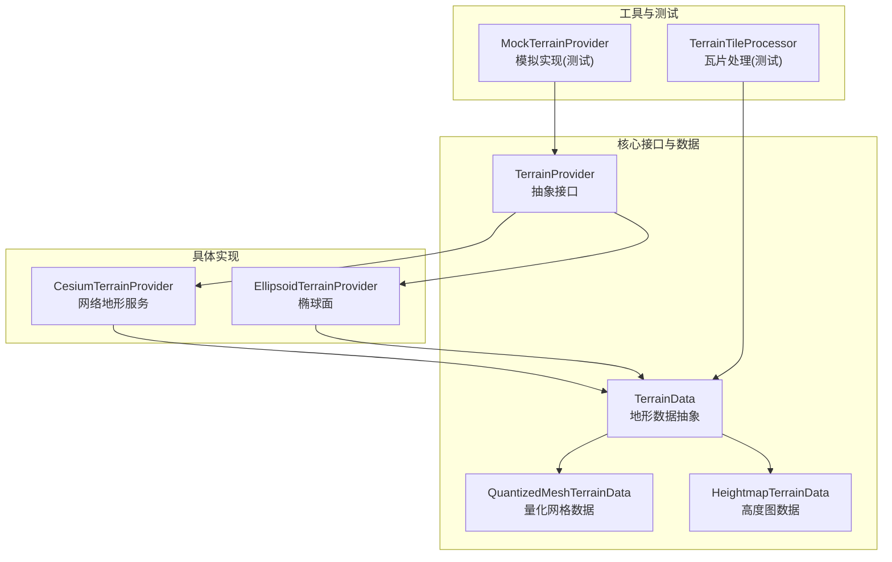
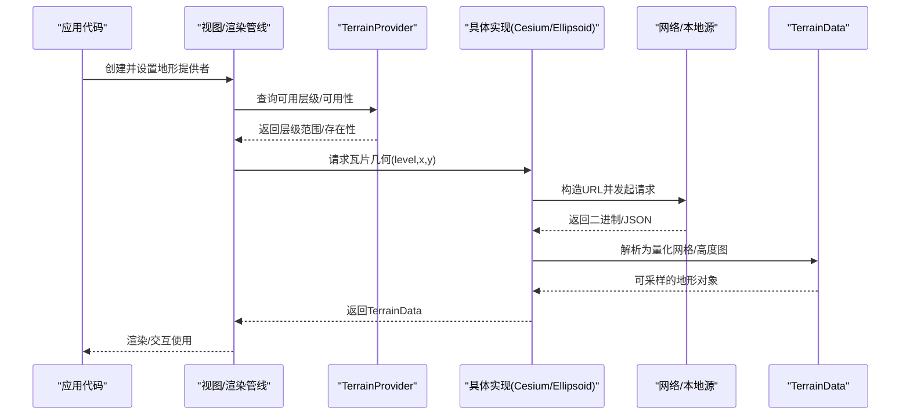
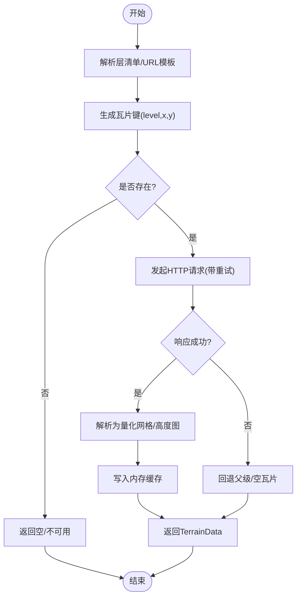
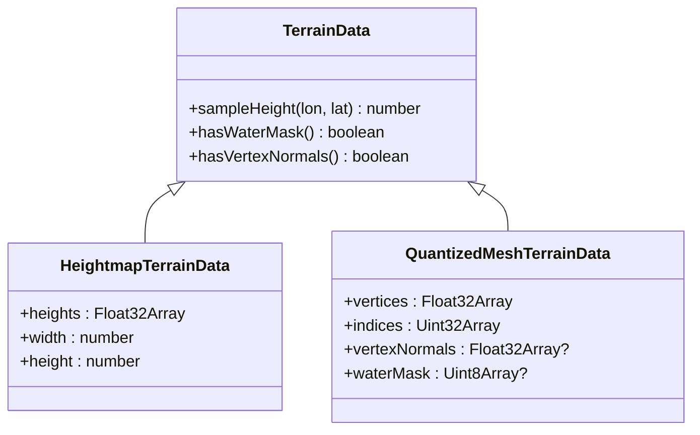
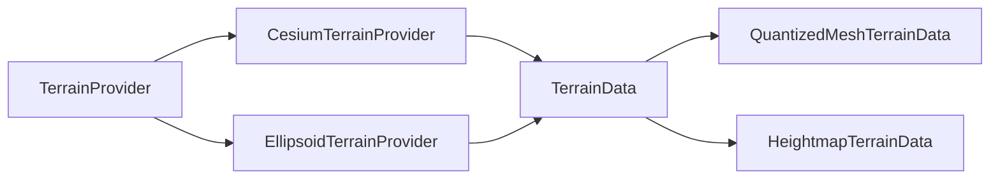

# 地形数据提供者API

<cite>
**本文引用的文件**   
- [TerrainProvider.js](file://Source/Core/TerrainProvider.js)
- [CesiumTerrainProvider.js](file://Source/Core/CesiumTerrainProvider.js)
- [EllipsoidTerrainProvider.js](file://Source/Core/EllipsoidTerrainProvider.js)
- [TerrainData.js](file://Source/Core/TerrainData.js)
- [QuantizedMeshTerrainData.js](file://Source/Core/QuantizedMeshTerrainData.js)
- [HeightmapTerrainData.js](file://Source/Core/HeightmapTerrainData.js)
- [TerrainTileProcessor.js](file://Specs/TerrainTileProcessor.js)
- [MockTerrainProvider.js](file://Specs/MockTerrainProvider.js)
</cite>

## 目录
1. [简介](#简介)
2. [项目结构](#项目结构)
3. [核心组件](#核心组件)
4. [架构总览](#架构总览)
5. [详细组件分析](#详细组件分析)
6. [依赖关系分析](#依赖关系分析)
7. [性能考虑](#性能考虑)
8. [故障排查指南](#故障排查指南)
9. [结论](#结论)
10. [附录](#附录)

## 简介
本文件面向开发者，系统化梳理 Cesium 地形数据提供者的 API 与实现机制，重点覆盖：
- TerrainProvider 基类接口设计与职责边界
- CesiumTerrainProvider（网络地形）与 EllipsoidTerrainProvider（椭球面）的使用方式
- 地形瓦片加载、高度图数据处理与 LOD 策略配置
- 自定义地形提供者的开发指南（请求处理、缓存管理、错误恢复）
- 集成示例与性能优化建议

## 项目结构
与地形数据提供者相关的核心源码位于 Source/Core 目录，测试与样例位于 Specs。关键文件包括：
- 抽象接口与通用数据结构：TerrainProvider、TerrainData、QuantizedMeshTerrainData、HeightmapTerrainData
- 具体实现：CesiumTerrainProvider、EllipsoidTerrainProvider
- 处理器与测试桩：Specs/TerrainTileProcessor.js、Specs/MockTerrainProvider.js

图表来源
- [TerrainProvider.js](file://Source/Core/TerrainProvider.js)
- [CesiumTerrainProvider.js](file://Source/Core/CesiumTerrainProvider.js)
- [EllipsoidTerrainProvider.js](file://Source/Core/EllipsoidTerrainProvider.js)
- [TerrainData.js](file://Source/Core/TerrainData.js)
- [QuantizedMeshTerrainData.js](file://Source/Core/QuantizedMeshTerrainData.js)
- [HeightmapTerrainData.js](file://Source/Core/HeightmapTerrainData.js)
- [TerrainTileProcessor.js](file://Specs/TerrainTileProcessor.js)
- [MockTerrainProvider.js](file://Specs/MockTerrainProvider.js)

章节来源
- [TerrainProvider.js](file://Source/Core/TerrainProvider.js)
- [CesiumTerrainProvider.js](file://Source/Core/CesiumTerrainProvider.js)
- [EllipsoidTerrainProvider.js](file://Source/Core/EllipsoidTerrainProvider.js)
- [TerrainData.js](file://Source/Core/TerrainData.js)
- [QuantizedMeshTerrainData.js](file://Source/Core/QuantizedMeshTerrainData.js)
- [HeightmapTerrainData.js](file://Source/Core/HeightmapTerrainData.js)
- [TerrainTileProcessor.js](file://Specs/TerrainTileProcessor.js)
- [MockTerrainProvider.js](file://Specs/MockTerrainProvider.js)

## 核心组件
- TerrainProvider（抽象接口）
  - 定义获取地形数据的统一契约，包括：
    - 查询指定瓦片键的可用性与层级信息
    - 异步加载并返回 TerrainData 实例
    - 暴露元数据（如版权、最大最小层级、是否支持水遮罩等）
  - 典型方法语义：
    - getAvailableLevels()：返回支持的层级范围
    - hasTileAtPath(level, x, y)：判断某瓦片是否存在
    - requestTileGeometry(level, x, y)：异步请求瓦片几何
    - credit：版权信息
- TerrainData（抽象数据）
  - 封装单个瓦片的地形几何与可选法线、水遮罩等属性
  - 提供采样接口以在给定经纬度处计算高度
- QuantizedMeshTerrainData / HeightmapTerrainData
  - 两种常见瓦片格式的数据载体：
    - 量化网格：包含顶点坐标、索引、可选法线与扩展字段
    - 高度图：二维高度数组，便于插值采样
- CesiumTerrainProvider
  - 对接 Cesium Ion 或兼容 Cesium Terrain 协议的服务
  - 负责层清单解析、瓦片 URL 构建、并发控制、重试与降级
- EllipsoidTerrainProvider
  - 基于参考椭球面的“零高程”地形，用于无真实高程场景或离线基准

章节来源
- [TerrainProvider.js](file://Source/Core/TerrainProvider.js)
- [TerrainData.js](file://Source/Core/TerrainData.js)
- [QuantizedMeshTerrainData.js](file://Source/Core/QuantizedMeshTerrainData.js)
- [HeightmapTerrainData.js](file://Source/Core/HeightmapTerrainData.js)
- [CesiumTerrainProvider.js](file://Source/Core/CesiumTerrainProvider.js)
- [EllipsoidTerrainProvider.js](file://Source/Core/EllipsoidTerrainProvider.js)

## 架构总览
下图展示从调用方到具体实现的端到端流程，以及数据形态转换。

图表来源
- [CesiumTerrainProvider.js](file://Source/Core/CesiumTerrainProvider.js)
- [EllipsoidTerrainProvider.js](file://Source/Core/EllipsoidTerrainProvider.js)
- [TerrainData.js](file://Source/Core/TerrainData.js)
- [QuantizedMeshTerrainData.js](file://Source/Core/QuantizedMeshTerrainData.js)
- [HeightmapTerrainData.js](file://Source/Core/HeightmapTerrainData.js)

## 详细组件分析

### TerrainProvider 抽象接口设计
- 职责边界
  - 对外暴露统一的“按瓦片键获取地形数据”的接口
  - 屏蔽底层协议差异（网络地形、本地文件、内存数据）
- 关键能力
  - 可用性探测：hasTileAtPath(level, x, y)
  - 资源发现：getAvailableLevels()
  - 异步加载：requestTileGeometry(level, x, y)
  - 元数据：credit、maximumLevel、minimumLevel 等
- 设计要点
  - 所有 I/O 均为异步，避免阻塞主线程
  - 返回值统一为 TerrainData 或其子类，便于上层采样与渲染
  - 错误路径需抛出明确异常，供上层重试/降级

章节来源
- [TerrainProvider.js](file://Source/Core/TerrainProvider.js)

### CesiumTerrainProvider 网络地形实现
- 功能概述
  - 解析层清单 JSON，构建瓦片 URL 模板
  - 支持多 URL 冗余与自动切换
  - 根据响应内容类型选择解析器（量化网格/高度图）
- 请求与缓存
  - 内部维护请求队列与去重逻辑
  - 结合浏览器缓存与内存缓存提升命中率
- 错误恢复
  - 对 4xx/5xx 进行指数退避重试
  - 失败时回退至父级瓦片或空数据占位
- 配置项（概念说明）
  - url：地形服务根地址
  - maximumLevel/minimumLevel：层级范围
  - credit：版权信息
  - enableWaterMask：是否启用水面遮罩
  - requestVertexNormals：是否请求顶点法线
  - retryAttempts/retryDelay：重试策略

图表来源
- [CesiumTerrainProvider.js](file://Source/Core/CesiumTerrainProvider.js)
- [QuantizedMeshTerrainData.js](file://Source/Core/QuantizedMeshTerrainData.js)
- [HeightmapTerrainData.js](file://Source/Core/HeightmapTerrainData.js)

章节来源
- [CesiumTerrainProvider.js](file://Source/Core/CesiumTerrainProvider.js)

### EllipsoidTerrainProvider 椭球面实现
- 行为特征
  - 不提供真实高程，所有位置高度为参考椭球面
  - 适用于离线基准、无高程数据或仅做平面投影的场景
- 适用场景
  - 快速搭建基础地球
  - 作为自定义地形的“兜底”提供者
- 配置项（概念说明）
  - ellipsoid：参考椭球体
  - credit：版权信息

章节来源
- [EllipsoidTerrainProvider.js](file://Source/Core/EllipsoidTerrainProvider.js)

### TerrainData 与高度图/量化网格
- TerrainData
  - 提供按经纬度采样高度的接口
  - 可选包含法线、水遮罩等附加通道
- HeightmapTerrainData
  - 存储规则网格的高度数组
  - 适合轻量级地形与快速插值
- QuantizedMeshTerrainData
  - 存储三角网格的量化顶点与索引
  - 支持扩展字段（法线、水遮罩、元数据等）

图表来源
- [TerrainData.js](file://Source/Core/TerrainData.js)
- [HeightmapTerrainData.js](file://Source/Core/HeightmapTerrainData.js)
- [QuantizedMeshTerrainData.js](file://Source/Core/QuantizedMeshTerrainData.js)

章节来源
- [TerrainData.js](file://Source/Core/TerrainData.js)
- [HeightmapTerrainData.js](file://Source/Core/HeightmapTerrainData.js)
- [QuantizedMeshTerrainData.js](file://Source/Core/QuantizedMeshTerrainData.js)

### 自定义地形提供者开发指南
- 继承与实现
  - 继承 TerrainProvider，实现以下核心方法：
    - getAvailableLevels()
    - hasTileAtPath(level, x, y)
    - requestTileGeometry(level, x, y)
  - 按需暴露 credit、maximumLevel、minimumLevel 等元数据
- 请求处理
  - 将 level/x/y 映射为唯一键
  - 支持并发限制与请求去重
  - 对网络/文件系统/IoC 容器进行抽象，便于替换
- 缓存管理
  - 内存缓存：按键缓存已解析的 TerrainData
  - 磁盘/IndexedDB 缓存：持久化高频瓦片
  - 淘汰策略：LRU 或基于时间/大小阈值
- 错误恢复
  - 区分可重试错误（网络抖动、超时）与不可重试错误（404、格式错误）
  - 指数退避与熔断保护
  - 失败时返回父级或空瓦片，保证渲染连续性
- 单元测试
  - 使用 MockTerrainProvider 验证上层逻辑
  - 使用 TerrainTileProcessor 校验瓦片解析与采样正确性

章节来源
- [TerrainProvider.js](file://Source/Core/TerrainProvider.js)
- [MockTerrainProvider.js](file://Specs/MockTerrainProvider.js)
- [TerrainTileProcessor.js](file://Specs/TerrainTileProcessor.js)

### 集成示例（步骤式说明）
- 使用 CesiumTerrainProvider
  - 初始化并提供 url、层级范围与版权信息
  - 将实例设置到视图中
- 使用 EllipsoidTerrainProvider
  - 在无高程数据时作为默认地形
- 自定义提供者
  - 实现 TerrainProvider 接口
  - 注册到视图替代内置提供者
- 注意
  - 合理设置 maximumLevel/minimumLevel 以避免过度请求
  - 开启必要的扩展（法线、水遮罩）仅在需要时启用

章节来源
- [CesiumTerrainProvider.js](file://Source/Core/CesiumTerrainProvider.js)
- [EllipsoidTerrainProvider.js](file://Source/Core/EllipsoidTerrainProvider.js)

## 依赖关系分析
- 耦合与内聚
  - TerrainProvider 与具体实现解耦，利于替换与测试
  - TerrainData 与其子类的内聚度高，便于扩展新格式
- 外部依赖
  - 网络请求、缓存、解码器等由具体实现引入
- 潜在循环依赖
  - 通过抽象层隔离，避免 Provider 与 Data 的直接双向依赖

图表来源
- [TerrainProvider.js](file://Source/Core/TerrainProvider.js)
- [CesiumTerrainProvider.js](file://Source/Core/CesiumTerrainProvider.js)
- [EllipsoidTerrainProvider.js](file://Source/Core/EllipsoidTerrainProvider.js)
- [TerrainData.js](file://Source/Core/TerrainData.js)
- [QuantizedMeshTerrainData.js](file://Source/Core/QuantizedMeshTerrainData.js)
- [HeightmapTerrainData.js](file://Source/Core/HeightmapTerrainData.js)

章节来源
- [TerrainProvider.js](file://Source/Core/TerrainProvider.js)
- [CesiumTerrainProvider.js](file://Source/Core/CesiumTerrainProvider.js)
- [EllipsoidTerrainProvider.js](file://Source/Core/EllipsoidTerrainProvider.js)
- [TerrainData.js](file://Source/Core/TerrainData.js)
- [QuantizedMeshTerrainData.js](file://Source/Core/QuantizedMeshTerrainData.js)
- [HeightmapTerrainData.js](file://Source/Core/HeightmapTerrainData.js)

## 性能考虑
- 瓦片粒度与层级
  - 合理设置 minimumLevel/maximumLevel，避免过细层级导致请求风暴
- 并发与队列
  - 限制并发数，避免带宽拥塞；合并重复请求
- 缓存命中
  - 优先使用内存缓存，必要时落盘；采用 LRU 淘汰
- 数据体积
  - 优先使用量化网格以减少传输与解析开销
  - 按需启用法线/水遮罩等扩展
- 错误与回退
  - 快速失败与回退父级，保障帧率稳定
- 采样优化
  - 在热点区域预取相邻瓦片，减少卡顿

[本节为通用指导，不直接分析具体文件]

## 故障排查指南
- 常见问题
  - 404/410：检查瓦片键与 URL 模板是否正确
  - 429/5xx：调整重试次数与退避间隔
  - 解析失败：确认响应内容与预期格式一致
- 定位手段
  - 使用 MockTerrainProvider 复现问题
  - 借助 TerrainTileProcessor 校验瓦片解析链路
- 恢复策略
  - 回退至父级瓦片或空瓦片
  - 记录失败统计，触发熔断或告警

章节来源
- [MockTerrainProvider.js](file://Specs/MockTerrainProvider.js)
- [TerrainTileProcessor.js](file://Specs/TerrainTileProcessor.js)

## 结论
通过统一的 TerrainProvider 抽象与标准化的 TerrainData 模型，Cesium 实现了灵活可扩展的地形体系。CesiumTerrainProvider 与 EllipsoidTerrainProvider 覆盖了在线与离线两大典型场景。遵循本文的开发指南与性能建议，可高效构建稳定、高性能的自定义地形服务。

[本节为总结性内容，不直接分析具体文件]

## 附录
- 术语
  - 瓦片键：由层级与行列号组成的唯一标识
  - 量化网格：对顶点坐标进行量化压缩的三角网格数据
  - 高度图：规则网格上的高度采样矩阵
- 相关测试与样例
  - Specs/MockTerrainProvider.js：模拟地形提供者，便于单元测试
  - Specs/TerrainTileProcessor.js：瓦片处理与校验工具

章节来源
- [MockTerrainProvider.js](file://Specs/MockTerrainProvider.js)
- [TerrainTileProcessor.js](file://Specs/TerrainTileProcessor.js)