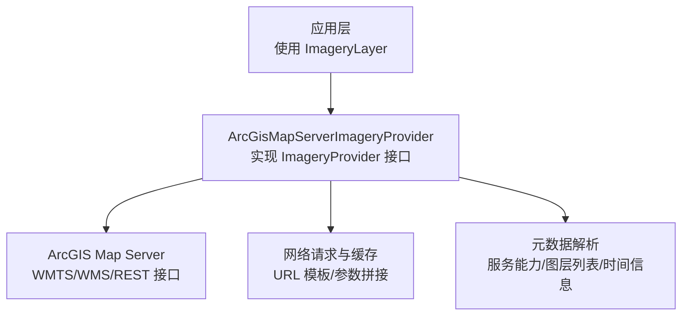
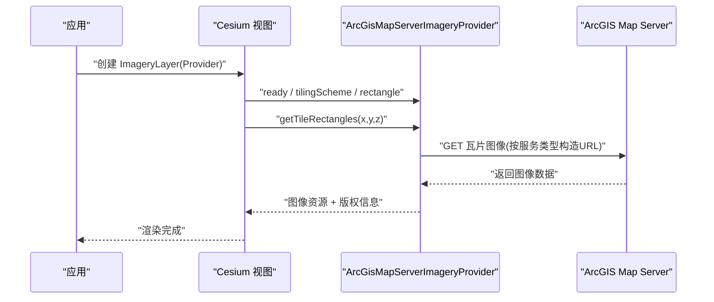
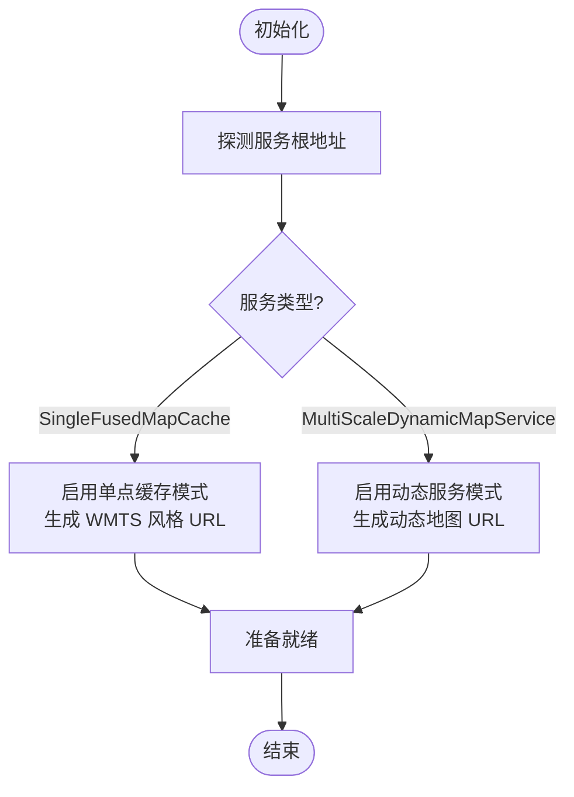
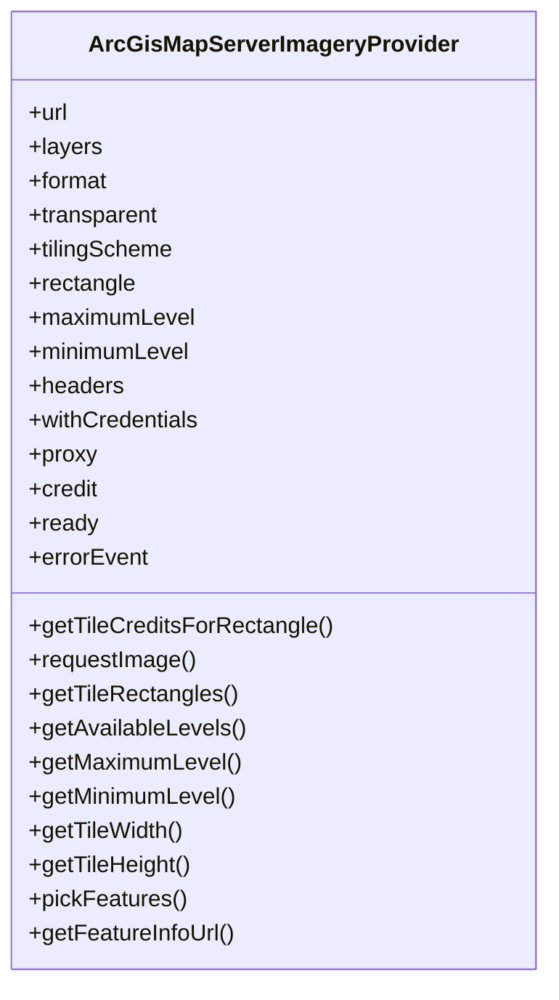
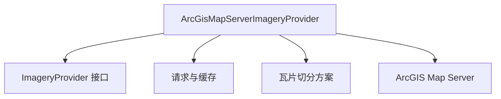

# ArcGIS地图服务提供者

<cite>
**本文引用的文件**   
- [ArcGisMapServerImageryProvider.js](file://Source/Scene/ImageryProviders/ArcGisMapServerImageryProvider.js)
- [ArcGisMapServerImageryProvider.spec.js](file://Specs/Specs/Scene/ImageryProviders/ArcGisMapServerImageryProvider.spec.js)
</cite>

## 目录
1. [简介](#简介)
2. [项目结构](#项目结构)
3. [核心组件](#核心组件)
4. [架构总览](#架构总览)
5. [详细组件分析](#详细组件分析)
6. [依赖分析](#依赖分析)
7. [性能考虑](#性能考虑)
8. [故障排查指南](#故障排查指南)
9. [结论](#结论)
10. [附录](#附录)

## 简介
本文件为 Cesium 中 ArcGIS Map Server 影像提供器的完整 API 文档，聚焦于 ArcGisMapServerImageryProvider 的配置选项、服务发现机制与动态图层支持。内容涵盖：
- 单点服务（SingleFusedMapCache）与多分辨率金字塔（MultiScaleDynamicMapService）两种服务模式的区别与适用场景
- WMS 兼容模式配置要点
- 认证设置与企业级集成最佳实践
- 时间动态图层的集成方式
- 常见错误处理与性能优化建议

## 项目结构
ArcGIS Map Server 影像提供器位于 Scene 的 ImageryProviders 模块下，测试用例位于 Specs 对应路径。该提供器遵循 Cesium 的 ImageryProvider 接口约定，负责与服务端交互、解析元数据、构建瓦片请求并返回图像资源。

[本节为概念性说明，不直接分析具体文件，故无“章节来源”]

## 核心组件
ArcGisMapServerImageryProvider 是面向 ArcGIS Map Server 的影像提供器，主要职责包括：
- 服务发现：自动探测服务类型（单点缓存或多分辨率动态服务），识别支持的格式、投影与范围
- 瓦片请求：根据服务类型生成合适的 URL 模板与参数（如 L、R、T、B、X、Y、Z 或 X、Y、SCALE_FACTOR）
- 动态图层：支持在请求时注入图层可见性与样式参数
- 时间动态：支持时间切片与时间区间查询
- WMS 兼容：以 WMS GetMap 形式访问部分 ArcGIS 服务
- 认证：支持自定义请求头、凭据策略与跨域处理

关键能力映射到接口方法（示例路径见“章节来源”）：
- getTileCreditsForRectangle: 获取瓦片版权信息
- requestImage: 发起瓦片图像请求
- getTileRectangles: 计算瓦片地理范围
- getAvailableLevels: 获取可用层级
- getMaximumLevel: 获取最大层级
- getMinimumLevel: 获取最小层级
- getTileWidth: 获取瓦片宽度
- getTileHeight: 获取瓦片高度
- credit: 全局版权信息
- ready: 服务是否就绪
- errorEvent: 错误事件
- tileDiscardPolicy: 瓦片丢弃策略
- hasAlphaChannel: 是否包含透明度通道
- rectangle: 服务覆盖范围
- tilingScheme: 瓦片切分方案
- proxy: 代理对象
- pickFeatures: 拾取要素（可选）
- getFeatureInfoUrl: 获取 GetFeatureInfo 链接（WMS 模式）

**章节来源**
- [ArcGisMapServerImageryProvider.js](file://Source/Scene/ImageryProviders/ArcGisMapServerImageryProvider.js)
- [ArcGisMapServerImageryProvider.spec.js](file://Specs/Specs/Scene/ImageryProviders/ArcGisMapServerImageryProvider.spec.js)

## 架构总览
下图展示了 ArcGisMapServerImageryProvider 与 Cesium 渲染管线及 ArcGIS 服务之间的交互关系。

**图表来源**
- [ArcGisMapServerImageryProvider.js](file://Source/Scene/ImageryProviders/ArcGisMapServerImageryProvider.js)

**章节来源**
- [ArcGisMapServerImageryProvider.js](file://Source/Scene/ImageryProviders/ArcGisMapServerImageryProvider.js)

## 详细组件分析

### 服务发现与模式选择
ArcGisMapServerImageryProvider 会根据服务根地址自动探测服务类型：
- SingleFusedMapCache（单点缓存）：通常基于 WMTS 风格的 REST 接口，使用 L/R/T/B 或 X/Y/Z 等参数定位瓦片
- MultiScaleDynamicMapService（多分辨率动态服务）：基于动态地图服务，常通过 X/Y/SCALE_FACTOR 或类似参数进行缩放控制

服务发现流程（概念流程图）：

[本节为概念性说明，不直接分析具体文件，故无“章节来源”]

### 配置选项概览
以下为常用配置项类别（具体键名与默认值请参考源码定义）：
- 基础连接
  - url: 服务根地址
  - layers: 图层列表（用于动态服务）
  - format: 图像格式（如 png/jpg）
  - transparent: 是否透明
  - width/height: 输出图像尺寸
- 投影与范围
  - tilingScheme: 瓦片切分方案（WebMercator/WGS84QuadTree 等）
  - rectangle: 服务覆盖范围（可被服务端能力覆盖）
- 动态图层与样式
  - layerIds: 指定图层 ID 集合
  - layerNames: 指定图层名称集合
  - layerDefinitions: 图层过滤表达式
  - timeExtent/time: 时间范围或时间点
- WMS 兼容
  - version: WMS 版本
  - styles: 样式名
  - srs/crs: 坐标参考系
  - bbox: 边界框
  - getFeatureInfoUrl: GetFeatureInfo 端点
- 认证与跨域
  - headers: 自定义请求头（如 Authorization）
  - withCredentials: 是否携带凭据
  - proxy: 代理对象
- 性能与容错
  - maximumLevel/minimumLevel: 层级限制
  - tileDiscardPolicy: 瓦片丢弃策略
  - errorEvent: 错误回调
  - credit: 版权信息

**章节来源**
- [ArcGisMapServerImageryProvider.js](file://Source/Scene/ImageryProviders/ArcGisMapServerImageryProvider.js)

### 单点服务（SingleFusedMapCache）详解
- 特点
  - 预生成瓦片，适合静态底图与高并发访问
  - 典型参数：L/R/T/B 或 X/Y/Z
- 适用场景
  - 全球或区域高分辨率底图
  - 对响应延迟敏感的应用
- 注意事项
  - 需确认服务是否暴露 WMTS 风格接口
  - 注意层级与瓦片尺寸一致性

**章节来源**
- [ArcGisMapServerImageryProvider.js](file://Source/Scene/ImageryProviders/ArcGisMapServerImageryProvider.js)

### 多分辨率金字塔（MultiScaleDynamicMapService）详解
- 特点
  - 动态合成图像，支持实时样式与过滤
  - 典型参数：X/Y/SCALE_FACTOR 或等效缩放参数
- 适用场景
  - 需要频繁更新样式、叠加业务图层
  - 需要时间动态或条件渲染
- 注意事项
  - 服务器负载较高，需合理设置 maximumLevel
  - 注意图层定义与样式复杂度对性能的影响

**章节来源**
- [ArcGisMapServerImageryProvider.js](file://Source/Scene/ImageryProviders/ArcGisMapServerImageryProvider.js)

### WMS 兼容模式配置
当 ArcGIS 服务以 WMS 形式暴露时，可通过以下配置启用兼容模式：
- 指定 version、styles、crs/srs、bbox、width/height
- 设置 getFeatureInfoUrl 以支持要素信息查询
- 注意与动态服务参数的冲突，避免重复传递

**章节来源**
- [ArcGisMapServerImageryProvider.js](file://Source/Scene/ImageryProviders/ArcGisMapServerImageryProvider.js)

### 认证设置
企业级环境通常需要认证：
- 使用 headers 注入令牌（如 Authorization: Bearer <token>）
- 开启 withCredentials 以允许携带 Cookie 或会话
- 配置 proxy 解决跨域问题
- 确保服务端 CORS 策略允许前端域名

**章节来源**
- [ArcGisMapServerImageryProvider.js](file://Source/Scene/ImageryProviders/ArcGisMapServerImageryProvider.js)

### 时间动态图层集成
- 支持 timeExtent 与 time 参数，用于时间切片或时间区间查询
- 适用于气象、交通、监测等时序数据可视化
- 注意服务端时间字段与客户端时间同步

**章节来源**
- [ArcGisMapServerImageryProvider.js](file://Source/Scene/ImageryProviders/ArcGisMapServerImageryProvider.js)

### 动态图层与样式
- 通过 layerIds/layerNames/layerDefinitions 控制图层可见性与过滤
- 结合 styles 与 layerDefinitions 实现复杂业务逻辑
- 注意图层顺序与样式优先级

**章节来源**
- [ArcGisMapServerImageryProvider.js](file://Source/Scene/ImageryProviders/ArcGisMapServerImageryProvider.js)

### 类与方法关系图

**图表来源**
- [ArcGisMapServerImageryProvider.js](file://Source/Scene/ImageryProviders/ArcGisMapServerImageryProvider.js)

**章节来源**
- [ArcGisMapServerImageryProvider.js](file://Source/Scene/ImageryProviders/ArcGisMapServerImageryProvider.js)

## 依赖分析
ArcGisMapServerImageryProvider 依赖 Cesium 的核心模块（如 ImageryProvider 接口、请求库、坐标系与瓦片切分方案）。其对外暴露稳定的接口契约，内部封装了不同服务类型的差异。

**图表来源**
- [ArcGisMapServerImageryProvider.js](file://Source/Scene/ImageryProviders/ArcGisMapServerImageryProvider.js)

**章节来源**
- [ArcGisMapServerImageryProvider.js](file://Source/Scene/ImageryProviders/ArcGisMapServerImageryProvider.js)

## 性能考虑
- 合理设置 maximumLevel/minimumLevel，避免过细层级导致请求风暴
- 优先使用 SingleFusedMapCache 作为底图，减少动态合成开销
- 使用代理与缓存策略降低跨域与重复请求成本
- 精简 layerDefinitions 与样式复杂度，提升动态服务响应速度
- 利用 tileDiscardPolicy 丢弃无效瓦片，减少渲染压力
- 针对大区域加载，采用视锥裁剪与按需加载策略

[本节为通用指导，不直接分析具体文件，故无“章节来源”]

## 故障排查指南
常见问题与定位步骤：
- 服务不可达或跨域错误
  - 检查 url 是否正确，确认服务端 CORS 策略
  - 配置 proxy 或调整浏览器安全策略
- 认证失败
  - 校验 headers 中的令牌格式与有效期
  - 确认 withCredentials 与服务端会话机制匹配
- 瓦片空白或错位
  - 核对 tilingScheme 与服务端投影一致
  - 检查 rectangle 与最大/最小层级设置
- 动态图层不生效
  - 验证 layerIds/layerNames/layerDefinitions 是否与后端一致
  - 检查样式与过滤表达式的语法
- 时间动态异常
  - 确认服务端时间字段与客户端时间同步
  - 检查 timeExtent/time 参数格式

**章节来源**
- [ArcGisMapServerImageryProvider.js](file://Source/Scene/ImageryProviders/ArcGisMapServerImageryProvider.js)
- [ArcGisMapServerImageryProvider.spec.js](file://Specs/Specs/Scene/ImageryProviders/ArcGisMapServerImageryProvider.spec.js)

## 结论
ArcGisMapServerImageryProvider 提供了对 ArcGIS Map Server 的统一接入能力，既能高效消费预生成的单点缓存瓦片，也能灵活驱动动态服务进行实时渲染。通过合理的配置与优化策略，可在企业级环境中稳定集成多种 ArcGIS 服务形态，满足从底图展示到复杂业务可视化的多样化需求。

[本节为总结性内容，不直接分析具体文件，故无“章节来源”]

## 附录
- 最佳实践清单
  - 明确服务类型并选择合适模式
  - 统一认证与跨域策略
  - 分层管理图层与样式
  - 监控与限流动态服务请求
  - 定期评估层级与瓦片尺寸对性能的影响
- 参考路径
  - 实现与接口定义：[ArcGisMapServerImageryProvider.js](file://Source/Scene/ImageryProviders/ArcGisMapServerImageryProvider.js)
  - 行为与边界用例：[ArcGisMapServerImageryProvider.spec.js](file://Specs/Specs/Scene/ImageryProviders/ArcGisMapServerImageryProvider.spec.js)