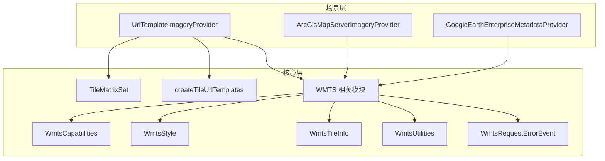
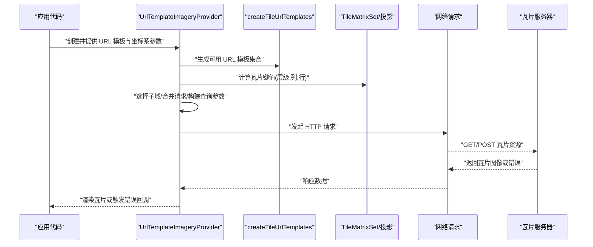
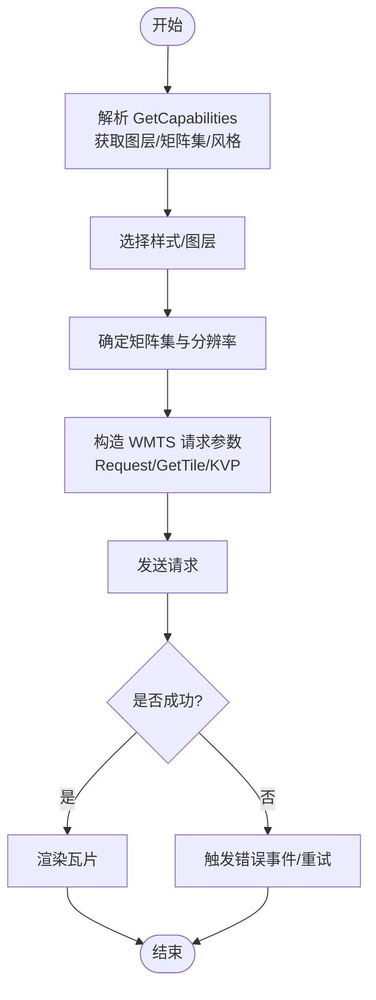
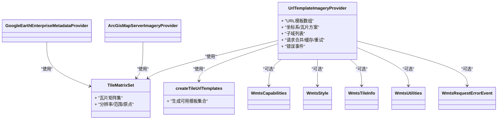

# URL模板提供者

<cite>
**本文引用的文件**   
- [UrlTemplateImageryProvider.js](file://Source/Scene/UrlTemplateImageryProvider.js)
- [TileMatrixSet.js](file://Source/Core/TileMatrixSet.js)
- [WebMercatorTilingScheme.js](file://Source/Core/WebMercatorTilingScheme.js)
- [GoogleEarthEnterpriseMetadataProvider.js](file://Source/Scene/GoogleEarthEnterpriseMetadataProvider.js)
- [ArcGisMapServerImageryProvider.js](file://Source/Scene/ArcGisMapServerImageryProvider.js)
- [WmtsCapabilities.js](file://Source/Core/WmtsCapabilities.js)
- [WmtsStyle.js](file://Source/Core/WmtsStyle.js)
- [WmtsTileInfo.js](file://Source/Core/WmtsTileInfo.js)
- [WmtsUtilities.js](file://Source/Core/WmtsUtilities.js)
- [WmtsRequestErrorEvent.js](file://Source/Core/WmtsRequestErrorEvent.js)
- [createTileUrlTemplates.js](file://Source/Scene/createTileUrlTemplates.js)
</cite>

## 目录
1. [简介](#简介)
2. [项目结构](#项目结构)
3. [核心组件](#核心组件)
4. [架构总览](#架构总览)
5. [详细组件分析](#详细组件分析)
6. [依赖关系分析](#依赖关系分析)
7. [性能考虑](#性能考虑)
8. [故障排查指南](#故障排查指南)
9. [结论](#结论)
10. [附录](#附录)

## 简介
本指南聚焦于 CesiumJS 中的 URL 模板影像提供器，围绕 UrlTemplateImageryProvider 的 URL 模板语法、变量替换机制与瓦片坐标系支持展开，覆盖 XYZ、TMS、WMTS 等主流瓦片格式的配置方法。文档同时给出 OpenStreetMap、Google Maps、高德地图、百度地图等常见服务的集成要点，并说明子域负载均衡、请求合并、缓存策略与错误重试机制的配置方式。最后提供自定义瓦片服务器的部署与配置最佳实践，帮助读者快速落地生产环境。

## 项目结构
与 URL 模板影像提供器相关的核心实现位于 Source/Scene 与 Source/Core 下：
- Scene 层负责影像提供器的具体实现与元数据解析（如 WMTS、ArcGIS Map Server、Google Earth Enterprise）。
- Core 层提供瓦片矩阵集、投影与 TMS 工具、WMTS 能力与样式解析、URL 模板生成等基础能力。

图表来源
- [UrlTemplateImageryProvider.js](file://Source/Scene/UrlTemplateImageryProvider.js)
- [createTileUrlTemplates.js](file://Source/Scene/createTileUrlTemplates.js)
- [TileMatrixSet.js](file://Source/Core/TileMatrixSet.js)
- [WmtsCapabilities.js](file://Source/Core/WmtsCapabilities.js)
- [WmtsStyle.js](file://Source/Core/WmtsStyle.js)
- [WmtsTileInfo.js](file://Source/Core/WmtsTileInfo.js)
- [WmtsUtilities.js](file://Source/Core/WmtsUtilities.js)
- [WmtsRequestErrorEvent.js](file://Source/Core/WmtsRequestErrorEvent.js)
- [ArcGisMapServerImageryProvider.js](file://Source/Scene/ArcGisMapServerImageryProvider.js)
- [GoogleEarthEnterpriseMetadataProvider.js](file://Source/Scene/GoogleEarthEnterpriseMetadataProvider.js)

章节来源
- [UrlTemplateImageryProvider.js](file://Source/Scene/UrlTemplateImageryProvider.js)
- [createTileUrlTemplates.js](file://Source/Scene/createTileUrlTemplates.js)
- [TileMatrixSet.js](file://Source/Core/TileMatrixSet.js)
- [WmtsCapabilities.js](file://Source/Core/WmtsCapabilities.js)
- [WmtsStyle.js](file://Source/Core/WmtsStyle.js)
- [WmtsTileInfo.js](file://Source/Core/WmtsTileInfo.js)
- [WmtsUtilities.js](file://Source/Core/WmtsUtilities.js)
- [WmtsRequestErrorEvent.js](file://Source/Core/WmtsRequestErrorEvent.js)
- [ArcGisMapServerImageryProvider.js](file://Source/Scene/ArcGisMapServerImageryProvider.js)
- [GoogleEarthEnterpriseMetadataProvider.js](file://Source/Scene/GoogleEarthEnterpriseMetadataProvider.js)

## 核心组件
- UrlTemplateImageryProvider：基于 URL 模板动态拼装瓦片地址，支持多种坐标系与瓦片方案；可配置子域、请求合并、缓存与错误处理等。
- createTileUrlTemplates：根据传入的 URL 模板数组与可选的子域列表，生成可用的 URL 模板集合，用于后续请求拼接。
- TileMatrixSet / WebMercatorTilingScheme：定义瓦片矩阵集、分辨率、范围与坐标原点，决定瓦片编号规则（XYZ/TMS）与投影体系。
- WMTS 系列（WmtsCapabilities、WmtsStyle、WmtsTileInfo、WmtsUtilities、WmtsRequestErrorEvent）：解析 WMTS GetCapabilities、样式与瓦片信息，辅助构造 WMTS 请求 URL。
- ArcGisMapServerImageryProvider / GoogleEarthEnterpriseMetadataProvider：面向特定服务类型的影像提供器，内部复用 URL 模板与瓦片矩阵能力。

章节来源
- [UrlTemplateImageryProvider.js](file://Source/Scene/UrlTemplateImageryProvider.js)
- [createTileUrlTemplates.js](file://Source/Scene/createTileUrlTemplates.js)
- [TileMatrixSet.js](file://Source/Core/TileMatrixSet.js)
- [WebMercatorTilingScheme.js](file://Source/Core/WebMercatorTilingScheme.js)
- [WmtsCapabilities.js](file://Source/Core/WmtsCapabilities.js)
- [WmtsStyle.js](file://Source/Core/WmtsStyle.js)
- [WmtsTileInfo.js](file://Source/Core/WmtsTileInfo.js)
- [WmtsUtilities.js](file://Source/Core/WmtsUtilities.js)
- [WmtsRequestErrorEvent.js](file://Source/Core/WmtsRequestErrorEvent.js)
- [ArcGisMapServerImageryProvider.js](file://Source/Scene/ArcGisMapServerImageryProvider.js)
- [GoogleEarthEnterpriseMetadataProvider.js](file://Source/Scene/GoogleEarthEnterpriseMetadataProvider.js)

## 架构总览
下图展示了从“需要加载某瓦片”到“最终发出 HTTP 请求”的关键流程，以及各组件之间的协作关系。

图表来源
- [UrlTemplateImageryProvider.js](file://Source/Scene/UrlTemplateImageryProvider.js)
- [createTileUrlTemplates.js](file://Source/Scene/createTileUrlTemplates.js)
- [TileMatrixSet.js](file://Source/Core/TileMatrixSet.js)

## 详细组件分析

### UrlTemplateImageryProvider 使用要点
- URL 模板语法与变量替换
  - 支持标准占位符，例如层级、列、行、子域、经度、纬度、像素坐标等，由底层在请求前进行替换。
  - 可通过数组形式提供多个模板，结合子域列表实现负载均衡。
- 瓦片坐标系与瓦片方案
  - 通过 TileMatrixSet 或内置投影（如 WebMercatorTilingScheme）指定瓦片范围、分辨率序列与原点偏移。
  - 支持 XYZ 与 TMS 两种瓦片编号方案；TMS 的行号通常以 Y 轴向下为正，需与服务端约定一致。
- 子域负载均衡
  - 为每个请求随机或轮询选择不同子域，提升并发与吞吐。
- 请求合并与缓存
  - 可开启请求合并以减少重复请求；配合浏览器与 CDN 缓存策略提高命中率。
- 错误处理与重试
  - 提供错误事件与回调，便于统计失败率、降级与重试。
- 典型服务集成
  - OpenStreetMap、Google Maps、高德地图、百度地图等均可通过 URL 模板接入，注意不同服务的坐标系与命名规范差异。

章节来源
- [UrlTemplateImageryProvider.js](file://Source/Scene/UrlTemplateImageryProvider.js)
- [createTileUrlTemplates.js](file://Source/Scene/createTileUrlTemplates.js)
- [TileMatrixSet.js](file://Source/Core/TileMatrixSet.js)
- [WebMercatorTilingScheme.js](file://Source/Core/WebMercatorTilingScheme.js)

### WMTS 集成与 URL 模板
- 能力与样式解析
  - 通过 WmtsCapabilities 解析服务发布的 GetCapabilities，获取图层、矩阵集、风格等信息。
  - WmtsStyle 与 WmtsTileInfo 分别描述样式与瓦片尺寸、格式等元数据。
- 瓦片请求构造
  - WmtsUtilities 提供将瓦片键值转换为 WMTS 请求参数的工具方法，包括 Request、GetTile、KVP 等多种模式。
- 错误事件
  - WmtsRequestErrorEvent 用于上报 WMTS 请求过程中的异常，便于统一监控与重试。

图表来源
- [WmtsCapabilities.js](file://Source/Core/WmtsCapabilities.js)
- [WmtsStyle.js](file://Source/Core/WmtsStyle.js)
- [WmtsTileInfo.js](file://Source/Core/WmtsTileInfo.js)
- [WmtsUtilities.js](file://Source/Core/WmtsUtilities.js)
- [WmtsRequestErrorEvent.js](file://Source/Core/WmtsRequestErrorEvent.js)

章节来源
- [WmtsCapabilities.js](file://Source/Core/WmtsCapabilities.js)
- [WmtsStyle.js](file://Source/Core/WmtsStyle.js)
- [WmtsTileInfo.js](file://Source/Core/WmtsTileInfo.js)
- [WmtsUtilities.js](file://Source/Core/WmtsUtilities.js)
- [WmtsRequestErrorEvent.js](file://Source/Core/WmtsRequestErrorEvent.js)

### ArcGIS Map Server 与 Google Earth Enterprise
- ArcGisMapServerImageryProvider
  - 针对 ArcGIS Map Server 的影像服务，内部同样基于 URL 模板与瓦片矩阵集进行请求拼装。
- GoogleEarthEnterpriseMetadataProvider
  - 针对 GEE 元数据的服务，提供与 GEE 协议一致的瓦片访问能力。

章节来源
- [ArcGisMapServerImageryProvider.js](file://Source/Scene/ArcGisMapServerImageryProvider.js)
- [GoogleEarthEnterpriseMetadataProvider.js](file://Source/Scene/GoogleEarthEnterpriseMetadataProvider.js)

## 依赖关系分析
- UrlTemplateImageryProvider 依赖 createTileUrlTemplates 生成模板集合，依赖 TileMatrixSet 或具体投影方案计算瓦片键值。
- WMTS 相关模块相互协作：WmtsCapabilities 读取能力文档，WmtsStyle 与 WmtsTileInfo 描述样式与瓦片信息，WmtsUtilities 负责参数拼装，WmtsRequestErrorEvent 负责错误上报。
- ArcGisMapServerImageryProvider 与 GoogleEarthEnterpriseMetadataProvider 复用上述通用能力，形成可扩展的影像提供器生态。

图表来源
- [UrlTemplateImageryProvider.js](file://Source/Scene/UrlTemplateImageryProvider.js)
- [createTileUrlTemplates.js](file://Source/Scene/createTileUrlTemplates.js)
- [TileMatrixSet.js](file://Source/Core/TileMatrixSet.js)
- [WmtsCapabilities.js](file://Source/Core/WmtsCapabilities.js)
- [WmtsStyle.js](file://Source/Core/WmtsStyle.js)
- [WmtsTileInfo.js](file://Source/Core/WmtsTileInfo.js)
- [WmtsUtilities.js](file://Source/Core/WmtsUtilities.js)
- [WmtsRequestErrorEvent.js](file://Source/Core/WmtsRequestErrorEvent.js)
- [ArcGisMapServerImageryProvider.js](file://Source/Scene/ArcGisMapServerImageryProvider.js)
- [GoogleEarthEnterpriseMetadataProvider.js](file://Source/Scene/GoogleEarthEnterpriseMetadataProvider.js)

## 性能考虑
- 子域负载均衡
  - 合理设置子域数量，避免单点瓶颈；确保 DNS 解析与后端节点健康检查正常。
- 请求合并
  - 对热点区域启用请求合并，减少重复请求与带宽占用；注意合并粒度与超时时间。
- 缓存策略
  - 前端利用浏览器缓存与内存缓存；服务端/CDN 启用强缓存与协商缓存；瓦片文件名包含版本或哈希以提升命中率。
- 错误重试与退避
  - 对瞬时错误采用指数退避重试；对持续失败进行熔断与降级，切换备用源或降低质量。
- 瓦片尺寸与压缩
  - 选择合适的瓦片尺寸与图片格式（如 JPEG/PNG/WEBP），平衡清晰度与传输开销。

[本节为通用指导，不直接分析具体文件]

## 故障排查指南
- 瓦片无法加载
  - 检查 URL 模板变量是否正确替换；确认瓦片编号方案（XYZ/TMS）与服务端一致。
  - 核对坐标系与范围，尤其是原点偏移与分辨率序列。
- 跨域问题
  - 确保服务端返回正确的 CORS 头；必要时配置反向代理。
- WMTS 能力解析失败
  - 检查 GetCapabilities 响应是否符合规范；关注图层、矩阵集与样式名称大小写。
- 错误事件与日志
  - 订阅 WmtsRequestErrorEvent 或其他错误回调，记录失败 URL、状态码与堆栈，定位问题根因。

章节来源
- [WmtsRequestErrorEvent.js](file://Source/Core/WmtsRequestErrorEvent.js)
- [UrlTemplateImageryProvider.js](file://Source/Scene/UrlTemplateImageryProvider.js)

## 结论
UrlTemplateImageryProvider 提供了灵活且强大的 URL 模板瓦片接入能力，配合 TileMatrixSet 与 WMTS 工具链，能够覆盖 XYZ、TMS、WMTS 等主流瓦片格式。通过合理的子域、合并、缓存与重试策略，可在复杂网络环境下获得稳定高效的影像加载体验。对于自建瓦片服务器，建议遵循统一的瓦片命名规范、完善的元数据发布与健康的监控告警体系。

[本节为总结性内容，不直接分析具体文件]

## 附录

### URL 模板语法与变量替换机制
- 常用变量
  - 层级、列、行、子域、经度、纬度、像素坐标等，由系统在请求前替换。
- 多模板与子域
  - 提供模板数组与子域列表，系统自动组合生成可用 URL 集合，并在请求时选择。
- 示例路径参考
  - 模板生成入口：[createTileUrlTemplates.js](file://Source/Scene/createTileUrlTemplates.js)
  - 主提供器实现：[UrlTemplateImageryProvider.js](file://Source/Scene/UrlTemplateImageryProvider.js)

章节来源
- [createTileUrlTemplates.js](file://Source/Scene/createTileUrlTemplates.js)
- [UrlTemplateImageryProvider.js](file://Source/Scene/UrlTemplateImageryProvider.js)

### 瓦片坐标系与瓦片方案支持
- 坐标系
  - 支持 Web Mercator 等常用投影；通过 TileMatrixSet 或 WebMercatorTilingScheme 配置。
- 瓦片方案
  - XYZ：Z 为层级，X/Y 为行列；TMS：Y 轴方向与 XYZ 相反，需注意行号转换。
- 示例路径参考
  - 瓦片矩阵集：[TileMatrixSet.js](file://Source/Core/TileMatrixSet.js)
  - Web Mercator 投影：[WebMercatorTilingScheme.js](file://Source/Core/WebMercatorTilingScheme.js)

章节来源
- [TileMatrixSet.js](file://Source/Core/TileMatrixSet.js)
- [WebMercatorTilingScheme.js](file://Source/Core/WebMercatorTilingScheme.js)

### 主流地图服务集成要点
- OpenStreetMap
  - 使用标准 XYZ 模板；注意版权信息与速率限制。
- Google Maps
  - 遵循其服务条款与授权要求；按官方文档配置模板与密钥。
- 高德地图
  - 使用其公开瓦片接口；注意域名与参数规范。
- 百度地图
  - 注意坐标体系差异（BD09 等）与瓦片命名规则；必要时进行坐标转换。

[本节为概念性说明，不直接分析具体文件]

### 子域负载均衡、请求合并、缓存与重试
- 子域负载均衡
  - 配置多个子域，系统随机或轮询选择，提升并发能力。
- 请求合并
  - 对相同或相近请求进行合并，减少冗余。
- 缓存策略
  - 前端缓存与 CDN 强缓存结合；文件名含版本或哈希。
- 错误重试
  - 指数退避与熔断降级；记录错误事件以便追踪。

章节来源
- [UrlTemplateImageryProvider.js](file://Source/Scene/UrlTemplateImageryProvider.js)
- [WmtsRequestErrorEvent.js](file://Source/Core/WmtsRequestErrorEvent.js)

### 自定义瓦片服务器部署与配置最佳实践
- 瓦片命名规范
  - 明确 XYZ/TMS 编号规则；保证层级、行列与范围一致。
- 元数据发布
  - 提供 GetCapabilities（WMTS）、layer.json（Cesium Terrain）等元数据，便于客户端发现与校验。
- 性能优化
  - 启用 gzip/brotli 压缩；使用静态资源分发与边缘缓存。
- 监控与告警
  - 记录请求量、延迟与错误率；设置阈值告警与健康检查。

[本节为通用指导，不直接分析具体文件]