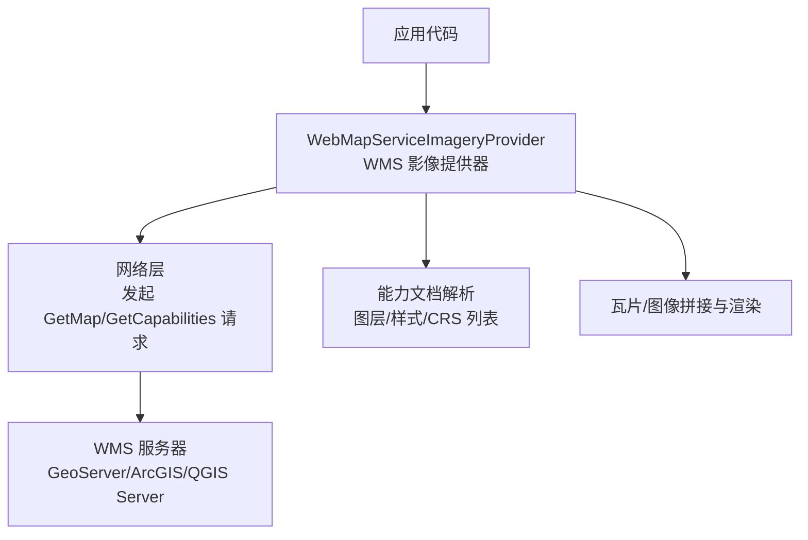
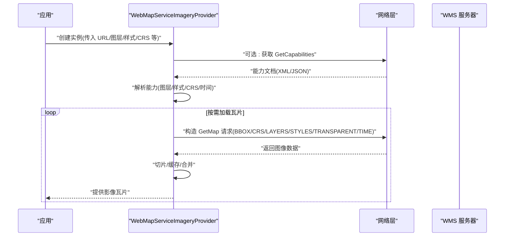
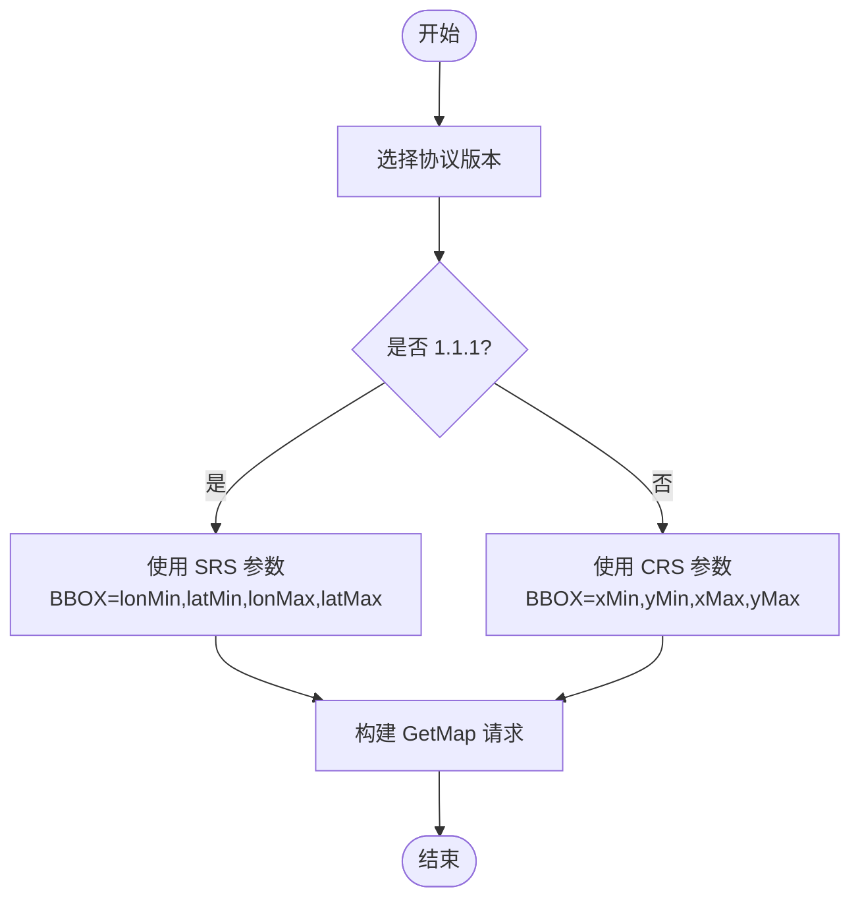
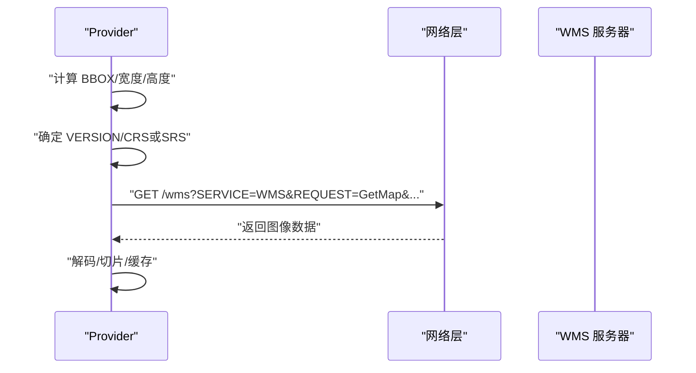
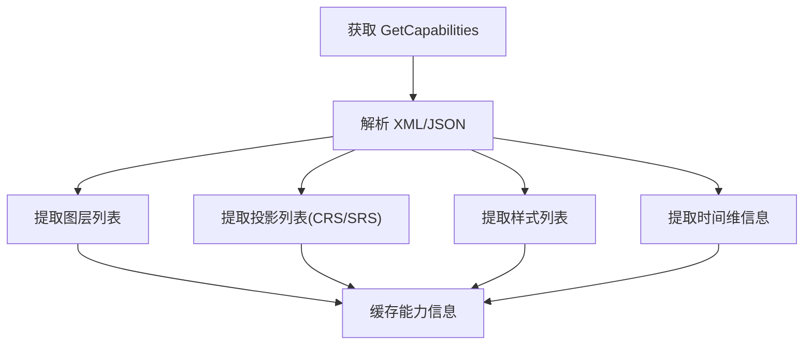
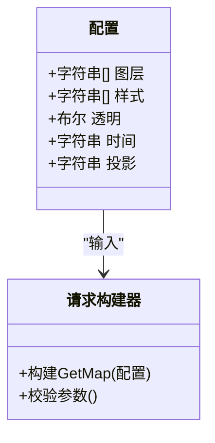
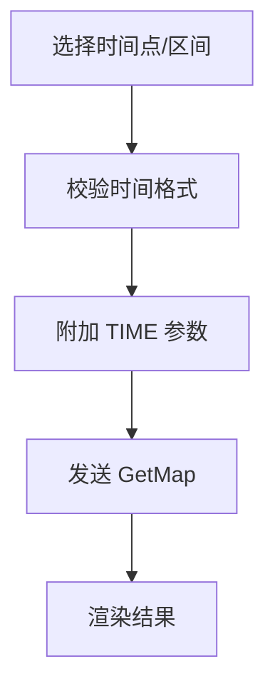
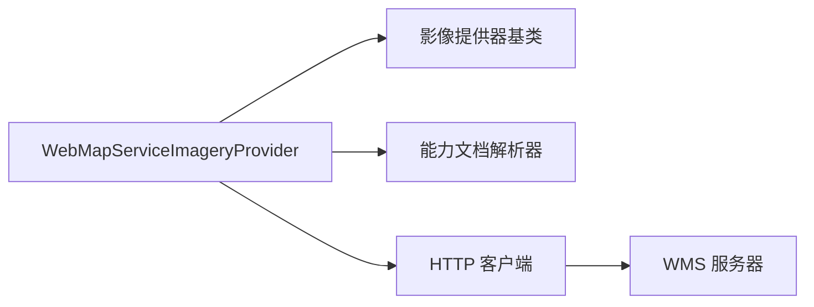

# WMS地图服务提供者

<cite>
**本文引用的文件**   
- [WebMapServiceImageryProvider.js](file://Source/Scene/ImageryProviders/WebMapServiceImageryProvider.js)
- [WMS 1.1.1 规范](file://Specs/Data/WMS/GetFeatureInfo.html)
- [GeoServer GetFeatureInfo 示例](file://Specs/Data/WMS/GetFeatureInfo-GeoJSON.json)
- [ArcGIS Server GetFeatureInfo 示例](file://Specs/Data/WMS/GetFeatureInfo-Esri.xml)
- [QGIS Server GetFeatureInfo 示例](file://Specs/Data/WMS/GetFeatureInfo-msGMLOutput.xml)
</cite>

## 目录
1. [简介](#简介)
2. [项目结构](#项目结构)
3. [核心组件](#核心组件)
4. [架构总览](#架构总览)
5. [详细组件分析](#详细组件分析)
6. [依赖分析](#依赖分析)
7. [性能考虑](#性能考虑)
8. [故障排查指南](#故障排查指南)
9. [结论](#结论)
10. [附录](#附录)

## 简介
本文件面向使用 Cesium 的开发者，提供 Web Map Service(WMS) 影像提供器的权威 API 文档。重点覆盖：
- 协议支持：WMS 1.1.1 与 1.3.0
- GetMap 请求构建、CRS/SRS 参数处理
- 多图层叠加配置
- 能力文档解析（GetCapabilities）
- 样式配置、透明度控制
- 时间维度支持
- 与主流 WMS 服务器（GeoServer、ArcGIS Server、QGIS Server）集成要点
- 错误处理、超时配置、缓存策略与性能调优

## 项目结构
Cesium 的 WMS 影像提供器实现位于 Source/Scene/ImageryProviders 目录下，核心类为 WebMapServiceImageryProvider。测试数据与示例位于 Specs/Data/WMS 目录，包含不同服务器的 GetFeatureInfo 响应样例，便于理解各服务器的行为差异。

[本节为概念性说明，不直接分析具体文件，故无“章节来源”]

## 核心组件
- WebMapServiceImageryProvider：封装 WMS 客户端逻辑，负责：
  - 根据配置生成 GetMap 请求（含 CRS/SRS、BBOX、WIDTH/HEIGHT、LAYERS、STYLES、TRANSPARENT、TIME 等）
  - 解析 GetCapabilities 返回的能力集（图层树、可用投影、样式、时间维等）
  - 管理请求并发、重试、超时、缓存键
  - 将返回的图像切片并作为影像瓦片提供给渲染管线

关键特性概览：
- 协议版本：支持 WMS 1.1.1 与 1.3.0；自动或显式选择 CRS/SRS 参数名
- 多图层：LAYERS 支持逗号分隔的多图层叠加
- 样式：STYLES 支持多样式映射到对应图层
- 透明度：TRANSPARENT=true/false 控制背景透明
- 时间：TIME 参数用于时间序列 WMS（如 GeoServer Time）
- 能力文档：从 GetCapabilities 中读取图层、样式、投影、时间维等信息

**章节来源**
- [WebMapServiceImageryProvider.js](file://Source/Scene/ImageryProviders/WebMapServiceImageryProvider.js)

## 架构总览
下图展示了 WebMapServiceImageryProvider 在 Cesium 中的位置及与外部 WMS 服务器的交互关系。

**图表来源**
- [WebMapServiceImageryProvider.js](file://Source/Scene/ImageryProviders/WebMapServiceImageryProvider.js)

**章节来源**
- [WebMapServiceImageryProvider.js](file://Source/Scene/ImageryProviders/WebMapServiceImageryProvider.js)

## 详细组件分析

### 协议支持与参数映射（WMS 1.1.1 vs 1.3.0）
- 1.1.1：使用 SRS 指定投影（如 EPSG:4326/EPSG:3857），BBOX 顺序通常为 lonMin,latMin,lonMax,latMax
- 1.3.0：使用 CRS 指定投影，BBOX 顺序遵循 OGC 标准（xMin,yMin,xMax,yMax）
- 提供器内部会根据所选版本自动切换参数名与坐标顺序，确保跨服务器兼容

**图表来源**
- [WebMapServiceImageryProvider.js](file://Source/Scene/ImageryProviders/WebMapServiceImageryProvider.js)

**章节来源**
- [WebMapServiceImageryProvider.js](file://Source/Scene/ImageryProviders/WebMapServiceImageryProvider.js)

### GetMap 请求构建流程
- 输入：视图范围（BBOX）、目标尺寸（WIDTH/HEIGHT）、图层（LAYERS）、样式（STYLES）、透明度（TRANSPARENT）、时间（TIME）、版本（VERSION）
- 输出：图像流（PNG/JPEG 等）
- 关键点：
  - 根据版本决定使用 CRS 还是 SRS
  - 按服务器要求拼接 LAYERS 与 STYLES（可多值）
  - 若启用透明，设置 TRANSPARENT=true
  - 若启用时间，附加 TIME 参数（ISO8601 或时间区间）

**图表来源**
- [WebMapServiceImageryProvider.js](file://Source/Scene/ImageryProviders/WebMapServiceImageryProvider.js)

**章节来源**
- [WebMapServiceImageryProvider.js](file://Source/Scene/ImageryProviders/WebMapServiceImageryProvider.js)

### 能力文档解析（GetCapabilities）
- 解析内容：
  - 图层树（Layer/Name/Title/Abstract）
  - 支持的投影（CRS/SRS）
  - 可用样式（Style/Name/Title）
  - 时间维（TimeDimension/DefaultTime/Range）
- 用途：
  - 动态枚举可用图层与样式
  - 校验用户配置的合法性
  - 自动生成默认请求参数

**图表来源**
- [WebMapServiceImageryProvider.js](file://Source/Scene/ImageryProviders/WebMapServiceImageryProvider.js)

**章节来源**
- [WebMapServiceImageryProvider.js](file://Source/Scene/ImageryProviders/WebMapServiceImageryProvider.js)

### 多图层叠加与样式配置
- 多图层：LAYERS="layerA,layerB,layerC"
- 多样式：STYLES="styleA,styleB,styleC"（与 LAYERS 一一对应）
- 常见场景：底图+矢量标注+专题图层叠加

**图表来源**
- [WebMapServiceImageryProvider.js](file://Source/Scene/ImageryProviders/WebMapServiceImageryProvider.js)

**章节来源**
- [WebMapServiceImageryProvider.js](file://Source/Scene/ImageryProviders/WebMapServiceImageryProvider.js)

### 透明度控制
- 通过 TRANSPARENT=true 开启透明背景
- 适用于需要与底层地图叠加的场景
- 注意：部分服务器对透明 PNG 的处理可能影响性能，需权衡

**章节来源**
- [WebMapServiceImageryProvider.js](file://Source/Scene/ImageryProviders/WebMapServiceImageryProvider.js)

### 时间维度支持
- 适用场景：时序遥感、历史变化对比
- 参数：TIME=YYYY-MM-DDThh:mm:ssZ 或 TIME=start/end
- 能力文档中会声明时间维的默认时间与取值范围

**图表来源**
- [WebMapServiceImageryProvider.js](file://Source/Scene/ImageryProviders/WebMapServiceImageryProvider.js)

**章节来源**
- [WebMapServiceImageryProvider.js](file://Source/Scene/ImageryProviders/WebMapServiceImageryProvider.js)

### 与不同 WMS 服务器的集成要点
- GeoServer
  - 常用 CRS：EPSG:4326、EPSG:3857
  - 支持时间维（Time）
  - 建议先拉取 GetCapabilities 以确认图层/样式/投影
- ArcGIS Server
  - 通常以 1.1.1 兼容模式暴露 WMS
  - 注意 SRS 命名与 BBOX 顺序
- QGIS Server
  - 支持多种输出格式与样式
  - 某些情况下需显式指定 FORMAT 与 SRS

参考样例（GetFeatureInfo 响应格式差异）：
- [GeoServer GetFeatureInfo 示例](file://Specs/Data/WMS/GetFeatureInfo-GeoJSON.json)
- [ArcGIS Server GetFeatureInfo 示例](file://Specs/Data/WMS/GetFeatureInfo-Esri.xml)
- [QGIS Server GetFeatureInfo 示例](file://Specs/Data/WMS/GetFeatureInfo-msGMLOutput.xml)

**章节来源**
- [WMS 1.1.1 规范](file://Specs/Data/WMS/GetFeatureInfo.html)
- [GeoServer GetFeatureInfo 示例](file://Specs/Data/WMS/GetFeatureInfo-GeoJSON.json)
- [ArcGIS Server GetFeatureInfo 示例](file://Specs/Data/WMS/GetFeatureInfo-Esri.xml)
- [QGIS Server GetFeatureInfo 示例](file://Specs/Data/WMS/GetFeatureInfo-msGMLOutput.xml)

## 依赖分析
- 内部依赖：
  - 影像提供器基类与工具函数（用于瓦片键、缓存、并发控制）
  - 能力文档解析器（XML/JSON 解析）
- 外部依赖：
  - HTTP 客户端（由 Cesium 网络层抽象）
  - WMS 服务器（遵循 OGC WMS 1.1.1/1.3.0）

**图表来源**
- [WebMapServiceImageryProvider.js](file://Source/Scene/ImageryProviders/WebMapServiceImageryProvider.js)

**章节来源**
- [WebMapServiceImageryProvider.js](file://Source/Scene/ImageryProviders/WebMapServiceImageryProvider.js)

## 性能考虑
- 并发与限流
  - 合理设置最大并发请求数，避免阻塞浏览器线程
- 缓存策略
  - 基于请求 URL 的缓存键，避免重复请求
  - 针对时间序列，按时间戳区分缓存条目
- 图像格式
  - 优先使用压缩格式（如 JPEG）以降低带宽
  - 仅在需要透明时使用 PNG
- 瓦片尺寸
  - 适当增大 WIDTH/HEIGHT 可减少请求次数，但会增加单请求大小
- 能力文档缓存
  - 缓存 GetCapabilities 结果，减少初始化开销

[本节为通用指导，不直接分析具体文件，故无“章节来源”]

## 故障排查指南
常见问题与定位方法：
- 404/403 错误
  - 检查 WMS URL、图层名称、样式名称是否正确
  - 确认服务器是否需要认证头或跨域配置
- 投影不匹配
  - 核对 CRS/SRS 是否在能力文档中列出
  - 确认 BBOX 顺序与版本一致
- 时间参数无效
  - 校验 ISO8601 格式或时间区间
  - 查看能力文档中时间维的默认值与范围
- 超时与重试
  - 调整超时阈值与重试策略
  - 监控网络延迟与服务器负载

**章节来源**
- [WebMapServiceImageryProvider.js](file://Source/Scene/ImageryProviders/WebMapServiceImageryProvider.js)

## 结论
WebMapServiceImageryProvider 提供了对 WMS 1.1.1 与 1.3.0 的全面支持，涵盖 GetMap 请求构建、CRS/SRS 处理、多图层叠加、样式与透明度控制以及时间维度。通过能力文档解析，可实现动态发现与校验，提升集成效率。结合合理的并发、缓存与格式策略，可在不同 WMS 服务器（GeoServer、ArcGIS Server、QGIS Server）上获得稳定高效的影像服务体验。

[本节为总结性内容，不直接分析具体文件，故无“章节来源”]

## 附录
- 术语
  - CRS：Coordinate Reference System（坐标系参考系统）
  - SRS：Spatial Reference System（空间参考系统）
  - BBOX：边界框（Bounding Box）
  - GetCapabilities：获取服务元数据
  - GetMap：获取地图图像
- 参考链接
  - OGC WMS 1.1.1 规范
  - OGC WMS 1.3.0 规范

[本节为概念性说明，不直接分析具体文件，故无“章节来源”]