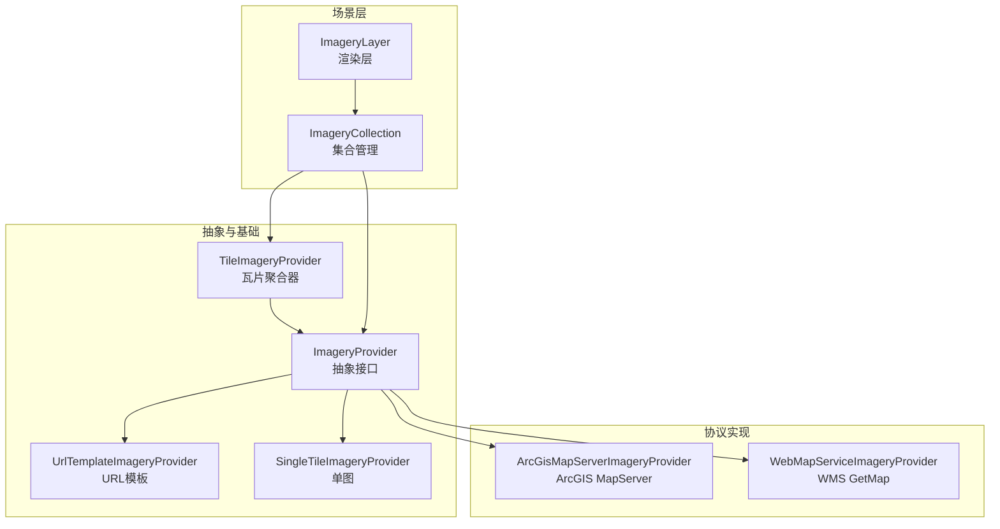
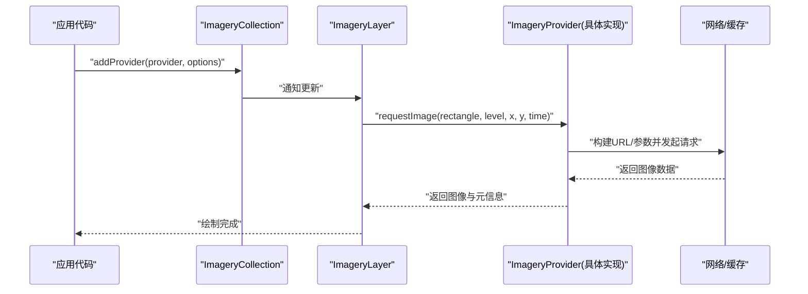
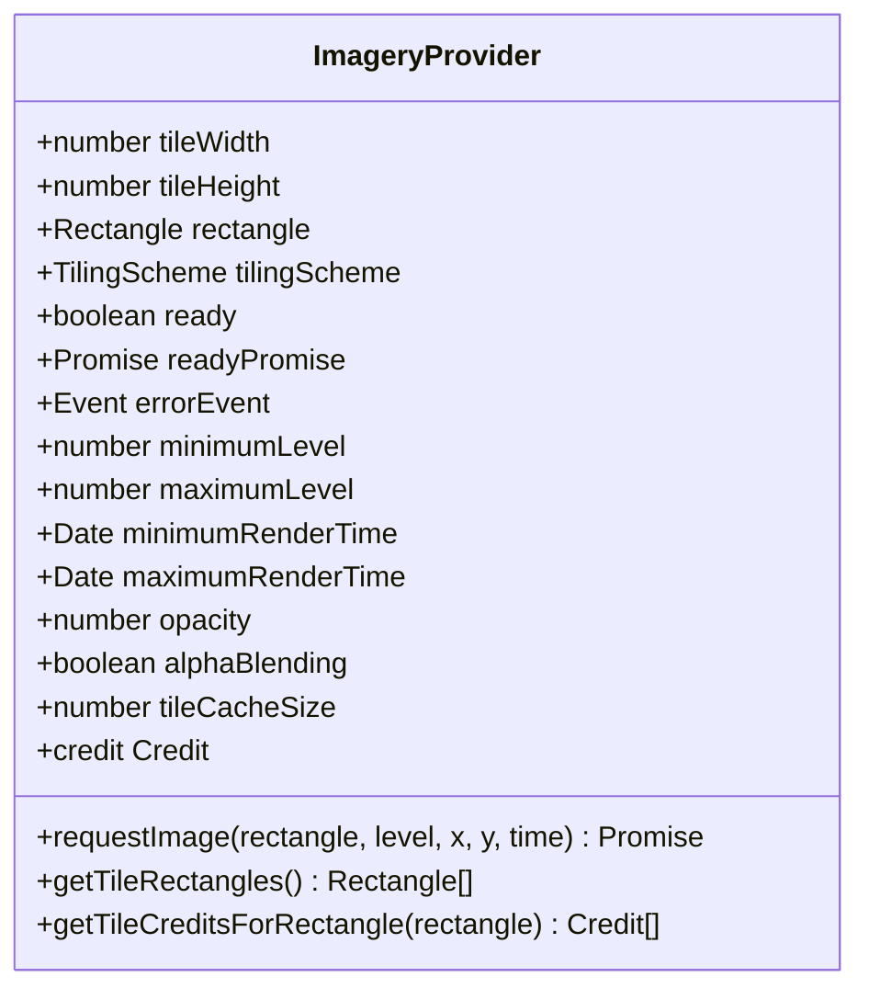
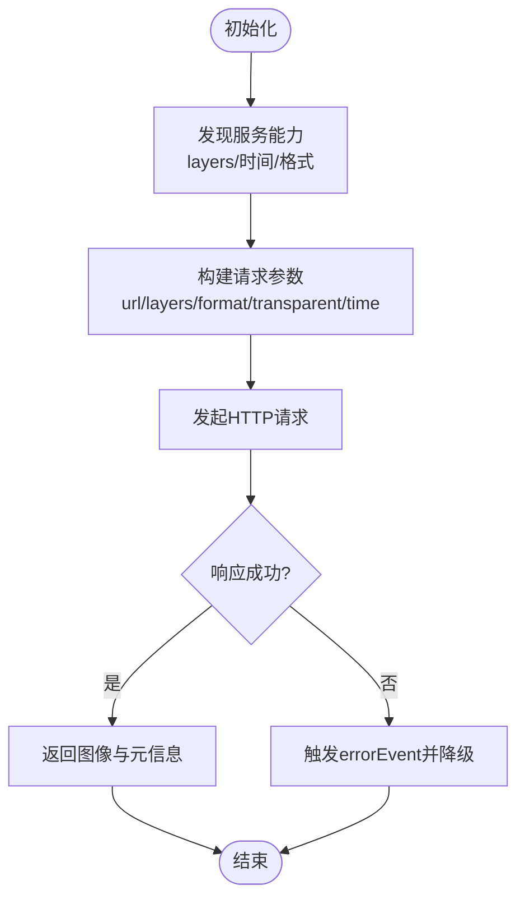
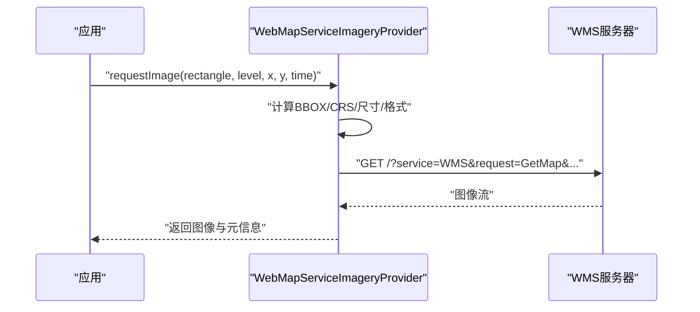
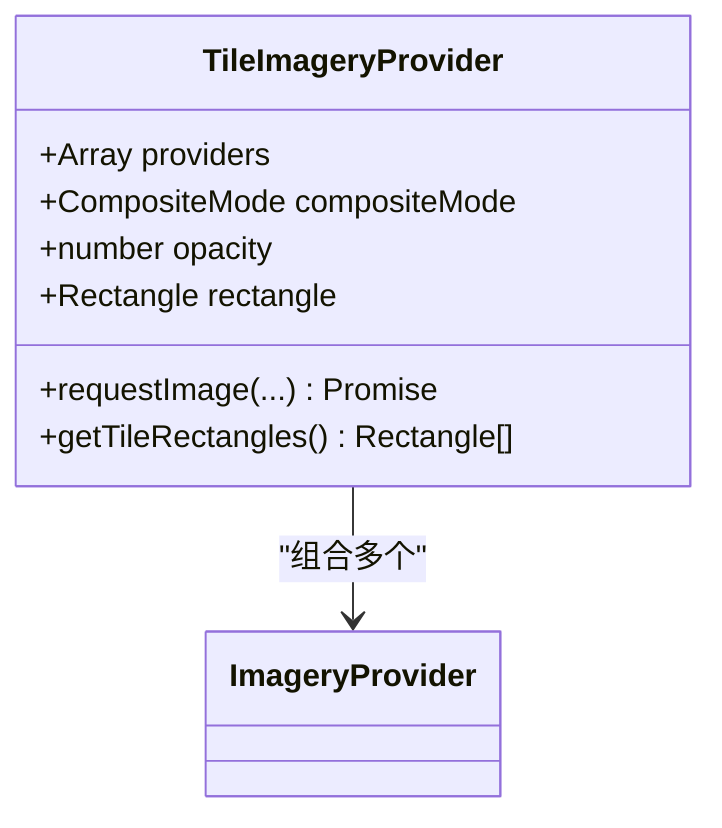
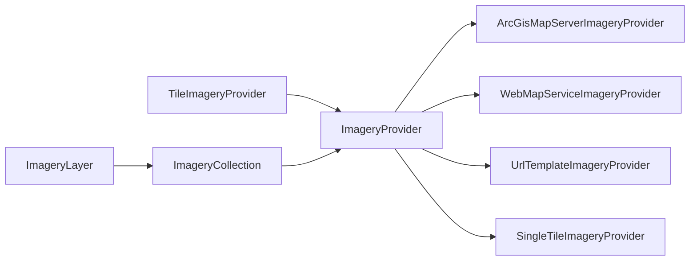

# 影像图层提供者API

<cite>
**本文引用的文件**   
- [ImageryProvider.js](file://Source/Core/ImageryProvider.js)
- [ArcGisMapServerImageryProvider.js](file://Source/Core/ArcGisMapServerImageryProvider.js)
- [WebMapServiceImageryProvider.js](file://Source/Core/WebMapServiceImageryProvider.js)
- [TileImageryProvider.js](file://Source/Core/TileImageryProvider.js)
- [UrlTemplateImageryProvider.js](file://Source/Core/UrlTemplateImageryProvider.js)
- [SingleTileImageryProvider.js](file://Source/Core/SingleTileImageryProvider.js)
- [createDefaultImageryProviders.js](file://Source/Core/createDefaultImageryProviders.js)
- [ImageryLayer.js](file://Source/Scene/ImageryLayer.js)
- [ImageryCollection.js](file://Source/Scene/ImageryCollection.js)
- [MockImageryProvider.js](file://Specs/MockImageryProvider.js)
</cite>

## 目录
1. [简介](#简介)
2. [项目结构](#项目结构)
3. [核心组件](#核心组件)
4. [架构总览](#架构总览)
5. [详细组件分析](#详细组件分析)
6. [依赖关系分析](#依赖关系分析)
7. [性能考虑](#性能考虑)
8. [故障排查指南](#故障排查指南)
9. [结论](#结论)
10. [附录](#附录)

## 简介
本文件面向Cesium的影像图层提供者（Imagery Provider）体系，系统梳理抽象接口与内置提供器，覆盖瓦片请求、透明度控制、时间动态影像、多源融合等关键能力，并提供自定义提供器的开发指南与主流服务集成示例。文档以源码为依据，结合图示帮助读者快速理解并高效使用。

## 项目结构
Cesium将“影像数据获取”与“渲染展示”解耦：
- 抽象层：ImageryProvider定义统一的数据契约（瓦片元信息、请求、缓存键、时间范围等）。
- 实现层：ArcGisMapServerImageryProvider、WebMapServiceImageryProvider、UrlTemplateImageryProvider、SingleTileImageryProvider等按协议或模板生成瓦片URL并返回图像资源。
- 组合层：TileImageryProvider用于拼装多个提供者形成复合层；ImageryCollection管理集合；ImageryLayer负责渲染。

图表来源
- [ImageryProvider.js](file://Source/Core/ImageryProvider.js)
- [ArcGisMapServerImageryProvider.js](file://Source/Core/ArcGisMapServerImageryProvider.js)
- [WebMapServiceImageryProvider.js](file://Source/Core/WebMapServiceImageryProvider.js)
- [TileImageryProvider.js](file://Source/Core/TileImageryProvider.js)
- [UrlTemplateImageryProvider.js](file://Source/Core/UrlTemplateImageryProvider.js)
- [SingleTileImageryProvider.js](file://Source/Core/SingleTileImageryProvider.js)
- [ImageryCollection.js](file://Source/Scene/ImageryCollection.js)
- [ImageryLayer.js](file://Source/Scene/ImageryLayer.js)

章节来源
- [ImageryProvider.js](file://Source/Core/ImageryProvider.js)
- [ArcGisMapServerImageryProvider.js](file://Source/Core/ArcGisMapServerImageryProvider.js)
- [WebMapServiceImageryProvider.js](file://Source/Core/WebMapServiceImageryProvider.js)
- [TileImageryProvider.js](file://Source/Core/TileImageryProvider.js)
- [UrlTemplateImageryProvider.js](file://Source/Core/UrlTemplateImageryProvider.js)
- [SingleTileImageryProvider.js](file://Source/Core/SingleTileImageryProvider.js)
- [ImageryCollection.js](file://Source/Scene/ImageryCollection.js)
- [ImageryLayer.js](file://Source/Scene/ImageryLayer.js)

## 核心组件
- ImageryProvider抽象接口
  - 职责：描述一个可被场景消费的影像数据源，包括：
    - 瓦片网格与投影（tileWidth/tileHeight、rectangle、tilingScheme）
    - 请求与缓存键（requestImage、getTileRectangles、getTileCreditsForRectangle、credit）
    - 时间范围（minimumLevel/maximumLevel、minimumRenderTime、maximumRenderTime）
    - 属性与状态（ready、readyPromise、errorEvent、tileCacheSize、alphaBlending、opacity）
  - 典型用法：创建实例后加入ImageryCollection，由ImageryLayer渲染。
- ArcGisMapServerImageryProvider
  - 职责：对接ArcGIS MapServer，自动解析服务能力、切片方案、版权与错误事件。
  - 关键点：支持动态图层、透明背景、时间字段（若服务启用）、代理与认证参数。
- WebMapServiceImageryProvider
  - 职责：对接OGC WMS，通过GetMap请求合成影像。
  - 关键点：layers、styles、crs/srs、bbox、width/height、format、transparent、time、version、cql_filter等参数映射。
- TileImageryProvider
  - 职责：组合多个ImageryProvider为单一逻辑层，支持混合模式（叠加/替换）、透明度、裁剪区域。
- UrlTemplateImageryProvider
  - 职责：基于URL模板与坐标计算规则生成瓦片地址，适合静态切片服务。
- SingleTileImageryProvider
  - 职责：整幅地图仅一张大图，常用于底图或专题图。

章节来源
- [ImageryProvider.js](file://Source/Core/ImageryProvider.js)
- [ArcGisMapServerImageryProvider.js](file://Source/Core/ArcGisMapServerImageryProvider.js)
- [WebMapServiceImageryProvider.js](file://Source/Core/WebMapServiceImageryProvider.js)
- [TileImageryProvider.js](file://Source/Core/TileImageryProvider.js)
- [UrlTemplateImageryProvider.js](file://Source/Core/UrlTemplateImageryProvider.js)
- [SingleTileImageryProvider.js](file://Source/Core/SingleTileImageryProvider.js)

## 架构总览
下图展示了从应用调用到最终渲染的关键路径，以及各组件间的协作关系。

图表来源
- [ImageryCollection.js](file://Source/Scene/ImageryCollection.js)
- [ImageryLayer.js](file://Source/Scene/ImageryLayer.js)
- [ImageryProvider.js](file://Source/Core/ImageryProvider.js)

## 详细组件分析

### ImageryProvider抽象接口
- 设计要点
  - 统一的瓦片坐标系与矩形边界模型，确保不同来源可被同一渲染管线消费。
  - 明确的时间窗口语义，便于时间轴驱动与动态切换。
  - 错误事件与就绪状态，支撑健壮的用户体验。
- 关键能力
  - 瓦片请求：根据矩形、层级与行列号生成唯一请求标识并返回图像。
  - 缓存键：保证相同时空上下文命中缓存，避免重复请求。
  - 透明度与混合：支持alpha通道与混合策略配置。
  - 版权与提示：提供credits与getTileCreditsForRectangle。
- 扩展点
  - 自定义时间动态：实现minimumRenderTime/maximumRenderTime与时间相关请求参数。
  - 自定义缓存策略：调整tileCacheSize与内部缓存数据结构。
  - 自定义错误处理：在errorEvent中上报异常并降级显示。

图表来源
- [ImageryProvider.js](file://Source/Core/ImageryProvider.js)

章节来源
- [ImageryProvider.js](file://Source/Core/ImageryProvider.js)

### ArcGisMapServerImageryProvider
- 功能概述
  - 自动发现服务能力（如是否支持透明、时间、动态图层），构造符合MapServer协议的请求。
  - 支持代理、认证头、跨域与错误事件透传。
- 常用配置项（概念性说明）
  - url：服务根地址
  - layers：图层列表或动态图层表达式
  - format/imageType：输出格式
  - transparent：是否透明
  - time/timeExtent：时间范围或时间字段
  - proxy：代理配置
  - credit：版权信息
- 最佳实践
  - 合理设置maximumLevel避免过度请求。
  - 对大区域使用最小可用级别与视锥裁剪。
  - 开启透明时注意上层图层顺序与混合模式。

图表来源
- [ArcGisMapServerImageryProvider.js](file://Source/Core/ArcGisMapServerImageryProvider.js)

章节来源
- [ArcGisMapServerImageryProvider.js](file://Source/Core/ArcGisMapServerImageryProvider.js)

### WebMapServiceImageryProvider
- 功能概述
  - 遵循OGC WMS规范，通过GetMap合成影像，支持多图层叠加、样式、CRS/SRS、BBOX、TIME等。
- 常用配置项（概念性说明）
  - url：WMS服务地址
  - layers/styles：图层与样式
  - version：WMS版本
  - crs/srs：坐标参考系
  - bbox：请求范围
  - width/height：输出尺寸
  - format/transparent：输出格式与透明
  - time/cql_filter：时间与过滤条件
- 注意事项
  - CRS与BBOX需与Cesium的TilingScheme一致。
  - 服务端不支持透明时，可通过上层图层补偿。
  - 复杂样式建议在后端预渲染以提升性能。

图表来源
- [WebMapServiceImageryProvider.js](file://Source/Core/WebMapServiceImageryProvider.js)

章节来源
- [WebMapServiceImageryProvider.js](file://Source/Core/WebMapServiceImageryProvider.js)

### TileImageryProvider（多源融合）
- 功能概述
  - 将多个ImageryProvider组合为一个逻辑层，支持叠加、替换、透明度与裁剪区域。
- 典型用途
  - 多源底图融合（例如卫星+矢量标注）
  - 业务专题图层叠加
- 关键行为
  - 按请求矩形与层级分发至子提供者
  - 合并结果时的混合策略与透明度叠加
  - 统一版权与错误传播

图表来源
- [TileImageryProvider.js](file://Source/Core/TileImageryProvider.js)
- [ImageryProvider.js](file://Source/Core/ImageryProvider.js)

章节来源
- [TileImageryProvider.js](file://Source/Core/TileImageryProvider.js)

### UrlTemplateImageryProvider（URL模板）
- 功能概述
  - 通过模板字符串与坐标计算规则生成瓦片URL，适配静态切片服务。
- 适用场景
  - 标准XYZ/TMS切片
  - 带变量替换的定制切片服务
- 注意事项
  - 模板变量需与目标服务约定一致（如x/y/z、nx/ny/nz等）
  - 跨域与缓存策略需与服务端配合

章节来源
- [UrlTemplateImageryProvider.js](file://Source/Core/UrlTemplateImageryProvider.js)

### SingleTileImageryProvider（整图）
- 功能概述
  - 针对整幅地图的单张图像，常用于底图或专题图。
- 适用场景
  - 低分辨率概览图
  - 固定范围的专题图
- 注意事项
  - 缩放级别与分辨率匹配
  - 大图传输体积与加载时间权衡

章节来源
- [SingleTileImageryProvider.js](file://Source/Core/SingleTileImageryProvider.js)

### 默认提供者与快捷入口
- createDefaultImageryProviders
  - 提供一组常用底图的快捷创建方式，便于快速搭建场景。
- 使用建议
  - 作为演示或原型阶段快速验证
  - 生产环境建议显式配置与鉴权

章节来源
- [createDefaultImageryProviders.js](file://Source/Core/createDefaultImageryProviders.js)

## 依赖关系分析
- 耦合与内聚
  - ImageryProvider高内聚于“数据契约”，各实现类围绕该契约展开，降低耦合。
  - TileImageryProvider对ImageryProvider存在组合依赖，属于横向扩展点。
- 外部依赖
  - 网络请求与浏览器缓存
  - 地理投影与瓦片切分算法（TilingScheme）
- 潜在循环依赖
  - 抽象与实现之间单向依赖，无循环引用风险。

图表来源
- [ImageryProvider.js](file://Source/Core/ImageryProvider.js)
- [ArcGisMapServerImageryProvider.js](file://Source/Core/ArcGisMapServerImageryProvider.js)
- [WebMapServiceImageryProvider.js](file://Source/Core/WebMapServiceImageryProvider.js)
- [TileImageryProvider.js](file://Source/Core/TileImageryProvider.js)
- [UrlTemplateImageryProvider.js](file://Source/Core/UrlTemplateImageryProvider.js)
- [SingleTileImageryProvider.js](file://Source/Core/SingleTileImageryProvider.js)
- [ImageryCollection.js](file://Source/Scene/ImageryCollection.js)
- [ImageryLayer.js](file://Source/Scene/ImageryLayer.js)

章节来源
- [ImageryProvider.js](file://Source/Core/ImageryProvider.js)
- [ImageryCollection.js](file://Source/Scene/ImageryCollection.js)
- [ImageryLayer.js](file://Source/Scene/ImageryLayer.js)

## 性能考虑
- 瓦片粒度与级别
  - 合理设置minimumLevel/maximumLevel，避免过细级别导致请求风暴。
- 缓存策略
  - 利用浏览器HTTP缓存与Cesium内部tileCacheSize，减少重复请求。
- 并发与限流
  - 控制同时并发请求数，避免阻塞主线程与网络拥塞。
- 图像格式与压缩
  - 优先使用有损压缩格式（如JPEG）用于底图，PNG用于需要透明的专题图。
- 时间动态
  - 按需加载时间片段，避免一次性拉取全量时间序列。
- 多源融合
  - 使用TileImageryProvider时，尽量将高频更新的图层置于上层，减少重绘。

[本节为通用指导，不直接分析具体文件]

## 故障排查指南
- 常见问题定位
  - 无法加载：检查url、跨域、代理与认证头是否正确。
  - 空白/错位：核对CRS/SRS、BBOX与TilingScheme一致性。
  - 透明失效：确认服务端是否支持transparent与后端输出格式。
  - 时间不生效：检查服务是否启用时间字段与客户端time参数。
- 错误事件与日志
  - 监听errorEvent，记录失败URL与响应码，辅助定位。
  - 使用调试工具查看网络请求与缓存命中情况。
- 降级策略
  - 超时重试、回退至低级别或备用源。
  - 使用MockImageryProvider进行离线测试与回归。

章节来源
- [MockImageryProvider.js](file://Specs/MockImageryProvider.js)

## 结论
Cesium的影像图层提供者体系以ImageryProvider为核心契约，通过多种协议实现与组合器满足多样化需求。掌握其接口与最佳实践，可在保证性能与稳定性的前提下，灵活集成主流地图服务并构建高性能的多源融合场景。

## 附录

### 自定义影像提供者开发指南
- 步骤概览
  - 继承ImageryProvider契约，实现requestImage、getTileRectangles、getTileCreditsForRectangle等。
  - 定义tileWidth/tileHeight、rectangle、tilingScheme与时间窗口。
  - 实现错误事件与就绪状态，保障用户体验。
- 瓦片格式支持
  - 支持常见图像格式（PNG/JPEG/WebP等），根据场景选择合适格式。
  - 对于特殊格式，需在requestImage中解码为Canvas/ImageBitmap后再返回。
- 缓存策略
  - 合理设置tileCacheSize，结合HTTP缓存头（Cache-Control/ETag）提升命中率。
  - 对热点瓦片可引入本地存储或内存级二级缓存。
- 错误处理机制
  - 在errorEvent中上报异常，提供重试与降级逻辑。
  - 对网络超时、404、5xx等分别处理，避免雪崩。
- 时间动态影像
  - 设置minimumRenderTime/maximumRenderTime，并在requestImage中根据time参数拼接服务端时间字段。
  - 对大数据集采用增量加载与分页策略。
- 多源融合
  - 将自定义提供者作为子提供者接入TileImageryProvider，参与混合与裁剪。
- 测试与验证
  - 使用MockImageryProvider模拟不同响应与错误场景，完善用例。
  - 结合e2e与单元断言验证正确性与性能指标。

章节来源
- [ImageryProvider.js](file://Source/Core/ImageryProvider.js)
- [MockImageryProvider.js](file://Specs/MockImageryProvider.js)

### 主流地图服务集成示例（概念性）
- ArcGIS Online/企业版
  - 使用ArcGisMapServerImageryProvider，配置layers、transparent、time等。
  - 建议开启代理与认证，限制最大级别与并发。
- OGC WMS
  - 使用WebMapServiceImageryProvider，配置layers/styles/crs/bbox/width/height/format/transparent/time。
  - 注意CRS与Cesium一致，必要时在服务端预渲染样式。
- 静态XYZ/TMS
  - 使用UrlTemplateImageryProvider，按服务约定填写模板变量。
  - 关注跨域与缓存策略，必要时配置CDN。
- 整图底图
  - 使用SingleTileImageryProvider，适用于概览或专题图。
  - 控制图片大小与分辨率，避免首屏过大。

[本节为概念性示例，不直接分析具体文件]