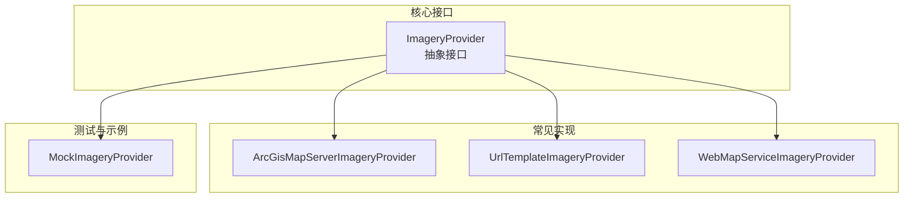
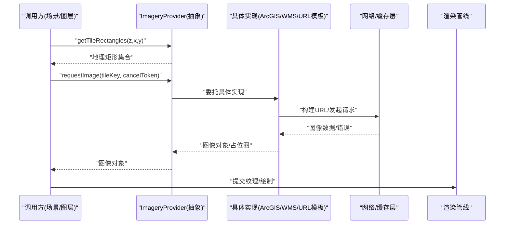
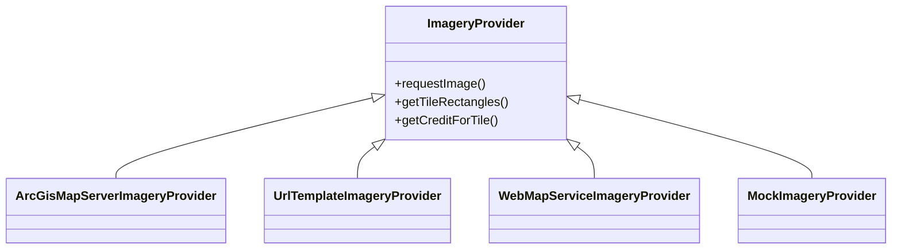

# 影像提供者基础接口

<cite>
**本文引用的文件**   
- [ImageryProvider.js](file://Source/Core/ImageryProvider.js)
- [ArcGisMapServerImageryProvider.js](file://Source/Core/ArcGisMapServerImageryProvider.js)
- [UrlTemplateImageryProvider.js](file://Source/Core/UrlTemplateImageryProvider.js)
- [WebMapServiceImageryProvider.js](file://Source/Core/WebMapServiceImageryProvider.js)
- [MockImageryProvider.js](file://Specs/MockImageryProvider.js)
</cite>

## 目录
1. [简介](#简介)
2. [项目结构](#项目结构)
3. [核心组件](#核心组件)
4. [架构总览](#架构总览)
5. [详细组件分析](#详细组件分析)
6. [依赖关系分析](#依赖关系分析)
7. [性能考量](#性能考量)
8. [故障排查指南](#故障排查指南)
9. [结论](#结论)
10. [附录](#附录)

## 简介
本文件聚焦于 Cesium 的影像图层提供者基础接口，围绕 ImageryProvider 抽象类的设计模式与关键方法展开，系统阐述瓦片请求机制、坐标系统转换、缓存策略与错误处理。同时提供自定义影像提供者的开发指南，包括必需实现的方法、可选优化方法与最佳实践，并通过示例路径帮助读者快速上手。

## 项目结构
Cesium 将“影像数据源”抽象为 ImageryProvider 接口，具体实现覆盖多种协议与服务（如 ArcGIS MapServer、WMS、URL 模板等）。测试与示例中提供了 Mock 实现用于验证与演示。

图表来源
- [ImageryProvider.js](file://Source/Core/ImageryProvider.js)
- [ArcGisMapServerImageryProvider.js](file://Source/Core/ArcGisMapServerImageryProvider.js)
- [UrlTemplateImageryProvider.js](file://Source/Core/UrlTemplateImageryProvider.js)
- [WebMapServiceImageryProvider.js](file://Source/Core/WebMapServiceImageryProvider.js)
- [MockImageryProvider.js](file://Specs/MockImageryProvider.js)

章节来源
- [ImageryProvider.js](file://Source/Core/ImageryProvider.js)
- [ArcGisMapServerImageryProvider.js](file://Source/Core/ArcGisMapServerImageryProvider.js)
- [UrlTemplateImageryProvider.js](file://Source/Core/UrlTemplateImageryProvider.js)
- [WebMapServiceImageryProvider.js](file://Source/Core/WebMapServiceImageryProvider.js)
- [MockImageryProvider.js](file://Specs/MockImageryProvider.js)

## 核心组件
- ImageryProvider 抽象类：定义影像数据源的统一契约，屏蔽底层协议差异，向上层渲染管线提供一致的瓦片图像获取能力。
- 关键方法
  - requestImage：根据瓦片键或矩形区域请求图像资源，返回可被渲染的图像对象或占位符。
  - getTileRectangles：计算指定层级与行列对应的地理矩形范围，供调度器进行可见性裁剪与请求合并。
  - getCreditForTile：返回当前瓦片的版权信息，用于在 UI 上展示数据来源与许可声明。
- 其他常用属性与方法（由具体实现补充）
  - 投影与坐标系描述（例如 EPSG:3857、EPSG:4326）
  - 最大/最小层级、是否支持透明通道、是否支持时间维度等
  - 取消令牌与并发控制
  - 缓存键生成策略与缓存命中逻辑

章节来源
- [ImageryProvider.js](file://Source/Core/ImageryProvider.js)

## 架构总览
下图展示了从调用方到具体实现的典型调用链，以及各参与方的职责边界。

图表来源
- [ImageryProvider.js](file://Source/Core/ImageryProvider.js)
- [ArcGisMapServerImageryProvider.js](file://Source/Core/ArcGisMapServerImageryProvider.js)
- [UrlTemplateImageryProvider.js](file://Source/Core/UrlTemplateImageryProvider.js)
- [WebMapServiceImageryProvider.js](file://Source/Core/WebMapServiceImageryProvider.js)

## 详细组件分析

### ImageryProvider 抽象类
- 设计目标
  - 统一不同影像服务的接入方式，使上层无需关心协议细节。
  - 明确瓦片生命周期：请求、解码、缓存、释放。
- 关键接口说明
  - requestImage：负责按 tileKey 或矩形区域拉取图像；应支持取消令牌以中断长时间请求；返回的图像对象需包含尺寸、透明度、版权等信息。
  - getTileRectangles：将瓦片索引映射到地理空间矩形，便于视锥裁剪与 LOD 选择。
  - getCreditForTile：为每个瓦片提供版权元数据，确保合规展示。
- 坐标系统与投影
  - 通常基于 Web Mercator 或 WGS84；具体实现需在文档中声明支持的坐标系与分辨率模型。
- 缓存策略
  - 建议对相同 tileKey 的结果进行去重与复用；注意内存占用与过期策略。
- 错误处理
  - 网络异常、服务不可用、格式不支持等情况应返回明确的失败信号，并提供降级方案（如空白瓦片或上一级可用瓦片）。

章节来源
- [ImageryProvider.js](file://Source/Core/ImageryProvider.js)

### ArcGisMapServerImageryProvider
- 特点
  - 面向 ArcGIS MapServer 的 REST API，自动处理多图层叠加、动态参数与样式。
  - 支持动态裁剪、透明背景、比例尺自适应。
- 关键流程
  - 根据请求参数拼装 GetImage 或 ExportMap 请求；解析响应并转换为图像对象；维护图层列表与样式参数。
- 注意事项
  - 服务端权限与跨域配置；大分辨率瓦片时的内存峰值；超时与重试策略。

章节来源
- [ArcGisMapServerImageryProvider.js](file://Source/Core/ArcGisMapServerImageryProvider.js)

### UrlTemplateImageryProvider
- 特点
  - 通过 URL 模板与变量替换生成瓦片地址，适配 TMS、XYZ、Bing 等多种风格化服务。
- 关键流程
  - 将 z/x/y 与可选参数注入模板；发起 HTTP 请求；处理二进制或 Base64 响应；必要时进行像素后处理。
- 注意事项
  - 模板语法与变量命名规范；代理与鉴权头设置；CDN 缓存键一致性。

章节来源
- [UrlTemplateImageryProvider.js](file://Source/Core/UrlTemplateImageryProvider.js)

### WebMapServiceImageryProvider
- 特点
  - 遵循 OGC WMS 标准，支持 GetMap、GetFeatureInfo、版本协商与 CRS 切换。
- 关键流程
  - 构造 GetMap 请求（LAYERS、STYLES、CRS/SRS、BBOX、WIDTH/HEIGHT、FORMAT）；解析地图图像与可选元数据；处理异常与版本兼容。
- 注意事项
  - BBOX 与 CRS 的严格匹配；服务特性探测（Capabilities）；超时与重试；跨域与认证。

章节来源
- [WebMapServiceImageryProvider.js](file://Source/Core/WebMapServiceImageryProvider.js)

### MockImageryProvider（测试与示例）
- 用途
  - 提供可控的假数据与行为，便于单元测试与集成测试。
- 能力
  - 模拟成功/失败响应、延迟、随机错误、固定瓦片内容等。
- 使用建议
  - 在本地调试时替代真实服务；在 CI 中保证用例稳定运行。

章节来源
- [MockImageryProvider.js](file://Specs/MockImageryProvider.js)

## 依赖关系分析
- 耦合与内聚
  - 抽象层仅暴露必要接口，具体实现内部封装协议细节，保持高内聚低耦合。
- 外部依赖
  - 网络请求库、图像处理工具、坐标变换工具、缓存容器等。
- 可能的循环依赖
  - 应避免在抽象层反向引用具体实现；通过工厂或注册表管理实例化。

图表来源
- [ImageryProvider.js](file://Source/Core/ImageryProvider.js)
- [ArcGisMapServerImageryProvider.js](file://Source/Core/ArcGisMapServerImageryProvider.js)
- [UrlTemplateImageryProvider.js](file://Source/Core/UrlTemplateImageryProvider.js)
- [WebMapServiceImageryProvider.js](file://Source/Core/WebMapServiceImageryProvider.js)
- [MockImageryProvider.js](file://Specs/MockImageryProvider.js)

章节来源
- [ImageryProvider.js](file://Source/Core/ImageryProvider.js)
- [ArcGisMapServerImageryProvider.js](file://Source/Core/ArcGisMapServerImageryProvider.js)
- [UrlTemplateImageryProvider.js](file://Source/Core/UrlTemplateImageryProvider.js)
- [WebMapServiceImageryProvider.js](file://Source/Core/WebMapServiceImageryProvider.js)
- [MockImageryProvider.js](file://Specs/MockImageryProvider.js)

## 性能考量
- 并发与限流
  - 合理限制并行请求数，避免雪崩；对热点瓦片做去重。
- 缓存策略
  - 基于 tileKey 的 LRU 或 TTL 缓存；区分内存与磁盘缓存；及时释放不再使用的纹理。
- 图像尺寸与压缩
  - 按需选择合适分辨率；优先使用有损/无损压缩格式；减少主线程解码压力。
- 请求合并与批处理
  - 对相邻瓦片进行批量请求；利用 CDN 与浏览器缓存。
- 错误重试与退避
  - 指数退避与熔断；失败时回退至上一级 LOD 或默认瓦片。

[本节为通用指导，不直接分析具体文件]

## 故障排查指南
- 常见问题
  - 跨域与鉴权失败：检查 CORS 配置与 Token 传递。
  - 瓦片错位或拉伸：核对 CRS/BBOX/宽高比与模板变量。
  - 内存泄漏：确认纹理释放与缓存清理。
  - 加载缓慢：启用缓存、合并请求、调整并发度。
- 定位手段
  - 打印 tileKey 与请求 URL；对比期望与实际的 BBOX/分辨率；观察错误码与堆栈。
- 恢复策略
  - 降级到上一级 LOD；使用占位瓦片；提示用户重试或更换服务。

章节来源
- [MockImageryProvider.js](file://Specs/MockImageryProvider.js)

## 结论
ImageryProvider 抽象类为 Cesium 影像数据源提供了统一的扩展点。通过实现 requestImage、getTileRectangles、getCreditForTile 等核心接口，开发者可以无缝接入各类影像服务。结合合理的缓存、并发控制与错误处理策略，可在保证性能的同时提升用户体验。

[本节为总结性内容，不直接分析具体文件]

## 附录

### 自定义影像提供者开发指南
- 必需实现
  - requestImage：根据 tileKey 或矩形区域返回图像对象或占位符。
  - getTileRectangles：将瓦片索引映射为地理矩形集合。
  - getCreditForTile：返回瓦片版权信息。
- 可选优化
  - 实现缓存键生成与命中逻辑；支持取消令牌；提供最大/最小层级与透明度标志；实现预取与懒加载。
- 最佳实践
  - 明确声明支持的坐标系与分辨率模型；统一错误码与日志；对敏感信息进行脱敏；编写单测覆盖成功/失败/超时路径。
- 参考示例路径
  - 参考现有实现与 Mock 实现，理解接口约定与调用时序。

章节来源
- [ImageryProvider.js](file://Source/Core/ImageryProvider.js)
- [ArcGisMapServerImageryProvider.js](file://Source/Core/ArcGisMapServerImageryProvider.js)
- [UrlTemplateImageryProvider.js](file://Source/Core/UrlTemplateImageryProvider.js)
- [WebMapServiceImageryProvider.js](file://Source/Core/WebMapServiceImageryProvider.js)
- [MockImageryProvider.js](file://Specs/MockImageryProvider.js)