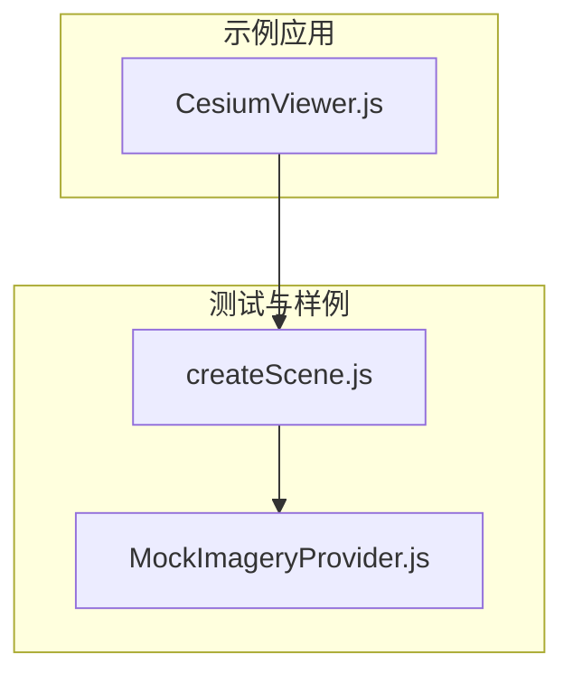
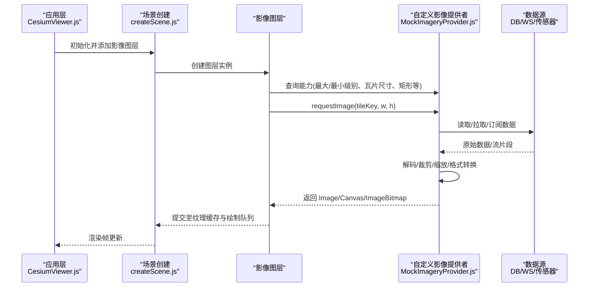
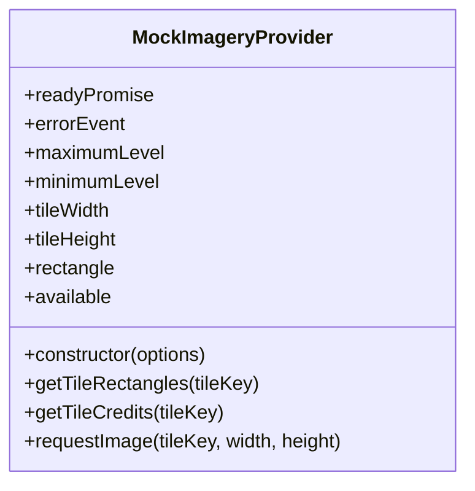
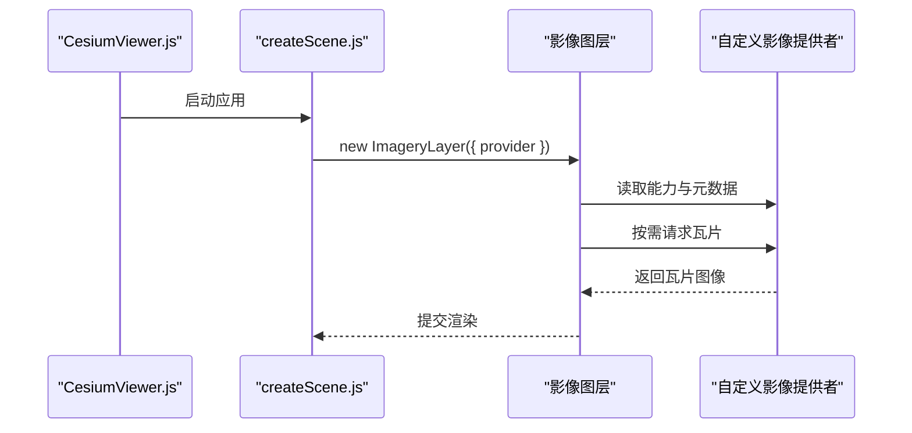
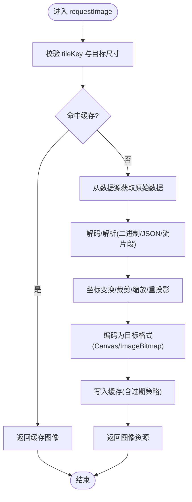
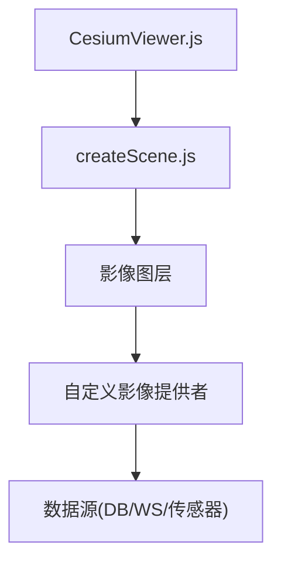

# 自定义影像提供者开发

<cite>
**本文引用的文件**   
- [MockImageryProvider.js](file://Specs/MockImageryProvider.js)
- [createScene.js](file://Specs/createScene.js)
- [CesiumViewer.js](file://Apps/CesiumViewer/CesiumViewer.js)
</cite>

## 目录
1. [简介](#简介)
2. [项目结构](#项目结构)
3. [核心组件](#核心组件)
4. [架构总览](#架构总览)
5. [详细组件分析](#详细组件分析)
6. [依赖关系分析](#依赖关系分析)
7. [性能考虑](#性能考虑)
8. [故障排查指南](#故障排查指南)
9. [结论](#结论)
10. [附录](#附录)

## 简介
本指南面向希望在 CesiumJS 中实现自定义影像提供者的开发者，围绕 ImageryProvider 接口展开，系统讲解必需方法 requestImage、可选的元数据与能力属性、瓦片生成算法、内存管理、异步请求处理与错误恢复机制。同时给出从数据库、WebSocket 流、实时传感器数据等不同数据源构建自定义提供器的完整示例思路，并包含调试技巧、性能监控与测试策略，以及与 Cesium 渲染管线的集成要点和常见问题解决方案。

## 项目结构
仓库采用多包与示例/测试分离的组织方式：
- Source：引擎源码（不包含在本文直接引用）
- Apps：示例应用（如 CesiumViewer）
- Specs：测试与样例（包含 MockImageryProvider 等关键参考实现）
- Documentation：文档与规范
- Tools：构建与工具链

为便于理解自定义影像提供器在工程中的位置，下图展示了示例应用、场景创建与 Mock 提供器之间的关系。

图表来源
- [CesiumViewer.js:1-200](file://Apps/CesiumViewer/CesiumViewer.js#L1-L200)
- [createScene.js:1-200](file://Specs/createScene.js#L1-L200)
- [MockImageryProvider.js:1-200](file://Specs/MockImageryProvider.js#L1-L200)

章节来源
- [CesiumViewer.js:1-200](file://Apps/CesiumViewer/CesiumViewer.js#L1-L200)
- [createScene.js:1-200](file://Specs/createScene.js#L1-L200)
- [MockImageryProvider.js:1-200](file://Specs/MockImageryProvider.js#L1-L200)

## 核心组件
- ImageryProvider 接口契约
  - 必需：requestImage(tileKey, width, height) 返回图像资源或 Promise
  - 可选：getTileRectangles、getTileCredits、maximumLevel、minimumLevel、tileWidth、tileHeight、rectangle、available、readyPromise、errorEvent 等
- 关键职责
  - 将 tileKey 映射到具体数据块（本地缓存、网络、数据库、流式数据）
  - 将原始数据解码为 Canvas/ImageBitmap 等可渲染对象
  - 暴露层级、范围、尺寸、版权等信息供调度器使用
  - 通过 errorEvent 上报错误，配合 readyPromise 表达就绪状态

章节来源
- [MockImageryProvider.js:1-200](file://Specs/MockImageryProvider.js#L1-L200)

## 架构总览
下图展示自定义影像提供器在 Cesium 渲染管线中的角色与交互流程。

图表来源
- [CesiumViewer.js:1-200](file://Apps/CesiumViewer/CesiumViewer.js#L1-L200)
- [createScene.js:1-200](file://Specs/createScene.js#L1-L200)
- [MockImageryProvider.js:1-200](file://Specs/MockImageryProvider.js#L1-L200)

## 详细组件分析

### 组件A：MockImageryProvider 参考实现
该文件提供了符合 ImageryProvider 接口的最小可用实现，适合作为自定义提供器的模板与对照基准。重点观察以下方面：
- 构造参数与配置项
- 能力属性（maximumLevel、minimumLevel、tileWidth、tileHeight、rectangle、available、readyPromise）
- 元数据方法（getTileRectangles、getTileCredits）
- 核心方法 requestImage 的实现路径（数据获取、解码、返回）
- 错误事件 errorEvent 的使用

图表来源
- [MockImageryProvider.js:1-200](file://Specs/MockImageryProvider.js#L1-L200)

章节来源
- [MockImageryProvider.js:1-200](file://Specs/MockImageryProvider.js#L1-L200)

### 组件B：场景与图层集成
场景创建脚本演示了如何将影像图层添加到场景中，以及常见初始化步骤。自定义提供器通常在此处被注入到图层配置中。

图表来源
- [CesiumViewer.js:1-200](file://Apps/CesiumViewer/CesiumViewer.js#L1-L200)
- [createScene.js:1-200](file://Specs/createScene.js#L1-L200)

章节来源
- [CesiumViewer.js:1-200](file://Apps/CesiumViewer/CesiumViewer.js#L1-L200)
- [createScene.js:1-200](file://Specs/createScene.js#L1-L200)

### 复杂逻辑组件：瓦片生成与解码流程
以下为通用的瓦片生成与解码流程图，适用于多种数据源（数据库、WebSocket、传感器）。

[此图为概念性流程，不直接映射具体源码文件]

## 依赖关系分析
自定义影像提供器与场景、图层的依赖关系如下：

图表来源
- [CesiumViewer.js:1-200](file://Apps/CesiumViewer/CesiumViewer.js#L1-L200)
- [createScene.js:1-200](file://Specs/createScene.js#L1-L200)
- [MockImageryProvider.js:1-200](file://Specs/MockImageryProvider.js#L1-L200)

章节来源
- [CesiumViewer.js:1-200](file://Apps/CesiumViewer/CesiumViewer.js#L1-L200)
- [createScene.js:1-200](file://Specs/createScene.js#L1-L200)
- [MockImageryProvider.js:1-200](file://Specs/MockImageryProvider.js#L1-L200)

## 性能考虑
- 瓦片缓存
  - 使用 LRU 或基于时间戳的过期策略，避免重复解码与传输
  - 对大图像优先使用 ImageBitmap 以减少主线程阻塞
- 并发控制
  - 限制并发请求数，避免网络拥塞与 GPU 压力
  - 按视锥体优先级调度，先近后远、先高后低
- 解码优化
  - 预分配缓冲区，复用 TypedArray
  - 批量解码与批处理上传
- 内存管理
  - 及时释放不再可见的瓦片
  - 注意跨线程转移 ArrayBuffer 时避免拷贝
- 压缩与传输
  - 使用高效编码（如 KTX2/Basis、WebP），减少带宽
  - 支持断点续传与重试退避
- 渲染路径
  - 尽量返回与目标尺寸一致的图像，减少二次缩放
  - 利用纹理缓存与共享纹理

[本节为通用指导，不直接分析具体文件]

## 故障排查指南
- 常见问题定位
  - 瓦片不显示：检查 rectangle、maximumLevel/minimumLevel、tileWidth/tileHeight 是否与数据一致
  - 黑屏/错位：确认坐标系统与投影变换是否正确，边界裁剪是否越界
  - 卡顿/掉帧：排查解码耗时、并发过高、缓存命中率
  - 内存泄漏：检查未释放的图像/缓冲、监听器未移除
- 错误上报与恢复
  - 使用 errorEvent 上报网络/解码异常
  - 实现重试与降级（低清替代、占位图）
  - 使用 readyPromise 表达初始加载完成
- 调试技巧
  - 打印 tileKey 与请求时序，统计成功率与延迟
  - 开启浏览器网络面板与 GPU 面板，观察纹理上传与解码耗时
  - 在 requestImage 前后打点，计算端到端耗时

章节来源
- [MockImageryProvider.js:1-200](file://Specs/MockImageryProvider.js#L1-L200)

## 结论
实现自定义影像提供器的关键在于严格遵循 ImageryProvider 接口契约，正确暴露能力与元数据，并在 requestImage 中高效完成数据获取、解码与格式转换。结合合理的缓存、并发控制与错误恢复策略，可在不同数据源上获得稳定且高性能的渲染体验。建议以 MockImageryProvider 为起点，逐步替换数据源与解码逻辑，并通过测试与性能监控持续优化。

## 附录

### 从数据库创建自定义提供器
- 设计要点
  - 将 tileKey 映射为 SQL/NoSQL 查询键（如 z/x/y 或四叉树路径）
  - 使用连接池与分页/游标读取，避免一次性加载过大结果集
  - 将二进制列直接转为 ImageBitmap，或在服务端预编码
- 流程示意
  - requestImage -> 查询数据库 -> 读取二进制 -> 解码/裁剪 -> 返回图像
- 注意事项
  - 设置合理的超时与重试
  - 对热点瓦片建立本地缓存
  - 使用事务保证一致性

[本节为概念性说明，不直接分析具体文件]

### 从 WebSocket 流创建自定义提供器
- 设计要点
  - 将 tileKey 映射为频道/主题，订阅对应流
  - 增量更新：仅推送差异帧或分块数据
  - 反序列化与重组：将流片段拼接为完整图像
- 流程示意
  - requestImage -> 订阅流 -> 接收片段 -> 组装/解码 -> 返回图像
- 注意事项
  - 处理乱序与丢包，必要时做去抖与合并
  - 维护订阅生命周期，避免内存泄漏
  - 对不可用通道进行快速失败与回退

[本节为概念性说明，不直接分析具体文件]

### 从实时传感器数据创建自定义提供器
- 设计要点
  - 将传感器读数聚合为栅格（如热力图、温度场）
  - 使用空间索引加速瓦片聚合
  - 支持时间维度（时间切片/滑动窗口）
- 流程示意
  - requestImage -> 查询时间窗口内数据 -> 聚合/插值 -> 编码为图像 -> 返回
- 注意事项
  - 控制采样率与分辨率，避免过载
  - 提供平滑过渡与插值算法
  - 明确时间语义与过期策略

[本节为概念性说明，不直接分析具体文件]

### 调试与测试策略
- 单元测试
  - 针对 requestImage 的输入输出进行断言（尺寸、像素分布、边界条件）
  - 模拟数据源异常，验证错误事件与重试逻辑
- 集成测试
  - 在 createScene 中添加图层，验证瓦片加载顺序与渲染结果
  - 使用 CesiumViewer 作为端到端入口，录制关键帧对比
- 性能测试
  - 压测并发请求与解码耗时
  - 监控内存增长与 GC 行为
  - 评估缓存命中率与网络带宽占用

章节来源
- [createScene.js:1-200](file://Specs/createScene.js#L1-L200)
- [CesiumViewer.js:1-200](file://Apps/CesiumViewer/CesiumViewer.js#L1-L200)
- [MockImageryProvider.js:1-200](file://Specs/MockImageryProvider.js#L1-L200)