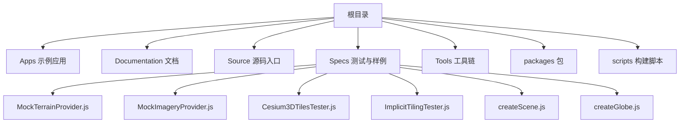
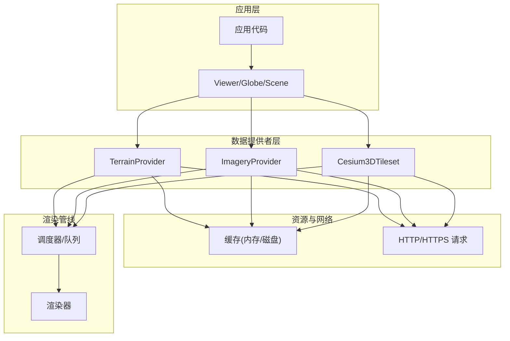
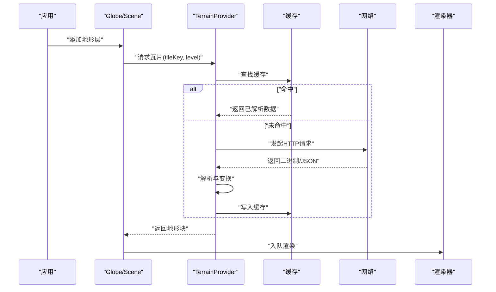
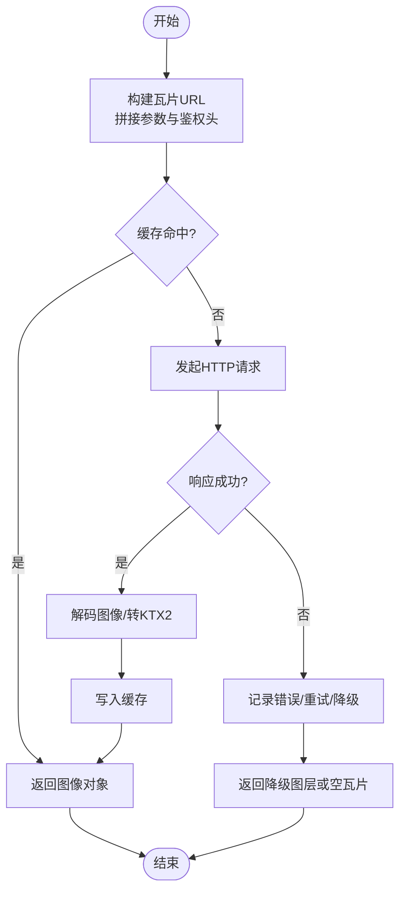
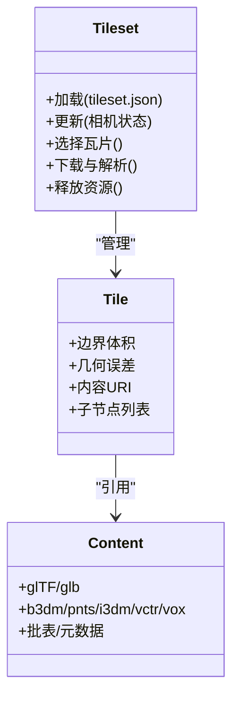
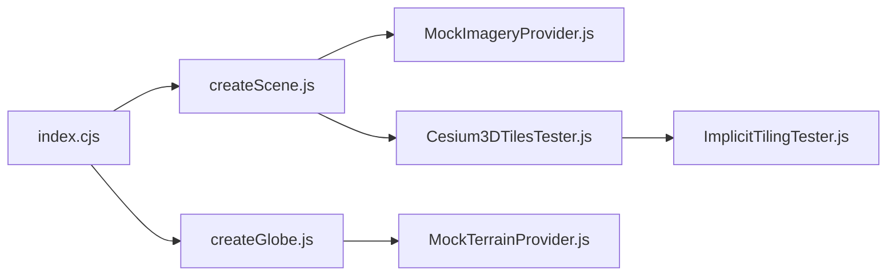

# 数据提供者API

<cite>
**本文引用的文件**   
- [README.md](file://README.md)
- [index.cjs](file://index.cjs)
- [package.json](file://package.json)
- [MockTerrainProvider.js](file://Specs/MockTerrainProvider.js)
- [MockImageryProvider.js](file://Specs/MockImageryProvider.js)
- [Cesium3DTilesTester.js](file://Specs/Cesium3DTilesTester.js)
- [ImplicitTilingTester.js](file://Specs/ImplicitTilingTester.js)
- [createScene.js](file://Specs/createScene.js)
- [createGlobe.js](file://Specs/createGlobe.js)
</cite>

## 目录
1. [简介](#简介)
2. [项目结构](#项目结构)
3. [核心组件](#核心组件)
4. [架构总览](#架构总览)
5. [详细组件分析](#详细组件分析)
6. [依赖分析](#依赖分析)
7. [性能考虑](#性能考虑)
8. [故障排查指南](#故障排查指南)
9. [结论](#结论)
10. [附录](#附录)

## 简介
本文件面向开发者，系统化梳理 Cesium 的数据提供者体系与 API 使用方式，重点覆盖：
- TerrainProvider 地形数据提供者
- ImageryProvider 影像图层提供者
- Cesium3DTileset 3D 瓦片集
并给出自定义数据提供者的开发指南、数据格式规范、性能优化策略、配置选项、错误处理与缓存机制说明，以及实际数据服务集成示例。

## 项目结构
仓库包含应用示例、测试样例、文档与构建脚本等。与数据提供者相关的参考实现与测试用例集中在 Specs 目录中，便于理解接口契约与行为约定。

图表来源
- [README.md:1-200](file://README.md#L1-L200)
- [package.json:1-200](file://package.json#L1-L200)

章节来源
- [README.md:1-200](file://README.md#L1-L200)
- [package.json:1-200](file://package.json#L1-L200)

## 核心组件
本节聚焦三类核心数据提供者及其在系统中的角色与职责：
- TerrainProvider：负责按需加载与渲染地形网格（如 QuantizedMesh），支持多分辨率瓦片、可用性掩码、法线与水遮罩扩展等。
- ImageryProvider：负责按需加载与合成影像图层（如 WMS/TMS/Mapbox/ArcGIS 等），支持透明度、版权信息、时间动态与请求队列控制。
- Cesium3DTileset：负责加载与渲染 3D Tiles 场景，包括层级调度、视锥裁剪、LOD 选择、批表与元数据访问等。

这些组件通过统一的“请求-响应”与“事件通知”模型与引擎交互，并在渲染管线中被组合为最终画面。

章节来源
- [MockTerrainProvider.js:1-200](file://Specs/MockTerrainProvider.js#L1-L200)
- [MockImageryProvider.js:1-200](file://Specs/MockImageryProvider.js#L1-L200)
- [Cesium3DTilesTester.js:1-200](file://Specs/Cesium3DTilesTester.js#L1-L200)

## 架构总览
下图展示数据提供者与渲染管线的整体关系：应用层创建 Globe/Scene，将各类 Provider 注册到对应层；渲染时由调度器根据相机状态与可见性发起异步请求，解析后入队渲染。

图表来源
- [createScene.js:1-200](file://Specs/createScene.js#L1-L200)
- [createGlobe.js:1-200](file://Specs/createGlobe.js#L1-L200)

## 详细组件分析

### TerrainProvider 地形数据提供者
- 职责与能力
  - 按区域与级别请求地形瓦片，返回高度图或量化网格数据。
  - 支持可选的法线贴图、水遮罩、可用性掩码等扩展字段。
  - 暴露属性：最大细节等级、是否支持高程查询、版权信息等。
- 关键方法与生命周期
  - 初始化与销毁：用于建立连接池、预取策略与清理资源。
  - 请求瓦片：根据 tileKey 与 level 获取二进制或 JSON 描述。
  - 可用性检测：判断某区域是否有可用数据，避免无效请求。
  - 事件回调：进度、错误、完成等事件供上层统计与降级处理。
- 数据格式规范
  - 常见为 QuantizedMesh 系列版本，配合 layer.json 描述多 URL、格式与范围。
  - 扩展字段可包含顶点法线、水遮罩、元数据可用性位图等。
- 错误处理与重试
  - 对网络失败、格式不匹配、越界请求进行统一捕获与回退。
  - 建议结合指数退避与并发限制提升稳定性。
- 缓存机制
  - 基于 tileKey 的内存缓存，必要时持久化至磁盘以加速冷启动。
  - 可结合可用性掩码减少重复下载。
- 性能优化
  - 合理设置最大并发数、预取半径与 LOD 阈值。
  - 利用法线/水遮罩按需加载，降低带宽与解码开销。
- 自定义实现要点
  - 遵循最小接口契约：初始化、请求、销毁、可用性检测。
  - 正确上报错误与进度，确保 UI 反馈与监控指标准确。
  - 保持幂等与线程安全，避免重复请求与竞态条件。

图表来源
- [MockTerrainProvider.js:1-200](file://Specs/MockTerrainProvider.js#L1-L200)
- [createGlobe.js:1-200](file://Specs/createGlobe.js#L1-L200)

章节来源
- [MockTerrainProvider.js:1-200](file://Specs/MockTerrainProvider.js#L1-L200)
- [createGlobe.js:1-200](file://Specs/createGlobe.js#L1-L200)

### ImageryProvider 影像图层提供者
- 职责与能力
  - 按瓦片坐标与缩放级别请求影像切片，支持透明通道与多源叠加。
  - 提供版权信息、时间轴、投影与坐标系转换能力。
- 关键方法与生命周期
  - 初始化：校验 URL 模板、参数与认证头。
  - 请求瓦片：生成具体 URL，处理跨域与鉴权。
  - 合成与着色：支持混合模式、色调映射与时间插值。
  - 销毁：释放图像对象与监听器。
- 数据格式规范
  - 常见为 PNG/JPEG/KTX2 切片，配合 TMS/WMS/OGC API 标准。
  - 支持带 alpha 通道的半透明叠加。
- 错误处理与重试
  - 针对 4xx/5xx、超时、跨域拒绝进行降级与提示。
  - 可启用本地缓存与离线兜底图层。
- 缓存机制
  - 基于 URL 指纹的内存缓存，支持 LRU 淘汰。
  - 可结合 Service Worker 做持久化缓存。
- 性能优化
  - 合并小请求、批量下载、分帧解码。
  - 使用 KTX2/BasisU 纹理压缩减少带宽与 GPU 上传成本。
- 自定义实现要点
  - 严格遵循请求签名与缓存键规则，保证幂等。
  - 正确处理异常路径，避免阻塞主线程。
  - 暴露必要的元数据（版权、时间、范围）以便 UI 展示。

图表来源
- [MockImageryProvider.js:1-200](file://Specs/MockImageryProvider.js#L1-L200)
- [createScene.js:1-200](file://Specs/createScene.js#L1-L200)

章节来源
- [MockImageryProvider.js:1-200](file://Specs/MockImageryProvider.js#L1-L200)
- [createScene.js:1-200](file://Specs/createScene.js#L1-L200)

### Cesium3DTileset 3D 瓦片集
- 职责与能力
  - 加载与渲染 3D Tiles 场景，自动进行视锥裁剪、距离/几何误差驱动的 LOD 选择。
  - 支持点云、矢量、体素、实例化与批表等多种内容类型。
  - 提供元数据访问、样式与筛选、时间动态与外部资源引用。
- 关键方法与生命周期
  - 初始化：解析 tileset.json，构建隐式/显式树，准备请求队列。
  - 更新循环：根据相机位置与 FOV 计算候选瓦片集合。
  - 加载与解析：下载 glTF/glb/binary，解压与构建 GPU 资源。
  - 销毁：释放 GPU 资源与取消未完成请求。
- 数据格式规范
  - 遵循 3D Tiles 规范，tileset.json 定义根节点、子节点、边界体积、几何误差与内容引用。
  - 支持多种内容格式：glTF、b3dm、pnts、i3dm、vctr、vox 等。
- 错误处理与重试
  - 对缺失资源、格式不兼容、权限问题进行处理与回退。
  - 支持部分失败时的局部降级显示。
- 缓存机制
  - 基于内容 URI 的内存缓存，必要时持久化。
  - 共享纹理与批表可减少重复传输。
- 性能优化
  - 调整 viewerRequestVolume、maximumScreenSpaceError、maximumMemoryUsage 等参数。
  - 启用 Draco/KTX2 压缩，合理使用批表与实例化。
  - 利用元数据进行选择性加载与剔除。
- 自定义实现要点
  - 若需自定义调度策略，应保留默认行为的可替换点。
  - 正确管理外部资源与跨域策略，避免死锁与泄漏。
  - 暴露进度与错误事件，便于监控与用户反馈。

图表来源
- [Cesium3DTilesTester.js:1-200](file://Specs/Cesium3DTilesTester.js#L1-L200)
- [ImplicitTilingTester.js:1-200](file://Specs/ImplicitTilingTester.js#L1-L200)

章节来源
- [Cesium3DTilesTester.js:1-200](file://Specs/Cesium3DTilesTester.js#L1-L200)
- [ImplicitTilingTester.js:1-200](file://Specs/ImplicitTilingTester.js#L1-L200)

### 自定义数据提供者开发指南
- 通用契约
  - 必须实现的最小接口：初始化、请求、销毁、可用性检测。
  - 必须上报的事件：进度、错误、完成、状态变更。
- 设计原则
  - 幂等与线程安全：相同键的请求只执行一次，避免重复下载。
  - 可观测性：暴露指标与日志钩子，便于定位问题。
  - 可扩展性：预留扩展字段与插件点，适配不同后端。
- 实现步骤
  - 定义请求键与缓存键，确保唯一性与稳定性。
  - 实现网络层封装，统一处理鉴权、重试与超时。
  - 实现解析器，将原始字节转换为引擎可用的数据结构。
  - 接入渲染管线，提交到调度器与渲染队列。
- 测试与验证
  - 使用 Mock 提供者进行单元测试与回归测试。
  - 构造边界用例：空结果、大文件、断网、跨域、非法格式。
  - 压测并发与内存占用，评估缓存命中率与 GC 压力。

章节来源
- [MockTerrainProvider.js:1-200](file://Specs/MockTerrainProvider.js#L1-L200)
- [MockImageryProvider.js:1-200](file://Specs/MockImageryProvider.js#L1-L200)

## 依赖分析
数据提供者与引擎模块之间的依赖关系如下：

图表来源
- [index.cjs:1-200](file://index.cjs#L1-L200)
- [createScene.js:1-200](file://Specs/createScene.js#L1-L200)
- [createGlobe.js:1-200](file://Specs/createGlobe.js#L1-L200)
- [MockImageryProvider.js:1-200](file://Specs/MockImageryProvider.js#L1-L200)
- [MockTerrainProvider.js:1-200](file://Specs/MockTerrainProvider.js#L1-L200)
- [Cesium3DTilesTester.js:1-200](file://Specs/Cesium3DTilesTester.js#L1-L200)
- [ImplicitTilingTester.js:1-200](file://Specs/ImplicitTilingTester.js#L1-L200)

章节来源
- [index.cjs:1-200](file://index.cjs#L1-L200)
- [createScene.js:1-200](file://Specs/createScene.js#L1-L200)
- [createGlobe.js:1-200](file://Specs/createGlobe.js#L1-L200)

## 性能考虑
- 网络与带宽
  - 启用 HTTP/2 与连接复用，合理设置并发上限。
  - 使用 KTX2/BasisU 纹理与 Draco 压缩，减少传输与解码成本。
- 缓存与存储
  - 采用多级缓存：内存优先、磁盘次之、远端兜底。
  - 基于指纹与过期策略管理缓存条目，避免无限增长。
- 渲染与GPU
  - 减少频繁重建与上传，尽量复用缓冲与纹理。
  - 使用批表与实例化合并绘制调用，降低 CPU-GPU 同步开销。
- 调度与LOD
  - 依据屏幕空间误差与距离阈值动态调整加载粒度。
  - 使用 viewerRequestVolume 控制预取范围，平衡流畅度与内存占用。
- 监控与诊断
  - 采集关键指标：请求耗时、成功率、缓存命中率、GPU 内存峰值。
  - 结合采样日志与火焰图定位热点路径。

[本节为通用指导，无需特定文件来源]

## 故障排查指南
- 常见问题
  - 跨域与鉴权失败：检查 CORS 头与令牌刷新逻辑。
  - 瓦片不可用或空白：核对 tileKey 与 URL 模板、投影与范围。
  - 内存泄漏：确认销毁流程是否正确释放图像与缓冲区。
  - 卡顿与掉帧：检查解码与上传是否在后台线程，是否触发大量 GC。
- 定位方法
  - 开启调试日志与网络抓包，对比期望与实际请求。
  - 使用性能面板观察主线程阻塞与 GPU 资源变化。
  - 构造最小复现用例，逐步隔离问题域。
- 恢复策略
  - 启用降级图层与离线缓存，保障基本可用性。
  - 实施熔断与限流，防止雪崩效应。
  - 对关键路径增加重试与回退逻辑。

章节来源
- [MockTerrainProvider.js:1-200](file://Specs/MockTerrainProvider.js#L1-L200)
- [MockImageryProvider.js:1-200](file://Specs/MockImageryProvider.js#L1-L200)
- [Cesium3DTilesTester.js:1-200](file://Specs/Cesium3DTilesTester.js#L1-L200)

## 结论
Cesium 的数据提供者体系通过清晰的接口契约与灵活的扩展点，支撑了地形、影像与 3D 瓦片等多类数据的高效加载与渲染。遵循本文档的规范与实践，可实现稳定、高性能且易维护的数据服务集成方案。

[本节为总结，无需特定文件来源]

## 附录
- 配置项速查
  - TerrainProvider：最大细节等级、可用性掩码、法线与水遮罩开关、并发与预取半径。
  - ImageryProvider：URL 模板、参数与鉴权、时间轴、混合模式、缓存策略。
  - Cesium3DTileset：viewerRequestVolume、maximumScreenSpaceError、maximumMemoryUsage、压缩与批表开关。
- 数据格式参考
  - 地形：QuantizedMesh 系列与 layer.json 描述。
  - 影像：PNG/JPEG/KTX2 切片与 TMS/WMS/OGC 标准。
  - 3D Tiles：tileset.json 与内容格式（glTF/b3dm/pnts/i3dm/vctr/vox）。
- 集成示例路径
  - 场景与地球初始化：参见 createScene.js、createGlobe.js。
  - 自定义提供者样例：参见 MockTerrainProvider.js、MockImageryProvider.js。
  - 3D Tiles 测试与隐式瓦片：参见 Cesium3DTilesTester.js、ImplicitTilingTester.js。

章节来源
- [createScene.js:1-200](file://Specs/createScene.js#L1-L200)
- [createGlobe.js:1-200](file://Specs/createGlobe.js#L1-L200)
- [MockTerrainProvider.js:1-200](file://Specs/MockTerrainProvider.js#L1-L200)
- [MockImageryProvider.js:1-200](file://Specs/MockImageryProvider.js#L1-L200)
- [Cesium3DTilesTester.js:1-200](file://Specs/Cesium3DTilesTester.js#L1-L200)
- [ImplicitTilingTester.js:1-200](file://Specs/ImplicitTilingTester.js#L1-L200)