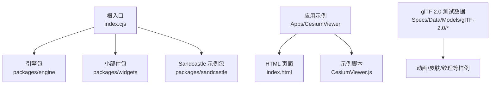
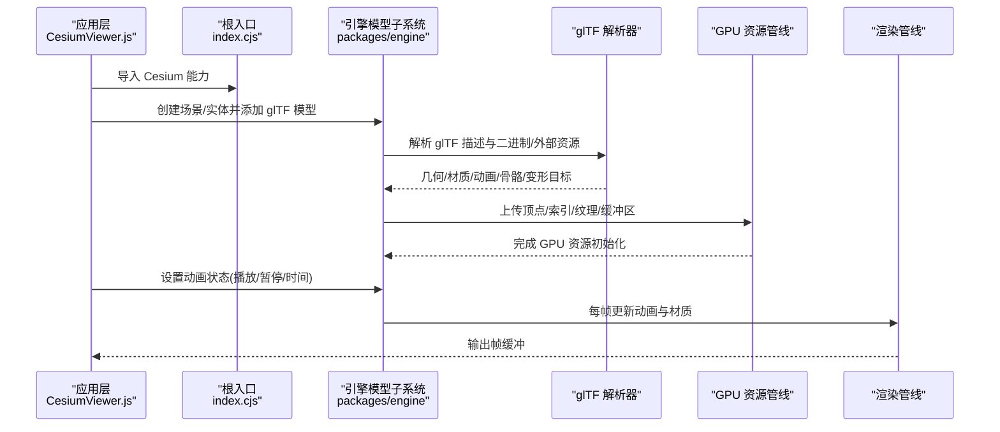
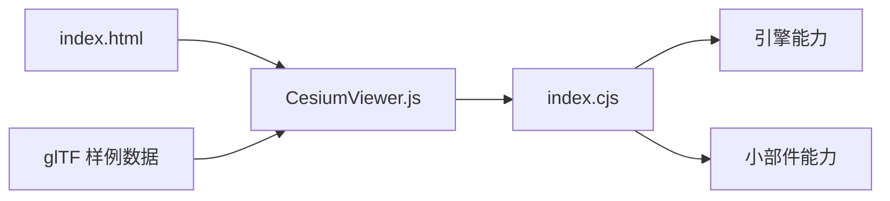

# 模型加载器API

<cite>
**本文引用的文件**   
- [README.md](file://README.md)
- [index.cjs](file://index.cjs)
- [package.json](file://package.json)
- [CesiumViewer.js](file://Apps/CesiumViewer/CesiumViewer.js)
- [index.html](file://Apps/CesiumViewer/index.html)
- [Models/glTF-2.0/AnimatedMorphCube/README.md](file://Specs/Data/Models/glTF-2.0/AnimatedMorphCube/README.md)
- [Models/glTF-2.0/SimpleSkin/README.md](file://Specs/Data/Models/glTF-2.0/SimpleSkin/README.md)
- [Models/glTF-2.0/BoxTexturedKtx2Basis/README.md](file://Specs/Data/Models/glTF-2.0/BoxTexturedKtx2Basis/README.md)
</cite>

## 目录
1. [简介](#简介)
2. [项目结构](#项目结构)
3. [核心组件](#核心组件)
4. [架构总览](#架构总览)
5. [详细组件分析](#详细组件分析)
6. [依赖分析](#依赖分析)
7. [性能考虑](#性能考虑)
8. [故障排除指南](#故障排除指南)
9. [结论](#结论)
10. [附录](#附录)

## 简介
本文件面向需要在 Cesium 中加载与渲染 glTF 2.0 模型的开发者，提供“模型加载器”的完整 API 文档与实践指南。内容覆盖：
- glTF 2.0 格式支持与扩展
- Model 与 GltfModel 类的使用方式
- 动画系统、材质渲染、骨骼动画、变形目标（Morph Targets）
- 模型优化技巧、压缩格式支持、内存管理策略
- 自定义模型处理器开发方法（格式转换、资源预处理、性能调优）
- 常见 3D 模型集成示例与故障排除

说明：
- 仓库为多包工程，包含引擎、小部件与应用示例；glTF 模型加载相关能力主要位于引擎包内。
- 由于当前工作区未直接暴露引擎源码路径，本文以仓库根入口与示例应用为依据进行架构与使用层面的说明，并在需要时引用测试数据中的 glTF 样例与说明文档作为参考。

## 项目结构
从仓库根目录看，关键位置如下：
- 根入口 index.cjs：聚合导出各子包能力，便于在应用中统一引入
- Apps/CesiumViewer：最小可运行示例，演示如何在页面中使用 Cesium 加载并展示 3D 模型
- Specs/Data/Models/glTF-2.0：大量 glTF 2.0 测试用例与说明，涵盖动画、皮肤、纹理压缩等特性
- package.json：构建与脚本配置，用于生成文档、打包与运行示例

图表来源
- [index.cjs](file://index.cjs)
- [CesiumViewer.js](file://Apps/CesiumViewer/CesiumViewer.js)
- [index.html](file://Apps/CesiumViewer/index.html)
- [Models/glTF-2.0/AnimatedMorphCube/README.md](file://Specs/Data/Models/glTF-2.0/AnimatedMorphCube/README.md)
- [Models/glTF-2.0/SimpleSkin/README.md](file://Specs/Data/Models/glTF-2.0/SimpleSkin/README.md)
- [Models/glTF-2.0/BoxTexturedKtx2Basis/README.md](file://Specs/Data/Models/glTF-2.0/BoxTexturedKtx2Basis/README.md)

章节来源
- [README.md](file://README.md)
- [index.cjs](file://index.cjs)
- [package.json](file://package.json)
- [CesiumViewer.js](file://Apps/CesiumViewer/CesiumViewer.js)
- [index.html](file://Apps/CesiumViewer/index.html)

## 核心组件
本节聚焦于模型加载与渲染的核心对象与流程。尽管具体实现位于引擎包内部，但从应用侧可见以下关键点：
- 通过根入口导入 Cesium，从而获得模型加载与渲染所需的全部能力
- 在应用中创建场景与实体，将 glTF 模型添加到场景中
- 控制模型动画播放、暂停、循环与时间轴
- 调整材质参数、透明度、光照与环境贴图
- 处理骨骼动画与变形目标（Morph Targets）

章节来源
- [index.cjs](file://index.cjs)
- [CesiumViewer.js](file://Apps/CesiumViewer/CesiumViewer.js)
- [index.html](file://Apps/CesiumViewer/index.html)

## 架构总览
下图展示了从应用到引擎的模型加载与渲染主流程。该流程体现了 glTF 解析、资源加载、GPU 资源创建、动画更新与绘制阶段的关键交互。

图表来源
- [index.cjs](file://index.cjs)
- [CesiumViewer.js](file://Apps/CesiumViewer/CesiumViewer.js)
- [index.html](file://Apps/CesiumViewer/index.html)

## 详细组件分析

### glTF 2.0 格式支持
- 基础要素：节点层次、网格、材质、纹理、动画、皮肤（骨骼）、变形目标、批处理与实例化
- 扩展支持：纹理压缩（如 KTX2/Basis）、Draco 几何压缩、属性纹理、特征元数据等
- 参考样例与说明：
  - 动画与变形目标：参见 AnimatedMorphCube 样例说明
  - 骨骼动画：参见 SimpleSkin 样例说明
  - 纹理压缩：参见 BoxTexturedKtx2Basis 样例说明

章节来源
- [Models/glTF-2.0/AnimatedMorphCube/README.md](file://Specs/Data/Models/glTF-2.0/AnimatedMorphCube/README.md)
- [Models/glTF-2.0/SimpleSkin/README.md](file://Specs/Data/Models/glTF-2.0/SimpleSkin/README.md)
- [Models/glTF-2.0/BoxTexturedKtx2Basis/README.md](file://Specs/Data/Models/glTF-2.0/BoxTexturedKtx2Basis/README.md)

### Model 与 GltfModel 类使用方法
- 创建与加载：通过场景或实体接口加载 glTF 模型，返回模型对象供后续控制
- 动画控制：获取动画集合，设置时间、速度、循环模式，触发事件回调
- 材质与外观：访问材质定义，修改颜色、金属度、粗糙度、透明通道、环境贴图
- 骨骼与变形目标：读取骨骼名称与权重，驱动动画或运行时修改顶点形变
- 生命周期：销毁模型释放 GPU 资源，避免内存泄漏

注意：具体类名与 API 细节位于引擎包内部，应用侧通过根入口统一暴露。

章节来源
- [index.cjs](file://index.cjs)
- [CesiumViewer.js](file://Apps/CesiumViewer/CesiumViewer.js)
- [index.html](file://Apps/CesiumViewer/index.html)

### 模型动画系统
- 动画类型：变换动画（位置/旋转/缩放）、材质动画、蒙皮动画、变形目标动画
- 时间轴：支持循环、往返、单次播放；可设置起始/结束时间与采样频率
- 性能：批量更新动画状态，减少 CPU/GPU 同步开销；对复杂模型建议降低采样率

章节来源
- [Models/glTF-2.0/AnimatedMorphCube/README.md](file://Specs/Data/Models/glTF-2.0/AnimatedMorphCube/README.md)
- [Models/glTF-2.0/SimpleSkin/README.md](file://Specs/Data/Models/glTF-2.0/SimpleSkin/README.md)

### 材质渲染
- PBR 材质：支持基础色、金属度、粗糙度、法线贴图、环境映射
- 半透明与混合：合理设置深度写入与混合模式，避免排序问题
- 纹理变换：UV 偏移、缩放、旋转；注意与材质采样器的兼容性

章节来源
- [Models/glTF-2.0/BoxTexturedKtx2Basis/README.md](file://Specs/Data/Models/glTF-2.0/BoxTexturedKtx2Basis/README.md)

### 骨骼动画
- 骨架与权重：读取骨骼层级与顶点权重，确保动画正确驱动
- 性能优化：合并静态网格、剔除不可见骨骼、限制更新频率

章节来源
- [Models/glTF-2.0/SimpleSkin/README.md](file://Specs/Data/Models/glTF-2.0/SimpleSkin/README.md)

### 变形目标（Morph Targets）
- 形态插值：按权重混合多个形态，常用于表情或形变效果
- 精度与带宽：权衡形态数量与精度，必要时量化存储

章节来源
- [Models/glTF-2.0/AnimatedMorphCube/README.md](file://Specs/Data/Models/glTF-2.0/AnimatedMorphCube/README.md)

### 自定义模型处理器开发方法
- 目标：在不改动引擎核心前提下，扩展对特定格式或资源预处理的支持
- 步骤概览：
  - 注册自定义加载器：拦截指定 URL 或扩展名，执行前置处理
  - 格式转换：将非标准格式转换为 glTF 2.0（JSON+二进制或 glb）
  - 资源预处理：纹理重采样、压缩（KTX2/Basis）、几何简化（Draco）
  - 性能调优：分块加载、延迟初始化、按需卸载
- 集成点：通过根入口注入自定义处理器，或在应用层封装加载逻辑

章节来源
- [index.cjs](file://index.cjs)
- [CesiumViewer.js](file://Apps/CesiumViewer/CesiumViewer.js)

### 常见 3D 模型集成示例
- 飞机/车辆/人物等典型模型：参考 Apps/SampleData/models 下的 glTF 样例
- 集成要点：
  - 设置合适的初始相机视角与定位
  - 启用阴影与反射增强真实感
  - 针对移动端降低纹理分辨率与几何复杂度

章节来源
- [CesiumViewer.js](file://Apps/CesiumViewer/CesiumViewer.js)
- [index.html](file://Apps/CesiumViewer/index.html)

## 依赖分析
- 根入口 index.cjs 聚合导出引擎与小部件能力，应用通过它统一引入
- 示例应用 CesiumViewer.js 依赖 HTML 页面提供的 DOM 与 Canvas
- glTF 样例数据位于 Specs/Data/Models/glTF-2.0，用于验证与演示各类特性

图表来源
- [index.cjs](file://index.cjs)
- [CesiumViewer.js](file://Apps/CesiumViewer/CesiumViewer.js)
- [index.html](file://Apps/CesiumViewer/index.html)

章节来源
- [index.cjs](file://index.cjs)
- [CesiumViewer.js](file://Apps/CesiumViewer/CesiumViewer.js)
- [index.html](file://Apps/CesiumViewer/index.html)

## 性能考虑
- 纹理与压缩
  - 优先使用 KTX2/Basis 纹理，显著减小体积与加载时间
  - 根据设备能力选择不同 LOD 的纹理集
- 几何与压缩
  - 使用 Draco 压缩几何体，减少网络传输与内存占用
  - 合并静态网格，减少 draw call
- 动画与更新
  - 降低动画采样率，合并更新批次
  - 对不可见模型暂停动画更新
- 内存管理
  - 及时销毁不再使用的模型，释放 GPU 资源
  - 使用对象池复用频繁创建的临时对象

[本节为通用指导，不直接分析具体文件]

## 故障排除指南
- 模型无法加载
  - 检查 URL 可达性与跨域策略
  - 确认 glTF 文件完整性与外部资源路径正确
- 纹理缺失或显示异常
  - 校验纹理路径与命名
  - 尝试切换纹理压缩格式（KTX2/Basis）
- 动画不生效
  - 确认动画片段存在且时间范围有效
  - 检查骨骼与权重是否匹配
- 性能抖动
  - 监控 GPU 内存与 draw call 数量
  - 降低纹理分辨率与几何复杂度，启用 Draco/KTX2

[本节为通用指导，不直接分析具体文件]

## 结论
通过根入口统一引入 Cesium 能力，结合 glTF 2.0 的强大生态，可在 Cesium 中高效加载与渲染复杂 3D 模型。借助纹理与几何压缩、合理的动画与材质配置、以及完善的内存管理策略，可以在保证视觉效果的同时获得良好的性能表现。对于特殊格式或业务需求，可通过自定义模型处理器进行扩展。

[本节为总结性内容，不直接分析具体文件]

## 附录
- 快速开始
  - 在 HTML 页面中引入 Cesium 资源
  - 在脚本中创建场景与实体，加载 glTF 模型
  - 控制动画与材质，观察渲染结果
- 参考样例
  - 动画与变形目标：AnimatedMorphCube
  - 骨骼动画：SimpleSkin
  - 纹理压缩：BoxTexturedKtx2Basis

章节来源
- [index.html](file://Apps/CesiumViewer/index.html)
- [CesiumViewer.js](file://Apps/CesiumViewer/CesiumViewer.js)
- [Models/glTF-2.0/AnimatedMorphCube/README.md](file://Specs/Data/Models/glTF-2.0/AnimatedMorphCube/README.md)
- [Models/glTF-2.0/SimpleSkin/README.md](file://Specs/Data/Models/glTF-2.0/SimpleSkin/README.md)
- [Models/glTF-2.0/BoxTexturedKtx2Basis/README.md](file://Specs/Data/Models/glTF-2.0/BoxTexturedKtx2Basis/README.md)