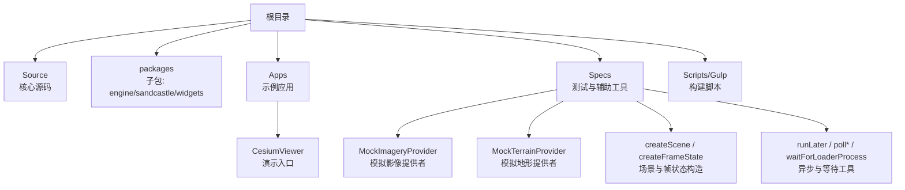
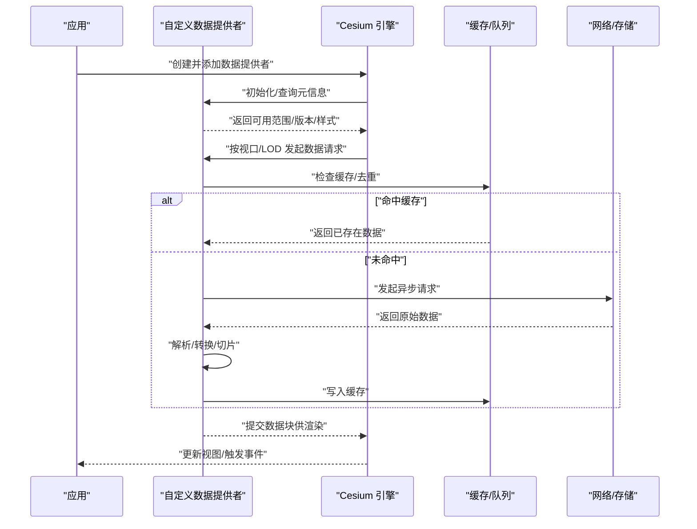
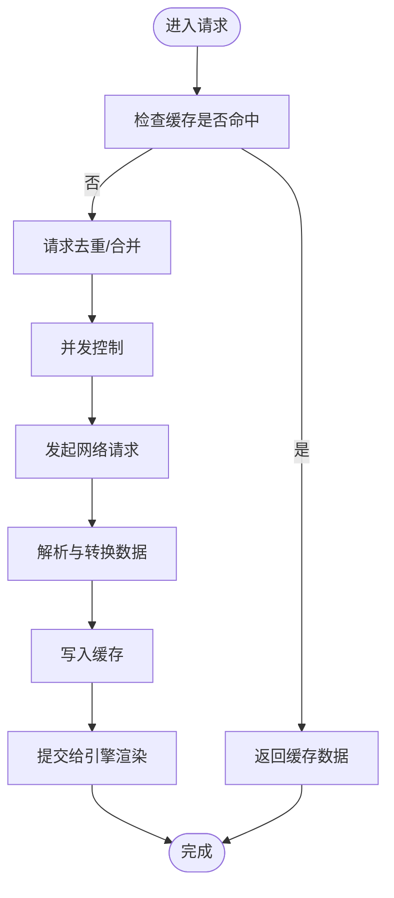
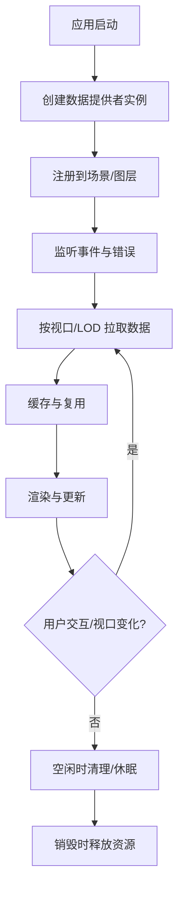
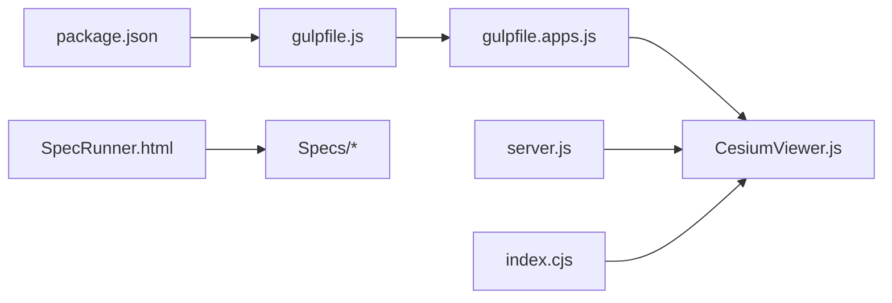

# 自定义数据提供者开发

<cite>
**本文引用的文件**   
- [README.md](file://README.md)
- [package.json](file://package.json)
- [index.cjs](file://index.cjs)
- [server.js](file://server.js)
- [gulpfile.js](file://gulpfile.js)
- [gulpfile.apps.js](file://gulpfile.apps.js)
- [CesiumViewer.js](file://Apps/CesiumViewer/CesiumViewer.js)
- [MockImageryProvider.js](file://Specs/MockImageryProvider.js)
- [MockTerrainProvider.js](file://Specs/MockTerrainProvider.js)
- [createScene.js](file://Specs/createScene.js)
- [createFrameState.js](file://Specs/createFrameState.js)
- [runLater.js](file://Specs/runLater.js)
- [pollToPromise.js](file://Specs/pollToPromise.js)
- [pollWhilePromise.js](file://Specs/pollWhilePromise.js)
- [waitForLoaderProcess.js](file://Specs/waitForLoaderProcess.js)
- [SpecRunner.html](file://Specs/SpecRunner.html)
</cite>

## 目录
1. [简介](#简介)
2. [项目结构](#项目结构)
3. [核心组件](#核心组件)
4. [架构总览](#架构总览)
5. [详细组件分析](#详细组件分析)
6. [依赖关系分析](#依赖关系分析)
7. [性能考虑](#性能考虑)
8. [故障排查指南](#故障排查指南)
9. [结论](#结论)
10. [附录](#附录)

## 简介
本指南面向需要在 Cesium 中实现“自定义数据提供者”的开发者，围绕以下目标展开：
- 理解 Cesium 数据提供者的架构模式与抽象接口设计原则
- 掌握异步任务调度、资源管理、事件系统、错误处理等核心机制
- 完成从接口实现到测试策略、性能优化的完整开发流程
- 深入与 Cesium 引擎的集成方法、生命周期管理与内存泄漏防护
- 结合企业级数据服务集成的实际案例与最佳实践

为便于读者快速上手，文档同时给出基于仓库内示例与测试工具的参考路径，帮助定位关键实现位置。

## 项目结构
仓库采用多包与示例分离的组织方式：
- Source 与 packages 包含核心引擎与扩展模块
- Apps 提供演示应用（如 CesiumViewer）
- Specs 提供大量测试用例与辅助工具，涵盖影像、地形、场景构造、帧状态、异步等待等
- Scripts/Gulp 负责构建与打包

下图展示与本指南相关的顶层结构与入口点：

图表来源
- [CesiumViewer.js](file://Apps/CesiumViewer/CesiumViewer.js)
- [MockImageryProvider.js](file://Specs/MockImageryProvider.js)
- [MockTerrainProvider.js](file://Specs/MockTerrainProvider.js)
- [createScene.js](file://Specs/createScene.js)
- [createFrameState.js](file://Specs/createFrameState.js)
- [runLater.js](file://Specs/runLater.js)
- [pollToPromise.js](file://Specs/pollToPromise.js)
- [pollWhilePromise.js](file://Specs/pollWhilePromise.js)
- [waitForLoaderProcess.js](file://Specs/waitForLoaderProcess.js)

章节来源
- [README.md](file://README.md)
- [package.json](file://package.json)
- [index.cjs](file://index.cjs)
- [server.js](file://server.js)
- [gulpfile.js](file://gulpfile.js)
- [gulpfile.apps.js](file://gulpfile.apps.js)

## 核心组件
为实现自定义数据提供者，需重点关注以下能力与组件：
- 抽象接口与职责边界：明确数据提供者的输入输出、可见性判定、更新时机、资源释放
- 异步任务调度：请求去重、并发控制、取消与重试
- 资源管理：缓存、引用计数、销毁清理
- 事件系统：进度、错误、就绪等事件通知
- 错误处理：网络异常、解析失败、降级策略
- 与引擎集成：注册到图层/地形管线、参与渲染循环、生命周期回调

在本仓库中，可通过以下文件快速定位相关实现与用法：
- 模拟影像提供者：[MockImageryProvider.js](file://Specs/MockImageryProvider.js)
- 模拟地形提供者：[MockTerrainProvider.js](file://Specs/MockTerrainProvider.js)
- 场景与帧状态构造：[createScene.js](file://Specs/createScene.js)、[createFrameState.js](file://Specs/createFrameState.js)
- 异步与等待工具：[runLater.js](file://Specs/runLater.js)、[pollToPromise.js](file://Specs/pollToPromise.js)、[pollWhilePromise.js](file://Specs/pollWhilePromise.js)、[waitForLoaderProcess.js](file://Specs/waitForLoaderProcess.js)

章节来源
- [MockImageryProvider.js](file://Specs/MockImageryProvider.js)
- [MockTerrainProvider.js](file://Specs/MockTerrainProvider.js)
- [createScene.js](file://Specs/createScene.js)
- [createFrameState.js](file://Specs/createFrameState.js)
- [runLater.js](file://Specs/runLater.js)
- [pollToPromise.js](file://Specs/pollToPromise.js)
- [pollWhilePromise.js](file://Specs/pollWhilePromise.js)
- [waitForLoaderProcess.js](file://Specs/waitForLoaderProcess.js)

## 架构总览
自定义数据提供者通常遵循“生产者-消费者”模型：
- 生产者：你的数据提供者，负责拉取、解析、组织数据
- 消费者：Cesium 引擎（影像层、地形层或自定义管线），负责调度、合并、渲染
- 中间件：缓存、队列、事件总线、错误上报

下图展示了典型的数据提供者与引擎交互流程：

图表来源
- [MockImageryProvider.js](file://Specs/MockImageryProvider.js)
- [MockTerrainProvider.js](file://Specs/MockTerrainProvider.js)
- [createScene.js](file://Specs/createScene.js)
- [createFrameState.js](file://Specs/createFrameState.js)

## 详细组件分析

### 抽象接口设计与职责边界
- 接口契约
  - 初始化：配置参数、校验依赖、准备缓存
  - 可用性：定义覆盖范围、时间范围、分辨率/层级
  - 请求：根据键（如瓦片键）获取数据，支持并发与取消
  - 事件：进度、错误、就绪、销毁
  - 销毁：释放资源、清空缓存、解绑事件
- 设计原则
  - 单一职责：只关注数据获取与组织，不直接操作渲染
  - 幂等与可恢复：重复请求应安全；失败可重试
  - 可观测：通过事件暴露内部状态变化
  - 可测试：提供稳定的桩与模拟对象

章节来源
- [MockImageryProvider.js](file://Specs/MockImageryProvider.js)
- [MockTerrainProvider.js](file://Specs/MockTerrainProvider.js)

### 异步任务调度
- 并发控制：限制最大并行请求数，避免雪崩
- 请求去重：相同键的请求合并，减少冗余
- 取消与超时：支持中断长时间阻塞的任务
- 重试与退避：指数退避、抖动策略
- 背压与队列：当消费端慢时，自动限流

章节来源
- [runLater.js](file://Specs/runLater.js)
- [pollToPromise.js](file://Specs/pollToPromise.js)
- [pollWhilePromise.js](file://Specs/pollWhilePromise.js)
- [waitForLoaderProcess.js](file://Specs/waitForLoaderProcess.js)

### 资源管理与缓存
- 缓存策略：LRU/TTL/按层级分桶
- 引用计数：共享资源按需释放
- 内存水位：监控峰值，触发清理
- 持久化：可选磁盘/IndexedDB 缓存

章节来源
- [MockImageryProvider.js](file://Specs/MockImageryProvider.js)
- [MockTerrainProvider.js](file://Specs/MockTerrainProvider.js)

### 事件系统与错误处理
- 事件类型：加载开始/结束、错误、警告、进度
- 错误分类：网络、协议、解析、业务逻辑
- 降级策略：空瓦片占位、低清回退、离线模式
- 上报与日志：结构化日志、采样上报

章节来源
- [MockImageryProvider.js](file://Specs/MockImageryProvider.js)
- [MockTerrainProvider.js](file://Specs/MockTerrainProvider.js)

### 与 Cesium 引擎的集成与生命周期
- 注册与发现：在场景/图层中注册提供者
- 帧驱动：跟随帧状态进行增量更新
- 可见性判定：基于视锥裁剪与距离阈值
- 销毁流程：显式调用销毁，确保无悬挂引用

章节来源
- [createScene.js](file://Specs/createScene.js)
- [createFrameState.js](file://Specs/createFrameState.js)

### 自定义影像提供者开发流程（以 MockImageryProvider 为例）
- 步骤
  1) 定义配置项与校验
  2) 实现可用性范围与层级映射
  3) 实现请求函数（含缓存与并发）
  4) 实现事件与错误上报
  5) 实现销毁与资源清理
  6) 编写单元测试与端到端验证
- 参考路径
  - 模拟实现：[MockImageryProvider.js](file://Specs/MockImageryProvider.js)
  - 场景构造与帧状态：[createScene.js](file://Specs/createScene.js)、[createFrameState.js](file://Specs/createFrameState.js)

章节来源
- [MockImageryProvider.js](file://Specs/MockImageryProvider.js)
- [createScene.js](file://Specs/createScene.js)
- [createFrameState.js](file://Specs/createFrameState.js)

### 自定义地形提供者开发流程（以 MockTerrainProvider 为例）
- 步骤
  1) 定义地形网格/高度图格式与坐标系
  2) 实现瓦片键生成与边界计算
  3) 实现异步加载与增量更新
  4) 实现 LOD 与视锥裁剪
  5) 实现错误与降级
- 参考路径
  - 模拟实现：[MockTerrainProvider.js](file://Specs/MockTerrainProvider.js)

章节来源
- [MockTerrainProvider.js](file://Specs/MockTerrainProvider.js)

### 复杂逻辑流程图（请求-缓存-渲染）

图表来源
- [MockImageryProvider.js](file://Specs/MockImageryProvider.js)
- [MockTerrainProvider.js](file://Specs/MockTerrainProvider.js)

### 概念性概览（通用工作流）

## 依赖关系分析
- 构建与运行
  - 构建脚本：[gulpfile.js](file://gulpfile.js)、[gulpfile.apps.js](file://gulpfile.apps.js)
  - 应用服务器：[server.js](file://server.js)
  - 入口导出：[index.cjs](file://index.cjs)
- 示例与测试
  - 示例应用：[CesiumViewer.js](file://Apps/CesiumViewer/CesiumViewer.js)
  - 测试运行器：[SpecRunner.html](file://Specs/SpecRunner.html)
  - 模拟提供者与工具：见前文“核心组件”

图表来源
- [package.json](file://package.json)
- [gulpfile.js](file://gulpfile.js)
- [gulpfile.apps.js](file://gulpfile.apps.js)
- [server.js](file://server.js)
- [index.cjs](file://index.cjs)
- [CesiumViewer.js](file://Apps/CesiumViewer/CesiumViewer.js)
- [SpecRunner.html](file://Specs/SpecRunner.html)

章节来源
- [package.json](file://package.json)
- [gulpfile.js](file://gulpfile.js)
- [gulpfile.apps.js](file://gulpfile.apps.js)
- [server.js](file://server.js)
- [index.cjs](file://index.cjs)
- [CesiumViewer.js](file://Apps/CesiumViewer/CesiumViewer.js)
- [SpecRunner.html](file://Specs/SpecRunner.html)

## 性能考虑
- 请求优化
  - 并发上限与队列长度调优
  - 请求去重与批量合并
  - 预取与懒加载平衡
- 缓存优化
  - 分层缓存（内存/磁盘）
  - TTL 与 LRU 组合
  - 热点数据常驻
- 渲染优化
  - 视锥裁剪与遮挡剔除
  - 纹理压缩与流式解码
  - 增量更新与差异合并
- 监控与诊断
  - 指标采集：QPS、延迟、命中率、内存占用
  - 采样日志与错误上报
  - 压力测试与回归基线

## 故障排查指南
- 常见问题
  - 请求风暴：检查并发与去重策略
  - 内存泄漏：确认销毁路径与事件解绑
  - 渲染闪烁：检查帧同步与增量更新
  - 跨域与证书：检查网络与安全策略
- 调试技巧
  - 使用示例应用快速复现：[CesiumViewer.js](file://Apps/CesiumViewer/CesiumViewer.js)
  - 借助测试工具构造场景与帧状态：[createScene.js](file://Specs/createScene.js)、[createFrameState.js](file://Specs/createFrameState.js)
  - 使用异步工具稳定断言：[runLater.js](file://Specs/runLater.js)、[pollToPromise.js](file://Specs/pollToPromise.js)、[pollWhilePromise.js](file://Specs/pollWhilePromise.js)、[waitForLoaderProcess.js](file://Specs/waitForLoaderProcess.js)
  - 运行测试套件：[SpecRunner.html](file://Specs/SpecRunner.html)

章节来源
- [CesiumViewer.js](file://Apps/CesiumViewer/CesiumViewer.js)
- [createScene.js](file://Specs/createScene.js)
- [createFrameState.js](file://Specs/createFrameState.js)
- [runLater.js](file://Specs/runLater.js)
- [pollToPromise.js](file://Specs/pollToPromise.js)
- [pollWhilePromise.js](file://Specs/pollWhilePromise.js)
- [waitForLoaderProcess.js](file://Specs/waitForLoaderProcess.js)
- [SpecRunner.html](file://Specs/SpecRunner.html)

## 结论
通过遵循统一的抽象接口与职责边界，配合完善的异步调度、缓存与事件机制，开发者可以高效地实现与企业级数据服务对接的自定义数据提供者。结合仓库中的模拟实现与测试工具，可以快速完成从原型到生产级的迭代，并在性能与稳定性方面达到工程要求。

## 附录
- 快速开始
  - 安装与构建：参考 [package.json](file://package.json) 与 [gulpfile.js](file://gulpfile.js)
  - 本地运行示例：参考 [server.js](file://server.js) 与 [CesiumViewer.js](file://Apps/CesiumViewer/CesiumViewer.js)
  - 运行测试：参考 [SpecRunner.html](file://Specs/SpecRunner.html)
- 参考实现
  - 影像提供者：[MockImageryProvider.js](file://Specs/MockImageryProvider.js)
  - 地形提供者：[MockTerrainProvider.js](file://Specs/MockTerrainProvider.js)
  - 场景与帧状态：[createScene.js](file://Specs/createScene.js)、[createFrameState.js](file://Specs/createFrameState.js)
  - 异步工具：[runLater.js](file://Specs/runLater.js)、[pollToPromise.js](file://Specs/pollToPromise.js)、[pollWhilePromise.js](file://Specs/pollWhilePromise.js)、[waitForLoaderProcess.js](file://Specs/waitForLoaderProcess.js)