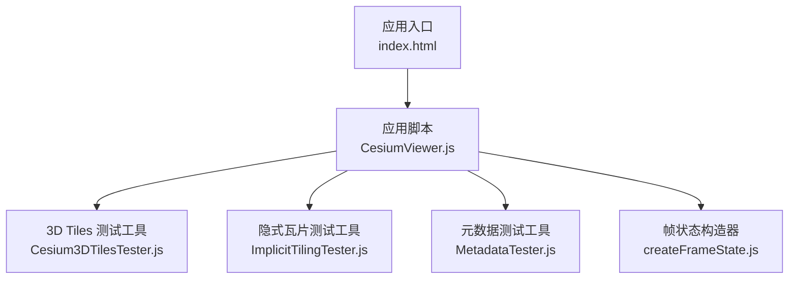
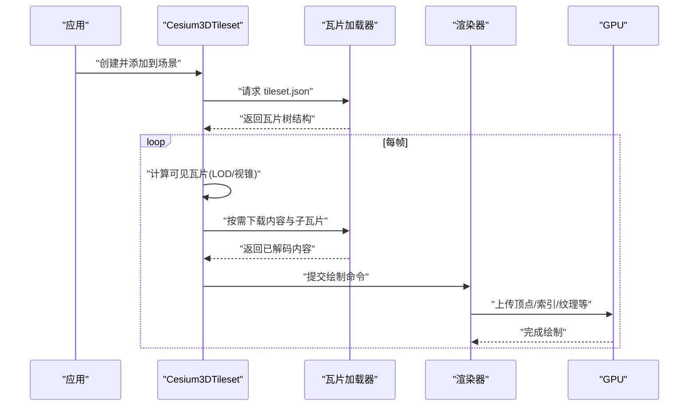
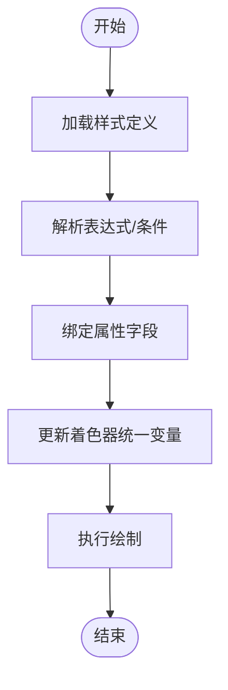
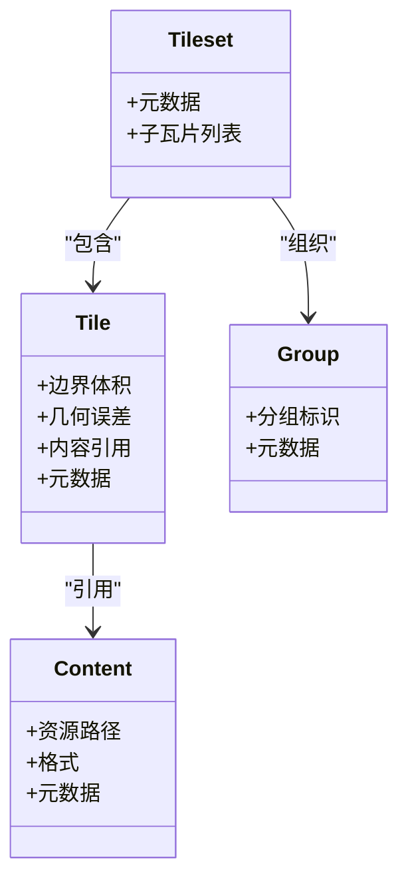
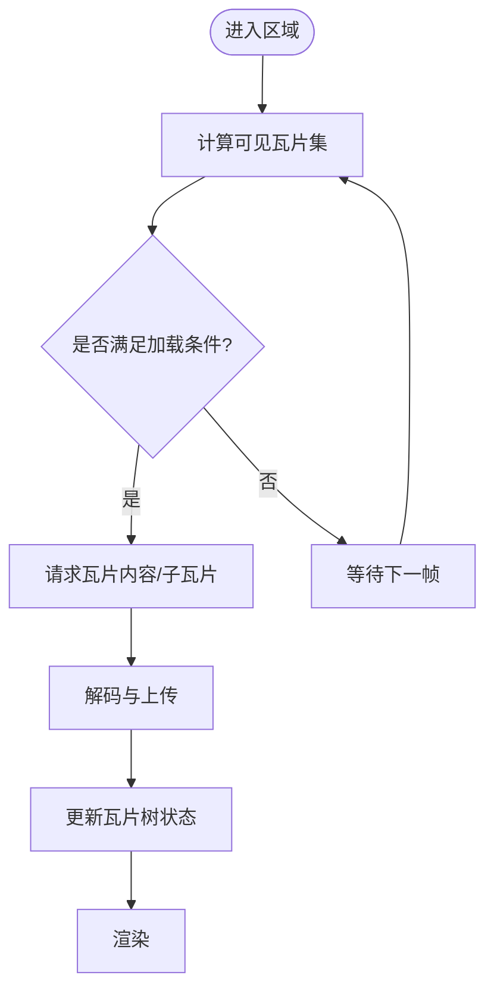
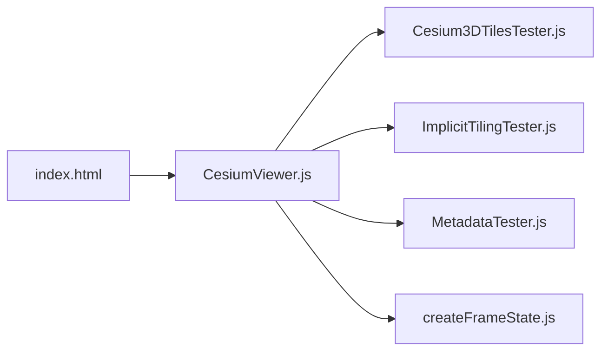

# Cesium3DTileset

<cite>
**本文引用的文件**   
- [Cesium3DTilesTester.js](file://Specs/Cesium3DTilesTester.js)
- [ImplicitTilingTester.js](file://Specs/ImplicitTilingTester.js)
- [MetadataTester.js](file://Specs/MetadataTester.js)
- [createFrameState.js](file://Specs/createFrameState.js)
- [index.html](file://Apps/CesiumViewer/index.html)
- [CesiumViewer.js](file://Apps/CesiumViewer/CesiumViewer.js)
</cite>

## 目录
1. [简介](#简介)
2. [项目结构](#项目结构)
3. [核心组件](#核心组件)
4. [架构总览](#架构总览)
5. [详细组件分析](#详细组件分析)
6. [依赖关系分析](#依赖关系分析)
7. [性能考量](#性能考量)
8. [故障排查指南](#故障排查指南)
9. [结论](#结论)
10. [附录](#附录)

## 简介
本文件面向使用 CesiumJS 的开发者，系统化梳理 Cesium3DTileset 在 3D Tiles 标准下的数据加载、渲染与管理能力。内容覆盖：
- 批处理模型（Batched）、实例化渲染（Instanced）、点云（PointCloud）、体素（Voxel）等类型的使用要点
- LOD（细节层次）、视锥剔除、流式加载等性能优化机制
- 样式系统：基于属性着色、条件渲染与动态更新
- 元数据处理、查询与交互
- 大规模场景的性能调优策略与最佳实践

说明：由于仓库未包含 Cesium3DTileset 的具体实现源码，本文档以测试套件与应用示例为依据进行归纳总结，确保所有描述均可追溯至仓库中的实际文件。

## 项目结构
与 3D Tiles 相关的工程组织主要分布在以下位置：
- Specs/Cesium3DTilesTester.js：3D Tiles 通用测试工具与断言
- Specs/ImplicitTilingTester.js：隐式瓦片树相关测试
- Specs/MetadataTester.js：元数据相关测试
- Apps/CesiumViewer/*：演示应用入口与初始化逻辑

图示来源
- [index.html:1-200](file://Apps/CesiumViewer/index.html#L1-L200)
- [CesiumViewer.js:1-200](file://Apps/CesiumViewer/CesiumViewer.js#L1-L200)
- [Cesium3DTilesTester.js:1-200](file://Specs/Cesium3DTilesTester.js#L1-L200)
- [ImplicitTilingTester.js:1-200](file://Specs/ImplicitTilingTester.js#L1-L200)
- [MetadataTester.js:1-200](file://Specs/MetadataTester.js#L1-L200)
- [createFrameState.js:1-200](file://Specs/createFrameState.js#L1-L200)

章节来源
- [index.html:1-200](file://Apps/CesiumViewer/index.html#L1-L200)
- [CesiumViewer.js:1-200](file://Apps/CesiumViewer/CesiumViewer.js#L1-L200)
- [Cesium3DTilesTester.js:1-200](file://Specs/Cesium3DTilesTester.js#L1-L200)
- [ImplicitTilingTester.js:1-200](file://Specs/ImplicitTilingTester.js#L1-L200)
- [MetadataTester.js:1-200](file://Specs/MetadataTester.js#L1-L200)
- [createFrameState.js:1-200](file://Specs/createFrameState.js#L1-L200)

## 核心组件
- 3D Tiles 测试工具：提供对 tileset.json、内容资源、边界体积、几何误差、子瓦片关系等的断言与辅助方法，用于验证加载与渲染行为是否符合规范。
- 隐式瓦片测试工具：针对隐式瓦片树的生成、层级推导、边界体积与几何误差语义等进行校验。
- 元数据测试工具：围绕 Tileset/Tiles/Content/Group 等层级的元数据定义、外部 Schema 引用、属性类型与取值范围等进行验证。
- 帧状态构造器：为测试环境构造统一的帧状态对象，使 3D Tiles 的每帧更新流程可被稳定驱动与观测。

章节来源
- [Cesium3DTilesTester.js:1-200](file://Specs/Cesium3DTilesTester.js#L1-L200)
- [ImplicitTilingTester.js:1-200](file://Specs/ImplicitTilingTester.js#L1-L200)
- [MetadataTester.js:1-200](file://Specs/MetadataTester.js#L1-L200)
- [createFrameState.js:1-200](file://Specs/createFrameState.js#L1-L200)

## 架构总览
从应用视角看，3D Tiles 的加载与渲染流程大致如下：
- 应用启动后创建 Viewer 并添加 Cesium3DTileset
- 解析 tileset.json，构建瓦片树（显式或隐式）
- 根据相机位置、距离与几何误差阈值，计算可见瓦片集合
- 按需下载内容与子瓦片，解码并上传 GPU
- 将瓦片内容转换为内部表示，参与渲染管线
- 支持样式表达式、元数据查询与交互拾取

图示来源
- [CesiumViewer.js:1-200](file://Apps/CesiumViewer/CesiumViewer.js#L1-L200)
- [Cesium3DTilesTester.js:1-200](file://Specs/Cesium3DTilesTester.js#L1-L200)
- [ImplicitTilingTester.js:1-200](file://Specs/ImplicitTilingTester.js#L1-L200)
- [MetadataTester.js:1-200](file://Specs/MetadataTester.js#L1-L200)
- [createFrameState.js:1-200](file://Specs/createFrameState.js#L1-L200)

## 详细组件分析

### 3D Tiles 类型与用法
- 批处理模型（Batched）
  - 特点：将多个图元合并到单一 draw call，适合大量重复几何体
  - 关注点：batchId 分配、批表（Batch Table）字段、混合透明度时的渲染顺序
  - 参考用例：Specs/SampleData/Cesium3DTiles/Batched/* 与 Specs/Data/Cesium3DTiles/Batched/*
- 实例化渲染（Instanced）
  - 特点：通过实例矩阵/变换批量绘制，减少 CPU/GPU 开销
  - 关注点：RTC 中心、量化方向编码、缩放与非均匀缩放
  - 参考用例：Specs/SampleData/Cesium3DTiles/Instanced/* 与 Specs/Data/Cesium3DTiles/Instanced/*
- 点云（PointCloud）
  - 特点：海量点数据的高效传输与渲染
  - 关注点：RGB/RGBA、法线、Draco 压缩、时间动态序列、WGS84 坐标
  - 参考用例：Specs/SampleData/Cesium3DTiles/PointCloud/* 与 Specs/Data/Cesium3DTiles/PointCloud/*
- 体素（Voxel）
  - 特点：三维栅格数据的可视化与分析
  - 关注点：形状（Box/Cylinder/Ellipsoid）、多属性体素、瓦片划分
  - 参考用例：Specs/SampleData/Cesium3DTiles/Voxel/* 与 Specs/Data/Cesium3DTiles/Voxel/*

章节来源
- [Cesium3DTilesTester.js:1-200](file://Specs/Cesium3DTilesTester.js#L1-L200)
- [ImplicitTilingTester.js:1-200](file://Specs/ImplicitTilingTester.js#L1-L200)
- [MetadataTester.js:1-200](file://Specs/MetadataTester.js#L1-L200)

### 样式系统（Style）
- 基于属性的着色：利用 Batch Table 或 Content 元数据字段作为着色输入
- 条件渲染：通过表达式控制显示/隐藏、颜色、大小等
- 动态样式更新：运行时修改样式表达式或参数，触发重绘
- 参考样例：Specs/Data/Cesium3DTiles/Style/style.json

图示来源
- [Cesium3DTilesTester.js:1-200](file://Specs/Cesium3DTilesTester.js#L1-L200)
- [MetadataTester.js:1-200](file://Specs/MetadataTester.js#L1-L200)

章节来源
- [Cesium3DTilesTester.js:1-200](file://Specs/Cesium3DTilesTester.js#L1-L200)
- [MetadataTester.js:1-200](file://Specs/MetadataTester.js#L1-L200)

### 元数据处理与查询
- 元数据层级：Tileset/Tiles/Content/Group 等节点均可携带元数据
- 外部 Schema：支持引用外部模式定义，增强字段约束与类型安全
- 查询与交互：结合拾取与属性访问，实现点击高亮、信息面板展示等
- 参考用例：Specs/Data/Cesium3DTiles/Metadata/*

图示来源
- [MetadataTester.js:1-200](file://Specs/MetadataTester.js#L1-L200)
- [ImplicitTilingTester.js:1-200](file://Specs/ImplicitTilingTester.js#L1-L200)

章节来源
- [MetadataTester.js:1-200](file://Specs/MetadataTester.js#L1-L200)
- [ImplicitTilingTester.js:1-200](file://Specs/ImplicitTilingTester.js#L1-L200)

### 隐式瓦片树与流式加载
- 隐式瓦片：无需显式列出全部子瓦片，按规则推导结构与边界体积
- 流式加载：根据相机运动与几何误差阈值，逐步加载所需瓦片
- 参考用例：Specs/Data/Cesium3DTiles/Implicit/* 与 Specs/Data/Cesium3DTiles/Tilesets/*

图示来源
- [ImplicitTilingTester.js:1-200](file://Specs/ImplicitTilingTester.js#L1-L200)
- [Cesium3DTilesTester.js:1-200](file://Specs/Cesium3DTilesTester.js#L1-L200)

章节来源
- [ImplicitTilingTester.js:1-200](file://Specs/ImplicitTilingTester.js#L1-L200)
- [Cesium3DTilesTester.js:1-200](file://Specs/Cesium3DTilesTester.js#L1-L200)

### 交互与拾取
- 拾取目标：瓦片、内容、批项、点等
- 交互反馈：高亮、弹出信息、联动其他图层
- 参考用例：Specs/Data/Cesium3DTiles/Style/style.json 及各类 Metadata 用例

章节来源
- [Cesium3DTilesTester.js:1-200](file://Specs/Cesium3DTilesTester.js#L1-L200)
- [MetadataTester.js:1-200](file://Specs/MetadataTester.js#L1-L200)

## 依赖关系分析
- 应用层依赖：CesiumViewer.js 负责初始化 Viewer 与 Tileset
- 测试层依赖：Cesium3DTilesTester.js、ImplicitTilingTester.js、MetadataTester.js 提供断言与辅助
- 运行期依赖：createFrameState.js 为测试提供稳定的帧上下文

图示来源
- [index.html:1-200](file://Apps/CesiumViewer/index.html#L1-L200)
- [CesiumViewer.js:1-200](file://Apps/CesiumViewer/CesiumViewer.js#L1-L200)
- [Cesium3DTilesTester.js:1-200](file://Specs/Cesium3DTilesTester.js#L1-L200)
- [ImplicitTilingTester.js:1-200](file://Specs/ImplicitTilingTester.js#L1-L200)
- [MetadataTester.js:1-200](file://Specs/MetadataTester.js#L1-L200)
- [createFrameState.js:1-200](file://Specs/createFrameState.js#L1-L200)

章节来源
- [index.html:1-200](file://Apps/CesiumViewer/index.html#L1-L200)
- [CesiumViewer.js:1-200](file://Apps/CesiumViewer/CesiumViewer.js#L1-L200)
- [Cesium3DTilesTester.js:1-200](file://Specs/Cesium3DTilesTester.js#L1-L200)
- [ImplicitTilingTester.js:1-200](file://Specs/ImplicitTilingTester.js#L1-L200)
- [MetadataTester.js:1-200](file://Specs/MetadataTester.js#L1-L200)
- [createFrameState.js:1-200](file://Specs/createFrameState.js#L1-L200)

## 性能考量
- LOD 控制
  - 合理设置几何误差阈值，平衡视觉质量与带宽/内存占用
  - 避免过细的初始级别导致首屏卡顿
- 视锥剔除
  - 利用边界体积快速剔除不可见瓦片，降低无效下载与解码
- 流式加载
  - 渐进式加载与预取策略，提升大场景浏览流畅度
- 批处理与实例化
  - 优先使用批处理/实例化减少 draw call 数量
- 压缩与传输
  - 启用 Draco 等压缩格式，降低网络负载
- 样式与元数据
  - 避免每帧复杂表达式；尽量缓存中间结果
  - 合理使用外部 Schema，减少冗余字段

[本节为通用指导，不直接分析具体文件]

## 故障排查指南
- 瓦片无法加载
  - 检查 tileset.json 路径与跨域配置
  - 确认内容资源 URL 可达且格式正确
- 渲染异常或闪烁
  - 核对几何误差与边界体积一致性
  - 检查批处理/实例化参数是否正确
- 样式不生效
  - 确认表达式语法与字段存在性
  - 检查属性类型与取值范围
- 元数据缺失
  - 验证外部 Schema 引用与本地定义一致性
  - 检查 Content/Group 层级元数据是否完整

章节来源
- [Cesium3DTilesTester.js:1-200](file://Specs/Cesium3DTilesTester.js#L1-L200)
- [ImplicitTilingTester.js:1-200](file://Specs/ImplicitTilingTester.js#L1-L200)
- [MetadataTester.js:1-200](file://Specs/MetadataTester.js#L1-L200)

## 结论
Cesium3DTiles 在 CesiumJS 中提供了高效的大规模 3D 数据可视化解法。通过合理的瓦片组织、样式设计与性能调优，可在不同设备上获得良好的用户体验。建议在生产环境中结合测试用例与监控指标持续优化加载与渲染链路。

[本节为总结性内容，不直接分析具体文件]

## 附录
- 示例数据与用例
  - 批处理：Specs/SampleData/Cesium3DTiles/Batched/*
  - 实例化：Specs/SampleData/Cesium3DTiles/Instanced/*
  - 点云：Specs/SampleData/Cesium3DTiles/PointCloud/*
  - 体素：Specs/SampleData/Cesium3DTiles/Voxel/*
  - 样式：Specs/Data/Cesium3DTiles/Style/style.json
  - 元数据：Specs/Data/Cesium3DTiles/Metadata/*
  - 隐式瓦片：Specs/Data/Cesium3DTiles/Implicit/*
  - 瓦片集：Specs/Data/Cesium3DTiles/Tilesets/*

章节来源
- [Cesium3DTilesTester.js:1-200](file://Specs/Cesium3DTilesTester.js#L1-L200)
- [ImplicitTilingTester.js:1-200](file://Specs/ImplicitTilingTester.js#L1-L200)
- [MetadataTester.js:1-200](file://Specs/MetadataTester.js#L1-L200)