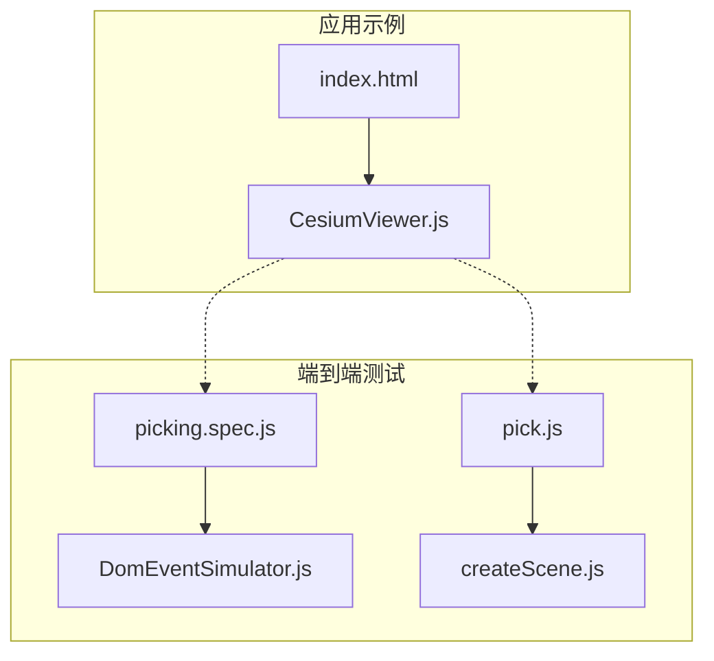
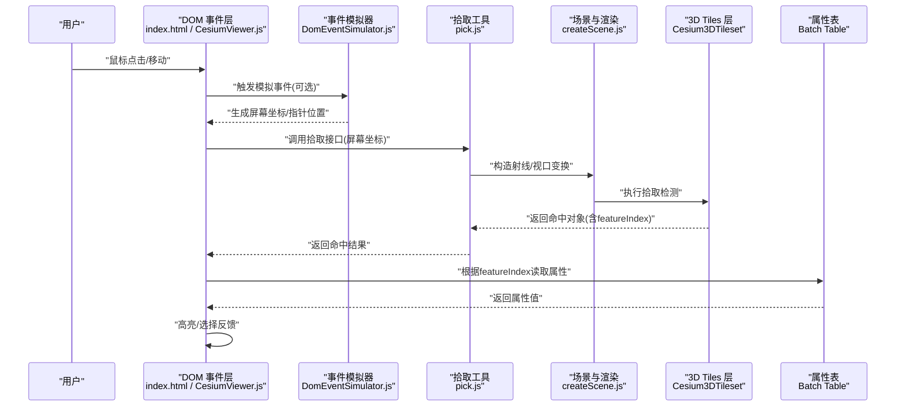
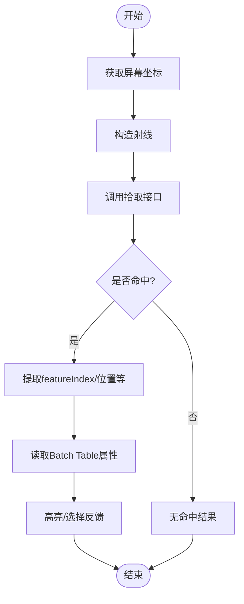
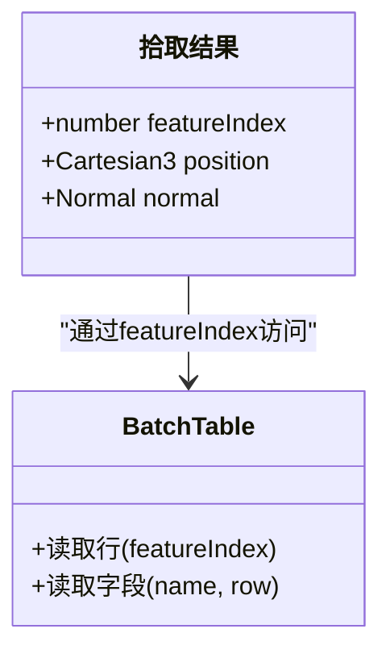
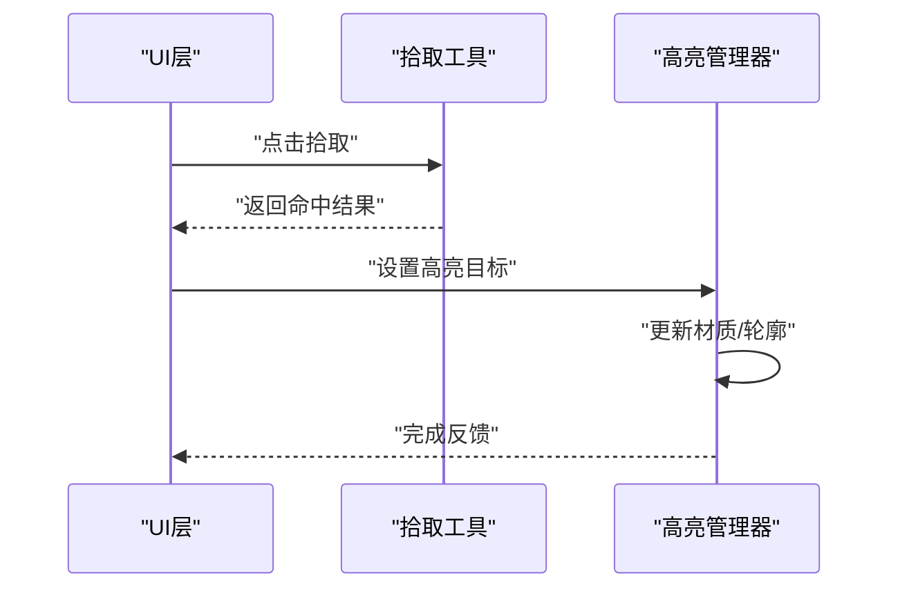
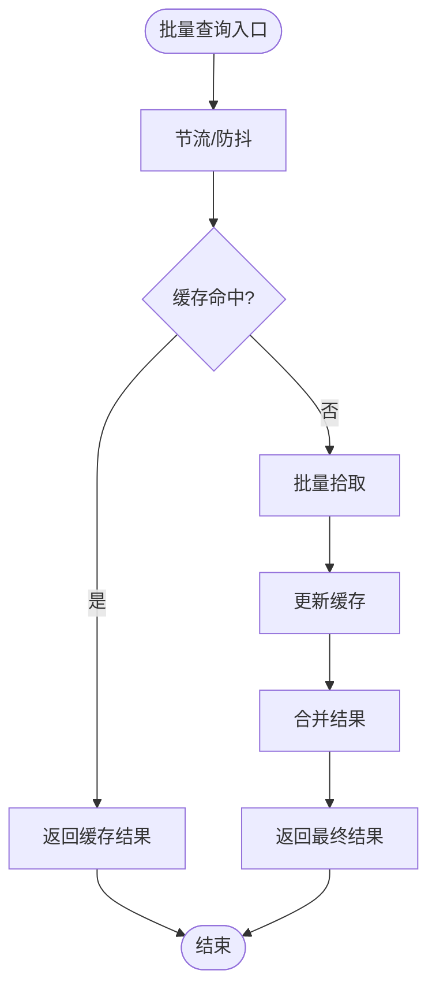
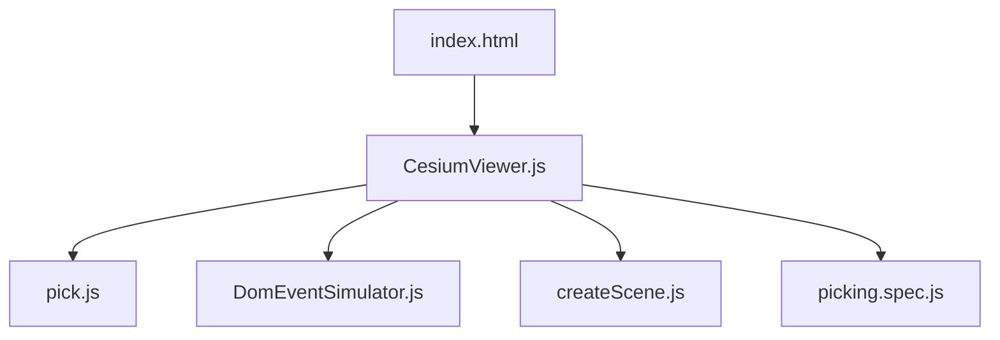
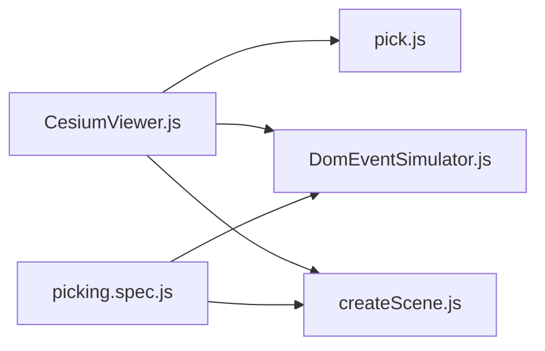

# 交互与查询

<cite>
**本文引用的文件**   
- [CesiumViewer.js](file://Apps/CesiumViewer/CesiumViewer.js)
- [index.html](file://Apps/CesiumViewer/index.html)
- [picking.spec.js](file://Specs/e2e/picking.spec.js)
- [pick.js](file://Specs/pick.js)
- [createScene.js](file://Specs/createScene.js)
- [DomEventSimulator.js](file://Specs/DomEventSimulator.js)
</cite>

## 目录
1. [简介](#简介)
2. [项目结构](#项目结构)
3. [核心组件](#核心组件)
4. [架构总览](#架构总览)
5. [详细组件分析](#详细组件分析)
6. [依赖关系分析](#依赖关系分析)
7. [性能考虑](#性能考虑)
8. [故障排查指南](#故障排查指南)
9. [结论](#结论)
10. [附录](#附录)

## 简介
本文件聚焦于 Cesium 中 3D Tiles（Cesium3DTileset）的交互与查询能力，围绕以下主题展开：
- 拾取操作（Picking）的实现原理与 API 使用，包括鼠标点击、射线检测等。
- 基于属性的查询接口，如 featureIndex、batchTable 的访问方法。
- 高亮显示与选择反馈的实现技巧。
- 复杂场景中的性能优化策略，如批量查询与结果缓存。
- 用户交互设计最佳实践与常见问题解决方案。
- 提供完整的交互式 3D 场景开发示例路径，便于快速上手。

## 项目结构
仓库中与“交互与查询”直接相关的代码主要分布在应用示例与端到端测试中：
- 应用示例：用于演示如何加载 3D Tiles 并处理交互事件。
- 端到端测试：覆盖拾取、事件模拟、场景创建等关键流程，可作为参考实现。

图表来源
- [index.html:1-200](file://Apps/CesiumViewer/index.html#L1-L200)
- [CesiumViewer.js:1-200](file://Apps/CesiumViewer/CesiumViewer.js#L1-L200)
- [picking.spec.js:1-200](file://Specs/e2e/picking.spec.js#L1-L200)
- [DomEventSimulator.js:1-200](file://Specs/DomEventSimulator.js#L1-L200)
- [pick.js:1-200](file://Specs/pick.js#L1-L200)
- [createScene.js:1-200](file://Specs/createScene.js#L1-L200)

章节来源
- [index.html:1-200](file://Apps/CesiumViewer/index.html#L1-L200)
- [CesiumViewer.js:1-200](file://Apps/CesiumViewer/CesiumViewer.js#L1-L200)
- [picking.spec.js:1-200](file://Specs/e2e/picking.spec.js#L1-L200)
- [DomEventSimulator.js:1-200](file://Specs/DomEventSimulator.js#L1-L200)
- [pick.js:1-200](file://Specs/pick.js#L1-L200)
- [createScene.js:1-200](file://Specs/createScene.js#L1-L200)

## 核心组件
- 视图与交互入口
  - index.html：页面骨架与资源引入，初始化 Viewer 或 Scene。
  - CesiumViewer.js：封装 Viewer/Scene 配置、3D Tiles 加载、事件绑定与交互逻辑。
- 拾取与事件模拟
  - picking.spec.js：端到端测试用例，覆盖点击拾取、属性读取、高亮反馈等流程。
  - DomEventSimulator.js：模拟 DOM 事件（如 click），驱动拾取流程。
  - pick.js：封装拾取工具函数，统一坐标转换与射线构造。
  - createScene.js：构建测试场景，准备 3D Tiles 与相机状态，为拾取提供稳定环境。

章节来源
- [index.html:1-200](file://Apps/CesiumViewer/index.html#L1-L200)
- [CesiumViewer.js:1-200](file://Apps/CesiumViewer/CesiumViewer.js#L1-L200)
- [picking.spec.js:1-200](file://Specs/e2e/picking.spec.js#L1-L200)
- [DomEventSimulator.js:1-200](file://Specs/DomEventSimulator.js#L1-L200)
- [pick.js:1-200](file://Specs/pick.js#L1-L200)
- [createScene.js:1-200](file://Specs/createScene.js#L1-L200)

## 架构总览
下图展示了从用户输入到 3D Tiles 拾取与属性查询的整体流程，以及高亮反馈的闭环。

图表来源
- [index.html:1-200](file://Apps/CesiumViewer/index.html#L1-L200)
- [CesiumViewer.js:1-200](file://Apps/CesiumViewer/CesiumViewer.js#L1-L200)
- [DomEventSimulator.js:1-200](file://Specs/DomEventSimulator.js#L1-L200)
- [pick.js:1-200](file://Specs/pick.js#L1-L200)
- [createScene.js:1-200](file://Specs/createScene.js#L1-L200)
- [picking.spec.js:1-200](file://Specs/e2e/picking.spec.js#L1-L200)

## 详细组件分析

### 拾取操作（Picking）实现原理与 API 使用
- 基本原理
  - 将屏幕坐标转换为世界空间射线，对 3D Tiles 进行射线求交。
  - 命中后返回包含几何信息与属性索引的对象，其中 featureIndex 指向 Batch Table 的行。
- 关键步骤
  - 获取屏幕坐标：从鼠标事件或模拟器生成的指针位置。
  - 构造射线：结合相机投影矩阵与视口尺寸。
  - 执行拾取：调用场景或 tileset 的拾取接口，传入射线与阈值。
  - 解析结果：提取 featureIndex、位置、法线等信息。
- 相关实现参考
  - 事件监听与回调：在 CesiumViewer.js 中绑定点击事件，并在回调中发起拾取。
  - 拾取工具封装：pick.js 提供统一的拾取入口，屏蔽底层差异。
  - 端到端验证：picking.spec.js 通过模拟点击验证拾取与属性读取的正确性。

图表来源
- [CesiumViewer.js:1-200](file://Apps/CesiumViewer/CesiumViewer.js#L1-L200)
- [pick.js:1-200](file://Specs/pick.js#L1-L200)
- [picking.spec.js:1-200](file://Specs/e2e/picking.spec.js#L1-L200)

章节来源
- [CesiumViewer.js:1-200](file://Apps/CesiumViewer/CesiumViewer.js#L1-L200)
- [pick.js:1-200](file://Specs/pick.js#L1-L200)
- [picking.spec.js:1-200](file://Specs/e2e/picking.spec.js#L1-L200)

### 基于属性的查询接口（featureIndex、batchTable）
- 概念说明
  - featureIndex：命中对象的属性行索引，用于定位 Batch Table 中的具体记录。
  - batchTable：存储每个要素的属性数据表，支持按行读取字段值。
- 使用方法
  - 从拾取结果中获取 featureIndex。
  - 通过 tileset 或内容提供的属性访问器读取对应行的字段。
  - 若存在多个命中，可遍历结果集，聚合或筛选所需属性。
- 参考实现
  - 在 picking.spec.js 中，通过模拟点击后读取属性，验证 featureIndex 与 batchTable 的一致性。
  - 在 CesiumViewer.js 中，可将属性展示与 UI 联动，形成查询面板。

图表来源
- [picking.spec.js:1-200](file://Specs/e2e/picking.spec.js#L1-L200)
- [CesiumViewer.js:1-200](file://Apps/CesiumViewer/CesiumViewer.js#L1-L200)

章节来源
- [picking.spec.js:1-200](file://Specs/e2e/picking.spec.js#L1-L200)
- [CesiumViewer.js:1-200](file://Apps/CesiumViewer/CesiumViewer.js#L1-L200)

### 高亮显示与选择反馈
- 常见做法
  - 叠加半透明轮廓或描边几何体，突出选中要素。
  - 临时改变材质颜色或透明度，提供视觉反馈。
  - 在 UI 侧同步展示属性信息，增强交互体验。
- 实现要点
  - 避免频繁重建几何体，尽量复用高亮实体或更新其属性。
  - 控制高亮层级与深度测试，确保不被遮挡。
  - 在动画帧中清理旧高亮，防止累积。
- 参考实现
  - 在 CesiumViewer.js 中集中管理高亮状态，配合事件回调切换。
  - 在 picking.spec.js 中验证高亮效果与属性展示的联动。

图表来源
- [CesiumViewer.js:1-200](file://Apps/CesiumViewer/CesiumViewer.js#L1-L200)
- [picking.spec.js:1-200](file://Specs/e2e/picking.spec.js#L1-L200)

章节来源
- [CesiumViewer.js:1-200](file://Apps/CesiumViewer/CesiumViewer.js#L1-L200)
- [picking.spec.js:1-200](file://Specs/e2e/picking.spec.js#L1-L200)

### 复杂场景中的性能优化策略
- 批量查询
  - 合并多次点击或拖拽过程中的拾取请求，减少重复计算。
  - 使用节流/防抖策略，限制高频事件的拾取频率。
- 结果缓存
  - 对热点区域或常用要素的结果进行缓存，避免重复射线求交。
  - 缓存键可包含 featureIndex、时间戳或可见性状态。
- 可视性与裁剪
  - 仅对当前视锥内的 tile 执行拾取，利用 tileset 的可视性判断。
  - 合理设置拾取阈值与精度，降低误判与开销。
- 参考实现
  - 在 CesiumViewer.js 中集成节流与缓存逻辑。
  - 在 picking.spec.js 中验证批量查询与缓存命中行为。

图表来源
- [CesiumViewer.js:1-200](file://Apps/CesiumViewer/CesiumViewer.js#L1-L200)
- [picking.spec.js:1-200](file://Specs/e2e/picking.spec.js#L1-L200)

章节来源
- [CesiumViewer.js:1-200](file://Apps/CesiumViewer/CesiumViewer.js#L1-L200)
- [picking.spec.js:1-200](file://Specs/e2e/picking.spec.js#L1-L200)

### 用户交互设计最佳实践
- 明确反馈
  - 点击后立即给出高亮与属性提示，提升确认感。
- 容错与回退
  - 未命中时提供友好提示；属性缺失时显示默认值。
- 一致性
  - 统一拾取阈值与高亮样式，保持跨设备一致体验。
- 可访问性
  - 支持键盘导航与屏幕阅读器提示，扩大受众范围。
- 参考实现
  - 在 CesiumViewer.js 中集中管理交互状态与 UI 联动。
  - 在 picking.spec.js 中覆盖异常路径与边界条件。

章节来源
- [CesiumViewer.js:1-200](file://Apps/CesiumViewer/CesiumViewer.js#L1-L200)
- [picking.spec.js:1-200](file://Specs/e2e/picking.spec.js#L1-L200)

### 完整交互式 3D 场景开发示例
- 页面初始化
  - 在 index.html 中引入必要的脚本与样式，创建 Viewer/Scene。
- 加载 3D Tiles
  - 在 CesiumViewer.js 中配置 tileset 源与加载选项。
- 绑定交互
  - 在 CesiumViewer.js 中监听点击事件，调用 pick.js 的拾取接口。
- 读取属性与高亮
  - 根据 featureIndex 读取 batchTable 属性，并触发高亮反馈。
- 端到端验证
  - 在 picking.spec.js 中使用 DomEventSimulator.js 模拟点击，验证全流程。

图表来源
- [index.html:1-200](file://Apps/CesiumViewer/index.html#L1-L200)
- [CesiumViewer.js:1-200](file://Apps/CesiumViewer/CesiumViewer.js#L1-L200)
- [pick.js:1-200](file://Specs/pick.js#L1-L200)
- [DomEventSimulator.js:1-200](file://Specs/DomEventSimulator.js#L1-L200)
- [createScene.js:1-200](file://Specs/createScene.js#L1-L200)
- [picking.spec.js:1-200](file://Specs/e2e/picking.spec.js#L1-L200)

章节来源
- [index.html:1-200](file://Apps/CesiumViewer/index.html#L1-L200)
- [CesiumViewer.js:1-200](file://Apps/CesiumViewer/CesiumViewer.js#L1-L200)
- [pick.js:1-200](file://Specs/pick.js#L1-L200)
- [DomEventSimulator.js:1-200](file://Specs/DomEventSimulator.js#L1-L200)
- [createScene.js:1-200](file://Specs/createScene.js#L1-L200)
- [picking.spec.js:1-200](file://Specs/e2e/picking.spec.js#L1-L200)

## 依赖关系分析
- 模块耦合
  - CesiumViewer.js 依赖 pick.js 与事件模拟器，负责协调交互与渲染。
  - picking.spec.js 依赖 DomEventSimulator.js 与 createScene.js，用于端到端验证。
- 外部依赖
  - 3D Tiles 层由 tileset 配置驱动，拾取结果与属性表由 tileset 内容提供。
- 潜在循环依赖
  - 建议将高亮管理与拾取逻辑解耦，避免相互引用导致循环。

图表来源
- [CesiumViewer.js:1-200](file://Apps/CesiumViewer/CesiumViewer.js#L1-L200)
- [pick.js:1-200](file://Specs/pick.js#L1-L200)
- [DomEventSimulator.js:1-200](file://Specs/DomEventSimulator.js#L1-L200)
- [createScene.js:1-200](file://Specs/createScene.js#L1-L200)
- [picking.spec.js:1-200](file://Specs/e2e/picking.spec.js#L1-L200)

章节来源
- [CesiumViewer.js:1-200](file://Apps/CesiumViewer/CesiumViewer.js#L1-L200)
- [pick.js:1-200](file://Specs/pick.js#L1-L200)
- [DomEventSimulator.js:1-200](file://Specs/DomEventSimulator.js#L1-L200)
- [createScene.js:1-200](file://Specs/createScene.js#L1-L200)
- [picking.spec.js:1-200](file://Specs/e2e/picking.spec.js#L1-L200)

## 性能考虑
- 事件节流与防抖：在高密度交互场景中降低拾取频率。
- 结果缓存：对热点要素与区域进行缓存，减少重复计算。
- 可视性裁剪：仅对可见 tile 执行拾取，利用 tileset 的可视性判断。
- 高亮复用：复用高亮实体或材质，避免频繁重建。
- 批量处理：合并多次拾取请求，统一处理与反馈。

[本节为通用指导，不直接分析具体文件]

## 故障排查指南
- 常见问题
  - 拾取无命中：检查相机投影、视口尺寸与射线构造是否正确。
  - 属性为空：确认 tileset 是否包含 batch table 且 featureIndex 有效。
  - 高亮被遮挡：调整高亮层级与深度测试参数。
- 调试手段
  - 使用 DomEventSimulator.js 固定输入，复现问题。
  - 在 picking.spec.js 中添加断言，逐步定位失败点。
  - 在 CesiumViewer.js 中打印中间结果，观察数据流。

章节来源
- [DomEventSimulator.js:1-200](file://Specs/DomEventSimulator.js#L1-L200)
- [picking.spec.js:1-200](file://Specs/e2e/picking.spec.js#L1-L200)
- [CesiumViewer.js:1-200](file://Apps/CesiumViewer/CesiumViewer.js#L1-L200)

## 结论
通过合理的拾取流程、属性查询与高亮反馈机制，可以在复杂 3D Tiles 场景中实现高效、稳定的交互体验。结合批量查询与结果缓存等优化策略，能够显著提升性能与用户体验。建议在工程实践中遵循模块化设计与解耦原则，并通过端到端测试保障交互正确性。

[本节为总结性内容，不直接分析具体文件]

## 附录
- 术语
  - 拾取（Picking）：通过射线与场景对象求交，确定用户点击的目标。
  - 特征索引（featureIndex）：指向 Batch Table 中某一行记录的索引。
  - 批表（Batch Table）：存储要素属性数据的表格。
- 参考路径
  - 页面初始化：[index.html](file://Apps/CesiumViewer/index.html)
  - 交互主逻辑：[CesiumViewer.js](file://Apps/CesiumViewer/CesiumViewer.js)
  - 拾取工具：[pick.js](file://Specs/pick.js)
  - 事件模拟：[DomEventSimulator.js](file://Specs/DomEventSimulator.js)
  - 场景构建：[createScene.js](file://Specs/createScene.js)
  - 端到端用例：[picking.spec.js](file://Specs/e2e/picking.spec.js)

[本节为补充信息，不直接分析具体文件]