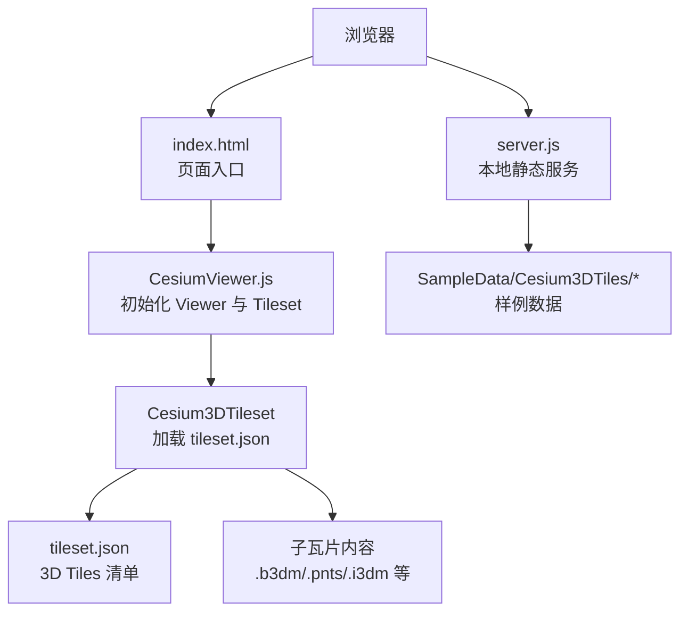
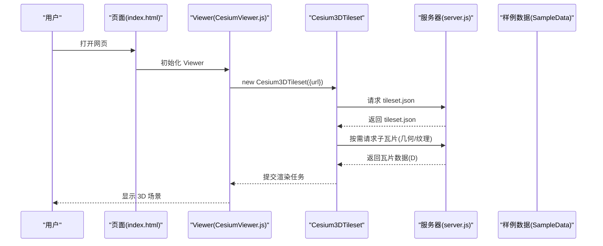
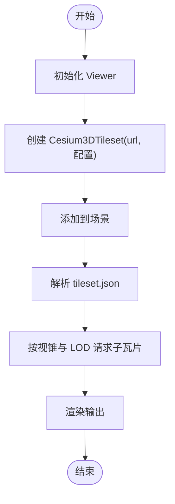
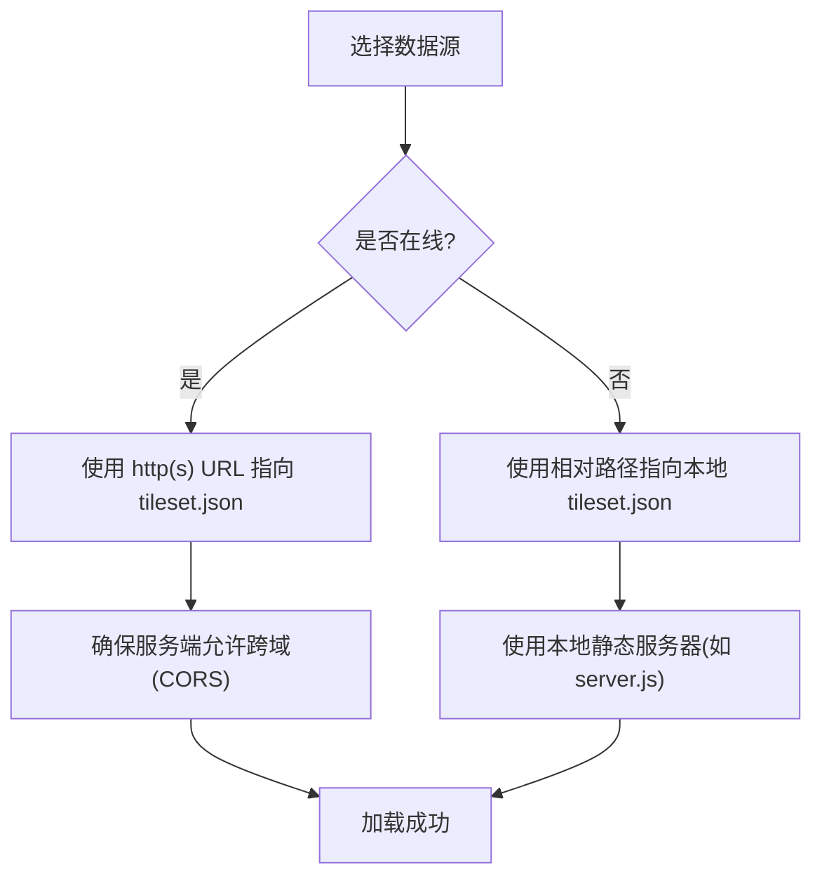
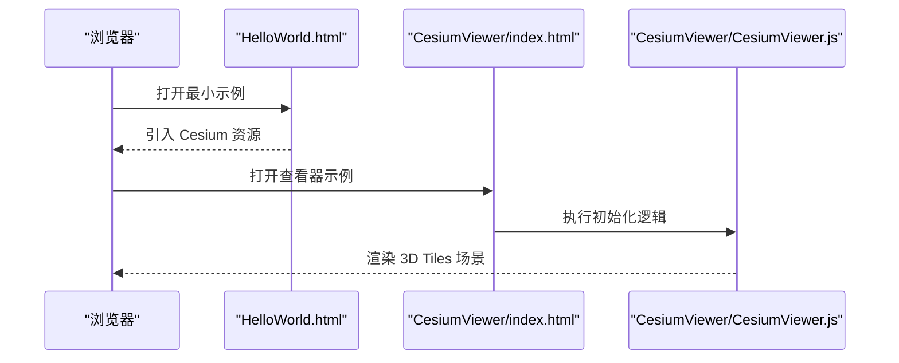
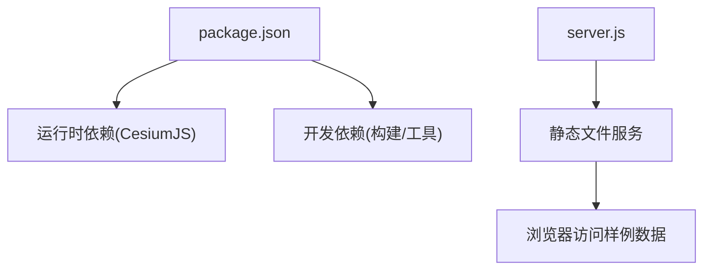

# 基础使用

<cite>
**本文引用的文件**   
- [CesiumViewer.js](file://Apps/CesiumViewer/CesiumViewer.js)
- [index.html](file://Apps/CesiumViewer/index.html)
- [HelloWorld.html](file://Apps/HelloWorld.html)
- [package.json](file://package.json)
- [server.js](file://server.js)
</cite>

## 目录
1. [简介](#简介)
2. [项目结构](#项目结构)
3. [核心组件](#核心组件)
4. [架构总览](#架构总览)
5. [详细组件分析](#详细组件分析)
6. [依赖分析](#依赖分析)
7. [性能考虑](#性能考虑)
8. [故障排查指南](#故障排查指南)
9. [结论](#结论)
10. [附录](#附录)

## 简介
本章节面向初次接触 CesiumJS 的开发者，聚焦于 3D Tiles 的基础使用：如何创建与初始化 Cesium3DTileset、常用配置项（如 url、maximumScreenSpaceError、maximumMemoryUsage）的含义与调优建议、本地与网络数据源的加载方式、完整的最小可运行示例路径、常见错误处理与调试技巧，以及性能监控与资源管理的基本概念。

## 项目结构
仓库包含用于演示和测试的示例应用与大量 3D Tiles 样例数据。与“基础使用”最相关的入口包括：
- Apps/CesiumViewer：一个基于 Viewer 的轻量查看器示例，适合快速上手并加载 3D Tiles。
- Apps/HelloWorld.html：最小化的 HTML 示例，便于理解页面结构与引入方式。
- Apps/SampleData/Cesium3DTiles：丰富的 3D Tiles 样例数据，可用于本地或在线加载验证。
- server.js：开发服务器脚本，便于在本地启动静态服务以访问样例数据。

图表来源
- [index.html:1-200](file://Apps/CesiumViewer/index.html#L1-L200)
- [CesiumViewer.js:1-200](file://Apps/CesiumViewer/CesiumViewer.js#L1-L200)
- [server.js:1-200](file://server.js#L1-L200)

章节来源
- [index.html](file://Apps/CesiumViewer/index.html)
- [CesiumViewer.js](file://Apps/CesiumViewer/CesiumViewer.js)
- [server.js](file://server.js)

## 核心组件
- Cesium3DTileset：负责解析 3D Tiles 清单（通常为 tileset.json），按需请求子瓦片并进行渲染调度。
- Viewer：提供地图容器、相机控制、图层管理等高层能力；Tileset 作为场景中的实体被添加到场景中。
- 3D Tiles 数据源：由 tileset.json 描述根节点，并通过相对或绝对 URL 引用子瓦片与内容资源。

关键配置项说明（结合官方 API 语义）：
- url：指向 tileset.json 的 URL，支持本地路径与网络地址。
- maximumScreenSpaceError：屏幕空间误差阈值，值越小细节越高但开销越大，常用于平衡清晰度与帧率。
- maximumMemoryUsage：内存占用上限，超过后触发瓦片卸载策略，避免 OOM。
- 其他常用选项（视版本而定）：includeSubtreeRequests、requestVolume、viewerRequestVolume、showBoundingVolume 等，用于细化加载范围与调试可视化。

章节来源
- [CesiumViewer.js:1-200](file://Apps/CesiumViewer/CesiumViewer.js#L1-L200)

## 架构总览
下图展示了从页面到 3D Tiles 渲染的关键流程：页面加载 → 初始化 Viewer → 创建 Tileset → 解析 tileset.json → 按需请求子瓦片 → 渲染。

图表来源
- [index.html:1-200](file://Apps/CesiumViewer/index.html#L1-L200)
- [CesiumViewer.js:1-200](file://Apps/CesiumViewer/CesiumViewer.js#L1-L200)
- [server.js:1-200](file://server.js#L1-L200)

## 详细组件分析

### 组件A：Cesium3DTileset 实例化与基本配置
- 目标：通过指定 url 将 3D Tiles 加载到场景中，并根据需要调整 maximumScreenSpaceError、maximumMemoryUsage 等参数。
- 典型步骤：
  - 在页面中引入 Cesium 资源。
  - 初始化 Viewer。
  - 创建 Cesium3DTileset 实例并传入配置对象。
  - 将 Tileset 加入场景。
- 关键参数：
  - url：必填，指向 tileset.json。
  - maximumScreenSpaceError：调节细节级别与性能。
  - maximumMemoryUsage：控制内存上限与瓦片生命周期。
- 参考实现位置：
  - [CesiumViewer.js:1-200](file://Apps/CesiumViewer/CesiumViewer.js#L1-L200)

图表来源
- [CesiumViewer.js:1-200](file://Apps/CesiumViewer/CesiumViewer.js#L1-L200)

章节来源
- [CesiumViewer.js:1-200](file://Apps/CesiumViewer/CesiumViewer.js#L1-L200)

### 组件B：3D Tiles 数据源加载方式
- 网络 URL 加载：
  - 将 tileset.json 部署到 Web 服务器，url 直接指向该地址。
  - 适用于在线服务或 CDN 分发。
- 本地文件加载：
  - 将 tileset.json 与样例数据放置在同一站点下，url 使用相对路径。
  - 需通过本地静态服务器（如 server.js）提供服务，避免跨域与协议限制。
- 样例数据位置：
  - [SampleData/Cesium3DTiles](file://Apps/SampleData/Cesium3DTiles)
- 参考实现位置：
  - [CesiumViewer.js:1-200](file://Apps/CesiumViewer/CesiumViewer.js#L1-L200)
  - [index.html:1-200](file://Apps/CesiumViewer/index.html#L1-L200)

图表来源
- [CesiumViewer.js:1-200](file://Apps/CesiumViewer/CesiumViewer.js#L1-L200)
- [server.js:1-200](file://server.js#L1-L200)

章节来源
- [CesiumViewer.js:1-200](file://Apps/CesiumViewer/CesiumViewer.js#L1-L200)
- [index.html:1-200](file://Apps/CesiumViewer/index.html#L1-L200)
- [server.js:1-200](file://server.js#L1-L200)

### 组件C：最小可运行示例
- 页面入口：
  - [HelloWorld.html](file://Apps/HelloWorld.html)：展示最小 HTML 结构与引入方式。
  - [index.html](file://Apps/CesiumViewer/index.html)：配合 CesiumViewer.js 完成 Viewer 与 Tileset 的初始化。
- 运行方式：
  - 使用仓库提供的开发服务器启动静态服务，再在浏览器中访问对应页面。
- 参考实现位置：
  - [HelloWorld.html](file://Apps/HelloWorld.html)
  - [index.html:1-200](file://Apps/CesiumViewer/index.html#L1-L200)
  - [CesiumViewer.js:1-200](file://Apps/CesiumViewer/CesiumViewer.js#L1-L200)

图表来源
- [HelloWorld.html](file://Apps/HelloWorld.html)
- [index.html:1-200](file://Apps/CesiumViewer/index.html#L1-L200)
- [CesiumViewer.js:1-200](file://Apps/CesiumViewer/CesiumViewer.js#L1-L200)

章节来源
- [HelloWorld.html](file://Apps/HelloWorld.html)
- [index.html:1-200](file://Apps/CesiumViewer/index.html#L1-L200)
- [CesiumViewer.js:1-200](file://Apps/CesiumViewer/CesiumViewer.js#L1-L200)

## 依赖分析
- 运行时依赖：
  - CesiumJS 库（通过 npm 包或 CDN 引入）。
  - 本地静态服务器（可选，用于本地样例数据访问）。
- 构建与发布：
  - package.json 定义项目元信息与依赖。
  - server.js 提供简单的静态文件服务，便于本地调试。

图表来源
- [package.json:1-200](file://package.json#L1-L200)
- [server.js:1-200](file://server.js#L1-L200)

章节来源
- [package.json](file://package.json)
- [server.js](file://server.js)

## 性能考虑
- 屏幕空间误差（maximumScreenSpaceError）：
  - 降低该值可获得更高细节，但会增加瓦片数量与绘制开销；建议在移动端适当提高以降低卡顿。
- 内存上限（maximumMemoryUsage）：
  - 合理设置以避免频繁卸载导致抖动，同时防止内存溢出；可结合设备内存与场景复杂度调优。
- 瓦片体积与压缩：
  - 优先使用高效格式（如 glTF 二进制、Draco 压缩、KTX2 纹理）以减少网络传输与解码时间。
- 可视范围与请求体积：
  - 使用 viewerRequestVolume 或 requestVolume 限制加载区域，减少无关瓦片请求。
- 缓存与重复利用：
  - 共享纹理与模型资源可减少内存占用；注意清理不再使用的 Tileset 实例。

[本节为通用指导，不直接分析具体文件]

## 故障排查指南
- 无法加载 tileset.json：
  - 检查 url 是否正确、是否跨域、本地服务是否启动。
  - 确认样例数据路径与相对引用一致。
- 白屏或无渲染：
  - 检查 Viewer 初始化是否成功、Canvas 尺寸是否正常。
  - 确认浏览器控制台是否存在 JS 错误或 WebGL 上下文异常。
- 卡顿或掉帧：
  - 逐步提高 maximumScreenSpaceError 观察改善情况。
  - 降低 maximumMemoryUsage 观察卸载行为，必要时优化瓦片大小与纹理分辨率。
- CORS 问题：
  - 在服务端启用必要的跨域响应头，或使用本地静态服务器进行开发。

章节来源
- [CesiumViewer.js:1-200](file://Apps/CesiumViewer/CesiumViewer.js#L1-L200)
- [server.js:1-200](file://server.js#L1-L200)

## 结论
通过本文，你已了解如何在 CesiumJS 中创建与初始化 Cesium3DTileset、配置关键参数、加载本地与网络 3D Tiles 数据源，并掌握了最小可运行示例的路径与基本调试方法。在实际项目中，请根据设备能力与业务需求持续调优屏幕空间误差与内存上限，以获得稳定流畅的 3D 体验。

[本节为总结性内容，不直接分析具体文件]

## 附录
- 样例数据目录：
  - [Apps/SampleData/Cesium3DTiles](file://Apps/SampleData/Cesium3DTiles)
- 相关示例页面：
  - [Apps/CesiumViewer/index.html](file://Apps/CesiumViewer/index.html)
  - [Apps/CesiumViewer/CesiumViewer.js](file://Apps/CesiumViewer/CesiumViewer.js)
  - [Apps/HelloWorld.html](file://Apps/HelloWorld.html)
- 本地服务：
  - [server.js](file://server.js)

[本节为补充信息，不直接分析具体文件]