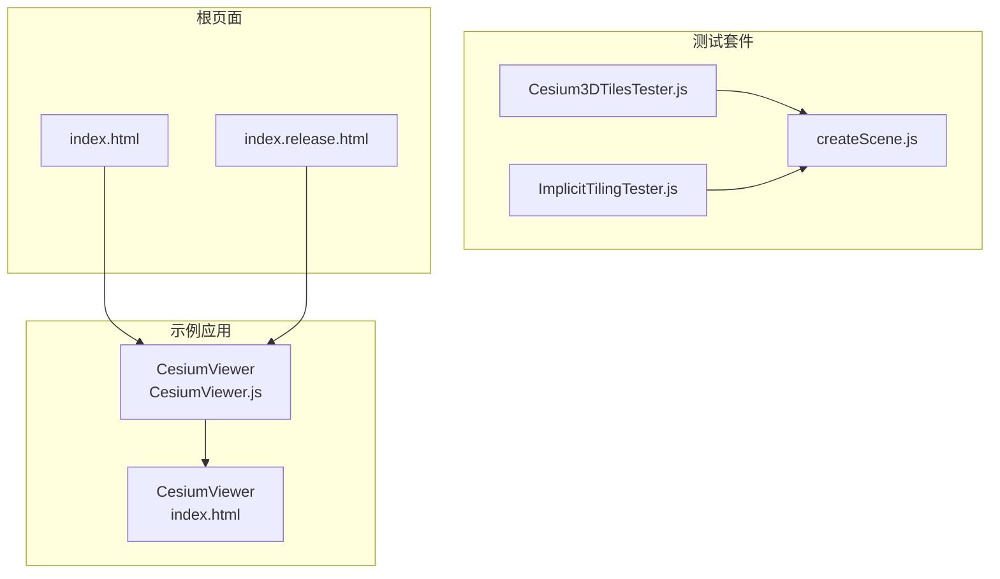
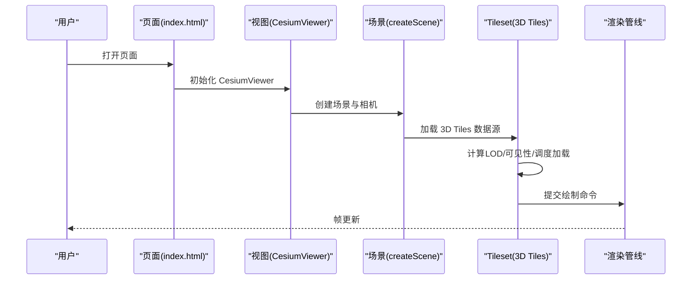
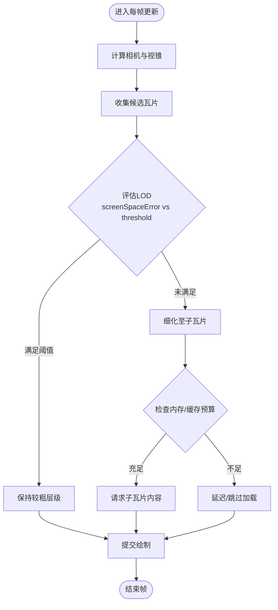
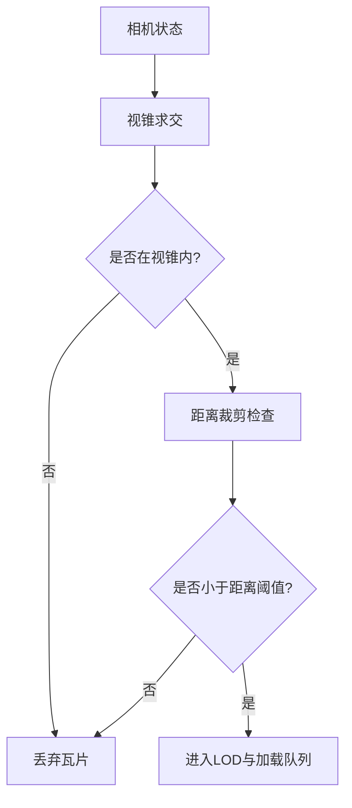
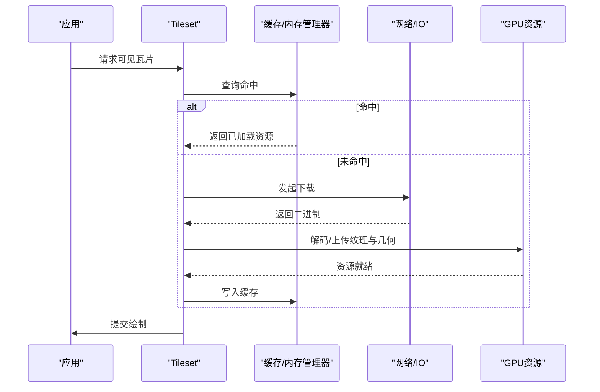
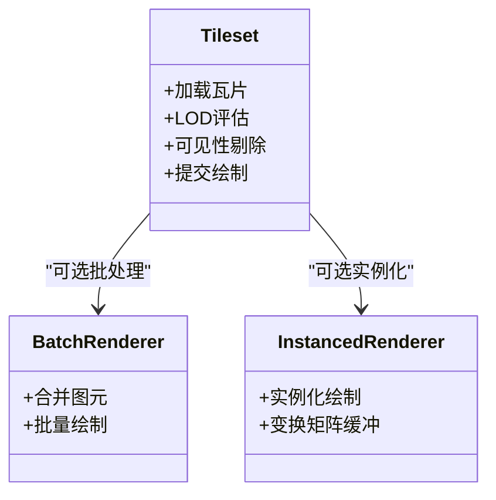
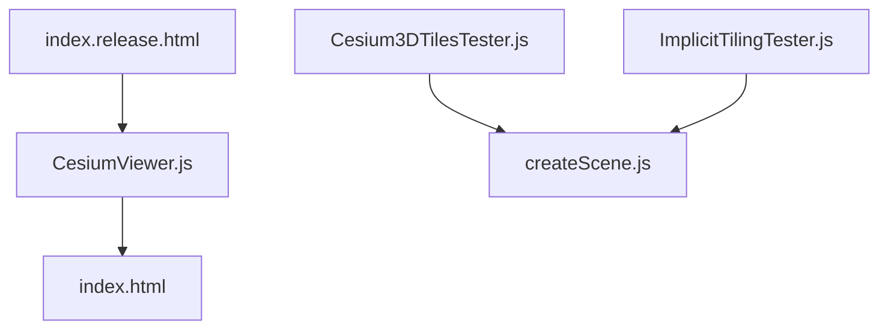

# 性能优化

<cite>
**本文引用的文件**   
- [Cesium3DTilesTester.js](file://Specs/Cesium3DTilesTester.js)
- [ImplicitTilingTester.js](file://Specs/ImplicitTilingTester.js)
- [createScene.js](file://Specs/createScene.js)
- [index.html](file://index.html)
- [index.release.html](file://index.release.html)
- [Apps/CesiumViewer/CesiumViewer.js](file://Apps/CesiumViewer/CesiumViewer.js)
- [Apps/CesiumViewer/index.html](file://Apps/CesiumViewer/index.html)
</cite>

## 目录
1. [简介](#简介)
2. [项目结构](#项目结构)
3. [核心组件](#核心组件)
4. [架构总览](#架构总览)
5. [详细组件分析](#详细组件分析)
6. [依赖分析](#依赖分析)
7. [性能考量](#性能考量)
8. [故障排查指南](#故障排查指南)
9. [结论](#结论)
10. [附录](#附录)

## 简介
本文件聚焦于 Cesium 3D Tiles（Cesium3DTileset）在大规模场景中的性能优化，围绕以下主题展开：
- LOD（细节层次）控制机制与关键参数调优：maximumScreenSpaceError、geometricError 等
- 视锥剔除与距离裁剪的工作原理与配置方法
- 流式加载与内存管理：maximumMemoryUsage、preloadAncestors 等参数的优化策略
- 批处理与实例化渲染的性能优势与适用场景
- 性能监控工具与调试技巧
- 不同硬件环境下的基准测试方法与优化建议

为便于读者快速定位实现位置，文档在涉及具体代码或测试用例时提供“章节来源”和“图示来源”。

## 项目结构
仓库包含示例应用、测试套件与构建脚本。与 3D Tiles 性能相关的关键入口与测试位于：
- 示例应用：Apps/CesiumViewer（用于演示与交互验证）
- 测试套件：Specs 下与 3D Tiles、隐式瓦片相关的测试器
- 根级页面：index.html / index.release.html（用于本地运行与发布模式对比）

**图示来源**
- [Apps/CesiumViewer/CesiumViewer.js](file://Apps/CesiumViewer/CesiumViewer.js)
- [Apps/CesiumViewer/index.html](file://Apps/CesiumViewer/index.html)
- [Cesium3DTilesTester.js](file://Specs/Cesium3DTilesTester.js)
- [ImplicitTilingTester.js](file://Specs/ImplicitTilingTester.js)
- [createScene.js](file://Specs/createScene.js)
- [index.html](file://index.html)
- [index.release.html](file://index.release.html)

**章节来源**
- [Apps/CesiumViewer/CesiumViewer.js](file://Apps/CesiumViewer/CesiumViewer.js)
- [Apps/CesiumViewer/index.html](file://Apps/CesiumViewer/index.html)
- [Cesium3DTilesTester.js](file://Specs/Cesium3DTilesTester.js)
- [ImplicitTilingTester.js](file://Specs/ImplicitTilingTester.js)
- [createScene.js](file://Specs/createScene.js)
- [index.html](file://index.html)
- [index.release.html](file://index.release.html)

## 核心组件
本节概述与 3D Tiles 性能密切相关的核心概念与能力，并给出在仓库中可定位的参考位置：
- 3D Tiles 瓦片集与渲染管线：通过 Tileset 对象驱动瓦片的加载、LOD 判定、可见性剔除与渲染
- 隐式瓦片（Implicit Tiling）：基于规则生成子瓦片，减少显式 tileset.json 规模，提升可扩展性与加载效率
- 测试与基准：Cesium3DTilesTester 与 ImplicitTilingTester 提供了构造场景、注入参数与观测行为的能力，便于进行性能回归与对比

**章节来源**
- [Cesium3DTilesTester.js](file://Specs/Cesium3DTilesTester.js)
- [ImplicitTilingTester.js](file://Specs/ImplicitTilingTester.js)
- [createScene.js](file://Specs/createScene.js)

## 架构总览
下图展示了从页面到 3D Tiles 渲染的关键路径，以及性能相关模块的交互关系。该图为概念性示意，帮助理解整体流程。

[此图为概念流程图，不直接映射具体源码文件，故不提供图示来源]

## 详细组件分析

### LOD（细节层次）控制与参数调优
- maximumScreenSpaceError（最大屏幕空间误差）
  - 作用：控制瓦片细分程度，值越小越精细但开销越大；值越大越粗糙但更流畅
  - 调优建议：根据目标设备与场景复杂度逐步下调以平衡画质与帧率；对点云与密集网格可适当放宽
- geometricError（几何误差）
  - 作用：描述瓦片几何近似误差的上界，影响 LOD 决策与是否继续细分
  - 调优建议：确保数据侧 geometricError 合理分层，避免过细或过粗导致频繁切换或抖动
- 其他常见参数（如 maximumCacheSize、maximumMemoryUsage、preloadAncestors、preloadSiblings、skipLevelOfDetail）
  - 作用：控制缓存大小、内存上限、祖先/兄弟瓦片预取、跳过 LOD 以提升吞吐
  - 调优建议：移动端优先限制内存与预取深度；桌面端可提高预取深度以平滑漫游

[此图为概念流程图，不直接映射具体源码文件，故不提供图示来源]

**章节来源**
- [Cesium3DTilesTester.js](file://Specs/Cesium3DTilesTester.js)
- [ImplicitTilingTester.js](file://Specs/ImplicitTilingTester.js)

### 视锥剔除与距离裁剪
- 视锥剔除（Frustum Culling）
  - 原理：仅对处于相机视锥内的瓦片进行后续处理与渲染，显著降低 CPU/GPU 压力
  - 配置要点：确保瓦片包围体（Bounding Volume）准确；避免过大包围体导致误判
- 距离裁剪（Distance Culling）
  - 原理：忽略超出设定距离阈值的瓦片，减少远场负载
  - 配置要点：结合场景尺度与相机运动速度设置合理阈值，避免“闪烁”或“空洞”

[此图为概念流程图，不直接映射具体源码文件，故不提供图示来源]

**章节来源**
- [Cesium3DTilesTester.js](file://Specs/Cesium3DTilesTester.js)
- [ImplicitTilingTester.js](file://Specs/ImplicitTilingTester.js)

### 流式加载与内存管理
- maximumMemoryUsage（最大内存使用量）
  - 作用：限制 GPU/CPU 侧 3D Tiles 资源占用，防止 OOM 与卡顿
  - 调优建议：移动端严格限制；桌面端根据显存容量适度提高
- preloadAncestors（预加载祖先瓦片）
  - 作用：提前加载父级瓦片，保证过渡平滑，减少切换时的卡顿
  - 调优建议：移动网络或弱设备上谨慎开启，避免带宽拥塞
- 其他相关：preloadSiblings（兄弟瓦片预取）、maximumCacheSize（瓦片缓存大小）、skipLevelOfDetail（跳层）
  - 调优建议：在快速漫游时启用跳层与适度预取，在静止观察时关闭跳层以获得更高精度

[此图为概念流程图，不直接映射具体源码文件，故不提供图示来源]

**章节来源**
- [Cesium3DTilesTester.js](file://Specs/Cesium3DTilesTester.js)
- [ImplicitTilingTester.js](file://Specs/ImplicitTilingTester.js)

### 批处理与实例化渲染
- 批处理（Batching）
  - 优势：将多个图元合并为单次 draw call，降低 CPU 与驱动开销
  - 适用：大量重复几何（如建筑、树木），且属性变化较少
- 实例化（Instancing）
  - 优势：同一几何多次绘制，仅变换矩阵不同，极大减少顶点传输与状态切换
  - 适用：大规模重复对象（路灯、车辆、植被）
- 注意事项
  - 过度批处理可能导致选择/着色复杂度过高
  - 混合透明度与批处理的顺序敏感，需合理组织渲染顺序

[此图为概念类图，不直接映射具体源码文件，故不提供图示来源]

**章节来源**
- [Cesium3DTilesTester.js](file://Specs/Cesium3DTilesTester.js)
- [ImplicitTilingTester.js](file://Specs/ImplicitTilingTester.js)

### 性能监控与调试技巧
- 指标采集
  - 帧时间、Draw Calls、三角面数、瓦片数量、内存占用、网络吞吐
- 调试手段
  - 使用浏览器开发者工具的 Performance/Network/Memory 面板
  - 在测试套件中注入参数并记录关键指标，进行回归对比
- 常见问题定位
  - 频繁瓦片切换：检查 geometricError 与 maximumScreenSpaceError 的匹配度
  - 内存飙升：调整 maximumMemoryUsage 与 maximumCacheSize，减少预取深度
  - 卡顿：降低 LOD 阈值、启用 skipLevelOfDetail、减少不必要的材质/纹理切换

**章节来源**
- [Cesium3DTilesTester.js](file://Specs/Cesium3DTilesTester.js)
- [ImplicitTilingTester.js](file://Specs/ImplicitTilingTester.js)

### 不同硬件环境的基准测试与优化建议
- 桌面高端显卡
  - 建议：提高 maximumScreenSpaceError 精度，适度增大内存上限，启用更多预取
- 桌面入门/集成显卡
  - 建议：放宽 LOD 阈值，限制内存与纹理尺寸，减少实例化批次
- 移动端
  - 建议：严格限制 maximumMemoryUsage，降低预取深度，启用跳层，减少动态材质切换
- 测试方法
  - 固定相机轨迹与时间步长，统计平均帧时间与峰值内存
  - 在不同分辨率与像素密度下进行对比，确保跨设备一致性

**章节来源**
- [Cesium3DTilesTester.js](file://Specs/Cesium3DTilesTester.js)
- [ImplicitTilingTester.js](file://Specs/ImplicitTilingTester.js)

## 依赖分析
本节展示示例应用与测试套件之间的依赖关系，帮助理解如何复用场景构造与测试能力。

**图示来源**
- [Apps/CesiumViewer/CesiumViewer.js](file://Apps/CesiumViewer/CesiumViewer.js)
- [Apps/CesiumViewer/index.html](file://Apps/CesiumViewer/index.html)
- [index.html](file://index.html)
- [index.release.html](file://index.release.html)
- [Cesium3DTilesTester.js](file://Specs/Cesium3DTilesTester.js)
- [ImplicitTilingTester.js](file://Specs/ImplicitTilingTester.js)
- [createScene.js](file://Specs/createScene.js)

**章节来源**
- [Apps/CesiumViewer/CesiumViewer.js](file://Apps/CesiumViewer/CesiumViewer.js)
- [Apps/CesiumViewer/index.html](file://Apps/CesiumViewer/index.html)
- [index.html](file://index.html)
- [index.release.html](file://index.release.html)
- [Cesium3DTilesTester.js](file://Specs/Cesium3DTilesTester.js)
- [ImplicitTilingTester.js](file://Specs/ImplicitTilingTester.js)
- [createScene.js](file://Specs/createScene.js)

## 性能考量
- 数据侧优化
  - 合理的瓦片划分与 geometricError 分层，避免极端细粒度
  - 压缩与高效格式（如 Draco、KTX2）以降低网络与显存占用
- 运行时参数
  - 根据设备能力与网络状况动态调整 maximumScreenSpaceError、maximumMemoryUsage、preloadAncestors 等
- 渲染路径
  - 合理使用批处理与实例化，减少状态切换与 draw call
  - 控制透明渲染顺序与混合模式，避免额外重绘
- 监控与回归
  - 建立自动化基准测试，跟踪关键指标变化，及时回滚劣化变更

[本节为通用指导，不直接分析具体文件，故不提供章节来源]

## 故障排查指南
- 症状：画面闪烁或突然变模糊
  - 排查：检查 LOD 阈值与几何误差是否匹配；适当增加几何误差或降低屏幕空间误差
- 症状：内存持续增长或崩溃
  - 排查：限制 maximumMemoryUsage 与 maximumCacheSize；减少预取深度；确认纹理与几何释放
- 症状：漫游卡顿
  - 排查：启用 skipLevelOfDetail；降低预取深度；减少材质/纹理切换；检查网络吞吐
- 症状：远场空洞
  - 排查：调整距离裁剪阈值；确保瓦片包围体覆盖完整

**章节来源**
- [Cesium3DTilesTester.js](file://Specs/Cesium3DTilesTester.js)
- [ImplicitTilingTester.js](file://Specs/ImplicitTilingTester.js)

## 结论
通过对 LOD 控制、视锥剔除与距离裁剪、流式加载与内存管理、批处理与实例化渲染的系统性优化，并结合监控与基准测试，可在不同硬件环境下获得稳定高效的 3D Tiles 渲染体验。建议在开发流程中引入自动化性能回归，持续跟踪关键指标，确保版本迭代的质量与稳定性。

[本节为总结性内容，不直接分析具体文件，故不提供章节来源]

## 附录
- 快速上手
  - 使用 Apps/CesiumViewer 作为演示入口，结合 index.html 与 index.release.html 对比发布模式差异
  - 借助 Specs 下的测试器构造场景与注入参数，进行可控的性能对比与回归

**章节来源**
- [Apps/CesiumViewer/CesiumViewer.js](file://Apps/CesiumViewer/CesiumViewer.js)
- [Apps/CesiumViewer/index.html](file://Apps/CesiumViewer/index.html)
- [index.html](file://index.html)
- [index.release.html](file://index.release.html)
- [Cesium3DTilesTester.js](file://Specs/Cesium3DTilesTester.js)
- [ImplicitTilingTester.js](file://Specs/ImplicitTilingTester.js)
- [createScene.js](file://Specs/createScene.js)