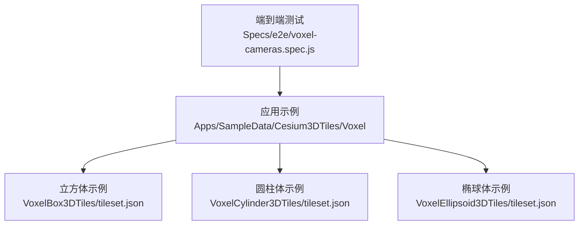
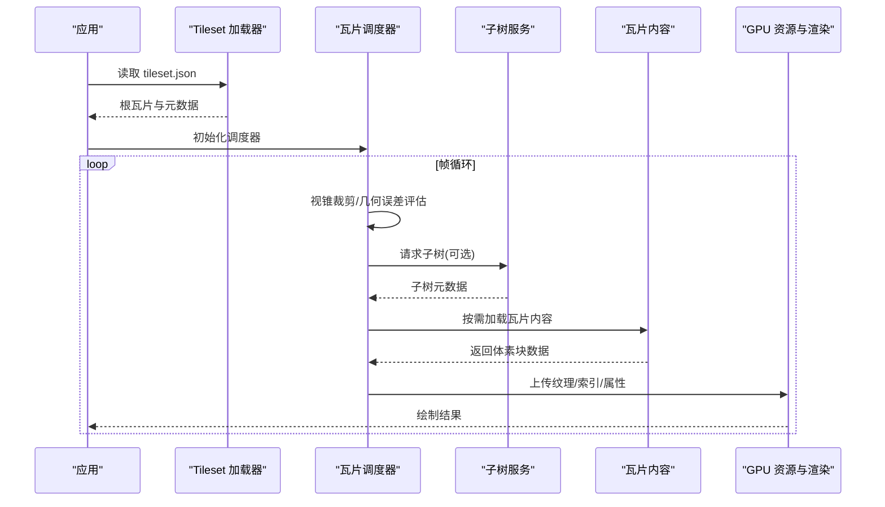
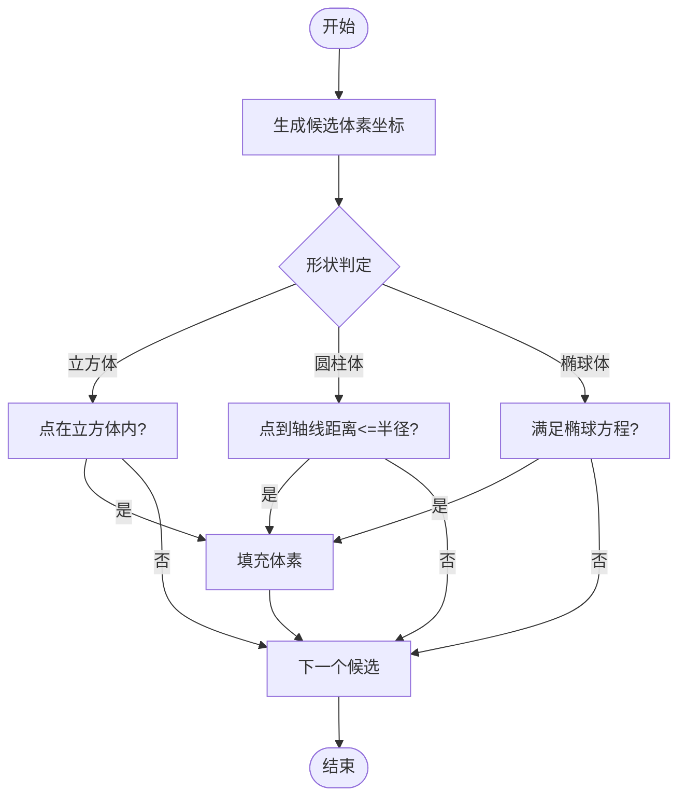
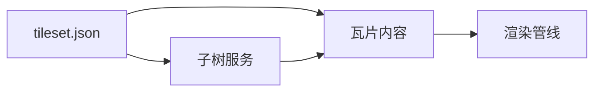

# 体素数据

<cite>
**本文引用的文件**   
- [VoxelBox3DTiles/tileset.json](file://Apps/SampleData/Cesium3DTiles/Voxel/VoxelBox3DTiles/tileset.json)
- [VoxelCylinder3DTiles/tileset.json](file://Apps/SampleData/Cesium3DTiles/Voxel/VoxelCylinder3DTiles/tileset.json)
- [VoxelEllipsoid3DTiles/tileset.json](file://Apps/SampleData/Cesium3DTiles/Voxel/VoxelEllipsoid3DTiles/tileset.json)
- [voxel-cameras.spec.js](file://Specs/e2e/voxel-cameras.spec.js)
</cite>

## 目录
1. [简介](#简介)
2. [项目结构](#项目结构)
3. [核心组件](#核心组件)
4. [架构总览](#架构总览)
5. [详细组件分析](#详细组件分析)
6. [依赖分析](#依赖分析)
7. [性能考虑](#性能考虑)
8. [故障排查指南](#故障排查指南)
9. [结论](#结论)
10. [附录](#附录)

## 简介
本文件围绕体素（Voxel）数据类型，系统阐述其在三维网格中的表示方法、空间划分与瓦片组织方式，并基于仓库中提供的示例 tileset.json，说明 schema 定义、内容路径、变换矩阵等关键属性。同时给出渲染管线与可视化效果配置要点，以及生成工具链与应用场景建议。

## 项目结构
仓库中与体素相关的示例位于 Apps/SampleData/Cesium3DTiles/Voxel 目录下，包含立方体、圆柱体、椭球体三类几何的体素化示例，每个示例均提供 tileset.json 作为入口描述。测试用例位于 Specs/e2e/voxel-cameras.spec.js，用于端到端验证相机与体素加载交互。

图表来源
- [VoxelBox3DTiles/tileset.json](file://Apps/SampleData/Cesium3DTiles/Voxel/VoxelBox3DTiles/tileset.json)
- [VoxelCylinder3DTiles/tileset.json](file://Apps/SampleData/Cesium3DTiles/Voxel/VoxelCylinder3DTiles/tileset.json)
- [VoxelEllipsoid3DTiles/tileset.json](file://Apps/SampleData/Cesium3DTiles/Voxel/VoxelEllipsoid3DTiles/tileset.json)
- [voxel-cameras.spec.js](file://Specs/e2e/voxel-cameras.spec.js)

章节来源
- [VoxelBox3DTiles/tileset.json](file://Apps/SampleData/Cesium3DTiles/Voxel/VoxelBox3DTiles/tileset.json)
- [VoxelCylinder3DTiles/tileset.json](file://Apps/SampleData/Cesium3DTiles/Voxel/VoxelCylinder3DTiles/tileset.json)
- [VoxelEllipsoid3DTiles/tileset.json](file://Apps/SampleData/Cesium3DTiles/Voxel/VoxelEllipsoid3DTiles/tileset.json)
- [voxel-cameras.spec.js](file://Specs/e2e/voxel-cameras.spec.js)

## 核心组件
- 体素数据模型：以三维离散网格表示连续几何，常用八叉树或隐式瓦片树进行层级组织，支持按需加载与细节层次（LOD）。
- 瓦片与子树：瓦片（tile）为最小可加载单元；子树（subtree）用于批量描述一组瓦片的元数据与可用性，减少网络请求与解析开销。
- 渲染管线：从 tileset.json 解析到瓦片调度、GPU 资源构建、着色器采样与混合输出，贯穿视锥裁剪、距离与几何误差控制。
- 可视化配置：通过材质、透明度、光照、后处理等参数控制最终视觉效果。

章节来源
- [VoxelBox3DTiles/tileset.json](file://Apps/SampleData/Cesium3DTiles/Voxel/VoxelBox3DTiles/tileset.json)
- [VoxelCylinder3DTiles/tileset.json](file://Apps/SampleData/Cesium3DTiles/Voxel/VoxelCylinder3DTiles/tileset.json)
- [VoxelEllipsoid3DTiles/tileset.json](file://Apps/SampleData/Cesium3DTiles/Voxel/VoxelEllipsoid3DTiles/tileset.json)

## 架构总览
下图展示了体素数据从 tileset.json 到渲染输出的整体流程，包括瓦片调度、子树与瓦片内容加载、GPU 资源构建与绘制阶段。

图表来源
- [VoxelBox3DTiles/tileset.json](file://Apps/SampleData/Cesium3DTiles/Voxel/VoxelBox3DTiles/tileset.json)
- [VoxelCylinder3DTiles/tileset.json](file://Apps/SampleData/Cesium3DTiles/Voxel/VoxelCylinder3DTiles/tileset.json)
- [VoxelEllipsoid3DTiles/tileset.json](file://Apps/SampleData/Cesium3DTiles/Voxel/VoxelEllipsoid3DTiles/tileset.json)
- [voxel-cameras.spec.js](file://Specs/e2e/voxel-cameras.spec.js)

## 详细组件分析

### 体素数据的三维网格表示与空间划分
- 三维网格表示：将目标几何投影到规则网格，按体素是否被填充标记实体区域。
- 空间划分算法：常见采用八叉树递归细分，依据几何误差或内存预算在节点处停止细分；也可使用隐式瓦片树，根据相机位置与距离动态计算瓦片可见性与加载优先级。
- 复杂度与权衡：细分深度越大，精度越高但存储与带宽压力增大；需结合几何误差阈值与可视距离进行自适应控制。

章节来源
- [VoxelBox3DTiles/tileset.json](file://Apps/SampleData/Cesium3DTiles/Voxel/VoxelBox3DTiles/tileset.json)
- [VoxelCylinder3DTiles/tileset.json](file://Apps/SampleData/Cesium3DTiles/Voxel/VoxelCylinder3DTiles/tileset.json)
- [VoxelEllipsoid3DTiles/tileset.json](file://Apps/SampleData/Cesium3DTiles/Voxel/VoxelEllipsoid3DTiles/tileset.json)

### 不同几何形状的体素化过程
- 立方体：沿轴对齐边界框内均匀采样，判断点是否在立方体内，填充对应体素。
- 圆柱体：以中心轴与半径约束，对横截面圆域进行判定，沿轴向扫描填充。
- 椭球体：依据标准椭球方程对各坐标轴缩放后的单位球判定点集，得到填充体素集合。

[此图为概念性流程图，不直接映射具体源码文件]

### 存储格式与层级结构（子树与瓦片）
- 瓦片（tile）：最小可加载单元，包含边界体积、几何误差、内容引用等信息。
- 子树（subtree）：聚合多个瓦片的元数据与可用性位图，减少 JSON 体积与解析成本。
- 组织方式：根瓦片指向若干子瓦片；子树可独立缓存与复用，提升大规模体素场景的加载效率。

章节来源
- [VoxelBox3DTiles/tileset.json](file://Apps/SampleData/Cesium3DTiles/Voxel/VoxelBox3DTiles/tileset.json)
- [VoxelCylinder3DTiles/tileset.json](file://Apps/SampleData/Cesium3DTiles/Voxel/VoxelCylinder3DTiles/tileset.json)
- [VoxelEllipsoid3DTiles/tileset.json](file://Apps/SampleData/Cesium3DTiles/Voxel/VoxelEllipsoid3DTiles/tileset.json)

### 渲染管线与可视化效果配置
- 管线阶段：瓦片选择与调度 → 体素块解码 → GPU 纹理/索引上传 → 着色器采样与混合 → 后处理与合成。
- 可视化配置：可通过材质参数控制颜色、透明度、光照响应、边缘增强等效果；结合视距与几何误差实现平滑过渡。
- 性能优化：批处理、纹理压缩、按需加载、视锥裁剪与遮挡剔除。

章节来源
- [VoxelBox3DTiles/tileset.json](file://Apps/SampleData/Cesium3DTiles/Voxel/VoxelBox3DTiles/tileset.json)
- [VoxelCylinder3DTiles/tileset.json](file://Apps/SampleData/Cesium3DTiles/Voxel/VoxelCylinder3DTiles/tileset.json)
- [VoxelEllipsoid3DTiles/tileset.json](file://Apps/SampleData/Cesium3DTiles/Voxel/VoxelEllipsoid3DTiles/tileset.json)
- [voxel-cameras.spec.js](file://Specs/e2e/voxel-cameras.spec.js)

### tileset.json 配置要点与示例参考
- 关键属性：schema 定义、内容路径（content）、变换矩阵（transform）、边界体积（boundingVolume）、几何误差（geometricError）、子树（subtrees）等。
- 示例参考：
  - 立方体体素示例：[VoxelBox3DTiles/tileset.json](file://Apps/SampleData/Cesium3DTiles/Voxel/VoxelBox3DTiles/tileset.json)
  - 圆柱体体素示例：[VoxelCylinder3DTiles/tileset.json](file://Apps/SampleData/Cesium3DTiles/Voxel/VoxelCylinder3DTiles/tileset.json)
  - 椭球体体素示例：[VoxelEllipsoid3DTiles/tileset.json](file://Apps/SampleData/Cesium3DTiles/Voxel/VoxelEllipsoid3DTiles/tileset.json)

章节来源
- [VoxelBox3DTiles/tileset.json](file://Apps/SampleData/Cesium3DTiles/Voxel/VoxelBox3DTiles/tileset.json)
- [VoxelCylinder3DTiles/tileset.json](file://Apps/SampleData/Cesium3DTiles/Voxel/VoxelCylinder3DTiles/tileset.json)
- [VoxelEllipsoid3DTiles/tileset.json](file://Apps/SampleData/Cesium3DTiles/Voxel/VoxelEllipsoid3DTiles/tileset.json)

### 端到端验证与相机交互
- 测试用例：Specs/e2e/voxel-cameras.spec.js 用于验证相机移动、缩放与体素瓦片加载的联动行为。
- 关注点：瓦片可见性更新、子树与瓦片内容的延迟加载、渲染稳定性与帧率表现。

章节来源
- [voxel-cameras.spec.js](file://Specs/e2e/voxel-cameras.spec.js)

## 依赖分析
- 外部依赖：tileset.json 作为入口，驱动瓦片调度与内容加载；子树文件可独立存在并被多次复用。
- 内部耦合：瓦片调度器与子树服务解耦，便于扩展新的空间划分策略与缓存机制。
- 潜在风险：过深的细分导致内存峰值过高；过多并发下载引发网络拥塞。

图表来源
- [VoxelBox3DTiles/tileset.json](file://Apps/SampleData/Cesium3DTiles/Voxel/VoxelBox3DTiles/tileset.json)
- [VoxelCylinder3DTiles/tileset.json](file://Apps/SampleData/Cesium3DTiles/Voxel/VoxelCylinder3DTiles/tileset.json)
- [VoxelEllipsoid3DTiles/tileset.json](file://Apps/SampleData/Cesium3DTiles/Voxel/VoxelEllipsoid3DTiles/tileset.json)

## 性能考虑
- 合理设置几何误差阈值，避免不必要的细分。
- 启用子树以减少 JSON 解析与网络往返。
- 使用纹理压缩与批处理降低 GPU 传输成本。
- 利用视锥裁剪与遮挡剔除减少无效绘制。
- 监控内存峰值与帧时间，动态调整加载队列与并发度。

## 故障排查指南
- 瓦片未加载：检查 tileset.json 的内容路径与相对路径是否正确；确认服务器可达与跨域策略。
- 子树缺失：确认子树文件是否存在且路径正确；查看调度日志中的子树请求状态。
- 渲染异常：检查体素块数据完整性与纹理格式；验证着色器输入与混合模式。
- 相机交互卡顿：降低并发下载数或提高节流阈值；检查 GPU 资源上传耗时。

章节来源
- [VoxelBox3DTiles/tileset.json](file://Apps/SampleData/Cesium3DTiles/Voxel/VoxelBox3DTiles/tileset.json)
- [VoxelCylinder3DTiles/tileset.json](file://Apps/SampleData/Cesium3DTiles/Voxel/VoxelCylinder3DTiles/tileset.json)
- [VoxelEllipsoid3DTiles/tileset.json](file://Apps/SampleData/Cesium3DTiles/Voxel/VoxelEllipsoid3DTiles/tileset.json)
- [voxel-cameras.spec.js](file://Specs/e2e/voxel-cameras.spec.js)

## 结论
体素数据通过规则的三维网格与高效的层级组织，能够在大规模场景中实现高保真与高性能的可视化。借助 tileset.json 的标准化描述、子树与瓦片的协同工作，以及合理的渲染管线与可视化配置，可在多种应用场景中取得良好效果。

## 附录
- 生成工具链建议：
  - 几何预处理：将原始模型转换为规则网格或点云。
  - 体素化引擎：依据几何误差与分辨率生成体素块。
  - 瓦片与子树构建：按八叉树或隐式瓦片树组织，生成 tileset.json 与子树文件。
  - 压缩与打包：对体素数据进行压缩，优化存储与传输。
- 典型应用场景：
  - 城市级三维建模与数字孪生
  - 地质与地下结构可视化
  - 医学影像与科学计算数据展示
  - 游戏与仿真环境构建