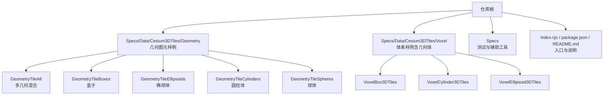
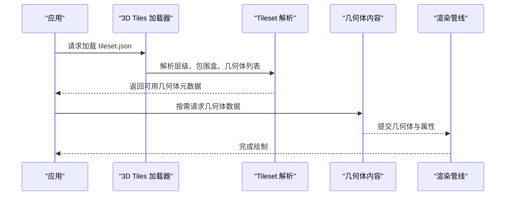
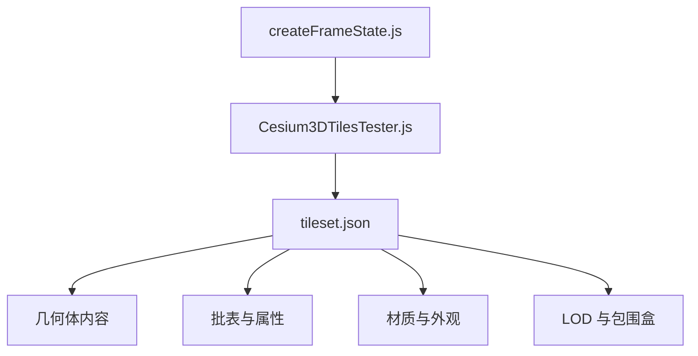

# 几何图元

<cite>
**本文引用的文件**   
- [README.md](file://README.md)
- [package.json](file://package.json)
- [index.cjs](file://index.cjs)
- [Cesium3DTilesTester.js](file://Specs/Cesium3DTilesTester.js)
- [createFrameState.js](file://Specs/createFrameState.js)
- [GeometryTileAll/tileset.json](file://Specs/Data/Cesium3DTiles/Geometry/GeometryTileAll/tileset.json)
- [GeometryTileBoxes/tileset.json](file://Specs/Data/Cesium3DTiles/Geometry/GeometryTileBoxes/tileset.json)
- [GeometryTileEllipsoids/tileset.json](file://Specs/Data/Cesium3DTiles/Geometry/GeometryTileEllipsoids/tileset.json)
- [GeometryTileCylinders/tileset.json](file://Specs/Data/Cesium3DTiles/Geometry/GeometryTileCylinders/tileset.json)
- [GeometryTileSpheres/tileset.json](file://Specs/Data/Cesium3DTiles/Geometry/GeometryTileSpheres/tileset.json)
- [VoxelBox3DTiles/tileset.json](file://Specs/Data/Cesium3DTiles/Voxel/VoxelBox3DTiles/tileset.json)
- [VoxelCylinder3DTiles/tileset.json](file://Specs/Data/Cesium3DTiles/Voxel/VoxelCylinder3DTiles/tileset.json)
- [VoxelEllipsoid3DTiles/tileset.json](file://Specs/Data/Cesium3DTiles/Voxel/VoxelEllipsoid3DTiles/tileset.json)
</cite>

## 目录
1. [简介](#简介)
2. [项目结构](#项目结构)
3. [核心组件](#核心组件)
4. [架构总览](#架构总览)
5. [详细组件分析](#详细组件分析)
6. [依赖分析](#依赖分析)
7. [性能考虑](#性能考虑)
8. [故障排查指南](#故障排查指南)
9. [结论](#结论)
10. [附录](#附录)

## 简介
本文件围绕 CesiumJS 仓库中的“几何图元（Geometry）”数据类型与相关能力进行系统化说明，重点覆盖：
- 内置几何图元的类型与渲染机制
- 球体、盒子、椭球体、圆柱体等基础几何体的配置方法
- 批量处理与属性绑定机制
- 大规模场景下的性能优化策略
- tileset.json 配置示例与关键属性（几何体参数、材质、变换矩阵等）
- 与其他 3D Tiles 类型的对比分析与使用建议

为便于读者快速定位，文档在涉及具体实现或样例时提供“章节来源”，并在可视化图中给出“图示来源”。

## 项目结构
从仓库视角看，几何图元相关内容主要分布在以下位置：
- 测试数据与样例：Specs/Data/Cesium3DTiles/Geometry 与 Voxel 子目录，包含多种几何图元 tileset 与内容资源
- 测试框架与辅助工具：Specs 目录下的 Cesium3DTilesTester.js、createFrameState.js 等
- 顶层入口与包信息：index.cjs、package.json、README.md

**图示来源**
- [README.md](file://README.md)
- [package.json](file://package.json)
- [index.cjs](file://index.cjs)
- [GeometryTileAll/tileset.json](file://Specs/Data/Cesium3DTiles/Geometry/GeometryTileAll/tileset.json)
- [GeometryTileBoxes/tileset.json](file://Specs/Data/Cesium3DTiles/Geometry/GeometryTileBoxes/tileset.json)
- [GeometryTileEllipsoids/tileset.json](file://Specs/Data/Cesium3DTiles/Geometry/GeometryTileEllipsoids/tileset.json)
- [GeometryTileCylinders/tileset.json](file://Specs/Data/Cesium3DTiles/Geometry/GeometryTileCylinders/tileset.json)
- [GeometryTileSpheres/tileset.json](file://Specs/Data/Cesium3DTiles/Geometry/GeometryTileSpheres/tileset.json)
- [VoxelBox3DTiles/tileset.json](file://Specs/Data/Cesium3DTiles/Voxel/VoxelBox3DTiles/tileset.json)
- [VoxelCylinder3DTiles/tileset.json](file://Specs/Data/Cesium3DTiles/Voxel/VoxelCylinder3DTiles/tileset.json)
- [VoxelEllipsoid3DTiles/tileset.json](file://Specs/Data/Cesium3DTiles/Voxel/VoxelEllipsoid3DTiles/tileset.json)

**章节来源**
- [README.md](file://README.md)
- [package.json](file://package.json)
- [index.cjs](file://index.cjs)

## 核心组件
本节聚焦于几何图元在 3D Tiles 体系中的角色与能力边界。结合仓库中 Geometry 与 Voxel 两类样例，可归纳如下要点：
- 几何图元作为轻量、规则的基础形状，适合用于标注、指示、统计可视化等场景
- 通过 tileset.json 描述几何体集合、包围盒、LOD、批表与材质等元数据
- 渲染管线将几何体转换为 GPU 可绘制对象，支持批量合并与属性绑定以提升吞吐

注意：本节为概念性总结，不直接分析具体源码文件，因此不提供“章节来源”。

## 架构总览
下图展示了从 tileset.json 到渲染的关键路径，以及几何图元与其他 3D Tiles 类型的关系。

[此图为概念流程示意，未映射到具体源码文件，故不提供“图示来源”]

## 详细组件分析

### 几何图元类型与配置
仓库中包含以下典型几何图元样例目录，每个目录均提供 tileset.json 与对应内容资源，可用于理解各几何体的参数与组织方式：
- 球体（Sphere）：GeometryTileSpheres
- 盒子（Box）：GeometryTileBoxes
- 椭球体（Ellipsoid）：GeometryTileEllipsoids
- 圆柱体（Cylinder）：GeometryTileCylinders
- 混合几何体：GeometryTileAll

此外，体素（Voxel）样例也提供了基于几何体的变体：
- VoxelBox3DTiles
- VoxelCylinder3DTiles
- VoxelEllipsoid3DTiles

这些样例的 tileset.json 体现了几何体参数的声明方式、包围盒定义、LOD 控制、批表与材质设置等关键属性。

**章节来源**
- [GeometryTileSpheres/tileset.json](file://Specs/Data/Cesium3DTiles/Geometry/GeometryTileSpheres/tileset.json)
- [GeometryTileBoxes/tileset.json](file://Specs/Data/Cesium3DTiles/Geometry/GeometryTileBoxes/tileset.json)
- [GeometryTileEllipsoids/tileset.json](file://Specs/Data/Cesium3DTiles/Geometry/GeometryTileEllipsoids/tileset.json)
- [GeometryTileCylinders/tileset.json](file://Specs/Data/Cesium3DTiles/Geometry/GeometryTileCylinders/tileset.json)
- [GeometryTileAll/tileset.json](file://Specs/Data/Cesium3DTiles/Geometry/GeometryTileAll/tileset.json)
- [VoxelBox3DTiles/tileset.json](file://Specs/Data/Cesium3DTiles/Voxel/VoxelBox3DTiles/tileset.json)
- [VoxelCylinder3DTiles/tileset.json](file://Specs/Data/Cesium3DTiles/Voxel/VoxelCylinder3DTiles/tileset.json)
- [VoxelEllipsoid3DTiles/tileset.json](file://Specs/Data/Cesium3DTiles/Voxel/VoxelEllipsoid3DTiles/tileset.json)

### 批量处理与属性绑定机制
- 批量处理：通过批表（Batch Table）将多个几何体合并为一次绘制调用，减少状态切换开销
- 属性绑定：利用批表字段与着色器变量关联，实现按实例的属性驱动（如颜色、透明度、自定义标量）
- 选择与交互：借助批 ID 与属性索引，可在运行时对单个几何体进行高亮、查询与更新

上述机制在 Geometry 与 Instanced/Batched 系列样例中均有体现，可通过相应 tileset.json 与内容资源观察其组织方式。

**章节来源**
- [GeometryTileAll/tileset.json](file://Specs/Data/Cesium3DTiles/Geometry/GeometryTileAll/tileset.json)
- [GeometryTileBoxesWithBatchTable/tileset.json](file://Specs/Data/Cesium3DTiles/Geometry/GeometryTileBoxesWithBatchTable/tileset.json)
- [GeometryTileEllipsoidsWithBatchTable/tileset.json](file://Specs/Data/Cesium3DTiles/Geometry/GeometryTileEllipsoidsWithBatchTable/tileset.json)
- [GeometryTileCylindersWithBatchTable/tileset.json](file://Specs/Data/Cesium3DTiles/Geometry/GeometryTileCylindersWithBatchTable/tileset.json)
- [GeometryTileSpheresWithBatchTable/tileset.json](file://Specs/Data/Cesium3DTiles/Geometry/GeometryTileSpheresWithBatchTable/tileset.json)

### 变换矩阵与空间定位
- 变换矩阵：tileset.json 中可声明根级或子级变换，用于统一平移、旋转与缩放
- 局部坐标与全局坐标：几何体通常以局部坐标系定义，最终通过变换矩阵组合得到世界坐标
- 包围盒与视锥剔除：合理的包围盒与变换有助于提升裁剪效率

参考样例中的 tileset.json 可了解变换矩阵的放置位置与层级关系。

**章节来源**
- [GeometryTileAll/tileset.json](file://Specs/Data/Cesium3DTiles/Geometry/GeometryTileAll/tileset.json)
- [GeometryTileBoxes/tileset.json](file://Specs/Data/Cesium3DTiles/Geometry/GeometryTileBoxes/tileset.json)
- [GeometryTileEllipsoids/tileset.json](file://Specs/Data/Cesium3DTiles/Geometry/GeometryTileEllipsoids/tileset.json)
- [GeometryTileCylinders/tileset.json](file://Specs/Data/Cesium3DTiles/Geometry/GeometryTileCylinders/tileset.json)
- [GeometryTileSpheres/tileset.json](file://Specs/Data/Cesium3DTiles/Geometry/GeometryTileSpheres/tileset.json)

### 材质与外观
- 材质类型：支持纯色、纹理贴图、半透明等常见外观模式
- 批表驱动材质：通过批表字段动态控制颜色、透明度等，避免多次状态切换
- 光照与阴影：根据材质与渲染设置启用光照模型与阴影投射

样例中的 tileset.json 与内容资源展示了不同材质配置的组织方式。

**章节来源**
- [GeometryTileAll/tileset.json](file://Specs/Data/Cesium3DTiles/Geometry/GeometryTileAll/tileset.json)
- [GeometryTileBoxesWithBatchTable/tileset.json](file://Specs/Data/Cesium3DTiles/Geometry/GeometryTileBoxesWithBatchTable/tileset.json)
- [GeometryTileEllipsoidsWithBatchTable/tileset.json](file://Specs/Data/Cesium3DTiles/Geometry/GeometryTileEllipsoidsWithBatchTable/tileset.json)
- [GeometryTileCylindersWithBatchTable/tileset.json](file://Specs/Data/Cesium3DTiles/Geometry/GeometryTileCylindersWithBatchTable/tileset.json)
- [GeometryTileSpheresWithBatchTable/tileset.json](file://Specs/Data/Cesium3DTiles/Geometry/GeometryTileSpheresWithBatchTable/tileset.json)

### 与其他 3D Tiles 类型的对比与使用建议
- 点云（PointCloud）：适合海量离散采样点，强调密度与分布；几何图元更适合规则形状与结构化标注
- 网格（Mesh/gltf）：适合复杂有机形态与高精度细节；几何图元更轻量、易批量、易属性化
- 矢量（Vector）：适合二维/三维矢量要素（线、面、点），强调拓扑与样式；几何图元更偏向简单实体表达
- 体素（Voxel）：适合连续场数据（如气象、地质）；几何图元适合离散实体与符号化展示

选择建议：
- 需要大量重复、规则形状且需属性驱动：优先几何图元
- 需要复杂表面与精细纹理：优先网格
- 需要高密度点集与体积感：优先点云
- 需要连续场可视化：优先体素

[本节为概念性对比，不直接分析具体源码文件，故不提供“章节来源”]

## 依赖分析
从样例与测试角度，几何图元相关的依赖关系主要体现在：
- tileset.json 作为入口，描述几何体集合、层级与元数据
- 内容资源（几何体数据与批表）由 tileset.json 引用
- 测试框架（Cesium3DTilesTester.js、createFrameState.js）用于验证加载与渲染行为

**图示来源**
- [Cesium3DTilesTester.js](file://Specs/Cesium3DTilesTester.js)
- [createFrameState.js](file://Specs/createFrameState.js)
- [GeometryTileAll/tileset.json](file://Specs/Data/Cesium3DTiles/Geometry/GeometryTileAll/tileset.json)

**章节来源**
- [Cesium3DTilesTester.js](file://Specs/Cesium3DTilesTester.js)
- [createFrameState.js](file://Specs/createFrameState.js)

## 性能考虑
针对大规模场景中的几何图元渲染，建议关注以下方面：
- 批量合并：尽可能将同材质、同状态的几何体合并绘制，减少 draw call
- 属性驱动：使用批表字段驱动外观变化，避免频繁切换材质状态
- 包围盒与 LOD：合理设置包围盒与几何误差，提高视锥与遮挡剔除效率
- 变换矩阵复用：共享相同变换的几何体可减少矩阵计算与上传开销
- 纹理与材质简化：在远距离或低精度下使用简化的材质与纹理分辨率

[本节为通用性能指导，不直接分析具体源码文件，故不提供“章节来源”]

## 故障排查指南
常见问题与排查步骤：
- 几何体不可见：检查 tileset.json 中的包围盒与变换矩阵是否正确；确认内容资源路径与引用是否有效
- 属性未生效：核对批表字段名与着色器变量绑定是否一致；确认批 ID 分配是否完整
- 材质闪烁或异常：检查半透明排序与深度写入设置；确认批表驱动的透明度值范围
- 性能瓶颈：统计 draw call 数量与状态切换次数；评估批表大小与几何体数量

可参考测试框架与样例进行复现与定位。

**章节来源**
- [Cesium3DTilesTester.js](file://Specs/Cesium3DTilesTester.js)
- [createFrameState.js](file://Specs/createFrameState.js)
- [GeometryTileAll/tileset.json](file://Specs/Data/Cesium3DTiles/Geometry/GeometryTileAll/tileset.json)

## 结论
几何图元在 3D Tiles 体系中扮演轻量、规则、易批量化与属性化的重要角色。通过合理的 tileset.json 配置、批表与材质设计，可以在大规模场景中实现高效、灵活的可视化。结合与其他 3D Tiles 类型的对比，可根据业务需求选择最合适的表达方式。

[本节为总结性内容，不直接分析具体源码文件，故不提供“章节来源”]

## 附录
- 完整 tileset.json 配置示例请参考以下样例目录中的 tileset.json 文件，以理解几何体参数、材质设置、变换矩阵等属性的组织方式：
  - [GeometryTileAll/tileset.json](file://Specs/Data/Cesium3DTiles/Geometry/GeometryTileAll/tileset.json)
  - [GeometryTileBoxes/tileset.json](file://Specs/Data/Cesium3DTiles/Geometry/GeometryTileBoxes/tileset.json)
  - [GeometryTileEllipsoids/tileset.json](file://Specs/Data/Cesium3DTiles/Geometry/GeometryTileEllipsoids/tileset.json)
  - [GeometryTileCylinders/tileset.json](file://Specs/Data/Cesium3DTiles/Geometry/GeometryTileCylinders/tileset.json)
  - [GeometryTileSpheres/tileset.json](file://Specs/Data/Cesium3DTiles/Geometry/GeometryTileSpheres/tileset.json)
  - [VoxelBox3DTiles/tileset.json](file://Specs/Data/Cesium3DTiles/Voxel/VoxelBox3DTiles/tileset.json)
  - [VoxelCylinder3DTiles/tileset.json](file://Specs/Data/Cesium3DTiles/Voxel/VoxelCylinder3DTiles/tileset.json)
  - [VoxelEllipsoid3DTiles/tileset.json](file://Specs/Data/Cesium3DTiles/Voxel/VoxelEllipsoid3DTiles/tileset.json)