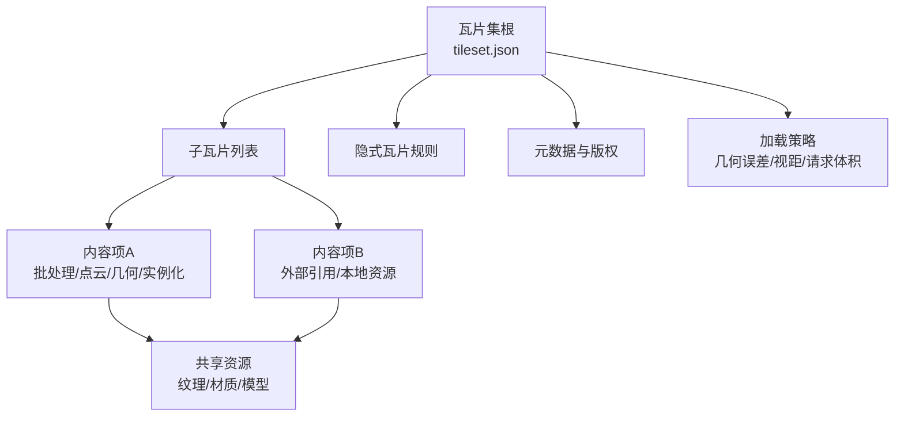
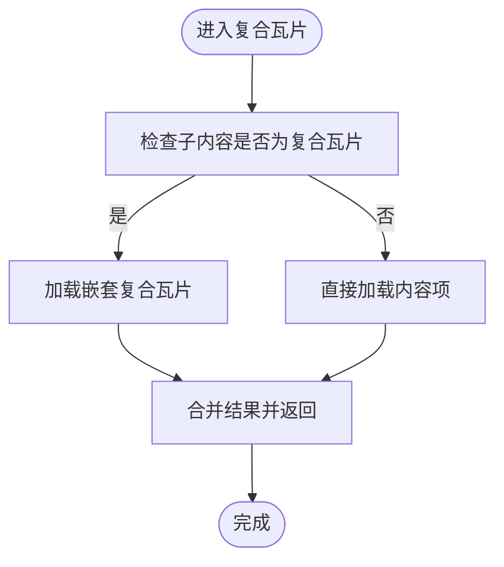
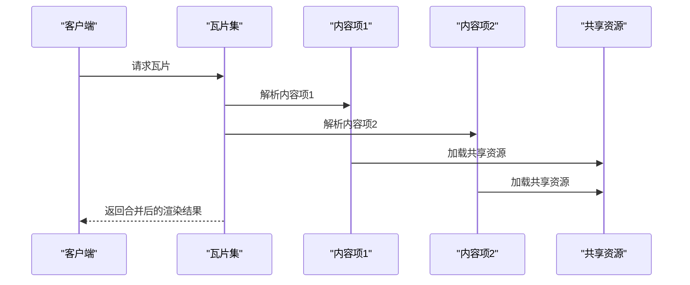
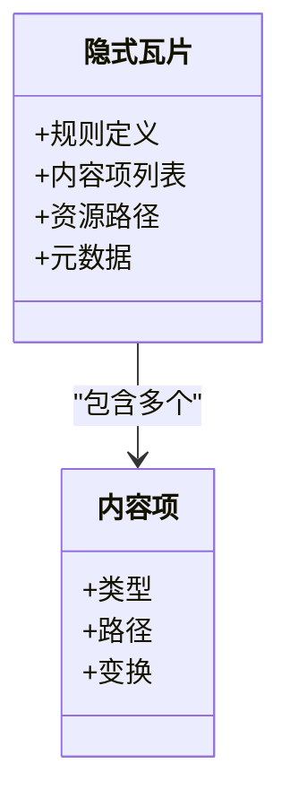
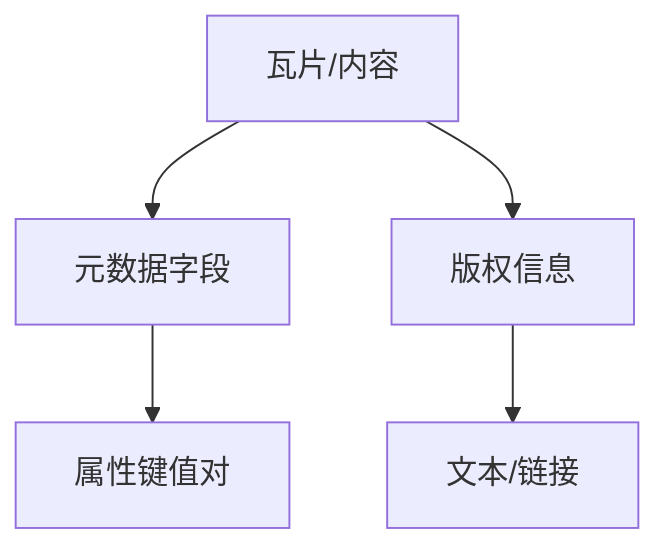
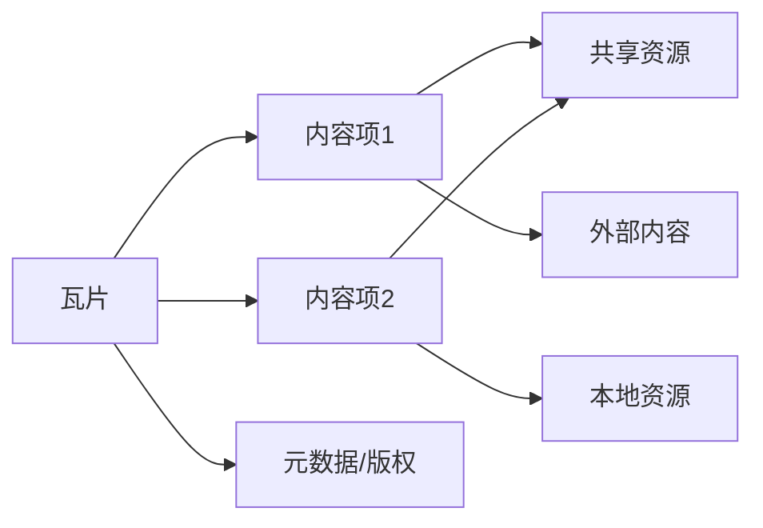

# 复合内容

<cite>
**本文引用的文件**
- [tileset.json](file://Apps/SampleData/Cesium3DTiles/Composite/Composite/tileset.json)
- [tileset.json](file://Specs/Data/Cesium3DTiles/Composite/Composite/tileset.json)
- [tileset.json](file://Specs/Data/Cesium3DTiles/Composite/CompositeOfComposite/tileset.json)
- [tileset.json](file://Specs/Data/Cesium3DTiles/Composite/CompositeOfInstanced/tileset.json)
- [tileset.json](file://Specs/Data/Cesium3DTiles/MultipleContents/MultipleContents/tileset.json)
- [tileset.json](file://Specs/Data/Cesium3DTiles/MultipleContents/ExternalInMultipleContents/tileset.json)
- [tileset.json](file://Specs/Data/Cesium3DTiles/MultipleContents/OnlyExternalInMultipleContents/tileset.json)
- [tileset.json](file://Specs/Data/Cesium3DTiles/Implicit/ImplicitMultipleContents/tileset.json)
- [tileset.json](file://Specs/Data/Cesium3DTiles/Implicit/ImplicitMultipleContentsWithMetadata/tileset.json)
- [tileset.json](file://Specs/Data/Cesium3DTiles/Metadata/MultipleContentsWithMetadata/tileset.json)
</cite>

## 目录
1. [简介](#简介)
2. [项目结构](#项目结构)
3. [核心组件](#核心组件)
4. [架构总览](#架构总览)
5. [详细组件分析](#详细组件分析)
6. [依赖关系分析](#依赖关系分析)
7. [性能考虑](#性能考虑)
8. [故障排查指南](#故障排查指南)
9. [结论](#结论)
10. [附录](#附录)

## 简介
本章节面向需要在单个瓦片中组合多种不同类型内容的开发者，系统阐述 Cesium 3D Tiles 中“复合内容（Composite）”的概念、设计理念与使用方式。复合内容允许在一个瓦片内聚合批处理模型、点云、几何图元、实例化内容等多种数据源，并通过统一的层级结构与资源管理机制进行加载与渲染。文档同时覆盖多内容（Multiple Contents）的配置方法、共享资源组织、版权信息标注、层次结构与依赖管理策略，以及复杂场景的组织与性能优化建议。

## 项目结构
仓库中包含大量用于验证与演示的 3D Tiles 样例数据，其中与复合内容直接相关的样例位于以下路径：
- 应用样例：Apps/SampleData/Cesium3DTiles/Composite/Composite
- 规格测试样例：Specs/Data/Cesium3DTiles/Composite 及其子目录
- 多内容样例：Specs/Data/Cesium3DTiles/MultipleContents 及其子目录
- 隐式瓦片多内容样例：Specs/Data/Cesium3DTiles/Implicit/ImplicitMultipleContents*
- 带元数据的复合/多内容样例：Specs/Data/Cesium3DTiles/Metadata/MultipleContentsWithMetadata

这些样例提供了 tileset.json 配置示例，涵盖单一复合瓦片、复合嵌套复合、复合包含实例化内容、外部引用、仅外部内容、隐式瓦片多内容、以及带元数据的复合/多内容等典型用法。

```mermaid
graph TB
A["应用样例<br/>Composite/Composite"] --> B["tileset.json"]
C["规格测试样例<br/>Composite/Composite"] --> D["tileset.json"]
E["规格测试样例<br/>Composite/CompositeOfComposite"] --> F["tileset.json"]
G["规格测试样例<br/>Composite/CompositeOfInstanced"] --> H["tileset.json"]
I["规格测试样例<br/>MultipleContents/MultipleContents"] --> J["tileset.json"]
K["规格测试样例<br/>MultipleContents/ExternalInMultipleContents"] --> L["tileset.json"]
M["规格测试样例<br/>MultipleContents/OnlyExternalInMultipleContents"] --> N["tileset.json"]
O["规格测试样例<br/>Implicit/ImplicitMultipleContents"] --> P["tileset.json"]
Q["规格测试样例<br/>Implicit/ImplicitMultipleContentsWithMetadata"] --> R["tileset.json"]
S["规格测试样例<br/>Metadata/MultipleContentsWithMetadata"] --> T["tileset.json"]
```

图表来源
- [tileset.json](file://Apps/SampleData/Cesium3DTiles/Composite/Composite/tileset.json)
- [tileset.json](file://Specs/Data/Cesium3DTiles/Composite/Composite/tileset.json)
- [tileset.json](file://Specs/Data/Cesium3DTiles/Composite/CompositeOfComposite/tileset.json)
- [tileset.json](file://Specs/Data/Cesium3DTiles/Composite/CompositeOfInstanced/tileset.json)
- [tileset.json](file://Specs/Data/Cesium3DTiles/MultipleContents/MultipleContents/tileset.json)
- [tileset.json](file://Specs/Data/Cesium3DTiles/MultipleContents/ExternalInMultipleContents/tileset.json)
- [tileset.json](file://Specs/Data/Cesium3DTiles/MultipleContents/OnlyExternalInMultipleContents/tileset.json)
- [tileset.json](file://Specs/Data/Cesium3DTiles/Implicit/ImplicitMultipleContents/tileset.json)
- [tileset.json](file://Specs/Data/Cesium3DTiles/Implicit/ImplicitMultipleContentsWithMetadata/tileset.json)
- [tileset.json](file://Specs/Data/Cesium3DTiles/Metadata/MultipleContentsWithMetadata/tileset.json)

章节来源
- [tileset.json](file://Apps/SampleData/Cesium3DTiles/Composite/Composite/tileset.json)
- [tileset.json](file://Specs/Data/Cesium3DTiles/Composite/Composite/tileset.json)
- [tileset.json](file://Specs/Data/Cesium3DTiles/Composite/CompositeOfComposite/tileset.json)
- [tileset.json](file://Specs/Data/Cesium3DTiles/Composite/CompositeOfInstanced/tileset.json)
- [tileset.json](file://Specs/Data/Cesium3DTiles/MultipleContents/MultipleContents/tileset.json)
- [tileset.json](file://Specs/Data/Cesium3DTiles/MultipleContents/ExternalInMultipleContents/tileset.json)
- [tileset.json](file://Specs/Data/Cesium3DTiles/MultipleContents/OnlyExternalInMultipleContents/tileset.json)
- [tileset.json](file://Specs/Data/Cesium3DTiles/Implicit/ImplicitMultipleContents/tileset.json)
- [tileset.json](file://Specs/Data/Cesium3DTiles/Implicit/ImplicitMultipleContentsWithMetadata/tileset.json)
- [tileset.json](file://Specs/Data/Cesium3DTiles/Metadata/MultipleContentsWithMetadata/tileset.json)

## 核心组件
本节聚焦复合内容与多内容的核心概念与能力边界：
- 复合内容（Composite）：在单个瓦片内聚合多种内容类型，如批处理模型、点云、几何图元、实例化内容等，统一由瓦片描述符组织与调度。
- 多内容（Multiple Contents）：在瓦片或瓦片集层面声明多个独立的内容项，支持外部引用与本地资源混合，便于模块化与复用。
- 资源管理与共享：通过相对路径与外部引用实现纹理、材质、模型等资源的高效共享与按需加载。
- 版权信息与元数据：在瓦片或内容级别标注版权、属性与扩展，确保合规与可追溯。
- 层次结构与依赖：通过父子瓦片与内容引用形成树状结构，控制加载顺序、可见性与渲染优先级。

章节来源
- [tileset.json](file://Apps/SampleData/Cesium3DTiles/Composite/Composite/tileset.json)
- [tileset.json](file://Specs/Data/Cesium3DTiles/Composite/Composite/tileset.json)
- [tileset.json](file://Specs/Data/Cesium3DTiles/Composite/CompositeOfComposite/tileset.json)
- [tileset.json](file://Specs/Data/Cesium3DTiles/Composite/CompositeOfInstanced/tileset.json)
- [tileset.json](file://Specs/Data/Cesium3DTiles/MultipleContents/MultipleContents/tileset.json)
- [tileset.json](file://Specs/Data/Cesium3DTiles/MultipleContents/ExternalInMultipleContents/tileset.json)
- [tileset.json](file://Specs/Data/Cesium3DTiles/MultipleContents/OnlyExternalInMultipleContents/tileset.json)
- [tileset.json](file://Specs/Data/Cesium3DTiles/Implicit/ImplicitMultipleContents/tileset.json)
- [tileset.json](file://Specs/Data/Cesium3DTiles/Implicit/ImplicitMultipleContentsWithMetadata/tileset.json)
- [tileset.json](file://Specs/Data/Cesium3DTiles/Metadata/MultipleContentsWithMetadata/tileset.json)

## 架构总览
复合内容与多内容的整体架构围绕瓦片描述符（tileset.json）展开，其职责包括：
- 定义瓦片集合与层次结构（根瓦片、子瓦片、隐式瓦片）
- 声明内容项（批处理、点云、几何、实例化、外部内容等）
- 指定资源路径与共享资源（纹理、材质、模型）
- 提供元数据与版权信息
- 控制加载策略与渲染优先级（通过几何误差、视距、请求体积等）

图表来源
- [tileset.json](file://Apps/SampleData/Cesium3DTiles/Composite/Composite/tileset.json)
- [tileset.json](file://Specs/Data/Cesium3DTiles/Composite/Composite/tileset.json)
- [tileset.json](file://Specs/Data/Cesium3DTiles/Composite/CompositeOfComposite/tileset.json)
- [tileset.json](file://Specs/Data/Cesium3DTiles/Composite/CompositeOfInstanced/tileset.json)
- [tileset.json](file://Specs/Data/Cesium3DTiles/MultipleContents/MultipleContents/tileset.json)
- [tileset.json](file://Specs/Data/Cesium3DTiles/MultipleContents/ExternalInMultipleContents/tileset.json)
- [tileset.json](file://Specs/Data/Cesium3DTiles/MultipleContents/OnlyExternalInMultipleContents/tileset.json)
- [tileset.json](file://Specs/Data/Cesium3DTiles/Implicit/ImplicitMultipleContents/tileset.json)
- [tileset.json](file://Specs/Data/Cesium3DTiles/Implicit/ImplicitMultipleContentsWithMetadata/tileset.json)
- [tileset.json](file://Specs/Data/Cesium3DTiles/Metadata/MultipleContentsWithMetadata/tileset.json)

## 详细组件分析

### 复合内容（Composite）
复合内容将多种数据源聚合到单个瓦片，减少瓦片数量与网络往返，提升渲染效率。常见组合包括：
- 批处理模型 + 点云：用于城市级建筑与地表扫描数据融合
- 几何图元 + 实例化内容：用于大规模重复对象（如路灯、树木）与矢量要素叠加
- 外部内容引用：将大型模型或纹理作为外部资源，避免重复打包

关键要点：
- 内容项在同一瓦片坐标系下对齐，注意变换矩阵与坐标空间一致性
- 共享资源应集中管理，避免重复下载
- 版权信息应在瓦片或内容级别明确标注

章节来源
- [tileset.json](file://Apps/SampleData/Cesium3DTiles/Composite/Composite/tileset.json)
- [tileset.json](file://Specs/Data/Cesium3DTiles/Composite/Composite/tileset.json)
- [tileset.json](file://Specs/Data/Cesium3DTiles/Composite/CompositeOfInstanced/tileset.json)

#### 复合嵌套复合（Composite of Composite）
当复合内容本身仍需要进一步拆分时，可采用“复合嵌套复合”的结构，即将一个复合瓦片作为另一个复合瓦片的内容项，形成更灵活的层次组织。

图表来源
- [tileset.json](file://Specs/Data/Cesium3DTiles/Composite/CompositeOfComposite/tileset.json)

章节来源
- [tileset.json](file://Specs/Data/Cesium3DTiles/Composite/CompositeOfComposite/tileset.json)

### 多内容（Multiple Contents）
多内容允许在瓦片或瓦片集层面声明多个独立的内容项，每个内容项可指向不同的资源或外部服务。典型场景：
- 同一区域的不同图层（地形、影像、矢量）
- 不同格式的数据源（gltf、点云、几何）
- 外部引用与本地资源混合

图表来源
- [tileset.json](file://Specs/Data/Cesium3DTiles/MultipleContents/MultipleContents/tileset.json)
- [tileset.json](file://Specs/Data/Cesium3DTiles/MultipleContents/ExternalInMultipleContents/tileset.json)
- [tileset.json](file://Specs/Data/Cesium3DTiles/MultipleContents/OnlyExternalInMultipleContents/tileset.json)

章节来源
- [tileset.json](file://Specs/Data/Cesium3DTiles/MultipleContents/MultipleContents/tileset.json)
- [tileset.json](file://Specs/Data/Cesium3DTiles/MultipleContents/ExternalInMultipleContents/tileset.json)
- [tileset.json](file://Specs/Data/Cesium3DTiles/MultipleContents/OnlyExternalInMultipleContents/tileset.json)

### 隐式瓦片多内容（Implicit Multiple Contents）
隐式瓦片通过规则生成瓦片结构，适用于大规模网格化数据。在多内容场景下，隐式瓦片可为每个瓦片动态分配多个内容项，提高可扩展性。

图表来源
- [tileset.json](file://Specs/Data/Cesium3DTiles/Implicit/ImplicitMultipleContents/tileset.json)
- [tileset.json](file://Specs/Data/Cesium3DTiles/Implicit/ImplicitMultipleContentsWithMetadata/tileset.json)

章节来源
- [tileset.json](file://Specs/Data/Cesium3DTiles/Implicit/ImplicitMultipleContents/tileset.json)
- [tileset.json](file://Specs/Data/Cesium3DTiles/Implicit/ImplicitMultipleContentsWithMetadata/tileset.json)

### 元数据与版权（Metadata & Copyright）
复合与多内容均支持在瓦片或内容级别添加元数据与版权信息，确保数据来源可追溯与合规展示。

图表来源
- [tileset.json](file://Specs/Data/Cesium3DTiles/Metadata/MultipleContentsWithMetadata/tileset.json)

章节来源
- [tileset.json](file://Specs/Data/Cesium3DTiles/Metadata/MultipleContentsWithMetadata/tileset.json)

## 依赖关系分析
复合与多内容的依赖关系主要体现在：
- 瓦片与内容项之间的引用关系
- 内容项与共享资源之间的依赖
- 外部内容与本地资源的混合依赖
- 元数据与版权信息的附加依赖

图表来源
- [tileset.json](file://Specs/Data/Cesium3DTiles/MultipleContents/ExternalInMultipleContents/tileset.json)
- [tileset.json](file://Specs/Data/Cesium3DTiles/MultipleContents/OnlyExternalInMultipleContents/tileset.json)
- [tileset.json](file://Specs/Data/Cesium3DTiles/Metadata/MultipleContentsWithMetadata/tileset.json)

章节来源
- [tileset.json](file://Specs/Data/Cesium3DTiles/MultipleContents/ExternalInMultipleContents/tileset.json)
- [tileset.json](file://Specs/Data/Cesium3DTiles/MultipleContents/OnlyExternalInMultipleContents/tileset.json)
- [tileset.json](file://Specs/Data/Cesium3DTiles/Metadata/MultipleContentsWithMetadata/tileset.json)

## 性能考虑
- 合理划分瓦片粒度：避免单个瓦片过大导致加载缓慢
- 共享资源去重：通过相对路径与外部引用减少重复下载
- 渲染优先级：根据几何误差与视距调整内容加载顺序
- 批量合并：将相似内容合并为批处理或实例化，降低绘制调用次数
- 异步加载：利用懒加载与预取策略提升用户体验

[本节为通用指导，不直接分析具体文件]

## 故障排查指南
常见问题与定位思路：
- 资源路径错误：检查 tileset.json 中的相对路径与外部 URL 是否正确
- 坐标空间不一致：确认各内容项的变换矩阵与坐标系一致
- 版权信息缺失：在瓦片或内容级别补充版权字段
- 加载失败：查看浏览器控制台的网络请求与响应状态码
- 渲染异常：检查内容类型与渲染管线兼容性

章节来源
- [tileset.json](file://Specs/Data/Cesium3DTiles/MultipleContents/ExternalInMultipleContents/tileset.json)
- [tileset.json](file://Specs/Data/Cesium3DTiles/MultipleContents/OnlyExternalInMultipleContents/tileset.json)
- [tileset.json](file://Specs/Data/Cesium3DTiles/Metadata/MultipleContentsWithMetadata/tileset.json)

## 结论
复合内容与多内容为在单个瓦片中高效组织与渲染多种数据类型提供了强大能力。通过合理的层次结构、资源管理与元数据标注，可实现复杂场景的高性能可视化。建议在实际项目中结合业务需求与数据规模，选择合适的组合策略与优化手段。

[本节为总结性内容，不直接分析具体文件]

## 附录
- 完整 tileset.json 配置示例请参考以下文件：
  - [tileset.json](file://Apps/SampleData/Cesium3DTiles/Composite/Composite/tileset.json)
  - [tileset.json](file://Specs/Data/Cesium3DTiles/Composite/Composite/tileset.json)
  - [tileset.json](file://Specs/Data/Cesium3DTiles/Composite/CompositeOfComposite/tileset.json)
  - [tileset.json](file://Specs/Data/Cesium3DTiles/Composite/CompositeOfInstanced/tileset.json)
  - [tileset.json](file://Specs/Data/Cesium3DTiles/MultipleContents/MultipleContents/tileset.json)
  - [tileset.json](file://Specs/Data/Cesium3DTiles/MultipleContents/ExternalInMultipleContents/tileset.json)
  - [tileset.json](file://Specs/Data/Cesium3DTiles/MultipleContents/OnlyExternalInMultipleContents/tileset.json)
  - [tileset.json](file://Specs/Data/Cesium3DTiles/Implicit/ImplicitMultipleContents/tileset.json)
  - [tileset.json](file://Specs/Data/Cesium3DTiles/Implicit/ImplicitMultipleContentsWithMetadata/tileset.json)
  - [tileset.json](file://Specs/Data/Cesium3DTiles/Metadata/MultipleContentsWithMetadata/tileset.json)