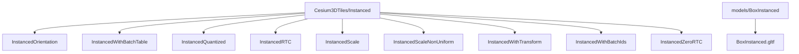
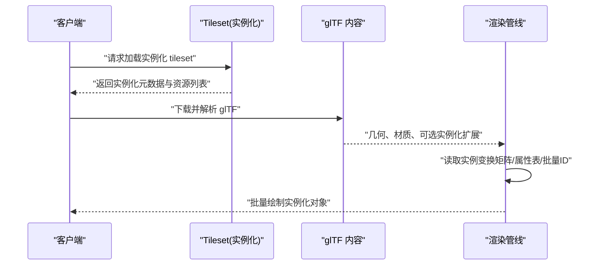
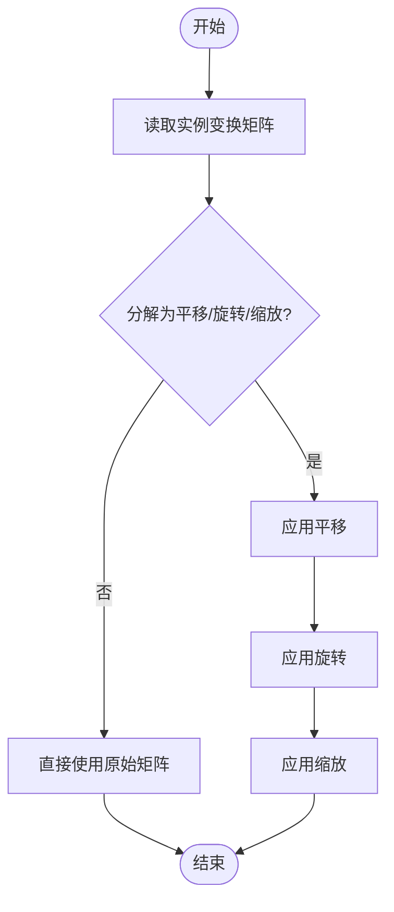
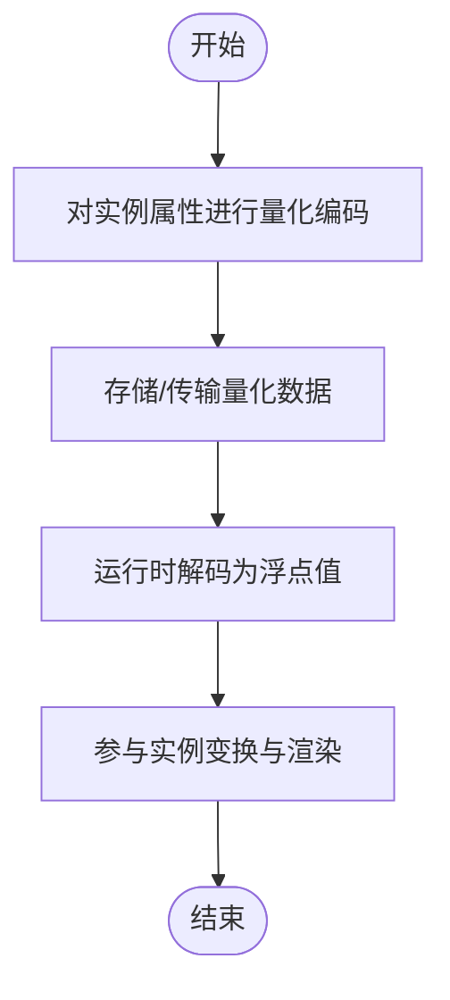
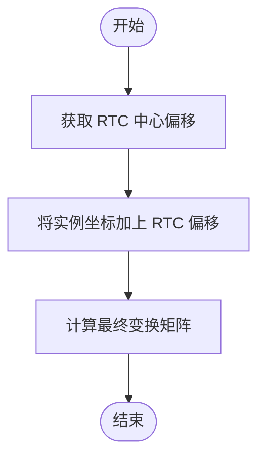
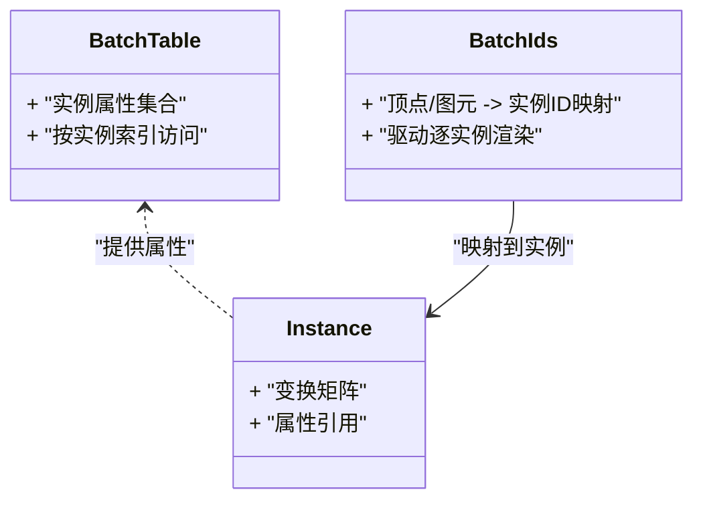
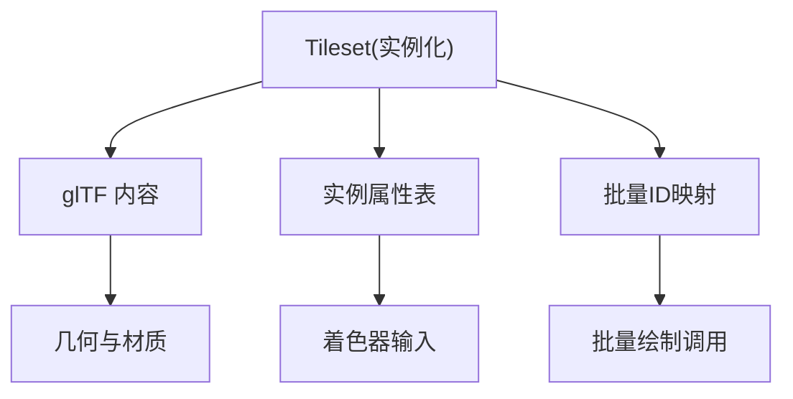

# 实例化渲染

<cite>
**本文引用的文件**   
- [Apps/SampleData/Cesium3DTiles/Instanced/InstancedOrientation/tileset.json](file://Apps/SampleData/Cesium3DTiles/Instanced/InstancedOrientation/tileset.json)
- [Apps/SampleData/Cesium3DTiles/Instanced/InstancedWithBatchTable/tileset.json](file://Apps/SampleData/Cesium3DTiles/Instanced/InstancedWithBatchTable/tileset.json)
- [Apps/SampleData/Cesium3DTiles/Instanced/InstancedQuantized/tileset.json](file://Apps/SampleData/Cesium3DTiles/Instanced/InstancedQuantized/tileset.json)
- [Apps/SampleData/Cesium3DTiles/Instanced/InstancedRTC/tileset.json](file://Apps/SampleData/Cesium3DTiles/Instanced/InstancedRTC/tileset.json)
- [Apps/SampleData/Cesium3DTiles/Instanced/InstancedScale/tileset.json](file://Apps/SampleData/Cesium3DTiles/Instanced/InstancedScale/tileset.json)
- [Apps/SampleData/Cesium3DTiles/Instanced/InstancedScaleNonUniform/tileset.json](file://Apps/SampleData/Cesium3DTiles/Instanced/InstancedScaleNonUniform/tileset.json)
- [Apps/SampleData/Cesium3DTiles/Instanced/InstancedWithTransform/tileset.json](file://Apps/SampleData/Cesium3DTiles/Instanced/InstancedWithTransform/tileset.json)
- [Apps/SampleData/Cesium3DTiles/Instanced/InstancedWithBatchIds/tileset.json](file://Apps/SampleData/Cesium3DTiles/Instanced/InstancedWithBatchIds/tileset.json)
- [Apps/SampleData/Cesium3DTiles/Instanced/InstancedZeroRTC/tileset.json](file://Apps/SampleData/Cesium3DTiles/Instanced/InstancedZeroRTC/tileset.json)
- [Apps/SampleData/models/BoxInstanced/BoxInstanced.gltf](file://Apps/SampleData/models/BoxInstanced/BoxInstanced.gltf)
</cite>

## 目录
1. [简介](#简介)
2. [项目结构](#项目结构)
3. [核心组件](#核心组件)
4. [架构总览](#架构总览)
5. [详细组件分析](#详细组件分析)
6. [依赖关系分析](#依赖关系分析)
7. [性能考量](#性能考量)
8. [故障排查指南](#故障排查指南)
9. [结论](#结论)
10. [附录](#附录)

## 简介
本文件围绕“实例化渲染（Instanced）”数据类型，系统性阐述其性能优化原理、适用场景与配置方法。重点覆盖：
- 实例变换矩阵的配置：位置、旋转、缩放等属性
- 量化编码（quantized）与 RTC（Relative Transform Center）坐标系统的使用方法
- 实例化数据的属性表结构与批量 ID 管理
- 与批处理模型（Batched）的差异与选择策略
- 完整配置示例、性能调优建议与实际应用案例

## 项目结构
仓库中提供了丰富的 3D Tiles 实例化渲染示例数据，涵盖不同变换、量化、RTC、颜色与材质等能力组合。以下图展示了与实例化渲染相关的示例 tileset 与 glTF 内容组织方式。

图表来源
- [Apps/SampleData/Cesium3DTiles/Instanced/InstancedOrientation/tileset.json](file://Apps/SampleData/Cesium3DTiles/Instanced/InstancedOrientation/tileset.json)
- [Apps/SampleData/Cesium3DTiles/Instanced/InstancedWithBatchTable/tileset.json](file://Apps/SampleData/Cesium3DTiles/Instanced/InstancedWithBatchTable/tileset.json)
- [Apps/SampleData/Cesium3DTiles/Instanced/InstancedQuantized/tileset.json](file://Apps/SampleData/Cesium3DTiles/Instanced/InstancedQuantized/tileset.json)
- [Apps/SampleData/Cesium3DTiles/Instanced/InstancedRTC/tileset.json](file://Apps/SampleData/Cesium3DTiles/Instanced/InstancedRTC/tileset.json)
- [Apps/SampleData/Cesium3DTiles/Instanced/InstancedScale/tileset.json](file://Apps/SampleData/Cesium3DTiles/Instanced/InstancedScale/tileset.json)
- [Apps/SampleData/Cesium3DTiles/Instanced/InstancedScaleNonUniform/tileset.json](file://Apps/SampleData/Cesium3DTiles/Instanced/InstancedScaleNonUniform/tileset.json)
- [Apps/SampleData/Cesium3DTiles/Instanced/InstancedWithTransform/tileset.json](file://Apps/SampleData/Cesium3DTiles/Instanced/InstancedWithTransform/tileset.json)
- [Apps/SampleData/Cesium3DTiles/Instanced/InstancedWithBatchIds/tileset.json](file://Apps/SampleData/Cesium3DTiles/Instanced/InstancedWithBatchIds/tileset.json)
- [Apps/SampleData/Cesium3DTiles/Instanced/InstancedZeroRTC/tileset.json](file://Apps/SampleData/Cesium3DTiles/Instanced/InstancedZeroRTC/tileset.json)
- [Apps/SampleData/models/BoxInstanced/BoxInstanced.gltf](file://Apps/SampleData/models/BoxInstanced/BoxInstanced.gltf)

章节来源
- [Apps/SampleData/Cesium3DTiles/Instanced/InstancedOrientation/tileset.json](file://Apps/SampleData/Cesium3DTiles/Instanced/InstancedOrientation/tileset.json)
- [Apps/SampleData/Cesium3DTiles/Instanced/InstancedWithBatchTable/tileset.json](file://Apps/SampleData/Cesium3DTiles/Instanced/InstancedWithBatchTable/tileset.json)
- [Apps/SampleData/Cesium3DTiles/Instanced/InstancedQuantized/tileset.json](file://Apps/SampleData/Cesium3DTiles/Instanced/InstancedQuantized/tileset.json)
- [Apps/SampleData/Cesium3DTiles/Instanced/InstancedRTC/tileset.json](file://Apps/SampleData/Cesium3DTiles/Instanced/InstancedRTC/tileset.json)
- [Apps/SampleData/Cesium3DTiles/Instanced/InstancedScale/tileset.json](file://Apps/SampleData/Cesium3DTiles/Instanced/InstancedScale/tileset.json)
- [Apps/SampleData/Cesium3DTiles/Instanced/InstancedScaleNonUniform/tileset.json](file://Apps/SampleData/Cesium3DTiles/Instanced/InstancedScaleNonUniform/tileset.json)
- [Apps/SampleData/Cesium3DTiles/Instanced/InstancedWithTransform/tileset.json](file://Apps/SampleData/Cesium3DTiles/Instanced/InstancedWithTransform/tileset.json)
- [Apps/SampleData/Cesium3DTiles/Instanced/InstancedWithBatchIds/tileset.json](file://Apps/SampleData/Cesium3DTiles/Instanced/InstancedWithBatchIds/tileset.json)
- [Apps/SampleData/Cesium3DTiles/Instanced/InstancedZeroRTC/tileset.json](file://Apps/SampleData/Cesium3DTiles/Instanced/InstancedZeroRTC/tileset.json)
- [Apps/SampleData/models/BoxInstanced/BoxInstanced.gltf](file://Apps/SampleData/models/BoxInstanced/BoxInstanced.gltf)

## 核心组件
本节聚焦实例化渲染的关键概念与数据结构，结合示例 tileset 说明各属性的作用与组合方式。

- 实例变换矩阵
  - 用于描述每个实例的位置、旋转、缩放等几何变换。可通过独立的变换通道或统一矩阵字段进行配置。
  - 常见组合包括仅平移、含旋转、含非均匀缩放等。
  - 参考示例：
    - [Apps/SampleData/Cesium3DTiles/Instanced/InstancedOrientation/tileset.json](file://Apps/SampleData/Cesium3DTiles/Instanced/InstancedOrientation/tileset.json)
    - [Apps/SampleData/Cesium3DTiles/Instanced/InstancedScale/tileset.json](file://Apps/SampleData/Cesium3DTiles/Instanced/InstancedScale/tileset.json)
    - [Apps/SampleData/Cesium3DTiles/Instanced/InstancedScaleNonUniform/tileset.json](file://Apps/SampleData/Cesium3DTiles/Instanced/InstancedScaleNonUniform/tileset.json)
    - [Apps/SampleData/Cesium3DTiles/Instanced/InstancedWithTransform/tileset.json](file://Apps/SampleData/Cesium3DTiles/Instanced/InstancedWithTransform/tileset.json)

- 量化编码（quantized）
  - 将实例的某些属性（如位置）在存储时进行数值压缩，以降低带宽与内存占用。解码后恢复为浮点精度。
  - 适用于大规模重复对象且对精度要求可控的场景。
  - 参考示例：
    - [Apps/SampleData/Cesium3DTiles/Instanced/InstancedQuantized/tileset.json](file://Apps/SampleData/Cesium3DTiles/Instanced/InstancedQuantized/tileset.json)

- RTC（Relative Transform Center）
  - 通过一个相对中心偏移，将实例坐标从局部空间转换到全局空间，提升大尺度场景下的数值稳定性。
  - 当 RTC 为零向量时，表示无额外偏移；常用于对比验证。
  - 参考示例：
    - [Apps/SampleData/Cesium3DTiles/Instanced/InstancedRTC/tileset.json](file://Apps/SampleData/Cesium3DTiles/Instanced/InstancedRTC/tileset.json)
    - [Apps/SampleData/Cesium3DTiles/Instanced/InstancedZeroRTC/tileset.json](file://Apps/SampleData/Cesium3DTiles/Instanced/InstancedZeroRTC/tileset.json)

- 属性表与批量 ID
  - 属性表（batch table）用于存储每个实例的属性（如颜色、材质、业务标识等）。
  - 批量 ID（batch ids）将顶点或图元映射到具体实例，便于按实例进行着色或交互。
  - 参考示例：
    - [Apps/SampleData/Cesium3DTiles/Instanced/InstancedWithBatchTable/tileset.json](file://Apps/SampleData/Cesium3DTiles/Instanced/InstancedWithBatchTable/tileset.json)
    - [Apps/SampleData/Cesium3DTiles/Instanced/InstancedWithBatchIds/tileset.json](file://Apps/SampleData/Cesium3DTiles/Instanced/InstancedWithBatchIds/tileset.json)

- glTF 内容
  - 实例化渲染通常基于 glTF 内容，glTF 中定义了几何体、材质与可选的实例化扩展。
  - 参考示例：
    - [Apps/SampleData/models/BoxInstanced/BoxInstanced.gltf](file://Apps/SampleData/models/BoxInstanced/BoxInstanced.gltf)

章节来源
- [Apps/SampleData/Cesium3DTiles/Instanced/InstancedOrientation/tileset.json](file://Apps/SampleData/Cesium3DTiles/Instanced/InstancedOrientation/tileset.json)
- [Apps/SampleData/Cesium3DTiles/Instanced/InstancedScale/tileset.json](file://Apps/SampleData/Cesium3DTiles/Instanced/InstancedScale/tileset.json)
- [Apps/SampleData/Cesium3DTiles/Instanced/InstancedScaleNonUniform/tileset.json](file://Apps/SampleData/Cesium3DTiles/Instanced/InstancedScaleNonUniform/tileset.json)
- [Apps/SampleData/Cesium3DTiles/Instanced/InstancedWithTransform/tileset.json](file://Apps/SampleData/Cesium3DTiles/Instanced/InstancedWithTransform/tileset.json)
- [Apps/SampleData/Cesium3DTiles/Instanced/InstancedQuantized/tileset.json](file://Apps/SampleData/Cesium3DTiles/Instanced/InstancedQuantized/tileset.json)
- [Apps/SampleData/Cesium3DTiles/Instanced/InstancedRTC/tileset.json](file://Apps/SampleData/Cesium3DTiles/Instanced/InstancedRTC/tileset.json)
- [Apps/SampleData/Cesium3DTiles/Instanced/InstancedZeroRTC/tileset.json](file://Apps/SampleData/Cesium3DTiles/Instanced/InstancedZeroRTC/tileset.json)
- [Apps/SampleData/Cesium3DTiles/Instanced/InstancedWithBatchTable/tileset.json](file://Apps/SampleData/Cesium3DTiles/Instanced/InstancedWithBatchTable/tileset.json)
- [Apps/SampleData/Cesium3DTiles/Instanced/InstancedWithBatchIds/tileset.json](file://Apps/SampleData/Cesium3DTiles/Instanced/InstancedWithBatchIds/tileset.json)
- [Apps/SampleData/models/BoxInstanced/BoxInstanced.gltf](file://Apps/SampleData/models/BoxInstanced/BoxInstanced.gltf)

## 架构总览
下图展示实例化渲染在 3D Tiles 中的典型数据流：tileset 描述实例化内容与变换，glTF 提供几何与材质，运行时根据实例属性与变换矩阵生成绘制调用。

图表来源
- [Apps/SampleData/Cesium3DTiles/Instanced/InstancedWithBatchTable/tileset.json](file://Apps/SampleData/Cesium3DTiles/Instanced/InstancedWithBatchTable/tileset.json)
- [Apps/SampleData/models/BoxInstanced/BoxInstanced.gltf](file://Apps/SampleData/models/BoxInstanced/BoxInstanced.gltf)

## 详细组件分析

### 实例变换矩阵配置
- 位置（平移）
  - 通过实例化的位置属性或变换矩阵的平移分量指定。
  - 参考示例：
    - [Apps/SampleData/Cesium3DTiles/Instanced/InstancedWithTransform/tileset.json](file://Apps/SampleData/Cesium3DTiles/Instanced/InstancedWithTransform/tileset.json)
- 旋转
  - 使用四元数或旋转矩阵表达，避免万向节锁问题。
  - 参考示例：
    - [Apps/SampleData/Cesium3DTiles/Instanced/InstancedOrientation/tileset.json](file://Apps/SampleData/Cesium3DTiles/Instanced/InstancedOrientation/tileset.json)
- 缩放
  - 支持均匀与非均匀缩放，注意法线计算与光照影响。
  - 参考示例：
    - [Apps/SampleData/Cesium3DTiles/Instanced/InstancedScale/tileset.json](file://Apps/SampleData/Cesium3DTiles/Instanced/InstancedScale/tileset.json)
    - [Apps/SampleData/Cesium3DTiles/Instanced/InstancedScaleNonUniform/tileset.json](file://Apps/SampleData/Cesium3DTiles/Instanced/InstancedScaleNonUniform/tileset.json)

图表来源
- [Apps/SampleData/Cesium3DTiles/Instanced/InstancedWithTransform/tileset.json](file://Apps/SampleData/Cesium3DTiles/Instanced/InstancedWithTransform/tileset.json)
- [Apps/SampleData/Cesium3DTiles/Instanced/InstancedOrientation/tileset.json](file://Apps/SampleData/Cesium3DTiles/Instanced/InstancedOrientation/tileset.json)
- [Apps/SampleData/Cesium3DTiles/Instanced/InstancedScale/tileset.json](file://Apps/SampleData/Cesium3DTiles/Instanced/InstancedScale/tileset.json)
- [Apps/SampleData/Cesium3DTiles/Instanced/InstancedScaleNonUniform/tileset.json](file://Apps/SampleData/Cesium3DTiles/Instanced/InstancedScaleNonUniform/tileset.json)

章节来源
- [Apps/SampleData/Cesium3DTiles/Instanced/InstancedWithTransform/tileset.json](file://Apps/SampleData/Cesium3DTiles/Instanced/InstancedWithTransform/tileset.json)
- [Apps/SampleData/Cesium3DTiles/Instanced/InstancedOrientation/tileset.json](file://Apps/SampleData/Cesium3DTiles/Instanced/InstancedOrientation/tileset.json)
- [Apps/SampleData/Cesium3DTiles/Instanced/InstancedScale/tileset.json](file://Apps/SampleData/Cesium3DTiles/Instanced/InstancedScale/tileset.json)
- [Apps/SampleData/Cesium3DTiles/Instanced/InstancedScaleNonUniform/tileset.json](file://Apps/SampleData/Cesium3DTiles/Instanced/InstancedScaleNonUniform/tileset.json)

### 量化编码（quantized）使用方法
- 目的：减少实例属性（如位置）的存储空间与传输开销。
- 适用：大规模重复对象，精度需求可接受范围。
- 注意事项：解码精度损失可能影响视觉细节，需权衡。
- 参考示例：
  - [Apps/SampleData/Cesium3DTiles/Instanced/InstancedQuantized/tileset.json](file://Apps/SampleData/Cesium3DTiles/Instanced/InstancedQuantized/tileset.json)

图表来源
- [Apps/SampleData/Cesium3DTiles/Instanced/InstancedQuantized/tileset.json](file://Apps/SampleData/Cesium3DTiles/Instanced/InstancedQuantized/tileset.json)

章节来源
- [Apps/SampleData/Cesium3DTiles/Instanced/InstancedQuantized/tileset.json](file://Apps/SampleData/Cesium3DTiles/Instanced/InstancedQuantized/tileset.json)

### RTC（Relative Transform Center）坐标系统
- 作用：以相对中心偏移将实例坐标从局部空间转换到全局空间，提高大尺度场景数值稳定性。
- 零 RTC：表示无额外偏移，常用于对照验证。
- 参考示例：
  - [Apps/SampleData/Cesium3DTiles/Instanced/InstancedRTC/tileset.json](file://Apps/SampleData/Cesium3DTiles/Instanced/InstancedRTC/tileset.json)
  - [Apps/SampleData/Cesium3DTiles/Instanced/InstancedZeroRTC/tileset.json](file://Apps/SampleData/Cesium3DTiles/Instanced/InstancedZeroRTC/tileset.json)

图表来源
- [Apps/SampleData/Cesium3DTiles/Instanced/InstancedRTC/tileset.json](file://Apps/SampleData/Cesium3DTiles/Instanced/InstancedRTC/tileset.json)
- [Apps/SampleData/Cesium3DTiles/Instanced/InstancedZeroRTC/tileset.json](file://Apps/SampleData/Cesium3DTiles/Instanced/InstancedZeroRTC/tileset.json)

章节来源
- [Apps/SampleData/Cesium3DTiles/Instanced/InstancedRTC/tileset.json](file://Apps/SampleData/Cesium3DTiles/Instanced/InstancedRTC/tileset.json)
- [Apps/SampleData/Cesium3DTiles/Instanced/InstancedZeroRTC/tileset.json](file://Apps/SampleData/Cesium3DTiles/Instanced/InstancedZeroRTC/tileset.json)

### 属性表与批量 ID 管理
- 属性表（batch table）
  - 存储每实例的属性（如颜色、材质、业务标识），便于按实例进行着色或交互。
  - 参考示例：
    - [Apps/SampleData/Cesium3DTiles/Instanced/InstancedWithBatchTable/tileset.json](file://Apps/SampleData/Cesium3DTiles/Instanced/InstancedWithBatchTable/tileset.json)
- 批量 ID（batch ids）
  - 将顶点或图元映射到具体实例，驱动逐实例渲染。
  - 参考示例：
    - [Apps/SampleData/Cesium3DTiles/Instanced/InstancedWithBatchIds/tileset.json](file://Apps/SampleData/Cesium3DTiles/Instanced/InstancedWithBatchIds/tileset.json)

图表来源
- [Apps/SampleData/Cesium3DTiles/Instanced/InstancedWithBatchTable/tileset.json](file://Apps/SampleData/Cesium3DTiles/Instanced/InstancedWithBatchTable/tileset.json)
- [Apps/SampleData/Cesium3DTiles/Instanced/InstancedWithBatchIds/tileset.json](file://Apps/SampleData/Cesium3DTiles/Instanced/InstancedWithBatchIds/tileset.json)

章节来源
- [Apps/SampleData/Cesium3DTiles/Instanced/InstancedWithBatchTable/tileset.json](file://Apps/SampleData/Cesium3DTiles/Instanced/InstancedWithBatchTable/tileset.json)
- [Apps/SampleData/Cesium3DTiles/Instanced/InstancedWithBatchIds/tileset.json](file://Apps/SampleData/Cesium3DTiles/Instanced/InstancedWithBatchIds/tileset.json)

### 与批处理模型（Batched）的差异与选择策略
- 差异要点
  - 实例化渲染：同一几何体多次绘制，每次应用不同的实例变换矩阵，适合大量重复对象。
  - 批处理模型：将多个对象合并为单一绘制调用，适合静态或变化较少的对象集合。
- 选择策略
  - 若对象数量巨大且需要独立变换（如树木、路灯、车辆），优先实例化渲染。
  - 若对象较少且静态为主，批处理模型更简单高效。
- 参考示例
  - 实例化：[Apps/SampleData/Cesium3DTiles/Instanced/InstancedWithBatchTable/tileset.json](file://Apps/SampleData/Cesium3DTiles/Instanced/InstancedWithBatchTable/tileset.json)
  - 批处理（对比）：[Apps/SampleData/Cesium3DTiles/Batched/BatchedColors/tileset.json](file://Apps/SampleData/Cesium3DTiles/Batched/BatchedColors/tileset.json)

章节来源
- [Apps/SampleData/Cesium3DTiles/Instanced/InstancedWithBatchTable/tileset.json](file://Apps/SampleData/Cesium3DTiles/Instanced/InstancedWithBatchTable/tileset.json)
- [Apps/SampleData/Cesium3DTiles/Batched/BatchedColors/tileset.json](file://Apps/SampleData/Cesium3DTiles/Batched/BatchedColors/tileset.json)

## 依赖关系分析
实例化渲染的数据依赖主要包括 tileset 元数据、glTF 内容与实例属性。下图展示这些依赖关系。

图表来源
- [Apps/SampleData/Cesium3DTiles/Instanced/InstancedWithBatchTable/tileset.json](file://Apps/SampleData/Cesium3DTiles/Instanced/InstancedWithBatchTable/tileset.json)
- [Apps/SampleData/models/BoxInstanced/BoxInstanced.gltf](file://Apps/SampleData/models/BoxInstanced/BoxInstanced.gltf)

章节来源
- [Apps/SampleData/Cesium3DTiles/Instanced/InstancedWithBatchTable/tileset.json](file://Apps/SampleData/Cesium3DTiles/Instanced/InstancedWithBatchTable/tileset.json)
- [Apps/SampleData/models/BoxInstanced/BoxInstanced.gltf](file://Apps/SampleData/models/BoxInstanced/BoxInstanced.gltf)

## 性能考量
- 合理选择量化编码
  - 在满足视觉精度的前提下启用量化，降低带宽与内存占用。
  - 参考示例：[Apps/SampleData/Cesium3DTiles/Instanced/InstancedQuantized/tileset.json](file://Apps/SampleData/Cesium3DTiles/Instanced/InstancedQuantized/tileset.json)
- 控制实例数量与复杂度
  - 大规模实例化时，关注 GPU 批量绘制次数与顶点总量。
- 使用 RTC 提升数值稳定性
  - 在大尺度场景中启用 RTC，避免浮点精度问题。
  - 参考示例：[Apps/SampleData/Cesium3DTiles/Instanced/InstancedRTC/tileset.json](file://Apps/SampleData/Cesium3DTiles/Instanced/InstancedRTC/tileset.json)
- 简化变换矩阵
  - 尽量复用或缓存变换矩阵，减少 CPU/GPU 计算压力。
  - 参考示例：[Apps/SampleData/Cesium3DTiles/Instanced/InstancedWithTransform/tileset.json](file://Apps/SampleData/Cesium3DTiles/Instanced/InstancedWithTransform/tileset.json)
- 选择合适的材质与着色模式
  - 复杂材质会增加着色成本，必要时采用简化材质或预烘焙贴图。

## 故障排查指南
- 实例未显示或位置异常
  - 检查实例变换矩阵是否正确设置，确认 RTC 偏移是否合理。
  - 参考示例：
    - [Apps/SampleData/Cesium3DTiles/Instanced/InstancedWithTransform/tileset.json](file://Apps/SampleData/Cesium3DTiles/Instanced/InstancedWithTransform/tileset.json)
    - [Apps/SampleData/Cesium3DTiles/Instanced/InstancedRTC/tileset.json](file://Apps/SampleData/Cesium3DTiles/Instanced/InstancedRTC/tileset.json)
- 颜色或材质不生效
  - 确认属性表与批量 ID 映射正确，确保着色器能读取对应属性。
  - 参考示例：
    - [Apps/SampleData/Cesium3DTiles/Instanced/InstancedWithBatchTable/tileset.json](file://Apps/SampleData/Cesium3DTiles/Instanced/InstancedWithBatchTable/tileset.json)
    - [Apps/SampleData/Cesium3DTiles/Instanced/InstancedWithBatchIds/tileset.json](file://Apps/SampleData/Cesium3DTiles/Instanced/InstancedWithBatchIds/tileset.json)
- 缩放导致光照异常
  - 非均匀缩放会影响法线计算，检查材质与着色逻辑。
  - 参考示例：
    - [Apps/SampleData/Cesium3DTiles/Instanced/InstancedScaleNonUniform/tileset.json](file://Apps/SampleData/Cesium3DTiles/Instanced/InstancedScaleNonUniform/tileset.json)

章节来源
- [Apps/SampleData/Cesium3DTiles/Instanced/InstancedWithTransform/tileset.json](file://Apps/SampleData/Cesium3DTiles/Instanced/InstancedWithTransform/tileset.json)
- [Apps/SampleData/Cesium3DTiles/Instanced/InstancedRTC/tileset.json](file://Apps/SampleData/Cesium3DTiles/Instanced/InstancedRTC/tileset.json)
- [Apps/SampleData/Cesium3DTiles/Instanced/InstancedWithBatchTable/tileset.json](file://Apps/SampleData/Cesium3DTiles/Instanced/InstancedWithBatchTable/tileset.json)
- [Apps/SampleData/Cesium3DTiles/Instanced/InstancedWithBatchIds/tileset.json](file://Apps/SampleData/Cesium3DTiles/Instanced/InstancedWithBatchIds/tileset.json)
- [Apps/SampleData/Cesium3DTiles/Instanced/InstancedScaleNonUniform/tileset.json](file://Apps/SampleData/Cesium3DTiles/Instanced/InstancedScaleNonUniform/tileset.json)

## 结论
实例化渲染通过共享几何体与逐实例变换矩阵，显著提升了大规模重复对象的渲染效率。配合量化编码与 RTC 坐标系统，可在保证视觉质量的同时优化带宽与数值稳定性。合理配置属性表与批量 ID，可实现灵活的逐实例着色与交互。在实际项目中，应根据对象规模、变换频率与精度需求，在实例化与批处理之间做出合适选择。

## 附录
- 完整配置示例路径
  - 实例化方向（旋转）：[Apps/SampleData/Cesium3DTiles/Instanced/InstancedOrientation/tileset.json](file://Apps/SampleData/Cesium3DTiles/Instanced/InstancedOrientation/tileset.json)
  - 实例化缩放：[Apps/SampleData/Cesium3DTiles/Instanced/InstancedScale/tileset.json](file://Apps/SampleData/Cesium3DTiles/Instanced/InstancedScale/tileset.json)
  - 实例化非均匀缩放：[Apps/SampleData/Cesium3DTiles/Instanced/InstancedScaleNonUniform/tileset.json](file://Apps/SampleData/Cesium3DTiles/Instanced/InstancedScaleNonUniform/tileset.json)
  - 实例化变换矩阵：[Apps/SampleData/Cesium3DTiles/Instanced/InstancedWithTransform/tileset.json](file://Apps/SampleData/Cesium3DTiles/Instanced/InstancedWithTransform/tileset.json)
  - 实例化量化：[Apps/SampleData/Cesium3DTiles/Instanced/InstancedQuantized/tileset.json](file://Apps/SampleData/Cesium3DTiles/Instanced/InstancedQuantized/tileset.json)
  - 实例化 RTC：[Apps/SampleData/Cesium3DTiles/Instanced/InstancedRTC/tileset.json](file://Apps/SampleData/Cesium3DTiles/Instanced/InstancedRTC/tileset.json)
  - 实例化零 RTC：[Apps/SampleData/Cesium3DTiles/Instanced/InstancedZeroRTC/tileset.json](file://Apps/SampleData/Cesium3DTiles/Instanced/InstancedZeroRTC/tileset.json)
  - 实例化属性表：[Apps/SampleData/Cesium3DTiles/Instanced/InstancedWithBatchTable/tileset.json](file://Apps/SampleData/Cesium3DTiles/Instanced/InstancedWithBatchTable/tileset.json)
  - 实例化批量 ID：[Apps/SampleData/Cesium3DTiles/Instanced/InstancedWithBatchIds/tileset.json](file://Apps/SampleData/Cesium3DTiles/Instanced/InstancedWithBatchIds/tileset.json)
  - glTF 内容：[Apps/SampleData/models/BoxInstanced/BoxInstanced.gltf](file://Apps/SampleData/models/BoxInstanced/BoxInstanced.gltf)