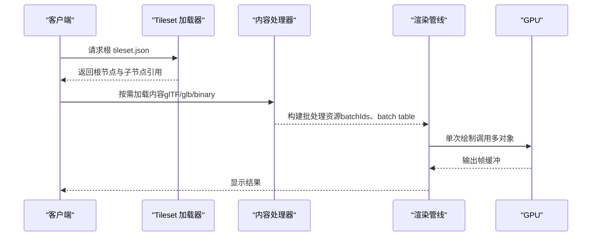
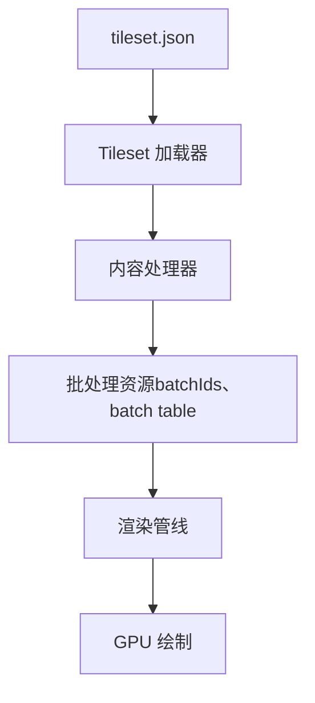

# 批处理模型

<cite>
**本文引用的文件**   
- [Apps/SampleData/Cesium3DTiles/Batched/BatchedColors/tileset.json](file://Apps/SampleData/Cesium3DTiles/Batched/BatchedColors/tileset.json)
- [Apps/SampleData/Cesium3DTiles/Batched/BatchedTranslucent/tileset.json](file://Apps/SampleData/Cesium3DTiles/Batched/BatchedTranslucent/tileset.json)
- [Apps/SampleData/Cesium3DTiles/Batched/BatchedTranslucentOpaqueMix/tileset.json](file://Apps/SampleData/Cesium3DTiles/Batched/BatchedTranslucentOpaqueMix/tileset.json)
- [Apps/SampleData/Cesium3DTiles/Batched/BatchedWithBatchTable/tileset.json](file://Apps/SampleData/Cesium3DTiles/Batched/BatchedWithBatchTable/tileset.json)
- [Specs/Data/Cesium3DTiles/Batched/BatchedColors/tileset.json](file://Specs/Data/Cesium3DTiles/Batched/BatchedColors/tileset.json)
- [Specs/Data/Cesium3DTiles/Batched/BatchedTextured/tileset.json](file://Specs/Data/Cesium3DTiles/Batched/BatchedTextured/tileset.json)
- [Specs/Data/Cesium3DTiles/Batched/BatchedWithVertexColors/tileset.json](file://Specs/Data/Cesium3DTiles/Batched/BatchedWithVertexColors/tileset.json)
- [Specs/Data/Cesium3DTiles/Batched/BatchedWithBatchTable/tileset.json](file://Specs/Data/Cesium3DTiles/Batched/BatchedWithBatchTable/tileset.json)
- [Specs/Data/Cesium3DTiles/Batched/BatchedWithBatchTableBinary/tileset.json](file://Specs/Data/Cesium3DTiles/Batched/BatchedWithBatchTableBinary/tileset.json)
- [Specs/Data/Cesium3DTiles/Batched/BatchedWithBoundingSphere/tileset.json](file://Specs/Data/Cesium3DTiles/Batched/BatchedWithBoundingSphere/tileset.json)
- [Specs/Data/Cesium3DTiles/Batched/BatchedWithTransformBox/tileset.json](file://Specs/Data/Cesium3DTiles/Batched/BatchedWithTransformBox/tileset.json)
- [Specs/Data/Cesium3DTiles/Batched/BatchedWithTransformRegion/tileset.json](file://Specs/Data/Cesium3DTiles/Batched/BatchedWithTransformRegion/tileset.json)
- [Specs/Data/Cesium3DTiles/Batched/BatchedWithTransformSphere/tileset.json](file://Specs/Data/Cesium3DTiles/Batched/BatchedWithTransformSphere/tileset.json)
- [Specs/Data/Cesium3DTiles/Batched/BatchedWithoutBatchTable/tileset.json](file://Specs/Data/Cesium3DTiles/Batched/BatchedWithoutBatchTable/tileset.json)
</cite>

## 目录
1. [简介](#简介)
2. [项目结构](#项目结构)
3. [核心组件](#核心组件)
4. [架构总览](#架构总览)
5. [详细组件分析](#详细组件分析)
6. [依赖分析](#依赖分析)
7. [性能考量](#性能考量)
8. [故障排查指南](#故障排查指南)
9. [结论](#结论)
10. [附录](#附录)

## 简介
本文件面向 CesiumJS 的 3D Tiles 批处理模型（Batched）数据类型，系统阐述其渲染原理与性能优势，详解批量 ID（batchIds）与属性表（batch table）的数据结构与用法，覆盖颜色批处理、透明度混合、纹理贴图、顶点颜色等常见变体，并提供 tileset.json 配置示例与最佳实践建议。

## 项目结构
仓库中提供了丰富的 Batched 类型样例数据，涵盖不同特性组合与边界情况：
- 应用样例位于 Apps/SampleData/Cesium3DTiles/Batched/...
- 测试用例数据位于 Specs/Data/Cesium3DTiles/Batched/...

这些样例包含多种 tileset.json 配置，用于演示：
- 基础颜色批处理
- 半透明与不透明混合
- 带 batch table 的属性数据
- 纹理贴图与顶点颜色
- 包围体与变换描述（包围球、包围盒、区域）

```mermaid
graph TB
A["应用样例<br/>Apps/SampleData/Cesium3DTiles/Batched"] --> B["颜色批处理<br/>BatchedColors"]
A --> C["半透明批处理<br/>BatchedTranslucent"]
A --> D["半透明与不透明混合<br/>BatchedTranslucentOpaqueMix"]
A --> E["带属性表<br/>BatchedWithBatchTable"]
S["测试样例<br/>Specs/Data/Cesium3DTiles/Batched"] --> T["颜色批处理<br/>BatchedColors"]
S --> U["纹理贴图<br/>BatchedTextured"]
S --> V["顶点颜色<br/>BatchedWithVertexColors"]
S --> W["带属性表<br/>BatchedWithBatchTable"]
S --> X["二进制属性表<br/>BatchedWithBatchTableBinary"]
S --> Y["包围球<br/>BatchedWithBoundingSphere"]
S --> Z["变换-包围盒<br/>BatchedWithTransformBox"]
S --> AA["变换-区域<br/>BatchedWithTransformRegion"]
S --> BB["变换-包围球<br/>BatchedWithTransformSphere"]
S --> CC["无属性表<br/>BatchedWithoutBatchTable"]
```

图表来源
- [tileset.json](file://Apps/SampleData/Cesium3DTiles/Batched/BatchedColors/tileset.json)
- [tileset.json](file://Apps/SampleData/Cesium3DTiles/Batched/BatchedTranslucent/tileset.json)
- [tileset.json](file://Apps/SampleData/Cesium3DTiles/Batched/BatchedTranslucentOpaqueMix/tileset.json)
- [tileset.json](file://Apps/SampleData/Cesium3DTiles/Batched/BatchedWithBatchTable/tileset.json)
- [tileset.json](file://Specs/Data/Cesium3DTiles/Batched/BatchedColors/tileset.json)
- [tileset.json](file://Specs/Data/Cesium3DTiles/Batched/BatchedTextured/tileset.json)
- [tileset.json](file://Specs/Data/Cesium3DTiles/Batched/BatchedWithVertexColors/tileset.json)
- [tileset.json](file://Specs/Data/Cesium3DTiles/Batched/BatchedWithBatchTable/tileset.json)
- [tileset.json](file://Specs/Data/Cesium3DTiles/Batched/BatchedWithBatchTableBinary/tileset.json)
- [tileset.json](file://Specs/Data/Cesium3DTiles/Batched/BatchedWithBoundingSphere/tileset.json)
- [tileset.json](file://Specs/Data/Cesium3DTiles/Batched/BatchedWithTransformBox/tileset.json)
- [tileset.json](file://Specs/Data/Cesium3DTiles/Batched/BatchedWithTransformRegion/tileset.json)
- [tileset.json](file://Specs/Data/Cesium3DTiles/Batched/BatchedWithTransformSphere/tileset.json)
- [tileset.json](file://Specs/Data/Cesium3DTiles/Batched/BatchedWithoutBatchTable/tileset.json)

章节来源
- [tileset.json](file://Apps/SampleData/Cesium3DTiles/Batched/BatchedColors/tileset.json)
- [tileset.json](file://Apps/SampleData/Cesium3DTiles/Batched/BatchedTranslucent/tileset.json)
- [tileset.json](file://Apps/SampleData/Cesium3DTiles/Batched/BatchedTranslucentOpaqueMix/tileset.json)
- [tileset.json](file://Apps/SampleData/Cesium3DTiles/Batched/BatchedWithBatchTable/tileset.json)
- [tileset.json](file://Specs/Data/Cesium3DTiles/Batched/BatchedColors/tileset.json)
- [tileset.json](file://Specs/Data/Cesium3DTiles/Batched/BatchedTextured/tileset.json)
- [tileset.json](file://Specs/Data/Cesium3DTiles/Batched/BatchedWithVertexColors/tileset.json)
- [tileset.json](file://Specs/Data/Cesium3DTiles/Batched/BatchedWithBatchTable/tileset.json)
- [tileset.json](file://Specs/Data/Cesium3DTiles/Batched/BatchedWithBatchTableBinary/tileset.json)
- [tileset.json](file://Specs/Data/Cesium3DTiles/Batched/BatchedWithBoundingSphere/tileset.json)
- [tileset.json](file://Specs/Data/Cesium3DTiles/Batched/BatchedWithTransformBox/tileset.json)
- [tileset.json](file://Specs/Data/Cesium3DTiles/Batched/BatchedWithTransformRegion/tileset.json)
- [tileset.json](file://Specs/Data/Cesium3DTiles/Batched/BatchedWithTransformSphere/tileset.json)
- [tileset.json](file://Specs/Data/Cesium3DTiles/Batched/BatchedWithoutBatchTable/tileset.json)

## 核心组件
- 批处理模型（Batched）将多个几何图元合并为单个绘制调用，通过批量 ID（batchIds）在片元着色阶段区分不同对象，从而显著减少 GPU 状态切换与绘制开销。
- 属性表（batch table）以行表示每个批对象的属性集合，列名即属性键，支持标量、向量、字符串等类型；可与 glTF 扩展或 3D Tiles 规范中的属性机制配合使用。
- 典型变体包括：
  - 颜色批处理：通过 per-batch 颜色实现差异化外观
  - 透明度混合：半透明批处理需考虑排序与混合策略
  - 纹理贴图：批内共享材质或按批选择纹理
  - 顶点颜色：结合 per-vertex 与 per-batch 颜色进行混合

章节来源
- [tileset.json](file://Specs/Data/Cesium3DTiles/Batched/BatchedColors/tileset.json)
- [tileset.json](file://Specs/Data/Cesium3DTiles/Batched/BatchedTextured/tileset.json)
- [tileset.json](file://Specs/Data/Cesium3DTiles/Batched/BatchedWithVertexColors/tileset.json)
- [tileset.json](file://Specs/Data/Cesium3DTiles/Batched/BatchedWithBatchTable/tileset.json)
- [tileset.json](file://Specs/Data/Cesium3DTiles/Batched/BatchedWithBatchTableBinary/tileset.json)

## 架构总览
下图展示了从 tileset.json 到内容加载与渲染的关键路径，以及批处理相关的数据流。

图表来源
- [tileset.json](file://Apps/SampleData/Cesium3DTiles/Batched/BatchedColors/tileset.json)
- [tileset.json](file://Specs/Data/Cesium3DTiles/Batched/BatchedWithBatchTable/tileset.json)

## 详细组件分析

### 批处理渲染原理与性能优势
- 原理：将多个图元合并为一个 draw call，通过 batchIds 在片元阶段识别归属对象，从而实现“一次提交、多次逻辑”的高效渲染。
- 优势：
  - 降低 CPU-GPU 通信与状态切换成本
  - 提升缓存命中率与带宽利用率
  - 便于统一管理与更新 per-batch 属性（如颜色、可见性）

章节来源
- [tileset.json](file://Specs/Data/Cesium3DTiles/Batched/BatchedColors/tileset.json)
- [tileset.json](file://Specs/Data/Cesium3DTiles/Batched/BatchedWithBatchTable/tileset.json)

### 批量 ID（batchIds）使用方法
- 作用：标识每个像素所属的批对象索引，驱动 per-batch 属性查找与着色计算。
- 关键点：
  - 必须与 batch table 的行数一致
  - 可存储于几何缓冲区或作为附加属性提供
  - 与拾取、样式化、动画等能力紧密关联

章节来源
- [tileset.json](file://Specs/Data/Cesium3DTiles/Batched/BatchedWithBatchTable/tileset.json)
- [tileset.json](file://Specs/Data/Cesium3DTiles/Batched/BatchedWithBatchTableBinary/tileset.json)

### 属性表（batch table）数据结构
- 结构：表格形式，每行对应一个批对象，每列为一种属性；支持数值、向量、布尔、字符串等类型。
- 用途：
  - 存储业务属性（如建筑高度、材质类型、ID）
  - 驱动样式规则、筛选、交互反馈
- 注意：
  - 二进制格式可显著减小体积并加速解析
  - 与 glTF 扩展或 3D Tiles 元数据体系协同使用时需遵循相应约束

章节来源
- [tileset.json](file://Specs/Data/Cesium3DTiles/Batched/BatchedWithBatchTable/tileset.json)
- [tileset.json](file://Specs/Data/Cesium3DTiles/Batched/BatchedWithBatchTableBinary/tileset.json)

### 变体与配置要点

#### 颜色批处理
- 目标：为不同批对象设置独立颜色，常用于分类可视化。
- 关键配置项：
  - content：指向包含批数据的几何内容（glTF/glb）
  - batchIds：提供批 ID 映射
  - batch table：定义颜色或其他属性列
- 参考样例：
  - [tileset.json](file://Apps/SampleData/Cesium3DTiles/Batched/BatchedColors/tileset.json)
  - [tileset.json](file://Specs/Data/Cesium3DTiles/Batched/BatchedColors/tileset.json)

章节来源
- [tileset.json](file://Apps/SampleData/Cesium3DTiles/Batched/BatchedColors/tileset.json)
- [tileset.json](file://Specs/Data/Cesium3DTiles/Batched/BatchedColors/tileset.json)

#### 透明度混合（半透明）
- 目标：支持半透明批对象的正确混合与排序。
- 关键配置项：
  - 启用半透明渲染模式
  - 合理设置几何错误与裁剪范围，避免不必要的深度写入
- 参考样例：
  - [tileset.json](file://Apps/SampleData/Cesium3DTiles/Batched/BatchedTranslucent/tileset.json)
  - [tileset.json](file://Apps/SampleData/Cesium3DTiles/Batched/BatchedTranslucentOpaqueMix/tileset.json)

章节来源
- [tileset.json](file://Apps/SampleData/Cesium3DTiles/Batched/BatchedTranslucent/tileset.json)
- [tileset.json](file://Apps/SampleData/Cesium3DTiles/Batched/BatchedTranslucentOpaqueMix/tileset.json)

#### 纹理贴图
- 目标：为批对象应用纹理，支持批级或逐对象纹理选择。
- 关键配置项：
  - content：包含纹理资源的 glTF/glb
  - 纹理单元与采样参数
- 参考样例：
  - [tileset.json](file://Specs/Data/Cesium3DTiles/Batched/BatchedTextured/tileset.json)

章节来源
- [tileset.json](file://Specs/Data/Cesium3DTiles/Batched/BatchedTextured/tileset.json)

#### 顶点颜色
- 目标：结合 per-vertex 与 per-batch 颜色，实现更丰富的外观控制。
- 关键配置项：
  - 顶点颜色通道
  - 与批颜色的混合策略
- 参考样例：
  - [tileset.json](file://Specs/Data/Cesium3DTiles/Batched/BatchedWithVertexColors/tileset.json)

章节来源
- [tileset.json](file://Specs/Data/Cesium3DTiles/Batched/BatchedWithVertexColors/tileset.json)

### tileset.json 配置示例与关键属性说明
以下字段在批处理模型中尤为关键：
- content：内容路径，指向 glTF/glb 或二进制数据，承载几何与批信息
- transform：可选的仿射变换矩阵，用于整体定位与定向
- geometricError：几何错误阈值，控制 LOD 细化与剔除
- batchIds：批 ID 映射，连接几何与属性表
- batch table：属性表定义与数据源（JSON 或二进制）

参考样例路径：
- 颜色批处理：[tileset.json](file://Apps/SampleData/Cesium3DTiles/Batched/BatchedColors/tileset.json)
- 半透明批处理：[tileset.json](file://Apps/SampleData/Cesium3DTiles/Batched/BatchedTranslucent/tileset.json)
- 半透明与不透明混合：[tileset.json](file://Apps/SampleData/Cesium3DTiles/Batched/BatchedTranslucentOpaqueMix/tileset.json)
- 带属性表：[tileset.json](file://Apps/SampleData/Cesium3DTiles/Batched/BatchedWithBatchTable/tileset.json)
- 纹理贴图：[tileset.json](file://Specs/Data/Cesium3DTiles/Batched/BatchedTextured/tileset.json)
- 顶点颜色：[tileset.json](file://Specs/Data/Cesium3DTiles/Batched/BatchedWithVertexColors/tileset.json)
- 二进制属性表：[tileset.json](file://Specs/Data/Cesium3DTiles/Batched/BatchedWithBatchTableBinary/tileset.json)
- 包围球：[tileset.json](file://Specs/Data/Cesium3DTiles/Batched/BatchedWithBoundingSphere/tileset.json)
- 变换-包围盒：[tileset.json](file://Specs/Data/Cesium3DTiles/Batched/BatchedWithTransformBox/tileset.json)
- 变换-区域：[tileset.json](file://Specs/Data/Cesium3DTiles/Batched/BatchedWithTransformRegion/tileset.json)
- 变换-包围球：[tileset.json](file://Specs/Data/Cesium3DTiles/Batched/BatchedWithTransformSphere/tileset.json)
- 无属性表：[tileset.json](file://Specs/Data/Cesium3DTiles/Batched/BatchedWithoutBatchTable/tileset.json)

章节来源
- [tileset.json](file://Apps/SampleData/Cesium3DTiles/Batched/BatchedColors/tileset.json)
- [tileset.json](file://Apps/SampleData/Cesium3DTiles/Batched/BatchedTranslucent/tileset.json)
- [tileset.json](file://Apps/SampleData/Cesium3DTiles/Batched/BatchedTranslucentOpaqueMix/tileset.json)
- [tileset.json](file://Apps/SampleData/Cesium3DTiles/Batched/BatchedWithBatchTable/tileset.json)
- [tileset.json](file://Specs/Data/Cesium3DTiles/Batched/BatchedTextured/tileset.json)
- [tileset.json](file://Specs/Data/Cesium3DTiles/Batched/BatchedWithVertexColors/tileset.json)
- [tileset.json](file://Specs/Data/Cesium3DTiles/Batched/BatchedWithBatchTableBinary/tileset.json)
- [tileset.json](file://Specs/Data/Cesium3DTiles/Batched/BatchedWithBoundingSphere/tileset.json)
- [tileset.json](file://Specs/Data/Cesium3DTiles/Batched/BatchedWithTransformBox/tileset.json)
- [tileset.json](file://Specs/Data/Cesium3DTiles/Batched/BatchedWithTransformRegion/tileset.json)
- [tileset.json](file://Specs/Data/Cesium3DTiles/Batched/BatchedWithTransformSphere/tileset.json)
- [tileset.json](file://Specs/Data/Cesium3DTiles/Batched/BatchedWithoutBatchTable/tileset.json)

## 依赖分析
- 外部依赖：
  - glTF/glb：承载几何、材质与纹理
  - 3D Tiles 规范：定义 tileset.json 结构与语义
- 内部依赖：
  - Tileset 加载器：解析 tileset.json 与子节点
  - 内容处理器：构建批处理资源与属性表
  - 渲染管线：执行批处理绘制与着色

图表来源
- [tileset.json](file://Apps/SampleData/Cesium3DTiles/Batched/BatchedColors/tileset.json)
- [tileset.json](file://Specs/Data/Cesium3DTiles/Batched/BatchedWithBatchTable/tileset.json)

章节来源
- [tileset.json](file://Apps/SampleData/Cesium3DTiles/Batched/BatchedColors/tileset.json)
- [tileset.json](file://Specs/Data/Cesium3DTiles/Batched/BatchedWithBatchTable/tileset.json)

## 性能考量
- 合并绘制：尽量将相似材质与状态的图元放入同一批，减少状态切换。
- 属性表优化：优先使用二进制属性表以减少 I/O 与解析开销。
- 几何错误调优：合理设置 geometricError，平衡细节与性能。
- 半透明排序：对半透明批对象进行稳定排序，避免闪烁与伪影。
- 纹理复用：共享纹理图集，减少纹理绑定次数。

## 故障排查指南
- 现象：颜色或属性未生效
  - 检查 batchIds 数量与 batch table 行数是否一致
  - 确认 content 路径与资源可达
- 现象：半透明渲染异常
  - 调整混合模式与深度写入策略
  - 验证几何错误与裁剪范围
- 现象：性能下降
  - 评估批大小与属性表体积
  - 检查纹理与几何压缩策略

章节来源
- [tileset.json](file://Specs/Data/Cesium3DTiles/Batched/BatchedWithBatchTable/tileset.json)
- [tileset.json](file://Specs/Data/Cesium3DTiles/Batched/BatchedWithBatchTableBinary/tileset.json)
- [tileset.json](file://Apps/SampleData/Cesium3DTiles/Batched/BatchedTranslucent/tileset.json)

## 结论
批处理模型通过 batchIds 与 batch table 的结合，实现了高效的多对象渲染与灵活的属性驱动。在实际工程中，应结合场景需求选择合适的变体（颜色、透明度、纹理、顶点颜色），并通过合理的 tileset.json 配置与资源组织，达到性能与质量的平衡。

## 附录
- 术语
  - 批处理（Batching）：将多个图元合并为单次绘制的技术
  - 批量 ID（batchIds）：标识像素所属批对象的索引
  - 属性表（batch table）：以行列形式存储批对象属性的数据结构
- 参考样例清单
  - 颜色批处理：[tileset.json](file://Apps/SampleData/Cesium3DTiles/Batched/BatchedColors/tileset.json)
  - 半透明批处理：[tileset.json](file://Apps/SampleData/Cesium3DTiles/Batched/BatchedTranslucent/tileset.json)
  - 半透明与不透明混合：[tileset.json](file://Apps/SampleData/Cesium3DTiles/Batched/BatchedTranslucentOpaqueMix/tileset.json)
  - 带属性表：[tileset.json](file://Apps/SampleData/Cesium3DTiles/Batched/BatchedWithBatchTable/tileset.json)
  - 纹理贴图：[tileset.json](file://Specs/Data/Cesium3DTiles/Batched/BatchedTextured/tileset.json)
  - 顶点颜色：[tileset.json](file://Specs/Data/Cesium3DTiles/Batched/BatchedWithVertexColors/tileset.json)
  - 二进制属性表：[tileset.json](file://Specs/Data/Cesium3DTiles/Batched/BatchedWithBatchTableBinary/tileset.json)
  - 包围球：[tileset.json](file://Specs/Data/Cesium3DTiles/Batched/BatchedWithBoundingSphere/tileset.json)
  - 变换-包围盒：[tileset.json](file://Specs/Data/Cesium3DTiles/Batched/BatchedWithTransformBox/tileset.json)
  - 变换-区域：[tileset.json](file://Specs/Data/Cesium3DTiles/Batched/BatchedWithTransformRegion/tileset.json)
  - 变换-包围球：[tileset.json](file://Specs/Data/Cesium3DTiles/Batched/BatchedWithTransformSphere/tileset.json)
  - 无属性表：[tileset.json](file://Specs/Data/Cesium3DTiles/Batched/BatchedWithoutBatchTable/tileset.json)