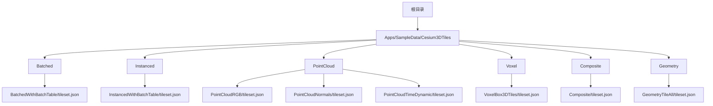
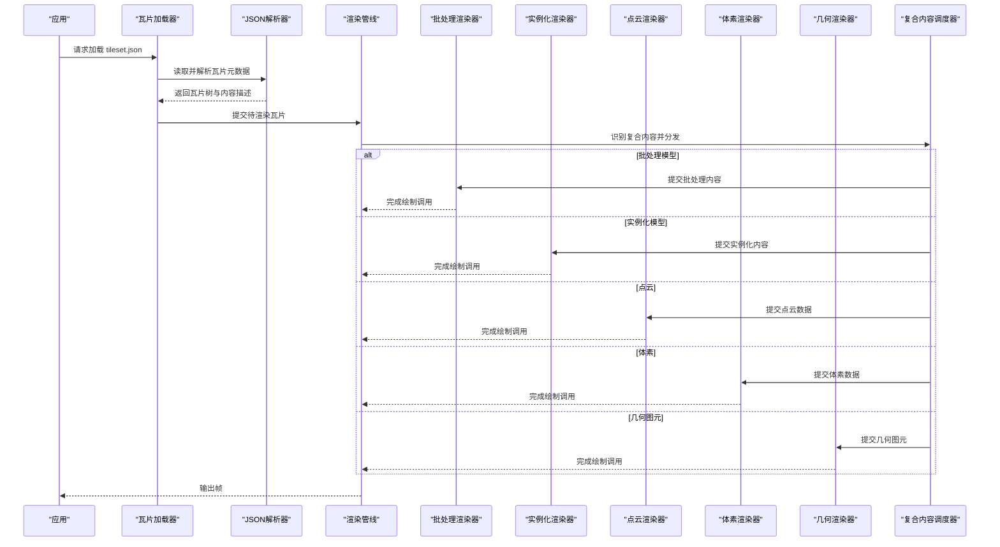
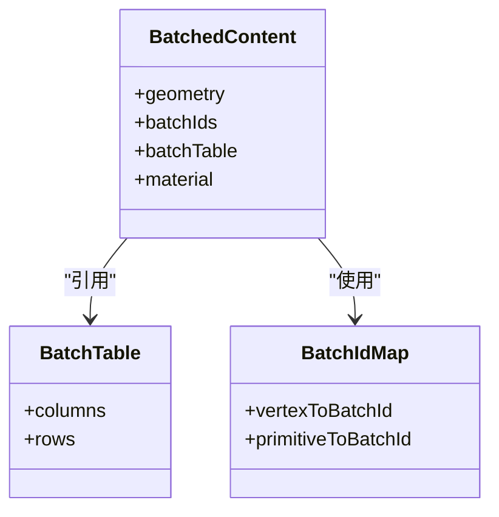
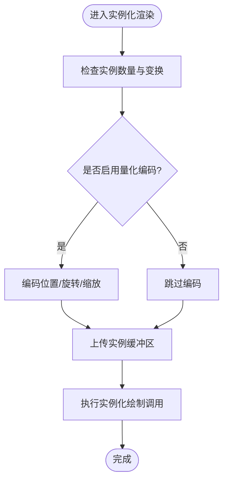
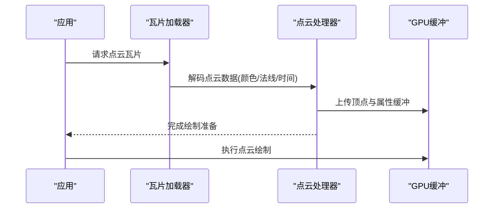
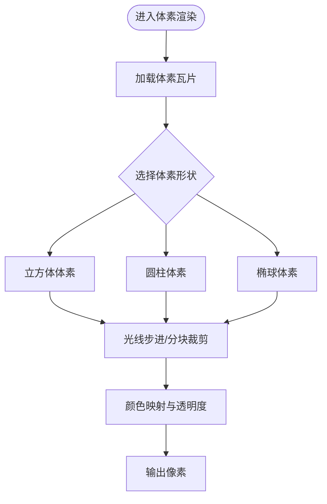
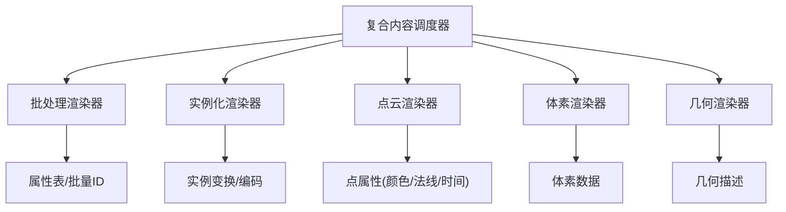

# 数据类型支持

<cite>
**本文引用的文件**   
- [Apps/SampleData/Cesium3DTiles/Batched/BatchedWithBatchTable/tileset.json](file://Apps/SampleData/Cesium3DTiles/Batched/BatchedWithBatchTable/tileset.json)
- [Apps/SampleData/Cesium3DTiles/Instanced/InstancedWithBatchTable/tileset.json](file://Apps/SampleData/Cesium3DTiles/Instanced/InstancedWithBatchTable/tileset.json)
- [Apps/SampleData/Cesium3DTiles/PointCloud/PointCloudRGB/tileset.json](file://Apps/SampleData/Cesium3DTiles/PointCloud/PointCloudRGB/tileset.json)
- [Apps/SampleData/Cesium3DTiles/PointCloud/PointCloudNormals/tileset.json](file://Apps/SampleData/Cesium3DTiles/PointCloud/PointCloudNormals/tileset.json)
- [Apps/SampleData/Cesium3DTiles/PointCloud/PointCloudTimeDynamic/tileset.json](file://Apps/SampleData/Cesium3DTiles/PointCloud/PointCloudTimeDynamic/tileset.json)
- [Apps/SampleData/Cesium3DTiles/Voxel/VoxelBox3DTiles/tileset.json](file://Apps/SampleData/Cesium3DTiles/Voxel/VoxelBox3DTiles/tileset.json)
- [Apps/SampleData/Cesium3DTiles/Composite/Composite/tileset.json](file://Apps/SampleData/Cesium3DTiles/Composite/Composite/tileset.json)
- [Specs/Data/Cesium3DTiles/Geometry/GeometryTileAll/tileset.json](file://Specs/Data/Cesium3DTiles/Geometry/GeometryTileAll/tileset.json)
</cite>

## 目录
1. [简介](#简介)
2. [项目结构](#项目结构)
3. [核心组件](#核心组件)
4. [架构总览](#架构总览)
5. [详细组件分析](#详细组件分析)
6. [依赖分析](#依赖分析)
7. [性能考虑](#性能考虑)
8. [故障排查指南](#故障排查指南)
9. [结论](#结论)
10. [附录](#附录)

## 简介
本文件面向Cesium3DTileset支持的多种3D Tiles数据类型，聚焦以下主题：
- 批处理模型（Batched）的数据结构与渲染特性，包括批量ID与属性表的使用
- 实例化渲染（Instanced）的性能优势与配置方法
- 点云数据（PointCloud）的处理能力，包括RGB颜色、法向量、时间动态点云等
- 体素数据（Voxel）的渲染机制与应用场景
- 几何图元（Geometry）与复合内容（Composite）的使用方法
- 每种类型提供tileset.json配置示例路径与最佳实践建议

## 项目结构
仓库中提供了大量3D Tiles样例数据，覆盖上述所有数据类型。关键样例目录如下：
- Batched：批处理模型样例，含带属性表的配置
- Instanced：实例化模型样例，含带属性表与变换的配置
- PointCloud：点云样例，包含RGB、法向量、时间动态等
- Voxel：体素样例，包含不同基本体素的瓦片集
- Composite：复合内容样例，组合多个子内容
- Geometry：几何图元瓦片样例，用于矢量/几何瓦片展示

图表来源
- [Apps/SampleData/Cesium3DTiles/Batched/BatchedWithBatchTable/tileset.json](file://Apps/SampleData/Cesium3DTiles/Batched/BatchedWithBatchTable/tileset.json)
- [Apps/SampleData/Cesium3DTiles/Instanced/InstancedWithBatchTable/tileset.json](file://Apps/SampleData/Cesium3DTiles/Instanced/InstancedWithBatchTable/tileset.json)
- [Apps/SampleData/Cesium3DTiles/PointCloud/PointCloudRGB/tileset.json](file://Apps/SampleData/Cesium3DTiles/PointCloud/PointCloudRGB/tileset.json)
- [Apps/SampleData/Cesium3DTiles/PointCloud/PointCloudNormals/tileset.json](file://Apps/SampleData/Cesium3DTiles/PointCloud/PointCloudNormals/tileset.json)
- [Apps/SampleData/Cesium3DTiles/PointCloud/PointCloudTimeDynamic/tileset.json](file://Apps/SampleData/Cesium3DTiles/PointCloud/PointCloudTimeDynamic/tileset.json)
- [Apps/SampleData/Cesium3DTiles/Voxel/VoxelBox3DTiles/tileset.json](file://Apps/SampleData/Cesium3DTiles/Voxel/VoxelBox3DTiles/tileset.json)
- [Apps/SampleData/Cesium3DTiles/Composite/Composite/tileset.json](file://Apps/SampleData/Cesium3DTiles/Composite/Composite/tileset.json)
- [Specs/Data/Cesium3DTiles/Geometry/GeometryTileAll/tileset.json](file://Specs/Data/Cesium3DTiles/Geometry/GeometryTileAll/tileset.json)

章节来源
- [Apps/SampleData/Cesium3DTiles/Batched/BatchedWithBatchTable/tileset.json](file://Apps/SampleData/Cesium3DTiles/Batched/BatchedWithBatchTable/tileset.json)
- [Apps/SampleData/Cesium3DTiles/Instanced/InstancedWithBatchTable/tileset.json](file://Apps/SampleData/Cesium3DTiles/Instanced/InstancedWithBatchTable/tileset.json)
- [Apps/SampleData/Cesium3DTiles/PointCloud/PointCloudRGB/tileset.json](file://Apps/SampleData/Cesium3DTiles/PointCloud/PointCloudRGB/tileset.json)
- [Apps/SampleData/Cesium3DTiles/PointCloud/PointCloudNormals/tileset.json](file://Apps/SampleData/Cesium3DTiles/PointCloud/PointCloudNormals/tileset.json)
- [Apps/SampleData/Cesium3DTiles/PointCloud/PointCloudTimeDynamic/tileset.json](file://Apps/SampleData/Cesium3DTiles/PointCloud/PointCloudTimeDynamic/tileset.json)
- [Apps/SampleData/Cesium3DTiles/Voxel/VoxelBox3DTiles/tileset.json](file://Apps/SampleData/Cesium3DTiles/Voxel/VoxelBox3DTiles/tileset.json)
- [Apps/SampleData/Cesium3DTiles/Composite/Composite/tileset.json](file://Apps/SampleData/Cesium3DTiles/Composite/Composite/tileset.json)
- [Specs/Data/Cesium3DTiles/Geometry/GeometryTileAll/tileset.json](file://Specs/Data/Cesium3DTiles/Geometry/GeometryTileAll/tileset.json)

## 核心组件
本节概述各类数据在Cesium中的角色与使用方式：
- 批处理模型（Batched）：将多个网格合并为一次绘制调用，通过批量ID与属性表实现按对象选择与着色
- 实例化渲染（Instanced）：对同一几何进行多次实例化绘制，适合大量重复对象的场景
- 点云（PointCloud）：高效渲染海量点，支持颜色、法向量、时间序列等扩展
- 体素（Voxel）：以三维栅格单元表示连续场或密度数据，常用于地质、气象等
- 几何图元（Geometry）：瓦片内直接包含几何描述，适合矢量要素或简单几何集合
- 复合内容（Composite）：在一个瓦片中组合多种内容类型，便于统一管理与渲染

章节来源
- [Apps/SampleData/Cesium3DTiles/Batched/BatchedWithBatchTable/tileset.json](file://Apps/SampleData/Cesium3DTiles/Batched/BatchedWithBatchTable/tileset.json)
- [Apps/SampleData/Cesium3DTiles/Instanced/InstancedWithBatchTable/tileset.json](file://Apps/SampleData/Cesium3DTiles/Instanced/InstancedWithBatchTable/tileset.json)
- [Apps/SampleData/Cesium3DTiles/PointCloud/PointCloudRGB/tileset.json](file://Apps/SampleData/Cesium3DTiles/PointCloud/PointCloudRGB/tileset.json)
- [Apps/SampleData/Cesium3DTiles/PointCloud/PointCloudNormals/tileset.json](file://Apps/SampleData/Cesium3DTiles/PointCloud/PointCloudNormals/tileset.json)
- [Apps/SampleData/Cesium3DTiles/PointCloud/PointCloudTimeDynamic/tileset.json](file://Apps/SampleData/Cesium3DTiles/PointCloud/PointCloudTimeDynamic/tileset.json)
- [Apps/SampleData/Cesium3DTiles/Voxel/VoxelBox3DTiles/tileset.json](file://Apps/SampleData/Cesium3DTiles/Voxel/VoxelBox3DTiles/tileset.json)
- [Apps/SampleData/Cesium3DTiles/Composite/Composite/tileset.json](file://Apps/SampleData/Cesium3DTiles/Composite/Composite/tileset.json)
- [Specs/Data/Cesium3DTiles/Geometry/GeometryTileAll/tileset.json](file://Specs/Data/Cesium3DTiles/Geometry/GeometryTileAll/tileset.json)

## 架构总览
下图展示了Cesium加载并渲染3D Tiles瓦片的总体流程，涵盖从tileset.json解析到具体数据类型的渲染分支。

图表来源
- [Apps/SampleData/Cesium3DTiles/Composite/Composite/tileset.json](file://Apps/SampleData/Cesium3DTiles/Composite/Composite/tileset.json)
- [Apps/SampleData/Cesium3DTiles/Batched/BatchedWithBatchTable/tileset.json](file://Apps/SampleData/Cesium3DTiles/Batched/BatchedWithBatchTable/tileset.json)
- [Apps/SampleData/Cesium3DTiles/Instanced/InstancedWithBatchTable/tileset.json](file://Apps/SampleData/Cesium3DTiles/Instanced/InstancedWithBatchTable/tileset.json)
- [Apps/SampleData/Cesium3DTiles/PointCloud/PointCloudRGB/tileset.json](file://Apps/SampleData/Cesium3DTiles/PointCloud/PointCloudRGB/tileset.json)
- [Apps/SampleData/Cesium3DTiles/Voxel/VoxelBox3DTiles/tileset.json](file://Apps/SampleData/Cesium3DTiles/Voxel/VoxelBox3DTiles/tileset.json)
- [Specs/Data/Cesium3DTiles/Geometry/GeometryTileAll/tileset.json](file://Specs/Data/Cesium3DTiles/Geometry/GeometryTileAll/tileset.json)

## 详细组件分析

### 批处理模型（Batched）
- 数据结构要点
  - 批量ID：每个顶点或图元关联一个整数ID，用于区分同一批次内的不同对象
  - 属性表：以列式存储的对象级属性，键名对应属性字段，值数组长度等于对象数量
  - 内容与几何：通常由glTF或自定义几何组成，并通过批量ID映射到属性表行
- 渲染特性
  - 单次绘制调用合并多个对象，减少CPU-GPU同步开销
  - 支持基于属性表的动态着色与选择（如高亮某栋建筑）
  - 可与透明混合、光照材质配合，注意深度排序与透明度一致性
- 配置示例与最佳实践
  - 参考样例：[tileset.json](file://Apps/SampleData/Cesium3DTiles/Batched/BatchedWithBatchTable/tileset.json)
  - 建议
    - 合理划分批次大小，避免单个批次过大导致内存峰值过高
    - 属性表字段尽量精简，优先使用数值型以减少带宽
    - 对需要交互的对象分配稳定且唯一的批量ID

章节来源
- [Apps/SampleData/Cesium3DTiles/Batched/BatchedWithBatchTable/tileset.json](file://Apps/SampleData/Cesium3DTiles/Batched/BatchedWithBatchTable/tileset.json)

#### 类关系示意（概念性）

图表来源
- [Apps/SampleData/Cesium3DTiles/Batched/BatchedWithBatchTable/tileset.json](file://Apps/SampleData/Cesium3DTiles/Batched/BatchedWithBatchTable/tileset.json)

### 实例化渲染（Instanced）
- 性能优势
  - 对同一几何进行多次实例化绘制，显著降低绘制调用次数
  - 适合大规模重复对象（如树木、路灯、车辆）
- 配置要点
  - 实例变换：位置、缩放、旋转等参数可量化编码以节省空间
  - 可选属性：颜色、法向量、自定义属性等可通过属性表或扩展字段提供
  - 与批处理的区别：实例化更强调“相同几何+不同变换”，批处理更强调“多对象合并”
- 配置示例与最佳实践
  - 参考样例：[tileset.json](file://Apps/SampleData/Cesium3DTiles/Instanced/InstancedWithBatchTable/tileset.json)
  - 建议
    - 控制实例数量与复杂度，避免单瓦片实例过多造成GPU压力
    - 使用量化编码与压缩格式（如Oct32P）减小传输体积
    - 结合LOD与视锥剔除提升整体性能

章节来源
- [Apps/SampleData/Cesium3DTiles/Instanced/InstancedWithBatchTable/tileset.json](file://Apps/SampleData/Cesium3DTiles/Instanced/InstancedWithBatchTable/tileset.json)

#### 流程图（实例化渲染决策）

图表来源
- [Apps/SampleData/Cesium3DTiles/Instanced/InstancedWithBatchTable/tileset.json](file://Apps/SampleData/Cesium3DTiles/Instanced/InstancedWithBatchTable/tileset.json)

### 点云数据（PointCloud）
- 处理能力
  - RGB颜色：支持每点颜色信息，可用于真实感渲染
  - 法向量：支持逐点法线，增强光照效果；也可采用八叉编码压缩
  - 时间动态：支持时间维度属性，实现随时间变化的点云动画或筛选
  - 其他：支持量化坐标、Draco压缩、每点属性等
- 配置示例与最佳实践
  - RGB样例：[tileset.json](file://Apps/SampleData/Cesium3DTiles/PointCloud/PointCloudRGB/tileset.json)
  - 法向量样例：[tileset.json](file://Apps/SampleData/Cesium3DTiles/PointCloud/PointCloudNormals/tileset.json)
  - 时间动态样例：[tileset.json](file://Apps/SampleData/Cesium3DTiles/PointCloud/PointCloudTimeDynamic/tileset.json)
  - 建议
    - 根据设备能力选择合适的压缩与编码策略
    - 对时间动态点云，合理设置时间窗口与更新频率
    - 使用样式系统或属性过滤实现交互式可视化

章节来源
- [Apps/SampleData/Cesium3DTiles/PointCloud/PointCloudRGB/tileset.json](file://Apps/SampleData/Cesium3DTiles/PointCloud/PointCloudRGB/tileset.json)
- [Apps/SampleData/Cesium3DTiles/PointCloud/PointCloudNormals/tileset.json](file://Apps/SampleData/Cesium3DTiles/PointCloud/PointCloudNormals/tileset.json)
- [Apps/SampleData/Cesium3DTiles/PointCloud/PointCloudTimeDynamic/tileset.json](file://Apps/SampleData/Cesium3DTiles/PointCloud/PointCloudTimeDynamic/tileset.json)

#### 序列图（点云渲染流程）

图表来源
- [Apps/SampleData/Cesium3DTiles/PointCloud/PointCloudRGB/tileset.json](file://Apps/SampleData/Cesium3DTiles/PointCloud/PointCloudRGB/tileset.json)
- [Apps/SampleData/Cesium3DTiles/PointCloud/PointCloudNormals/tileset.json](file://Apps/SampleData/Cesium3DTiles/PointCloud/PointCloudNormals/tileset.json)
- [Apps/SampleData/Cesium3DTiles/PointCloud/PointCloudTimeDynamic/tileset.json](file://Apps/SampleData/Cesium3DTiles/PointCloud/PointCloudTimeDynamic/tileset.json)

### 体素数据（Voxel）
- 渲染机制
  - 体素以三维栅格单元表示密度或属性场，支持不同基本体素形状（如立方体、圆柱、椭球）
  - 渲染时通常采用光线步进或分块裁剪，平衡质量与性能
- 应用场景
  - 地质建模、地下结构可视化
  - 气象数据、浓度场可视化
  - 医学影像、科学计算结果展示
- 配置示例与最佳实践
  - 样例：[tileset.json](file://Apps/SampleData/Cesium3DTiles/Voxel/VoxelBox3DTiles/tileset.json)
  - 建议
    - 根据可视目标调整体素分辨率与采样步长
    - 对大范围数据采用分层LOD与按需加载
    - 结合颜色映射与透明度调节提升可读性

章节来源
- [Apps/SampleData/Cesium3DTiles/Voxel/VoxelBox3DTiles/tileset.json](file://Apps/SampleData/Cesium3DTiles/Voxel/VoxelBox3DTiles/tileset.json)

#### 流程图（体素渲染决策）

图表来源
- [Apps/SampleData/Cesium3DTiles/Voxel/VoxelBox3DTiles/tileset.json](file://Apps/SampleData/Cesium3DTiles/Voxel/VoxelBox3DTiles/tileset.json)

### 几何图元（Geometry）
- 使用方法
  - 瓦片内直接包含几何描述（如点、线、面），无需额外模型文件
  - 适合矢量要素、边界、标注等轻量几何集合
- 配置示例与最佳实践
  - 样例：[tileset.json](file://Specs/Data/Cesium3DTiles/Geometry/GeometryTileAll/tileset.json)
  - 建议
    - 控制几何复杂度，必要时简化拓扑
    - 使用样式系统统一外观，提高渲染效率
    - 结合瓦片LOD与视锥剔除优化性能

章节来源
- [Specs/Data/Cesium3DTiles/Geometry/GeometryTileAll/tileset.json](file://Specs/Data/Cesium3DTiles/Geometry/GeometryTileAll/tileset.json)

### 复合内容（Composite）
- 使用方法
  - 在一个瓦片中组合多种内容类型（如批处理、实例化、点云、几何等）
  - 便于统一管理、统一LOD与统一交互
- 配置示例与最佳实践
  - 样例：[tileset.json](file://Apps/SampleData/Cesium3DTiles/Composite/Composite/tileset.json)
  - 建议
    - 合理拆分复合内容，避免单一瓦片过重
    - 针对不同子内容采用合适的渲染策略
    - 利用复合内容的层次结构组织复杂场景

章节来源
- [Apps/SampleData/Cesium3DTiles/Composite/Composite/tileset.json](file://Apps/SampleData/Cesium3DTiles/Composite/Composite/tileset.json)

## 依赖分析
- 组件耦合与内聚
  - 复合内容作为调度中心，依赖各类型渲染器（批处理、实例化、点云、体素、几何）
  - 批处理与实例化均可能依赖属性表与批量ID映射，形成一定耦合
- 外部依赖与集成点
  - glTF/几何描述、压缩库（如Draco）、编码工具（如Oct32P）
  - 瓦片网络服务与缓存策略影响加载性能
- 潜在循环依赖
  - 复合内容不应反向依赖具体渲染器的内部状态，保持单向分发

图表来源
- [Apps/SampleData/Cesium3DTiles/Composite/Composite/tileset.json](file://Apps/SampleData/Cesium3DTiles/Composite/Composite/tileset.json)
- [Apps/SampleData/Cesium3DTiles/Batched/BatchedWithBatchTable/tileset.json](file://Apps/SampleData/Cesium3DTiles/Batched/BatchedWithBatchTable/tileset.json)
- [Apps/SampleData/Cesium3DTiles/Instanced/InstancedWithBatchTable/tileset.json](file://Apps/SampleData/Cesium3DTiles/Instanced/InstancedWithBatchTable/tileset.json)
- [Apps/SampleData/Cesium3DTiles/PointCloud/PointCloudRGB/tileset.json](file://Apps/SampleData/Cesium3DTiles/PointCloud/PointCloudRGB/tileset.json)
- [Apps/SampleData/Cesium3DTiles/Voxel/VoxelBox3DTiles/tileset.json](file://Apps/SampleData/Cesium3DTiles/Voxel/VoxelBox3DTiles/tileset.json)
- [Specs/Data/Cesium3DTiles/Geometry/GeometryTileAll/tileset.json](file://Specs/Data/Cesium3DTiles/Geometry/GeometryTileAll/tileset.json)

## 性能考虑
- 批处理
  - 控制批次大小，避免单批次过大导致内存与带宽瓶颈
  - 属性表字段精简，优先数值型，减少序列化与传输开销
- 实例化
  - 量化编码与压缩（Oct32P、Draco）显著降低体积
  - 合理LOD与视锥剔除，避免远距实例占用资源
- 点云
  - 选择合适的颜色/法线编码与压缩策略
  - 时间动态点云需控制时间窗口与更新频率
- 体素
  - 调整体素分辨率与采样步长，平衡质量与性能
  - 分层LOD与按需加载，避免一次性加载全部体素
- 几何
  - 简化几何拓扑，减少顶点与索引数量
  - 使用样式系统与批量绘制减少状态切换

## 故障排查指南
- 常见问题
  - 瓦片加载失败：检查tileset.json路径与网络可达性
  - 渲染异常：确认属性表与批量ID映射一致，避免越界访问
  - 性能抖动：监控GPU内存与绘制调用次数，适当调整LOD与压缩
- 定位步骤
  - 打开浏览器开发者工具，查看网络请求与错误日志
  - 针对点云与体素，检查编码与压缩是否正确解码
  - 对于复合内容，逐一禁用子内容以定位问题源

## 结论
通过对批处理、实例化、点云、体素、几何与复合内容的深入分析，可以构建高性能、可扩展的3D Tiles可视化方案。关键在于：
- 合理选择数据类型与配置策略
- 充分利用压缩与编码技术
- 结合LOD与视锥剔除优化渲染性能
- 使用属性表与批量ID实现灵活交互与样式控制

## 附录
- 配置示例路径汇总
  - 批处理：[tileset.json](file://Apps/SampleData/Cesium3DTiles/Batched/BatchedWithBatchTable/tileset.json)
  - 实例化：[tileset.json](file://Apps/SampleData/Cesium3DTiles/Instanced/InstancedWithBatchTable/tileset.json)
  - 点云RGB：[tileset.json](file://Apps/SampleData/Cesium3DTiles/PointCloud/PointCloudRGB/tileset.json)
  - 点云法线：[tileset.json](file://Apps/SampleData/Cesium3DTiles/PointCloud/PointCloudNormals/tileset.json)
  - 点云时间动态：[tileset.json](file://Apps/SampleData/Cesium3DTiles/PointCloud/PointCloudTimeDynamic/tileset.json)
  - 体素：[tileset.json](file://Apps/SampleData/Cesium3DTiles/Voxel/VoxelBox3DTiles/tileset.json)
  - 复合内容：[tileset.json](file://Apps/SampleData/Cesium3DTiles/Composite/Composite/tileset.json)
  - 几何图元：[tileset.json](file://Specs/Data/Cesium3DTiles/Geometry/GeometryTileAll/tileset.json)