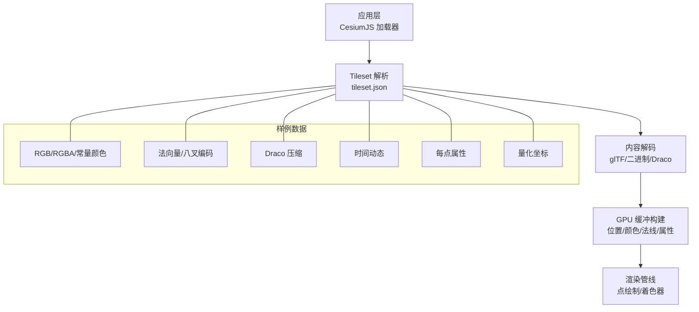
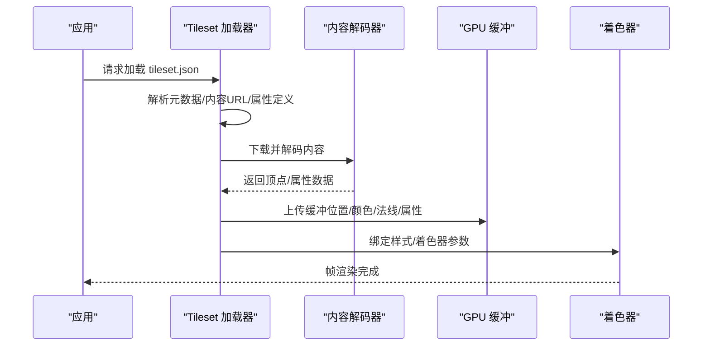
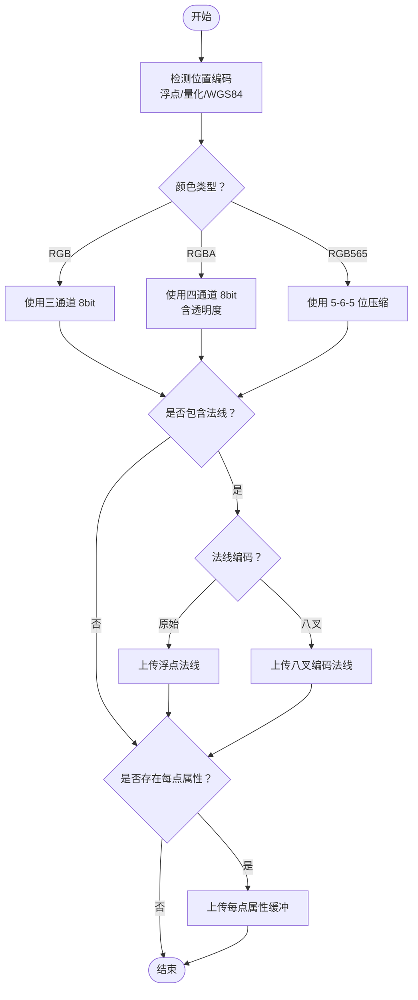
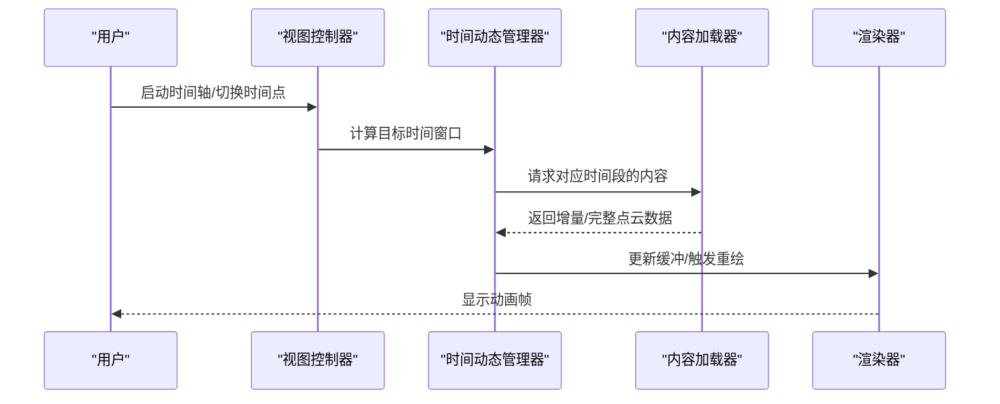
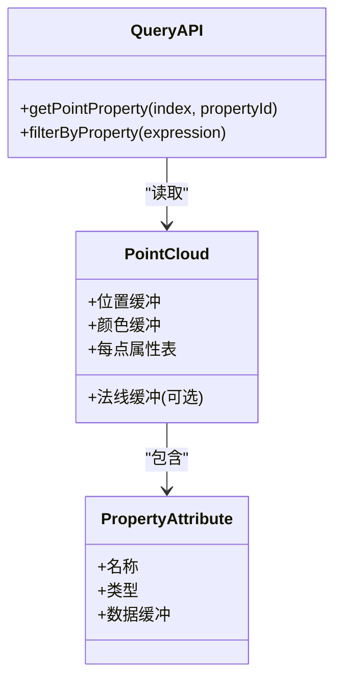
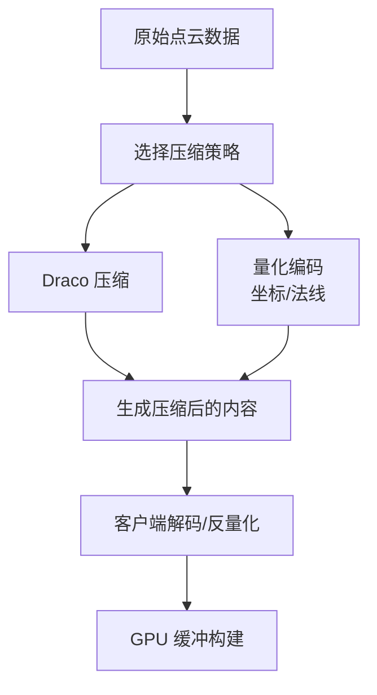
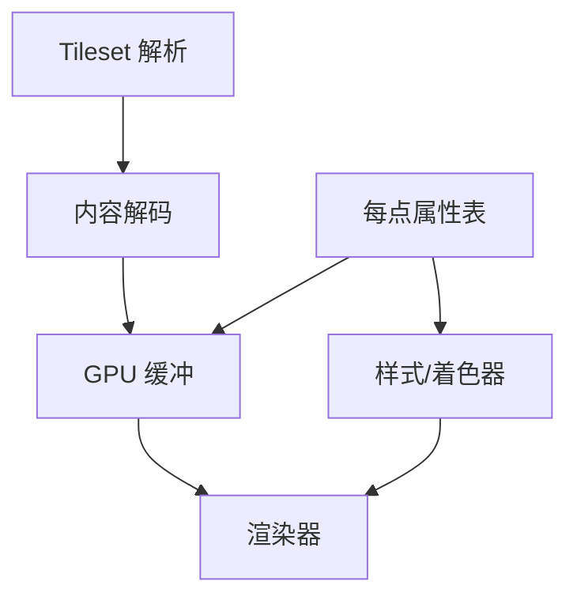

# 点云数据

<cite>
**本文引用的文件**   
- [PointCloudBatched/tileset.json](file://Apps/SampleData/Cesium3DTiles/PointCloud/PointCloudBatched/tileset.json)
- [PointCloudConstantColor/tileset.json](file://Apps/SampleData/Cesium3DTiles/PointCloud/PointCloudConstantColor/tileset.json)
- [PointCloudDraco/tileset.json](file://Apps/SampleData/Cesium3DTiles/PointCloud/PointCloudDraco/tileset.json)
- [PointCloudNormals/tileset.json](file://Apps/SampleData/Cesium3DTiles/PointCloud/PointCloudNormals/tileset.json)
- [PointCloudRGB/tileset.json](file://Apps/SampleData/Cesium3DTiles/PointCloud/PointCloudRGB/tileset.json)
- [PointCloudRGBA/tileset.json](file://Apps/SampleData/Cesium3DTiles/PointCloud/PointCloudRGBA/tileset.json)
- [PointCloudTimeDynamic/tileset.json](file://Apps/SampleData/Cesium3DTiles/PointCloud/PointCloudTimeDynamic/tileset.json)
- [PointCloudWithPerPointProperties/tileset.json](file://Apps/SampleData/Cesium3DTiles/PointCloud/PointCloudWithPerPointProperties/tileset.json)
- [PointCloudQuantized/tileset.json](file://Specs/Data/Cesium3DTiles/PointCloud/PointCloudQuantized/tileset.json)
- [PointCloudQuantizedOctEncoded/tileset.json](file://Specs/Data/Cesium3DTiles/PointCloud/PointCloudQuantizedOctEncoded/tileset.json)
- [PointCloudRGB565/tileset.json](file://Specs/Data/Cesium3DTiles/PointCloud/PointCloudRGB565/tileset.json)
- [PointCloudNormalsOctEncoded/tileset.json](file://Specs/Data/Cesium3DTiles/PointCloud/PointCloudNormalsOctEncoded/tileset.json)
- [PointCloudTimeDynamicDraco/tileset.json](file://Specs/Data/Cesium3DTiles/PointCloud/PointCloudTimeDynamicDraco/tileset.json)
- [PointCloudTimeDynamicWithTransform/tileset.json](file://Specs/Data/Cesium3DTiles/PointCloud/PointCloudTimeDynamicWithTransform/tileset.json)
- [PointCloudWGS84/tileset.json](file://Specs/Data/Cesium3DTiles/PointCloud/PointCloudWGS84/tileset.json)
- [PointCloudWithUnicodePropertyIds/tileset.json](file://Specs/Data/Cesium3DTiles/PointCloud/PointCloudWithUnicodePropertyIds/tileset.json)
- [style.json](file://Apps/SampleData/Cesium3DTiles/Style/style.json)
</cite>

## 目录
1. [简介](#简介)
2. [项目结构](#项目结构)
3. [核心组件](#核心组件)
4. [架构总览](#架构总览)
5. [详细组件分析](#详细组件分析)
6. [依赖关系分析](#依赖关系分析)
7. [性能考虑](#性能考虑)
8. [故障排查指南](#故障排查指南)
9. [结论](#结论)
10. [附录](#附录)

## 简介
本文件面向使用 CesiumJS 的开发者与数据工程师，系统化阐述 3D Tiles 点云（PointCloud）的数据格式、渲染机制与优化策略。内容覆盖：
- 存储格式与属性编码：RGB、RGBA、法向量（含八叉编码）、量化坐标等
- 时间动态点云的实现原理与动画配置
- 每点属性（per-point properties）的数据结构与查询方法
- Draco 压缩与量化编码的使用方式
- tileset.json 配置示例与样式、着色器相关的高级选项
- 大数据量点云的优化策略与性能调优建议

## 项目结构
仓库中包含大量点云样例与测试数据，便于对照理解不同属性与压缩方式的组合。重点目录如下：
- Apps/SampleData/Cesium3DTiles/PointCloud：官方示例点云数据集，涵盖 RGB、RGBA、常量颜色、法向量、Draco 压缩、时间动态、每点属性等
- Specs/Data/Cesium3DTiles/PointCloud：测试用例数据集，包含更多边界与扩展场景，如 RGB565、八叉编码法向量、带变换的时间动态、WGS84 坐标系等
- Apps/SampleData/Cesium3DTiles/Style：样式配置文件示例，用于演示基于样式的点云渲染控制

[无图示来源，因为该图为概念性结构示意]

**章节来源**
- [PointCloudRGB/tileset.json](file://Apps/SampleData/Cesium3DTiles/PointCloud/PointCloudRGB/tileset.json)
- [PointCloudRGBA/tileset.json](file://Apps/SampleData/Cesium3DTiles/PointCloud/PointCloudRGBA/tileset.json)
- [PointCloudNormals/tileset.json](file://Apps/SampleData/Cesium3DTiles/PointCloud/PointCloudNormals/tileset.json)
- [PointCloudDraco/tileset.json](file://Apps/SampleData/Cesium3DTiles/PointCloud/PointCloudDraco/tileset.json)
- [PointCloudTimeDynamic/tileset.json](file://Apps/SampleData/Cesium3DTiles/PointCloud/PointCloudTimeDynamic/tileset.json)
- [PointCloudWithPerPointProperties/tileset.json](file://Apps/SampleData/Cesium3DTiles/PointCloud/PointCloudWithPerPointProperties/tileset.json)
- [PointCloudQuantized/tileset.json](file://Specs/Data/Cesium3DTiles/PointCloud/PointCloudQuantized/tileset.json)
- [PointCloudQuantizedOctEncoded/tileset.json](file://Specs/Data/Cesium3DTiles/PointCloud/PointCloudQuantizedOctEncoded/tileset.json)
- [PointCloudRGB565/tileset.json](file://Specs/Data/Cesium3DTiles/PointCloud/PointCloudRGB565/tileset.json)
- [PointCloudNormalsOctEncoded/tileset.json](file://Specs/Data/Cesium3DTiles/PointCloud/PointCloudNormalsOctEncoded/tileset.json)
- [PointCloudTimeDynamicDraco/tileset.json](file://Specs/Data/Cesium3DTiles/PointCloud/PointCloudTimeDynamicDraco/tileset.json)
- [PointCloudTimeDynamicWithTransform/tileset.json](file://Specs/Data/Cesium3DTiles/PointCloud/PointCloudTimeDynamicWithTransform/tileset.json)
- [PointCloudWGS84/tileset.json](file://Specs/Data/Cesium3DTiles/PointCloud/PointCloudWGS84/tileset.json)
- [PointCloudWithUnicodePropertyIds/tileset.json](file://Specs/Data/Cesium3DTiles/PointCloud/PointCloudWithUnicodePropertyIds/tileset.json)
- [style.json](file://Apps/SampleData/Cesium3DTiles/Style/style.json)

## 核心组件
- 点云几何与属性
  - 位置：通常为浮点或量化整数；支持 WGS84 或局部坐标系
  - 颜色：RGB、RGBA、RGB565 等
  - 法向量：原始浮点或八叉编码（Oct-encoded）
  - 每点属性：任意标量/向量/矩阵等自定义字段
- 压缩与量化
  - Draco 压缩：对顶点属性进行有损/无损压缩，显著减小体积
  - 量化编码：将坐标/法线等映射到较小整型范围，降低带宽与内存占用
- 时间动态
  - 通过时间戳与增量更新实现动画效果
- 样式与着色器
  - 通过样式配置或自定义着色器控制点大小、颜色混合、透明度、法线可视化等

**章节来源**
- [PointCloudRGB/tileset.json](file://Apps/SampleData/Cesium3DTiles/PointCloud/PointCloudRGB/tileset.json)
- [PointCloudRGBA/tileset.json](file://Apps/SampleData/Cesium3DTiles/PointCloud/PointCloudRGBA/tileset.json)
- [PointCloudRGB565/tileset.json](file://Specs/Data/Cesium3DTiles/PointCloud/PointCloudRGB565/tileset.json)
- [PointCloudNormals/tileset.json](file://Apps/SampleData/Cesium3DTiles/PointCloud/PointCloudNormals/tileset.json)
- [PointCloudNormalsOctEncoded/tileset.json](file://Specs/Data/Cesium3DTiles/PointCloud/PointCloudNormalsOctEncoded/tileset.json)
- [PointCloudQuantized/tileset.json](file://Specs/Data/Cesium3DTiles/PointCloud/PointCloudQuantized/tileset.json)
- [PointCloudQuantizedOctEncoded/tileset.json](file://Specs/Data/Cesium3DTiles/PointCloud/PointCloudQuantizedOctEncoded/tileset.json)
- [PointCloudDraco/tileset.json](file://Apps/SampleData/Cesium3DTiles/PointCloud/PointCloudDraco/tileset.json)
- [PointCloudTimeDynamic/tileset.json](file://Apps/SampleData/Cesium3DTiles/PointCloud/PointCloudTimeDynamic/tileset.json)
- [PointCloudTimeDynamicDraco/tileset.json](file://Specs/Data/Cesium3DTiles/PointCloud/PointCloudTimeDynamicDraco/tileset.json)
- [PointCloudWithPerPointProperties/tileset.json](file://Apps/SampleData/Cesium3DTiles/PointCloud/PointCloudWithPerPointProperties/tileset.json)
- [PointCloudWithUnicodePropertyIds/tileset.json](file://Specs/Data/Cesium3DTiles/PointCloud/PointCloudWithUnicodePropertyIds/tileset.json)

## 架构总览
从 tileset.json 到 GPU 渲染的关键流程：
- 解析 tileset.json，确定内容类型、坐标系统、可选压缩与属性定义
- 下载并解码内容（glTF/二进制），必要时执行 Draco 解压与量化反量化
- 构建 GPU 缓冲区（位置、颜色、法线、每点属性）
- 根据样式/着色器进行点绘制，支持透明度混合、法线光照、时间动态插值

[无图示来源，因为该图为概念性流程示意]

## 详细组件分析

### 存储格式与属性编码
- 位置坐标
  - 支持浮点坐标与量化坐标；量化可将大范围坐标映射为较小整型，减少传输与显存占用
  - 支持 WGS84 地理坐标与局部坐标系
- 颜色
  - RGB：三通道 8bit 整数
  - RGBA：四通道 8bit 整数，支持透明度
  - RGB565：更紧凑的颜色编码，适合移动端或带宽受限场景
- 法向量
  - 原始浮点法线
  - 八叉编码（Oct-encoded）：将单位球面法线映射为二维平面坐标，再量化为整型，节省空间
- 每点属性
  - 可定义任意标量、向量、矩阵等属性，支持 Unicode 属性名
  - 常用于分类、强度、反射率等业务语义

**章节来源**
- [PointCloudRGB/tileset.json](file://Apps/SampleData/Cesium3DTiles/PointCloud/PointCloudRGB/tileset.json)
- [PointCloudRGBA/tileset.json](file://Apps/SampleData/Cesium3DTiles/PointCloud/PointCloudRGBA/tileset.json)
- [PointCloudRGB565/tileset.json](file://Specs/Data/Cesium3DTiles/PointCloud/PointCloudRGB565/tileset.json)
- [PointCloudNormals/tileset.json](file://Apps/SampleData/Cesium3DTiles/PointCloud/PointCloudNormals/tileset.json)
- [PointCloudNormalsOctEncoded/tileset.json](file://Specs/Data/Cesium3DTiles/PointCloud/PointCloudNormalsOctEncoded/tileset.json)
- [PointCloudQuantized/tileset.json](file://Specs/Data/Cesium3DTiles/PointCloud/PointCloudQuantized/tileset.json)
- [PointCloudQuantizedOctEncoded/tileset.json](file://Specs/Data/Cesium3DTiles/PointCloud/PointCloudQuantizedOctEncoded/tileset.json)
- [PointCloudWGS84/tileset.json](file://Specs/Data/Cesium3DTiles/PointCloud/PointCloudWGS84/tileset.json)
- [PointCloudWithPerPointProperties/tileset.json](file://Apps/SampleData/Cesium3DTiles/PointCloud/PointCloudWithPerPointProperties/tileset.json)
- [PointCloudWithUnicodePropertyIds/tileset.json](file://Specs/Data/Cesium3DTiles/PointCloud/PointCloudWithUnicodePropertyIds/tileset.json)

### 时间动态点云与动画
- 时间动态点云通过时间戳与增量数据实现动画效果
- 常见模式：
  - 多帧序列：按时间顺序加载多个 tileset 或内容片段
  - 增量更新：在运行时替换或合并部分点集
  - 变换驱动：结合 tile 级变换实现整体移动/旋转
- 动画配置要点：
  - 设置时间范围与播放速率
  - 合理分片与预取，避免卡顿
  - 与 Draco 压缩结合，平衡质量与带宽

**章节来源**
- [PointCloudTimeDynamic/tileset.json](file://Apps/SampleData/Cesium3DTiles/PointCloud/PointCloudTimeDynamic/tileset.json)
- [PointCloudTimeDynamicDraco/tileset.json](file://Specs/Data/Cesium3DTiles/PointCloud/PointCloudTimeDynamicDraco/tileset.json)
- [PointCloudTimeDynamicWithTransform/tileset.json](file://Specs/Data/Cesium3DTiles/PointCloud/PointCloudTimeDynamicWithTransform/tileset.json)

### 每点属性（Per-Point Properties）
- 数据结构
  - 支持标量、向量、矩阵等多种类型
  - 属性名支持 Unicode，便于国际化命名
- 查询方法
  - 通过属性 ID 获取某点的属性值
  - 结合样式表达式或着色器进行条件渲染
- 典型用途
  - 分类标签、强度值、反射率、温度等传感器数据
  - 业务筛选与交互高亮

**章节来源**
- [PointCloudWithPerPointProperties/tileset.json](file://Apps/SampleData/Cesium3DTiles/PointCloud/PointCloudWithPerPointProperties/tileset.json)
- [PointCloudWithUnicodePropertyIds/tileset.json](file://Specs/Data/Cesium3DTiles/PointCloud/PointCloudWithUnicodePropertyIds/tileset.json)

### Draco 压缩与量化编码
- Draco 压缩
  - 对顶点属性进行高效压缩，显著减小网络传输与磁盘占用
  - 可在时间动态场景中配合增量更新，提升首屏速度
- 量化编码
  - 坐标量化：将浮点坐标映射为整型，减少精度损失可控范围内
  - 法线八叉编码：将单位球面法线映射为二维坐标并量化，进一步压缩
- 适用场景
  - 大规模点云（城市级、航空摄影测量）
  - 移动端与弱网环境

**章节来源**
- [PointCloudDraco/tileset.json](file://Apps/SampleData/Cesium3DTiles/PointCloud/PointCloudDraco/tileset.json)
- [PointCloudQuantized/tileset.json](file://Specs/Data/Cesium3DTiles/PointCloud/PointCloudQuantized/tileset.json)
- [PointCloudQuantizedOctEncoded/tileset.json](file://Specs/Data/Cesium3DTiles/PointCloud/PointCloudQuantizedOctEncoded/tileset.json)
- [PointCloudNormalsOctEncoded/tileset.json](file://Specs/Data/Cesium3DTiles/PointCloud/PointCloudNormalsOctEncoded/tileset.json)
- [PointCloudTimeDynamicDraco/tileset.json](file://Specs/Data/Cesium3DTiles/PointCloud/PointCloudTimeDynamicDraco/tileset.json)

### tileset.json 配置示例与高级选项
以下为常用配置项说明（以路径引用代替具体 JSON 内容）：
- 基本结构
  - asset、geometricError、root 等基础字段
- 内容与坐标系统
  - content.url 指向 glTF/二进制/Draco 内容
  - 坐标系统：WGS84 或局部坐标系
- 属性与样式
  - perPointProperties 定义每点属性
  - style 或样式表达式控制点大小、颜色、透明度
- 着色器与高级选项
  - 可通过样式或自定义着色器实现法线可视化、深度处理、混合模式等

参考示例路径：
- 批量点云：[PointCloudBatched/tileset.json](file://Apps/SampleData/Cesium3DTiles/PointCloud/PointCloudBatched/tileset.json)
- 常量颜色：[PointCloudConstantColor/tileset.json](file://Apps/SampleData/Cesium3DTiles/PointCloud/PointCloudConstantColor/tileset.json)
- 颜色与透明度：[PointCloudRGB/tileset.json](file://Apps/SampleData/Cesium3DTiles/PointCloud/PointCloudRGB/tileset.json)、[PointCloudRGBA/tileset.json](file://Apps/SampleData/Cesium3DTiles/PointCloud/PointCloudRGBA/tileset.json)
- 法线与八叉编码：[PointCloudNormals/tileset.json](file://Apps/SampleData/Cesium3DTiles/PointCloud/PointCloudNormals/tileset.json)、[PointCloudNormalsOctEncoded/tileset.json](file://Specs/Data/Cesium3DTiles/PointCloud/PointCloudNormalsOctEncoded/tileset.json)
- 量化与八叉编码：[PointCloudQuantized/tileset.json](file://Specs/Data/Cesium3DTiles/PointCloud/PointCloudQuantized/tileset.json)、[PointCloudQuantizedOctEncoded/tileset.json](file://Specs/Data/Cesium3DTiles/PointCloud/PointCloudQuantizedOctEncoded/tileset.json)
- 时间动态与变换：[PointCloudTimeDynamic/tileset.json](file://Apps/SampleData/Cesium3DTiles/PointCloud/PointCloudTimeDynamic/tileset.json)、[PointCloudTimeDynamicWithTransform/tileset.json](file://Specs/Data/Cesium3DTiles/PointCloud/PointCloudTimeDynamicWithTransform/tileset.json)
- 每点属性与 Unicode 属性名：[PointCloudWithPerPointProperties/tileset.json](file://Apps/SampleData/Cesium3DTiles/PointCloud/PointCloudWithPerPointProperties/tileset.json)、[PointCloudWithUnicodePropertyIds/tileset.json](file://Specs/Data/Cesium3DTiles/PointCloud/PointCloudWithUnicodePropertyIds/tileset.json)
- 样式配置示例：[style.json](file://Apps/SampleData/Cesium3DTiles/Style/style.json)

**章节来源**
- [PointCloudBatched/tileset.json](file://Apps/SampleData/Cesium3DTiles/PointCloud/PointCloudBatched/tileset.json)
- [PointCloudConstantColor/tileset.json](file://Apps/SampleData/Cesium3DTiles/PointCloud/PointCloudConstantColor/tileset.json)
- [PointCloudRGB/tileset.json](file://Apps/SampleData/Cesium3DTiles/PointCloud/PointCloudRGB/tileset.json)
- [PointCloudRGBA/tileset.json](file://Apps/SampleData/Cesium3DTiles/PointCloud/PointCloudRGBA/tileset.json)
- [PointCloudNormals/tileset.json](file://Apps/SampleData/Cesium3DTiles/PointCloud/PointCloudNormals/tileset.json)
- [PointCloudQuantized/tileset.json](file://Specs/Data/Cesium3DTiles/PointCloud/PointCloudQuantized/tileset.json)
- [PointCloudQuantizedOctEncoded/tileset.json](file://Specs/Data/Cesium3DTiles/PointCloud/PointCloudQuantizedOctEncoded/tileset.json)
- [PointCloudNormalsOctEncoded/tileset.json](file://Specs/Data/Cesium3DTiles/PointCloud/PointCloudNormalsOctEncoded/tileset.json)
- [PointCloudTimeDynamic/tileset.json](file://Apps/SampleData/Cesium3DTiles/PointCloud/PointCloudTimeDynamic/tileset.json)
- [PointCloudTimeDynamicWithTransform/tileset.json](file://Specs/Data/Cesium3DTiles/PointCloud/PointCloudTimeDynamicWithTransform/tileset.json)
- [PointCloudWithPerPointProperties/tileset.json](file://Apps/SampleData/Cesium3DTiles/PointCloud/PointCloudWithPerPointProperties/tileset.json)
- [PointCloudWithUnicodePropertyIds/tileset.json](file://Specs/Data/Cesium3DTiles/PointCloud/PointCloudWithUnicodePropertyIds/tileset.json)
- [style.json](file://Apps/SampleData/Cesium3DTiles/Style/style.json)

## 依赖关系分析
- 组件耦合
  - Tileset 解析与内容解码紧密耦合，需保证属性定义与缓冲构建一致
  - 样式/着色器与属性表存在间接依赖，需在样式表达式中正确引用属性名
- 外部依赖
  - Draco 解码模块
  - WebGL/WebGPU 渲染后端
- 潜在循环依赖
  - 应避免在样式计算中反向依赖渲染状态，防止循环调用

[无图示来源，因为该图为概念性依赖示意]

## 性能考虑
- 数据层面
  - 优先使用 Draco 压缩与量化编码，降低带宽与显存占用
  - 合理分块与 LOD，避免一次性加载过多点
- 渲染层面
  - 启用深度测试与剔除，减少透明点重叠开销
  - 控制点大小与采样密度，平衡视觉质量与帧率
- 时间动态
  - 增量更新优于全量替换
  - 预取下一时间段内容，平滑过渡
- 移动端优化
  - 使用 RGB565 与八叉编码法线
  - 限制同时可见点数与纹理/属性数量

[本节提供通用指导，不直接分析具体文件]

## 故障排查指南
- 常见问题
  - 颜色异常：检查颜色类型（RGB/RGBA/RGB565）与 alpha 混合设置
  - 法线错误：确认是否为八叉编码，并在着色器中正确反量化
  - 属性缺失：核对属性名与类型，确保样式表达式引用正确
  - 时间动态卡顿：检查增量数据大小与预取策略
- 定位步骤
  - 打开浏览器开发者工具，查看网络请求与解码耗时
  - 使用 GPU 调试工具检查缓冲上传与着色器参数
  - 逐步关闭属性与样式，定位瓶颈

**章节来源**
- [PointCloudRGB/tileset.json](file://Apps/SampleData/Cesium3DTiles/PointCloud/PointCloudRGB/tileset.json)
- [PointCloudRGBA/tileset.json](file://Apps/SampleData/Cesium3DTiles/PointCloud/PointCloudRGBA/tileset.json)
- [PointCloudNormalsOctEncoded/tileset.json](file://Specs/Data/Cesium3DTiles/PointCloud/PointCloudNormalsOctEncoded/tileset.json)
- [PointCloudWithPerPointProperties/tileset.json](file://Apps/SampleData/Cesium3DTiles/PointCloud/PointCloudWithPerPointProperties/tileset.json)
- [PointCloudTimeDynamicDraco/tileset.json](file://Specs/Data/Cesium3DTiles/PointCloud/PointCloudTimeDynamicDraco/tileset.json)

## 结论
点云数据在 CesiumJS 中具备丰富的属性与压缩能力，结合样式与着色器可实现高度定制化的可视化效果。通过 Draco 压缩、量化编码、时间动态与合理的分块策略，可以在大数据量场景下获得良好的性能与用户体验。建议在工程实践中优先采用标准化配置与样例数据作为基线，逐步引入高级特性并进行性能验证。

[本节为总结性内容，不直接分析具体文件]

## 附录
- 术语
  - 量化编码：将连续数值映射为离散整型的编码方式
  - 八叉编码：将单位球面法线映射为二维平面的编码方式
  - 每点属性：附加于每个点的结构化数据
- 参考样例
  - 颜色与透明度：[PointCloudRGB/tileset.json](file://Apps/SampleData/Cesium3DTiles/PointCloud/PointCloudRGB/tileset.json)、[PointCloudRGBA/tileset.json](file://Apps/SampleData/Cesium3DTiles/PointCloud/PointCloudRGBA/tileset.json)
  - 法线与八叉编码：[PointCloudNormals/tileset.json](file://Apps/SampleData/Cesium3DTiles/PointCloud/PointCloudNormals/tileset.json)、[PointCloudNormalsOctEncoded/tileset.json](file://Specs/Data/Cesium3DTiles/PointCloud/PointCloudNormalsOctEncoded/tileset.json)
  - 量化与八叉编码：[PointCloudQuantized/tileset.json](file://Specs/Data/Cesium3DTiles/PointCloud/PointCloudQuantized/tileset.json)、[PointCloudQuantizedOctEncoded/tileset.json](file://Specs/Data/Cesium3DTiles/PointCloud/PointCloudQuantizedOctEncoded/tileset.json)
  - 时间动态与变换：[PointCloudTimeDynamic/tileset.json](file://Apps/SampleData/Cesium3DTiles/PointCloud/PointCloudTimeDynamic/tileset.json)、[PointCloudTimeDynamicWithTransform/tileset.json](file://Specs/Data/Cesium3DTiles/PointCloud/PointCloudTimeDynamicWithTransform/tileset.json)
  - 每点属性与 Unicode 属性名：[PointCloudWithPerPointProperties/tileset.json](file://Apps/SampleData/Cesium3DTiles/PointCloud/PointCloudWithPerPointProperties/tileset.json)、[PointCloudWithUnicodePropertyIds/tileset.json](file://Specs/Data/Cesium3DTiles/PointCloud/PointCloudWithUnicodePropertyIds/tileset.json)
  - 样式配置示例：[style.json](file://Apps/SampleData/Cesium3DTiles/Style/style.json)