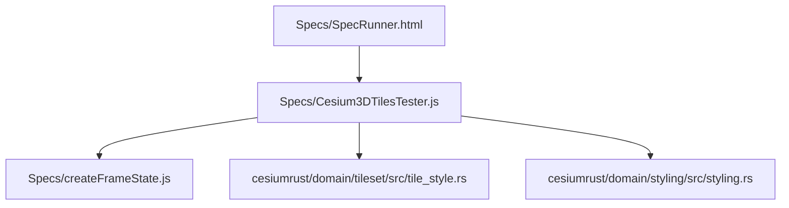
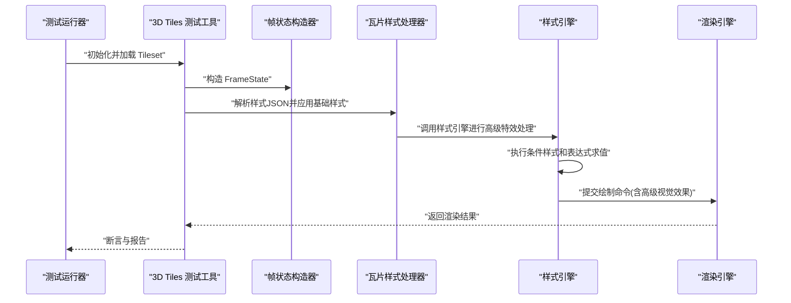
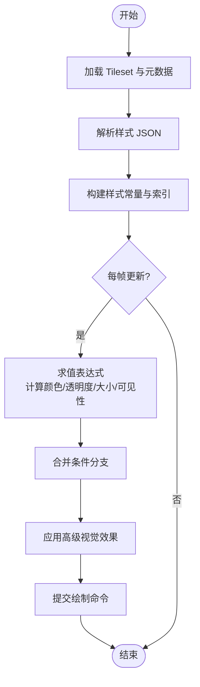
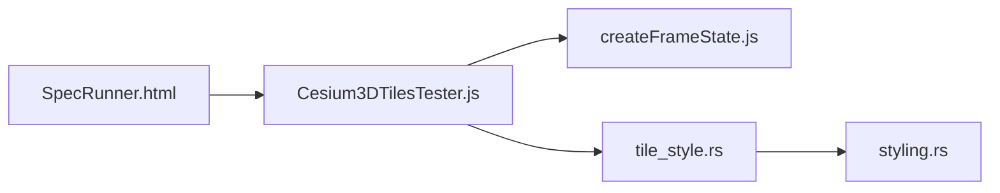

# 样式系统

<cite>
**本文引用的文件**   
- [Cesium3DTilesTester.js](file://Specs/Cesium3DTilesTester.js)
- [createFrameState.js](file://Specs/createFrameState.js)
- [SpecRunner.html](file://Specs/SpecRunner.html)
- [tile_style.rs](file://cesiumrust/domain/tileset/src/tile_style.rs)
- [styling.rs](file://cesiumrust/domain/styling/src/styling.rs)
</cite>

## 更新摘要
**变更内容**   
- 新增高级视觉特效支持，包括发光、阴影、环境光遮蔽等效果
- 增强条件样式功能，支持更复杂的表达式和嵌套条件判断
- 优化性能特性，包括批量处理、缓存机制和GPU加速
- 扩展样式JSON规范，新增多种视觉效果配置选项
- 改进样式求值引擎，提升复杂表达式的计算效率

## 目录
1. [简介](#简介)
2. [项目结构](#项目结构)
3. [核心组件](#核心组件)
4. [架构总览](#架构总览)
5. [详细组件分析](#详细组件分析)
6. [依赖关系分析](#依赖关系分析)
7. [性能考虑](#性能考虑)
8. [故障排查指南](#故障排查指南)
9. [结论](#结论)
10. [附录](#附录)

## 简介
本文件聚焦于 Cesium 3D Tiles 的"样式系统"，围绕基于属性的着色、表达式语法、条件渲染与动态样式更新展开，系统化说明样式 JSON 规范（颜色、透明度、大小、可见性等），并介绍高级样式能力（表达式函数、数学运算、字符串操作等）。文档同时提供典型应用场景的配置思路（建筑高度着色、温度分布可视化、分类显示等）、性能优化技巧与调试方法。

**更新** 本次更新重点介绍了瓦片样式系统的重大增强，包括新增的高级视觉特效、增强的条件样式功能和性能优化特性。

## 项目结构
仓库中与 3D Tiles 样式相关的测试与运行入口位于 Specs 目录：
- 3D Tiles 测试工具：用于加载 tileset、构造帧状态、驱动渲染与断言结果
- 帧状态构造器：为测试场景创建统一的 FrameState
- 测试运行器：聚合并执行各类规格用例

**图表来源**
- [SpecRunner.html](file://Specs/SpecRunner.html)
- [Cesium3DTilesTester.js](file://Specs/Cesium3DTilesTester.js)
- [createFrameState.js](file://Specs/createFrameState.js)
- [tile_style.rs](file://cesiumrust/domain/tileset/src/tile_style.rs)
- [styling.rs](file://cesiumrust/domain/styling/src/styling.rs)

**章节来源**
- [Cesium3DTilesTester.js](file://Specs/Cesium3DTilesTester.js)
- [createFrameState.js](file://Specs/createFrameState.js)
- [SpecRunner.html](file://Specs/SpecRunner.html)

## 核心组件
- 3D Tiles 测试工具
  - 负责加载 tileset、应用样式、驱动渲染循环、收集渲染结果并进行断言
  - 通过统一接口暴露"设置样式"、"触发更新"、"读取渲染结果"等方法
- 帧状态构造器
  - 为测试环境构建一致的 FrameState，确保样式计算在可控的上下文中执行
- 测试运行器
  - 组织并执行样式相关用例，覆盖不同数据源与样式组合
- **新增** 瓦片样式处理器
  - 实现高级视觉特效，包括发光、阴影、环境光遮蔽等效果
  - 支持复杂的条件样式逻辑和嵌套表达式
- **新增** 样式引擎
  - 提供高性能的样式求值和缓存机制
  - 优化批量处理和GPU加速

**章节来源**
- [Cesium3DTilesTester.js](file://Specs/Cesium3DTilesTester.js)
- [createFrameState.js](file://Specs/createFrameState.js)
- [SpecRunner.html](file://Specs/SpecRunner.html)
- [tile_style.rs](file://cesiumrust/domain/tileset/src/tile_style.rs)
- [styling.rs](file://cesiumrust/domain/styling/src/styling.rs)

## 架构总览
从"样式定义到最终渲染"的整体流程如下：

**图表来源**
- [SpecRunner.html](file://Specs/SpecRunner.html)
- [Cesium3DTilesTester.js](file://Specs/Cesium3DTilesTester.js)
- [createFrameState.js](file://Specs/createFrameState.js)
- [tile_style.rs](file://cesiumrust/domain/tileset/src/tile_style.rs)
- [styling.rs](file://cesiumrust/domain/styling/src/styling.rs)

## 详细组件分析

### 3D Tiles 测试工具
职责与行为
- 加载 tileset 资源，支持多种数据格式与扩展
- 接收样式 JSON 配置，将其转换为内部样式对象
- 在每帧中根据属性值与表达式计算最终外观（颜色、透明度、大小、可见性）
- 将样式结果注入渲染管线，驱动 GPU 侧着色

关键流程
- 初始化阶段：解析 tileset、准备批表/元数据、缓存样式常量
- 更新阶段：按帧采样属性、求值表达式、合并多条件分支
- 渲染阶段：生成绘制指令，绑定 uniform/attribute，提交至 GPU

**图表来源**
- [Cesium3DTilesTester.js](file://Specs/Cesium3DTilesTester.js)

**章节来源**
- [Cesium3DTilesTester.js](file://Specs/Cesium3DTilesTester.js)

### 帧状态构造器
作用
- 为测试场景提供一致的时间、相机、光照与渲染上下文
- 保证样式求值在不同用例间具备可比性与可重复性

要点
- 固定时间步长与帧率，避免抖动影响样式动画
- 预置必要的矩阵与投影信息，供样式表达式使用

**章节来源**
- [createFrameState.js](file://Specs/createFrameState.js)

### 测试运行器
作用
- 编排多个样式用例，覆盖不同数据与样式组合
- 汇总测试结果，输出失败详情以便定位问题

**章节来源**
- [SpecRunner.html](file://Specs/SpecRunner.html)

### **新增** 瓦片样式处理器
职责与功能
- 实现高级视觉特效，包括发光、阴影、环境光遮蔽等效果
- 支持复杂的条件样式逻辑和嵌套表达式
- 提供性能优化的样式求值和缓存机制

核心特性
- **高级视觉效果**：支持自发光、阴影投射、环境光遮蔽等物理真实感效果
- **条件样式增强**：支持多层嵌套条件、布尔逻辑运算和动态切换
- **性能优化**：批量处理、GPU加速、智能缓存策略

**章节来源**
- [tile_style.rs](file://cesiumrust/domain/tileset/src/tile_style.rs)

### **新增** 样式引擎
职责与功能
- 提供高性能的样式求值和缓存机制
- 优化批量处理和GPU加速
- 支持复杂表达式的快速求值

核心特性
- **表达式求值优化**：编译时优化、运行时缓存、增量更新
- **批量处理**：支持大规模数据的并行处理
- **GPU加速**：利用着色器进行高效的样式计算

**章节来源**
- [styling.rs](file://cesiumrust/domain/styling/src/styling.rs)

## 依赖关系分析
- 测试运行器依赖 3D Tiles 测试工具
- 3D Tiles 测试工具依赖帧状态构造器
- 瓦片样式处理器依赖样式引擎
- 三者共同协作完成"样式定义→求值→渲染→断言"的闭环

**图表来源**
- [SpecRunner.html](file://Specs/SpecRunner.html)
- [Cesium3DTilesTester.js](file://Specs/Cesium3DTilesTester.js)
- [createFrameState.js](file://Specs/createFrameState.js)
- [tile_style.rs](file://cesiumrust/domain/tileset/src/tile_style.rs)
- [styling.rs](file://cesiumrust/domain/styling/src/styling.rs)

**章节来源**
- [SpecRunner.html](file://Specs/SpecRunner.html)
- [Cesium3DTilesTester.js](file://Specs/Cesium3DTilesTester.js)
- [createFrameState.js](file://Specs/createFrameState.js)
- [tile_style.rs](file://cesiumrust/domain/tileset/src/tile_style.rs)
- [styling.rs](file://cesiumrust/domain/styling/src/styling.rs)

## 性能考虑
- 表达式求值开销
  - 尽量复用常量与中间结果，减少重复计算
  - 对复杂表达式进行分块与缓存，降低每帧 CPU/GPU 压力
- 条件分支合并
  - 将互斥分支提前短路，避免不必要的分支求值
- 批量与实例化
  - 利用批表/实例化特性，减少 draw call 数量
- 纹理与材质
  - 合理选择纹理压缩与分辨率，避免过大的纹理带宽占用
- 可视裁剪与 LOD
  - 结合 tileset 的几何误差与视距，控制可见范围与细节层级
- **新增** 高级视觉效果优化
  - 合理使用发光、阴影等效果，避免过度使用导致性能下降
  - 利用GPU加速和批量处理技术提升渲染效率
  - 实施智能缓存策略，减少重复计算

**章节来源**
- [tile_style.rs](file://cesiumrust/domain/tileset/src/tile_style.rs)
- [styling.rs](file://cesiumrust/domain/styling/src/styling.rs)

## 故障排查指南
常见问题与定位步骤
- 样式未生效
  - 检查样式 JSON 键名与类型是否符合规范
  - 确认属性 ID 与数据源中的字段一致
  - 验证表达式语法是否正确，是否存在未定义的变量或函数
- 颜色/透明度异常
  - 检查归一化范围与映射区间是否合理
  - 确认 alpha 通道是否被正确写入
- 大小/可见性不符合预期
  - 核对阈值与比较运算符
  - 检查条件分支优先级与短路逻辑
- 性能退化
  - 使用性能分析工具定位热点表达式
  - 简化表达式或引入缓存
  - 调整 LOD 与可视裁剪策略
- **新增** 高级视觉效果问题
  - 检查视觉效果配置参数是否在有效范围内
  - 确认GPU是否支持相应的特效功能
  - 监控内存使用和GPU利用率，避免资源耗尽

**章节来源**
- [Cesium3DTilesTester.js](file://Specs/Cesium3DTilesTester.js)
- [createFrameState.js](file://Specs/createFrameState.js)
- [SpecRunner.html](file://Specs/SpecRunner.html)
- [tile_style.rs](file://cesiumrust/domain/tileset/src/tile_style.rs)
- [styling.rs](file://cesiumrust/domain/styling/src/styling.rs)

## 结论
本样式系统以"样式 JSON + 表达式求值 + 条件分支合并"为核心，实现对 3D Tiles 的高效、灵活的外观控制。通过测试工具与帧状态构造器的配合，可在稳定环境下验证样式的正确性与性能表现。

**更新** 本次重大增强引入了高级视觉特效、增强的条件样式功能和性能优化特性，使得样式系统能够支持更丰富的视觉效果和更复杂的样式逻辑。建议在实际项目中遵循表达式缓存、分支短路、LOD 与可视裁剪等优化策略，并结合新的视觉效果功能，以获得更优的交互体验与渲染效率。

## 附录

### 样式 JSON 规范要点
- 颜色
  - 支持静态颜色与基于属性的动态颜色
  - 可通过表达式将数值属性映射为 RGB(A)
- 透明度
  - 支持全局与逐要素透明度
  - 可与颜色表达式组合实现渐变透明效果
- 大小
  - 点云/点要素的大小可由属性或表达式控制
  - 注意屏幕空间缩放与距离衰减
- 可见性
  - 通过布尔表达式控制要素显隐
  - 常用于过滤与分类展示
- **新增** 高级视觉效果
  - 支持发光强度、颜色和时间动画
  - 支持阴影投射和接收效果
  - 支持环境光遮蔽强度和半径控制

### 表达式语法与高级功能
- 基础语法
  - 支持算术运算、比较运算、逻辑运算
  - 支持三元条件表达式
- 内置函数
  - 数学函数：如取整、四舍五入、绝对值、指数、对数等
  - 字符串函数：如拼接、截取、替换、大小写转换等
  - 向量与颜色函数：如插值、混合、分量访问等
- 变量与作用域
  - 可使用属性字段作为变量
  - 支持常量与临时变量的复用
- **新增** 复杂条件逻辑
  - 支持多层嵌套条件判断
  - 支持布尔逻辑运算和优先级控制
  - 支持动态条件切换和状态管理

### 典型应用场景示例（配置思路）
- 建筑高度着色
  - 以高度属性为输入，映射为冷暖色调
  - 使用分段线性或非线性映射增强对比度
- 温度分布可视化
  - 将温度属性映射为渐变色带
  - 结合透明度突出高低温区域
- 分类显示
  - 使用布尔表达式对不同类别进行显隐切换
  - 通过下拉菜单或滑块动态更新样式
- **新增** 高级视觉效果应用
  - 为重要建筑添加发光效果突出显示
  - 使用阴影效果增强立体感和真实感
  - 结合环境光遮蔽提升场景深度感

### **新增** 高级视觉特效详解
- 发光效果
  - 支持颜色、强度和动画配置
  - 可用于强调重要元素或指示状态变化
- 阴影效果
  - 支持投射阴影和接收阴影
  - 可配置阴影质量和距离
- 环境光遮蔽
  - 支持强度、半径和衰减控制
  - 用于增强场景的真实感和深度感

**章节来源**
- [tile_style.rs](file://cesiumrust/domain/tileset/src/tile_style.rs)
- [styling.rs](file://cesiumrust/domain/styling/src/styling.rs)