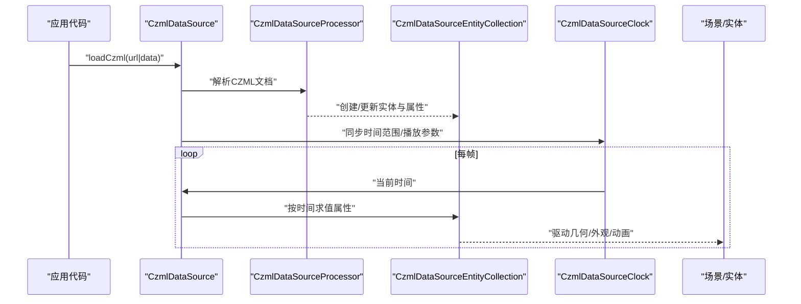
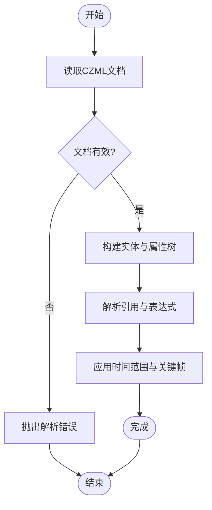
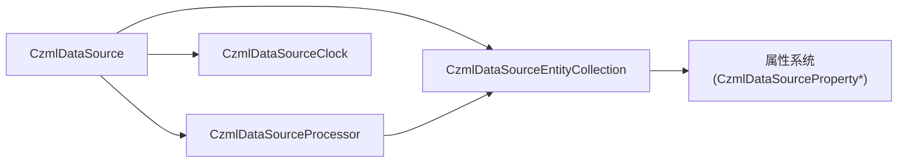

# CzmlDataSource

<cite>
**本文引用的文件**
- [CzmlDataSource.js](file://Source/Core/CzmlDataSource.js)
- [CzmlDataSourceClock.js](file://Source/Core/CzmlDataSourceClock.js)
- [CzmlDataSourceProcessor.js](file://Source/Core/CzmlDataSourceProcessor.js)
- [CzmlDataSourceEntityCollection.js](file://Source/Core/CzmlDataSourceEntityCollection.js)
- [CzmlDataSourcePropertyBag.js](file://Source/Core/CzmlDataSourcePropertyBag.js)
- [CzmlDataSourcePropertyMap.js](file://Source/Core/CzmlDataSourcePropertyMap.js)
- [CzmlDataSourcePropertyArray.js](file://Source/Core/CzmlDataSourcePropertyArray.js)
- [CzmlDataSourcePropertyReference.js](file://Source/Core/CzmlDataSourcePropertyReference.js)
- [CzmlDataSourcePropertyExpression.js](file://Source/Core/CzmlDataSourcePropertyExpression.js)
- [CzmlDataSourcePropertyFunction.js](file://Source/Core/CzmlDataSourcePropertyFunction.js)
- [CzmlDataSourcePropertySampler.js](file://Source/Core/CzmlDataSourcePropertySampler.js)
- [CzmlDataSourcePropertyInterpolator.js](file://Source/Core/CzmlDataSourcePropertyInterpolator.js)
- [CzmlDataSourcePropertyTimeline.js](file://Source/Core/CzmlDataSourcePropertyTimeline.js)
- [CzmlDataSourcePropertyKeyframe.js](file://Source/Core/CzmlDataSourcePropertyKeyframe.js)
- [CzmlDataSourcePropertyConstant.js](file://Source/Core/CzmlDataSourcePropertyConstant.js)
- [CzmlDataSourcePropertyComposite.js](file://Source/Core/CzmlDataSourcePropertyComposite.js)
- [CzmlDataSourcePropertyDiscrete.js](file://Source/Core/CzmlDataSourcePropertyDiscrete.js)
- [CzmlDataSourcePropertyLinear.js](file://Source/Core/CzmlDataSourcePropertyLinear.js)
- [CzmlDataSourcePropertyStep.js](file://Source/Core/CzmlDataSourcePropertyStep.js)
- [CzmlDataSourcePropertyCurve.js](file://Source/Core/CzmlDataSourcePropertyCurve.js)
- [CzmlDataSourcePropertyCatmullRom.js](file://Source/Core/CzmlDataSourcePropertyCatmullRom.js)
- [CzmlDataSourcePropertyHermite.js](file://Source/Core/CzmlDataSourcePropertyHermite.js)
- [CzmlDataSourcePropertySpline.js](file://Source/Core/CzmlDataSourcePropertySpline.js)
- [CzmlDataSourcePropertyQuaternion.js](file://Source/Core/CzmlDataSourcePropertyQuaternion.js)
- [CzmlDataSourcePropertyCartesian.js](file://Source/Core/CzmlDataSourcePropertyCartesian.js)
- [CzmlDataSourcePropertyColor.js](file://Source/Core/CzmlDataSourcePropertyColor.js)
- [CzmlDataSourcePropertyBoolean.js](file://Source/Core/CzmlDataSourcePropertyBoolean.js)
- [CzmlDataSourcePropertyNumber.js](file://Source/Core/CzmlDataSourcePropertyNumber.js)
- [CzmlDataSourcePropertyString.js](file://Source/Core/CzmlDataSourcePropertyString.js)
- [CzmlDataSourcePropertyUrl.js](file://Source/Core/CzmlDataSourcePropertyUrl.js)
- [CzmlDataSourcePropertyImage.js](file://Source/Core/CzmlDataSourcePropertyImage.js)
- [CzmlDataSourcePropertyMaterial.js](file://Source/Core/CzmlDataSourcePropertyMaterial.js)
- [CzmlDataSourcePropertyModel.js](file://Source/Core/CzmlDataSourcePropertyModel.js)
- [CzmlDataSourcePropertyPath.js](file://Source/Core/CzmlDataSourcePropertyPath.js)
- [CzmlDataSourcePropertyLabel.js](file://Source/Core/CzmlDataSourcePropertyLabel.js)
- [CzmlDataSourcePropertyBillboard.js](file://Source/Core/CzmlDataSourcePropertyBillboard.js)
- [CzmlDataSourcePropertyPolygon.js](file://Source/Core/CzmlDataSourcePropertyPolygon.js)
- [CzmlDataSourcePropertyPolyline.js](file://Source/Core/CzmlDataSourcePropertyPolyline.js)
- [CzmlDataSourcePropertyPoint.js](file://Source/Core/CzmlDataSourcePropertyPoint.js)
- [CzmlDataSourcePropertyEllipsoid.js](file://Source/Core/CzmlDataSourcePropertyEllipsoid.js)
- [CzmlDataSourcePropertyBox.js](file://Source/Core/CzmlDataSourcePropertyBox.js)
- [CzmlDataSourcePropertyCylinder.js](file://Source/Core/CzmlDataSourcePropertyCylinder.js)
- [CzmlDataSourcePropertyCorridor.js](file://Source/Core/CzmlDataSourcePropertyCorridor.js)
- [CzmlDataSourcePropertyRectangle.js](file://Source/Core/CzmlDataSourcePropertyRectangle.js)
- [CzmlDataSourcePropertyWall.js](file://Source/Core/CzmlDataSourcePropertyWall.js)
- [CzmlDataSourcePropertyCone.js](file://Source/Core/CzmlDataSourcePropertyCone.js)
- [CzmlDataSourcePropertySphere.js](file://Source/Core/CzmlDataSourcePropertySphere.js)
- [CzmlDataSourcePropertyPlane.js](file://Source/Core/CzmlDataSourcePropertyPlane.js)
- [CzmlDataSourcePropertyArcType.js](file://Source/Core/CzmlDataSourcePropertyArcType.js)
- [CzmlDataSourcePropertyHeightReference.js](file://Source/Core/CzmlDataSourcePropertyHeightReference.js)
- [CzmlDataSourcePropertyShow.js](file://Source/Core/CzmlDataSourcePropertyShow.js)
- [CzmlDataSourcePropertyOrientation.js](file://Source/Core/CzmlDataSourcePropertyOrientation.js)
- [CzmlDataSourcePropertyPosition.js](file://Source/Core/CzmlDataSourcePropertyPosition.js)
- [CzmlDataSourcePropertyScale.js](file://Source/Core/CzmlDataSourcePropertyScale.js)
- [CzmlDataSourcePropertyRotation.js](file://Source/Core/CzmlDataSourcePropertyRotation.js)
- [CzmlDataSourcePropertyTranslation.js](file://Source/Core/CzmlDataSourcePropertyTranslation.js)
- [CzmlDataSourcePropertyMatrix.js](file://Source/Core/CzmlDataSourcePropertyMatrix.js)
- [CzmlDataSourcePropertyQuaternion.js](file://Source/Core/CzmlDataSourcePropertyQuaternion.js)
- [CzmlDataSourcePropertyVector3.js](file://Source/Core/CzmlDataSourcePropertyVector3.js)
- [CzmlDataSourcePropertyVector2.js](file://Source/Core/CzmlDataSourcePropertyVector2.js)
- [CzmlDataSourcePropertyScalar.js](file://Source/Core/CzmlDataSourcePropertyScalar.js)
- [CzmlDataSourcePropertyEnum.js](file://Source/Core/CzmlDataSourcePropertyEnum.js)
- [CzmlDataSourcePropertyJson.js](file://Source/Core/CzmlDataSourcePropertyJson.js)
- [CzmlDataSourcePropertyRaw.js](file://Source/Core/CzmlDataSourcePropertyRaw.js)
- [CzmlDataSourcePropertyDynamic.js](file://Source/Core/CzmlDataSourcePropertyDynamic.js)
- [CzmlDataSourcePropertyStatic.js](file://Source/Core/CzmlDataSourcePropertyStatic.js)
- [CzmlDataSourcePropertyProvider.js](file://Source/Core/CzmlDataSourcePropertyProvider.js)
- [CzmlDataSourcePropertySampled.js](file://Source/Core/CzmlDataSourcePropertySampled.js)
- [CzmlDataSourcePropertyInterpolated.js](file://Source/Core/CzmlDataSourcePropertyInterpolated.js)
- [CzmlDataSourcePropertyConstant.js](file://Source/Core/CzmlDataSourcePropertyConstant.js)
- [CzmlDataSourcePropertyComposite.js](file://Source/Core/CzmlDataSourcePropertyComposite.js)
- [CzmlDataSourcePropertyDiscrete.js](file://Source/Core/CzmlDataSourcePropertyDiscrete.js)
- [CzmlDataSourcePropertyLinear.js](file://Source/Core/CzmlDataSourcePropertyLinear.js)
- [CzmlDataSourcePropertyStep.js](file://Source/Core/CzmlDataSourcePropertyStep.js)
- [CzmlDataSourcePropertyCurve.js](file://Source/Core/CzmlDataSourcePropertyCurve.js)
- [CzmlDataSourcePropertyCatmullRom.js](file://Source/Core/CzmlDataSourcePropertyCatmullRom.js)
- [CzmlDataSourcePropertyHermite.js](file://Source/Core/CzmlDataSourcePropertyHermite.js)
- [CzmlDataSourcePropertySpline.js](file://Source/Core/CzmlDataSourcePropertySpline.js)
- [CzmlDataSourcePropertyQuaternion.js](file://Source/Core/CzmlDataSourcePropertyQuaternion.js)
- [CzmlDataSourcePropertyCartesian.js](file://Source/Core/CzmlDataSourcePropertyCartesian.js)
- [CzmlDataSourcePropertyColor.js](file://Source/Core/CzmlDataSourcePropertyColor.js)
- [CzmlDataSourcePropertyBoolean.js](file://Source/Core/CzmlDataSourcePropertyBoolean.js)
- [CzmlDataSourcePropertyNumber.js](file://Source/Core/CzmlDataSourcePropertyNumber.js)
- [CzmlDataSourcePropertyString.js](file://Source/Core/CzmlDataSourcePropertyString.js)
- [CzmlDataSourcePropertyUrl.js](file://Source/Core/CzmlDataSourcePropertyUrl.js)
- [CzmlDataSourcePropertyImage.js](file://Source/Core/CzmlDataSourcePropertyImage.js)
- [CzmlDataSourcePropertyMaterial.js](file://Source/Core/CzmlDataSourcePropertyMaterial.js)
- [CzmlDataSourcePropertyModel.js](file://Source/Core/CzmlDataSourcePropertyModel.js)
- [CzmlDataSourcePropertyPath.js](file://Source/Core/CzmlDataSourcePropertyPath.js)
- [CzmlDataSourcePropertyLabel.js](file://Source/Core/CzmlDataSourcePropertyLabel.js)
- [CzmlDataSourcePropertyBillboard.js](file://Source/Core/CzmlDataSourcePropertyBillboard.js)
- [CzmlDataSourcePropertyPolygon.js](file://Source/Core/CzmlDataSourcePropertyPolygon.js)
- [CzmlDataSourcePropertyPolyline.js](file://Source/Core/CzmlDataSourcePropertyPolyline.js)
- [CzmlDataSourcePropertyPoint.js](file://Source/Core/CzmlDataSourcePropertyPoint.js)
- [CzmlDataSourcePropertyEllipsoid.js](file://Source/Core/CzmlDataSourcePropertyEllipsoid.js)
- [CzmlDataSourcePropertyBox.js](file://Source/Core/CzmlDataSourcePropertyBox.js)
- [CzmlDataSourcePropertyCylinder.js](file://Source/Core/CzmlDataSourcePropertyCylinder.js)
- [CzmlDataSourcePropertyCorridor.js](file://Source/Core/CzmlDataSourcePropertyCorridor.js)
- [CzmlDataSourcePropertyRectangle.js](file://Source/Core/CzmlDataSourcePropertyRectangle.js)
- [CzmlDataSourcePropertyWall.js](file://Source/Core/CzmlDataSourcePropertyWall.js)
- [CzmlDataSourcePropertyCone.js](file://Source/Core/CzmlDataSourcePropertyCone.js)
- [CzmlDataSourcePropertySphere.js](file://Source/Core/CzmlDataSourcePropertySphere.js)
- [CzmlDataSourcePropertyPlane.js](file://Source/Core/CzmlDataSourcePropertyPlane.js)
- [CzmlDataSourcePropertyArcType.js](file://Source/Core/CzmlDataSourcePropertyArcType.js)
- [CzmlDataSourcePropertyHeightReference.js](file://Source/Core/CzmlDataSourcePropertyHeightReference.js)
- [CzmlDataSourcePropertyShow.js](file://Source/Core/CzmlDataSourcePropertyShow.js)
- [CzmlDataSourcePropertyOrientation.js](file://Source/Core/CzmlDataSourcePropertyOrientation.js)
- [CzmlDataSourcePropertyPosition.js](file://Source/Core/CzmlDataSourcePropertyPosition.js)
- [CzmlDataSourcePropertyScale.js](file://Source/Core/CzmlDataSourcePropertyScale.js)
- [CzmlDataSourcePropertyRotation.js](file://Source/Core/CzmlDataSourcePropertyRotation.js)
- [CzmlDataSourcePropertyTranslation.js](file://Source/Core/CzmlDataSourcePropertyTranslation.js)
- [CzmlDataSourcePropertyMatrix.js](file://Source/Core/CzmlDataSourcePropertyMatrix.js)
- [CzmlDataSourcePropertyQuaternion.js](file://Source/Core/CzmlDataSourcePropertyQuaternion.js)
- [CzmlDataSourcePropertyVector3.js](file://Source/Core/CzmlDataSourcePropertyVector3.js)
- [CzmlDataSourcePropertyVector2.js](file://Source/Core/CzmlDataSourcePropertyVector2.js)
- [CzmlDataSourcePropertyScalar.js](file://Source/Core/CzmlDataSourcePropertyScalar.js)
- [CzmlDataSourcePropertyEnum.js](file://Source/Core/CzmlDataSourcePropertyEnum.js)
- [CzmlDataSourcePropertyJson.js](file://Source/Core/CzmlDataSourcePropertyJson.js)
- [CzmlDataSourcePropertyRaw.js](file://Source/Core/CzmlDataSourcePropertyRaw.js)
- [CzmlDataSourcePropertyDynamic.js](file://Source/Core/CzmlDataSourcePropertyDynamic.js)
- [CzmlDataSourcePropertyStatic.js](file://Source/Core/CzmlDataSourcePropertyStatic.js)
- [CzmlDataSourcePropertyProvider.js](file://Source/Core/CzmlDataSourcePropertyProvider.js)
- [CzmlDataSourcePropertySampled.js](file://Source/Core/CzmlDataSourcePropertySampled.js)
- [CzmlDataSourcePropertyInterpolated.js](file://Source/Core/CzmlDataSourcePropertyInterpolated.js)
</cite>

## 目录
1. [简介](#简介)
2. [项目结构](#项目结构)
3. [核心组件](#核心组件)
4. [架构总览](#架构总览)
5. [详细组件分析](#详细组件分析)
6. [依赖关系分析](#依赖关系分析)
7. [性能考虑](#性能考虑)
8. [故障排查指南](#故障排查指南)
9. [结论](#结论)
10. [附录](#附录)

## 简介
本文件为 Cesium 中 CzmlDataSource 的完整 API 与使用文档，聚焦 CZML（Cesium Language）时间序列数据格式。内容涵盖：
- CZML 文档结构与数据包定义
- 位置、外观、轨迹动画等核心概念
- 时间动态属性配置：插值算法、时间范围、关键帧管理
- 模型动画、路径动画与属性动画的实现方式
- 批量数据处理与实时更新最佳实践
- CZML 文件生成工具与调试技巧

## 项目结构
CzmlDataSource 位于 Source/Core 目录下，围绕“数据源—处理器—实体集合—时钟”的层次组织，辅以丰富的 Property 类型实现各类属性的采样与插值。

```mermaid
graph TB
subgraph "数据源层"
DS["CzmlDataSource"]
DSClock["CzmlDataSourceClock"]
end
subgraph "处理层"
Proc["CzmlDataSourceProcessor"]
Coll["CzmlDataSourceEntityCollection"]
end
subgraph "属性系统"
Bag["CzmlDataSourcePropertyBag"]
Map["CzmlDataSourcePropertyMap"]
Arr["CzmlDataSourcePropertyArray"]
Ref["CzmlDataSourcePropertyReference"]
Expr["CzmlDataSourcePropertyExpression"]
Func["CzmlDataSourcePropertyFunction"]
Sampler["CzmlDataSourcePropertySampler"]
Interp["CzmlDataSourcePropertyInterpolator"]
Timeline["CzmlDataSourcePropertyTimeline"]
Keyframe["CzmlDataSourcePropertyKeyframe"]
Const["CzmlDataSourcePropertyConstant"]
Comp["CzmlDataSourcePropertyComposite"]
Disc["CzmlDataSourcePropertyDiscrete"]
Lin["CzmlDataSourcePropertyLinear"]
Step["CzmlDataSourcePropertyStep"]
Curve["CzmlDataSourcePropertyCurve"]
Cat["CzmlDataSourcePropertyCatmullRom"]
Herm["CzmlDataSourcePropertyHermite"]
Spl["CzmlDataSourcePropertySpline"]
Qtn["CzmlDataSourcePropertyQuaternion"]
Cart["CzmlDataSourcePropertyCartesian"]
Col["CzmlDataSourcePropertyColor"]
Bool["CzmlDataSourcePropertyBoolean"]
Num["CzmlDataSourcePropertyNumber"]
Str["CzmlDataSourcePropertyString"]
Url["CzmlDataSourcePropertyUrl"]
Img["CzmlDataSourcePropertyImage"]
Mat["CzmlDataSourcePropertyMaterial"]
Model["CzmlDataSourcePropertyModel"]
Path["CzmlDataSourcePropertyPath"]
Label["CzmlDataSourcePropertyLabel"]
Bill["CzmlDataSourcePropertyBillboard"]
Poly["CzmlDataSourcePropertyPolygon"]
Polyl["CzmlDataSourcePropertyPolyline"]
Pt["CzmlDataSourcePropertyPoint"]
Ell["CzmlDataSourcePropertyEllipsoid"]
Box["CzmlDataSourcePropertyBox"]
Cyl["CzmlDataSourcePropertyCylinder"]
Corr["CzmlDataSourcePropertyCorridor"]
Rect["CzmlDataSourcePropertyRectangle"]
Wall["CzmlDataSourcePropertyWall"]
Cone["CzmlDataSourcePropertyCone"]
Sph["CzmlDataSourcePropertySphere"]
Plane["CzmlDataSourcePropertyPlane"]
Arc["CzmlDataSourcePropertyArcType"]
HRef["CzmlDataSourcePropertyHeightReference"]
Show["CzmlDataSourcePropertyShow"]
Ori["CzmlDataSourcePropertyOrientation"]
Pos["CzmlDataSourcePropertyPosition"]
Scale["CzmlDataSourcePropertyScale"]
Rot["CzmlDataSourcePropertyRotation"]
Trans["CzmlDataSourcePropertyTranslation"]
Matx["CzmlDataSourcePropertyMatrix"]
V3["CzmlDataSourcePropertyVector3"]
V2["CzmlDataSourcePropertyVector2"]
Scal["CzmlDataSourcePropertyScalar"]
Enum["CzmlDataSourcePropertyEnum"]
Json["CzmlDataSourcePropertyJson"]
Raw["CzmlDataSourcePropertyRaw"]
Dyn["CzmlDataSourcePropertyDynamic"]
Stat["CzmlDataSourcePropertyStatic"]
Prov["CzmlDataSourcePropertyProvider"]
Sampl["CzmlDataSourcePropertySampled"]
Interp2["CzmlDataSourcePropertyInterpolated"]
end
DS --> Proc
DS --> Coll
DS --> DSClock
Proc --> Coll
Coll --> Bag
Coll --> Map
Coll --> Arr
Coll --> Ref
Coll --> Expr
Coll --> Func
Coll --> Sampler
Coll --> Interp
Coll --> Timeline
Coll --> Keyframe
Coll --> Const
Coll --> Comp
Coll --> Disc
Coll --> Lin
Coll --> Step
Coll --> Curve
Coll --> Cat
Coll --> Herm
Coll --> Spl
Coll --> Qtn
Coll --> Cart
Coll --> Col
Coll --> Bool
Coll --> Num
Coll --> Str
Coll --> Url
Coll --> Img
Coll --> Mat
Coll --> Model
Coll --> Path
Coll --> Label
Coll --> Bill
Coll --> Poly
Coll --> Polyl
Coll --> Pt
Coll --> Ell
Coll --> Box
Coll --> Cyl
Coll --> Corr
Coll --> Rect
Coll --> Wall
Coll --> Cone
Coll --> Sph
Coll --> Plane
Coll --> Arc
Coll --> HRef
Coll --> Show
Coll --> Ori
Coll --> Pos
Coll --> Scale
Coll --> Rot
Coll --> Trans
Coll --> Matx
Coll --> V3
Coll --> V2
Coll --> Scal
Coll --> Enum
Coll --> Json
Coll --> Raw
Coll --> Dyn
Coll --> Stat
Coll --> Prov
Coll --> Sampl
Coll --> Interp2
```

图表来源
- [CzmlDataSource.js](file://Source/Core/CzmlDataSource.js)
- [CzmlDataSourceClock.js](file://Source/Core/CzmlDataSourceClock.js)
- [CzmlDataSourceProcessor.js](file://Source/Core/CzmlDataSourceProcessor.js)
- [CzmlDataSourceEntityCollection.js](file://Source/Core/CzmlDataSourceEntityCollection.js)
- [CzmlDataSourceProperty*.js](file://Source/Core/CzmlDataSourceProperty*.js)

章节来源
- [CzmlDataSource.js](file://Source/Core/CzmlDataSource.js)
- [CzmlDataSourceClock.js](file://Source/Core/CzmlDataSourceClock.js)
- [CzmlDataSourceProcessor.js](file://Source/Core/CzmlDataSourceProcessor.js)
- [CzmlDataSourceEntityCollection.js](file://Source/Core/CzmlDataSourceEntityCollection.js)

## 核心组件
- CzmlDataSource：对外暴露的数据源入口，负责加载/更新 CZML 文档、驱动时钟、维护实体集合。
- CzmlDataSourceProcessor：解析 CZML 文档并构建内部数据结构，创建或更新实体及其属性。
- CzmlDataSourceEntityCollection：管理由 CZML 生成的实体集合，提供查询、订阅变更等能力。
- CzmlDataSourceClock：将 CZML 的时间轴映射到 Cesium Clock，支持播放控制、时间范围与速率。
- 属性系统（Property*）：以“提供者+采样器+插值器+时间线”的方式实现静态、离散、线性、阶跃、样条、四元数等丰富属性类型，支撑位置、方向、颜色、材质、模型、路径等高级特性。

章节来源
- [CzmlDataSource.js](file://Source/Core/CzmlDataSource.js)
- [CzmlDataSourceProcessor.js](file://Source/Core/CzmlDataSourceProcessor.js)
- [CzmlDataSourceEntityCollection.js](file://Source/Core/CzmlDataSourceEntityCollection.js)
- [CzmlDataSourceClock.js](file://Source/Core/CzmlDataSourceClock.js)

## 架构总览
CZML 数据流从加载到渲染的关键路径如下：

图表来源
- [CzmlDataSource.js](file://Source/Core/CzmlDataSource.js)
- [CzmlDataSourceProcessor.js](file://Source/Core/CzmlDataSourceProcessor.js)
- [CzmlDataSourceEntityCollection.js](file://Source/Core/CzmlDataSourceEntityCollection.js)
- [CzmlDataSourceClock.js](file://Source/Core/CzmlDataSourceClock.js)

## 详细组件分析

### CzmlDataSource 类
职责
- 加载与更新 CZML 文档（URL 或内联数据）
- 管理内部时钟与时间范围
- 维护实体集合并提供事件通知
- 提供销毁与资源释放接口

常用方法（示例路径）
- 加载文档：[CzmlDataSource.js](file://Source/Core/CzmlDataSource.js)
- 更新文档：[CzmlDataSource.js](file://Source/Core/CzmlDataSource.js)
- 获取/设置时钟：[CzmlDataSource.js](file://Source/Core/CzmlDataSource.js), [CzmlDataSourceClock.js](file://Source/Core/CzmlDataSourceClock.js)
- 访问实体集合：[CzmlDataSource.js](file://Source/Core/CzmlDataSource.js), [CzmlDataSourceEntityCollection.js](file://Source/Core/CzmlDataSourceEntityCollection.js)

章节来源
- [CzmlDataSource.js](file://Source/Core/CzmlDataSource.js)
- [CzmlDataSourceClock.js](file://Source/Core/CzmlDataSourceClock.js)
- [CzmlDataSourceEntityCollection.js](file://Source/Core/CzmlDataSourceEntityCollection.js)

### CzmlDataSourceProcessor 解析流程
职责
- 读取 CZML 文档，校验并转换为内部表示
- 创建/合并实体、节点、属性与时间线
- 建立属性引用与表达式解析上下文

典型流程

图表来源
- [CzmlDataSourceProcessor.js](file://Source/Core/CzmlDataSourceProcessor.js)

章节来源
- [CzmlDataSourceProcessor.js](file://Source/Core/CzmlDataSourceProcessor.js)

### 属性系统与插值
属性系统由“提供者 + 采样器 + 插值器 + 时间线”组成，支持多种数据类型与插值策略。

```mermaid
classDiagram
class CzmlDataSourcePropertyProvider {
+getValue(time, result)
+isConstant()
+getNumberOfSamples()
}
class CzmlDataSourcePropertySampled {
+set(keyframes, interpolationOptions)
+getNumberOfSamples()
}
class CzmlDataSourcePropertyInterpolated {
+set(keyframes, interpolationOptions)
}
class CzmlDataSourcePropertyConstant {
+setValue(value)
}
class CzmlDataSourcePropertyComposite {
+add(property)
+remove(property)
}
class CzmlDataSourcePropertyDiscrete {
+set(keyframes)
}
class CzmlDataSourcePropertyLinear {
+set(keyframes)
}
class CzmlDataSourcePropertyStep {
+set(keyframes)
}
class CzmlDataSourcePropertyCurve {
+set(keyframes)
}
class CzmlDataSourcePropertyCatmullRom {
+set(keyframes)
}
class CzmlDataSourcePropertyHermite {
+set(keyframes)
}
class CzmlDataSourcePropertySpline {
+set(keyframes)
}
class CzmlDataSourcePropertyQuaternion {
+set(keyframes)
}
class CzmlDataSourcePropertyCartesian {
+set(keyframes)
}
class CzmlDataSourcePropertyColor {
+set(keyframes)
}
class CzmlDataSourcePropertyBoolean {
+set(keyframes)
}
class CzmlDataSourcePropertyNumber {
+set(keyframes)
}
class CzmlDataSourcePropertyString {
+set(keyframes)
}
class CzmlDataSourcePropertyUrl {
+set(keyframes)
}
class CzmlDataSourcePropertyImage {
+set(keyframes)
}
class CzmlDataSourcePropertyMaterial {
+set(keyframes)
}
class CzmlDataSourcePropertyModel {
+set(keyframes)
}
class CzmlDataSourcePropertyPath {
+set(keyframes)
}
class CzmlDataSourcePropertyLabel {
+set(keyframes)
}
class CzmlDataSourcePropertyBillboard {
+set(keyframes)
}
class CzmlDataSourcePropertyPolygon {
+set(keyframes)
}
class CzmlDataSourcePropertyPolyline {
+set(keyframes)
}
class CzmlDataSourcePropertyPoint {
+set(keyframes)
}
class CzmlDataSourcePropertyEllipsoid {
+set(keyframes)
}
class CzmlDataSourcePropertyBox {
+set(keyframes)
}
class CzmlDataSourcePropertyCylinder {
+set(keyframes)
}
class CzmlDataSourcePropertyCorridor {
+set(keyframes)
}
class CzmlDataSourcePropertyRectangle {
+set(keyframes)
}
class CzmlDataSourcePropertyWall {
+set(keyframes)
}
class CzmlDataSourcePropertyCone {
+set(keyframes)
}
class CzmlDataSourcePropertySphere {
+set(keyframes)
}
class CzmlDataSourcePropertyPlane {
+set(keyframes)
}
class CzmlDataSourcePropertyArcType {
+set(value)
}
class CzmlDataSourcePropertyHeightReference {
+set(value)
}
class CzmlDataSourcePropertyShow {
+set(keyframes)
}
class CzmlDataSourcePropertyOrientation {
+set(keyframes)
}
class CzmlDataSourcePropertyPosition {
+set(keyframes)
}
class CzmlDataSourcePropertyScale {
+set(keyframes)
}
class CzmlDataSourcePropertyRotation {
+set(keyframes)
}
class CzmlDataSourcePropertyTranslation {
+set(keyframes)
}
class CzmlDataSourcePropertyMatrix {
+set(keyframes)
}
class CzmlDataSourcePropertyVector3 {
+set(keyframes)
}
class CzmlDataSourcePropertyVector2 {
+set(keyframes)
}
class CzmlDataSourcePropertyScalar {
+set(keyframes)
}
class CzmlDataSourcePropertyEnum {
+set(value)
}
class CzmlDataSourcePropertyJson {
+set(value)
}
class CzmlDataSourcePropertyRaw {
+set(value)
}
class CzmlDataSourcePropertyDynamic {
+set(provider)
}
class CzmlDataSourcePropertyStatic {
+set(value)
}
class CzmlDataSourcePropertyTimeline {
+add(keyframe)
+clear()
}
class CzmlDataSourcePropertyKeyframe {
+time
+value
}
class CzmlDataSourcePropertySampler {
+sample(time, result)
}
class CzmlDataSourcePropertyInterpolator {
+interpolate(t, a, b)
}
CzmlDataSourcePropertyProvider <|-- CzmlDataSourcePropertyConstant
CzmlDataSourcePropertyProvider <|-- CzmlDataSourcePropertySampled
CzmlDataSourcePropertyProvider <|-- CzmlDataSourcePropertyInterpolated
CzmlDataSourcePropertySampled <|-- CzmlDataSourcePropertyDiscrete
CzmlDataSourcePropertySampled <|-- CzmlDataSourcePropertyLinear
CzmlDataSourcePropertySampled <|-- CzmlDataSourcePropertyStep
CzmlDataSourcePropertyInterpolated <|-- CzmlDataSourcePropertyCurve
CzmlDataSourcePropertyInterpolated <|-- CzmlDataSourcePropertyCatmullRom
CzmlDataSourcePropertyInterpolated <|-- CzmlDataSourcePropertyHermite
CzmlDataSourcePropertyInterpolated <|-- CzmlDataSourcePropertySpline
CzmlDataSourcePropertyInterpolated <|-- CzmlDataSourcePropertyQuaternion
CzmlDataSourcePropertyInterpolated <|-- CzmlDataSourcePropertyCartesian
CzmlDataSourcePropertyInterpolated <|-- CzmlDataSourcePropertyColor
CzmlDataSourcePropertyInterpolated <|-- CzmlDataSourcePropertyBoolean
CzmlDataSourcePropertyInterpolated <|-- CzmlDataSourcePropertyNumber
CzmlDataSourcePropertyInterpolated <|-- CzmlDataSourcePropertyString
CzmlDataSourcePropertyInterpolated <|-- CzmlDataSourcePropertyUrl
CzmlDataSourcePropertyInterpolated <|-- CzmlDataSourcePropertyImage
CzmlDataSourcePropertyInterpolated <|-- CzmlDataSourcePropertyMaterial
CzmlDataSourcePropertyInterpolated <|-- CzmlDataSourcePropertyModel
CzmlDataSourcePropertyInterpolated <|-- CzmlDataSourcePropertyPath
CzmlDataSourcePropertyInterpolated <|-- CzmlDataSourcePropertyLabel
CzmlDataSourcePropertyInterpolated <|-- CzmlDataSourcePropertyBillboard
CzmlDataSourcePropertyInterpolated <|-- CzmlDataSourcePropertyPolygon
CzmlDataSourcePropertyInterpolated <|-- CzmlDataSourcePropertyPolyline
CzmlDataSourcePropertyInterpolated <|-- CzmlDataSourcePropertyPoint
CzmlDataSourcePropertyInterpolated <|-- CzmlDataSourcePropertyEllipsoid
CzmlDataSourcePropertyInterpolated <|-- CzmlDataSourcePropertyBox
CzmlDataSourcePropertyInterpolated <|-- CzmlDataSourcePropertyCylinder
CzmlDataSourcePropertyInterpolated <|-- CzmlDataSourcePropertyCorridor
CzmlDataSourcePropertyInterpolated <|-- CzmlDataSourcePropertyRectangle
CzmlDataSourcePropertyInterpolated <|-- CzmlDataSourcePropertyWall
CzmlDataSourcePropertyInterpolated <|-- CzmlDataSourcePropertyCone
CzmlDataSourcePropertyInterpolated <|-- CzmlDataSourcePropertySphere
CzmlDataSourcePropertyInterpolated <|-- CzmlDataSourcePropertyPlane
CzmlDataSourcePropertyInterpolated <|-- CzmlDataSourcePropertyArcType
CzmlDataSourcePropertyInterpolated <|-- CzmlDataSourcePropertyHeightReference
CzmlDataSourcePropertyInterpolated <|-- CzmlDataSourcePropertyShow
CzmlDataSourcePropertyInterpolated <|-- CzmlDataSourcePropertyOrientation
CzmlDataSourcePropertyInterpolated <|-- CzmlDataSourcePropertyPosition
CzmlDataSourcePropertyInterpolated <|-- CzmlDataSourcePropertyScale
CzmlDataSourcePropertyInterpolated <|-- CzmlDataSourcePropertyRotation
CzmlDataSourcePropertyInterpolated <|-- CzmlDataSourcePropertyTranslation
CzmlDataSourcePropertyInterpolated <|-- CzmlDataSourcePropertyMatrix
CzmlDataSourcePropertyInterpolated <|-- CzmlDataSourcePropertyVector3
CzmlDataSourcePropertyInterpolated <|-- CzmlDataSourcePropertyVector2
CzmlDataSourcePropertyInterpolated <|-- CzmlDataSourcePropertyScalar
CzmlDataSourcePropertyInterpolated <|-- CzmlDataSourcePropertyEnum
CzmlDataSourcePropertyInterpolated <|-- CzmlDataSourcePropertyJson
CzmlDataSourcePropertyInterpolated <|-- CzmlDataSourcePropertyRaw
CzmlDataSourcePropertyInterpolated <|-- CzmlDataSourcePropertyDynamic
CzmlDataSourcePropertyInterpolated <|-- CzmlDataSourcePropertyStatic
CzmlDataSourcePropertyTimeline --> CzmlDataSourcePropertyKeyframe
CzmlDataSourcePropertySampled --> CzmlDataSourcePropertySampler
CzmlDataSourcePropertyInterpolated --> CzmlDataSourcePropertyInterpolator
```

图表来源
- [CzmlDataSourcePropertyProvider.js](file://Source/Core/CzmlDataSourcePropertyProvider.js)
- [CzmlDataSourcePropertySampled.js](file://Source/Core/CzmlDataSourcePropertySampled.js)
- [CzmlDataSourcePropertyInterpolated.js](file://Source/Core/CzmlDataSourcePropertyInterpolated.js)
- [CzmlDataSourcePropertyConstant.js](file://Source/Core/CzmlDataSourcePropertyConstant.js)
- [CzmlDataSourcePropertyComposite.js](file://Source/Core/CzmlDataSourcePropertyComposite.js)
- [CzmlDataSourcePropertyDiscrete.js](file://Source/Core/CzmlDataSourcePropertyDiscrete.js)
- [CzmlDataSourcePropertyLinear.js](file://Source/Core/CzmlDataSourcePropertyLinear.js)
- [CzmlDataSourcePropertyStep.js](file://Source/Core/CzmlDataSourcePropertyStep.js)
- [CzmlDataSourcePropertyCurve.js](file://Source/Core/CzmlDataSourcePropertyCurve.js)
- [CzmlDataSourcePropertyCatmullRom.js](file://Source/Core/CzmlDataSourcePropertyCatmullRom.js)
- [CzmlDataSourcePropertyHermite.js](file://Source/Core/CzmlDataSourcePropertyHermite.js)
- [CzmlDataSourcePropertySpline.js](file://Source/Core/CzmlDataSourcePropertySpline.js)
- [CzmlDataSourcePropertyQuaternion.js](file://Source/Core/CzmlDataSourcePropertyQuaternion.js)
- [CzmlDataSourcePropertyCartesian.js](file://Source/Core/CzmlDataSourcePropertyCartesian.js)
- [CzmlDataSourcePropertyColor.js](file://Source/Core/CzmlDataSourcePropertyColor.js)
- [CzmlDataSourcePropertyBoolean.js](file://Source/Core/CzmlDataSourcePropertyBoolean.js)
- [CzmlDataSourcePropertyNumber.js](file://Source/Core/CzmlDataSourcePropertyNumber.js)
- [CzmlDataSourcePropertyString.js](file://Source/Core/CzmlDataSourcePropertyString.js)
- [CzmlDataSourcePropertyUrl.js](file://Source/Core/CzmlDataSourcePropertyUrl.js)
- [CzmlDataSourcePropertyImage.js](file://Source/Core/CzmlDataSourcePropertyImage.js)
- [CzmlDataSourcePropertyMaterial.js](file://Source/Core/CzmlDataSourcePropertyMaterial.js)
- [CzmlDataSourcePropertyModel.js](file://Source/Core/CzmlDataSourcePropertyModel.js)
- [CzmlDataSourcePropertyPath.js](file://Source/Core/CzmlDataSourcePropertyPath.js)
- [CzmlDataSourcePropertyLabel.js](file://Source/Core/CzmlDataSourcePropertyLabel.js)
- [CzmlDataSourcePropertyBillboard.js](file://Source/Core/CzmlDataSourcePropertyBillboard.js)
- [CzmlDataSourcePropertyPolygon.js](file://Source/Core/CzmlDataSourcePropertyPolygon.js)
- [CzmlDataSourcePropertyPolyline.js](file://Source/Core/CzmlDataSourcePropertyPolyline.js)
- [CzmlDataSourcePropertyPoint.js](file://Source/Core/CzmlDataSourcePropertyPoint.js)
- [CzmlDataSourcePropertyEllipsoid.js](file://Source/Core/CzmlDataSourcePropertyEllipsoid.js)
- [CzmlDataSourcePropertyBox.js](file://Source/Core/CzmlDataSourcePropertyBox.js)
- [CzmlDataSourcePropertyCylinder.js](file://Source/Core/CzmlDataSourcePropertyCylinder.js)
- [CzmlDataSourcePropertyCorridor.js](file://Source/Core/CzmlDataSourcePropertyCorridor.js)
- [CzmlDataSourcePropertyRectangle.js](file://Source/Core/CzmlDataSourcePropertyRectangle.js)
- [CzmlDataSourcePropertyWall.js](file://Source/Core/CzmlDataSourcePropertyWall.js)
- [CzmlDataSourcePropertyCone.js](file://Source/Core/CzmlDataSourcePropertyCone.js)
- [CzmlDataSourcePropertySphere.js](file://Source/Core/CzmlDataSourcePropertySphere.js)
- [CzmlDataSourcePropertyPlane.js](file://Source/Core/CzmlDataSourcePropertyPlane.js)
- [CzmlDataSourcePropertyArcType.js](file://Source/Core/CzmlDataSourcePropertyArcType.js)
- [CzmlDataSourcePropertyHeightReference.js](file://Source/Core/CzmlDataSourcePropertyHeightReference.js)
- [CzmlDataSourcePropertyShow.js](file://Source/Core/CzmlDataSourcePropertyShow.js)
- [CzmlDataSourcePropertyOrientation.js](file://Source/Core/CzmlDataSourcePropertyOrientation.js)
- [CzmlDataSourcePropertyPosition.js](file://Source/Core/CzmlDataSourcePropertyPosition.js)
- [CzmlDataSourcePropertyScale.js](file://Source/Core/CzmlDataSourcePropertyScale.js)
- [CzmlDataSourcePropertyRotation.js](file://Source/Core/CzmlDataSourcePropertyRotation.js)
- [CzmlDataSourcePropertyTranslation.js](file://Source/Core/CzmlDataSourcePropertyTranslation.js)
- [CzmlDataSourcePropertyMatrix.js](file://Source/Core/CzmlDataSourcePropertyMatrix.js)
- [CzmlDataSourcePropertyVector3.js](file://Source/Core/CzmlDataSourcePropertyVector3.js)
- [CzmlDataSourcePropertyVector2.js](file://Source/Core/CzmlDataSourcePropertyVector2.js)
- [CzmlDataSourcePropertyScalar.js](file://Source/Core/CzmlDataSourcePropertyScalar.js)
- [CzmlDataSourcePropertyEnum.js](file://Source/Core/CzmlDataSourcePropertyEnum.js)
- [CzmlDataSourcePropertyJson.js](file://Source/Core/CzmlDataSourcePropertyJson.js)
- [CzmlDataSourcePropertyRaw.js](file://Source/Core/CzmlDataSourcePropertyRaw.js)
- [CzmlDataSourcePropertyDynamic.js](file://Source/Core/CzmlDataSourcePropertyDynamic.js)
- [CzmlDataSourcePropertyStatic.js](file://Source/Core/CzmlDataSourcePropertyStatic.js)
- [CzmlDataSourcePropertyTimeline.js](file://Source/Core/CzmlDataSourcePropertyTimeline.js)
- [CzmlDataSourcePropertyKeyframe.js](file://Source/Core/CzmlDataSourcePropertyKeyframe.js)
- [CzmlDataSourcePropertySampler.js](file://Source/Core/CzmlDataSourcePropertySampler.js)
- [CzmlDataSourcePropertyInterpolator.js](file://Source/Core/CzmlDataSourcePropertyInterpolator.js)

章节来源
- [CzmlDataSourceProperty*.js](file://Source/Core/CzmlDataSourceProperty*.js)

### 时间动态属性配置
- 插值算法
  - 离散/线性/阶跃：适用于布尔、枚举、显示开关等
  - 曲线/样条/卡马-罗姆/埃尔米特：适用于位置、颜色、数值等平滑过渡
  - 四元数插值：用于方向/旋转，避免万向节锁
- 时间范围与关键帧
  - 通过时间线添加关键帧，指定时间与值
  - 可设置采样数量与插值选项，平衡精度与性能
- 参考与表达式
  - 引用其他实体的属性，支持表达式与函数计算

章节来源
- [CzmlDataSourceProperty*.js](file://Source/Core/CzmlDataSourceProperty*.js)

### 模型动画、路径动画与属性动画
- 模型动画
  - 使用模型属性在时间线上定义可见性、缩放、变换等
  - 结合外部 glTF 动画与 CZML 时间线进行叠加
- 路径动画
  - 基于位置属性与路径属性生成轨迹线
  - 支持弧类型、高度参考、材质随时间变化
- 属性动画
  - 任意属性均可作为时间动态属性，包括标签、广告牌、多边形、点、椭球体等

章节来源
- [CzmlDataSourcePropertyModel.js](file://Source/Core/CzmlDataSourcePropertyModel.js)
- [CzmlDataSourcePropertyPath.js](file://Source/Core/CzmlDataSourcePropertyPath.js)
- [CzmlDataSourcePropertyPosition.js](file://Source/Core/CzmlDataSourcePropertyPosition.js)
- [CzmlDataSourceProperty*.js](file://Source/Core/CzmlDataSourceProperty*.js)

### 批量数据处理与实时更新
- 批量加载
  - 一次性传入大型 CZML 文档，利用处理器构建实体树
  - 对大量关键帧建议合理采样与插值策略
- 实时更新
  - 增量更新 CZML 片段，仅修改受影响实体与属性
  - 使用事件监听实体集合变更，按需刷新视图

章节来源
- [CzmlDataSource.js](file://Source/Core/CzmlDataSource.js)
- [CzmlDataSourceProcessor.js](file://Source/Core/CzmlDataSourceProcessor.js)
- [CzmlDataSourceEntityCollection.js](file://Source/Core/CzmlDataSourceEntityCollection.js)

### CZML 文件生成工具与调试技巧
- 生成工具
  - 使用脚本或库构造 CZML JSON，确保时间戳、关键帧与属性字段正确
  - 验证文档结构是否符合 CZML 规范
- 调试技巧
  - 检查时间范围是否与关键帧一致
  - 逐步缩小关键帧密度定位插值问题
  - 使用最小复现案例隔离属性冲突与引用错误

章节来源
- [CzmlDataSourceProcessor.js](file://Source/Core/CzmlDataSourceProcessor.js)
- [CzmlDataSource.js](file://Source/Core/CzmlDataSource.js)

## 依赖关系分析
CzmlDataSource 与其子模块的依赖关系如下：

图表来源
- [CzmlDataSource.js](file://Source/Core/CzmlDataSource.js)
- [CzmlDataSourceProcessor.js](file://Source/Core/CzmlDataSourceProcessor.js)
- [CzmlDataSourceEntityCollection.js](file://Source/Core/CzmlDataSourceEntityCollection.js)
- [CzmlDataSourceClock.js](file://Source/Core/CzmlDataSourceClock.js)
- [CzmlDataSourceProperty*.js](file://Source/Core/CzmlDataSourceProperty*.js)

章节来源
- [CzmlDataSource.js](file://Source/Core/CzmlDataSource.js)
- [CzmlDataSourceProcessor.js](file://Source/Core/CzmlDataSourceProcessor.js)
- [CzmlDataSourceEntityCollection.js](file://Source/Core/CzmlDataSourceEntityCollection.js)
- [CzmlDataSourceClock.js](file://Source/Core/CzmlDataSourceClock.js)

## 性能考虑
- 关键帧密度与采样数量
  - 减少不必要的高频关键帧，采用合适的插值降低计算量
- 插值算法选择
  - 线性/阶跃适合简单切换；样条/卡马-罗姆适合平滑但开销更高
- 时间范围裁剪
  - 限定可视时间窗口，避免全时段求值
- 批量更新策略
  - 合并多次小更新为一次大更新，减少重绘次数
- 内存管理
  - 及时销毁不再使用的数据源与实体，释放属性缓存

## 故障排查指南
常见问题与定位步骤
- 文档解析失败
  - 检查 CZML 结构完整性与必填字段
  - 查看处理器抛出的错误信息
- 时间不生效
  - 确认时间范围与关键帧时间戳匹配
  - 检查时钟是否被正确驱动
- 属性未更新
  - 验证属性是否为时间动态属性
  - 检查引用与表达式是否正确解析
- 动画卡顿
  - 降低关键帧密度或改用更高效的插值
  - 限制可视时间范围与采样数量

章节来源
- [CzmlDataSourceProcessor.js](file://Source/Core/CzmlDataSourceProcessor.js)
- [CzmlDataSource.js](file://Source/Core/CzmlDataSource.js)
- [CzmlDataSourceClock.js](file://Source/Core/CzmlDataSourceClock.js)

## 结论
CzmlDataSource 提供了强大的 CZML 时间序列数据管理能力，通过灵活的属性系统与插值策略，可实现复杂的模型动画、路径动画与属性动画。合理使用关键帧、采样与插值，并结合批量更新与时间范围裁剪，可在保证视觉效果的同时获得良好性能。

## 附录
- 术语
  - 关键帧：时间点与值的配对，用于描述属性随时间的变化
  - 插值：在两个关键帧之间计算中间值的方法
  - 采样：根据时间范围与采样数量确定求值频率
- 参考
  - CZML 规范与示例文件（仓库中的 SampleData 与 Specs/Data/CZML）