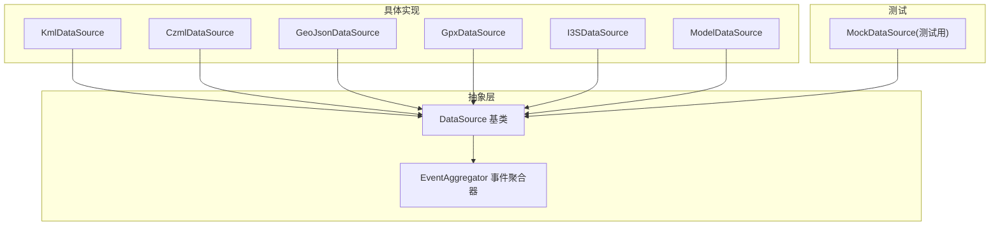
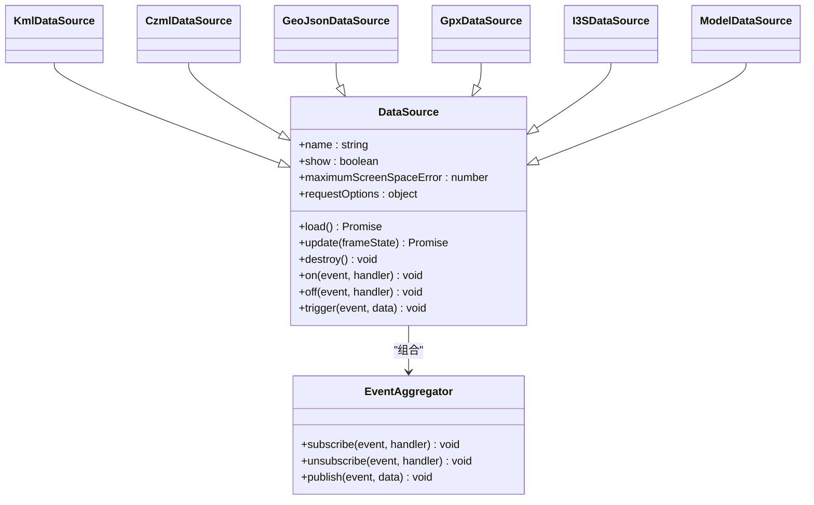
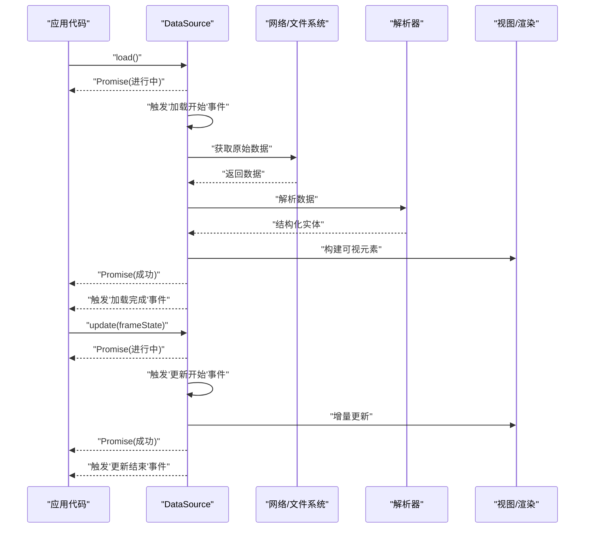
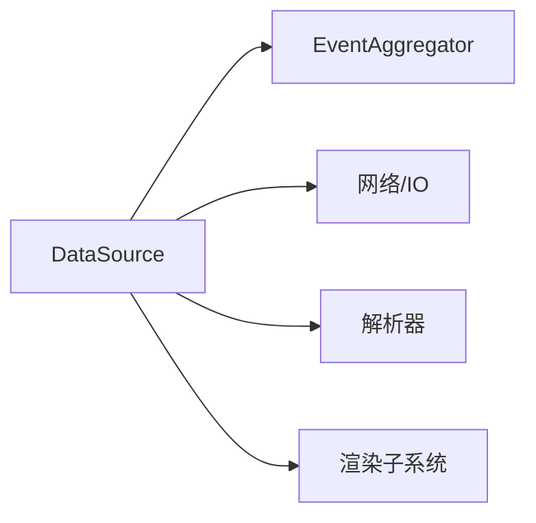

# DataSource基类

<cite>
**本文引用的文件**   
- [DataSource.js](file://Source/Core/DataSource.js)
- [EventAggregator.js](file://Source/Core/EventAggregator.js)
- [KmlDataSource.js](file://Source/DataSources/KmlDataSource.js)
- [CzmlDataSource.js](file://Source/DataSources/CzmlDataSource.js)
- [GeoJsonDataSource.js](file://Source/DataSources/GeoJsonDataSource.js)
- [GpxDataSource.js](file://Source/DataSources/GpxDataSource.js)
- [I3SDataSource.js](file://Source/DataSources/I3SDataSource.js)
- [ModelDataSource.js](file://Source/DataSources/ModelDataSource.js)
- [Specs/MockDataSource.js](file://Specs/MockDataSource.js)
</cite>

## 目录
1. [简介](#简介)
2. [项目结构](#项目结构)
3. [核心组件](#核心组件)
4. [架构总览](#架构总览)
5. [详细组件分析](#详细组件分析)
6. [依赖分析](#依赖分析)
7. [性能考虑](#性能考虑)
8. [故障排查指南](#故障排查指南)
9. [结论](#结论)
10. [附录](#附录)

## 简介
本文件面向希望理解与扩展 Cesium 数据源抽象的开发者，围绕 DataSource 基类的 API、生命周期管理、异步加载机制、错误处理策略、事件系统与更新通知机制进行系统化说明，并提供自定义数据源开发的最佳实践与实现要求。读者无需深入源码即可掌握如何正确继承与实现一个可被 Cesium 框架识别的数据源类型。

## 项目结构
在 Cesium 中，数据源以“抽象基类 + 具体实现”的方式组织：
- 抽象层：定义统一接口与通用行为（如事件聚合、生命周期钩子、默认属性）。
- 实现层：针对特定格式或协议（KML、CZML、GeoJSON、GPX、I3S、模型等）提供解析与渲染逻辑。
- 测试层：Mock 数据源用于验证框架对数据源的通用行为。

图表来源
- [DataSource.js](file://Source/Core/DataSource.js)
- [EventAggregator.js](file://Source/Core/EventAggregator.js)
- [KmlDataSource.js](file://Source/DataSources/KmlDataSource.js)
- [CzmlDataSource.js](file://Source/DataSources/CzmlDataSource.js)
- [GeoJsonDataSource.js](file://Source/DataSources/GeoJsonDataSource.js)
- [GpxDataSource.js](file://Source/DataSources/GpxDataSource.js)
- [I3SDataSource.js](file://Source/DataSources/I3SDataSource.js)
- [ModelDataSource.js](file://Source/DataSources/ModelDataSource.js)
- [Specs/MockDataSource.js](file://Specs/MockDataSource.js)

章节来源
- [DataSource.js](file://Source/Core/DataSource.js)
- [EventAggregator.js](file://Source/Core/EventAggregator.js)
- [KmlDataSource.js](file://Source/DataSources/KmlDataSource.js)
- [CzmlDataSource.js](file://Source/DataSources/CzmlDataSource.js)
- [GeoJsonDataSource.js](file://Source/DataSources/GeoJsonDataSource.js)
- [GpxDataSource.js](file://Source/DataSources/GpxDataSource.js)
- [I3SDataSource.js](file://Source/DataSources/I3SDataSource.js)
- [ModelDataSource.js](file://Source/DataSources/ModelDataSource.js)
- [Specs/MockDataSource.js](file://Specs/MockDataSource.js)

## 核心组件
本节聚焦 DataSource 抽象接口的设计要点与关键方法，帮助读者建立整体认知。

- 设计目标
  - 为不同数据格式提供统一的加载、更新与销毁语义。
  - 通过事件系统对外暴露状态变更与进度反馈。
  - 支持异步加载与增量更新，避免阻塞主线程。
  - 提供可扩展的错误处理与资源清理路径。

- 关键方法与职责
  - load：触发一次完整的加载流程，返回 Promise；内部通常负责初始化、拉取数据、解析并构建内部实体集合。
  - update：在每一帧或按需执行增量更新，返回 Promise；用于时间驱动的数据刷新、可见性变化、属性更新等。
  - destroy：释放所有资源（监听器、缓存、WebGL 资源等），确保对象不可再使用。
  - 事件相关：订阅/发布事件（例如加载完成、错误、更新开始/结束等）。
  - 配置项：名称、显示/隐藏、最大屏幕误差、请求超时、并发限制等。

- 生命周期约定
  - 构造后处于未加载状态；调用 load 进入加载阶段；完成后进入可用状态。
  - 每帧调用 update 进行增量更新；若需要重新拉取数据，可在 update 内判断并触发内部重加载。
  - 不再使用时调用 destroy 进行资源回收；之后任何操作应视为无效。

章节来源
- [DataSource.js](file://Source/Core/DataSource.js)
- [EventAggregator.js](file://Source/Core/EventAggregator.js)

## 架构总览
下图展示了 DataSource 基类与其典型实现之间的继承关系，以及事件聚合器的参与方式。

图表来源
- [DataSource.js](file://Source/Core/DataSource.js)
- [EventAggregator.js](file://Source/Core/EventAggregator.js)
- [KmlDataSource.js](file://Source/DataSources/KmlDataSource.js)
- [CzmlDataSource.js](file://Source/DataSources/CzmlDataSource.js)
- [GeoJsonDataSource.js](file://Source/DataSources/GeoJsonDataSource.js)
- [GpxDataSource.js](file://Source/DataSources/GpxDataSource.js)
- [I3SDataSource.js](file://Source/DataSources/I3SDataSource.js)
- [ModelDataSource.js](file://Source/DataSources/ModelDataSource.js)

## 详细组件分析

### DataSource 基类 API 与生命周期
- 加载流程（load）
  - 校验参数与前置条件。
  - 发出“加载开始”事件。
  - 发起网络请求与数据解析（可能并行）。
  - 构建内部实体集合与可视元素。
  - 发出“加载完成”或“加载失败”事件。
  - 返回 Promise，供上层等待与错误捕获。

- 更新流程（update）
  - 根据 frameState 计算是否需要更新。
  - 触发“更新开始”事件。
  - 执行增量更新（如时间推进、属性插值、可见性切换）。
  - 发出“更新结束”事件。
  - 返回 Promise，允许异步更新。

- 销毁流程（destroy）
  - 取消所有事件监听。
  - 释放内部缓存与外部资源引用。
  - 标记对象为已销毁，后续调用应快速失败或忽略。

- 事件系统
  - 基于事件聚合器实现，支持 on/off/trigger 模式。
  - 常见事件包括：加载开始/完成/失败、更新开始/结束、错误等。
  - 建议在上层应用中对关键事件进行订阅，以实现 UI 反馈与错误提示。

图表来源
- [DataSource.js](file://Source/Core/DataSource.js)
- [EventAggregator.js](file://Source/Core/EventAggregator.js)

章节来源
- [DataSource.js](file://Source/Core/DataSource.js)
- [EventAggregator.js](file://Source/Core/EventAggregator.js)

### 具体数据源实现要点
- KmlDataSource
  - 负责解析 KML 文档，将地标、路径、多边形等转换为 Cesium 实体。
  - 支持样式映射、图标加载与层级结构。
  - 注意外部资源（图标、样式）的跨域与缓存策略。

- CzmlDataSource
  - 解析 CZML 文档，驱动时间动态实体的位置、方向、属性等。
  - 与时间轴紧密耦合，需在 update 中按时间推进进行插值。

- GeoJsonDataSource
  - 解析 GeoJSON 要素，生成点、线、面等几何实体。
  - 支持坐标参考系转换与投影处理。

- GpxDataSource
  - 解析 GPX 轨迹与航点，生成路径与标记。
  - 常用于运动轨迹回放与可视化。

- I3SDataSource
  - 对接 I3S 服务，加载三维瓦片数据。
  - 关注瓦片调度、LOD 控制与内存占用。

- ModelDataSource
  - 加载 glTF/GLB 模型，绑定材质与动画。
  - 需处理纹理压缩、实例化与批渲染优化。

章节来源
- [KmlDataSource.js](file://Source/DataSources/KmlDataSource.js)
- [CzmlDataSource.js](file://Source/DataSources/CzmlDataSource.js)
- [GeoJsonDataSource.js](file://Source/DataSources/GeoJsonDataSource.js)
- [GpxDataSource.js](file://Source/DataSources/GpxDataSource.js)
- [I3SDataSource.js](file://Source/DataSources/I3SDataSource.js)
- [ModelDataSource.js](file://Source/DataSources/ModelDataSource.js)

### 自定义数据源开发指南
- 继承要求
  - 从 DataSource 派生新类，至少实现 load 与 update 的核心语义。
  - 遵循事件约定：在关键阶段触发相应事件，便于上层订阅。
  - 在 destroy 中彻底释放资源，避免内存泄漏。

- 最佳实践
  - 异步优先：所有耗时操作（网络、IO、解析）均应异步化，避免阻塞主循环。
  - 幂等性：多次调用 load 应能安全地重置状态或合并结果。
  - 错误边界：在网络失败、解析异常时抛出明确错误，并触发错误事件。
  - 可配置性：暴露必要的配置项（如最大屏幕误差、请求选项、超时等）。
  - 可观测性：通过事件与日志输出，便于调试与监控。

- 示例参考
  - 可参考 Specs/MockDataSource.js 中的最小实现，了解如何在测试环境中模拟数据源行为。

章节来源
- [DataSource.js](file://Source/Core/DataSource.js)
- [Specs/MockDataSource.js](file://Specs/MockDataSource.js)

## 依赖分析
- 内部依赖
  - DataSource 依赖事件聚合器进行事件分发。
  - 具体实现依赖各自的解析器与网络模块。

- 外部依赖
  - 网络请求库（fetch/XMLHttpRequest）。
  - 解析库（XML/JSON/二进制）。
  - 渲染子系统（实体、几何、材质、瓦片等）。

图表来源
- [DataSource.js](file://Source/Core/DataSource.js)
- [EventAggregator.js](file://Source/Core/EventAggregator.js)

章节来源
- [DataSource.js](file://Source/Core/DataSource.js)
- [EventAggregator.js](file://Source/Core/EventAggregator.js)

## 性能考虑
- 增量更新
  - 在 update 中仅处理必要变更，避免全量重建。
  - 利用时间步进与插值减少频繁计算。

- 并发与限流
  - 合理设置请求并发数，避免压垮服务端或浏览器。
  - 对大文件采用分块下载与流式解析。

- 内存管理
  - 及时释放不再使用的中间数据与临时对象。
  - 在 destroy 中清理所有强引用，防止内存泄漏。

- 渲染优化
  - 调整 maximumScreenSpaceError 平衡精度与性能。
  - 使用批渲染与实例化减少 draw call。

[本节为通用指导，不直接分析具体文件]

## 故障排查指南
- 常见问题
  - 加载失败：检查网络权限、跨域策略、URL 有效性。
  - 解析错误：确认数据格式是否符合规范，必要时启用更严格的校验。
  - 内存泄漏：确认 destroy 是否被调用，是否存在闭包持有引用。
  - 更新卡顿：审查 update 中的耗时操作，考虑异步化或节流。

- 定位手段
  - 订阅“加载失败/错误”事件，打印堆栈与上下文信息。
  - 在关键步骤输出日志，结合浏览器开发者工具分析。
  - 使用 MockDataSource 隔离问题，逐步替换真实实现。

章节来源
- [EventAggregator.js](file://Source/Core/EventAggregator.js)
- [Specs/MockDataSource.js](file://Specs/MockDataSource.js)

## 结论
DataSource 基类为 Cesium 提供了统一的数据接入抽象，通过清晰的生命周期、事件系统与异步机制，使多种数据格式能够以一致的方式集成到渲染管线中。开发者在自定义数据源时，应严格遵循基类约定，注重错误处理与资源管理，并结合性能优化策略，以获得稳定高效的体验。

[本节为总结性内容，不直接分析具体文件]

## 附录
- 术语
  - 数据源：封装了数据加载、更新与销毁逻辑的可复用组件。
  - 事件聚合器：提供事件订阅与发布的轻量级基础设施。
  - 增量更新：仅在必要时更新变化的部分，以提升性能。

[本节为概念性内容，不直接分析具体文件]